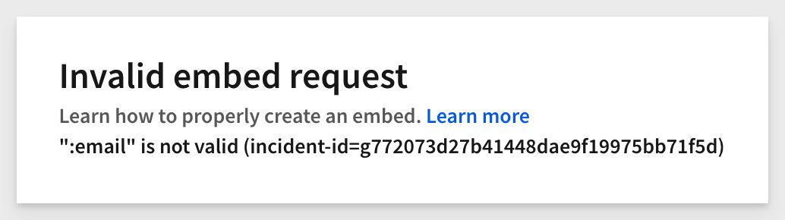

author: pballai
id: embedding 03_using_jwt_claims_and_embed_parameters_v3
summary: embedding 03_using_jwt_claims_and_embed_parameters_v3
categories: Embedding
environments: web
status: published
feedback link: https://github.com/sigmacomputing/sigmaquickstarts/issues
tags: default
lastUpdated: 2025-05-13

# Embedding 03: Using JWT Claims and Embed Parameters

## Overview 
Duration: 5 

This QuickStart guide explains how Sigma uses its server-side embed-API ("API") to facilitate embedding Sigma content into external applications.

Its primary function is to generate a secure, signed JWT (JSON Web Token) that authorizes access to Sigma content at runtime, aligning with the parent application's authentication and security context.

Beyond authentication, the API controls embedded functionality through optional parameters in the JWT payload—such as account types, teams, or custom user attributes

For a full reference, see Sigma’s [Embed URL Parameters](https://help.sigmacomputing.com/docs/embed-url-parameters) documentation.

This QuickStart provides examples and screenshots of required and optional parameters to help developers understand their use.

In this QuickStart, we will use the local host application we created in [Embedding 01: Getting Started](https://quickstarts.sigmacomputing.com/guide/embedding_01_getting_started_v3/index.html?index=..%2F..embedding#0)

<aside class="positive">
<strong>IMPORTANT:</strong><br> Some screens in Sigma may appear slightly different from those shown in QuickStarts. This is because Sigma continuously adds and enhances functionality. Rest assured, Sigma’s intuitive interface ensures that any differences will not prevent you from successfully completing any QuickStart.
</aside>

For more information on Sigma's product release strategy, see [Sigma product releases](https://help.sigmacomputing.com/docs/sigma-product-releases)

If something is not working as you expect, here's how to [contact Sigma support](https://help.sigmacomputing.com/docs/sigma-support)

### Target Audience
Semi-technical users who will be aiding in the planning or implementation of Sigma with embedding. No SQL or technical data skills are needed to complete this QuickStart. It does assume some common computer skills like installing software, using Terminal, navigating folders and copy/paste operations.

### Prerequisites

<ul>
  <li>A computer with a current browser. It does not matter which browser you want to use.</li>
  <li>Access to your Sigma environment.</li>
  <li>Embedding 01: Getting Started is required to complete this QuickStart.</li>
</ul>

<aside class="positive">
<strong>IMPORTANT:</strong><br> Sigma recommends using non-production resources when completing QuickStarts.
</aside>

<button>[Sigma Free Trial](https://www.sigmacomputing.com/free-trial/)</button>

<aside class="negative">
<strong>IMPORTANT:</strong><br> Some features may carry a "Beta" tag. Beta features are subject to quick, iterative changes. As a result, the latest product version may differ from the contents of this document.
</aside>
 


## Required JWT Claims
Duration: 20

JWT is a secure way to pass user and session information. A claim is just a key-value pair in the token's payload — like "sub": "user@example.com" — that tells Sigma who the user is and what they’re allowed to access.

These claims are part of the token payload, which is digitally signed so Sigma can verify the data hasn’t been tampered with.

To securely embed Sigma content, a few claims are mandatory in every JWT. These ensure Sigma can authenticate the request and render the correct content.

**The required claims are:**

**1 - sub:**<br>
The email address of the user logging in.

**2 - exp:**<br>
Expiration time, as the number of seconds since the Unix epoch. This cannot exceed 30 days.

**3 - iat:**<br>
Issued at time, as the number of seconds since the Unix epoch.

**4 - jti:**<br>
A unique ID associated with the session.

<aside class="positive">
<strong>IMPORTANT:</strong><br> It is best practice to always pass a value for account_type and team to ensure that embed users are restricted to the permitted content and role.
</aside>

**5 - account_type:**<br>
Account type for the embed user.

**6 - teams:**<br>
Teams that the embed user belongs to. Pass multiple teams in this format:
["team1", "team2"]

### Optional JWT claims:

**1 - iss:**<br>
Not used by Sigma, but commonly used by applications for additional verification.

**2 - oauth_token:**<br>
The OAuth token used when connecting via OAuth. This token must be encrypted with the embed secret.

**3 - eval_connection_id:**<br>
The connection to use instead of the workbook’s default connection.

<aside class="negative">
<strong>NOTE:</strong><br> Connection switching is not applicable when using write-back features.
</aside>

**4 - first_name:**<br>
Sets the first name of the current embed user. If set, the name will appear in the folder menu and in email notifications.

**5 - last_name:**<br>
Sets the last name of the current embed user. If set, the name will appear in the folder menu and in email notifications.

**6 - ver:**<br>
JWT version number. The only accepted values are 1.0 or 1.1. If nothing is provided 1.0 is assumed.

**7 - aud:**<br>
Audience claim. Must be `sigmacomputing` when using ver: 1.1, and is ignored with ver: 1.0.


<!-- END OF SECTION-->

## Passing User Attributes via JWT Claims
Duration: 5

## Passing User Attributes via JWT Claims
Duration: 5

Sigma user attributes (UAs) act like named variables that personalize content and control access. These attributes are **defined by administrators in Sigma** and are used across connections, datasets, and dashboards.

To pass values into these attributes at runtime, the parent application includes them in the JWT under a special object called `user_attributes`.

**What does this look like in the JWT?**
```json
{
  "user_attributes": {
     "REGION": "EAST",
     "TEAM": "SALES"
  }
}
```

This tells Sigma: “Use the value `EAST` for the user attribute `REGION`, and `SALES` for `TEAM` — just for this session.”

The names must **exactly match** the user attributes created in Sigma.

Some common use-cases for UAs are to set values for:

1: Enforcing row-level security:<br>
2: In custom SQL, as a where clause:<br>
3: Dynamic warehouse role switching:<br>

The specific parameter is:

**1 - user_attributes:**<br>
User attributes for the embed user. Pass multiple attributes in this format: {"attribute1":"value1","attribute2":"value2"}.

### An example
Let's consider a use case where we want to pass a UA for the user's sales region and use that to filter a table.

In Sigma, under `Administration` > `User attributes` we created a new UA called `Store_Region` and set the default value to `East`:


<aside class="negative">
<strong>NOTE:</strong><br> We could also assign this UA to specific teams or people, but that is not required as we will pass that information in the embed anyway.
</aside>

Next, we added a column to a table containing `Store Region` and set a formula to display `True` or `False` if the UA matches the `Store Region` value.

We grouped on the `Region Mix` column just to make it easy to see the result.

The formula we used was:
```code
Contains(CurrentUserAttributeText("Store_Region"), [Store Region])
```

As a result, all rows with the `East` store region are marked `True`:


By setting a filter on the `Region Mix` column to show only `True` values, only `East` rows remain:


After publishing the sample workbook, we tested passing the custom UA for `Store_Region` using the sample embedding app.

Set a new value for `Store_Region` in the `.env` file:


After reloading the sample application in the browser, we can see the UA enforcing the `West` region:


If we comment out the UA in `.env` and reload the browser, we see only the `East` region, even though no value was passed:


This happens because we set a default value of `East` when creating the UA in Sigma.

If we remove the default value from the UA configuration in Sigma, the embed displays `No data`.

This behavior may or may not be desirable.

For example, we might choose to show all rows when no value is passed.

In that case, we can adjust the Sigma formula on the `Region Mix` column to:
```code
IsNotNull(CurrentUserAttributeText("Store_Region")) or Contains(CurrentUserAttributeText("Store_Region"), [Store Region])
```

[IsNotNull](https://help.sigmacomputing.com/docs/isnotnull)	determines if the cell has a value; True or False. In our case, all the rows will have a value since none are null in the table.

We now see a mix of store regions (after ungrouping the table for readability) and the expected ~4.5M rows:


<aside class="positive">
<strong>IMPORTANT:</strong><br> The combination of user attributes and formulas in Sigma can unlock some really interesting use cases!
</aside>


<!-- END OF SECTION-->

## Additional URL Query Parameters
Duration: 5

## Additional URL Query Parameters
Duration: 5

In addition to the JWT itself, the final Sigma embed URL can include **query parameters** — small key-value pairs added to the end of the URL. These control how the embedded content appears or behaves.

**What is a query parameter?**  
A query parameter is a part of the URL that comes after a `?` or `&` and looks like `:key=value`. For example:  
```
https://app.sigmacomputing.com/embed/abc123?:embed=true&:disable_mobile_view=true
```

These are passed alongside the JWT and help customize the user experience (e.g., hiding menus or tooltips).

The following parameters must be appended to the base embed URL:

**1 - disable_mobile_view:**<br>
If you set this boolean parameter to yes, workbooks won't automatically resize to the mobile layout. This can be useful when you do not want the content to be reduced to a mobile layout.

**2 - hide_folder_navigation:**<br>
If set to true, it hides the folder navigation options in the bottom left.

By default (false), it looks like this:


When set to true, it looks like this:


Some items in the folder list (for example `Send now`) are controlled in the `Account Type` configuration inside Sigma.

**3 - hide_menu:**<br>
If set to `true`, hides the menu in the bottom-left for saved workbooks.

By default (false), it looks like this:


When set to true, it looks like this:


**4 - hide_tooltip:**<br>
If set to true, tooltips will no longer display when a user hovers over them.

This applies to charts (line, bar, area, etc) and map chart marks. 

**5 - lng:**<br>
Apply an existing translation to an embed. Localization allows workbook editors to translate workbook text to other locales.

Translations are managed per workbook and are available when viewing embedded workbooks and workbook previews.

For more information, see [Supported languages and locales](https://help.sigmacomputing.com/docs/manage-workbook-localization#supported-languages-and-locales)

**6 - menu_position:**<br>
Changes the position of the toolbar to `top`, `bottom`, or `none`.

Setting it to `none` removes the toolbar.

If this value isn't set, it defaults to `bottom`.

For example, if we set `menu_position` to `top` we see it at the top of the embed:


**7 - responsive_height:**<br>
Setting this to true allows developers to access the `workbook:pageheight:onchange` JavaScript event.

This is discussed in detail in the QuickStart: [Embedding 11: Responsive Embeds](https://quickstarts.sigmacomputing.com/guide/embedding_11_responsive_embeds_v3/index.html?index=..%2F..embedding#0)

**8 - theme:**<br>
Use any of the default themes (`Light`, `Dark`, or `Surface`), or any custom themes defined in your organization. 

Use the name of the theme as the value. **The value is case-sensitive.**

Example with the `Dark` theme applied:


<aside class="positive">
<strong>IMPORTANT:</strong><br> Embed customers can create their own custom themes, ensuring Sigma content aligns with the parent application's styling.
</aside>

For more information, see [Create and manage workbook themes](https://help.sigmacomputing.com/docs/create-and-manage-workbook-themes)


<!-- END OF SECTION-->

## Manual Testing
Duration: 5 min

The sample project is set up to allow us to test URL query parameters manually.

There is a dedicated section in the `.env` file for each of these, with default values preset for convenience:


The `embed-api.js` file has been modified to include all the parameters (as of this QuickStart), allowing us to evaluate their behavior.

To test, we only need to set a new value for the parameter we are targeting in `.env` and save the change.

Next, set a valid value for theme in `.env`. For example, choose `Dark `as the new theme:


<aside class="positive">
<strong>IMPORTANT:</strong><br> URL parameters are case sensitive. 
</aside>

Ensure the `BASE_URL` is set in the `# QS: parameters_userattributes` section of the `.env` file. 

Since we completed the first QuickStart in this series, we can reuse the `GETTING_STARTED_BASE_URL` value. 

The `CLIENT_ID` and `SECRET` are also present, so we know those work:


In VSCode, open a new Terminal session inside the `embedding_qs_series` project and run the following command:
```code
npm start
```


In a browser, open:
```code
http://localhost:3000/
```

Select the `03: Parameters & User Attributes` item from the list and click `Go`:


The URL Parameters section will confirm the `Dark `theme was passed, and the embed will render accordingly:


All images in `section 4, Additional URL Query Parameters`, were generated using this method.

You can now configure additional tests as needed.


<!-- END OF SECTION-->

## Legacy Parameters
Duration: 5

Some Sigma customers may be using these older parameters which are no longer supported with JWT embeds. These parameters have been replaced by other functionality as the product has evolved and are listed here for reference only.

### Parameters replaced by account feature permissions

**1 - hide_schedule:**<br>
**2 - hide_run_as_recipient:**<br>
**3 - hide_send:**<br>

In `Administration` > `Account Types`, there are options under the `Sharing/Folders` group that manage permissions for these features:


### Events
These parameters control information being emitted from the iframe:

**1 - loading_bg:**<br>
**2 - loading_text:**<br>

Instead, use the `workbook:loaded` event to track when content is ready.

### Show footer
The following parameter has been replaced by the `menu_position` parameter:

**1 - show_footer:**<br>


<!-- END OF SECTION-->

## Common Error Messages
Duration: 5

The following are potential error messages and description to aide in troubleshooting embeds:

 <ul>
      <li><strong>EEXIST:</strong> Indicates duplicates exist. Duplicate team, duplicate user, etc. This is unlikely to occur in embeds but possible if a bug is introduced.</li>
      <li><strong>EPERM:</strong> The requested operation is not permitted. For example, if a user forgets to share an embed with a team, account type does not give you edit access to a workbook.</li>
      <li><strong>ESTALE:</strong> Unlikely to happen for embeds, but not impossible if a bug is introduced.</li>
      <li><strong>ENOENT:</strong> Object does not exist (or no longer exists). If you try to bring up a workbook which does not exist.</li>
      <li><strong>EACCES:</strong> Permission denied. For example, when you do not have access to edit a workbook, and try to.</li>
      <li><strong>EINVAL:</strong> Invalid argument. For example, when the URL contains a team that does not exist.</li>
      <li><strong>ETIMEDOUT:</strong> Request timed out. For example, query did not respond from warehouse in specified timeframe.</li>
      <li><strong>NETWORK:</strong> Unable to connect to Sigma. Typically indicates a local network error.</li>
      <li><strong>UNKNOWN:</strong> This is the default API error message and acts as a "catch-all".</li>
</ul>

### Parameter-based error messages

**1: Invalid embed_path:**<br>


**2: Invalid Embed secret:**<br>


**3: Invalid embed mode (legacy configurations only):**<br>


**4: Invalid clientID:**<br>


**5: Invalid email:**<br>


**6: Invalid external_user_team:**<br>

However, if the team is left completely blank, this message will be shown instead:<br><br>


**7: Session length has been exceeded:**<br><br>

When an invalid session_length is sent (e.g., a value of '25920001', which exceeds the maximum of '2592000'), the embed page will display this message<br>


**8: Invalid time:**<br> 
For example, if the '/1000' is removed from the formula, the embed page will show this message:


**8: Invalid kid parameter:**<br> 
The signing key reference does not have the "embed" privilege enabled, likely an incorrect Sigma access credentials (Client Id / Secret) are being used or the credentials do not have `Embed` enabled for them.


**9: exp cannot be in the past:**<br> 
The JWT session length has caused the JWT token to expire.


<!-- END OF SECTION-->

## What we've covered
Duration: 5

In this QuickStart, we explored how Sigma leverages JWT claims and URL parameters to deliver secure, personalized embedded experiences.

You learned how Sigma’s server-side embed API generates signed URLs using JWTs, controlling authentication, authorization, and user experience at runtime.

By now, you should feel comfortable configuring Sigma embeds with the right combination of claims, attributes, and parameters to meet your application’s needs.

**Additional Resource Links**

[Blog](https://www.sigmacomputing.com/blog/)<br>
[Community](https://community.sigmacomputing.com/)<br>
[Help Center](https://help.sigmacomputing.com/hc/en-us)<br>
[QuickStarts](https://quickstarts.sigmacomputing.com/)<br>

Be sure to check out all the latest developments at [Sigma's First Friday Feature page!](https://quickstarts.sigmacomputing.com/firstfridayfeatures/)
<br>

[](https://twitter.com/sigmacomputing)&emsp;
[](https://www.linkedin.com/company/sigmacomputing)&emsp;
[](https://www.facebook.com/sigmacomputing)


<!-- END OF WHAT WE COVERED -->
<!-- END OF QUICKSTART -->
