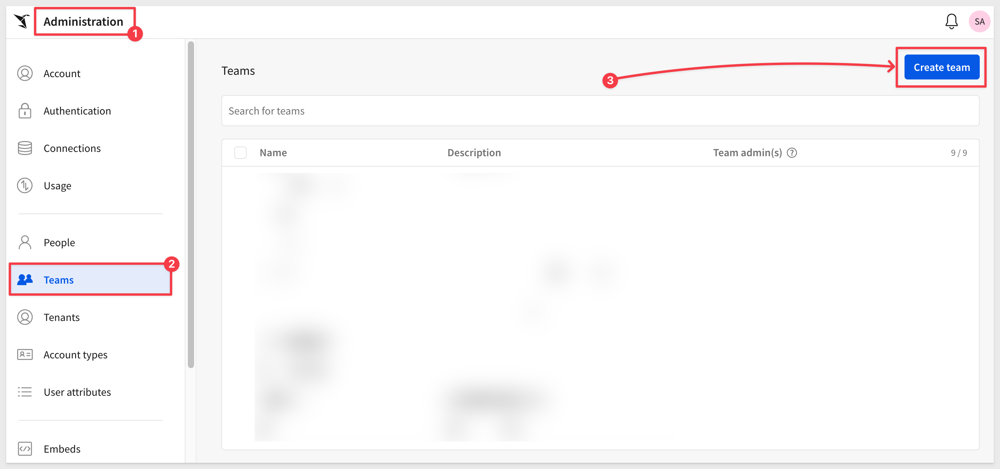
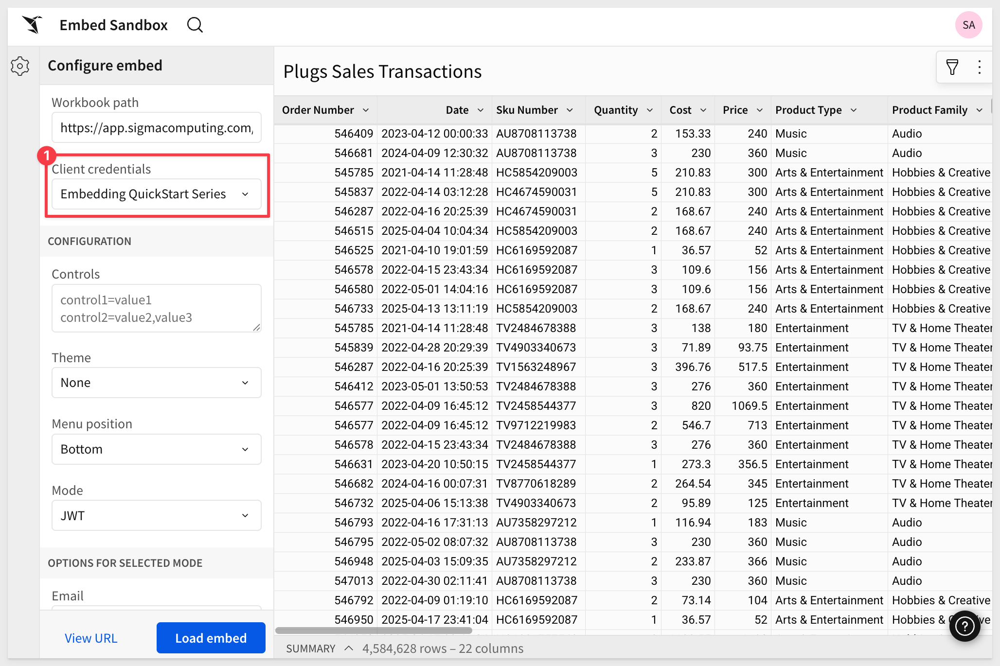

author: pballai
id: embedding_01_getting_started_v3
summary: embedding_01_getting_started_v3
categories: Embedding
environments: web
status: Published
feedback link: https://github.com/sigmacomputing/sigmaquickstarts/issues
tags: embedding
lastUpdated: 2024-05-05

# Embedding 01: Getting Started

## Overview 
Duration: 5 

This QuickStart introduces you to the user interface and embedding capabilities of Sigma Workbooks. It is part one of a series of Fundamentals QuickStarts focused on embedding and should be completed first.
 
We have broken the different types of embeds into separate documents based on use cases, allowing users to focus on those areas of interest and improve overall readability and supportability of each document.
 
**This QuickStart is foundational to all the other embedding QuickStarts.** 

Additionally, it will demonstrate how to set up a local web application so that you can simulate using embedding on your local computer. 

Sigma also provides an embed sandbox that is built into the product. For more information, see [Test an embed URL in the embed sandbox](https://help.sigmacomputing.com/docs/test-an-embed-url-in-the-embed-sandbox)

The local web application (e.g., native application) refers to the customer-developed application that Sigma is embedded into.

We will use code from a public Git repository, VS Code, Node.js, Javascript and HTML in this QuickStart series. 

<aside class="negative">
<strong>NOTE:</strong><br> There are many programming languages and libraries you can use to develop a server-side application. Node.js is the one we will be using today. The sample code provided is simplified and commented to assist in your learning.
</aside>

For those interested, there is a comprehensive ebook, [The Ultimate Guide To Embedded Analytics](https://www.sigmacomputing.com/white-papers/white-paper-embedded-analytics) 

<aside class="positive">
<strong>IMPORTANT:</strong><br> Some screens in Sigma may appear slightly different from those shown in QuickStarts. This is because Sigma continuously adds and enhances functionality. Rest assured, Sigma’s intuitive interface ensures that any differences will not prevent you from successfully completing any QuickStart.
</aside>

For more information on Sigma's product release strategy, see [Sigma product releases](https://help.sigmacomputing.com/docs/sigma-product-releases)

If something is not working as you expect, here’s how to [contact Sigma support](https://help.sigmacomputing.com/docs/sigma-support)

### Target Audience
Semi-technical users who will be aiding in the planning or implementation of Sigma with embedding. No SQL or technical data skills are needed to complete this QuickStart. It does assume some common computer skills like installing software, using Terminal, navigating folders and copy/paste operations.

### Prerequisites

<ul>
  <li>A computer with a current browser. It does not matter which browser you want to use.</li>
  <li>Access to your Sigma environment.</li>
  <li>Some familiarity with Sigma is assumed. Not all steps will be shown, as the basics are assumed to be understood.</li>
 </ul>

<aside class="positive">
<strong>IMPORTANT:</strong><br> Sigma recommends using non-production resources when completing QuickStarts.
</aside>

<button>[Sigma Free Trial](https://www.sigmacomputing.com/free-trial/)</button>

<aside class="negative">
<strong>IMPORTANT:</strong><br> Some features may carry a "Beta" tag. Beta features are subject to quick, iterative changes. As a result, the latest product version may differ from the contents of this document.
</aside>
 


## About Sigma Embedding
Duration: 5 min

There are two types of embedding in Sigma: **Secure with JWT** and **Public**. We will cover public in another QuickStart as that is very straightforward and not as common a use case. 

### Secure embedding with JSON Web Tokens (JWT)
JWT is the preferred method for secure embedding with Sigma. [JWT](https://en.wikipedia.org/wiki/JSON_Web_Token) which is an open, industry-standard [RFC 7519](https://www.rfc-editor.org/rfc/rfc7519) method for representing claims securely between two parties.

JWT is used when a company embeds Sigma content directly into a native application that they want to embed Sigma content directly into while retaining security, tenancy, and a tailored user experience.
 
For example, a company may have an internal web site that employees have to log into using single sign-on where they want to provide a dashboard that only shows data filtered for each employee’s region. 

Another common use case is where a company has a web portal that their customers or partners can securely log into to see data filtered for their own organization. 
 
Sigma also allows you to extend or create custom secure embed experiences as well.

These are the high-level use cases of JWT embedding that are most commonly seen:


Sigma supports embedding in other third-party applications like Salesforce or Streamlit:

[QuickStart: Embedding 11: Embed into Salesforce.](https://quickstarts.sigmacomputing.com/guide/embedding_12_secure_embedding_into_streamlit/index.html?index=..%2F..index#0)

[QuickStart: Embedding 12: Secure Embedding into Streamlit.](https://quickstarts.sigmacomputing.com/guide/embedding_12_secure_embedding_into_streamlit/index.html?index=..%2F..index#0)

### Benefits of JWT
Signing your secure embed URLs with JWTs has several advantages:

- JWTs are compact, URL-safe tokens that can be digitally signed, ensuring that the data they contain is tamper-proof.

- Embed developers no longer have to use the Sigma UI to generate embed paths; they may use the URL instead.

- Embedding workbooks, pages and individual visualizations is supported.

- JWT-signed embed URLs can authenticate internal Sigma users to access embedded content with the same email address they use for their Sigma account. 

- When using JWT-signed URLs with Sigma, you have the option to disable automatic embed user account provisioning for non-Sigma users, effectively restricting your embed content to the users you have explicitly provisioned in Sigma or your IdP.

<aside class="positive">
<strong>REPLAY ATTACK PREVENTION:</strong><br> A few existing embed customers are likely familiar with Sigma’s "signed URL" embed-API, which uses a nonce to ensure that the constructed URL is for one-time use only. Similarly, JWTs are also for one-time use. 

<aside class="negative">
<strong>NOTE:</strong><br> The existing secure Embed-API solution will continue to work. Customers will not have to make any changes immediately, although JWT is likely to become the preferred solution over time, due to its many benefits.
</aside>

When a JWT is issued, the jti claim — a unique identifier for the token is stored server-side. 

When the JWT is used (e.g., to access an embedded Sigma dashboard), the server checks whether the jti has already been seen. 

If it has, the token is rejected as a replay attempt, ensuring it cannot be reused.
</aside>

We will cover JWT more in the next section.

### Public embedding
The simplest use case we provide is called public embedding. 

Customers use this when security is not required, but there is a need to embed Sigma content. 

For example, embedding some KPIs or charts on a company’s public website that anyone can see. 

We demonstrate Public embedding in a separate [QuickStart: Embedding 02: Public Access.](https://quickstarts.sigmacomputing.com/guide/embedding_02_public_access/index.html?index=..%2F..index#0) 


<!-- END -->

## How JWT Works
Duration: 5

A JSON Web Token (JWT) is a compact, URL-safe means of representing claims to be transferred between two parties.

The claims in a JWT are encoded as a JSON object that is used as the payload of a JSON Web Signature (JWS) structure or as the plaintext of a JSON Web Encryption (JWE) structure, enabling the claims to be digitally signed or integrity protected with a Message Authentication Code (MAC) and/or encrypted.

The remaining discussion in this section is intended for those less familiar with JWT, how it is structured, its structure, transaction flow, and benefits. Feel free to jump to the next section if you just want a demonstration of JWT in Sigma.

In the typical workflow, a client requests embedded content using a JSON Web Token (JWT), and the server processes, validates, and serves the embedded content based on user credentials and environment variables.

Here is a simplified authentication flow:


What follows is a more in-depth description of the JWT workflow in Sigma.

### Step-by-Step JWT Flow:

**1. Client Request (i.e., end user's web browser):**<br>
The client (e.g., the end-user's browser in the native application) sends a request to the server to obtain a URL for accessing embedded Sigma content. This request may include user-related information, such as identity or a general request for access to Sigma content.

**2. Server-Side JWT Generation (i.e., customer-created embed API):**
***Credential Handling:***<br>
The server securely manages the necessary credentials to generate the JWT, such as the secret key (EMBED_SECRET) and client ID (EMBED_CLIENT_ID). These credentials ensure that the JWT is properly signed and trusted by Sigma.

***User Claims:***<br>
The server retrieves or determines relevant claims about the user (from the customer's authentication provider), such as their email (sub), roles, or team memberships. These claims are vital for defining what the user can do in the embedded Sigma content and ensure that permissions are enforced correctly.

***JWT Creation:***<br>
The server combines these user claims with the necessary credentials to create a JWT. The JWT is signed using the server’s secret key, ensuring its integrity and authenticity. The JWT contains claims that specify key information, including:

- Who the user is (email, user roles)
- What permissions they have
- How long the JWT is valid (expiry or exp claim)

This process ensures each JWT is unique, secure, and reflects the user's specific access rights.

**3. Response with Signed URL:**<br>
The server responds to the client with a signed URL, which includes the JWT as a query parameter. For example, the URL might look like:
```code
https://app.sigmacomputing.com/<org-slug>?jwt=<jwt>
```

This URL includes the signed JWT that will be used to authenticate and authorize the user when they access the embedded Sigma content.

**4. Client Accesses the Signed URL:**<br>
When the client (e.g., the end-user's browser in the native application) loads the signed URL, Sigma verifies the JWT. Sigma ensures that:

- The JWT signature is valid, confirming that the token has not been tampered with.
- The claims (like sub, roles, exp) are still valid, checking whether the user is authorized and whether the token is within its allowed time frame.
- Replay protection is enforced by validating the jti (JWT ID) claim, ensuring that the token is not reused maliciously.

**5. Sigma Provides Embedded Content:**<br>
If the JWT passes all verification checks (valid claims, signature, jti uniqueness, etc.), Sigma delivers the requested embedded content. The content provided matches the user’s permissions and scope, ensuring that users can only access what they are authorized to view.

This workflow ensures secure, one-time use access to Sigma’s embedded content, protecting both user data and application integrity.

### Structure of JWT:
An actual JWT is composed of three parts: `Header`, `Payload`, and `Signature`, which are concatenated with periods (.) to form a single string:

**Header:** Typically consists of two parts: the type of token (JWT) and the signing algorithm (e.g., [HMAC SHA256](https://en.wikipedia.org/wiki/HMAC)).

**Payload:** Contains the claims. Claims are statements about an entity (typically, the user) and additional data. There are three types of claims: registered, public, and private claims.

**Signature:** Used to verify that the sender of the JWT is who it says it is and to ensure that the message wasn’t changed along the way.

#### Claims in Sigma

**1. Registered Claims:** These are predefined, standardized claims that are recommended to be used in a JWT. They have specific purposes and are commonly recognized across implementations.

Examples:<br>
- sub (Subject): This claim identifies the subject of the JWT, usually the user. In Sigma, it is often the email of the user accessing the embedded content.

- iss (Issuer): This claim identifies the issuer of the JWT. In Sigma, it is the `Client_ID` used to issue the token.

- jti (JWT ID): This is a unique identifier for the JWT. It’s used to prevent the JWT from being replayed.

**2. Public Claims:** These are claims that can be defined at will by those using JWTs.

Examples:<br>
- account_type: The type of account the user has (e.g., Build, Act, Analyze). 

- teams: Indicates the teams to which a user belongs. 

**3. Private Claims:** These are custom claims created to share information between parties that agree on using them but do not need to be registered or standardized. They are specific to the application and are not meant to be shared beyond the agreed-upon parties.

Examples:<br>
- custom user attributes
- eval_connection_id

For more information on JWT claims in Sigma, see [Create an embed API with JSON Web Tokens](https://help.sigmacomputing.com/docs/create-an-embed-api-with-json-web-tokens)


<!-- END OF SECTION-->

## Git Repository
Duration: 5

### Clone the Git Repository Project Folder
We have made sample project code available in a public GitHub repository to save time.

While you may clone the entire repository (it is not that large), we want to avoid cloning portions of the repository that aren't immediately relevant. 

Instead, we will use VSCode and terminal to perform a git `sparse-checkout` of the specific project folder we are interested in. This involves a few extra steps, but results in a cleaner local project folder.

Open `VSCode` and a new `Terminal` session.

Create a new directory in a location of your choice, using the command:

For example:
```code
mkdir sigma_quickstarts
```

Change to the new directory:
```code
cd sigma_quickstarts
```

Execute the terminal command:
```code
git init
```

Add the remote repository as the origin:
```code
git remote add -f origin https://github.com/sigmacomputing/quickstarts-public.git
```

No errors should show:


Enable sparse checkout:
```code
git config core.sparseCheckout true
```

Specify the folder you want to clone by adding it to the sparse-checkout configuration:
```code
echo "embedding_qs_series_2" >> .git/info/sparse-checkout
```

Pull the specified folder from the repository:
```code
git pull origin main
```
<aside class="positive">
<strong>IMPORTANT:</strong><br> The next step requires Node.js. If it has never been installed on your machine, install it from the official site:

[Download Node.js](https://nodejs.org/)

We recommend installing the **LTS (Long Term Support)** version.

Once installed, you can verify the installation in Terminal with:

node -v
npm -v
</aside>

Finally, load node into the local project:
```code
npm install
```

After the command runs, click the button to `Open Folder`:


Navigate to where your folder is and click `Open`.

We can now see the project called `embedding_JWT` with the files stored in the `jwt` folder:


### Additional node.js packages
We need to install two Node.js packages that provide some additional "convenience functionality". 

**1: nodemon:**<br>
This package is a development tool that automatically restarts our Node.js application whenever it detects changes in specific code files. This streamlines development by eliminating the need to manually restart the server after each change.

**2: jsonwebtoken**<br>
We use this package to decode a JWT in the VSCode terminal. This allows us to read the payload and header data from the token without verifying its authenticity. This is helpful when you need to inspect the information embedded in the token for non-secure contexts or for inspection/debugging purposes.

To install these two packages, open a new terminal window in VSCode in the project folder.

Run the command:
```code
npm install jsonwebtoken
```

and
```code
npm install nodemon
```

The expected output is:


The project has almost everything we need, but we will need set up some things in Sigma that will be used throughout this QuickStart series.


<!-- END OF SECTION-->

## Sample Native App
Duration: 5

The sample app is built with Node.js, HTML, and JavaScript.

Each QuickStart includes its own index.html file inside the corresponding QuickStart folder.

We took some liberties with styling and layout, but there are just a few core files you need to understand:


<aside class="positive">
<strong>IMPORTANT:</strong><br> The primary things required to embed Sigma into any native application are embed-api.js and an iframe. We've added extra functionality to the sample app to make the demonstration of various topics easier for the reader.
</aside>

### Environment file (.env)
The `.env` file contains configuration settings for the embedding server and each QuickStart. It helps separate runtime parameters (variables) like client secrets and user identity from the source code.

The file is organized into three key sections:

**1:** Global Settings<br>
Shared across all QuickStarts (e.g. CLIENT_ID, SECRET, SESSION_LENGTH, PORT).

**2:** Default Embed User<br>
Provides fallback identity parameter values (EMAIL, ACCOUNT_TYPE, TEAMS) to be used if not overridden by a specific QuickStart.

**3:** QuickStart-Specific Blocks<br>
Each QuickStart has a dedicated section (e.g. GETTING_STARTED_BASE_URL) that may override the user, team, base URL, and so on.

The .env file provides fallback logic for each JWT:

- The code checks if QuickStart-specific settings exist (like GETTING_STARTED_EMAIL).
- If not found or blank, it falls back to the default user values defined in the shared block.

This allows you to maintain a consistent test user by default, and easily override it per QuickStart as needed for different workflows.

Open the `.env` file. We will copy / paste key values as we progress through sections of this QuickStart:


<aside class="positive">
<strong>IMPORTANT:</strong><br> Parameters in the "Default Embed User" group of .env will be overridden by parameters in the other groups. It is there for convenience as often the parameters are common, so having a default group is merely a time saver. Nothing more. 
</aside>


<!-- END OF SECTION-->

## Users, Account Types
Duration: 5

Using Sigma, we’ll create content leveraged by the QuickStart embed series. This will make things easier later.

We need to provision `Account Types`, `Teams`, and `Workspaces` in Sigma. This will allow us to group users and set various permissions. 

Sigma has some features that will make this easier for us.

### Users
We already have an administrative user, and we will add additional users on-the-fly from our native application. 

Recall that embed users are added at runtime—the first time they access any content embedded in the parent application.

Their permission level is also set automatically by the embed API, via a required parameter that specifies the Sigma account type they are assigned. 

<aside class="positive">
<strong>Automatic embed user account creation:</strong><br>
Some customers prefer to only use their own authentication provider to manage users and have authenticated users be automatically created in Sigma upon successful logon to the native application.

When using JWT-signed URLs for your secure embeds, administrators have the option to disable automatic embed user account creation and update for non-Sigma users (e.g. embed users). 

If disabled, users can be restricted to the content explicitly provisioned in Sigma or your IdP. 

By default, automatic user creation is enabled, and Sigma will automatically create embed users and assign them to the team you specify in the teams claim, and will update those embed user team assignments if new teams are passed in the teams claim.
</aside>

<aside class="negative">
<strong>NOTE:</strong><br> Users in Sigma can be found under Administration > People.
</aside>

### Account Types
Account types enable the selection of granular permissions that determine how users access and interact with data and documents in Sigma.

Each user is assigned a single account type and can only have one at a time.

Sigma provides a few default account types and these support the common use cases. Administrators can also create custom account types to allow or restrict specific Sigma features.

To keep things simple, we’ll use two of the default account types:

- View: This is recommended for users who need access to prepared data and insights.
- Build: Recommended for users who model, transform, and analyze data.

For more information see: [Create and manage account types](https://help.sigmacomputing.com/docs/create-and-manage-account-types)

### Teams
Teams let you create user groups in Sigma. When you grant access and permissions to a team, the grants apply to all members assigned to the team. 

For more information see: [Create and manage teams](https://help.sigmacomputing.com/docs/manage-teams)

We want to create a team in Sigma so our embed users can be assigned to it.

Log into Sigma, using an administrator account. 

Navigate to `Administration` > `Teams` and click `Create team`:



Name the team `Sales_People`, check the box to also create a workspace. Click `Create`.


<aside class="negative">
<strong>NOTE:</strong><br> We do not have to add any members as Sigma's automatic embed user account creation will handle that for us.
</aside>

Create another team called `Sales_Managers`, set the team to `Private` and check the box to also create a workspace. Click `Create`:


Exit `Administration` by clicking the Sigma  icon.


<!-- END -->

## Workspaces
Duration: 5 min

Workspaces allow folders and documents to be compartmentalized, categorized, and easily shared with the correct people. 

They can be shared among users and teams via permission grants.

Workspaces are managed by organization admins, but admins are not automatically granted permission to other team workspaces. However, admins can access to an additional `ALL WORKSPACES` tab. 

Native Sigma users (those who log in directly to Sigma) will have access to workspaces when they are shared with a team they belong to, or explicitly shared with them.

For example, if we want to give all the users who are members of the `Sales_Managers` team access to the `Sales_People` workspace, we can click `Share...`:


We can search for the team and give them a specific permission level. In this case, we will give the `Can contribute` permission to the `Sales_Managers` team:


If we reopen the `Share...` model for `Sales_People`, we can also adjust the `Sales_People` to `View` only:


If we open the `Share...` model for the `Sales_Manager` workspace we see that members of the `Sales_People` team will have no access to the workspace:


Let's grant them `Can explore` permission. This implies that workbooks in this workspace are curated by someone else. Managers can explore the data to the lowest level of granularity, but cannot contribute new content.

In both workspaces, the administrator has `Can manage` permissions. 

This functionality provides a lot of flexibility in how users access shared work. 

There are many ways to provide user separation. In a typical smaller organization, we’d likely have teams for business users like Finance, Operations, and others.

For more information, see: [Manage workspaces](https://help.sigmacomputing.com/docs/manage-workspaces)


<!-- END -->

## Client credentials
Duration: 5

Client credentials (a unique client ID and embed secret) are the foundation of secure embedding.

Sigma uses the client ID to determine which embed secret is referenced in a request. Each time a request is made, the server-side embed API uses the embed secret to generate an encrypted signature.

Together, the client ID and embed secret create a robust security framework for server-side interactions with Sigma.

Navigate to `Administration` and scroll down to `Developer Access`.

Click `Create New`:


In the `Create client credentials` modal, select `Embedding`, give it a name, and assign an administrative user as the owner.


<aside class="negative">
<strong>NOTE:</strong><br> Client credentials can also be used for access to Sigma's REST API if the "REST API" checkbox is also selected.
</aside>

Click `Create`.

<aside class="positive">
<strong>IMPORTANT:</strong><br> For security purposes, Sigma provides a one-time view of the embed secret at the time of creation and does not display it again. Because the secret is non-retrievable, it's important that you store the secret securely when you create it.

If you lose the embed secret, or it becomes compromised, you can revoke it and generate a new one; however, this invalidates the previous secret and all embeds that use it. When a new secret is generated, you must modify the embed API and update all existing embeds.
</aside>


Copy and paste the `Client ID` and `Secret` into the respective locations in the `.env` file, in the `# Shared by all QuickStarts` grouping.


<!-- END -->

## Select Content to Embed
Duration: 5 

Any Sigma URL can be embedded, assuming the proper permissions are passed along as parameters.

Sigma is flexible and offers different workflows for creating content based on the source data.

For example, we could first create a [data model](https://help.sigmacomputing.com/docs/intro-to-data-models), set permissions on it, and then save it off for later use in a workbook. We would then create a workbook with a table that shows data from the data model we saved earlier.

If you are interested in data modeling in Sigma, see: [Fundamentals 10: Data Modeling](https://quickstarts.sigmacomputing.com/guide/fundamentals_10_data_modeling/index.html?index=..%2F..index#0)

<aside class="negative">
<strong>NOTE:</strong><br> To leverage the features in secure embedding, permission to your data is required at some level. Creating a data model and granting permissions to it is considered a best practice.
</aside>

To minimize the steps, we will leverage a different workflow.

<aside class="positive">
<strong>IMPORTANT:</strong><br> In either case, customers should evaluate the many options in Sigma against their own information security, compliance and governance policies, in order to make the best choices for their organizations. Sigma will be there to assist in these decisions, at any time you need.
</aside>

### Create a Workbook with Sample Data
In Sigma, return to the homepage and click the `+ Create new` button and click `Workbook`:


Drag a new `Table` from the `Data` group on the `Element bar`:


Click `Select source`

Sigma allows users to search for tables by name; type `hands` in the search bar and select the `PLUGS_ELECTRONICS_HANDS_ON_LAB_DATA` table from the `RETAIL` schema:


This opens the selected table in a new (unsaved) workbook that carries the temporary name `Exploration`:


We can rename the table by double-clicking on the table name and changing it to `Plugs_Sales_Transactions`.

Click the `Save As` button, navigate to the `Sales_People` workspace and save the workbook with the name `Getting_Started_QuickStart`.


You may have noticed that Sigma provides `Folders`, a `My Documents` folder, as well as `Workspaces`. This enables a variety of use-cases to be possible with regards to how documents are stored, managed and shared with others.

### Share the Workbook
Check the sharing settings:


Our two teams are already listed, as the permissions are inherited from the workspace, which is assigned to the `Sales People` team.


<aside class="negative">
<strong>NOTE:</strong><br> Multiple teams can be passed using this format: ["team1", "team2"]. When naming teams, beware of special characters and spelling to avoid unexpected problems.
</aside>


<!-- END -->

## Base URL
Sigma embedding uses the `Base URL` (the URL shown in the browser's address bar) to identify what is shown in any embed.

This allows any Sigma workbook, page, or element(s) to be embedded.

For example, we can grab the Base URL for the [Ask Sigma](https://help.sigmacomputing.com/docs/embed-ask-sigma) page from the browser and use it to embed Ask Sigma inside the native application.

<aside class="positive">
<strong>IMPORTANT:</strong><br> When using the "Base URL", the workbook must be switched to the published version.
</aside>

Switch the workbook to `Published version`:


Select the `Plugs_Sales_Transactions` table, then copy the URL:


Paste the `Base URL` into the `.env` file in the `# QS: getting_started` group.


<!-- END OF SECTION-->

## Edit Environment File and Test
Duration: 5

Let’s make the embed work in the Git project set up earlier.

Return to VS Code and open the `.env` file (if not still open).

We have a few more parameters to configure.

For `ACCOUNT_TYPE` use `View`.  

For `EMAIL` any email address (a made-up one is fine).

For `TEAMS` use `Sales_People`.

For example:


`Save` the changes.

### Embed-API Script
The `embed-api.js` script is fully commented to explain what each part does. The file is stored in the `helpers` folder.


<aside class="negative">
<strong>NOTE:</strong><br> The code includes extra logging that isn’t appropriate for production, but is helpful for learning and debugging.
</aside>


### Start Express
Open Terminal inside VSCode:


Change the directory using the following command:
```code
cd embedding_qs_series_2
```

Start the Express server:
```code
npm start
```

The server is started when it displays `Server listening at http://localhost:3000`.


Now we can launch the `Getting Started` QuickStart from the landing page by browsing to `localhost:3000` and clicking `Go`:


The `Getting Started` page comes with a side-panel that displays the base URL and the Workbook ID (on separate lines), confirmation that we are using HS256 encryption and the decoded JWT payload.

The actual token appears lower on the side panel for anyone who wants to validate it using a third-party site like [JWT.io](https://jwt.io/):


Once the local Express server is running, logging output appears in the console each time a page with an embed is reloaded:


<!-- END -->

## Embed Sandbox
Duration: 5 

Sigma also provides an "in-product" embed sandbox that allows you to test your embed before integrating it into the native application. This allows you to view the content from the embed user’s perspective to verify security settings and other configurations.

Open the workbook’s menu and select `Share and export`, then `Embedding...`:


Select `JWT`, choose `Page 1 - Plugs Sales Transactions` from the list control, and click `Test`:


This opens the embedding sandbox with the selected element pre-configured.

Select your `Client credentials` and click `Load embed` to see the result:



You can adjust a variety of options to test different scenarios, which can help save time during initial testing.

For more information, see [Test an embed URL in the embed sandbox](https://help.sigmacomputing.com/docs/test-an-embed-url-in-the-embed-sandbox)


<!-- END -->

## Tracking User Activity
Duration: 5

There are a few ways to see what embed users are doing in Sigma. After a user accesses a page in the native application that contains embedded content, they are automatically added to the `Members` list in `Administration` > `People`:


<aside class="positive">
<strong>IMPORTANT:</strong><br> Any changes to an embed user’s account type or team assignment in Sigma will be overwritten the next time they access embedded content. This is because the native application is responsible for passing those parameters at runtime. Users marked as "embed" in Sigma cannot log in directly to Sigma.
</aside>

Customers can enable audit logging and manually analyze raw event logs if preferred. Logs can be exported for integration with external systems.

To learn more, see [Access and explore audit logs](https://help.sigmacomputing.com/docs/access-and-explore-audit-logs)


<!-- END -->

## What we've covered
Duration: 5

In this QuickStart, we explored the fundamentals of secure embedding in Sigma using JSON Web Tokens (JWT). 

We set up client credentials, created a basic embedded application using Node.js and VSCode, configured user access through Sigma’s team and workspace structure, and tested embed behavior using both Sigma’s sandbox and a local server. 

Along the way, we decoded JWTs, examined embed permissions, and demonstrated how to manage fallback logic in the .env file for flexible configuration across embedding scenarios.

**Additional Resource Links**

[Blog](https://www.sigmacomputing.com/blog/)<br>
[Community](https://community.sigmacomputing.com/)<br>
[Help Center](https://help.sigmacomputing.com/hc/en-us)<br>
[QuickStarts](https://quickstarts.sigmacomputing.com/)<br>

Be sure to check out all the latest developments at [Sigma's First Friday Feature page!](https://quickstarts.sigmacomputing.com/firstfridayfeatures/)
<br>

[](https://twitter.com/sigmacomputing)&emsp;
[](https://www.linkedin.com/company/sigmacomputing)&emsp;
[](https://www.facebook.com/sigmacomputing)


<!-- END OF WHAT WE COVERED -->
<!-- END OF QUICKSTART -->
