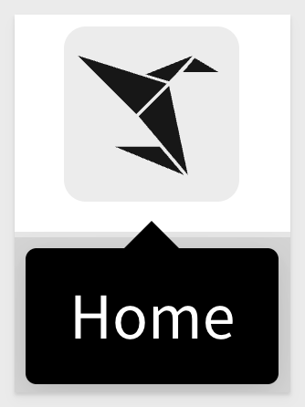
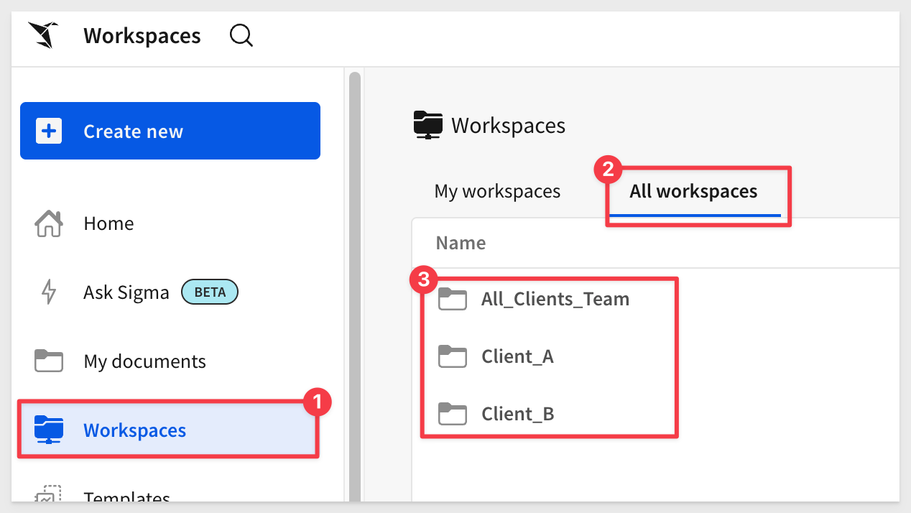
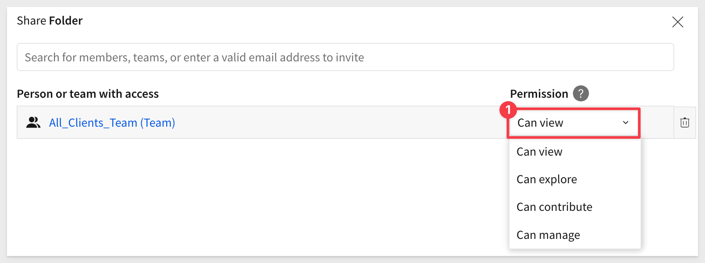
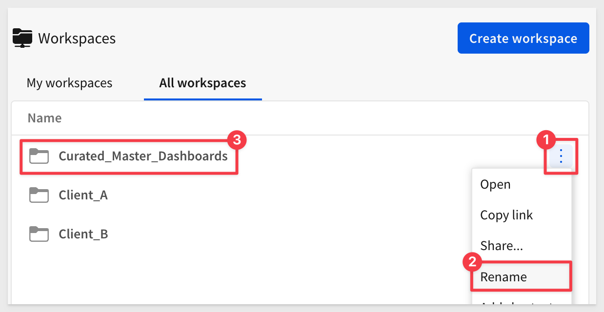

author: pballai
id: embedding_02_federated_access_v3
summary: embedding_02_federated_access_v3
categories: Embedding
environments: web
status: Published
feedback link: https://github.com/sigmacomputing/sigmaquickstarts/issues
tags: embedding
lastUpdated: 2024-05-07

# Embedding 02: Federated Access

## Overview 
Duration: 5 

Sigma's embedded solution is highly flexible and can accommodate a myriad of use cases. These include:

<ul>
      <li>Providing all your customers with a common dashboard.</li>
      <li>Offering only certain customers a more specialized dashboard.</li>
      <li>Supporting users at varying levels of functionality (e.g., view-only vs. build)</li>
      <li>Any combination of the above scenarios or other possibilities.</li>
</ul>

Sigma employs federated user access to cater to all these needs and beyond. This is often realized through single sign-on (SSO) technologies and the establishment of trust relationships between the systems involved.

With Sigma embedding, users log in to your application (the "native application"), get authenticated (with an optional role assignment), and this information is conveyed to Sigma when a part of your app requires embedding.

It's crucial to note that Sigma has its own proprietary role-based access control (RBAC) system. While some customers exclusively use this system, many others with an existing identity management provider (IDP) prefer to integrate that with Sigma. 

For more information, see [using SSO with Sigma](https://help.sigmacomputing.com/docs/single-sign-on-with-saml)

Additional information is also available: [managing user and teams with SCIM](https://help.sigmacomputing.com/docs/manage-users-and-teams-with-scim)

In this QuickStart, we will use the local native application framework we created in [Embedding 01: Getting Started](https://quickstarts.sigmacomputing.com/guide/embedding_03_secure_access/index.html?index=..%2F..index#0)

<aside class="positive">
<strong>IMPORTANT:</strong><br> Some screens in Sigma may appear slightly different from those shown in QuickStarts. This is because Sigma continuously adds and enhances functionality. Rest assured, Sigma’s intuitive interface ensures that any differences will not prevent you from successfully completing any QuickStart.
</aside>

For more information on Sigma's product release strategy, see [Sigma product releases](https://help.sigmacomputing.com/docs/sigma-product-releases)

If something is not working as you expect, here's how to [contact Sigma support](https://help.sigmacomputing.com/docs/sigma-support)

### Target Audience
Semi-technical users who will be aiding in the planning or implementation of Sigma with embedding. No SQL or technical data skills are needed to complete this QuickStart. It does assume some common computer skills like installing software, using Terminal, navigating folders and copy/paste operations.

### Prerequisites

<ul>
  <li>A computer with a current browser. It does not matter which browser you want to use.</li>
  <li>Access to your Sigma environment.</li>
  <li>Embedding 01: Getting Started is required to complete this QuickStart.</li>
</ul>

<aside class="positive">
<strong>IMPORTANT:</strong><br> Sigma recommends using non-production resources when completing QuickStarts.
</aside>

<button>[Sigma Free Trial](https://www.sigmacomputing.com/free-trial/)</button>

<aside class="negative">
<strong>IMPORTANT:</strong><br> Some features may carry a "Beta" tag. Beta features are subject to quick, iterative changes. As a result, the latest product version may differ from the contents of this document.
</aside>
 


## Federated Access
Duration: 5

Federated user access refers to a mechanism that allows users to use a single set of credentials (such as username and password or other authentication methods) to access multiple software systems without requiring separate accounts for each system. This is typically achieved through single sign-on (SSO) technologies and trust relationships established between the participating systems.

**Advantages of Federated Access:**

1. **User Convenience**: Users don't have to remember multiple passwords. They can log in once and access multiple systems seamlessly.
  
2. **Improved Security**: Centralized authentication reduces the risk of password fatigue—where users reuse or choose weak passwords due to having too many to remember. With federation, strong authentication mechanisms can be uniformly enforced across all connected systems.
   
3. **Efficient User Management**: IT departments can manage user accounts centrally. When a user leaves the organization or changes roles, access can be modified or revoked from a single point, ensuring timely and consistent updates across all systems.
  
4. **Reduced Administrative Overhead**: With fewer accounts to manage, there's a reduction in the time and resources required for account maintenance, password resets, and other administrative tasks.

5. **Interoperability**: Federated user access often relies on standards such as SAML (Security Assertion Markup Language), which ensures different systems, even from different vendors, can work together seamlessly.

**Challenges of Federated Access:**

1. **Complex Setup**: Establishing trust relationships and integrating systems can be technically challenging, especially when dealing with legacy systems or those without native federation support. Sigma makes this easy by adopting the parent applications security at runtime,	through our server-side API.

2. **Potential Single Point of Failure**: If the central identity provider suffers downtime or issues, it might affect user access to all connected systems.

3. **Security Concerns**: While federation can enhance security in many ways, it's crucial to secure the central identity provider. If compromised,	attackers could gain access to all linked system

4. **Interoperability Issues**: While standards exist, not all systems interpret or implement these standards consistently, leading to potential integration challenges.

**Common Use Cases**:

1. **Business Partnerships**: Companies that collaborate frequently might use federated access to provide their employees access to shared tools and platforms without creating multiple accounts.
  
2. **Cloud Services**: As organizations adopt more cloud services, federated user access ensures employees can seamlessly access all cloud platforms without multiple logins.

3. **Academic Institutions**: Universities and colleges often federate access to libraries, learning systems, and other resources—allowing students and faculty to use everything they need with a single set of credentials.

4. **Enterprise Intranets and Applications**: Large organizations might have many internal tools, dashboards, and systems. Federated access ensures employees can navigate these resources smoothly.

Now that you have a high-level understanding of federated access, let's explore how you can leverage it with Sigma.


<!-- END OF SECTION-->

## Team and Workspace 
Duration: 5

In the QuickStart [Embedding 01: Getting Started](), we discussed and created some teams and workspaces. 

To recap: 

- Teams let you create user groups in Sigma. When you grant access and permissions to a team, the grants apply to all members assigned to the team. 

- Workspaces allow folders and documents to be compartmentalized, categorized, and easily shared with the correct people. They can be shared among users and teams via permission grants.

Next, we will create three more teams, each with their own workspace. 

- **Client_A Team:** A `Private` team for our customer Client_A.

- **Client_B Team:** A `Private` team for our customer Client_B.

- **All_Clients_Team:** A `Public` team for any customer to see. Many customers have generic content they want to make available to all their external clients.

<aside class="negative">
<strong>NOTE:</strong><br> Private teams are only accessible to their members
</aside>

<aside class="positive">
<strong>IMPORTANT:</strong><br> 📘
Teams and workspaces have a many-to-many relationship. A single team can be granted different permissions for multiple workspaces, and multiple teams can be granted different permissions for a single workspace. For example, your organization can create a workspace for each team while also maintaining quarterly workspaces shared with a select few teams.
</aside>

For more information about teams, see [Create and manage teams](https://help.sigmacomputing.com/docs/manage-teams)

For more information about workspaces, see [Manage workspaces](https://help.sigmacomputing.com/docs/manage-workspaces)

### Create teams and workspaces
Log in to Sigma and navigate to `Administration` > `Teams` and click `Create Team`.

Name the team `All_Clients_Team`, set it to `Public`, check the box to `Create a Workspace` and click `Create`:


<aside class="positive">
<strong>IMPORTANT:</strong><br> Adopt clear naming conventions for teams and workspaces to ensure easy understanding of their purpose and contents. To keep embedded URLs readable and easy to troubleshoot, avoid spaces in names for Teams, Account Types, and User Attributes. Spaces necessitate URL encoding, which can clutter the URL and make it less intuitive. Ensure you only URL encode when dealing with HTML special characters or spaces.
</aside>

A new workspace is created for you automatically with the name `All_clients_team`. 

Create two more teams, one for `Client_A` and one for `Client_B`. Each time, check the box to also create a workspace and set both teams to `Private`.

We should now have our three teams:


Workspaces are shown by returning to the  page and clicking `Workspaces` > `All workspaces`:



Since we’re logged in as an admin, we can see all workspaces.

Creating a workspace this way grants the team `Can contribute` permission by default.

Since the content is intended for all clients, we should probably change that permission to `Can view`:

<br><br>



Let’s rename the new workspace to something more descriptive. We will use `Curated_Master_Dashboards`:



Lastly, change the sharing settings for both `Client_A` and `Client_B` teams to `Explore`. This will let them drill down into the data further.

Next, we need some content in the new workspace.


<!-- END OF SECTION-->

## Workspace Content
Duration: 5

Let’s make a copy of the workbook created in the previous QuickStart, `Getting_Started_QuickStart`.

It is a simple workbook, having one table on it:


Save it as a new workbook in the `Curated_Master_Dashboards` workspace, and name it `Federated_Access_QuickStart`:


Rename the table from `Plugs Sales Transactions` to `Plugs Sales Transactions – Federated Access`:


Click `Publish`.

Navigate to `Home` > `Workspaces`. You’ll find the `Federated_Access_QuickStart` workbook, and if you check its sharing settings, you’ll see that all members can `View` it:

<br><br>


<!-- END OF SECTION-->

## Allow the All_Clients_Team The Entire Workbook
Duration: 5

Now that we have something we can embed, let's work through a few test scenarios. While these tests are basic, it provides a good understanding of how we can isolate content and permissions based on teams and workspaces.

<aside class="positive">
<strong>IMPORTANT:</strong><br> We are just getting started with the many ways Sigma can support isolation and security. In later QuickStarts, we will explore the topic of multi-tenancy, row/column level  security and other related topics.
</aside>

### Test 1: Allow the All_Clients_Team access to the entire workbook.
In VSCode, open the `embedding_qs_series_2` folder created in the QuickStart: Embedding 01: Getting Started.

Open the `.env` file. The `Client_ID` and `Secret` should already be configured from the last QuickStart.

Scroll down to the `# QS: federated_access` sectionL


Here we need to configure the four items. For this test case we used:
```code
FEDERATED_ACCESS_EMAIL=all_clients_user@example.com
FEDERATED_ACCESS_ACCOUNT_TYPE=View
FEDERATED_ACCESS_TEAMS=All_Clients_Team
```

For `FEDERATED_ACCESS_BASE_URL=` we opened the `Federated_Access_QuickStart` workbook in `Published` mode:


Then we copied the URL directly from the browser to use as the value for `FEDERATED_ACCESS_BASE_URL`.

Save the `.env` file changes.

Open a new Terminal in VSCode, navigate to the `embedding_qs_series_2` directory, and start the Express web server by running:

```code
npm start
```


Open `http://localhost:3000` in a browser:

Select `Federated Access` from the list and click `Go`:


The page will load the embedded content along with the `.env` parameters that are being used:


<!-- END OF SECTION-->

## Restrict the Client_A Team To One Element
Duration: 5

To make this use case work, we only need to pass different `.env` parameters. This simulates the native application passing parameters to Sigma at runtime.

Put the workbook in `Edit` mode and add a new `Bar Chart` from the `Element Bar`.

Configure the chart as shown:


Click `Publish` and place the workbook in `Publish version` mode as before.

Then click to select the bar chart and copy the URL from the browser.

For single elements and workbook pages, we need to adjust the URL as described in [p](https://help.sigmacomputing.com/docs/create-an-embed-api-with-json-web-tokens). Scroll down to the section `What URL to use`.

The URL syntax for a single element is as follows:
```code
https://app.sigmacomputing.com/{organization-name}/workbook/{workbookname}-{workbookUrlId}/element/{elementId}
```

Key changes in our example URL were as follows:


Once we have the edited URL, we can update our `.env` parameter to use it.

<aside class="negative">
<strong>NOTE:</strong><br> It can be useful to just comment out the previous line in the .env file for "FEDERATED_ACCESS_BASE_URL" and add a new line. This way, it is easy to switch between different values while retaining working versions.
</aside>

We also can use this moment to show that a user in Sigma can be a member of more than one team.

Simply pass the extra team as shown:


**PROGRAMMING NOTE:**
Multiple teams must be passed as an array. In our sample application, this is handled in the `embed-api.js` code so that .env can just use a comma-delimited string. This logic appears on lines 43–44 of that file:
```code
// Convert comma-separated teams string into array
   const teamsArray = rawTeams ? rawTeams.split(",").map((t) => t.trim()) : [];
```

Now, when we refresh the native application in the browser, we see the single-element embed:


<!-- END OF SECTION-->

## Test 2: Restrict Client_B to one workbook page.
Duration: 5

Restricting a team to a workbook page follows the same process as element restriction. 

Return to the `Federated_Access_QuickStart`, place it in `Edit` mode and add a new page:


Double-click on the new `Page 2` tab and rename it to `Client_B`.

Add a `UI` > `Text` control to the page and type `Hello Client_B`:


Click `Publish `and reopen the workbook in `Published version` mode.

With nothing selected on the `Client_B` page, copy the URL from the browser.

As with the single element, we need to adjust the URL to follow the page-specific syntax.

The URL syntax for a workbook page is as follows:
```code
https://app.sigmacomputing.com/{organization-name}/workbook/{workbookname}-{workbookUrlId}/page/{pageId}
```

For example, we adjusted the URL to this:
```code
https://app.sigmacomputing.com/quick-starts-fundamentals/workbook/Federated_Access_QuickStart-4DuhJmjSblmwvyRsCAXLvc/page/3UcHBoVD3j
```

Update the `.env` parameters with the new URL and change the team to `Client_A, Client_B`. We expect this configuration will not work, but let's test that assumption.


Save the `.env` file and refresh the browser.

With only the `Client_A` and `Client_B` teams, we do not have permission to access the embedded content:


Adding `All_Clients_Team` (and removing `Client_A`) from the team list allows the embed to render:


The team-workspace functionality is clearly flexible, and this was a quick example to get you thinking.


<!-- END OF SECTION-->

## What we've covered
Duration: 5

In this QuickStart, we explored how to leverage Sigma’s team and workspace permissions to deliver secure, federated access to embedded content. We demonstrated how different teams can be granted varying levels of access—ranging from full workbooks to individual elements or pages—based solely on the parameters passed at runtime. 

Embedding with Sigma is both flexible and straightforward, giving customers the ability to mix and match approaches to meet their security and user experience goals. 

This is just the beginning-other QuickStarts in the embedding series will introduce even more advanced techniques for securing and customizing embedded experiences.

**Additional Resource Links**

[Blog](https://www.sigmacomputing.com/blog/)<br>
[Community](https://community.sigmacomputing.com/)<br>
[Help Center](https://help.sigmacomputing.com/hc/en-us)<br>
[QuickStarts](https://quickstarts.sigmacomputing.com/)<br>

Be sure to check out all the latest developments at [Sigma's First Friday Feature page!](https://quickstarts.sigmacomputing.com/firstfridayfeatures/)
<br>

[](https://twitter.com/sigmacomputing)&emsp;
[](https://www.linkedin.com/company/sigmacomputing)&emsp;
[](https://www.facebook.com/sigmacomputing)


<!-- END OF WHAT WE COVERED -->
<!-- END OF QUICKSTART -->
