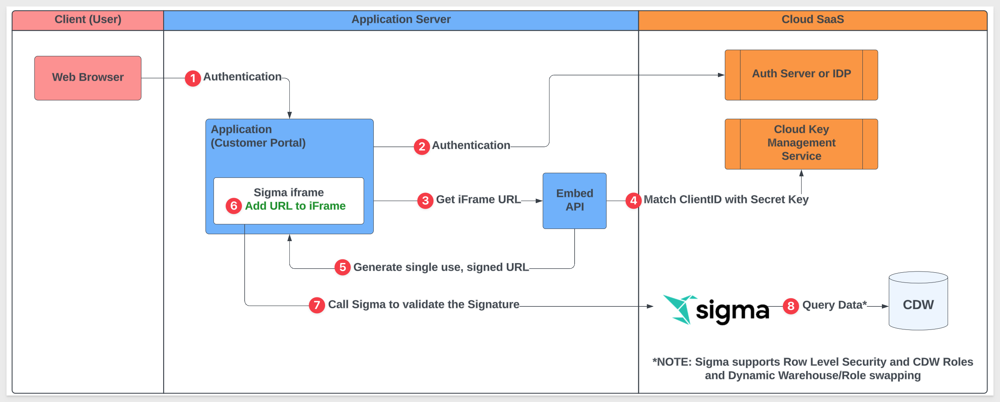
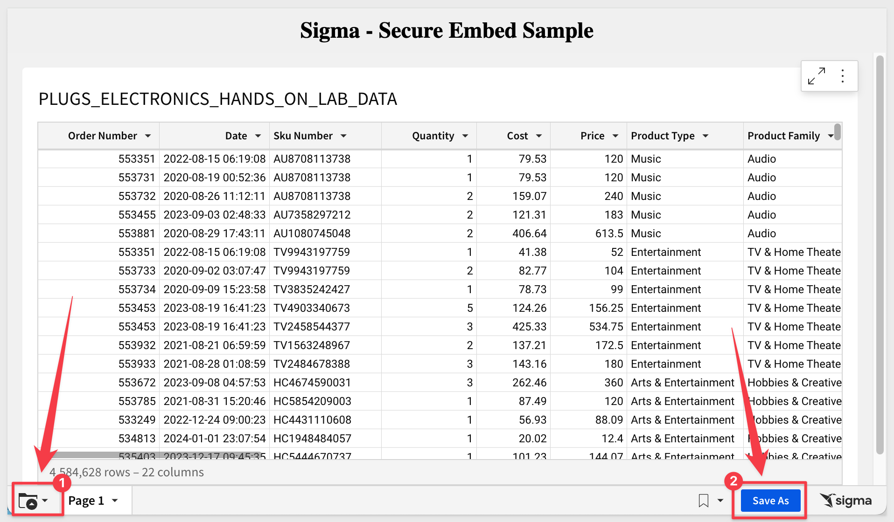
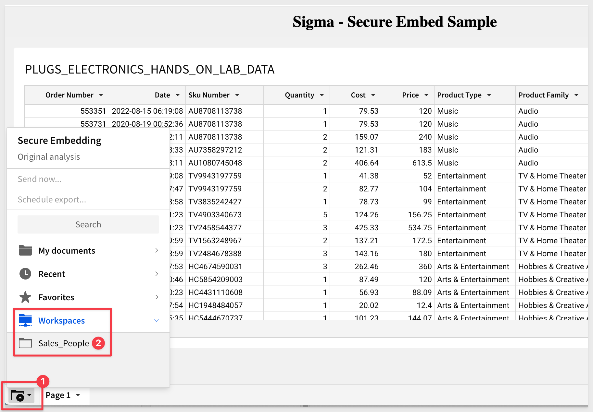

author: pballai
id: embedding_03_secure_access
summary: How to securely embed Sigma content in an external Application.
categories: Embedding
environments: web
status: Published
feedback link: https://github.com/sigmacomputing/sigmaquickstarts/issues
tags: default
lastUpdated: 2023-05-18

# Embedding 03: Secure Access

## Overview 
Duration: 5 

This QuickStart introduces you to Sigma `Secure` embedding and demonstrates how to leverage it, to embed Sigma content in a external website.
 
This QuickStart assumes you have already taken the [QuickStart: Embedding 01: Prerequisites,](https://quickstarts.sigmacomputing.com/guide/embedding_01_prerequisites/index.html?index=..%2F..index#0) so that you have a sample environment to complete the tasks in this QuickStart.
 
Sigma supports embedding without any user security ([QuickStart: Embedding 02: Public Access,](https://quickstarts.sigmacomputing.com/guide/embedding_02_public_access/index.html?index=..%2F..index#0)) and Secure embedding, which as the name implies, implements a robust security framework. 

Secure embedding is by far the most popular method Sigma customers use, as it works with the Parent application’s authentication, to pass user-level permissions and more at runtime.

With this method, each user is treated as an individual, with an account type and team permissions. We will refer to these individuals as `embed users`. 

<aside class="positive">
<strong>IMPORTANT:</strong><br> Since Sigma leverages a customers existing authentication method, we do not require to also manually add "embed users" to Sigma's management portal. 

"Embed users" are added automatically (if they have never used any embedded Sigma content before) to Sigma at runtime. 

In this way, administrative overhead is reduced (for user management) but Sigma is still able to log embed user activity, when using embedded content.
</aside>

This method supports passing of optional and customer-defined parameters to implement additional functionality like row-level security (RLS) at the team and user level. 

It also allow embed users to save and edit their own versions of embedded workbook.

Having so much flexibility means that customers can create different "experiences" for customers they support. 

For example, you may want to allow everyone using your custom portal as a viewer. Some of your customers may want more, and Sigma allows you to easily create "tiers" of functionality that you may decide to charge a premium for. 

Here is a simple example of tiered offerings, using functionality that is built into Sigma:


### Target Audience

Semi-technical users who will be aiding in the planning or implementation of Sigma, embedded into a secure website. No SQL or technical data skills are needed to do this QuickStart. It does assume some common computer skills like installing software, using Terminal, navigating folders and edit/copy/paste operations.

### Prerequisites

<ul>
  <li>A computer with a current browser. It does not matter which browser you want to use.</li>
  <li>Access to your Sigma environment. A Sigma trial environment is acceptable and preferred.</li>
  <li>A working web server based on Node.js as demonstrated in the QuickStart Embedding 1: Prerequisites</li>
  <li>Some content to embed. You can embed a workbook, table or Sigma element(s).</li>
  <li>Downloadable project files discussed later in this document.</li>
</ul>

<button>[Free Trial](https://www.sigmacomputing.com/free-trial/)</button>

### What You’ll Build

We will embed Sigma content inside a Node.js web application, passing runtime parameters to configure the embed and demonstrate account type use-cases. 


<!-- END -->

## Secure Embedding
Duration: 5

Secure embedding provides a way to embed your content, without your users needing to authenticate through Sigma. 

This “authentication pass-through” is a key feature of Sigma’s embedding model and makes it fast to implement as well. 

Secure embedding is the most popular method for including Sigma content because it fully supports high security and the ability to pass parameters and more. 

Passing parameters creates a personalized user experience in addition to other Sigma functionality we will explore later. 

Security is assured by the creation of a unique and encrypted embed URL, pointing to the workbook, workbook page, or element you wish to display. 

This embed URL is generated on the server side of your Parent application, accessed through an API you set up, and rendered client side in an iframe. 

**We refer to this API as the "server-side embed API" (embed API).** 

When you create the embed API to generate your embed URL, you can specify parameters that define who the user is, what role they have (account type / team membership), what they will see, and how they can interact with your embedded content.

There are many required and optional parameters available. The [QuickStart: Embedding 05: Parameters and User-Attributes](https://quickstarts.sigmacomputing.com/guide/embedding_05_leverage_parameters_and_ua/index.html?index=..%2F..index#0) details all of the available required and optional embed parameters.

<aside class="negative">
<strong>NOTE:</strong><br> If the user logging into the Parent application does not exist in Sigma, it will be created automatically in Sigma once authenticated by the Parent application. Sigma is relying on the Parent application authentication to determine user entitlements, along with account type / team membership in Sigma.
</aside>

With that in mind, users are assumed not to exist in Sigma’s `People` list; the user information will be passed at run-time to Sigma by the Parent application. 

Of course, you can still have manually created Sigma users for internal use or other administration purposes. Not having to do this for embed users saves time and management overhead. 

It is also very important to understand that **each embed API generated URL can only be used once,** and if modified externally and resent, will generate an error message in the browser. 

A list of [common errors when embedding is in this QuickStart.](https://quickstarts.sigmacomputing.com/guide/embedding_05_leverage_parameters_and_ua/index.html?index=..%2F..index#5)

The flowchart below provides a high-level overview of how **secure embedding** works for Sigma, step-by-step:



To embed, you will need to complete a few steps in Sigma and your Parent application. 

This requires implementation of a server-side embed API and some Sigma content. 

The workflow below demonstrates the minimum steps involved so that you may see the process all at once, before we do each step.

<aside class="negative">
<strong>NOTE:</strong><br> This is very high-level and does not include the fine points involved. These fine points will be covered in each use-case.
</aside>


<!-- END -->

## Administrator Steps
Duration: 5

Before we can work on the content we need to provision `Account Types`, `Teams` and `Workspaces` in Sigma for our demonstration. This will allow us to group users and set various permissions. 

`Log into Sigma`, as an Administrative (Admin) user. 

Sigma is very flexible, at a high level the following describes the permission hierarchy:

**User Account Types:** A user's account type determines their highest level of interaction with data and content in Sigma. Each user is assigned a single account type; they can only be assigned one account type at a time. More information can be found here: [User Account Types](https://help.sigmacomputing.com/docs/user-account-types)

**Teams:** allow for organized management of user groups. To view and interact with secure embed workbooks, a user must be assigned to at least one team in your organization. Users can be members of more than one team. Data source permissions can be granted to entire teams. This option is also available for folders and documents. For team members or individual users to save and edit versions of embedded workbooks, they must have contribute access to a workspace. More information can be found here: [Teams](https://help.sigmacomputing.com/docs/manage-teams)

**Workspaces:** allow folders and documents to be compartmentalized, categorized, and easily shared with the correct people. They can be shared amongst users and teams via permission grants. Workspaces are managed by organization admins. Admins also have access to an additional `ALL WORKSPACES` tab. More information about can be found here: [Workspaces](https://help.sigmacomputing.com/docs/manage-workspaces)

### Account Types:

We will use account types to allow different users, different rights, as we go through the use-cases. Sigma provides a few default types that we will just use.

Navigate to `Administration` / `Account Types`.

Sigma provides four account types out-of-the-box; `Lite` `Essential` and `Pro`. 

**Lite** has these permissions:


**Essential** has these permissions:


**PRO** has many more permissions, which allows them to create and manage content in Sigma, that will be embedded for others to see:


Default `Account Types` look like (including the `Admin` account type (#1), which is the fourth type):


### Teams:
Navigate to the `Administration` > `Teams` page and use the `Create Team` button to add a new team called `Sales Managers` team. 

Set the team to `Private` and ticking the checkbox to create a Workspace (we can use this later to share user created content directly from the embed):


<aside class="negative">
<strong>NOTE:</strong><br> Avoid using spaces / special characters in Team names which could cause code errors depending on your development framework.
</aside>

Click the `Create` button.

<aside class="positive">
<strong>IMPORTANT:</strong><br> On the next page we are able to add users to the new team, but since we are using this team only in the embedded context, we don't need to do that. 

Recall that embed users are added at runtime, the first time they access any content embedded in the Parent application. 

Their permission level is also set automatically by the embed API, via a required parameter that specifies the Sigma account type they are assigned. 
</aside>

Create one more team called `Sales_People`, setting it up as follows:


Exit `Administration` by clicking either the Sigma back icon or clicking the Papercrane icon: 


Click on the `Workspaces` menu item and see the workspace for each team. 

This is useful when we later want to save the default Workbook as a copy, make changes and share with the rest of the Team. 

This functionality provides a lot of flexibility in how your users access shared work. 


For the `Sales_Managers (Team)`, check the permission that was granted when the Team was created:


The default is `Manage` but can be changed to support a variety of use cases. 

This means that any member of the `Sales_Managers (Team)` is granted `Manage` permission to content shared in this specific workspace. 

We can also grant access to others, with different rights, either at the workspace level or for specific content inside the workspace.


<!-- END -->

## Create Sigma Content
Duration: 5

Sigma is very flexible and has different workflows for creating content, based on source data. 

For example, we could first create a dataset, set permission on it, and then save it off for later use in a workbook(s). We would then create a workbook with a table, that shows data from the dataset we saved earlier.

<aside class="negative">
<strong>NOTE:</strong><br> To leverage the features in secure embedding, permission to your data is required at some level. Creating a dataset and granting permissions to it is considered best practice.
</aside>

To minimize the steps, we will leverage a different workflow.

<aside class="positive">
<strong>IMPORTANT:</strong><br> In either case, customers should evaluate the many options in Sigma against their own InfoSec, compliance and governance policies, in order to make the best choices for their organizations. Sigma will be there to assist in these decisions, at any time.
</aside>

From Sigma / `Home` click the `+` Create New button and click `Workbook`:


We will use `Table` from the options:


Next we need to select our source data. We will use the typical sample data, as in other QuickStarts.

Click the `New` tab and then select `Tables and Datasets`:


Select the `Sigma Sample Database` connection and navigate the tree to find the `PLUGS_ELECTRONICS_HANDS_ON_LAB` table as shown:


This opens the selected table in a new (unpublished) workbook.

The first thing we want to do is click the `Save As` button:


When prompted, we navigate to `Workspaces` >  `Sales_Managers` workspace folder, name the workbook `Plugs Sales Table` and save it.


We now have a workbook that can be accessed (`managed`) by anyone on the `Sales_Managers` team.


<aside class="positive">
<strong>IMPORTANT:</strong><br> At this point we have content created, but since we have not shared it. Only Sigma customer administrators and members of the "Sales_Managers (Team)" have access to the workbook.
</aside>

If we look at the current sharing settings for this workbook:


We can see that the `Sales_Managers (Team)` is already present and shared with the Team through workspace inheritance:


<!-- END -->

## Prepare Embed in Sigma
Duration: 5

We will create the required information to pass to the developer of the Parent application (in this case the developer is us).

### Sigma Embed Client credentials

Embed `Client credentials` ("credentials") are a crucial component for creating a Sigma embed. These credentials are encoded within your embed URL, providing an additional layer of validation to ensure the embed's authenticity and security.

The credentials are made up of the `Client ID` and `Client Secret`, and are generated using the Sigma UI.

The credentials will be used in the embed API, to ensure your embed URLs are valid at run-time.

**Here are some important points to note about the credentials:**

**Irretrievable**: Once created, you cannot retrieve the original credentials. Ensure to store them securely.

**Regeneration**: If the credentials are lost, they can be regenerated, but with different values. This will invalidate all existing embeds until the new values are in place in the embed API.

**Update Requirement**: After regenerating new credentials, you must update all existing embeds, using the Embed API for that change. 

Remember to keep your credentials in a secure location, as losing them requires action to maintain your embedded analytics functionality.

<aside class="positive">
<strong>IMPORTANT:</strong><br> You cannot look up your organizations existing credentials (Sigma support has no access to your credentials) after they have been created. 

If you lose your credentials, you must regenerate new credentials. 

If this happens, your existing embeds will be rendered invalid until the API is updated with the new embed credentials.
</aside>

### Client Credentials Creation

We will now create credentials that are specific to our workbook embed. 

**1:** Navigate to `Administration` > `Developer Access`:


**2:** Click `Create New`, located in the page's top right corner. This will open the `Create Client Credentials` modal.

**3:** Under `Access Credential Type?` select `Embedding`.

**4:** Enter a `Name` and `Description` as you see fit.

**5:** Under `Owner`, select an organization member with the account type you would like to associate with the embed secret. For now, just select yourself or an `Administrator`.


<aside class="negative">
<strong>NOTE:</strong><br> Some customers elect to have a "Service Account" user with administrative privileges for this "owner" assignment.
</aside>

**6:** Click Create:

**7:** Copy the provided `ClientID` and `Secret` and store them.


**8:** Click Close.

Paste the credentials into a known safe location in case you need to use them later (you will!). 

We can use these credentials for all embeds, but you may create as many credentials as you prefer.


<!-- END -->

## Generate Embed Path
Return to our Workbook.

Click the caret (▼) icon button to the right of the workbook title in the header.

Click `Embedding` to open the Application tab.

Under `Generate Application Embed Path` for, select your embed target. We selected the `Entire Workbook.`


<aside class="positive">
<strong>IMPORTANT:</strong><br> Sigma provides a built-in "Embed Sandbox" (item # 2 in the screenshot above) that allows you to quickly test embeds too. Some people prefer to use this option because they can quickly evaluate the effects of changing configurations, directly in the UI. This can be a real time-saver.
</aside>

For more information on the [Embed Sandbox, click here.](https://help.sigmacomputing.com/docs/embed-sandbox)

The embed path will automatically be generated. Click `Copy` to copy this path. 

Save this off to a text file for later use and `close` the modal.

We have the everything we need from Sigma now, and can move on to working on the embed API.


<!-- END -->

## Parent Application Setup
Duration: 10

Download and unzip the project files into the folder on the computer's desktop called `sigma_embedding`.

<aside class="negative">
<strong>NOTE:</strong><br> This folder should already exist if your completed the perquisites QuickStart. If not, manually create it.
</aside>

[Click here to download sigma_secure_embed.zip](https://sigma-quickstarts-main.s3.us-west-1.amazonaws.com/embedding_2/sigma_secure_embed.zip)

The zip file contains these two files:

**index.html:** the web page that contains the iframe we are embedding into. No changes are required for this file.

**embed-api.js:** a JavaScript routine that sets up the services required and configuration of the Sigma options. This is a example of an `Embed API`.

### Install Node Packages for Folder

If you haven't installed Node already, please do so by referring to section 3 of the [QuickStart: Embedding 01: Prerequisites.](https://quickstarts.sigmacomputing.com/guide/embedding_01_prerequisites/index.html?index=..%2F..index#2)

If you have already installed Node, recall that we still need to install the required Node packages for our new `sigma_secure_embed` folder that was created when we unzipped the download into the `sigma_embedding` folder.

Open a new Terminal session from the folder `sigma_secure_embed` and run this command:

**Run the command tro install the Express web-server:**
```code
npm init
```

As in the prerequisites QuickStart, accept all the defaults by pressing enter until completed.

and...

**Run the command:**
```code
npm install supervisor
```

### Edit embed-api.js
Open embed-api.js in a text editor and review all the comments (lines starting with “//”). 

This will give you an understanding of the minimum required parameters to pass to make Embedding work. We will pass more in later sections, so it is good to get familiar now. 

**Required Changes:**

To see all the available required and options parameters, there is a [QuickStart: Embedding 05: Parameters and User-Attributes.](https://quickstarts.sigmacomputing.com/guide/embedding_05_leverage_parameters_and_ua/index.html?index=..%2F..index#0)

The items in section #3 of the the embed-api.js code needs to be changed, replacing the values for `EMBED_PATH`, `EMBED_SECRET` and `CLIENT_ID`.

The items in section #6 need to be changed, replacing values for `email`, `external_user_id`, `external_user_team` and `account_type`.

<aside class="positive">
<strong>IMPORTANT:</strong><br> We are hard-coding the items in section #6 to keep this demonstration simple. In practice, these values would be generated programmatically bu the parent application and passed to the embed API at runtime, setting these values as appropriate for the user.
</aside>

All other values can be left as they are.


Notice that we are using the `Sales_Managers` team that we created earlier.

The `email address` and `external userID` would normally be passed (as variable parameters) at runtime, after a successful user login to the Parent Application, but we are just hard coding those values for demonstration.

<aside class="negative">
<strong>NOTE:</strong><br> Take care when pasting values into your embed-api.js to not remove any required syntax, add any spaces etcetera. A leading space in embed-api.js (for example an email address) is likely to throw an error on page load.
</aside>

### Start the Web Server
You are now ready to start the Node.js Express web server. Use Terminal and navigate to the `sigma_secure_embed` folder where you just modified the two files. 

**Make sure to run the command from the folder where you stored the unzipped download:**
```code
supervisor embed-api.js
```

If you get an error about port 3000 being used already (not typical) you can change the port value in the embed-api.js to use a different port. That is configured in embed-api.js in section #3. You will also need to edit `index.html` for the new port on this line:


We are now ready to test the Parent application that has the embedded content.


<!-- END -->

## Embed API Detail (optional reading)
Duration: 10

The following provides a little more information about each numbered step of embed-api.js. 

The sample file has some in-line comments, but we did not want to overly clutter the file with long text descriptions. If you are satisfied with your understanding of embed-api.js already, you may skip this section. 

### Item #1: Require Necessary Node.js Modules:
**express:** a fast, minimalist web framework for Node.js, used here to create the web server and define routes.

**crypto:** a core Node.js module providing cryptographic functionality, used here to generate a secure, random nonce and to create a signature for the embed URL.


### Item #2: Initialize an Express Application:
Initializes an Express application instance (app), which is used to set up the server, define routes, and handle requests.


### Item #3: Manually Set Configuration Variables:
Defines essential configuration variables for embedding Sigma content, including the embed path (EMBED_PATH), a secret key for signing requests (EMBED_SECRET), and a client identifier (CLIENT_ID). These are used to construct the secure embed URL.


### Item #4: Server Setup:
Sets up a route that serves the main HTML file (index.html) when the root URL (/) is accessed. This is typically the entry point for users accessing your web application.


### Item #5: Define a Route Handler for Generating Sigma Embed URLs:
Defines an API endpoint (/api/generate-embed-url) that, when accessed, triggers the generation of a signed URL for embedding Sigma content securely. This is where the bulk of the embed URL generation logic resides.


### Item 6: Construct Required Search Parameters:
Generates a unique nonce (number used once) to prevent replay attacks and constructs a string of search parameters that will be appended to the embed URL. These parameters include client identification, user information (like email and user ID), team information, account type, embedding mode, session length, and the current time. These are required to tailor and secure the embed content.


### Item 7: Construct the URL with Search Parameters and Generate a Signature:
Concatenates the base embed path with the search parameters and generates a cryptographic signature using the provided EMBED_SECRET. This signature is appended to the URL, ensuring the embed link is secure and tamper-proof.

Critically important is the use of HMAC and SHA-256 in this section.

**HMAC** stands for Hash-based Message Authentication Code. It is a mechanism for calculating a message authentication code involving a cryptographic hash function in combination with a secret cryptographic key. It provides both integrity and authentication: integrity, by ensuring that the message (in this case, the URL and its parameters) has not been altered, and authentication, by proving that the message was created by a known sender (the server in this scenario), which possesses the shared secret key.

**SHA-256** is a cryptographic hash function belonging to the SHA-2 family, where "256" denotes the bit length of the hash output. Hash functions are designed to take an input (or "message") and return a fixed-length string of bytes, typically a digest that is unique to each unique input. They are one-way functions, meaning it is infeasible to reverse the function to obtain the original input from the hash. SHA-256 is widely recognized for its security and is used in various security applications and protocols.


### Item 8: Send the Final URL to the Requester:
Responds to the API request with the securely signed embed URL in JSON format. This URL is then used on the client-side, typically to set the `src` attribute of an iframe, embedding the Sigma content securely.


### Item 9: Start the Server:
Starts listening for incoming connections on the specified PORT, effectively starting the server. Prints a message to the console indicating the server is running and listening for requests.

This setup allows for the secure and dynamic generation of embed URLs for Sigma content, ensuring that embedded analytics are both personalized and secure, leveraging Sigma's capabilities within your own application's context.

This setup allows for the secure and dynamic generation of embed URLs for Sigma content, ensuring that embedded analytics are both personalized and secure, leveraging Sigma's capabilities within your own application's context.

The implications of this setup are:

 <ul>
      <li><strong>Signature Creation: </strong> The server uses the EMBED_SECRET to create a cryptographic signature by applying the HMAC with SHA-256 algorithm to the URL and its query parameters. This signature is unique to the contents of the URL and the secret key used.</li>
      <li><strong>Integrity and Authenticity:</strong> When Sigma receives the embed URL with the signature, it looks up the EMBED_SECRET using the client_id provided in the URL. Sigma then recreates the HMAC signature on their side using the received URL (minus the signature part) and the EMBED_SECRET associated with the provided client_id. If the signature Sigma computes matches the one sent with the URL, it confirms that the URL has not been altered and that the request is authentic. This process ensures the integrity of the URL (it has not been tampered with) and authenticates the source (the sender knows the 
      secret).</li>
      <li><strong>Role of client_id and EMBED_SECRET:</strong> The client_id is sent in clear text as part of the URL, acting as an identifier that Sigma uses to look up the corresponding EMBED_SECRET. The EMBED_SECRET is never transmitted with the request, safeguarding it from interception. Only entities that know the EMBED_SECRET can generate a valid signature, ensuring that even if someone intercepts the URL, they cannot alter it or generate a new, valid URL without access to the secret.</li>
      <li><strong>Preventing Replay Attacks: </strong> The inclusion of a nonce (crypto.randomUUID()) and the current timestamp (Math.floor(new Date().getTime() / 1000)) as part of the URL parameters further secures the URL. The nonce is a random value that should be used only once, and the timestamp helps in ensuring the URL is used within a specific time frame. These elements make prevents reuse of the embed URL.</li>
</ul>


<!-- END -->

## Test the Embed
Duration: 5

Open your browser and navigate to:
```plaintext
 http://localhost:3000
```

You should see the webpage with the title and the embedded workbook below as shown. 

Notice that Page Controls are available on the Dashboard tab, because we are passing an `Account Type` of `Creator`.



`Creators` have additional capabilities and we can explore them by clicking on the various controls available:

Notice that there is a new user in Sigma, `Administration`, `People` now as an “Embed User” with the email we set and `Viewer` Account Type. This was automatically added by the API on first successful access of the Parent application.

<aside class="postive">
<strong>IMPORTANT:</strong><br> Embed users are not be able to login to Sigma directly. 
</aside>


<!-- END -->

## Viewer Use Case
Duration: 5

Let's use the same configuration, but make a few adjustments to restrict a different user of the Parent application to `Viewer` permission. 

We will start moving faster now that you are familiar with the Sigma workflows. 

Recall that earlier we saved the workbook in the `Sales_Managers` workspace and that is only shared with members of the `Sales_Managers Team`.  

There are a few ways to go about getting non-Sales_Managers (ie: Sales_People) viewer access to this workbook. 

How we do it really depends on what type of workflow is preferred. 

Some customers just prefer to have a single copy of a workbook stored in a folder (as opposed to a workspace) and directly manage permissions against each individual workbook. While this works fine, it can become cumbersome to manage when there are a large number of workbooks.

Workspaces are a great way to manage access, since all content stored within are permitted by the workspace permissions.

A third method exists, that aligns with companies who wish to follow more common content promotion workflows (ie: DevOps). This is supported in Sigma and called `Version Tagging` and is detailed in this [QuickStart: Embedding 08: Version Tagging.](https://quickstarts.sigmacomputing.com/guide/embedding_08_version_tagging/index.html?index=..%2F..index#0)

For simplicity, we will just grant access to this workbook to the `Sales_People (Team)` with `Viewer` permission:


### Adjust embed-api for Sales Person as viewer

`Open embed-api.js` and change the values for:


Refresh your webpage. 

The embed has reduced functionality, and is now based on our `Account Type` settings for `Viewers`. 

Users also cannot access the `Sales_Managers` workspace, even though this workbook is stored there:




<!-- END -->

## Debugging Issues
Duration: 10

So that you are generally familiar with how you might debug problems, **we will make an intentional error** in our embed-api.js file, see the error, and use common web inspection tools to evaluate the request URL that was passed to Sigma. 

This is not the only method; just an example you can use if you have an issue in the embedding QuickStarts. 

If you are already experienced in web debugging you can skip this section. 

Remove the last value from the `ClientID` in item #3 of the embed API. In this case we removed the trailing `2`. 

Save the file.

Browse to the site again at:
```code
http://localhost:3000
```
You will see an error message:


<aside class="negative">
<strong>NOTE:</strong><br> Error messages may be different depending on the source of the issue.
</aside>

Open your web browser inspector. How to do that varies between browsers; we will demonstrate using Google Chrome. 

`Hit F12` on your keyboard. This will bring up Chrome’s Inspection tool.

Click the `Elements` tab and look for the node `iframe id`, It will be in under the body section as shown below, and you may have to click the arrows to expand the body node. 

Note that you can now see the `src` url and as you hover over it (or click on it), you can see the entire url. 


Right click on the url and click `copy link address`.

Paste the url in a text editor. 

We separated each parameter for readability.

In this case, I did not paste the last digit of the `ClientID`:


Go ahead and fix the ClientID in embed-api.js and save. Check to make sure your embed works again. 

**But wait; couldn’t some bad actor use the inspector to grab the Sigma embed URL and then reuse that to access the embed, right?**

**Let’s test that assumption.**

With your page working, open Inspector and copy the link url again. This time paste it into a new webpage and hit return. 

Notice the error? 


URL snooping and reuse is not possible.

For more information on common error messages related to embedding, [please section 6 of this QuickStart](https://quickstarts.sigmacomputing.com/guide/embedding_05_leverage_parameters_and_ua/index.html?index=..%2F..index#5)


<!-- END -->

## People (user) Accounts
Duration: 5

It is important to understand that there are several ways for users to obtain access to Sigma content based on use case. They are:

<ul>
  <li></li>
    <li><strong>Provisioned at Activation by Sigma:</strong>
        <ul>
        <li>Only for the initial Administrative account</li>
        <li>There must be at least one Admin user</li>
        <li>Sigma does not provision other users on behalf of customers</li>
        </ul>
    </li>
    <li><strong>Manually created by Admin in Sigma portal:</strong>
        <ul>
        <li>These are termed “portal users” and appear by name in the Sigma portal </li>
        </ul>
    </li>  
    <li><strong>Manually or Automatically created via Sigma Public API:</strong>
        <ul>
        <li>These are termed “portal users” and appear by name in the Sigma portal </li>
        </ul>
    </li>  
    <li><strong>Automatically created through Embed integration:</strong>
        <ul>
        <li>These are termed “Embed User” in the Sigma portal</li>
        <li>When the user is no longer granted access to the Parent application (through whatever authentication mechanism the customer is using), Sigma still has a record of that user and they are not automatically deactivated. It is up to the customer to decide if Sigma deactivation is necessary or not. Embed users who remain active have no ability to log into Sigma portal directly because they are not “regular” Sigma user accounts but rather “Embed User” accounts. </li>
        </ul>
    </li>        
</ul>

Users (from the list above type 1-3) can be deactivated by a Sigma Admin or via the Sigma API at any time. 

When deactivating a user who owns some content (they created it) the Admin will be prompted by the Sigma portal to reassign ownership of said content to another user of their choice. This old content will be automatically stored in the new users My Documents / Archived Users folder. 

This is an important consideration for embedding content that was created by an embed user, who later leaves the company, and their account is deactivated. 

### Final Thoughts
There are other QuickStarts that may be based on the configuration and content we created here. Recommend you hold onto what you have created here until you have completed all the embedding QuickStarts you are interested in. 


<!-- END -->

## What we've covered
Duration: 5

We embedded Sigma content inside a Node.js web application, passing runtime parameters to configure the embed and demonstrated "Account Type" use-cases.

**Additional Resource Links**

Be sure to check out all the latest developments at [Sigma's First Friday Feature page!](https://quickstarts.sigmacomputing.com/firstfridayfeatures/)

[Help Center Home](https://help.sigmacomputing.com)<br>
[Sigma Community](https://community.sigmacomputing.com/)<br>
[Sigma Blog](https://www.sigmacomputing.com/blog/)<br>
<br>

[](https://twitter.com/sigmacomputing)&emsp;
[](https://www.linkedin.com/company/sigmacomputing)&emsp;
[](https://www.facebook.com/sigmacomputing)


<!-- END -->
<!-- END OF QUICKSTART -->
