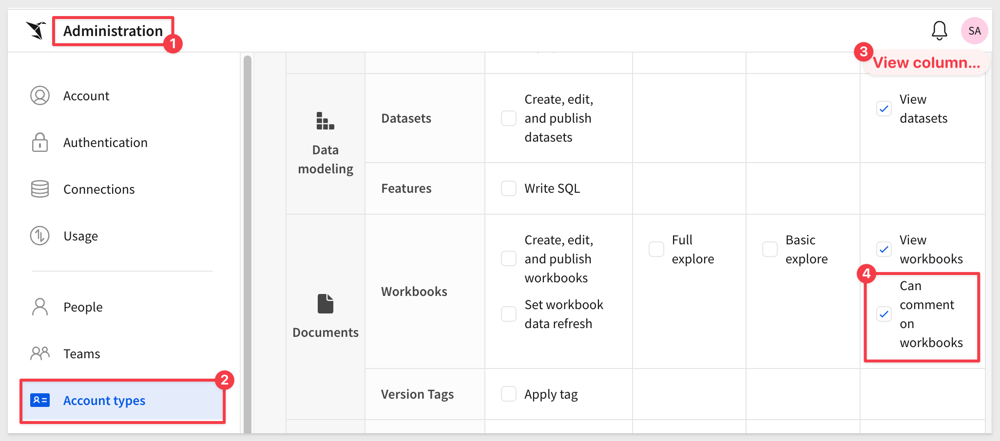

author: pballai
id: embedding_04_isolation_solutions
summary: embedding_04_isolation_solutions
categories: Embedding
environments: web
status: Published
feedback link: https://github.com/sigmacomputing/sigmaquickstarts/issues
tags: embedding
lastUpdated: 2024-05-12

# Embedding 04: Isolation Solutions

## Overview 
Duration: 5 

Embedding analytics is only valuable when the right users see the right data. Whether embedding content for internal users, external clients, or partners, isolation and security are critical.

This QuickStart focuses on the different isolation strategies available in Sigma embedding and is delivered as an overview rather than a hands-on approach. Links to examples and documentation will be provided as we go.

We'll explore how you can leverage Sigma's flexible security model to control who sees what content, which data slices are accessible, and which features are available—all while keeping user management streamlined.

While Sigma's embedding framework uses JWTs (JSON Web Tokens) to securely authenticate and authorize each request, we won’t go deep into JWT mechanics here. That’s covered in detail in [Embedding 01: Getting Started]()

Instead, we’ll focus on practical methods for isolating content and data:

- Workspaces, teams, and permission structures
- Row-Level and Column-Level Security (RLS & CLS)
- Role-based and feature-level controls
- Data isolation options

By the end of this QuickStart, you'll understand the options Sigma offers to build secure, isolated experiences for your embedded Sigma content that meet enterprise-grade security expectations—without sacrificing flexibility.

<aside class="positive">
<strong>IMPORTANT:</strong>  Some screens in Sigma may appear slightly different from those shown in QuickStarts. This is because Sigma continuously adds and enhances functionality. Rest assured, Sigma’s intuitive interface ensures that any differences will not prevent you from successfully completing any QuickStart.
</aside>

For more information on Sigma's product release strategy, see [Sigma product releases](https://help.sigmacomputing.com/docs/sigma-product-releases)

If something is not working as you expect, here's how to [contact Sigma support](https://help.sigmacomputing.com/docs/sigma-support)

### Target Audience
The typical audience for this QuickStart includes users of Excel, common Business Intelligence or Reporting tools, and semi-technical users who want to try out or learn Sigma.

### Prerequisites

<ul>
  <li>A computer with a current browser. It does not matter which browser you want to use.</li>
  <li>Access to your Sigma environment.</li>
  <li>Embedding 01: Getting Started is required to complete this QuickStart.</li>
</ul>

<aside class="positive">
<strong>IMPORTANT:</strong>  Sigma recommends using non-production resources when completing QuickStarts.
</aside>

<button>[Sigma Free Trial](https://www.sigmacomputing.com/free-trial/)</button>

<aside class="negative">
<strong>IMPORTANT:</strong>  Some features may carry a "Beta" tag. Beta features are subject to quick, iterative changes. As a result, the latest product version may differ from the contents of this document.
</aside>
 

## Authentication
Duration: 20

Let's start with a review of how Sigma embedded authentication works using this diagram:

**1:** In an embedded scenario, your application (the "native application") handles user authentication—Sigma doesn’t do the login for you.

**2:** Once authenticated, the native application calls the embed-API (server-side) to generate a JWT-signed URL.

**3:** The API generates a JWT-signed URL, signing it with a key obtained from your Sigma instance.

**4:** The signed URL is passed back to the native application.

**5:** The native application sets this URL as the `src` property of an iframe.

**6:** Sigma validates the JWT signature using the same key from step 3.

**7:** On verification, the embedded dashboard is rendered in the native application.

This ensures that only authorized, verified sessions load Sigma embeds in your app.

You control identity, while Sigma enforces security on each request.

Sigma supports a variety of authentication methods, such as username and password authentication, or SAML or OAuth single sign-on methods.

For more information on authentication in Sigma, see [Manage authentication](https://help.sigmacomputing.com/docs/manage-authentication)

<!-- END OF SECTION-->

## Authorization
Duration: 20

After authentication, we move to the three primary types of authorization used in Sigma:

### Content Authorization
This determines which Sigma workbooks, pages, or elements a user can access.

- Managed through workspaces, teams, and permissions.
- Determines what dashboards, tables, or visuals are visible to a user.

**Example:** Client_A can see only the “Sales Dashboard,” while Client_B sees “Marketing Reports.”

For more information on workbooks, see [Workbooks overview](https://help.sigmacomputing.com/docs/workbooks-overview)

For more information on teams, see [Create a team for embed users](https://help.sigmacomputing.com/docs/create-a-team-for-embed-users)

For more information on documents and folders, see [Folder and document permissions](https://help.sigmacomputing.com/docs/folder-and-document-permissions)

### Data Authorization
This determines what rows or columns of data a user is allowed to see within shared content.

- Implemented using Row-Level Security (RLS) and Column-Level Security (CLS).
- Ensures users see only their data slice, even if the workbook is shared with others.

**Example:** Regional managers see only their region’s sales data in a global dashboard.

For more information on RLS, see [Set up row-level security](https://help.sigmacomputing.com/docs/set-up-row-level-security)

For more information on CLS, see [Configure column-level security](https://help.sigmacomputing.com/docs/column-level-security)

### Feature Authorization
This determines which Sigma features and actions are available to a user.

- Defined by Account Types (View, Explore, Build) or custom account types.
- Restricts editing, exporting, drilling, or using advanced features.

**Example:** External clients can view and filter a report but cannot build new content.

For more information on account types see, [Account type and license overview](https://help.sigmacomputing.com/docs/account-type-and-license-overview)

<!-- END OF SECTION-->

## Data Authorization
Duration: 20

Beyond content, data authorization is key—it's about deciding what slice of data a user sees.

Sigma supports:

**Row-Level Security (RLS):**
Restricts access to data based on the characteristics of the person viewing the data.

**Column-Level Security (CLS):**
Restricts access to specific columns of data using user attributes or filters at the dataset level.

<aside class="positive">
<strong>IMPORTANT:</strong>  A best practice is to apply column-level security in a data model.
</aside>

A detailed example of using CLS in a Sigma data model is available in the QuickStart [Fundamentals 10: Data Modeling
](https://quickstarts.sigmacomputing.com/guide/fundamentals_10_data_modeling/index.html?index=..%2F..index#6)

For more information, see [Using CLS-restricted columns in formulas](https://help.sigmacomputing.com/docs/column-level-security)

For advanced needs, you can often extend security to the warehouse itself using such as row-based access policies or role switching.

**Parameterized SQL:**
If you prefer to write custom SQL to implement row-level security, you can use user attributes within SQL queries as well, at the schema, database, or even account level.

For more information about custom SQL, see: [Custom SQL](https://help.sigmacomputing.com/docs/row-level-security-in-embeds#custom-sql)

Sigma embedding respects these layers, giving you multiple isolation strategies.

<!-- END OF SECTION-->

## Data Isolation & Security Models Supported
Duration: 20

Let’s walk through the supported RLS and data isolation models in Sigma:

**1: - Co-mingled Data (Row-Level Security in Sigma):** 
When data for multiple clients resides in a single dataset, Sigma leverages User Attributes to dynamically filter rows and drive calculated columns. This enables fine-grained, per-user data access with flexible logic.

When data is co-mingled, a user attribute corresponding to the column used for data segregation needs to be created in Sigma.

A value for the user attribute must be set at the team or individual user level.

A calculated column is created in the dataset to compare the user attribute’s value with the segregating column’s value and return a true/false. A filter on the calculated column is set to return rows where the calculation returns true.

The user attribute value can be set via [Sigma’s API](https://help.sigmacomputing.com/reference/get-started-sigma-api), manually through the UI, or passed in the embed URL.

<aside class="negative">
<strong>NOTE:</strong>  This method needs to be applied at the dataset level and not in the workbook.
</aside>

**2 - Snowflake-Native Enforcement:** 
Sigma supports using Snowflake roles and dynamic role switching on the connection. This pushes security enforcement to Snowflake, ensuring that row-level filters and policies are applied at query time.

When data is co-mingled and Snowflake is the warehouse, Snowflake’s row-based access policies can be used to control which rows of data a user sees in Sigma. This requires creating appropriate Snowflake roles. Mapping tables may also be needed in Snowflake to map each role to data values that stripe the data.

A user attribute is created in Sigma to represent the Snowflake role. A value for the user attribute needs to be set for a team or individual users. In the Sigma connection configuration, this user attribute is set as the Snowflake role, thus parameterizing the Snowflake role Sigma uses to run queries.

The user attribute value can be set using Sigma’s API, manually through Sigma’s UI or as part of the embed URL.

**3 - Dynamic Role Switching:** 
Sigma allows you to dynamically assign a Snowflake role to a user at runtime via user attributes. This ensures the user’s data access adheres to Snowflake’s role-based security policies, including Row Access Policies and Column Masking Policies.

There is also a QuickStart [Embedding 09: Dynamic Role Switching with Snowflake](https://quickstarts.sigmacomputing.com/guide/embedding_09_dynamic_role_switching_snowflake/index.html?index=..%2F..index#0) to covers this in detail.

**4 - Dynamic Connection Switching:** 
In embedded use cases, Sigma can swap the Snowflake connection being used on a per-user basis. This is particularly useful for customers isolating data across multiple Snowflake accounts or warehouses.

**5 - Schema-Level Isolation:** 
Some organizations prefer isolating client data by schema. Sigma connections and datasets can be configured to reflect this segregation model.

When data is segregated by schema, a user attribute representing the schema to be queried is created in Sigma.

A value for the user attribute needs to be set for a team or individual users.

A custom SQL dataset uses the schema name as a parameter, driven by the user attribute, allowing Sigma to query the schema specified by the attribute’s value.

The user attribute value can be set using Sigma’s API, manually through Sigma’s UI or as part of the embed URL.

**6 - Database-Level Isolation:** 
For larger deployments, isolating client data by database offers stronger separation. Sigma supports this by pointing to distinct databases per client.

When data is segregated by database, a user attribute representing the database to be queried is created in Sigma.

A value for the user attribute needs to be set for a team or individual users.

A custom SQL dataset where the database name is a parameter set as the user attribute allows Sigma to query the database specified by the attribute’s value.

The user attribute value can be set using Sigma’s API, manually through Sigma’s UI or as part of the embed URL.

**7 - Account-Level Isolation:** 
For the highest level of separation, Sigma can connect to entirely separate Snowflake accounts per client using connection switching.

When data is segregated into different warehouse accounts, a connection needs to be created in Sigma for each account.

Datasets are typically developed against one connection, but you can dynamically switch connections at runtime by setting the [eval_connection_id](https://help.sigmacomputing.com/docs/create-an-embed-api-with-json-web-tokens#jwt-claims) JWT claim.

**8 - Parameterized SQL for Dynamic Access:** 
Across these models, Sigma’s Parameterized SQL enables dynamic query construction based on user attributes, roles, or runtime parameters—giving you flexible isolation aligned to your architecture.

For more information, see the section named `Change output based on a user attribute` located on the documentation page [Write custom SQL](https://help.sigmacomputing.com/docs/write-custom-sql)

### Column-Level Security (CLS) in Sigma
In addition to controlling which rows of data a user can see (RLS), Sigma also supports Column-Level Security (CLS) to control which columns are visible to users.

This is especially useful for sensitive data, like personally identifiable information (PII) or proprietary metrics, where certain users should not see specific fields—even with dataset access.

How it works:
- User attributes and team membership drive column visibility rules in Sigma datasets.
- The dataset dynamically includes, hides, or restricts columns based on these attributes.
- CLS is applied at the data model level

<aside class="positive">
<strong>IMPORTANT:</strong>  Best practice is to apply CLS at the data model level.
</aside>

This approach gives you fine-grained control while maintaining a single version of the dataset and workbook structure.

For example, managers might see cost and margin columns, while general users only see sales figures. All from the same workbook.

This approach offers a scalable, secure method to manage multi-tenant data visibility.

For more details, see [Example CLS configuration with a dataset](https://help.sigmacomputing.com/docs/column-level-security#example-cls-configuration-with-a-dataset)

<!-- END OF SECTION-->

## Feature Authorization
Duration: 20

Feature-level authorization is managed through account types.

Account types enable you to manage user access to specific features and capabilities available through each license tier. 

For example, Sigma offers four license types as described [here](). Each default account type (e.g., View, Act, Analyze, Build) has a predefined set of features associated with it:

Sigma also allows you to customize default account types or create entirely new custom account types.

Custom account types provide flexibility and scalability, allowing you to limit or extend functionality as needed.

For example, you may not want `View` users to comment on workbooks. You could simply uncheck the feature for viewers:

Optionally, you could create a new custom account type from scratch, giving a suitable name of your choice.

For more information, see [Account type and license overview](https://help.sigmacomputing.com/docs/account-type-and-license-overview#account-type-permission-availability-matrix) and [Create and manage account types
](https://help.sigmacomputing.com/docs/create-and-manage-account-types)

<!-- END OF SECTION-->

## Additional Information
Duration: 20

In this QuickStart, we explored the various strategies Sigma offers to securely isolate content, data, and features in embedded applications.

Sigma’s flexible approach allows customers to combine these methods to meet security and governance needs—whether using co-mingled datasets with user attributes, schema-level isolation, or warehouse-native policies.

Embedding with Sigma means you stay in control of identity and security while providing seamless, tailored analytics experiences for your users.

**Additional Resource Links**

[Blog](https://www.sigmacomputing.com/blog/) 
[Community](https://community.sigmacomputing.com/) 
[Help Center](https://help.sigmacomputing.com/hc/en-us) 
[QuickStarts](https://quickstarts.sigmacomputing.com/) 
 

&emsp;
&emsp;

<!-- END OF SECTION-->
