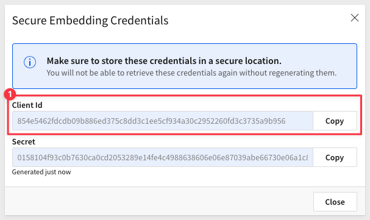
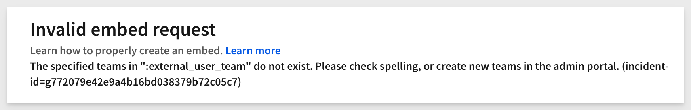
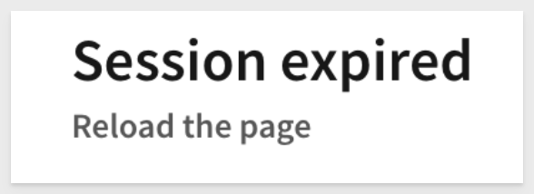

author: pballai
id: embedding_05_leverage_parameters_and_ua
summary: embedding_9_leverage_parameters_and_ua
categories: Embedding
environments: web
status: Published
feedback link: https://github.com/sigmacomputing/sigmaquickstarts/issues
tags: default
lastUpdated: 2024-02-26

# Embedding 05: Parameters and User-Attributes
<!-- The above name is what appears on the website and is searchable. -->

## Overview 
Duration: 5 

This QuickStart guide explains how Sigma uses its server-side API to facilitate embedding into external applications.

The server-side API is crucial for embedding Sigma into external applications. Its primary purpose is to generate a secure, one-time-use URL, allowing Sigma content to integrate seamlessly with the parent application's security during runtime.

Another function of the API is to control the embedded functionality using optional parameters.

You can find detailed documentation of this functionality [here.](https://docs.sigmacomputing.com/#overview) 

This QuickStart guide provides illustrative examples and screenshots of both required and optional parameters, helping developers understand the importance of each.

Before proceeding with this QuickStart guide, ensure you've completed the [Embedding 03: Secure Access QuickStart.](https://quickstarts.sigmacomputing.com/guide/embedding_03_secure_access/index.html?index=..%2F..index#0)

 ### Target Audience

Developers interested in leveraging both required and optional parameters, as well as user attributes, when embedding Sigma into their applications should refer to this guide.

### Prerequisites

<ul>
  <li>A computer with a current browser. It does not matter which browser you want to use.</li>
  <li>Access to your Sigma environment.</li>
  <li>A working web server based on Node.js, as demonstrated in the QuickStart Embedding 1: Prerequisites</li>
  <li>Some familiarity with Sigma is assumed. Not all steps will be shown as the basics are assumed to be understood.</li>
</ul>

<aside class="postive">
<strong>IMPORTANT:</strong><br> Sigma recommends that you use non-production resources when doing QuickStarts.
</aside>

<button>[Sigma Free Trial](https://www.sigmacomputing.com/free-trial/)</button>
  
### What You’ll Learn

Developers can learn how to utilize required and optional parameters, as well as user attributes, when embedding Sigma into their applications. We will also review common error messages and their meaning.


<!-- NOTE: SIGMA LOGO REQUIRED AT END OF EACH ## SECTION -->
<!-- END OF OVERVIEW -->

## Required Parameters
Duration: 20

This section is provided for completeness. While it's assumed that you are already familiar with these parameters, having completed the [Embedding 03: Secure Access](https://quickstarts.sigmacomputing.com/guide/embedding_03_secure_access/index.html?index=..%2F..index#0), we have included them here for reference. 

For each required parameter, an example based on Node.js code is provided

The following are **always required** parameters:

**1: nonce:**<br>
A unique random string (up to 255 characters). Sigma employs this to prevent application embed URLs from being shared and reused, ensuring that URLs can be used only once.

Sample Code:
```code
//CREATE A NONCE (NUMBER USED ONCE) BASED ON CRYPTO'S UUID FUNCTION:
const nonce = crypto.randomUUID();

//START TO CONSTRUCT THE LIST OF PARAMETERS TO BE SENT WITH THE URL BY THE API:
let searchParams = `?:nonce=${nonce}`;
```

<aside class="negative">
<strong>NOTE:</strong><br> The code provided closely mirrors that used in other Sigma embedding QuickStarts. Earlier, we defined a value for "searchParams". As we proceed, we'll add more parameters to it. Ultimately, 'searchParams' will contain a comma-separated list of all the required, optional parameters, and desired user attributes.
</aside>


**2: workbook_embed_path:**<br>
This is the URL generated by a Sigma user within the Workbook, corresponding to whichever portion of the Workbook they wish to embed. For instance, you can access the Embedding interface as follows:


Next, select which element, page, or the entire dashboard you wish to embed. 

In this example, we're creating one `Embed path` the entire workbook.


Sample Code:
```code
//SET A VALUE FOR EMBED_PATH:
const EMBED_PATH = 'https://app.sigmacomputing.com/embed/1-1YyXQ2H3j9oMygkpubIy0j';
```

When a bad embed_path is sent, the embed page will show this message:


**3: embed secret:**<br>
The embed secret is used by the API to generate the signature. This must be encoded in hexadecimal (as demonstrated by our sample code). The secret is generated by inside Sigma > `Administration` > `Developer Access`:


<aside class="negative">
<strong>NOTE:</strong><br> When you generate a secret through the Administration interface, a client_id is also produced. If you use the embed_secret from this interface, you must also include the client_id in the API.
</aside>

Sample Code:
```code
//SET A VALUE FOR SECRET:
const EMBED_SECRET = '3eb4680a3a34fdd593bec42546.....your full secret';

const SIGNATURE = crypto
            .createHmac('sha256', Buffer.from(EMBED_SECRET, 'utf8'))
            .update(Buffer.from(URL_WITH_SEARCH_PARAMS, 'utf8'))
            .digest('hex');
        const URL_TO_SEND = `${URL_WITH_SEARCH_PARAMS}&:signature=${SIGNATURE}`;
```

When an invalid secret is sent, the embed page will show this message:


**4: mode**<br>
Always set this to `userbacked` when embedding Sigma into an external application, where Sigma will adopt the security of the parent application for the logged-in user.

Sample Code:
```code
//SET SEARCHPARAMS = (PREVIOUS VALUE IN SEARCHPARAMS) + SIGMA EMBED MODE:
searchParams += '&:mode=userbacked';
```

When an invalid mode is sent (for example sending "userback"), the embed page will show this message:


**5: client_id:**<br>
This is required for all `Secure` embeds. It is generated from Sigma via `Administration` > `Developer Access` page.



Sample code (when required):
```code
//SET searchParams = (previous value in searchParams) + CLIENTID:
searchParams += '&:client_id=b7f210045d4bb4....your full clientID;
```

When an invalid clientID is sent, the embed page will show this message:


**6: user_email**<br>
The email address must be unique within Sigma and associated with the user's account.

Email addresses already linked to a standard Sigma user account (not an embed account) cannot be reused for embed users. However, it's possible to append `+embed` to the email address of a user who already has a Sigma account

<aside class="positive">
<strong>IMPORTANT:</strong><br> Embed users will automatically be added to Sigma's "People" page. This facilitates logging and the assignment of content that the embed user might save, provided they have been granted that level of access.
</aside>

Example of how embed user appears in Sigma `Administration` > `People` page:


If an invalid email is provided (for instance, sending "user@company" without the ".com" suffix), the embedded page will display the following message:


**7: external_user_id:**<br>
A unique identifier is required for each individual using the embed. Sigma employs this identifier for licensing purposes. It's advisable to use a value that corresponds to the userID in the parent application's user table. The sample code illustrates passing a GUID.

Sample Code:
```code
//SET SEARCHPARAMS = (PREVIOUS VALUE IN SEARCHPARAMS) + USERID OF IF THE USER AUTHENTICATED BY THE PARENT APPLICATION:
searchParams += '&:external_user_id=c880bc83-bd98-4085-8688-c27f8375dff9';
```


**8: external_user_team**<br>
The name of your embedded users' team(s) (e.g. "TeamName1"). Team membership in Sigma is used provision access and functionality, to groups of users who are in the same role (Role Based Access Control). The API can pass one or multiple team memberships for the logged-in user, at runtime.

Sample Code:
```code
//SET searchParams = (previous value in searchParams) + TEAM OF USER:
// IMPORTANT: The embedded content (WB, Page or Viz) must be shared with the Team for the request to work
searchParams += '&:external_user_team=TeamName1,TeamName2';	
```

The user's team membership in the example code would be recognized by Sigma as `TeamName1` and `TeamName2`. The user would have access to whatever content has been shared with these two teams, in Sigma.

<aside class="positive">
<strong>IMPORTANT:</strong><br> Adopt clear naming conventions for teams and workspaces to ensure easy understanding of their purpose and contents. To keep embedded URLs readable and easy to troubleshoot, avoid spaces in names for Teams, Account Types, and User Attributes. Spaces necessitate URL encoding, which can clutter the URL and make it less intuitive. Ensure you only URL encode when dealing with HTML special characters or spaces.
</aside>

In the event you must include spaces or other special characters, you can URL encode the parameter. For example, to send an account_type of `Sales Team` you would use this code:

Sample Code:
```code
// searchParams += '&:external_user_team=' + encodeURIComponent('Sales Team');	
```

When an invalid external_user_team is sent (for example, sending the value of "noteam"), the embed page will show this message:



However, if the team is left completely blank, a this message will be shown instead:


To learn more about [user access in Sigma, click here.](https://quickstarts.sigmacomputing.com/guide/embedding_04_federated_access/index.html?index=..%2F..index#0)


**9: session_length:**<br> 
The number of seconds the embed URL should remain valid after the application embed URL was generated. The maximum session length is 2592000 seconds (30 days).

Sample Code:
```code
//SET searchParams = (previous value in searchParams) + SESSION LENGTH:
searchParams += '&:session_length=600';
```

When a session length has been exceeded, the embed page will show this message:



When an invalid session_length is sent (for example, sending the value of "25920001", which is just over the max of "2592000"), the embed page will show this message:


**10 unix_timestamp:**<br> 
The current time, as a UNIX timestamp. Sigma uses this in combination with the `session_length` to determine if your link has expired. The URL is valid after the `unix_timestamp` and before the `session_length` expiration.

Sample Code:
```code
// SET searchParams = (previous value in searchParams) + THE CURRENT TIME AS UNIX TIMESTAMP:
searchParams += `&:time=${Math.floor(new Date().getTime() / 1000)}`;
```

This calculation, is JavaScript code that retrieves the current timestamp and converts it to seconds since the Unix epoch (January 1, 1970 00:00:00 UTC). 

Let's break it down step-by-step:

**1: new Date():**<br>
This creates a new Date object representing the current date and time.

**2: .getTime():**<br>
This method of the Date object returns the number of milliseconds since the Unix epoch.

**3: / 1000:**<br>
Since getTime() returns milliseconds, this division by 1,000 converts the value to seconds.

**4: Math.floor():**<br> 
This function rounds its input value down to the nearest whole number. This ensures that the resulting value is a whole number of seconds, without any fractional seconds.

**5: time=${...}:**<br> 
This is a template literal syntax in JavaScript. The value inside ${...} gets evaluated and inserted into the resulting string. If you're using this in a string context, the result would be something like time=1679991677 (the actual number would depend on the exact moment the code is executed).

The final result of the calculation is the assignment of the current timestamp in seconds to the variable time.

When an invalid time is sent (for example, if we remove the "/1000" from the formula), the embed page will show this message:


## Optional Parameters - Interface
Duration: 20

Sigma allows embed customers to further customize different appearance, behavior and security settings when embedding in a custom, external application. We have broken these out into general groups for you below. We are adding more optional parameters all the time.

Be sure to check out all the latest development at [Sigma's First Friday Feature page!](https://quickstarts.sigmacomputing.com/firstfridayfeatures/)

The following parameters allow you to tailor aspects of the embedded contents functionality to provide either functionality or useability, based on the use-case.

**1: disable_mobile_view:**<br>
If you set this boolean parameter to yes, workbooks won't automatically resize to the mobile layout. This can be useful in certain situations, when you do not want the content to be reduced to a mobile layout. 

Sample Code:
```code
//SET A VALUE FOR disable_mobile_view. Default=no.
searchParams += '&:disable_mobile_view=yes';
```


**2: enable_UI_language:**<br>
Apply an Existing Translation to an Embed. Localization allows workbook editors to translate workbook text to other locales. 

Translations are managed per-workbook and are available when viewing embedded workbooks and workbook previews

Sample Code:
```code
//SET A VALUE FOR language. Default=en 
searchParams += '&:lng=fa-ca';
```

[List of supported languages is here.](https://help.sigmacomputing.com/docs/embedded-workbook-localization#supported-languages-and-locales)

**3: first_name:**<br>
Sets the first name of the current embed user. The name, if set, will show in the folder menu and in the emails that are sent out.

Sample Code:
```code
//SET A VALUE FOR first_name. Default=Embed.
searchParams += '&:first_name=Bob';
```

<aside class="negative">
<strong>NOTE:</strong><br> Use of the "first_name" parameter requires a corresponding "last_name" parameter.
</aside>

If both first_name and last_name parameters are absent, the current user keeps their current name (or, if a new user is created, their first name will be set to Embed, last name to User)


**4: hide_folder_navigation:**<br> 
Available for "mode=userbacked"; if set to true, it hides the folder navigation options in the bottom left. Default=no.

Sample Code:
```code
//SET A VALUE FOR hide_folder_navigation. Default=false.
searchParams += '&:hide_folder_navigation=true';
```

The default, `false`, looks like this:


When set to `true`, looks like this:


Some items in the folder list (for example "Send now") are controlled in the `Account Type` configuration inside Sigma.


**5: hide_menu:**<br>
If set to True, hides the menu in the bottom-left for saved workbooks.

Sample Code:
```code
//HIDE THE MENU IN BOTTOM-LEFT CORNER FROM EMBED USERS. DEFAULT=false
searchParams += '&:hide_menu=true';
```

The default, `false`, looks like this:


When set to `true`, looks like this:


**6: hide_run_as_recipient:**<br>
When set to true, hides the `Run queries as recipient` option in the `Send Now` and `Schedule Exports` modals. Default = `false`.

**7: hide_schedule:**<br>
Hides the Schedule exports option in the menu for saved workbooks. Default = `false`.

Sample Code:
```code
//HIDE THE "SCHEDULE NOW" OPTION IN THE BOTTOM-LEFT CORNER FROM EMBED USERS. DEFAULT=false
searchParams += '&:hide_schedule=true';
```

<aside class="negative">
<strong>NOTE:</strong><br> This option is only available in workbooks that have been saved by an embed user.
</aside>

The default, `false`, looks like this:


When set to `true`, looks like this:


**8: hide_send:**<br>
Hides the `Send now` option in the menu for saved workbooks. Default = `false`.

Sample Code:
```code
//HIDE THE "SEND NOW" OPTION IN THE BOTTOM-LEFT CORNER FROM EMBED USERS. DEFAULT=false
searchParams += '&:hide_send=true';
```

The default, `false`, looks like this:


When set to `true`, looks like this:


**9: hide_sheet_interactions:**<br>
This hides the `sort` dropdown on a column header or filter bar access for users of the embedded workbook. Default = `false`.

Sample Code:
```code
//HIDE SHEET INTERACTIONS OPTION FROM EMBED USERS. DEFAULT=false
searchParams += '&:hide_sheet_interactions=false';
```

The default, `false`, looks like this:


When set to `true`, looks like this:


**10: hide_tooltip:**<br>
If set to true and a user hovers over a tooltip, the tooltip is no longer displayed. 

This applies to charts (line, bar, area, etc) and map chart marks. 

Sample Code:
```code
//SET A VALUE FOR hide_tooltip. Default=false.
searchParams += '&:hide_tooltip=true';
```

The default, `false`, looks like this:


When set to `true`, looks like this:


**11: hide_workbook_name:**<br> 
A boolean value that hides the workbook name near the folder icon, in the embed footer. Default = `false`

Sample Code:
```code
//SET A VALUE FOR hide_workbook_name. Default=false.
searchParams += '&:hide_workbook_name=true';
```


**12: last_name:**<br>
Sets the last name of the current embed user. The name, if set, will show in the folder menu and in the emails that are sent out.

Sample Code:
```code
//SET A VALUE FOR last_name. Default=User.
searchParams += '&:last_name=Smith';
```

<aside class="negative">
<strong>NOTE:</strong><br> Use of the "last_name" parameter requires a corresponding "first_name" parameter.
</aside>

If both first_name and last_name parameters are absent, the current user keeps their current name (or, if a new user is created, their first name will be set to Embed, last name to User)


**13: loading_bg:**<br> 
Allows you to change the background on the loading and error screens when used with hex color codes.

Sample Code:
```code
//SET A COLOR FOR THE BACKGROUND ON LOADING AND ERROR SCREENS
searchParams += '&:loading_bg=FF0000';
```

If we create an error (remove the API secret from embed-api.js, save the change, and reload the browser), we see a red background:


**14: loading_text:**<br> 
Allows you to change the font color on the loading and error screens when used with hex color codes.

Sample Code:
```code
//SET A COLOR FOR THE FONT ON LOADING AND ERROR SCREENS
searchParams += '&:loading_text=FFFFFF';
```

If we create an error (remove the API secret from embed-api.js, save the change, and reload the browser), we see a white font:


**15: menu_position:**<br>
Allows you to change the position of the toolbar to `top`, `bottom`, or `none`.

`none` removes the toolbar. 

If this value isn't set, it defaults to `bottom`.

Sample Code:
```code
//SET THE POSITION OF THE TOOLBAR. DEFAULT = "bottom".
searchParams += '&:menu_position=top';
```

Examples:

<br><br>

<br><br>


**16: responsive_height:**<br>
Setting this to true this allows developers access to workbook:pageheight:onchange JavaScript event.

This is discussed in detail in the [QuickStart: How to: Responsive iframes with Sigma](https://quickstarts.sigmacomputing.com/guide/embedding_dynamic_iframes/index.html?index=..%2F..index#0)

Sample Code:
```code
//ENABLE JAVASCRIPT EVENT FOR responsive_height. DEFAULT = "false".
searchParams += '&:responsive_height=true';
```


**17: show_footer:**<br>
If set to false, it hides the file explorer, workbook page tabs, `Save As` / `Edit` options, and Sigma logo in footer. Default = `true`. 

Sample Code:
```code
//SHOW FOOTER ON PAGE OR NOT. DEFAULT = "true".
searchParams += '&:show_footer=false';
```

<br><br>


**18: theme:**<br>
Use any of the default themes (Light, Dark, and Surface) or any themes defined in your org. Use the name of the theme as the value. The value is case-sensitive. 

Sample Code:
```code
//CHANGE THEME SIGMA WILL USE FOR THE EMBED. DEFAULT = "Light".
searchParams += '&:theme=Dark';
```

**Specifying a theme to the embed API, will override any theme that is set at the Workbook level.**

For example, we set the theme in this Workbook to be `Dark`:

<br><br>

When we reload the embed page, the embed has adopted the `Dark` theme because we did not specify one in embed-api.js.


Specify the theme to be `Light` in embed-api.js, save the change and reload the browser page.

Now the embed has adopted the `Light` theme, even though the `Dark` theme was set in the Workbook.


<aside class="positive">
<strong>IMPORTANT:</strong><br> Embed customers can create their own custom themes so that the Sigma content closely follows the parent applications styling.
</aside>

To learn more about [custom themes in Sigma, click here.](https://help.sigmacomputing.com/docs/create-and-manage-workbook-themes)

**19: use_user_name:**<br>
Displays the workbook creator’s name (instead of email) in embed menus and system-generated emails.

Sample Code:
```code
//Sets the workbook creator’s name (instead of email) in embed menus and system-generated emails. DEFAULT=
searchParams += '&:use_user_name=Bob Smith';
```


<!-- END OF SECTION-->

## Optional Parameters - Security
Duration: 20

Items in this section are generally related to security operations.


**1: account_type:**<br>
Account types is how Sigma provides a specific set of permissions to a user, and is a role-base access control system (RBAC). Sigma provides default permissions to get you started. These are `Viewer` and `Creator` account types. Customers are able to create their own account types and customize the level of allowed functionality to suit their use-cases.

It is recommended to send a value, at the lowest level of permissions for users (ie: `Viewer`), unless the user is granted something higher level. 

[To read more about account types in Sigma, click here.](https://help.sigmacomputing.com/docs/user-account-types)

There is also a [QuickStart: How To: Federated Access with Sigma.](https://quickstarts.sigmacomputing.com/guide/embedding_04_federated_access/index.html?index=..%2F..index#0)

Sample Code:
```code
//THE ACCOUNT TYPE FOR THE CALLING USER NEEDS TO BE SPECIFIED AND THE ACCOUNT TYPE MUST EXIST IN SIGMA FIRST.
searchParams += '&:account_type=viewer';
```


**2: control_id / control_value:**<br>
These two parameters work together to set a value for a specific Sigma control element (ie: date range picker) that may exist on the embedded content. This allows you to customize what your viewers see. 

You may pass multiple control IDs and values, and controls may also be hidden from users such they enforce record selection (for example), without allowing the users to change the control values in the embed.

[To read more about controls in Sigma, click here.](https://help.sigmacomputing.com/docs/intro-to-control-elements)

For example, in this workbook, we have a table and one control element. The control element has a `Control ID` = `Store-Region` and is set to target the table when a user makes a selection.


If we want the embed to only show data for the `East` region, we can use the API to make that happen.

Sample Code:
```code
//SET ID FOR TARGETED control_id and control_value
searchParams += '&Store-Region=East';
```

After updating embed-api.js and saving the changes, reloading the embed page results in the table showing only stores in the east store region:


In this example, the users are allowed to adjust the control values. If we moved the control to a new, hidden workbook page, the table would be "locked" to display only the east store region. 

This is one method for applying row-level security. Another is to use user-attributes, which is discussed in the section 5.


**3: showUnderlyingData:**<br>
This parameter works on embeds of a single visualization only. When embedding a bar chart (for example), only the chart will appear in the embed by default. If this parameter is set to `true`, then the chart and it's underlying data will be shown, below the chart. An example of this is:


Sample Code:
```code
//HIDE UNDERLYING DATA OPTION FROM EMBED USERS. DEFAULT=false
searchParams += '&:showUnderlyingData=true';
```

<aside class="positive">
<strong>IMPORTANT:</strong><br> It is important to understand that a users "account type" is considered first and then this parameter. For example, if a user has permission to view the underlying data, even if the parameter to hide it was sent in the embed API, the toggle button to show it again is still there.
</aside>


**4: oauth_token:**<br>
You can pass secure tokens to Sigma to authenticate users into Sigma's embedded analytics and drive granular user permissions. 

Read more about [OAuth for Embeds here.](https://help.sigmacomputing.com/docs/oauth-for-embeds)

This feature allows embedding customers to enhance authentication security using OAuth. See our [complete documentation for OAuth with Snowflake.](https://help.sigmacomputing.com/docs/oauth-with-snowflake)

Sample Code:
```code
//PASSES A SECURE TOKEN TO SIGMA THAT AUTHENTICATES CONNECTIONS USING OAUTH
searchParams += '&:oauth_token={token}';
```


<!-- END OF SECTION-->

## Optional Parameters - User Attributes
Duration: 20

Sigma User Attributes (UA) act like variables that are sent from the parent application, at runtime, using the API. 

Administrators create a UA in Sigma and then the API uses that (by name), to update it's value for a particular user session.

UA use is well documented; links to documentation and QuickStarts are below:

The primary uses for UAs are to set values for:

1: Enforcing row-level security:<br>
[Documentation](https://help.sigmacomputing.com/docs/dataset-row-level-security)<br>
[QuickStart Embedding 06: Row Level Security](https://quickstarts.sigmacomputing.com/guide/embedding_06_row_level_security/index.html?index=..%2F..index#0)

2: In custom SQL, as a where clause:<br>
[Documentation](https://help.sigmacomputing.com/docs/write-custom-sql)<br>
[QuickStart Embedding 06: Row Level Security / Page 6](https://quickstarts.sigmacomputing.com/guide/embedding_06_row_level_security/index.html?index=..%2F..index#5)

3: Dynamic warehouse role switching:<br>
[Documentation](https://help.sigmacomputing.com/hc/en-us/articles/12717103444755-Configure-User-Attributes-on-a-Snowflake-Connection-#h_01GPHF4EJ127Z9453ZSQMBCP7Q)<br>
[QuickStart Embedding 09: Dynamic Role Switching with Snowflake](https://quickstarts.sigmacomputing.com/guide/embedding_09_dynamic_role_switching_snowflake/index.html?index=..%2F..index#0)

Sample Code:
```code
//PASS THE NAME OF THE USER ATTRIBUTE THAT IS CONFIGURED IN SIGMA AND THE VALUE TO SET IT TO:
searchParams += '&:ua_{ua name}={ua value}';

// FOR EXAMPLE:
// searchParams += '&:ua_Region=East';

// or for multiple values:
// searchParams += '&:ua_Region=East,West';
```


<!-- END OF SECTION-->

## Common Error Messages
Duration: 20

We have covered some error messages, related to parameter in the previous sections. Those are repeated here for convenience. 

In addition, the following are other potential error messages and description to aide in troubleshooting embeds.

 <ul>
      <li><strong>EEXIST:</strong> Indicates duplicates exist. Duplicate team, duplicate user, etc. Unlikely to happen for embeds, but not impossible if a bug is introduced.</li>
      <li><strong>EPERM:</strong> The requested operation not permitted. For example, if a user forgets to share an embed with a team, account type does not give you edit access to a workbook.</li>
      <li><strong>ESTALE:</strong> Unlikely to happen for embeds, but not impossible if a bug is introduced.</li>
      <li><strong>ENOENT:</strong> Object does not exist (or no longer exists). If you try to bring up a workbook which does not exist.</li>
      <li><strong>EACCES:</strong> Permission denied. For example, when you do not have access to edit a workbook, and try to.</li>
      <li><strong>EINVAL:</strong> Invalid argument. For example, when the URL contains team that does not exist.</li>
      <li><strong>ETIMEDOUT:</strong> Request timed out. For example, query did not respond from warehouse in specified timeframe.</li>
      <li><strong>NETWORK:</strong> Unable to connect to Sigma. Typically, a local network error.</li>
      <li><strong>UNKNOWN:</strong> This is the default API error message and acts as a "catch-all".</li>
</ul>

### Parameter-based error messages

**1: Invalid embed_path:**<br>


**2: Invalid Embed secret:**<br>


**3: Invalid embed mode:**<br>


**4: Invalid clientID:**<br>


**5: Invalid email:**<br>


**6: Invalid external_user_team:**<br>

However, if the team is left completely blank, a this message will be shown instead:<br><br>


**7: Session length has been exceeded:**<br><br>

When an invalid session_length is sent (for example, sending the value of "25920001", which is just over the max of "2592000"), the embed page will show this message:<br>


**8: Invalid time:**<br> 
(for example, if we remove the "/1000" from the formula), the embed page will show this message:


<!-- END OF SECTION-->

## What we've covered
Duration: 5

In this QuickStart, we learned how to utilize required and optional parameters, as well as user attributes, when embedding Sigma into external applications. We also reviewed common error messages and their meaning.

<!-- THE FOLLOWING ADDITIONAL RESOURCES IS REQUIRED AS IS FOR ALL QUICKSTARTS -->
**Additional Resource Links**

Be sure to check out all the latest developments at [Sigma's First Friday Feature page!](https://quickstarts.sigmacomputing.com/firstfridayfeatures/)

[Help Center Home](https://help.sigmacomputing.com)<br>
[Sigma Community](https://community.sigmacomputing.com/)<br>
[Sigma Blog](https://www.sigmacomputing.com/blog/)<br>
<br>

[](https://twitter.com/sigmacomputing)&emsp;
[](https://www.linkedin.com/company/sigmacomputing)&emsp;
[](https://www.facebook.com/sigmacomputing)


<!-- END OF WHAT WE COVERED -->
<!-- END OF QUICKSTART -->
