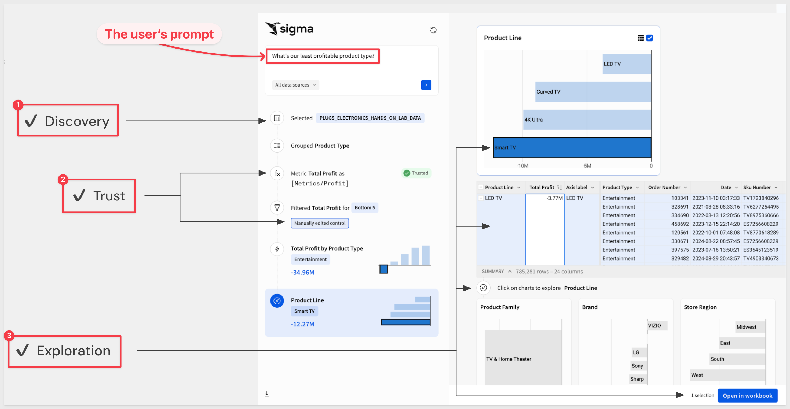

author: pballai
id: embedding_06_creating_a_premium_service_v3
summary: embedding_06_creating_a_premium_service_v3
categories: Embedding
environments: web
status: published
feedback link: https://github.com/sigmacomputing/sigmaquickstarts/issues
tags: default
lastUpdated: 2026-06-06

# Embedding 06: Creating a Premium Service

## Overview 
Duration: 5 

Monetizing embedded analytics is not just about charging for access—it's about offering differentiated, high-value experiences based on users’ needs and their willingness to pay. In this QuickStart, we explore how Sigma's flexible embedding capabilities can help you define and deliver a premium service tier within your native application.

This QuickStart is intended as a strategic guide rather than a technical walkthrough. We'll cover different angles to consider when designing premium offerings using Sigma.

Creating a premium service tier with embedded Sigma dashboards isn't just technically possible—it's a proven path to expanding the value of your application. Whether you're gating features, roles, or capabilities, Sigma gives you the tools to deliver differentiated user experiences that scale with your business.

As we go, we will show screenshots from the local host application created in the QuickStart: [Embedding 01: Getting Started](https://quickstarts.sigmacomputing.com/guide/embedding_01_getting_started_v3/index.html?index=..%2F..embedding#0)

<aside class="positive">
<strong>IMPORTANT:</strong>  Some screens in Sigma may appear slightly different from those shown in QuickStarts. This is because Sigma continuously adds and enhances functionality. Don’t worry—Sigma’s intuitive interface means any differences won’t stop you from completing a QuickStart successfully.
</aside>

For more information on Sigma's product release strategy, see [Sigma product releases](https://help.sigmacomputing.com/docs/sigma-product-releases)

If something doesn’t work as expected, here's how to [contact Sigma support](https://help.sigmacomputing.com/docs/sigma-support)

### Target Audience
Product Managers and semi-technical users who will be aiding in the planning or implementation of Sigma with embedding. No SQL or technical data skills are needed to complete this QuickStart. 

### Prerequisites

<ul>
  <li>Any modern browser is acceptable.</li>
  <li>Access to your Sigma environment.</li>
  <li>Some familiarity with Sigma is assumed. Not all steps will be shown, as the basics are assumed to be understood.</li>
 </ul>

<aside class="positive">
<strong>IMPORTANT:</strong>  Sigma recommends using non-production resources when completing QuickStarts.
</aside>

<button>[Sigma Free Trial](https://www.sigmacomputing.com/free-trial/)</button>

<aside class="negative">
<strong>IMPORTANT:</strong>  Some features may carry a "Beta" tag. Beta features are subject to quick, iterative changes. As a result, the latest product version may differ from the contents of this document.
</aside>
 

## Premium by Licensing and Account Type
Duration: 5

Aligning to Sigma's built-in licensing model via account types is the easiest way to create clear separation for customers in a way that’s easy to understand. There are five default account types built into your organization: View, Act, Analyze, Build, and Admin but you do not have to offer them all; starting simple and customizing from there is a great way to test the model.

For example, the standard experience may include a free tier, limiting users to viewing curated dashboards. This aligns with Sigma's `View` license type. 

An embedded table would only allow `View` users to comment and refresh the data:

For more capable "power users", a premium tier might include full service capabilities based on Sigma's `Build` license. 

This is a simple example designed to get you thinking about what specific capabilities your customers would be willing to pay for in a tiered service offering. In reality, `Build` might be too much of a leap from `View` and feel overwhelming in some cases. It really depends on the kinds of things the host application—your SaaS product enables and the demand from your customers too. 

With that in mind, we would recommend offering the `Analyze` tier as a as a strong starting point for your first premium service tier. 

A tier based on `Analyze` includes all permissions from `View` and `Act` and is recommended for users who require more deep-dive capabilities without building workbooks themselves.

For example, if we pass the JWT claim `Account Type` as `Analyze` at runtime instead of `View`, users are allowed to set alerts, schedule exports and export a limited amount of data too:

Creating a premium service this way is frictionless and can be implemented very quickly as no additional configuration or coding is required beyond segmenting users by license type in the host applications authentication service. 

<!-- END OF SECTION-->

## Premium by Feature Unlocks
Duration: 5

The first method, `Premium by Licensing and Account Type`, may be desirable for its simplicity—but what if we want to give users a bit more functionality? 

We still prefer to use the existing license types to keep things as simple as possible.

First, we edit the `Analyze` license account type and check on the `Full explore` feature. We also revoked the ability to comment on workbooks:

We also need to adjust the workbook's sharing setting from `View` to `Can explore` for the user's team to reflect the increased permission:

Now the users with `Analyze` permission can do a whole lot more with the content without affecting any other users:

For example, they might group the data:

<aside class="positive">
<strong>IMPORTANT:</strong>  In this example, changes made to the embed are not persisted and the embed will revert to its published state when the page is reloaded. 
</aside>

<!-- END OF SECTION-->

## Premium by Custom Account Types
Duration: 5

Adjusting the Sigma-provided account types can only take us so far, and the best approach is to create an account type that allows exactly what we want to offer. 

For standard users we can continue using the `View` and `Analyze` account types discussed earlier, but let's say we have a class of users that are willing to pay a premium, but only for true self-service functionality. 

Custom account types unlock this use case and lets you offer a curated dashboard to most users, while unlocking self-service builders, report creators, or input tools for advanced roles. You control what’s offered, and it can be adjusted at any time.

### Create a custom account type

In Sigma, we simply click the `Create new account type` button:

When created, the `Premium Service` account type is granted the Sigma `View` license:

As more functionality is added, the Sigma license required will automatically adjust to reflect the selected features.

In this rather lengthy screenshot, we have elected to enable the ability to:

- Fully manage workbooks based on the original embedded content
- Comment on workbooks
- Badge workbooks (e.g., “This is the trusted workbook…")
- Share with other users/teams
- Download, export to email, and schedule
- Save to shared folders and create new folders
- Use AI to explain formulas

Once the account type is saved, we can use it in our sample application by adjusting for the new account type and exposing the embedded workbook menus:

Now a user with the `Premium Service` account type has a true self-service experience:

Additionally, the same embedded content can be reused for users with lower permission levels.

For more information, see [Custom account types](https://help.sigmacomputing.com/docs/create-and-manage-account-types#custom-account-types)

<!-- END OF SECTION-->

## AI as a Service
Duration: 5

Providing AI functionality isn't especially difficult these days—but making it easy to use and genuinely helpful requires thoughtful design and a deep understanding of how users can benefit from the results.

Ask Sigma is Sigma's natural language query interface, designed to function like a data analyst. It allows users to pose questions in everyday language and receive guided, transparent analyses.

Embedding Ask Sigma into your application transforms user interactions with data and differentiate your product with an AI offering. By integrating Ask Sigma, you provide users with a powerful tool to derive insights, fostering a data-driven culture within your application.

In the image below, Ask Sigma shows every step AI took to generate its answer. This lets users double-check results, edit any step of the analysis, and work more confidently with AI.:

### Embedding Ask Sigma
Embedding Ask Sigma is straightforward in Sigma. 

This is demonstrated in the QuickStart: [Embedding 08: Embedding Ask Sigma](https://quickstarts.sigmacomputing.com/guide/embedding_08_ask_sigma_v3/index.html?index=..%2F..embedding#0).

First, we add `Ask Sigma` permission to the `Premium Service` account type.

Next we need to configure which AI provider will be used to process requests.

Sigma currently supports warehouse AI models (on Snowflake and Databricks connections) and external models (OpenAI and Azure OpenAI Foundry) as AI providers.

For the most recent provider information, see [Configure an AI provider](https://help.sigmacomputing.com/docs/configure-ai-features-for-your-organization)

You must explicitly grant permission to the database, schema, or table that AI can use.

<aside class="positive">
<strong>IMPORTANT:</strong>  Customers who have sensitive data may want to use their own warehouse provider in order to prevent exposing data to third party providers.
</aside>

To enable Ask Sigma, simply pass a revised URL to Sigma to enable Ask Sigma on any page. This is done by editing the {org slug} value in the `ASK_SIGMA_BASE_URL` variable in the sample projects environment file. The "org slug" represents your company name as registered in Sigma. 

For example:

For example, we asked Sigma `How many customers are in the Automobile segment?` and restricted the query to the `Customers` table.

Sigma shows the AI's work as it works towards providing the answer and some different visualizations too.

When done, users can select one or more visuals to `Open in workbook` right away:

Power users will love Ask Sigma because it saves time and accelerates iteration.

<!-- END OF SECTION-->

## Implementation Notes
Duration: 5

Here are additional considerations when planning a premium service offering (in no particular order):

**Will customers want to bring their own data?** 
They can—using [Sigma Input Tables](https://help.sigmacomputing.com/docs/intro-to-input-tables) to manually enter or upload small datasets (e.g., targets, budgets, forecasts) directly into your app’s embedded dashboards.

**How will usage be tracked and measured?** 
Leverage Sigma's [Audit logs](https://help.sigmacomputing.com/docs/access-and-explore-audit-logs) and [Usage overview](https://help.sigmacomputing.com/docs/usage-overview) to monitor which features are used most frequently, helping you refine tier boundaries and identify upsell opportunities.

**How do we make the experience feel native?** 
Use Sigma’s [Event-Based Interactivity](https://help.sigmacomputing.com/docs/inbound-and-outbound-events-in-embeds) to respond to user actions, synchronize filters, and hide Sigma UI elements where appropriate.

**Do we want to support full self-service for certain roles or tiers?** 
Some customers may want to build their own dashboards or modify existing [Templates](https://help.sigmacomputing.com/docs/get-started-with-workbook-templates). Consider offering limited access to the workbook editor, a “starter dataset,” and a clean folder structure to enable this.

**What security and data isolation mechanisms are needed?** 
Will each customer see their own data? Is a review of the various [isolation solutions](https://quickstarts.sigmacomputing.com/guide/embedding_04_isolation_solutions/index.html?index=..%2F..embedding#0) in order? You may need to pair embedded access with row-level security, role-based permissions, or [dynamic role switching](https://quickstarts.sigmacomputing.com/guide/embedding_dynamic_role_switching_v3/index.html?index=..%2F..embedding#0).

**Should we enable writeback or collaboration features?** 
Premium tiers might include input tables, user comments, export options, or even [API-triggered workflows](https://quickstarts.sigmacomputing.com/guide/developers_api_code_samples/index.html?index=..%2F..index#0) to enable action directly from the dashboard.

**Will we need environment-based preview or QA flows?** 
Consider how you’ll test new premium features (e.g., in staging vs. production). You may need separate [Sigma environments](https://quickstarts.sigmacomputing.com/guide/embedding_10_version_tagging_v3/index.html?index=..%2F..embedding#0) or [user attributes](https://quickstarts.sigmacomputing.com/guide/embedding_03_using_jwt_claims_and_embed_parameters_v3/index.html?index=..%2F..embedding#0) to simulate tier behavior during development.

**How do we handle feature upgrades over time?** 
Ensure your [JWT logic](https://help.sigmacomputing.com/docs/create-an-embed-api-with-json-web-tokens) and role mappings are flexible enough to unlock new capabilities without requiring a full redeploy. Use user attributes or backend toggles where possible.

<!-- END OF SECTION-->

## What we've covered
Duration: 5

In this QuickStart, we explored how to design and implement a premium service tier using Sigma’s flexible embedding capabilities. Specifically, we looked at three different strategies:

- **Premium by Licensing and Account Type**: Aligning Sigma license types (like `View`, `Analyze`, or `Build`) with your product’s customer tiers for quick, low-friction implementation.
- **Premium by Feature Unlocks**: Using permission toggles and content sharing settings to progressively expose functionality within the same Sigma license level.
- **Premium by Custom Account Types**: Creating tailored permission bundles for high-value user segments seeking full self-service capabilities.

We also discussed embedding **Ask Sigma** as an AI-powered differentiator, and provided key implementation considerations—from usage tracking and native UI integration to data isolation and long-term upgrade flexibility.

Together, these approaches give you the building blocks to launch a premium analytics tier that adds real value for users—and creates new revenue opportunities for your business.

**Additional Resource Links**

[Blog](https://www.sigmacomputing.com/blog/) 
[Community](https://community.sigmacomputing.com/) 
[Help Center](https://help.sigmacomputing.com/hc/en-us) 
[QuickStarts](https://quickstarts.sigmacomputing.com/) 

Be sure to check out all the latest developments at [Sigma's First Friday Feature page!](https://quickstarts.sigmacomputing.com/firstfridayfeatures/)
 

&emsp;
&emsp;

<!-- END OF WHAT WE COVERED -->
<!-- END OF QUICKSTART -->
