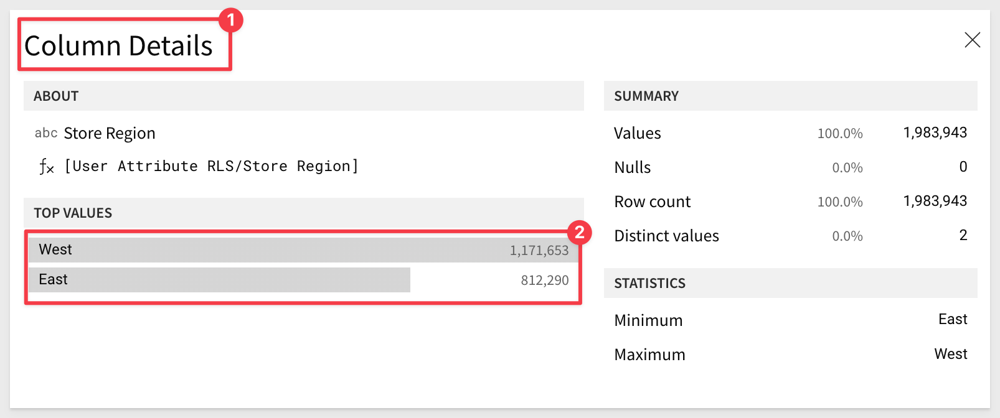

author: pballai
id: embedding_06_row_level_security
summary: Application Embedding with Row Level Security using User Attributes
categories: Embedding
environments: web
status: Published
feedback link: https://github.com/sigmacomputing/sigmaquickstarts/issues
tags: default
lastUpdated: 2023-01-12

# Embedding 06: Row Level Security

## Overview 
Duration: 5 

This QuickStart introduces you to Sigma embedding using Row-Level Security **(RLS)** to personalize / limit the data exposed to a user based on values passed to Sigma at runtime. 

This QuickStart assumes you have already taken the QuickStart [QuickStart: Embedding 01: Prerequisites,](https://quickstarts.sigmacomputing.com/guide/embedding_01_prerequisites/index.html?index=..%2F..index#0) so that you have a sample environment to complete the tasks.

We also recommend you take the the QuickStart [QuickStart: Embedding 03: Secure Access,](https://quickstarts.sigmacomputing.com/guide/embedding_03_secure_access/index.html?index=..%2F..index#0) as we will build on that content. 

**Some steps may not be shown in detail as we assume you have taken these other two QuickStarts or are familiar with Sigma workflows.**

RLS is a method for restricting data access based on user identity or characteristics. Sigma supports RLS in a few different ways but the vast majority of Sigma customers use RLS with User Attributes at the Dataset level. This QuickStart will cover how to implement RLS Dataset with User Attributes.

### Target Audience
Semi-technical users who will be aiding in the planning or implementation of Sigma. Limited SQL and technical data skills are needed to do this QuickStart. It does assume some common computer skills like installing software, using Terminal, navigating folders and edit/copy/paste operations.

### Prerequisites

<ul>
  <li>A computer with a current browser. It does not matter which browser you want to use.</li>
  <li>Access to your Sigma environment. A Sigma trial environment is acceptable and preferred.</li>
  <li>A working web server based on Node.js as demonstrated in the QuickStart Embedding 1: Prerequisites</li>
  <li>Some content to embed. You can embed a Workbook, Table or Visualization.</li>
  <li>Downloadable project files discussed later in this document.</li>
</ul>

<button>[Free Trial](https://www.sigmacomputing.com/free-trial/)</button>

<ul>
  <li></li>
    <li>Node.js and required Packages (all free):
        <ul>
        <li>Express</li>
        <li>Node-supervisor</li>
        <li>crypto (included with Node.js installation)</li>
        </ul>
    </li>
</ul>
  
### What You’ll Learn
The exercises in this QuickStart will discuss and walk you through the steps to implement Dataset RLS with User Attributes (**UA**).

### What You’ll Build
We will embed Sigma content inside a Node.js web application, passing runtime parameters to configure the embed and demonstrate Row-Level Security.


<!-- END -->

## **User Attributes**
Duration: 10

Sigma uses this method to restrict data access based on **user identity combined with User Attributes (UA)** passed by the Parent application at runtime.

Datasets are used to implement all RLS in embedded Sigma objects.

The UA must be defined ahead of time (one time) in the Sigma portal. You can define any UA and as many as required to enforce the required data security. You can set a default value to a UA at this time. 

The Parent application must pass an embed `mode` argument of `userbacked`.

To implement this feature, you must have minimum `Can edit` access on the individual dataset.

The workflow (as shown below) is very straightforward and yet flexible to allow only the data that is appropriate for the user to be shown, based on one or more UAs. How you decide to filter the data is up to your organization's roles/rules. 

<aside class="negative">
<strong>NOTE:</strong><br> This workflow does not map to RLS with Custom SQL which eliminates the need to create the calculated column and filter in the Dataset. We will cover that later.
</aside>


[A full listing of all the supported Sigma user attributes can be found here.](https://quickstarts.sigmacomputing.com/guide/embedding_05_leverage_parameters_and_ua/index.html?index=..%2F..index#0)


<!-- END -->

## Sigma Content

First, let's prepare Sigma for this by creating a new `Dataset`, based on the `Sigma Sample Database` > `Retail` > `PLUGS_ELECTRONICS` > `PLUGS_ELECTRONICS_HANDS_ON_LAB_DATA` table:


Once the dataset is published, click the `Explore` button to use it in a new wookbook.

Rename the workbook page tab to `Original Dataset`.

Save this workbook as `Embedding RLS`.

Share it with the `Sales_Managers` team, with `Can view` permission. We created this team in other QuickStarts, but if it does not exist, go back and create it.

Generate a new `Embed url` for the Page `Orginal Dataset`:


We are now ready to setup the Parent application where we will display our embed.


<!-- END -->

## Parent Application Setup
Download and unzip the project files into the folder on the computer's desktop called `sigma_embedding`.

<aside class="negative">
<strong>NOTE:</strong><br> This folder should already exist if your completed the perquisites QuickStart. If not, manually create it.
</aside>

[Click here to download sigma_embed_rls.zip](https://sigma-quickstarts-main.s3.us-west-1.amazonaws.com/embedding_2/sigma_embed_rls.zip)

The zip file contains these two files:

**index.html:** the web page that contains the iframe we are embedding into. No changes are required for this file.

**embed-api.js:** a JavaScript routine that sets up the services required and configuration of the Sigma options. This is a example of an `Embed API`.

### Install Node Packages for Folder

If you haven't installed Node already, please do so by referring to section 3 of the [QuickStart: Embedding 01: Prerequisites.](https://quickstarts.sigmacomputing.com/guide/embedding_01_prerequisites/index.html?index=..%2F..index#2)

If you have already installed Node, recall that we still need to install the required Node packages for our new `sigma_embed_rls` folder that was created when we unzipped the download into the `sigma_embedding` folder.

Open a new Terminal session from the folder `sigma_embed_rls` and run this command:

**Run the command tro install the Express web-server:**
```code
npm init
```

As in the prerequisites QuickStart, accept all the defaults by pressing enter until completed.

and...

**Run the command:**
```code
npm install supervisor
```

### Edit embed-api.js
Open embed-api.js in a text editor and review all the comments (lines starting with “//”). 

This will give you an understanding of the minimum required parameters to pass to make Embedding work. We will pass more in later sections, so it is good to get familiar now. 

**Required Changes:**

The items in section #3 of the the embed-api.js code needs to be changed, replacing the values for `EMBED_PATH`, `EMBED_SECRET` and `CLIENT_ID` with your values.

Notice that we are using the `Sales_Managers` team that we created earlier:


To see all the available required and options parameters, there is a [QuickStart: Embedding 05: Parameters and User-Attributes.](https://quickstarts.sigmacomputing.com/guide/embedding_05_leverage_parameters_and_ua/index.html?index=..%2F..index#0)

<aside class="negative">
<strong>NOTE:</strong><br> Take care when pasting values into your embed-api.js to not remove any required syntax, add any spaces etcetera. A leading space in embed-api.js (for example an email address) is likely to throw an error on page load.
</aside>

### Start the Web Server
You are now ready to start the Node.js Express web server. Use Terminal and navigate to the `sigma_secure_embed` folder where you just modified the two files. 

**Make sure to run the command from the folder where you stored the unzipped download:**
```code
supervisor embed-api.js
```

Open your browser and navigate to:
```code
 http://localhost:3000
```

You should see the webpage with the title and the embedded workbook below as shown. 


<!-- END -->


## Dataset RLS with UA
Duration: 20

### Create a User Attribute
Open Sigma.

Navigate to `Administration` / `User Attributes` and add a new attribute called `Region`. You can give it a description but no need for any default value. `Click Create`.

<aside class="negative">
<strong>NOTE:</strong><br> There is no need to assign the UA to a Team, so you can ignore the next screen. We are not filtering based on Team membership in this QuickStart.
</aside>

### Duplicate Dataset

Click the `Crane` icon (in the upper left corner) to return home and then click `Recent` and select the `Embedding RLS` dataset. 

<aside class="negative">
<strong>NOTE:</strong><br> The Recent list is a great way to get back to content you are active in quickly!
</aside>

Notice how there are two objects with the same name? 

We did that on purpose, so you can see that there are different icons. One for the workbook and one for the dataset (number 3):


Open the `Dataset` called `Embedding RLS`.

Click on the workbook title's menu and select `Duplicate Dataset`. 


Rename the new Dataset to `User Attribute RLS`.

Return the the workbook `Embedding RLS` and add a new page. Rename it to `User Attribute RLS`

Add a new table to this page based on the `User Attribute RLS` dataset:


Now return to the `User Attribute RLS` dataset and let's enforce RLS on it.

You could use the `Recent` list again, or you can get there directly from the workbook:


Place the dataset in `Edit` mode.

Navigate to the `Worksheet` tab (at the top of the page).

Click on the `Order Number` columns menu and add an `Add New Column`, and rename it to `ua_Region`.


Use this formula for column:
```code
Contains(CurrentUserAttributeText("Region"), [Store Region])
```


The formula results in `False` for all cells in `ua_Region` because we set no default value for the `User Attribute` when we created it.

On the `left sidebar`, add a `filter`. Filter against the column `ua_Region = True`.


`Publish` the new Dataset.

It is ok that you don't see data here; there are no `True` values yet. 

Once we embed content that uses this dataset, data will appear based on the values we pass via the `Embed API`.

 <ul>
      <li>The new column `ua_region` will be evaluated against the Store Region column for each row</li>
      <li>The filter will only show rows where there is a match for ua_Region and Store Region</li>
      </ul>

Return to the workbook `Embedding RLS` and page `User Attribute RLS`.

Generate a new embed URL for this workbook page only:


### Adjust the Embed API for UA

Open `embed-api.js` in an editor.

Add the following code as shown and save the file:

```code
searchParams += '&:ua_Region=East';
```

Also replace the value for `EMBED_PATH` with the new one we just generated.

Browse to `http://localhost:3000`. You should only see rows from the East Region. 

<aside class="negative">
<strong>NOTE:</strong><br> We did not hide the ua_column so that you could see its value but normally you would hide this column since the user does need to see it. Its value can only be True or False so there is no risk of data exposure anyway; users just won’t get any value from seeing it. 
</aside>

<aside class="postive">
<strong>IMPORTANT:</strong><br> The syntax for the user attribute param, as this gives you trouble if your UA is not specifically called "Region", is:
searchParams += &:ua_${attribute_name}=${attribute_value}
</aside>

<aside class="negative">
<strong>NOTE:</strong><br> You will need to scroll the table left to see the Region column.
</aside>

Notice only `East` regions are shown now, and the row count is much lower (is was originally >4M rows)


### Sending Multiple UA

Back in your `embed-api.js` file, change the `ua_Region` parameter to send `East,West`. 
```code
searchParams += '&:ua_Region=East,West';
```

`Save` the file. 

Sending comma separated values via embed UA param requires a step for updating the column formula in the underlying Sigma RLS Dataset for the ua_Region column.

The equality formula needs to be replaced with a Contains(), for ex: 
```code
Contains(CurrentUserAttributeText("Region"), [Store Region])
```

Refresh the browser page after changing the formula in the dataset. You should see the `Region` has been updated to reflect the new values. 

You can use the `Column Details` feature to see that there `East and West` are present in the data now. 


Column details:



<aside class="negative">
<strong>NOTE:</strong><br> Be sure to leave no space after the commas as the embed-api.js code does not provide handling for that and your browser page will not load as expected. This could be handled by the Parent application API but we want to keep it simple for this exercise.
</aside>


<!-- END -->

## Custom SQL Query
Duration: 20

Now that we successfully configured user attributes, we can use them in a Custom SQL dataset to provide security. 

This method can be used anywhere in the SQL statement for any user attribute. 

For example, it can be used to switch the database name, table name, in the select clause or where clause.

For instance, assume that data for each customer is present in a separate schema. We can leverage Custom SQL to switch the schema based on the user.

<aside class="negative">
<strong>NOTE:</strong><br> To use Custom SQL in the manner described above, the tables must have the same schema.
</aside>

Using the example we just did in the last exercise, you can create a Dataset based on SQL query instead of table and leverage a SQL `Where clause` to enforce the UA passed at runtime. 

We will reuse the embedding framework used in the last section except that we will create a new Dataset based on SQL Query and use the Where clause to accept the UA passed at runtime.

Navigate to the `Embedding RLS` workbook and `edit` it.

Create a `new Page` and rename it to `SQL Query`.

Click `+` > `Add New` and `Table`. 

For `Source`, select `Write SQL`.

In the Connections drop down, select `Sigma Sample Database`.

In the large open whitespace `paste the following code`:

```sql
SELECT * FROM RETAIL.PLUGS_ELECTRONICS.PLUGS_ELECTRONICS_HANDS_ON_LAB_DATA
WHERE STORE_REGION = '{{#raw system::CurrentUserAttributeText::Region}}'
LIMIT 10
```

This SQL code will get all columns from the table we have used previously but limit the return based on the `Region` UA and return only 10 rows (to keep it simple).

<aside class="negative">
<strong>NOTE:</strong><br>  This syntax ('{{#raw system::CurrentUserAttributeText::Region}}') can be used anywhere in the SQL statement for any user attribute e.g. it can be used to switch the database name, table name, in the select clause or where clause.
</aside>

`Run` the query. It will return no data as we never set a default value for the `Region` UA.

Click `Publish`.

Like before, generate an `Embed URL` for this workbook page and update `embed-api.js` with the new value.

Also set to value for `ua_region` in `embed-api.js` to `East`.

Save the `embed-api.js` file.

Refresh your browser to see the embed (make sure you are looking at the right Workbook Page `RLS SQL Query`):


<aside class="negative">
<strong>NOTE:</strong><br> Using this workflow, the workbook page is using custom SQL, but there was no dataset created. You could also have created a new dataset based on custom SQL, following the workflows we have done previously. 
</aside>

<aside class="negative">
<strong>NOTE:</strong><br> The actual syntax used in embed-api.js or the customer SQL may vary when attempting to pass more than one value for region in a comma delimited list. This will be dependent on the data source (ie: Snowflake, BigQuery etcetera) and how it interprets the request syntax.
</aside>


<!-- END -->

## Allowing For "Superuser" Access
Duration: 5

In many cases, customers have one (or more) users who will need to see all the data ("superuser") while others only see the data permitted (as we have shown in the previous section).

Since we have demonstrated using user attibutes in the Sigma UI as well as with custom SQL, we will show both methods, adjusted for a superuser.

We will do this work directly in the UI and evaluate the security using an administrative feature that allows us to "impersonate" any other user, directly in the portal, and see the results. 

[To learn more about user impersonation, click here.](https://help.sigmacomputing.com/docs/impersonate-users)

<aside class="negative">
<strong>NOTE:</strong><br> It is assumed that you are familiar with common navigation in Sigma now, so we may not show every step in the following instructions. 
</aside>

### In the Sigma UI:
Log into Sigma as an Administrator and navigate to `Administration` > `User Attributes`. We want to add (or modify) the user attribute called `Region` so that we have two `Members Assigned` with different `Attribute Values` as:


Now reopen the Dataset called `User Attribute RLS` and duplicate it.

Make a duplicate of the dataset and rename it to `Embedding RLS - SuperUser`:

Place the dataset in `Edit` mode, click the `Worksheet` tab and select the `ua_Region` column and replace it's existing formula with this one:

```code
If(CurrentUserAttributeText("Region") = "All", True, If(CurrentUserAttributeText("Region") = [Store Region], True, False))
```

Here is a line-by-line breakdown for those interested:


**If(CurrentUserAttributeText("Region") = "All", True,**<br>
This is the outer If statement.

**CurrentUserAttributeText("Region"):**<br>
This function or method retrieves the "Region" attribute of the current user. 

**= "All":**<br> 
This checks if the retrieved region attribute is equal to the string "All".

If the condition is true (i.e., the user's region is "All"), the entire expression evaluates to True.

If the condition is false (i.e., the user's region is not "All"), the evaluation moves to the next part of the expression.


**If(CurrentUserAttributeText("Region") = [Store Region], True, False)**<br>
This is the inner If statement, which acts as the 'else' part of the outer If.

Again, CurrentUserAttributeText("Region") retrieves the current user's region.

**= [Store Region]:**<br> 
This checks if the user's region matches the value in the "Store Region" field.

If this condition is true, the expression evaluates to True.

If the condition is false, the expression evaluates to False.


Hit enter. All the cell values under `ua_Region` should be `True` as the "current user" is an Administrator:


There are about 4.5M rows shown.

`Publish` the dataset, then return the our workbook `Embedding RLS`, add a new page called `SuperUser` and add the new dataset to that page.

Click `Publish`


Now we want to switch users, just using user impersonation.

Navigate to `Administration` > `People` and find our test user that only has access to the `East` region. Click the `3-dot` menu and select 
`Impersonate user`:


Navigate to `Shared with me` and click the workbook:


Click the `SuperUser` tab.

We now see only regions in the `East` and the row count is much lower.


<aside class="positive">
<strong>IMPORTANT:</strong><br> We would normally separate this workbooks pages based on use case. We left it this way to simply the number of workbook and step in this QuickStart. For that reason, ignore that the "Sales" user can see the other pages as well, even though those pages have the correct rows counts as well.
</aside>

<aside class="positive">
<strong>IMPORTANT:</strong><br> We can also pass values in the embed API as we have done many times already but user impersonation is a quick method evaluate results as well.
</aside>

In the next section, we will demonstrate a method using custom SQL. 


<!-- END -->

## Superuser Via Custom SQL

There are few ways to go about setting this up, but we will just add a page and table (based on custom SQL) to the `Embedding RLS` workbook.

If you are still running user impersonation, click to stop it.

In the `Embedding RLS` workbook, in `Edit` mode, add a new page called `SuperUser SQL`.  

Click the `+` and select `Table`. Then select a data source for the table as `Write SQL` (use the `Sigma Sample Database` as source):


Paste the following code in the query window:
```code
SELECT 
    current_role() as current_role,
    '{{#raw system::CurrentUserAttributeText::Region}}' as ua_Region,
    *

FROM
    RETAIL.PLUGS_ELECTRONICS.PLUGS_ELECTRONICS_HANDS_ON_LAB_DATA

WHERE
    IFF('{{#raw system::CurrentUserAttributeText::Region}}' = 'All', True,
    (STORE_REGION = '{{#raw system::CurrentUserAttributeText::Region}}')) = True
```

Click `Run`. The results should look like this (about 4.5M rows):


### Explanation of the SQL script:
Overall, this query selects all columns from the specified table, along with the current user's role and a user attribute (Region). It filters the rows based on the user's region, showing all rows if the user's region is 'All', or filtering to rows matching the user's region otherwise.

Here is a line-by-line breakdown for those interested:


**1: SELECT CLAUSE:**
```code
SELECT 
    current_role() as current_role,
    '{{#raw system::CurrentUserAttributeText::Region}}' as ua_Region,
    *
```

**Select:**<br> 
This is the command used to specify which columns to retrieve from the database.

**current_role() as current_role:**<br>
This retrieves the current role of the user executing the query in Snowflake and aliases it as current_role.

**'{{#raw system::CurrentUserAttributeText::Region}}' as ua_Region:**<br> 
This is the Sigma user attribute (Region) gets replaced with a value at runtime, based on the logged on user. It is aliased as ua_Region. 
    
**The star (*):**<br> 
This is used to select all remaining columns from the specified tables in the query.


**2: FROM CLAUSE:**
```code
FROM 
  RETAIL.PLUGS_ELECTRONICS.PLUGS_ELECTRONICS_HANDS_ON_LAB_DATA
```

**From:**<br> 
Specifies the table from which to retrieve the data.

**RETAIL.PLUGS_ELECTRONICS.PLUGS_ELECTRONICS_HANDS_ON_LAB_DATA:**<br> 
This is the full name of the table, including its schema and database name, from which the data is being retrieved.


**3: WHERE CLAUSE:**
```code

WHERE
    IFF('{{#raw system::CurrentUserAttributeText::Region}}' = 'All', True,
    (STORE_REGION = '{{#raw system::CurrentUserAttributeText::Region}}')) = True
```

**Where:**<br> 
This clause is used to filter records based on a specified condition.

**IFF(condition, true_value, false_value):**<br> 
In Snowflake, IFF is a function that works like an 'IF-ELSE' statement. It checks a condition and returns true_value if the condition is true, otherwise false_value.

**'{{#raw system::CurrentUserAttributeText::Region}}' = 'All':**<br> 
This is the condition being checked. 

It compares the runtime value of '{{#raw system::CurrentUserAttributeText::Region}}' with the string 'All'.

If the above condition is true, then True is returned.
    
If the condition is false, it checks whether STORE_REGION equals the runtime value of '{{#raw system::CurrentUserAttributeText::Region}}'.
    
The entire IFF function is compared against True, meaning the row is selected only if the IFF function evaluates to true.


<aside class="negative">
<strong>NOTE:</strong><br> The "Current Role" column returns as a Sigma GUID and this is expected. We can hide this column but wanted to make you are how we retrieve the user's role.
</aside>

Once you `Run` the query, the `Publish` button becomes active.

Once the changes are saved, we can impersonate our test user (who has rights only to the East region):


NOTE: We may want to not displace the SQL query to our user. In that case, click the SQL icon as shown to hide that, and re-publish:


[Click here for more information on custom SQL in Sigma](https://help.sigmacomputing.com/docs/write-custom-sql)


<!-- END -->

## What we've covered
Duration: 5

Using our existing Sigma Application Embed we passed a runtime parameter to configure the embed and demonstrate Row-Level-Security at the Workbook and Dataset level. 

<!-- THE FOLLOWING ADDITIONAL RESOURCES IS REQUIRED AS IS FOR ALL QUICKSTARTS -->
**Additional Resource Links**

Be sure to check out all the latest developments at [Sigma's First Friday Feature page!](https://quickstarts.sigmacomputing.com/firstfridayfeatures/)

[Help Center Home](https://help.sigmacomputing.com)<br>
[Sigma Community](https://community.sigmacomputing.com/)<br>
[Sigma Blog](https://www.sigmacomputing.com/blog/)<br>
<br>

[](https://twitter.com/sigmacomputing)&emsp;
[](https://www.linkedin.com/company/sigmacomputing)&emsp;
[](https://www.facebook.com/sigmacomputing)


<!-- END OF WHAT WE COVERED -->
<!-- END OF QUICKSTART -->
