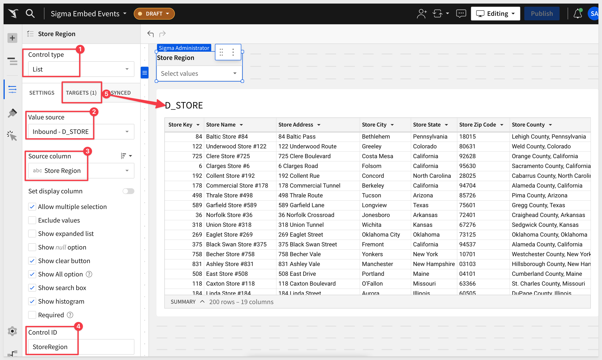
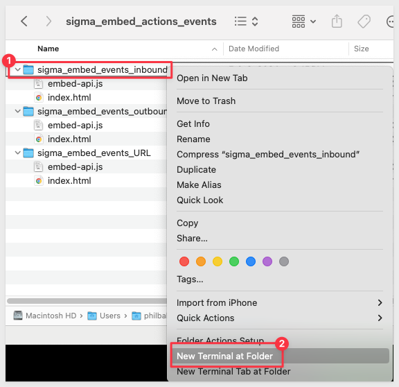
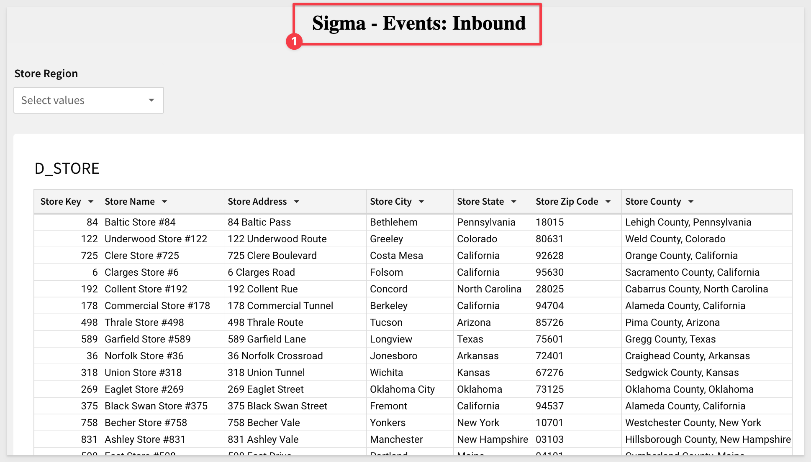
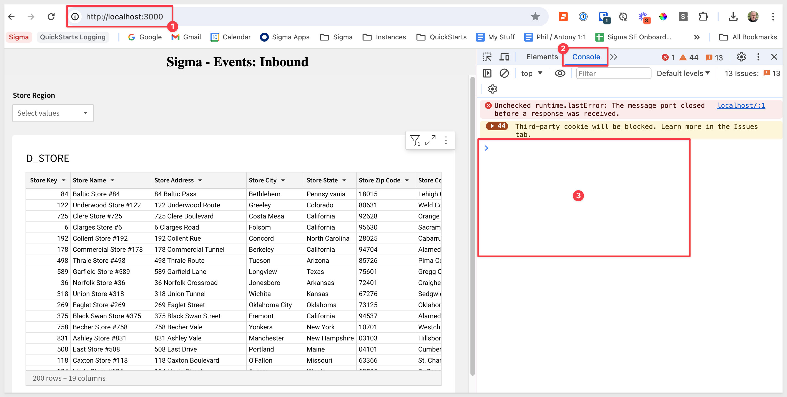
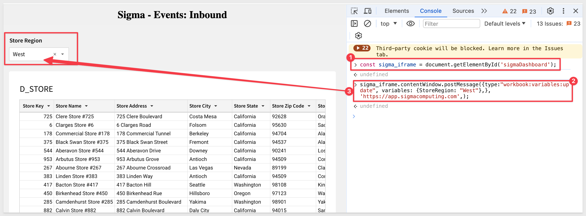
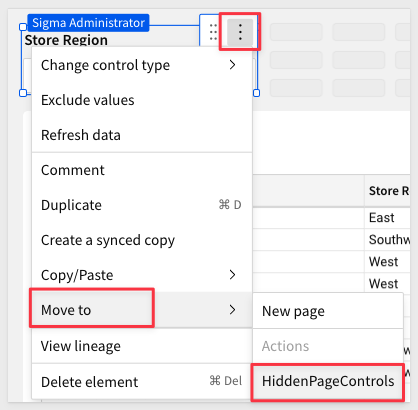
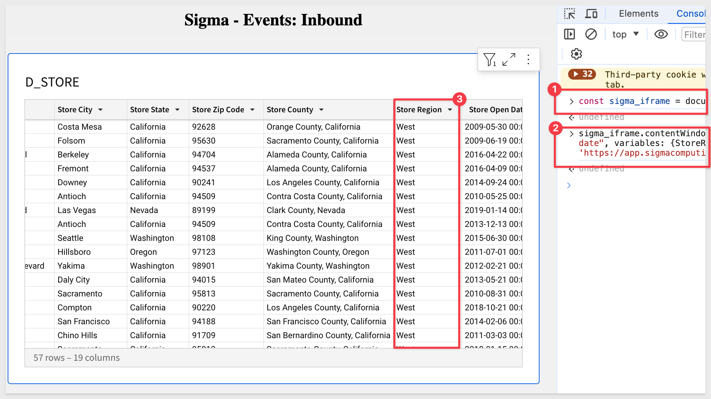
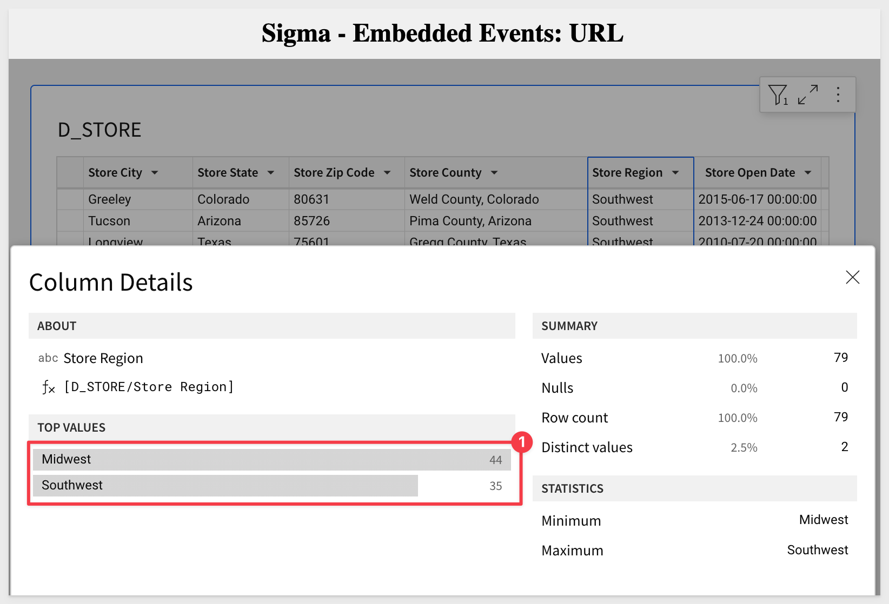
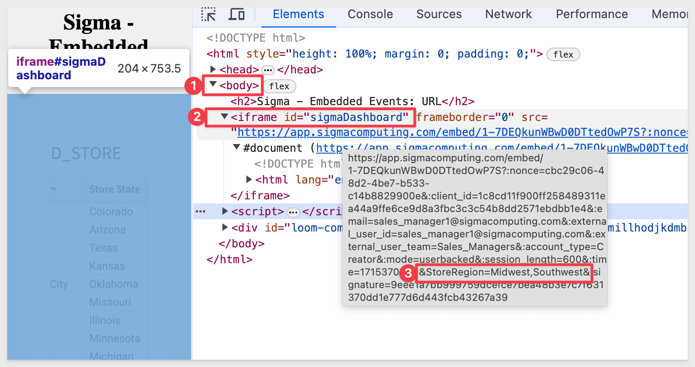

author: pballai
id: embedding_07_actions_events
summary: Sigma Embedding with Actions and Events
categories: Embedding
environments: web
status: Published
feedback link: https://github.com/sigmacomputing/sigmaquickstarts/issues
tags: default
lastUpdated: 2023-03-16

# Embedding 07: Actions and Events

## Overview 
Duration: 5 

This QuickStart assumes you have already taken the QuickStart [Embedding 1: Prerequisites](https://quickstarts.sigmacomputing.com/guide/embedding_1_prerequisites/index.html?index=..%2F..index#0) so that you have a sample environment to complete the tasks in this QuickStart.

We also recommend you table the the QuickStart [Embedding 3: Application Embedding](https://quickstarts.sigmacomputing.com/guide/embedding_3_application_embedding/index.html?index=..%2F..index#0) as we will build on that content

**Some steps may not be shown in detail as we assume you have taken these other two QuickStarts or are familiar with Sigma workflows.**

### Target Audience
Semi-technical users who will be aiding in the planning or implementation of Sigma. Limited SQL and technical data skills are needed to do this QuickStart. It does assume some common computer skills like installing software, using Terminal, navigating folders and edit/copy/paste operations.

### Prerequisites
<ul>
  <li>A computer with a current browser. It does not matter which browser you want to use.</li>
  <li>Access to your Sigma environment. A Sigma trial environment is acceptable and preferred.</li>
  <li>A working web server based on Node.js as demonstrated in the QuickStart: Embedding 01: Prerequisites.</li>
  <li>Some content to embed. You can embed a Workbook, Table or Visualization.</li>
</ul>

<button>[Required QuickStart download](https://sigma-quickstarts-main.s3.us-west-1.amazonaws.com/embedding_2/sigma_embed_actions_events.zip)</button> 

The downloaded zip file is the embedding code and simple webpage we will use during this QuickStart. 

**There are three folders; two for Actions and one for Events.** 

his will minimize the effort as you go through the QuickStart adjusting the files for the different exercises. They are named to be clear which section they are to be used. 

<button>[Free Trial](https://www.sigmacomputing.com/free-trial/)</button>

<ul>
  <li></li>
    <li>Node.js and required Packages (all free):
        <ul>
        <li>Express</li>
        <li>Node-supervisor</li>
        <li>crypto (is now included with Node.js installation)</li>
        </ul>
    </li>
</ul>
  
### What You’ll Learn
The exercises in this QuickStart will discuss and walk you through the steps to send messages from a Parent application to Sigma (Actions) and also receive messages from Sigma in a Parent application (Events) using HTML and JavaScript.

### What You’ll Build
Functioning examples of Sigma Actions and Events, embedded inside a Parent application. 


<!-- END -->

## JavaScript Actions vs. Events
Duration: 5

In this QuickStart we will be demonstrating passing variables between the Parent application and Sigma. Sigma is embedded in the Parent application using HTML iframe(s). 

**Actions:**<br>
Are variables sent from the Parent application to Sigma. **There is no “listener” to code into the iframe; Sigma handles that out-of-the-box**. Sigma can use these messages to update control values. For example, passing a new value to a Sigma control that is used to filter table data.

Actions can be passed using either JavaScript or URL. 

***In general:***
<ul>
      <li>JavaScript is used when you want to pass values from the Parent to the embed without causing the embed to refresh.</li>
      <li>The URL method is used at runtime and the variable values are appended to the embed url. </li>
</ul>

**Events:**<br>
Are variables sent from Sigma to the Parent application which must have a “listener” coded into the Parent application to receive and react to the message as desired.


<!-- END -->

## Parent Application Setup
Duration: 15

Let’s first make sure that you have an embed that we can work with. We will be using Node.js and the setup, configuration and use of this was covered in the [QuickStart: Embedding 01: Prerequisites.](https://quickstarts.sigmacomputing.com/guide/embedding_01_prerequisites/index.html?index=..%2F..index#0) and the [QuickStart: Embedding 03: Secure Access.](https://quickstarts.sigmacomputing.com/guide/embedding_03_secure_access/index.html?index=..%2F..index#0). Go back and review those QuickStarts if you need a refresher. 

**Create Sigma content to embed:**<br>
We will use the Sigma sample database to create a Workbook Page that has one control and one table as shown below. 

Create a new `Workbook`, add the `D_STORE` table from the Sigma Sample Database / Retail / Plugs Electronics schema.

Set the filter control to target the table:



<aside class="negative">
<strong>NOTE:</strong><br> The filter control has its Control ID set to “StoreRegion”. This text matters as our code will refer to it by name later.
</aside>

Using Sigma. `create the Embed URL` for this Workbook page and `save it off to a text file` for now. This is your `Embed Path`.


<aside class="positive">
<strong>IMPORTANT:</strong><br> We will have to also share this Workbook with the Team we are passing in the Embed API for the embed to work.
</aside>

Open the embed-api.js file subfolder called `sigma_embed_actions` in a text editor and change the values for:

<ul>
      <li>Embed Path</li>
      <li>Embed Secret</li>
      <li>ClientID</li>
      <li>External_user_team (this is the Team that you shared this embed with)</li>
      <li>Account_type (this type must exist in your Sigma environment)</li>
</ul>

`Use Terminal` to launch the Node web server by right-clicking on the unzipped subfolder called `sigma_embed_actions` and selecting the option for `New Terminal at folder`.



Start the webserver:
```code
supervisor embed-api.js
```

Use Chrome to browse to:
```code
http://localhost:3000
```

Assuming you got something like the screenshot below, we are ready to send some Actions:




<!-- END -->

## Actions
Duration: 15

In our configuration, the file Index.html is analogous to the Parent application Sigma is embedded into. 

We will first send a message to the embedded iframe and see the table data change.

For this demonstration, we will use Chrome Inspector (Inspector) to execute JavaScript commands and see the results. This is the easiest way to see Actions working without even changing the Index.html code.

Back in Chrome and on the embed page (localhost:3000), `press your F12 key to open Inspector`. Click the `Console tab` in Inspector. Your browser should look like this:



We will use the Inspector Console to send two JavaScript commands to the application. 

This simulates Parent application controls (drop list selection, buttons, etc.) sending commands to the Sigma embed. 

The first command give the Parent access to the iframe document window:
```code
const sigma_iframe = document.getElementById('sigmaDashboard');
```

Chrome may through an error (for security reasons). You may need to `allow pasting` of code into Inspector:


Here is an explanation of the first command:<br>


The second command sends a new value for the variable called “StoreRegion” to the Sigma iframe using the JavaScript postmessage method. PostMessage() is a global method that safely enables cross-origin communication. It’s a lot like Ajax, but with cross-domain capability (ie: communication between two websites with different domains).

Here is an explanation of the second command:<br>


```plaintext
sigma_iframe.contentWindow.postMessage({type:"workbook:variables:update", variables: {StoreRegion: "West"},}, 'https://app.sigmacomputing.com',);
```

Run each command one at a time. Inspector’s Console should return “undefined” after each command is executed. 

<aside class="negative">
<strong>NOTE:</strong><br> You may need to use CTRL+V to paste into the Inspector window.
</aside>

Your results should look like this after running each command:



It is probably undesirable to have the `Store Region` control filter show in the embedded since you are driving the filtering from the Parent application. In this case, simply create a new Page in Sigma and move the Control to that page. Since we are only embedding the Workbook Page, the user can’t see the new Page. You can also hide the Workbook Page if you prefer.

<aside class="negative">
<strong>NOTE:</strong><br> It does not matter what you name your Page, we called ours “HiddenPageControls” to make it obvious to the Sigma user.
</aside>

`Move` the Filter Control to the new Page:



`Publish` your Sigma changes and then `refresh the browser` with the embed. 

Execute both of the JavaScript commands in Inspector again.

Now the embed works as expected (filtering for `West`) but the page control is not displayed to the user:




<!-- END -->

## Actions using URL
Duration: 15

For this example, we will reuse the same embed, but this time we will modify the embed-api.js script in the Actions download zip file. 

We want to append the variable “StoreRegion” to be “West” regions, instead of the Page default of “All”.

`Close the terminal` window (and end session) from the previous exercise. 

Locate the `sigma_embed_actions_url folder`.

Open the embed-api.js file in this folder in a text editor and change the values for:

<ul>
      <li>Embed Path</li>
      <li>Embed Secret</li>
      <li>ClientID</li>
      <li>External_user_team (this is the Team that you shared this embed with)</li>
      <li>Account_type (this type must exist in your Sigma environment)</li>
</ul>

Scroll down to `section 3D`.` You will see these lines:


To make this method work we merely use the existing “searchParams” variable and append the required values to it using the encodeURIComponent() method.

To pass multiple values, comment line 39 and uncomment line 41 as shown below:


In line 41, we are appending “StoreRegion” and two values, `Midwest` and `Southwest`. 

Notice line 39, which is an example of passing a single value. You can pass as many values as you like now that you have the syntax.

The JavaScript encodeURIComponent() method encodes certain chars that would normally be recognized as special chars for URIs so that many components may be included. Note that this method does not encode the ‘ character, as it is a valid character within URIs. Most commonly used to handle spaces and also handles special characters.

From the `sigma_embed_actions_url folder`launch a terminal window:

Execute the terminal command:
```code 
supervisor embed-api.js
```

In Chrome, refresh the page 
```code
http://localhost:3000
``` 
We should see the results as below (looking at `Column Details` for the `Store Region` column):



In `Inspector`, open the `Elements tab` and hover over the `src=url` that is listed. You can see the full URL and see where the variable values were assigned as below:




<!-- END -->

## Events
Duration: 5

Events are communications in the opposite direction of Actions; from Sigma’s iframe to the Parent. 

The main difference is that the Parent application will need to be “listening” for Events via code that needs to be added. 

We will demonstrate using JavaScript in our HTML page. Once the Parent receives the message, it can decide how it is used.

In this example we will add a listener to the Parent and reuse the same embed from Actions to generate an Event, by changing the `StoreRegion` drop filter settings.

`Close the terminal window` (ending the session) from the previous exercise. 

Locate the `sigma_embed_actions_events folder`.

Open the embed-api.js file in this folder in a text editor and change the values for:

<ul>
      <li>Embed Path</li>
      <li>Embed Secret</li>
      <li>ClientID</li>
      <li>External_user_team (this is the Team that you shared this embed with)</li>
      <li>Account_type (this type must exist in your Sigma environment)</li>
</ul>

Save the file.

`Open the index.html` file for this project. 

Recall that this is the Parent application. This is the same code that we have been using in the last two exercises but we now have added a “listener”, a textbox to display the values received from Sigma and error handling code:

**Listener:**


**Text Box:**


**Error Handling (see commented description):**


Launch a `new terminal` window.

Execute the terminal command:
```plaintext
supervisor embed-api.js
```

In Chrome, refresh the page 
```plaintext
http://localhost:3000
```

In Chrome, press your `F12 key` to open Inspector again and select the `Console tab`. 

You should see Sigma Events now in the Inspector Console. 

The `workbook:loaded` informs the Parent that the Sigma workbook embed has finished loading the metadata but has not started evaluating the workbook elements.

This is coming from the HTML.index logic that checks if the workbook has fully loaded yet:


Notice that two new Events appear in Inspector. The first is the console.log message we set to display when the user changed a filter (onchange) and second is the addition of `Southwest,Midwest` to the StoreRegion list:


<!-- END -->

## What we've covered
Duration: 5

In this QuickStart will built functioning examples of Sigma embeds that use Actions and Events to exchange messages using HTML and JavaScript.

<!-- THE FOLLOWING ADDITIONAL RESOURCES IS REQUIRED AS IS FOR ALL QUICKSTARTS -->
**Additional Resource Links**

Be sure to check out all the latest developments at [Sigma's First Friday Feature page!](https://quickstarts.sigmacomputing.com/firstfridayfeatures/)

[Help Center Home](https://help.sigmacomputing.com)<br>
[Sigma Community](https://community.sigmacomputing.com/)<br>
[Sigma Blog](https://www.sigmacomputing.com/blog/)<br>
<br>

[](https://twitter.com/sigmacomputing)&emsp;
[](https://www.linkedin.com/company/sigmacomputing)&emsp;
[](https://www.facebook.com/sigmacomputing)


<!-- END OF WHAT WE COVERED -->
<!-- END OF QUICKSTART -->

