author: pballai
id: embedding_07_dynamic_role_switching_v3
summary: embedding_07_dynamic_role_switching_v3
categories: Embedding
environments: web
status: published
feedback link: https://github.com/sigmacomputing/sigmaquickstarts/issues
tags: default
lastUpdated: 2024-10-24

# Embedding 07: Dynamic Role Switching with Snowflake

## Overview 
Duration: 5 

This QuickStart introduces you to Sigma embedding using dynamic connection & role switching with Snowflake **(DRS)** to limit the data exposed to a user based on values passed to Sigma at runtime. 

DRS allows runtime swapping of the Snowflake warehouse and role for a Sigma connection. There are ways to leverage this using one or both warehouse and/or role along with different methods to restrict data access in Snowflake itself.

This QuickStart will cover how to implement DRS using user attributes defined in Sigma, with a JWT embed.

Many customers will use Snowflake's column masking functionality and also manage their Snowflake row access policy in a table. Sigma fully supports these methods though we’ll keep this simple and focused on the main task: DRS.
 
To simplify setup, we’ll use trial accounts and the provided Snowflake `ACCOUNTADMIN` role for the scripts we will run in Snowflake.

In this QuickStart, we will use the local native application we created in [Embedding 01: Getting Started](https://quickstarts.sigmacomputing.com/guide/embedding_01_getting_started_v3/index.html?index=..%2F..embedding#0)

<aside class="positive">
<strong>IMPORTANT:</strong><br> Some screens in Sigma may appear slightly different from those shown in QuickStarts. This is because Sigma continuously adds and enhances functionality. Rest assured, Sigma’s intuitive interface ensures that any differences will not prevent you from successfully completing any QuickStart.
</aside>

For more information on Sigma's product release strategy, see [Sigma product releases](https://help.sigmacomputing.com/docs/sigma-product-releases)

If something is not working as you expect, here's how to [contact Sigma support](https://help.sigmacomputing.com/docs/sigma-support)

### Target Audience
Semi-technical users who will be aiding in the planning or implementation of Sigma with embedding. No SQL or technical data skills are needed to complete this QuickStart. It does assume some common computer skills like installing software, using Terminal, navigating folders and copy/paste operations.

### Prerequisites

<ul>
  <li>A computer with a current browser. It does not matter which browser you want to use.</li>
  <li>Access to your Sigma environment.</li>
  <li>Embedding 01: Getting Started is required to complete this QuickStart.</li>
</ul>

<aside class="positive">
<strong>IMPORTANT:</strong><br> Sigma recommends using non-production resources when completing QuickStarts.
</aside>

<button>[Sigma Free Trial](https://www.sigmacomputing.com/free-trial/)</button>

<aside class="negative">
<strong>IMPORTANT:</strong><br> Some features may carry a "Beta" tag. Beta features are subject to quick, iterative changes. As a result, the latest product version may differ from the contents of this document.
</aside>
 


## Snowflake Data Configuration
Duration: 10

Let's start by logging into our Snowflake trial account, verify that you are using the `ACCOUNTADMIN` role and that a warehouse (e.g., COMPUTE_WH) is available:

Navigate to the `Projects` tab, click the `+ Worksheet` button, and select` SQL Worksheet`:

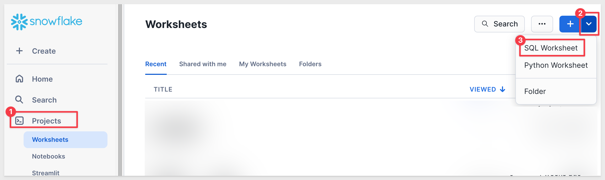

Click the three vertical dots (shown below) and rename the worksheet to `Sigma_DRS_Configuration_Scripts:

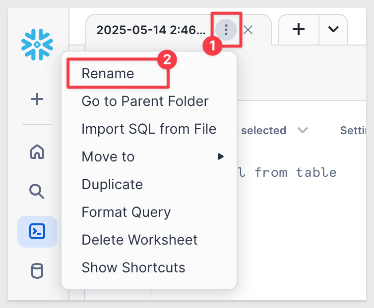

Run the following commands to confirm or switch your active role and warehouse to `ACCOUNTADMIN` and `COMPUTE_WH`:
```code
USE ROLE ACCOUNTADMIN;
USE WAREHOUSE COMPUTE_WH;
```

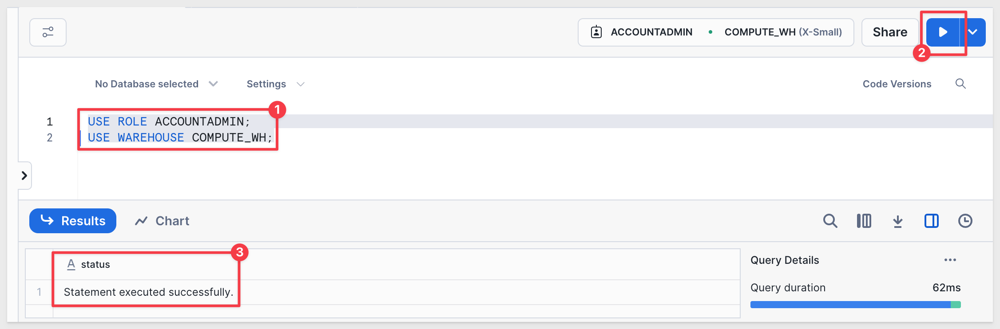

The following commands will create a database, schema and table we will use. Copy, paste, and run the following group of commands by highlighting them and clicking the run button:

```code
// 1: CREATE QUICKSTARTS DATABASE
CREATE DATABASE IF NOT EXISTS QUICKSTARTS;
USE DATABASE QUICKSTARTS;

// 2: CREATE A NEW SCHEMA TO HOLD OUR SAMPLE DATA TABLE:
CREATE SCHEMA IF NOT EXISTS DRS;
USE SCHEMA DRS;

// 3: CREATE THE SAMPLE DATA TABLE SCHEMA
CREATE OR REPLACE TABLE DRS.SAMPLE_DATA (
store_region varchar,
cust_key varchar,
order_number varchar,
date varchar,
quantity varchar,
cost varchar,
price varchar,
product_type varchar,
product_family varchar,
product_name varchar,
store_name varchar,
store_state varchar,
store_city varchar
);
```

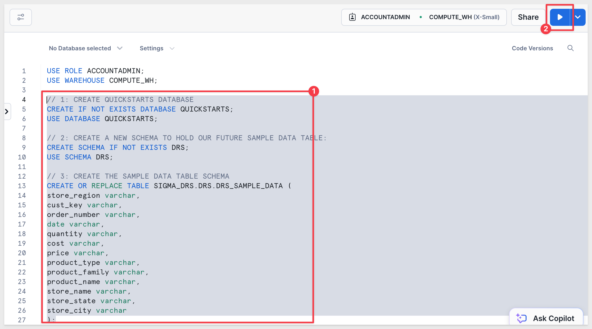

You should see a confirmation message that the table `SAMPLE_DATA` was successfully created.

Click the `Databases` tab and refresh the list. 

You should now see a new schema named `DRS` in the `QUICKSTARTS` database, containing a table called `SAMPLE_DATA`:

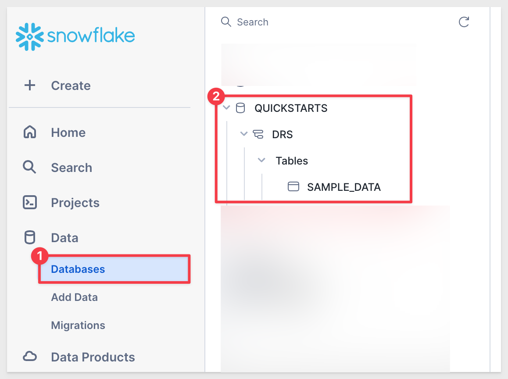

<aside class="negative">
<strong>NOTE:</strong><br> You may have to refresh the database list if the new database / schema is not present after running the command.
</aside>

Now that we have an empty table, we can load data from a public S3 bucket. 

We’ll copy the data into a Snowflake stage and then load it into our table.

Copy / paste and run the following commands:

```code
// 4: CREATE OR REPLACE SCHEMA FOR EXTERNAL STORAGE OF CSV FILE
CREATE STAGE IF NOT EXISTS S3_DATA URL='s3://sigma-quickstarts-main/embedding/DRS_Sample_Data.csv';

// 5: COPY INTO SE_INTERNAL_DB.SCHEMA_PHIL_BALLAI.DRS_Sample_Data  FROM  's3://sigma-quickstarts-main/embedding/DRS_Sample_Data.csv';
COPY INTO SIGMA_DRS.DRS_DATA.DRS_SAMPLE_DATA FROM @S3_DATA;

// 6: CONFIRM DATA IS LANDED IN SNOWFLAKE TABLE:
SELECT * FROM DRS_SAMPLE_DATA;
```

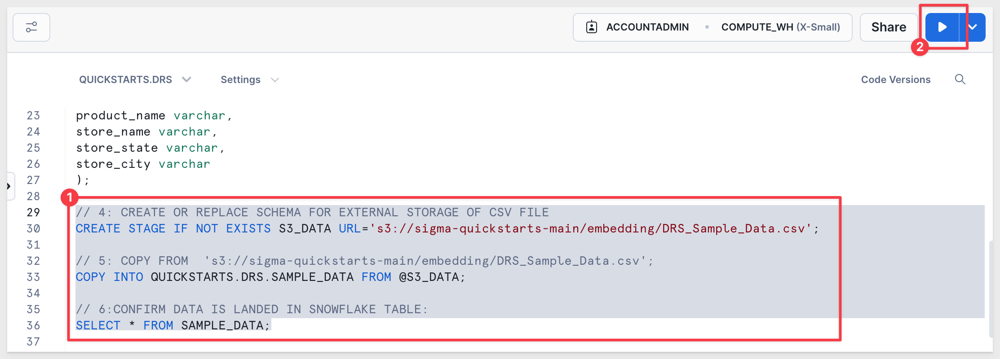

The final command should return 35 rows. You’ll notice that the `STORE_REGION` column includes 20 rows for East, 10 for West, and 5 for South:

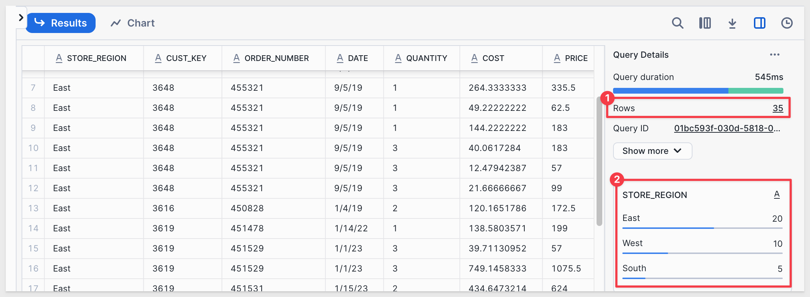


<!-- END -->

## Snowflake Role Configuration
Duration: 10

We need to create a few roles in Snowflake so that Sigma can reference them for dynamic role switching.

<aside class="positive">
<strong>IMPORTANT:</strong><br> It is best practice to create a role that returns no data for embedded use cases. By doing this we:

**Explicit Deny:** If no role is assigned during embed, the default role ensures no rows are returned—preventing accidental data exposure.

**Safe Default:** Prevents accidental exposure if a required user attribute is omitted during embed.
2
**Warehouse-Level Enforcement:** Ensures security policies are enforced directly by Snowflake, beyond Sigma filters or user attributes.
</aside>

Copy, paste, and run the following commands together. Ensure you see a success message:

```code
// ----------------------------------------------------------------------------------------------------------
// SECTION 2: ROLE CONFIGURATION
// ----------------------------------------------------------------------------------------------------------

// 1: CREATE ROLES FOR OUR USE CASES:
CREATE OR REPLACE ROLE DRS_Executive;
CREATE OR REPLACE ROLE DRS_West;
CREATE OR REPLACE ROLE DRS_East;
CREATE OR REPLACE ROLE DRS_Default;

// 2: GRANT USAGE ON WAREHOUSE COMPUTE_WH TO ROLES
GRANT USAGE ON WAREHOUSE COMPUTE_WH TO ROLE DRS_Executive;
GRANT USAGE ON WAREHOUSE COMPUTE_WH TO ROLE DRS_West;
GRANT USAGE ON WAREHOUSE COMPUTE_WH TO ROLE DRS_East;
GRANT USAGE ON WAREHOUSE COMPUTE_WH TO ROLE DRS_Default;

// 3: GRANT USAGE PERMISSION ON THE DATABASE TO NEW ROLES:
GRANT USAGE ON DATABASE QUICKSTARTS TO DRS_Executive;
GRANT USAGE ON DATABASE QUICKSTARTS TO DRS_West;
GRANT USAGE ON DATABASE QUICKSTARTS TO DRS_East;
GRANT USAGE ON DATABASE QUICKSTARTS TO DRS_Default;

// 4: GRANT SELECT ON SCHEMA TO NEW ROLES:
GRANT USAGE ON SCHEMA QUICKSTARTS.DRS TO DRS_Executive;
GRANT USAGE ON SCHEMA QUICKSTARTS.DRS TO DRS_West;
GRANT USAGE ON SCHEMA QUICKSTARTS.DRS TO DRS_East;
GRANT USAGE ON SCHEMA QUICKSTARTS.DRS TO DRS_Default;

// 5: ALLOW NEW ROLES TO QUERY TABLE WE CREATED:
GRANT SELECT ON ALL TABLES IN SCHEMA QUICKSTARTS.DRS TO ROLE DRS_Executive;
GRANT SELECT ON ALL TABLES IN SCHEMA QUICKSTARTS.DRS TO ROLE DRS_West;
GRANT SELECT ON ALL TABLES IN SCHEMA QUICKSTARTS.DRS TO ROLE DRS_East;
GRANT SELECT ON ALL TABLES IN SCHEMA QUICKSTARTS.DRS TO ROLE DRS_Default;
```

You should receive the message: `Statement executed successfully. 1 objects affected.`


<!-- END -->

## Snowflake RLS Policy Configuration
Duration: 10

We are now ready to define our Snowflake Row Access Policy. Follow the same process as before using these new commands:

```code
GRANT SELECT ON ALL TABLES IN SCHEMA QUICKSTARTS.DRS TO ROLE DRS_East;

// ----------------------------------------------------------------------------------------------------------
// SECTION 3: CREATE ROW ACCESS POLICY BASED ON REGION COLUMN
// ----------------------------------------------------------------------------------------------------------

// 1: Create the Row Access Policy
USE ROLE ACCOUNTADMIN;
USE QUICKSTARTS.DRS;
CREATE OR REPLACE ROW ACCESS POLICY DRS_REGION AS (STORE_REGION STRING) RETURNS BOOLEAN -> CASE
    WHEN 'DRS_EXECUTIVE' = CURRENT_ROLE() THEN TRUE
    WHEN 'DRS_WEST' = CURRENT_ROLE()
        AND STORE_REGION = 'West' THEN TRUE
    WHEN 'DRS_EAST' = CURRENT_ROLE()
        AND STORE_REGION = 'East' THEN TRUE
    WHEN 'DRS_Default' = CURRENT_ROLE()
        AND STORE_REGION = '' THEN TRUE
    WHEN 'ACCOUNTADMIN' = CURRENT_ROLE() THEN TRUE
        ELSE FALSE
    END;
SHOW ROW ACCESS POLICIES;

// 2: APPLY THE ROW ACCESS POLICY TO THE TABLE
ALTER TABLE QUICKSTARTS.DRS.SAMPLE_DATA
ADD ROW ACCESS POLICY DRS_REGION
    ON (STORE_REGION);
```    

You should receive a message in Snowflake `Statement executed successfully.`

### Roles and quick test in Snowflake
In the next section, we will test each role individually to observe how many rows are returned.

<aside class="positive">
<strong>IMPORTANT:</strong><br> Replace the YOUR_SNOWFLAKE_USERNAME_HERE (remove the brackets too) with your Snowflake username.
</aside>

```code
// ----------------------------------------------------------------------------------------------------------
// SECTION 4:  TEST OUT ROLES AND SEE DIFFERENT RESULTS. *** RUN ONE ROLE AT A TIME ***
// ----------------------------------------------------------------------------------------------------------

// 1: FOR TESTING IN SNOWFLAKE, GRANT THESE ROLES TO YOUR SNOWFLAKE USERNAME:
GRANT ROLE DRS_Executive TO USER {YOUR_SNOWFLAKE_USERNAME_HERE};
GRANT ROLE DRS_West TO USER {YOUR_SNOWFLAKE_USERNAME_HERE};
GRANT ROLE DRS_East TO USER {YOUR_SNOWFLAKE_USERNAME_HERE};
GRANT ROLE DRS_DEFAULT TO USER {YOUR_SNOWFLAKE_USERNAME_HERE};

// 2: EXECUTIVE = 35 ROWS
USE ROLE DRS_EXECUTIVE;
SELECT * FROM SAMPLE_DATA;
```

As `DRS_EXECUTIVE`, we expect to see all 35 rows:

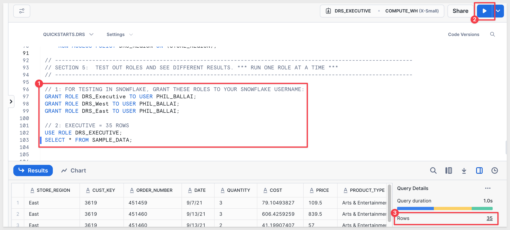

As `DRS_EAST`, we expect to see 20 rows:
```code
// 3: EAST = 20 ROWS
USE ROLE DRS_EAST;
SELECT * FROM SAMPLE_DATA;
```

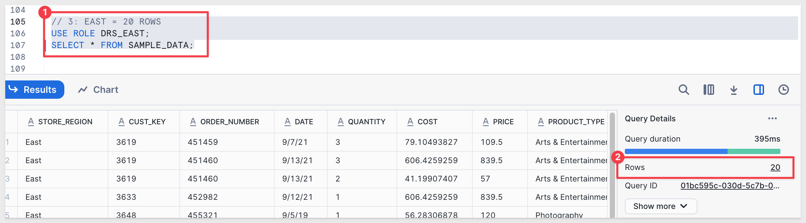

10 rows for `DRS_WEST`:
```code
// 4: WEST = 10 ROWS
USE ROLE DRS_WEST;
SELECT * FROM SAMPLE_DATA;
```

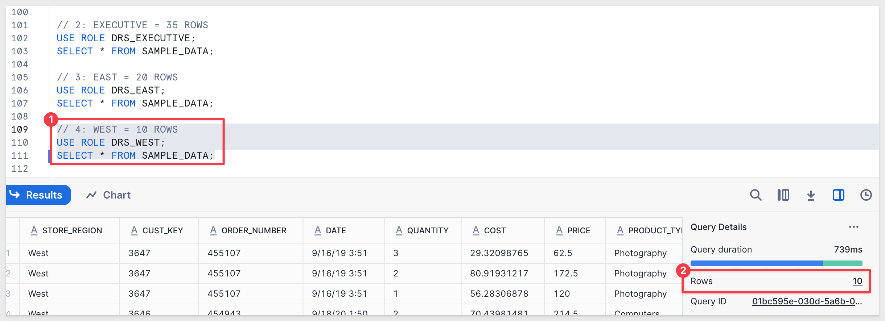

// 5: DEFAULT = 0 ROWS
USE ROLE DRS_DEFAULT;
SELECT * FROM SAMPLE_DATA;

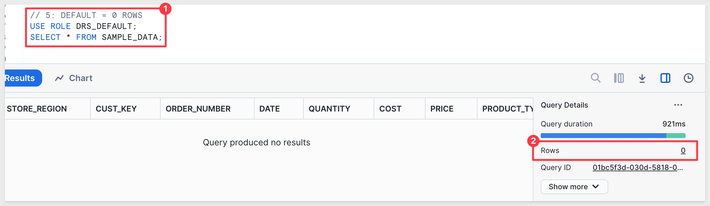


<!-- END -->

## Applying DRS in Sigma
Duration: 10

Sigma supports dynamically assigning the warehouse and role at runtime, using user attributes.

For more information, see [Configure user attributes](https://help.sigmacomputing.com/docs/user-attributes)

Log into Sigma as an `Administrator`.

Navigate to `Administration` > `User Attributes` and click `Create Attribute`.

Configure the new user attribute as shown.

<aside class="negative">
<strong>NOTE:</strong><br> Remember that "DRS_DEFAULT" will return no rows if an invalid user attribute value is passed at runtime.
</aside>

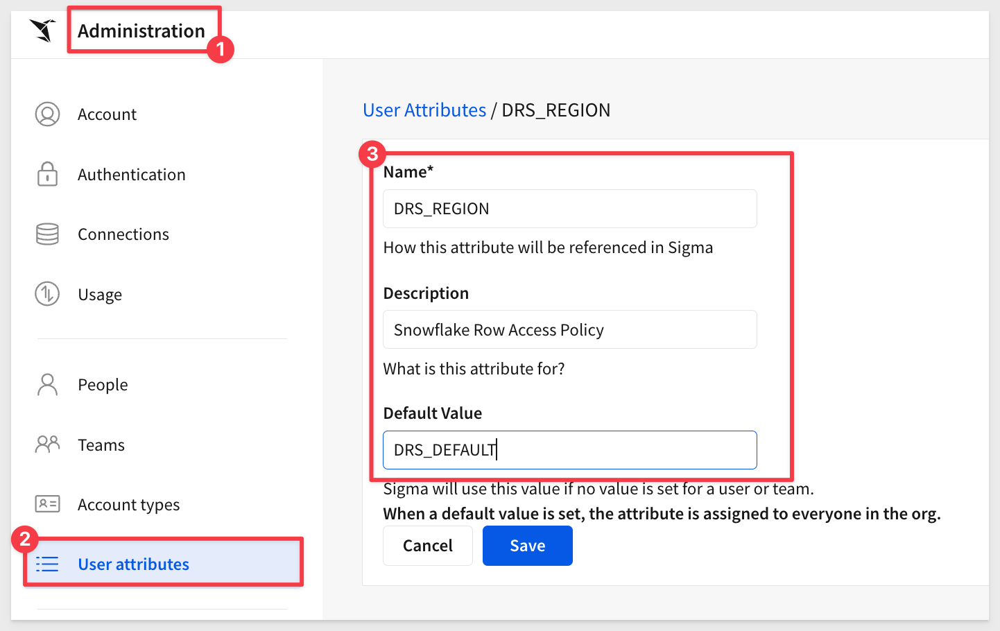

Click `Create`.

Snowflake will evaluate the passed value as a role assignment. We don't need to manually assign the user attribute to any team or member.

Create another `User Attribute` for `warehouse` as shown and click `Create`:

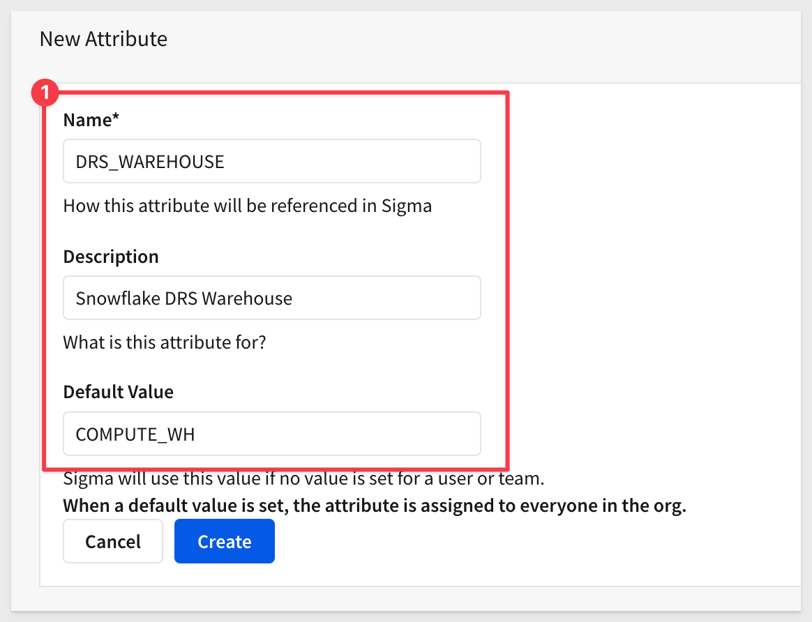

<aside class="negative">
<strong>NOTE:</strong><br> We did not create a warehouse for each role as that is the same process we used for role. We will use COMPUTE_WH to demonstrate how a user attribute with a default value is applied.
</aside>

Navigate to `Administration` / `Connection` and edit the connection called `Snowflake Trial Account`.

Click the  bars in `Role` and select the new user attribute called `DRS_REGION` should be available. 

Repeat the same steps for `Warehouse`.

Save the connection (you will need to supply your Snowflake account password again).

### Create a Connection to Snowflake
Navigate to `Administration` > `Connections` and create a new connection to our Snowflake account.  

For more information, see [Connect to Snowflake](https://help.sigmacomputing.com/docs/connect-to-snowflake)

You will need your Snowflake details to connect. To get the account url from Snowflake, click on `View account details` as shown below:

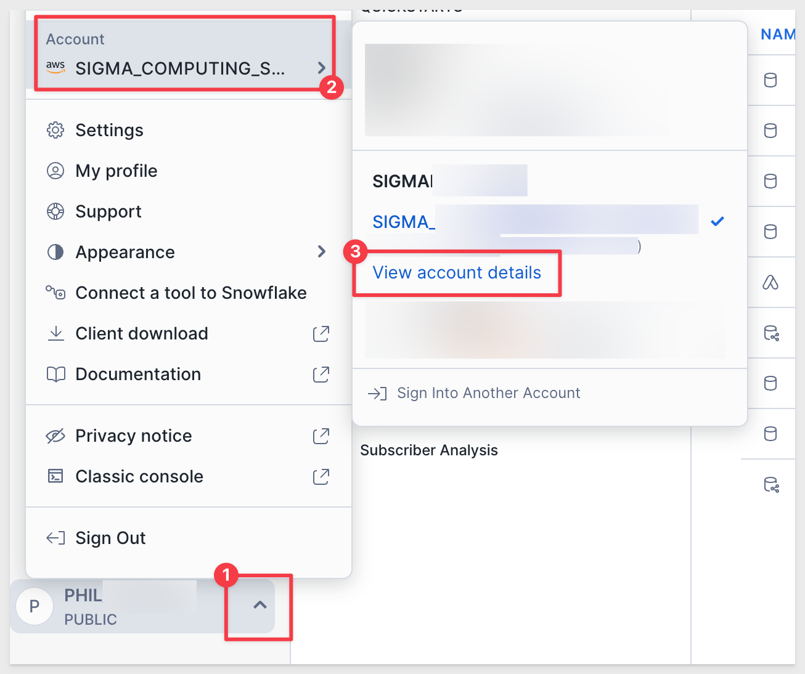

Use the value shown under `Account Identifier`:

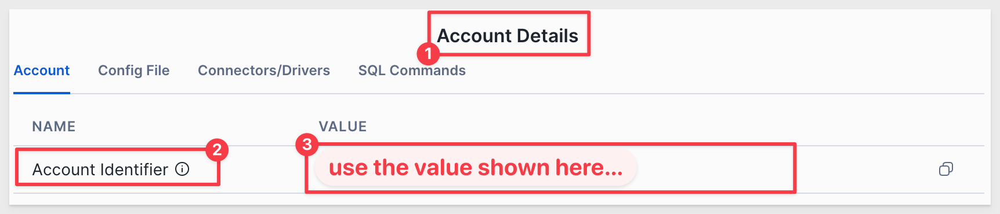

Use this `Account URL` to configure a new connection in Sigma, replacing the information for your Snowflake instance:

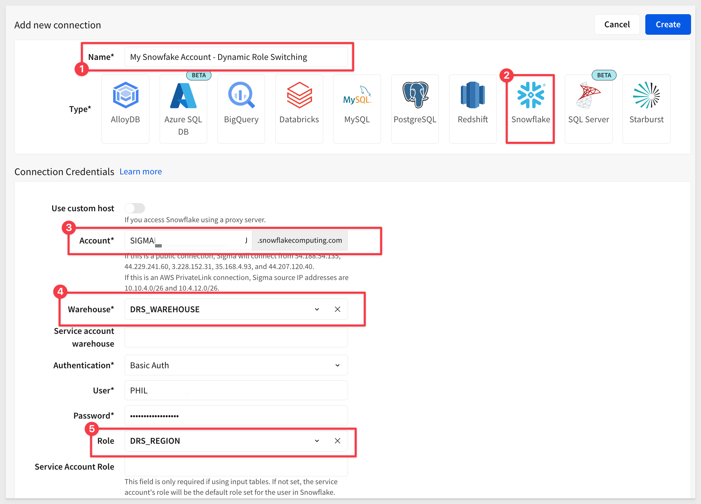

<aside class="positive">
<strong>IMPORTANT:</strong><br> Numbers 4 & 5 in the above screenshot are controls that allow you to change from static values for warehouse and role to dynamic values based on value passed by the native application via user attribute.
</aside>

Click `Create`. Sigma will validate the connection based on your configuration. Once done, the connection information will display with no error messages. 

<aside class="positive">
<strong>IMPORTANT:</strong><br> It is best practice to not use user credentials for Sigma connections. 
</aside>

For more information, see:<br>
[Connect to Snowflake with key pair authentication](https://help.sigmacomputing.com/docs/connect-to-snowflake#connect-to-snowflake-with-key-pair-authentication)<br>
[Connect to Snowflake with OAuth](https://help.sigmacomputing.com/docs/connect-to-snowflake#connect-to-snowflake-with-oauth)

There is a QuickStart, [Snowflake Key-pair Authorization](https://quickstarts.sigmacomputing.com/guide/security_snowflake_keypair_rotation/index.html?index=..%2F..index#0)

### Create New Sigma Team
Navigate to `Administration` > `Teams` and click `Create team`.

Name the team `DRS_Team` and click `Create`:

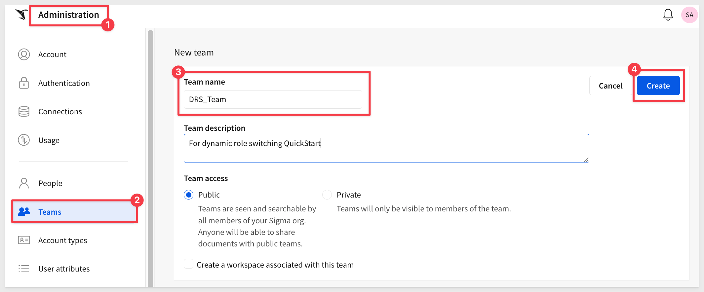

We'll use this team later to control the data shown to embedded users based on their Snowflake role.


<!-- END -->

## Create Sigma Embed Content
Duration: 10

Instead of creating a new workbook in Sigma, we can browse the `Connections` from the homepage:

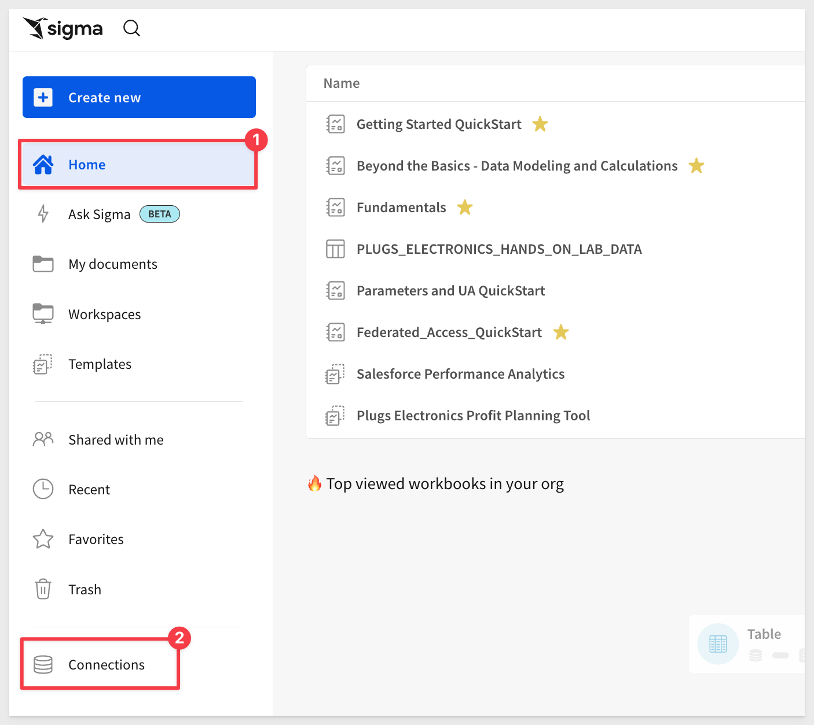

Select the connection you created earlier; ours was named `My Snowflake Account - Dynamic Role Switching`.

Open the `QUICKSTARTS` > `DRS` > `SAMPLE_DATA` table and click `Explore`:

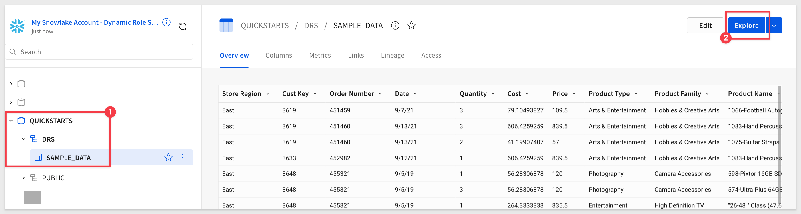

Let's add two `Text boxes` from the element bar to display the current user's warehouse and role:

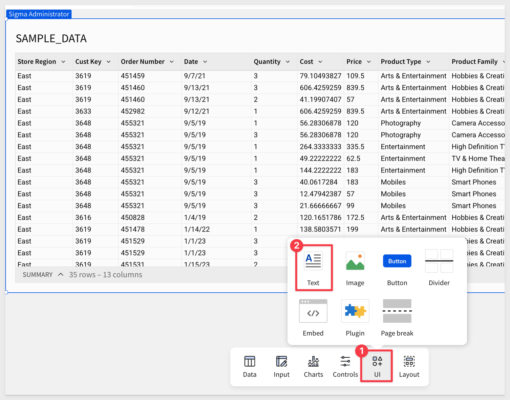

Configure each text box as follows:

<aside class="negative">
<strong>NOTE:</strong><br> Pay attention when defining user attributes and functions; case sensitivity and special characters can cause errors downstream.
</aside>

<aside class="positive">
<strong>IMPORTANT:</strong><br> After adding a text element, hit the "=" key to bring up the function bar and then paste the formula shown below and press Enter to confirm.
</aside>

**ROLE TEXTBOX FUNCTION:**
```plaintext
=CurrentUserAttributeText("DRS_REGION")
```

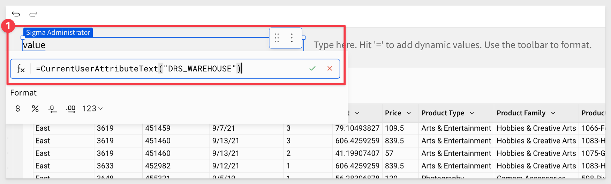

**WAREHOUSE TEXTBOX FUNCTION:**
```plaintext
=CurrentUserAttributeText("DRS_WAREHOUSE")
```

The workbook now looks like this. Some additional text description was added to each text box but that is optional. Add text after the function is set and showing a value. You can then type additional text before or after the formula result:

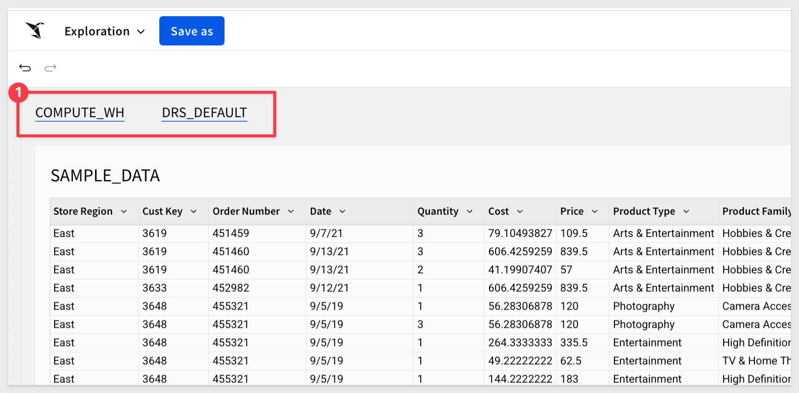

The values initially shown are the `User Attribute` default values we set earlier.

Click `Save as` and name the workbook `Dynamic Role Switching QuickStart`.

Click the  in the upper right corner and share the workbook with the `DRS_Team` with `Can View` access:

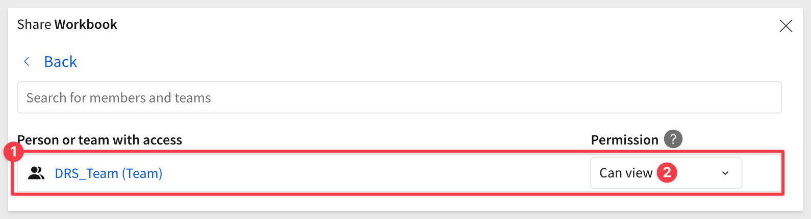

When we saved the workbook, it was also automatically published. The published URL is what we want to copy for this embed.

Copy the published URL to use in the embed.

We are now ready to test the embed in our native application.


<!-- END -->

## Test Different Roles
Duration: 10

We will move through this quickly, as it is assumed you have done similar configurations before in the `Getting Started QuickStart`.

In VSCode, open the `embedding_qs_series_2` project and edit the `.env` file, adding the URL to the `# QS: dynamic_role_switching` section and setting the parameters as shown, using your own base URL:

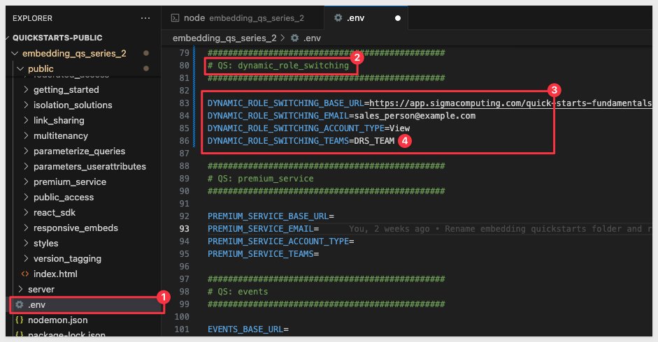

In VSCode > Terminal, start the local web server:
```code
npm start
```

In a browser, open:
```code
http://localhost:3000/dynamic_role_switching/?mode=dynamic_role_switching
```

The embed loads but all `No data` is shown. This is because we have not passed a value for `DRS_REGION`:


Additionally, the `embed-api.js` includes a fallback mechanism to ensure that if no value for `DRS_REGION` is sent or if an invalid one is, data is not displayed. 

This adds a small layer of effort, but it aligns with best practices for data security.

### User Attribute Collection Block
This block extracts user attributes from the .env file that are specific to the current QuickStart mode (e.g., DYNAMIC_ROLE_SWITCHING_ua_DRS_REGION).

It looks for environment variables starting with a prefix like `DYNAMIC_ROLE_SWITCHING_ua_`.

It removes the prefix and adds the attribute to the userAttributes object.

This structure is then injected into the JWT.

This allows each QuickStart to independently declare user attributes (if you decide to do that later) without interfering with others and supports runtime customization for security controls like RLS or Snowflake role switching.

This is the code block in `embed-api.js`:

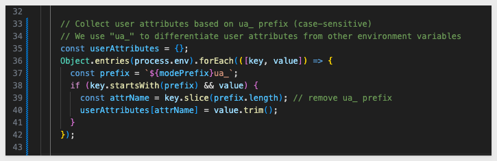

### DRS_REGION Validation Block
This code ensures that the value passed for `DRS_REGION `is valid and safe to use for Snowflake role switching.

If an unrecognized role (like `DRS_SOUTH`) is passed, it replaces it with `DRS_DEFAULT`.

It prevents runtime errors in Snowflake by blocking invalid roles and ensures graceful fallback behavior.

This is the code block in `embed-api.js`:

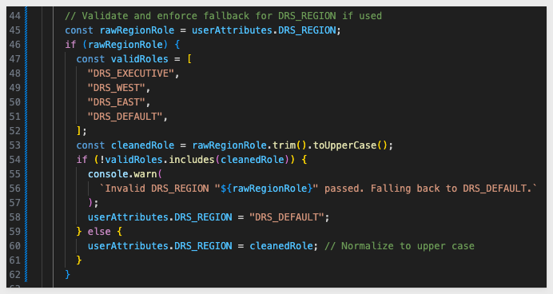

Let's configure the `DRS_REGION` user attribute in the `.env` file.

In the `# QS: dynamic_role_switching` section, set the UA parameter:
```code
# dynamic_role_switching USER ATTRIBUTES
DYNAMIC_ROLE_SWITCHING_ua_DRS_REGION=DRS_EAST
```

Save the file.

Reload the browser to see all 20 rows in the `East` region:

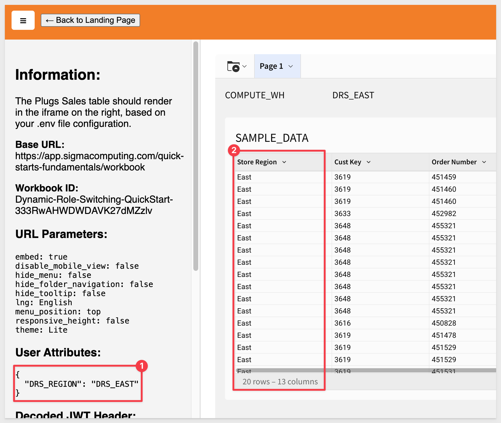

Test changing the UA to `DRS_WEST`. This should return 10 rows for the West region.

Try sending no value. Our fall-back logic will apply the `DRS_DEFAULT` role and show `No data`:

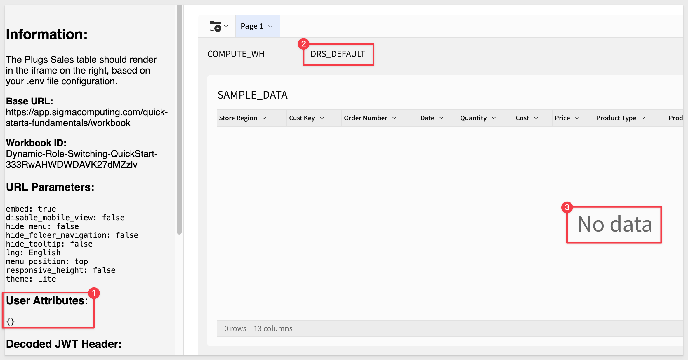

It will also display `No data` if an invalid or misspelled role is passed.


<!-- END -->

## Warehouse Switching
Duration: 5

Since we’ve already walked through the configuration process, we’ll move through this example quickly.

<aside class="positive">
<strong>IMPORTANT:</strong><br> The warehouse user attribute allows dynamic switching of the warehouse based on the user’s role. This is beneficial because it allows you to create separate warehouses for every client and easily monitor the compute costs incurred per client.

You can also monetize this by assigning dedicated warehouses to larger customers instead of grouping all customers into a shared warehouse.
</aside>

We already created a user attribute for warehouse in Sigma. Next, we’ll create a second warehouse in Snowflake.

### Create Warehouse
In Snowflake, run the following script:

```code
// ----------------------------------------------------------------------------------------------------------
// SECTION 4: CREATE A SECOND WAREHOUSE AND GRANT USAGE PERMISSION ON THE WAREHOUSES TO NEW ROLES:
// ----------------------------------------------------------------------------------------------------------

USE ROLE ACCOUNTADMIN;
CREATE WAREHOUSE COMPUTE_WH2 WAREHOUSE_SIZE=SMALL AUTO_SUSPEND = 5;
GRANT USAGE ON WAREHOUSE COMPUTE_WH2 TO DRS_Executive;
GRANT USAGE ON WAREHOUSE COMPUTE_WH2 TO DRS_West;
GRANT USAGE ON WAREHOUSE COMPUTE_WH2 TO DRS_East;
USE WAREHOUSE COMPUTE_WH2;
```
Once the query is completed, Snowflake will return `Statement executed successfully.`

Now, update the `.env` file to add the required user attribute:
```code
DYNAMIC_ROLE_SWITCHING_ua_DRS_WAREHOUSE=COMPUTE_WH2
```

Save the file.

Refresh the browser:

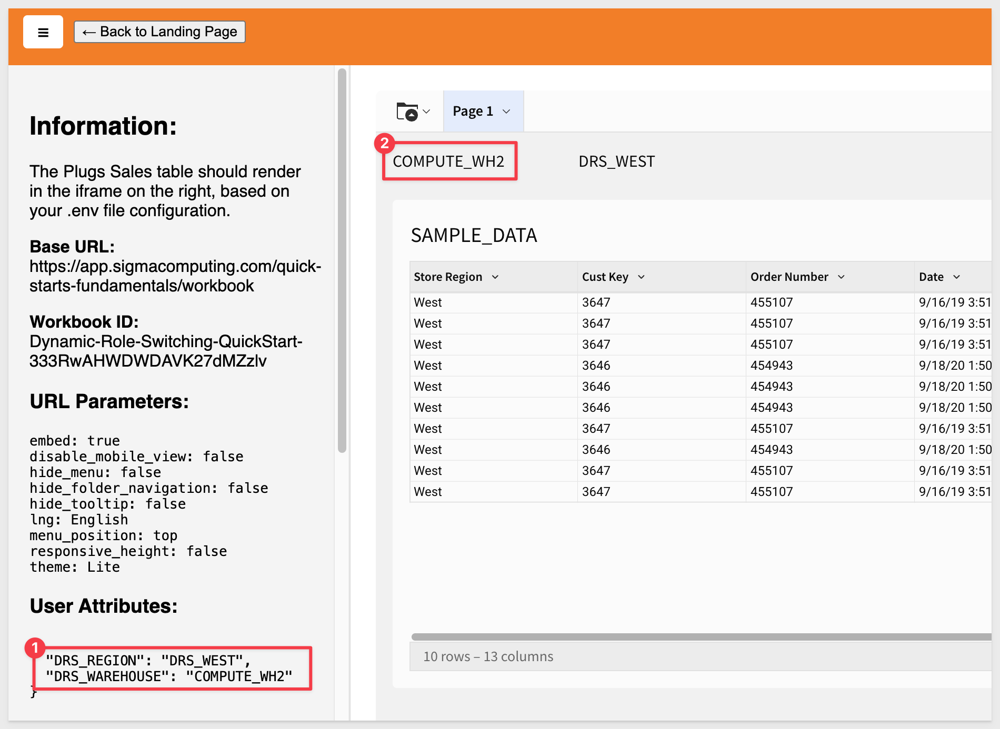

We confirm that `COMPUTE_WH2` is being used in the `Admin` section of Snowflake:

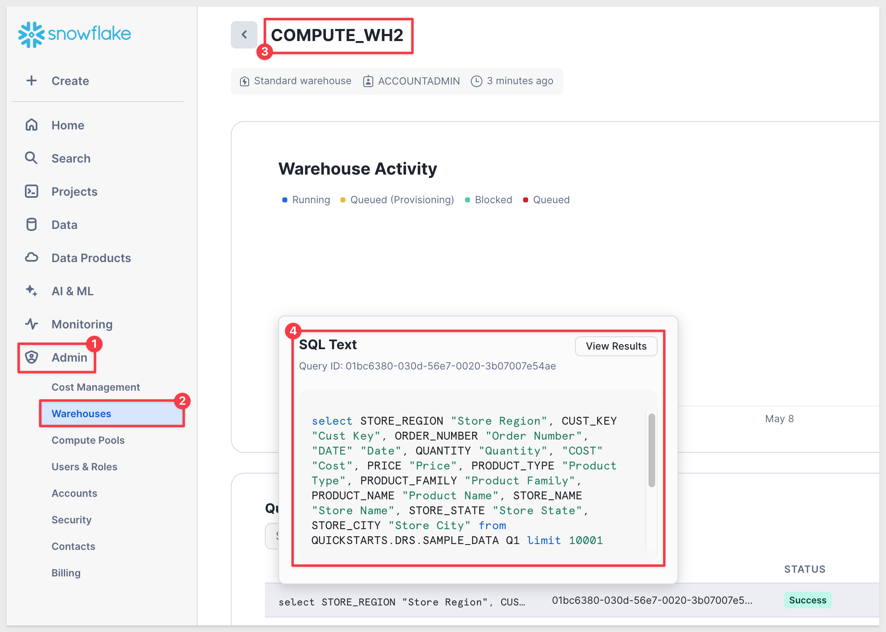


<!-- END -->

## What we've covered
Duration: 5

In this QuickStart, we created Snowflake assets and a row access policy, and demonstrated how to use Sigma’s dynamic connection and role switching (DRS) to control data visibility at runtime. By passing user attributes through a secure embed using JWT, we limited the data exposed to each user based on their assigned Snowflake role—ensuring secure, scalable, and flexible access control.

**Additional Resource Links**

[Blog](https://www.sigmacomputing.com/blog/)<br>
[Community](https://community.sigmacomputing.com/)<br>
[Help Center](https://help.sigmacomputing.com/hc/en-us)<br>
[QuickStarts](https://quickstarts.sigmacomputing.com/)<br>

Be sure to check out all the latest developments at [Sigma's First Friday Feature page!](https://quickstarts.sigmacomputing.com/firstfridayfeatures/)
<br>

[](https://twitter.com/sigmacomputing)&emsp;
[](https://www.linkedin.com/company/sigmacomputing)&emsp;
[](https://www.facebook.com/sigmacomputing)


<!-- END OF WHAT WE COVERED -->
<!-- END OF QUICKSTART -->
