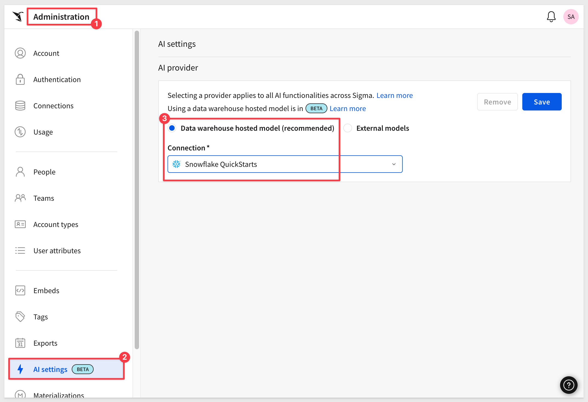
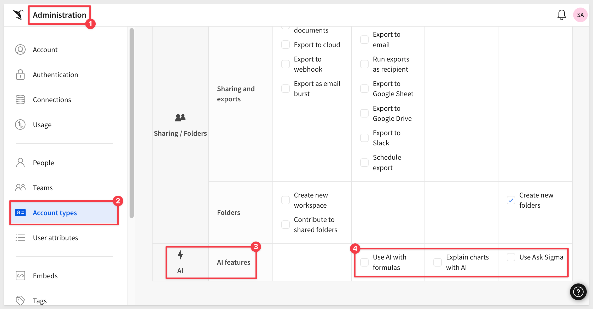
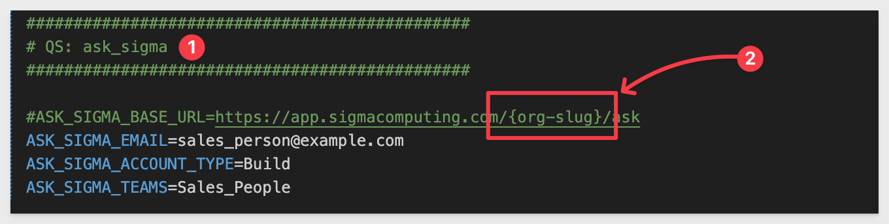
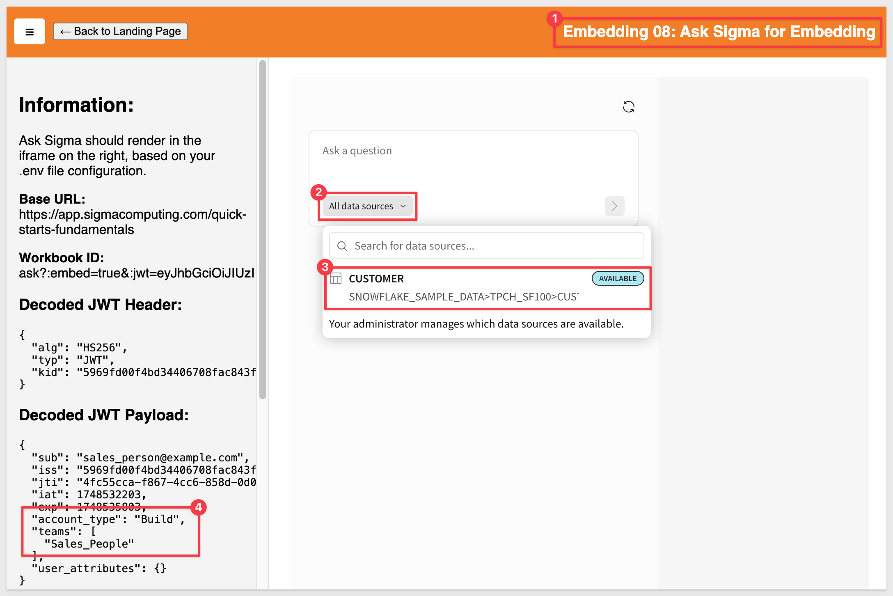
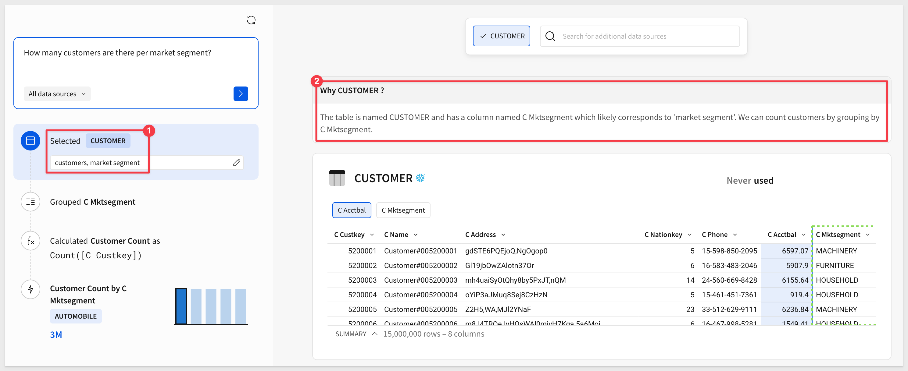

author: pballai
id: embedding_08_ask_sigma_v3
summary: embedding_08_ask_sigma_v3
categories: embedding
environments: web
status: published
feedback link: https://github.com/sigmacomputing/sigmaquickstarts/issues
tags: default
lastUpdated: 2025-05-29

# Embedding 08: Embedding Ask Sigma

## Overview 
Duration: 5 

This QuickStart guides you through the process of embedding Ask Sigma—Sigma's AI analyst—into your application. 

You'll learn how to integrate natural language querying capabilities, enabling users to interact with data seamlessly within your product environment. By the end, you'll have a functional, embedded Ask Sigma instance, ready to enhance user engagement and data accessibility.

Before proceeding, ensure you've completed the [Embedding 01: Getting Started](https://quickstarts.sigmacomputing.com/guide/embedding_01_getting_started_v3/index.html?index=..%2F..embedding#0)

### What is Ask Sigma?
Ask Sigma is Sigma's natural language query interface designed to function like a data analyst. It allows users to pose questions in everyday language and receive guided, transparent analyses. 

Key features include:

**Discovery:**<br> 
Uncover new data sources, related workbooks, and insights beyond the initial query.

**Transparency:**<br>
View each step of the AI's analytical process, including data sources and calculations.

**Control:**<br>
Modify any part of the analysis—change data sources, adjust formulas, or refine prompts.

**A Path Forward:**<br>
Receive suggestions for further exploration, enabling deeper data understanding.

This approach ensures users not only get answers but also comprehend the methodology behind them, fostering trust and enabling informed decision-making.

### Embedding Use Cases
Embedding Ask Sigma into your application can transform user interactions with data. Potential use cases include the following:

**Customer-Facing Dashboards:**<br> 
Allow clients to query data directly, enhancing transparency and engagement.

**Internal Tools:**<br>
Equip teams with intuitive data exploration capabilities without requiring SQL knowledge.

**Premium Offerings:**<br>
Differentiate your product by offering advanced analytics features as part of a premium package.

By integrating Ask Sigma, you provide users with a powerful tool to derive insights, fostering a data-driven culture within your application.

### Benefits
Embedding Ask Sigma offers several advantages:

**Enhanced User Experience:**<br>
Users interact with data conversationally, helping to reduce the learning curve.

**Increased Engagement:**<br>
Interactive analytics encourage deeper data exploration.

**Operational Efficiency:**<br>
Reduces reliance on data teams by empowering users to find answers independently.

**Scalability:**<br>
As your user base grows, embedded analytics will scale without significant additional resources.

These benefits collectively contribute to a more dynamic, user-centric application, positioning your product as a leader in data accessibility and innovation.

<aside class="positive">
<strong>IMPORTANT:</strong><br> Some screens in Sigma may appear slightly different from those shown in QuickStarts. Sigma continuously adds and enhances functionality. Rest assured, Sigma’s intuitive interface ensures that any differences will not prevent you from successfully completing any QuickStart.
</aside>

For more information on Sigma's product release strategy, see [Sigma product releases](https://help.sigmacomputing.com/docs/sigma-product-releases)

If something doesn’t work as expected, here's how to [contact Sigma support](https://help.sigmacomputing.com/docs/sigma-support)

### Target Audience
Semi-technical users who will be aiding in the planning or implementation of Sigma with embedding. No SQL or technical data skills are needed to complete this QuickStart. It assumes some basic computer skills, such as installing software, using Terminal, navigating folders and copy/paste operations

### Prerequisites

<ul>
  <li>Any modern browser is acceptable.</li>
  <li>Access to your Sigma environment.</li>
  <li>Some familiarity with Sigma is assumed. Not all steps will be shown, as the basics are assumed to be understood.</li>
  <li>An AI provider (discussed in a later section)</li>
  <li>Embedding 01: Getting Started is required to complete this QuickStart.</li>
 </ul>

<aside class="positive">
<strong>IMPORTANT:</strong><br> Sigma recommends using non-production resources when completing QuickStarts.
</aside>

<button>[Sigma Free Trial](https://www.sigmacomputing.com/free-trial/)</button>

<aside class="negative">
<strong>IMPORTANT:</strong><br> Some features may carry a “Beta” tag. Beta features are subject to quick, iterative changes. As a result, the latest product version may differ from the contents of this document.
</aside>
 


## Enabling Ask Sigma
Duration: 5

Before anyone can start using Ask Sigma, we need to configure which AI provider will be used to process requests. 

Sigma currently supports warehouse AI models (on Snowflake and Databricks connections) and external models (OpenAI and Azure OpenAI Foundry) as AI providers.

For the most recent provider information, see [Configure an AI provider](https://help.sigmacomputing.com/docs/configure-ai-features-for-your-organization#configure-an-ai-provider)

Log in to Sigma as `Administrator` and navigate to `Administration` > `AI settings`.

Here, we can select the AI provider we want to use as well as the data sources we want to make available to the provider and embed users.

<aside class="negative">
<strong>NOTE:</strong><br> In order to allow embed users to use Ask Sigma, they will need to be granted permission in Sigma to access the allowed sources.

For demonstration, we will use a Snowflake connection that includes the Snowflake sample data. If you don't have this, you may use any supported warehouse connection and data of your choosing. The only difference with different source data will be the questions you ask of it.
</aside>



<aside class="positive">
<strong>IMPORTANT:</strong><br> Customers who have sensitive data may want to use their own warehouse provider in order to prevent exposing data to third party providers.
</aside>

### Grant access to the data
We can grant permission to use the data by opening `Connections`, selecting the desired connection and then selecting the database, schema or table we want to allow.

For example, we will grant `Can use` to the `Sales_People` team on the `SNOWFLAKE_SAMPLE_DATA` / `TPCH_SF1` schema. This is one of the smaller sample datasets:


### Set the data sources
We need to specify which data sources are available for the AI to use.

Return to the `Administration` > `AI settings` page.

Scroll down to the `Ask Sigma data sources` and search for `PLUGS`. Sigma will search all the available connections configured and return the matching tables. 

Let’s select one of the `CUSTOMERS` tables from the `SNOWFLAKE_SAMPLE_DATA`:

Click `Sync`:


When the sync is done, Sigma will let you know:


Ask Sigma now has data to reference.

### Account type
We can use Sigma account types to control access to AI features. For example, if we look at the default permissions for the `View` account type we see that they have no permission to use Ask Sigma:



We will use the `Build` account type during this QuickStart, which has the `Use Ask Sigma` permission enabled by default.


<!-- END OF SECTION-->

## Project Configuration
Duration: 5

We’ll move through this quickly, assuming you’ve done similar configurations before in the `Getting Started QuickStart`.

In VSCode > Terminal, start the local web server in the `embedding_qs_series_2` project folder:
```code
npm start
```

In a browser, open:
```code
http://localhost:3000/ask_sigma/?mode=ask_sigma
```

The page loads, but the message `Failed to load Sigma embed. Check console for details` is shown. This happens because we haven’t passed the required values yet.

### Edit .env file
In VSCode, open the project’s `.env` file and scroll to the `# QS: ask_sigma section`.

We configured a few values for you but you will need to provide your `{org-slug}`, which is the part of the URL directly following `https://app.sigmacomputing.com/` in the browser:



For example, in the URL `https://app.sigmacomputing.com/my_company_name/`, the org-slug is `my_company_name`.

Once .env is updated, save your changes.

Refresh the browser page, and Ask Sigma should appear!

In the `All data sources` dropdown, you’ll see the configured data source. You’ll also see the account type and team parameters in the sidebar:




<!-- END OF SECTION-->

## Our Unique Approach
Duration: 5

AI is a powerful tool, but how it’s implemented makes a huge difference to users. 

Allowing users to ask questions is one thing but how can we tell what the AI is doing? 

- Is it using trusted data sources? 
- What steps, calculations, and workflows did it use to generate results? 
- Once we have the response, what’s next for the user?

We have addressed all these and more with our unique design, summarized below in three sections:

**1: Discovery**<br>
Ensure corporate governance by restricting source data used for analysis and preventing exposing data to third-parties.

**2: Trust**<br>
Ensure that only verified, trusted data sources are used. Decisions made from bad data are time-consuming and potentially costly too.

**3: Exploration**

Allow users to launch selected results into a workbook for further analysis or sharing.


### A quick test
Let's ask a simple question, since we have one table to work with: `CUSTOMERS`:


As the processing starts, we can see the first thing the AI decided was to use the `CUSTOMER` table (obviously!) but Sigma also displays the decision logic in `Why CUSTOMER?`, shedding light on the choices the AI is making:



Further down, we can see that it made a new column with a calculation. While this is a simple example, it is really important to know exactly what the formula is to prevent unexpected results later:


Once done, Sigma allows users to select from the different visualizations the AI created. Users can select one or many and immediately open them in a new workbook:


What is really slick about this for embedding is that when we opened in a workbook, we can see the selected charts in the host application right away!


The functionality available to the user is determined by their `Account type` setting. This enables different user experiences and allows embedded customers to offer premium services. 


<!-- END OF SECTION-->

## What we've covered
Duration: 5

In this QuickStart, we explored how to embed Ask Sigma into an application and configure it for secure, governed use. 

Ask Sigma can deliver conversational analytics in a secure, customizable, and highly intuitive way — ready to enhance any embedded experience.

**Additional Resource Links**

[Blog](https://www.sigmacomputing.com/blog/)<br>
[Community](https://community.sigmacomputing.com/)<br>
[Help Center](https://help.sigmacomputing.com/hc/en-us)<br>
[QuickStarts](https://quickstarts.sigmacomputing.com/)<br>

Be sure to check out all the latest developments at [Sigma's First Friday Feature page!](https://quickstarts.sigmacomputing.com/firstfridayfeatures/)
<br>

[](https://twitter.com/sigmacomputing)&emsp;
[](https://www.linkedin.com/company/sigmacomputing)&emsp;
[](https://www.facebook.com/sigmacomputing)


<!-- END OF WHAT WE COVERED -->
<!-- END OF QUICKSTART -->
