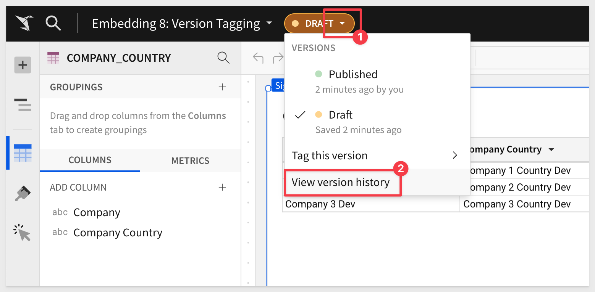
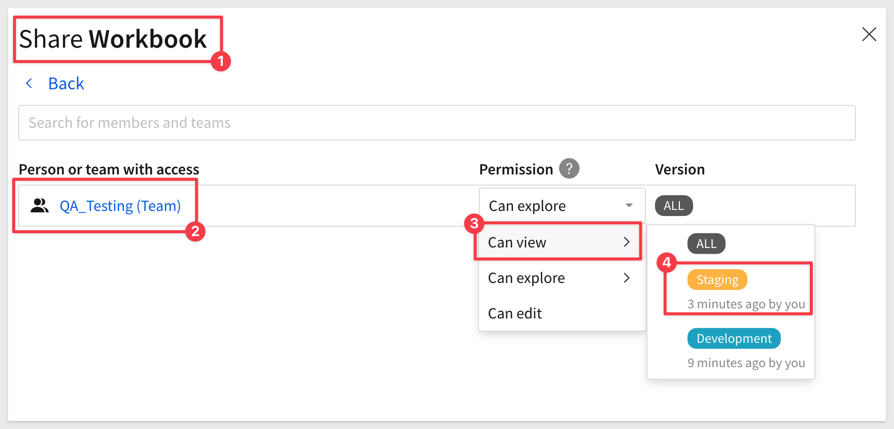
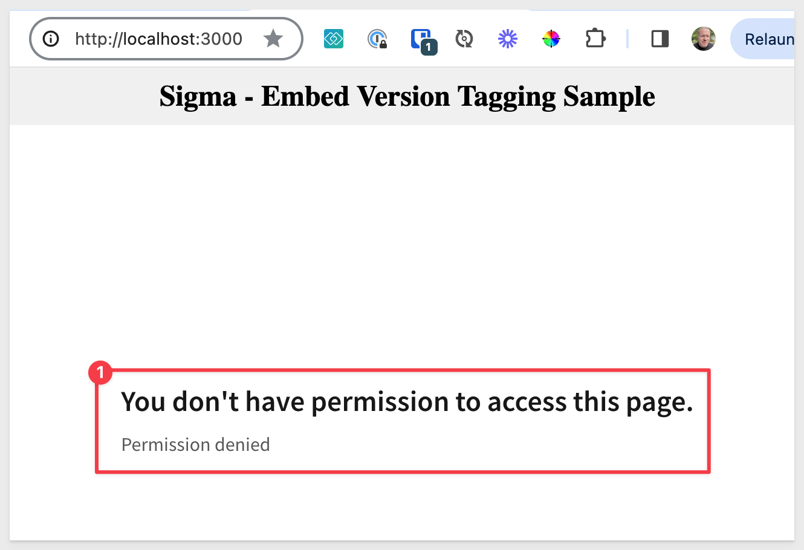
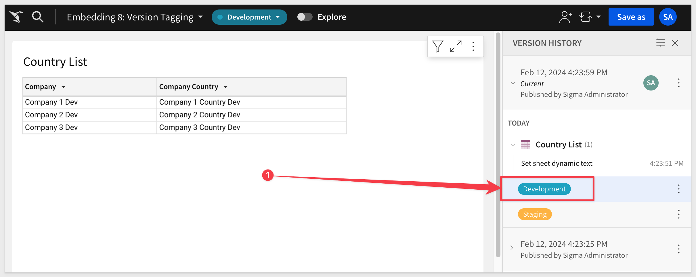
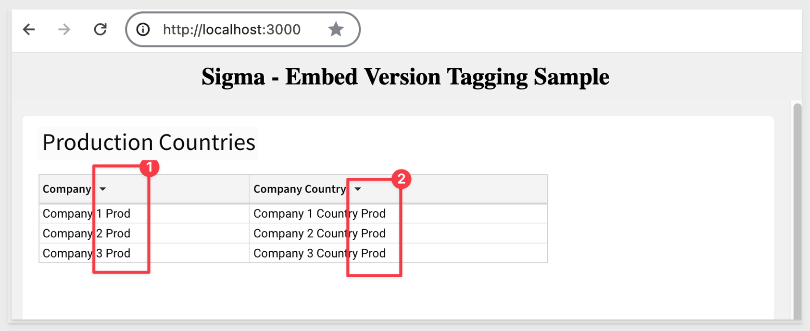

author: pballai
id: embedding_08_version_tagging
summary: embedding_8_version_tagging
categories: embedding
environments: web
status: Published
feedback link: https://github.com/sigmacomputing/sigmaquickstarts/issues
tags: deprecated
lastUpdated: 2023-03-24

# Embedding 08: Version Tagging

## Overview 
Duration: 5 

This QuickStart introduces you to Version Tagging in a Sigma embedded environment in order to manage promotions of workbooks via the third party CI/CD tools. Examples of popular Continuous Integration / Continuous Development (CI/CD) tools include GitLabs, Jenkins, Circle CI, Bamboo and many others.

Version tagging allows you to employ a software development lifecycle to control workbook versions, using tags. For example, Sigma can have a development, staging, and production versions of a workbook and migrate changes as needed. This allows you to control which workbook versions are available to your users. 

When you create a tag and assign it to a workbook, you essentially **freeze the state of that workbook**. The process of tagging a workbook creates a duplicate that can be shared with other stakeholders and users.  

For example, you can create a "Production" tag and assign it to a workbook that is used by embed users. Moreover, you can tag additional versions of the same workbook such as "Development" or "Staging". These versions can be used by different stakeholders in your company for various purposes. Once reviewed, you can migrate this copy to production for your users via external CI/CD tool of your choice.

The tagging design is flexible but at a high level, this is the workflow involved:


<aside class="postive">
<strong>IMPORTANT:</strong><br> One of the benefits of tagging is your company can modify a "Development" workbook without affecting the experience of your customers who use the "Production" version. Once you complete your developmental changes, you can easily update the "Production" version of the workbook by incrementing the workbook version number that the tag is using.
</aside> 

In this QuickStart, we will demonstration using Postman to simulate a CI/CD workflow and make manual edits to our local Node.js environment to evaluate the results of our API calls. In this way, we can demonstrate how a customer application using source control and pipelines could be used to make the same workflow work without asking the QuickStart user to create an excess amount of setup to become familiar with the tag workflow in Sigma. 

**Some steps may not be shown in detail as we assume you have completed any prerequisites and are familiar with Sigma workflows.**

<aside class="positive">
<strong>IMPORTANT:</strong><br> Some screens in Sigma may appear slightly different from those shown in QuickStarts. This is because Sigma is continuously adding and enhancing functionality. Rest assured, Sigma’s intuitive interface ensures that any differences will not prevent you from successfully completing any QuickStart.
</aside>

For more information on Sigma's product release strategy, see [Sigma product releases.](https://help.sigmacomputing.com/docs/sigma-product-releases)

 ### Target Audience
 Semi-technical users who will be aiding in the DevOps implementation of Sigma. 

**Sigma strongly advises against using production resources when replicating the exercises in this QuickStart.** 

### Prerequisites

<ul>
  <li>A computer with a current browser. It does not matter which browser you want to use.</li>
  <li>Access to your Sigma environment. A Sigma trial environment is acceptable and preferred.</li>
  <li>A working web server based on Node.js as demonstrated in the QuickStart Embedding 1: Prerequisites.</li>
  <li>A Snowflake account with the proper administrative and security admin access for our use case data.</li>
  <li>Completion of the QuickStart, "Sigma API with Postman" or an API tool that you use instead.</li>
</ul>

<aside class="postive">
<strong>IMPORTANT:</strong><br> Sigma recommends that you do not use production resources when doing QuickStarts.
</aside>

<button>[Sigma Free Trial](https://www.sigmacomputing.com/free-trial/)</button> <button>[Snowflake Free Trial](https://signup.snowflake.com/)</button> <button>[Login or Sign Up to Postman](https://identity.getpostman.com/login)</button>
  
### What You’ll Learn
How to manage CI/CD operations for a Sigma embedded environment.

### What You’ll Build

We will a sample dataset in Snowflake and use a Sigma workbook to display that data, based on different tagged versions we will create. We will then display them using Sigma's embedding framework, inside a Parent application.


<!-- END OF OVERVIEW -->

## Create Sample Snowflake Environment
Duration: 10

We will need to create three schemas in Snowflake, each having the same tables with names and data adjusted to match the schema name. 

To help you accomplish this, we will provide the Snowflake script required to do this. 

<aside class="negative"><strong>NOTE:</strong><br> The remainder of this QuickStart will reference these tables as our workbook is promoted from Development to Staging to Prod.</aside>

```code
// 1: CREATE OR REPLACE DATABASE AND SET IT TO CURRENT
CREATE OR REPLACE DATABASE SIGMA_VT;
USE DATABASE SIGMA_VT;

// 2: CREATE SCHEMAS
CREATE SCHEMA IF NOT EXISTS VT_DEV;
CREATE SCHEMA IF NOT EXISTS VT_STAGING;
CREATE SCHEMA IF NOT EXISTS VT_PROD;

// 3: CREATE AND LOAD DEV TABLES
USE SCHEMA VT_DEV;
CREATE OR REPLACE TABLE VT_DEV.company (company varchar);
CREATE OR REPLACE TABLE VT_DEV.company_country (company varchar, company_country varchar);
insert into vt_dev.company values ('Company 1 Dev');
insert into vt_dev.company values ('Company 2 Dev');
insert into vt_dev.company values ('Company 3 Dev');
insert into vt_dev.company_country values ('Company 1 Dev', 'Company 1 Country Dev');
insert into vt_dev.company_country values ('Company 2 Dev', 'Company 2 Country Dev');
insert into vt_dev.company_country values ('Company 3 Dev', 'Company 3 Country Dev');

// 4: CREATE AND LOAD STAGING TABLES
USE SCHEMA VT_STAGING;
CREATE OR REPLACE TABLE VT_STAGING.company (company varchar);
CREATE OR REPLACE TABLE VT_STAGING.company_country (company varchar, company_country varchar);
insert into vt_staging.company values ('Company 1 Stg');
insert into vt_staging.company values ('Company 2 Stg');
insert into vt_staging.company values ('Company 3 Stg');
insert into vt_staging.company_country values ('Company 1 Stg', 'Company 1 Country Stg');
insert into vt_staging.company_country values ('Company 2 Stg', 'Company 2 Country Stg');
insert into vt_staging.company_country values ('Company 3 Stg', 'Company 3 Country Stg');

// 5: CREATE AND LOAD PROD TABLES
USE SCHEMA VT_PROD;
CREATE OR REPLACE TABLE VT_PROD.company (company varchar);
CREATE OR REPLACE TABLE VT_PROD.company_country (company varchar, company_country varchar);
insert into vt_prod.company values ('Company 1 Prod');
insert into vt_prod.company values ('Company 2 Prod');
insert into vt_prod.company values ('Company 3 Prod');
insert into vt_prod.company_country values ('Company 1 Prod', 'Company 1 Country Prod');
insert into vt_prod.company_country values ('Company 2 Prod', 'Company 2 Country Prod');
insert into vt_prod.company_country values ('Company 3 Prod', 'Company 3 Country Prod');

// 6: CREATE ROLES FOR OUR USE CASES:
CREATE OR REPLACE ROLE VT_DEV;
CREATE OR REPLACE ROLE VT_STAGING;
CREATE OR REPLACE ROLE VT_PROD;

// 7: GRANT USAGE PERMISSION ON THE DATABASE TO NEW ROLES:
GRANT USAGE ON DATABASE SIGMA_VT TO VT_DEV;
GRANT USAGE ON DATABASE SIGMA_VT TO VT_STAGING;
GRANT USAGE ON DATABASE SIGMA_VT TO VT_PROD;

// 8: GRANT SELECT ON SCHEMA TO NEW ROLES:
GRANT USAGE ON SCHEMA SIGMA_VT.VT_DEV TO VT_DEV;
GRANT USAGE ON SCHEMA SIGMA_VT.VT_STAGING TO VT_STAGING;
GRANT USAGE ON SCHEMA SIGMA_VT.VT_PROD TO VT_PROD;

// 9 ALLOW NEW ROLES TO QUERY TABLE WE CREATED:
GRANT SELECT ON ALL TABLES IN SCHEMA SIGMA_VT.VT_DEV TO ROLE VT_DEV;
GRANT SELECT ON ALL TABLES IN SCHEMA SIGMA_VT.VT_STAGING TO ROLE VT_STAGING;
GRANT SELECT ON ALL TABLES IN SCHEMA SIGMA_VT.VT_PROD TO ROLE VT_PROD;

// 10: CREATE USERS FOR EACH ROLE
CREATE OR REPLACE USER vtag_dev PASSWORD='Dev99!' MUST_CHANGE_PASSWORD = FALSE;
GRANT ROLE VT_DEV TO USER vtag_dev;

CREATE OR REPLACE  USER vtag_staging PASSWORD='Staging99!' DEFAULT_ROLE = VT_STAGING MUST_CHANGE_PASSWORD = FALSE;
GRANT ROLE VT_STAGING TO USER vtag_staging;

CREATE OR REPLACE  USER vtag_prod PASSWORD='Prod99!' DEFAULT_ROLE = VT_PROD MUST_CHANGE_PASSWORD = FALSE;
GRANT ROLE VT_PROD TO USER vtag_prod;

//11: GRANT WAREHOUSE USAGE TO NEW ROLES:
GRANT USAGE ON WAREHOUSE COMPUTE_WH TO ROLE VT_DEV;
GRANT USAGE ON WAREHOUSE COMPUTE_WH TO ROLE VT_STAGING;
GRANT USAGE ON WAREHOUSE COMPUTE_WH TO ROLE VT_PROD;

// 12: VERIFY DATA LANDED (RUN CORRECT 'USE' STATEMENT TO SET THE SCHEMA, TO VALIDATE TABLES HAVE DATA IN EACH)
    // USE SCHEMA VT_DEV;
    // USE SCHEMA VT_STAGING;
    // USE SCHEMA VT_PROD;

USE SIGMA_VT.VT_DEV
select * from vt_staging.company;
select * from vt_prod.company;

select * from vt_dev.company_country;
select * from vt_staging.company_country;
select * from vt_prod.company_country;

// END
```


Once the script runs (with no errors) and we verified the data exists, we can move the next step.


<!-- END OF SECTION-->

## Sigma Connections
Duration: 10

Log into Sigma as an Administrator and head to the `Administration` / `Connections` page.

Click the `Create Connection` button. Select `Snowflake` and fill out the form.

The values for `User`, `Password` and `Role` were defined in our Snowflake Script as:
```
Connection Name:                  User:           Password:       Role:
Version Tagging - Development     vtag_dev        Dev99!          VT_DEV       
Version Tagging - Staging         vtag_staging    Staging99!      VT_STAGING
Version Tagging - Production      vtag_prod       Prod99!         VT_PROD
```


Click `Save` and Sigma will validate the connection is good. 

Before we add the other two connections (Staging and Prod), lets take a moment to ensure the Dev data is fully reachable.

In the new connection, click the `Browse Connection` button:


Verify that you can see table data for the `Company` and `Company Country` tables.


Now repeat the process, adding new Connections for `Staging` and `Prod`. Be sure to use the correct `User` and `Role` for each accordingly.

You should now have three working connections. The only difference is the table data for each.


<!-- END OF SECTION-->

## Sigma Tags
Duration: 5

Log into Sigma as an Administrator and head to the `Administration` / `Tags` page.

Click `Create` to add a new tag, 

Set the name to `Development` (pick any color you prefer, it won't matter for our example). 

<aside class="positive">
<strong>IMPORTANT:</strong><br> How you decide to name tags is totally up to you. The "draft/published" state of a new workbook is technically the "development" version but we wanted to show that you are in control of the workflow. If you prefer, you could just use the draft/published state as development and only have a "QA" and "Production" tags.
</aside>


Repeat the process, adding a `Production` tag. You should now have two tags:


<aside class="negative">
<strong>NOTE:</strong><br> To access a tagged workbook, users must be granted access to the workbook or be the workbook's editor. 
</aside>


<!-- END OF SECTION-->

## Sigma Workbook

Create a new workbook and select the `Version Tagging - DEVELOPMENT` connection.

Select the `Sigma_VT` / `Company_Country` table.

Click the `Save As` button and name the new workbook `Embedding 8: Version Tagging`

Rename the table to `COMPANY_COUNTRY`.

and `Publish` the change.

Notice that in the table columns we are seeing `dev` appended in the rows. This is what we would expect given we are using the `Development Connection`.


Click the `Version pill` in the header and select `Version history` to open the sidebar.



Click the top entry in `Version history` and note the version number at the end of the URL string. 

Also notice the string next to number 3; this is the workbook GUID. It is useful to know this when using the REST API manually.


Change the table title's text value to `County List` and `Publish`.

Sigma recorded that change and when we published it.


Sigma also incremented the from v1 to v2. 


We will reference version number 2 in our API call later when we promote to Staging.

### Add a New Sigma Team

Since we have a `Staging` tag, we want to add a new `Team` in Sigma to allow an embed user access to the workbook in the Parent application, as opposed to reviewing in the Sigma UI. 

We add a new Team called `QA_Testing`.

<aside class="positive">
<strong>IMPORTANT:</strong><br> Sigma is flexible enough to allow customers to decide how many steps make up a tagging workflow and who has permission to specific features along the way.
</aside>

### Tag the workbook

Set the tag on this workbook as shown below:


We are presented some options...


We do not need to swap data sources right now as we are already using the `Development` data when we created the workbook.

Before we get into the promotion workflow, we need to make sure that our parent application with the Sigma embed is working. 


<!-- END OF SECTION-->

## Parent Application Setup
Duration: 10

Download and unzip the project files into the folder on the computer's desktop called `sigma_embedding`.

<aside class="negative">
<strong>NOTE:</strong><br> This folder should already exist if your completed the perquisites QuickStart. If not, manually create it.
</aside>

[Click here to download sigma_secure_embed.zip](https://sigma-quickstarts-main.s3.us-west-1.amazonaws.com/embedding_2/sigma_embed_version_tagging.zip)

The zip file contains these two files:

**index.html:** the web page that contains the iframe we are embedding into. No changes are required for this file.

**embed-api.js:** a JavaScript routine that sets up the services required and configuration of the Sigma options. This is a example of an `Embed API`.

### Install Node Packages for Folder

If you haven't installed Node already, please do so by referring to section 3 of the [QuickStart: Embedding 01: Prerequisites.](https://quickstarts.sigmacomputing.com/guide/embedding_01_prerequisites/index.html?index=..%2F..index#2)

If you have already installed Node, recall that we still need to install the required Node packages for our new `sigma_embed_version_tagging` folder that was created when we unzipped the download into the `sigma_embedding` folder.

Open a new Terminal session from the folder `sigma_embed_version_tagging` and run this command:

**Run the command tro install the Express web-server:**
```code
npm init
```

As in the prerequisites QuickStart, accept all the defaults by pressing enter until completed.

and...

**Run the command:**
```code
npm install supervisor
```

### Edit embed-api.js
Open embed-api.js in a text editor and review all the comments (lines starting with “//”). 

**Required Changes:**

We made some changes for you, to pass the tag to Sigma (and add it to the URL) at runtime. 

We need to change the value for `embed path` as that is generated in from the `Embedding 8: Version Tagging` workbook. Go ahead and generate a new `embed path` for the entire workbook and replace the value in `embed-api.js` with the new value.

<aside class="negative">
<strong>NOTE:</strong><br> In the string `/tag/Development` the word "Development" should match a Tag that exists in Sigma. We will use this to inform the embed which tagged version to use later. The specific workbook version number will also be passed in the API call, but is not part of the URL string.
</aside>

We provided the values under item 1 for you, assuming the `QA_Testing` team was created earlier.

In section 6a, we declare and set the value for `tag` to our `Staging` one.

In section 7, we commented out the line that constructs the URL and added another line that appends the `tag` value to the URL that is generated.


<aside class="negative">
<strong>NOTE:</strong><br> In the code sample we have three statements setting the value for "tag".  Two are commented out. This is so when we test, we can just comment/uncomment the tag we want to use and save the embed-api.js. It saves a few bits of typing and that is always appreciated.
</aside>

### Start the Web Server
You are now ready to start the Node.js Express web server. Use Terminal and navigate to the `sigma_embed_version_tagging` folder where you just modified the two files. 

**Make sure to run the command from the folder where you stored the unzipped download:**
```code
supervisor embed-api.js
```

If you get an error about port 3000 being used already (not typical) you can change the port value in the embed-api.js to use a different port. That is configured in embed-api.js in section #3. You will also need to edit `index.html` for the new port on this line:

We are now ready to test the Parent application that has the embedded content.

Refresh the browser page; what happened?

We should get an error `You don't have permission to access this page. Permission denied`.

This is because the embedded workbook has not been shared to the Team `QA_Testing` (QA). 

Don't share just yet. We need to promote the workbook to `Staging` first, so it becomes available to share with the team.

We are ready to move to the next step.


<!-- END OF SECTION-->

## Promote to Staging
Duration: 20

In this section we will use a combination of REST API calls (using Postman) and one edit to `embed-api.js` to simulate a CI/CD workflow promotion to a Staging environment.

<aside class="postive">
<strong>NOTE:</strong><br> It is assumed that the manual REST calls and json editing steps shown here would be automated with a CI/CD tool and source repository of choice.
</aside>

<aside class="negative">
<strong>NOTE:</strong><br> Some steps using Postman will not be shown in detail as these were covered in the QuickStart, "Sigma API with Postman". Any REST tool can be used. You may also use the Sigma API Swagger or curl commands if you are more comfortable doing that.
</aside>

<button>[Sigma swagger page](https://docs.sigmacomputing.com/#overview)</button>

In order to use the Sigma API, we must first get a new bearer token. Do that, as instructed in the "Sigma API with Postman" QuickStart.

We are ready to have the QA team look at the workbook in the Embed, but using the `Staging` version.

We will use the API to tag the workbook with new values for the Staging tag, version number, Staging connection and Staging path. This will create a new copy of the workbook (as a tagged version). The original state of the workbook is also retained if we want to roll back to it later.

<aside class="negative">
<strong>REMINDER:</strong><br> The workbook in Sigma's UI is currently showing data from the Development connection.
</aside>

First, we need to use the REST API to obtain the required references. We will need to obtain the references (unique identifiers) for:

 <ul>
      <li>workbookUrlId</li>
      <li>Development connection</li>
      <li>Development path</li>
      <li>Staging connection<li>
</ul>

We will use these values to update the Sigma workbook (in json format) using a REST POST message.

Using a text editor (to hold the json temporarily) update each value that you obtain from the Postman calls. 

**Sample json with the example identifiers for workbookId, fromConnectionId and toConnectionId:**
```code
{
    "workbookId": "6DceMEz0RArq6F82wa02ha", 
    "workbookVersion": 2, 
    "tag": "Staging",
    "grantSourceAccess": true,
    "sourceMappingConfig": [
      {
        "fromConnectionId": "b44fef40-b1b3-4059-b530-7e3eac51e712",
        "toConnectionId": "0c750f29-607b-4437-a824-d287431f69e8",
        "paths": [{ "fromPath": ["SIGMA_VT", "VT_DEV", "COMPANY_COUNTRY"], "toPath": ["SIGMA_VT", "VT_STAGING", "COMPANY_COUNTRY"] }]
      }
    ],
    "sourceVersions": {}
  } 
```

<aside class="negative">
<strong>NOTE:</strong><br> Values for paths may be different depending on if you created different schema in Snowflake than what was provided in this QuickStart.
</aside>

In Postman, open the request for `Returns a workbook based on workbookId` in the `workbooks` folder. This will get the list of all workbooks. 

Click `Send` and locate the workbook named `Embedding 8: Version Tagging` in the return. 

Copy it's workbookUrlId value and update the json sample:


We now need to get the GUIDs for the Development and Staging connection using the method `Returns a list of available connections`:

Copy the two GUIDs (one for Development and another for Staging) from the return and update the json code. 


Send the API request. The API should return with a 200 Status and three lines of information (number 10)


We have now tagged the workbook to `Staging` version 2. 

A new entry appears in `Version History` showing that the workbook has been tagged `Staging`. This was done by the API call we made.


We have already adjusted `embed-api.js` point to the Staging tag.


Now share the workbook with the `QA_Testing` team, with `Can view` permission and only the `Staging` tag version:



Browse the Parent application page. 

We now see the table is using the Staging connection's data and the embed URL is using the `Staging` tag.


Let's try demoting this workbook back to the Developers connection.

Edit embed-api.js:
```plaintext
// SECTION TAGGING:
	 let tag = '/tag/Development';
	// let tag = '/tag/Staging';
	// let tag = '/tag/Production';
// END SECTION TAGGING
```

Save `embed-api.js` and refresh the Parent application page.

Now we get an error; what happened?



We never shared the `Development` tagged version of the workbook with the `QA_Testing` team, so permission is denied. This is a positive outcome.

### Reverting from Staging to Development

We just need to rerun the `Tags a workbook` API call, changing the tag to `Development` and flipping the values as shown:


Back in Sigma, we can see that `Development` is the current version of the workbook.


In the next section, we will want the developer to make one small change and push to production. 

To do this, we will have to use the workbook tagged with the `Development` tag and select the draft to edit it. This will also create a new version (by number) for the tagged workbook, which we will demonstrate.


<!-- END OF SECTION-->


## Production Version
Duration: 20

We left the Parent application using the Development version of the workbook. 

Lets assume QA (in Staging) asked us to change the table title and then push right into production. 

Currently, we have a Development and Staging copy of the workbook at version 2. If we want to see the version number, open `Version history` and click on where the red arrow shows:


In the `Version history`, click to change to the `Development` version:

The workbook is now that copy.



Place the `Development` copy in `Draft` mode, so we can edit it:


Change the table title to `Production Counties` and hit `Enter`.

Notice that there is activity in the Version history sidebar? We have a `Pending Draft` with our change but since it is not yet `Published`, it is not yet a new version.


Click on `Publish button`.

<aside class="negative">
<strong>NOTE:</strong><br> If you clicked around and got lost, just use the Version menu to set it back to "Development" and "Draft".
</aside>

Clicking the latest Production version in the `Version history` yields the version number in the URL. We now have version 3. Versions 1 & 2 still exist and we will use v3 (with our final table title) for the embed.

Tag version 3 as `Production` using the same steps as before.

In Postman, we need to make a few changes to the `Tags a workbook` method so that we are using the correct values as done earlier.

The workbookId is the same but we need to change:

 <ul>
      <li><strong>workbookVersion:</strong> 3</li>
      <li><strong>tag</strong> Production</li>
      <li><strong>fromConnectionId</strong> the development connectionId</li>
      <li><strong>toConnectionId</strong> the production connectionId</li>
      <li><strong>fromPath</strong> ["SIGMA_VT", "VT_DEV", "COMPANY_COUNTRY"]</li>
      <li><strong>toPath</strong> ["SIGMA_VT", "VT_PROD", "COMPANY_COUNTRY"]</li>

</ul>

Once you the edits are made, `Send` the request and observe the return of `Status 200` and three lines of information.


Update `embed-api.js` to use the Production tag and parameters for a "Sales Manager":


Share the `Production` version of the workbook with the `Sales_Managers` team:


Refresh the browser and we now see version 2 of the workbook with Production data and the table title of "Production":




<!-- END OF SECTION-->

## What we've covered
Duration: 5

In this QuickStart we reviewed how to use Sigma Version Tagging to manage a CI/CD workflow (manually) to promote/demote a Sigma workbook while changing the underlying data displayed to the embed user. 

<!-- THE FOLLOWING ADDITIONAL RESOURCES IS REQUIRED AS IS FOR ALL QUICKSTARTS -->
**Additional Resource Links**

Be sure to check out all the latest developments at [Sigma's First Friday Feature page!](https://quickstarts.sigmacomputing.com/firstfridayfeatures/)

[Help Center Home](https://help.sigmacomputing.com)<br>
[Sigma Community](https://community.sigmacomputing.com/)<br>
[Sigma Blog](https://www.sigmacomputing.com/blog/)<br>
<br>

[](https://twitter.com/sigmacomputing)&emsp;
[](https://www.linkedin.com/company/sigmacomputing)&emsp;
[](https://www.facebook.com/sigmacomputing)


<!-- END OF WHAT WE COVERED -->


<!-- END OF QUICKSTART -->
