author: pballai
id: embedding_09_dynamic_role_switching_snowflake 
summary: Using Sigma Dynamic Role Switching with Embeds
categories: embedding
environments: web
status: Published
feedback link: https://github.com/sigmacomputing/sigmaquickstarts/issues
tags: default
lastUpdated: 2023-03-15

# Embedding 09: Dynamic Role Switching with Snowflake

## Overview 
Duration: 5 

This QuickStart introduces you to Sigma embedding using Dynamic Connection & Role Switching with Snowflake; **(DRS)** to limit the data exposed to a user based on values passed to Sigma at runtime. This QuickStart assumes you have already taken the QuickStart [Embedding 1: Prerequisites](https://quickstarts.sigmacomputing.com/guide/embedding_3_application_embedding/index.html#0) so that you have a sample environment to complete the tasks in this QuickStart.

We also recommend you table the the QuickStart [Embedding 3: Application Embedding](https://quickstarts.sigmacomputing.com/guide/embedding_1_prerequisites/index.html?index=..%2F..index#0) as we will build on that content. 

**Some steps may not be shown in detail as we assume you have taken these other two QuickStarts or are familiar with Sigma workflows.**

DRS allows run-time swapping of the Snowflake Warehouse and Role for a Sigma connection. There are ways to leverage this using one or both Warehouse and/or Role along with different methods to restrict data access in Snowflake itself.

This QuickStart will cover how to implement RDS using User Attributes defined in Sigma, with an Application Embed.

Many customers will use Snowflake's column masking functionality and also also manage their Snowflake Row Access Policy in a Table. Sigma fully supports these methods although we want to keep this simple and focused on the main task; DRS. 
 
In light of that, we will just use trial accounts and the provided Snowflake `AccountAdmin` Role for the scripts we will run in Snowflake.

 ### Target Audience
Semi-technical users who will be aiding in the planning or implementation of Sigma. Limited SQL and technical data skills are needed to do this QuickStart. It does assume some common computer skills like installing software, using Terminal, navigating folders and edit/copy/paste operations.

If you are wanting to recreate this QuickStarts scenario you will require a Snowflake account. **Sigma strongly advises against using Production Snowflake resources when replicating the exercises in this QuickStart.** 

### Prerequisites

<ul>
  <li>A computer with a current browser. It does not matter which browser you want to use.</li>
  <li>Access to your Sigma environment. A Sigma trial environment is acceptable and preferred.</li>
  <li>A working web server based on Node.js as demonstrated in the QuickStart Embedding 1: Prerequisites</li>
  <li>Some content to embed. You can embed a Workbook, Table or Visualization.</li>
  <li>Downloadable project files discussed later in this document.</li>
  <li>A Snowflake account with the proper administrative and security admin access.</li>
</ul>

<button>[Sigma Free Trial](https://www.sigmacomputing.com/free-trial/)</button> <button>[Snowflake Free Trial](https://signup.snowflake.com/)</button>

<ul>
  <li></li>
    <li>Node.js and required Packages (all free, discussed in prior QuickStarts in detail):
        <ul>
        <li>Express</li>
        <li>Node-supervisor</li>
        <li>crypto (is now included with Node.js installation)</li>
        </ul>
    </li>
</ul>

### What You’ll Learn
The exercises in this QuickStart will discuss and walk you through the steps to implement DRS with User Attributes (**UA**).

### What You’ll Build
We will embed Sigma content inside a Node.js web application, passing runtime parameters to configure the embed and demonstrate limiting data based on passed Snowflake Warehouse and/or Role.


<!-- END -->

## **Snowflake Data Configuration**
Duration: 10

Let's start by logging into our Snowflake trial account, verify we are using an AccountAdmin role and that there is a Warehouse for us to use:

<aside class="negative">
<strong>NOTE:</strong><br> The default Warehouse already exists when using a Snowflake Trial account.
</aside>

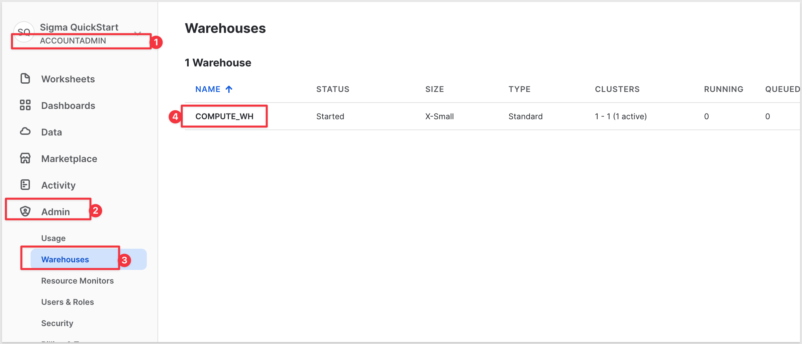

Our Warehouse name is `COMPUTE_WH` and is started for us.

Navigate to `Worksheets` and click the button `+ Worksheet`:

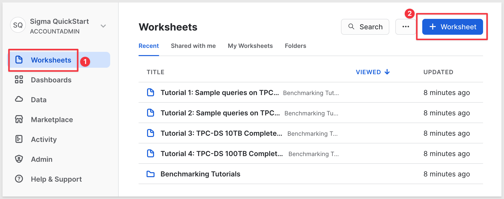

Click on the 3 vertical dots (as shown below) and rename the Worksheet to `Sigma DRS Configuration Scripts`.<br><br>
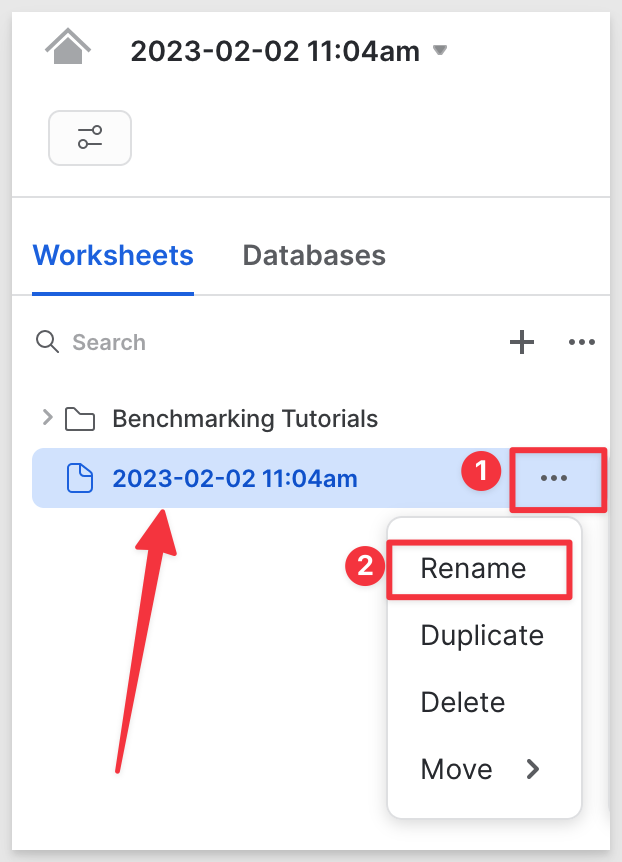

We will proceed slowly now, cutting and pasting operations one by one so that we can clearly see what is happening as we go. Comments are included for those less familiar with Snowflake commands.

Confirm or change your working Role and Warehouse to `ACCOUNTADMIN` and `COMPUTE_WH` as:
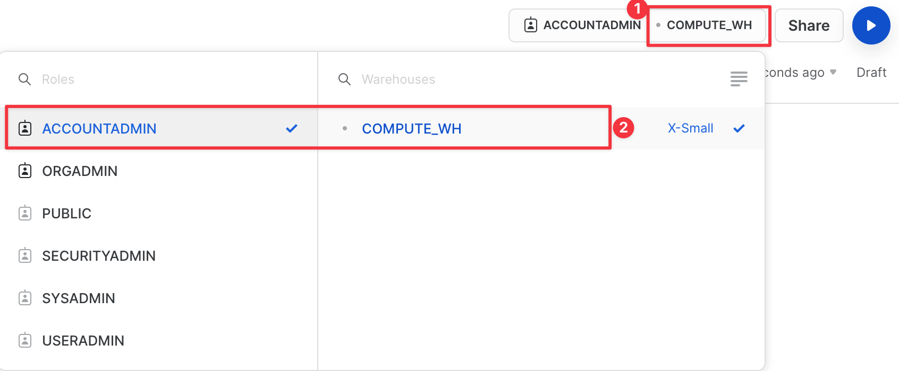


Copy and paste this code into the new Worksheet:
```plaintexst
// DATA CONFIGURATION
// ----------------------------------------------------------------------------------------------------------

// 1: CREATE OR REPLACE DATABASE DRS
CREATE OR REPLACE DATABASE SIGMA_DRS;
USE DATABASE SIGMA_DRS;
```

Highlight the command `CREATE OR REPLACE DATABASE SIGMA_DRS;` and click the run button 
 in the upper right corner.

We should get a message (#2 in the screenshot) that the command was successful. 

Click the `Databases` tab and refresh the list. 

We now have a new Database called `SIGMA_DRS`in our Warehouse.

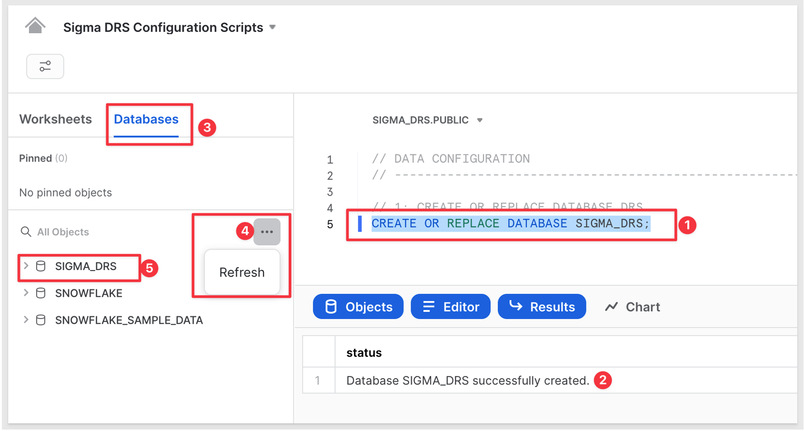

Now lets create a new Schema in our database. Copy/Paste and run this command:
```plaintext
// 2: CREATE A NEW SCHEMA TO HOLD OUR FUTURE SAMPLE DATA TABLE:
CREATE SCHEMA IF NOT EXISTS DRS_DATA;
```

Results should be as follows. Note the selection of current Database / Schema is switched to our new one for us.

**We may have to refresh the Database objects list if the new Schema is not present after running the command.**

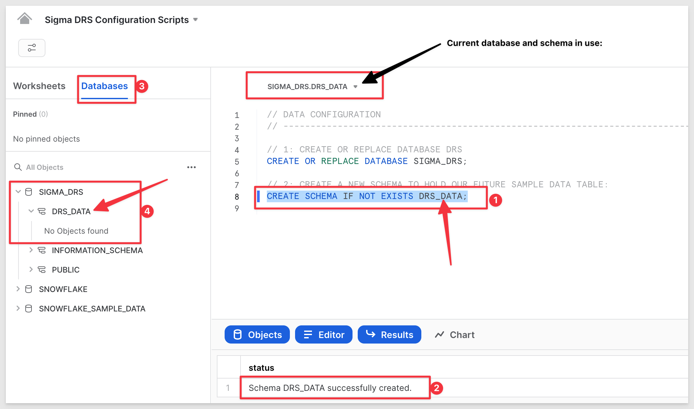

Next step we will create an empty table to hold a very small (30 rows) of sample data. 

Same operation please:
```plaintext
// 3: CREATE THE SAMPLE DATA TABLE SCHEMA after switching context to drs.public.
CREATE OR REPLACE TABLE SIGMA_DRS.DRS_DATA.DRS_SAMPLE_DATA (
store_region varchar,
cust_key varchar,
order_number varchar,
date varchar,
quantity varchar,
cost varchar,
price varchar,
product_type varchar,
product_family varchar,
product_name varchar,
store_name varchar,
store_state varchar,
store_city varchar
);
```

Result will be a new Table with our columns defined. All columns are varchar as that is not important in this exercise:

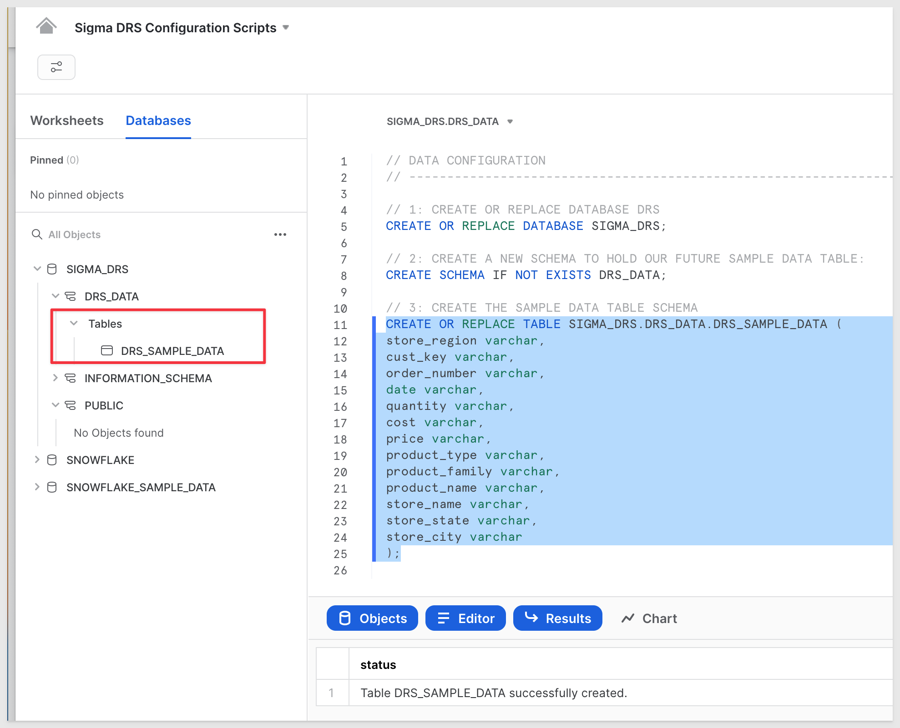

Do this QuickStart we will load our sample data from a public S3 bucket. We will copy the data into a Snowflake Stage and them load it from the Stage into our Table.

Copy/Paste and run the following commands **one at a time** so we can observe the success messages:

```plaintext
// 4: CREATE OR REPLACE SCHEMA FOR EXTERNAL STORAGE OF CSV FILE
CREATE STAGE IF NOT EXISTS S3_DATA URL='s3://sigma-quickstarts-main/embedding/DRS_Sample_Data.csv';

// 5: COPY INTO SE_INTERNAL_DB.SCHEMA_PHIL_BALLAI.DRS_Sample_Data  FROM  's3://sigma-quickstarts-main/embedding/DRS_Sample_Data.csv';
COPY INTO SIGMA_DRS.DRS_DATA.DRS_SAMPLE_DATA FROM @S3_DATA;

// 6:CONFIRM DATA IS LANDED IN SNOWFLAKE TABLE:
SELECT * FROM DRS_SAMPLE_DATA;
```

The last command should list the 35 rows. Notice that there are 20 values in `STORE_REGION` for East, 10 for West and the rest are South but there will be no Role for South so only the Executive Role will see those extra 5 rows. We will use the STORE_REGION column to limit our data in Sigma later:

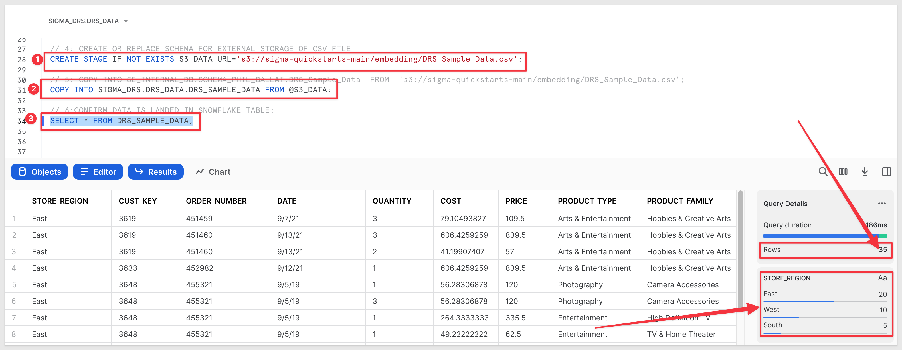


<!-- END -->

## Snowflake Role Configuration
Duration: 10

Now that we are familiar with using cut/paste into the Snowflake Worksheet we can move a little faster. We need to create a few Roles in Snowflake so that Sigma can leverage them later. 

Copy/Paste and run each numbered section as a group of commands and make sure you see a success message each time:

```plaintext
// ----------------------------------------------------------------------------------------------------------
// ROLE CONFIGURATION + ADDING AN EXTRA WAREHOUSE
// ----------------------------------------------------------------------------------------------------------

// 1: CREATE ROLES FOR OUR USE CASES:
CREATE OR REPLACE ROLE DRS_Executive;
CREATE OR REPLACE ROLE DRS_West;
CREATE OR REPLACE ROLE DRS_East;

// 2: CREATE A SECOND WAREHOUSE AND GRANT USAGE PERMISSION ON THE WAREHOUSES TO NEW ROLES:
CREATE WAREHOUSE COMPUTE_WH2 WAREHOUSE_SIZE=SMALL AUTO_SUSPEND = 5;
GRANT USAGE ON WAREHOUSE COMPUTE_WH2 TO DRS_Executive;
GRANT USAGE ON WAREHOUSE COMPUTE_WH2 TO DRS_West;
GRANT USAGE ON WAREHOUSE COMPUTE_WH2 TO DRS_East;
USE WAREHOUSE COMPUTE_WH2;

GRANT USAGE ON WAREHOUSE COMPUTE_WH2 TO DRS_Executive;
GRANT USAGE ON WAREHOUSE COMPUTE_WH2 TO DRS_West;
GRANT USAGE ON WAREHOUSE COMPUTE_WH2 TO DRS_East;

// 3: GRANT USAGE PERMISSION ON THE DATABASE TO NEW ROLES:
GRANT USAGE ON DATABASE SIGMA_DRS TO DRS_Executive;
GRANT USAGE ON DATABASE SIGMA_DRS TO DRS_West;
GRANT USAGE ON DATABASE SIGMA_DRS TO DRS_East;

// 4: GRANT SELECT ON SCHEMA TO NEW ROLES:
GRANT USAGE ON SCHEMA SIGMA_DRS.DRS_DATA TO DRS_Executive;
GRANT USAGE ON SCHEMA SIGMA_DRS.DRS_DATA TO DRS_West;
GRANT USAGE ON SCHEMA SIGMA_DRS.DRS_DATA TO DRS_East;

// 5: ALLOW NEW ROLES TO QUERY TABLE WE CREATED:
GRANT SELECT ON ALL TABLES IN SCHEMA SIGMA_DRS.DRS_DATA TO ROLE DRS_Executive;
GRANT SELECT ON ALL TABLES IN SCHEMA SIGMA_DRS.DRS_DATA TO ROLE DRS_West;
GRANT SELECT ON ALL TABLES IN SCHEMA SIGMA_DRS.DRS_DATA TO ROLE DRS_East;
```
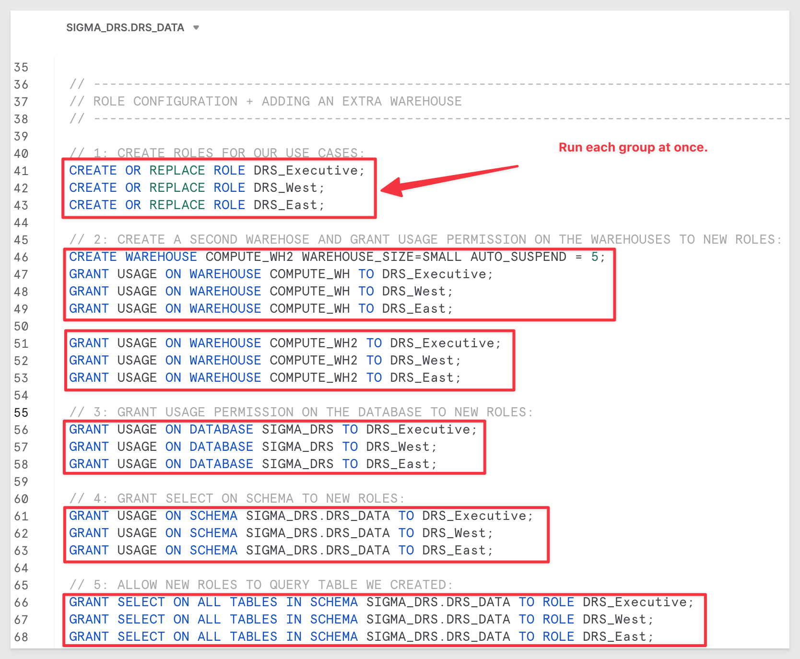

Now that we have defined Roles and they have permission to access the data we want to verify this in Snowflake before we use it in Sigma. To do this, we will need to also GRANT access to the new roles to the current Snowflake use (ie: you).

```plainext
// ----------------------------------------------------------------------------------------------------------
// CONFIRM ROLES CAN SEE DATA IN SNOWFLAKE. 
// ----------------------------------------------------------------------------------------------------------

// 5: ADD THESE ROLES TO YOUR OWN USER TO MAKE LOCAL TESTING IN SNOWFLAKE UI POSSBILE UNDER YOUR CURRENT LOGIN:
GRANT ROLE DRS_Executive TO USER {YOUR SNOWFLAKE USERNAME HERE};
GRANT ROLE DRS_West TO USER {YOUR SNOWFLAKE USERNAME HERE};
GRANT ROLE DRS_East TO USER {YOUR SNOWFLAKE USERNAME HERE};

// 6: SWITCH TO ONE OF THE NEW ROLES:
USE ROLE DRS_East;

// 7: SHOW INITIAL DATA COLUMNS, TOP 10 ONLY. THERE ARE 1M ROWS IN THIS TABLE.
SELECT * FROM SIGMA_DRS.DRS_DATA.DRS_SAMPLE_DATA;
```
If you are not sure what your current username is:

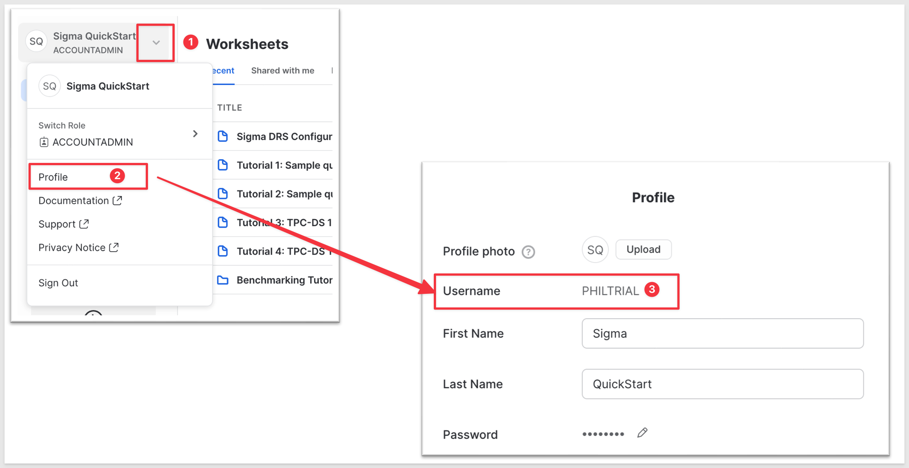

When we run the Select statement the return is 30 rows. This is expected because even through we are using the DRS_East Role, we have not created any Policy to restrict data. That is next.

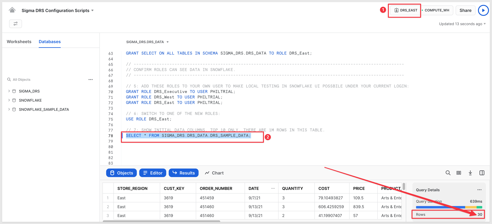


<!-- END -->

## Snowflake RLS Policy Configuration
Duration: 10

We are now ready to define our Snowflake Row Access Policy. Same process as before with these new commands:

```plaintext
// ----------------------------------------------------------------------------------------------------------
// CONFIRM ROLES CAN SEE DATA IN SNOWFLAKE. 
// ----------------------------------------------------------------------------------------------------------

// 5: ADD THESE ROLES TO YOUR OWN USER TO MAKE LOCAL TESTING IN SNOWFLAKE UI POSSIBLE UNDER YOUR CURRENT LOGIN:
GRANT ROLE DRS_Executive TO USER {YOUR SNOWFLAKE USERNAME HERE};
GRANT ROLE DRS_West TO USER {YOUR SNOWFLAKE USERNAME HERE};
GRANT ROLE DRS_East TO USER {YOUR SNOWFLAKE USERNAME HERE};

// 6: SWITCH TO ONE OF THE NEW ROLES:
USE ROLE DRS_East;

// 7: SHOW INITIAL DATA COLUMNS, TOP 10 ONLY. THERE ARE 1M ROWS IN THIS TABLE.
SELECT * FROM SIGMA_DRS.DRS_DATA.DRS_SAMPLE_DATA;


// ----------------------------------------------------------------------------------------------------------
// 1: CREATE ROW ACCESS POLICY BASED ON REGION COLUMN
// ----------------------------------------------------------------------------------------------------------
USE ROLE ACCOUNTADMIN;
USE SIGMA_DRS.DRS_DATA;
CREATE OR REPLACE ROW ACCESS POLICY DRS_REGION
    AS (STORE_REGION STRING) RETURNS BOOLEAN ->
    CASE WHEN 'DRS_EXECUTIVE' = CURRENT_ROLE() THEN TRUE
         WHEN 'DRS_WEST' = CURRENT_ROLE() AND STORE_REGION = 'West' THEN TRUE
         WHEN 'DRS_EAST' = CURRENT_ROLE() AND STORE_REGION = 'East' THEN TRUE
         WHEN 'ACCOUNTADMIN' = CURRENT_ROLE() THEN TRUE
    ELSE FALSE
END;

SHOW ROW ACCESS POLICIES;

// 9: APPLY THE ROW ACCESS POLICY TO THE TABLE
ALTER TABLE SIGMA_DRS.DRS_DATA.DRS_SAMPLE_DATA
ADD ROW ACCESS POLICY DRS_REGION
    ON (STORE_REGION);
    
// 10: TEST OUT ROLES AND SEE DIFFERENT RESULTS:SIGMA_DRS.S3_DATA.DRS_SAMPLE_DATA
USE ROLE DRS_EXECUTIVE;
SELECT * FROM DRS_SAMPLE_DATA;

// 11:
USE ROLE DRS_WEST;
SELECT * FROM DRS_SAMPLE_DATA;

// 12:
USE ROLE DRS_EAST;
SELECT * FROM DRS_SAMPLE_DATA;

// 13:
USE ROLE ACCOUNTADMIN;
SELECT * FROM DRS_SAMPLE_DATA;
```

Notice that when you ran the last command to select from the Table using the Role `DRS_WEST` that only 10 rows are returned. This is expected and you can run the same command again, changing the Role to DRS_EAST or DRS_Executive to see the row count is 35. 

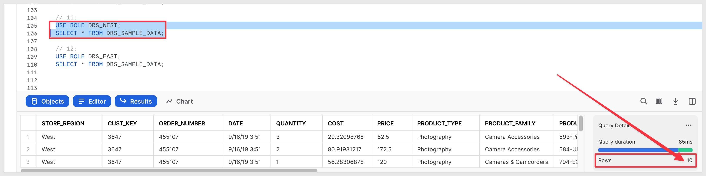


<!-- END -->

## Applying DRS in Sigma
Duration: 10

Sigma supports dynamically changing the Warehouse and Role at embedded runtime. 

First, we need to add a `User Attribute` in Sigma for our Connection / Role to evaluate.

In Sigma, navigate to Administration / User Attributes.

Configure the new User Attibute as shown:

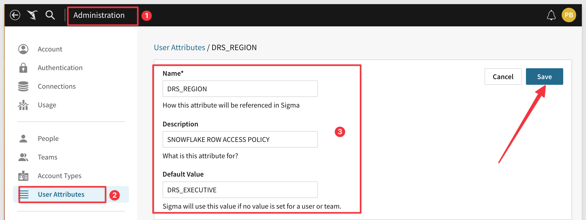

Snowflake will evaluate the passed value as a Role assignment. 

Create another User Attribute for `Warehouse` as shown:

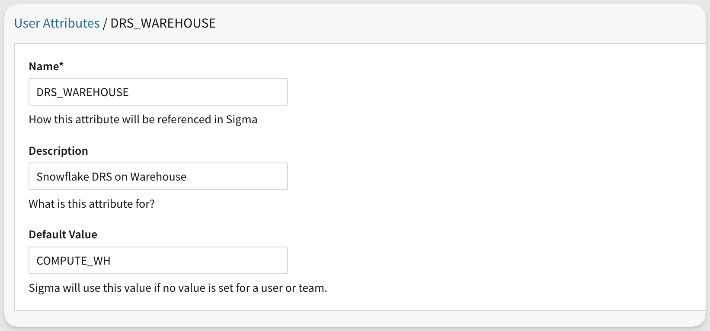

Navigate to Administration / Connection and edit the connection called `Snowflake Trial Account`.

Click the  bars in `Role` and the new User Attribute called `DRS_REGION` should be available. 

Do the same for `Warehouse`.

Save the connection (you will need to supply your Snowflake account password again).

### Create a Connection to Snowflake
From Sigma / Administration / Connections, create a new connection in Sigma to our Snowflake trial account.  

[Creating Snowflake Connection online help is here](https://help.sigmacomputing.com/docs/connect-to-snowflake)

You will need your Snowflake details to connect. To get the account url click as shown below:

<aside class="negative">
<strong>NOTE:</strong><br> The account details shown here are expired so do not attempt to reuse them.
</aside>

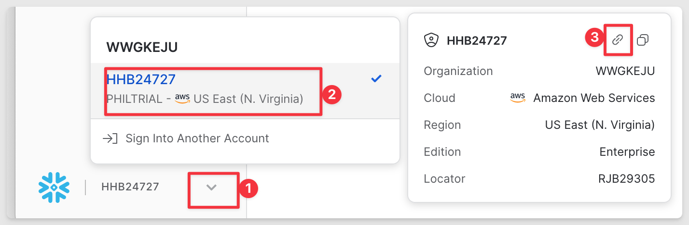

Use this Account URL to configure a new Connection in Sigma, replacing the information for your Snowflake instance:

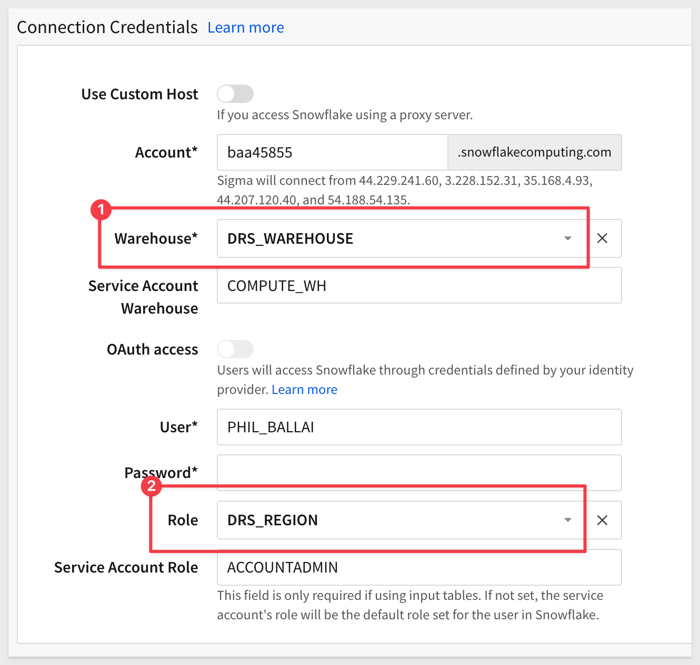

<aside class="postive">
<strong>IMPORTANT:</strong><br> The two red arrows in the above screenshot are the controls that allow you to change from static values for Warehouse and Role to dynamic values based on value passed by the Parent Application at runtime when the embed is loaded.
</aside>

Create a new Sigma / Administration / Team called `DRS_Team`. We will use this later to control which users have rights to access the Sigma Workbook. Accessing the Workbook does not automatically mean that users also get to see all the data since we will be limiting that based on their Snowflake Role. 


<!-- END -->

## Create Sigma Embed Content
Duration: 10

Create a new Workbook in Sigma and select the new Snowflake connection we just created. 

Use the `DRS_SAMPLE_DATA` table and all columns. 

There should be 35 rows shown:

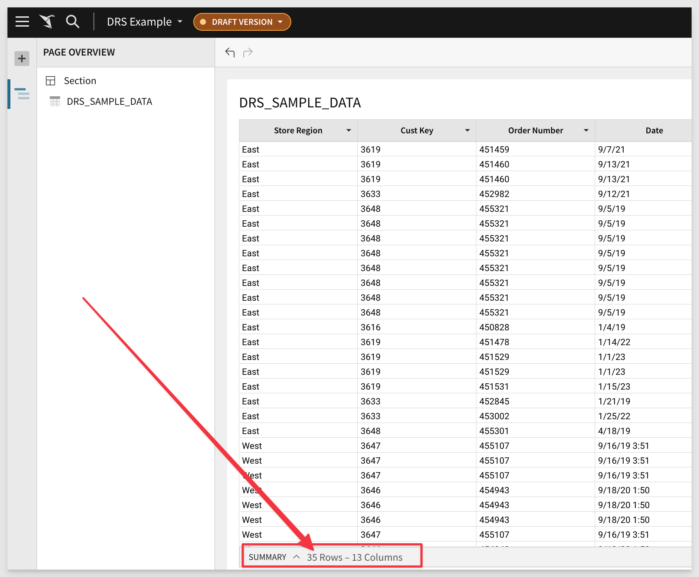

Lets add two `Text boxes` to the Workbook Page to show the current user's Role and Warehouse. Configure each text box as follows:

<aside class="negative">
<strong>NOTE:</strong><br> Pay attention when defining User Attributes and Functions as there is case sensitivity that can cause errors when case does not match.
</aside>

**ROLE TEXTBOX FUNCTION:**
```plaintext
=CurrentUserAttributeText("DRS_WAREHOUSE")
```
**WAREHOUSE TEXTBOX FUNCTION:**
```plaintext
=CurrentUserAttributeText("DRS_REGION")
```

The Workbook now looks like this. Some additional text description was added to each text box but that is optional:

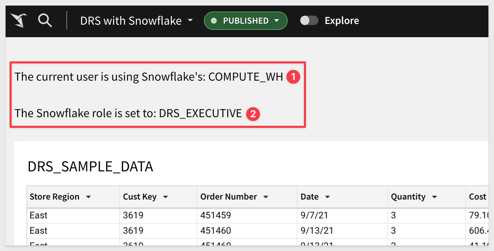

Share the Workbook with the `DRS_Team`.

Create an Embed for the Workbook and copy off the `Embed Path` for use in our server.js. 

Publish the Workbook.

We are now ready to use this Workbook embedded in an Application.


<!-- END -->

## Embed the Workbook
Duration: 10

We will move through this quickly as it is assumed you have done this operation before in earlier QuickStarts in the Embedding Series. If not, go back and review them as mentioned in the Overview section of this QuickStart.

[Download the zip file that contains the html page (Parent Application) and Javascript (Parent API) files here.](https://sigma-quickstarts-main.s3.us-west-1.amazonaws.com/embedding/sigma_application_embed_DRS.zip)

We need to adjust the details in `server.js` for our new embed. We will not show all the steps as they have been covered in great detail in the other Embedding QuickStarts. 

In summary, the following things need to exist in Sigma or be configured in server.js:

 <li><strong>Sigma changes:</strong> Some text...
    <ol type="n"> 
      <li>Enable Embedding in Administration / Account / Application Embedding</li>
      <li>Create a Team in Administration / Teams (we used DRS_Team as the team name)</li>
      <li>Share the new Workbook with the DRS_Team</li>
      <li>In the Workbook, create an Application Embed saving the secret</li>
    </ol>
  </li>

   <li><strong>Changes to server.js file:</strong> Some text...
    <ol type="n"> 
      <li>Line 2A: adjust the embed path</li>
      <li>Line 2B: adjust the embed secret</li>
      <li>Line 2C: adjust the client_ID</li>
      <li>Line 2E: adjust the email. We are starting with a user that will leverage the DRS_Executive Snowflake role. The address does need to be "real" but needs to be different from what is listed. EMails are unique values in Sigma</li>
      <li>Line 2G: adjust the Sigma Team if needed</li>
      <li>Line 2J: should be commented out for now</li>
      <li>Like 2K: should be commented out for now</li>
      <li>Save the changes</li>
    </ol>
  </li>

server.js should look something like this:

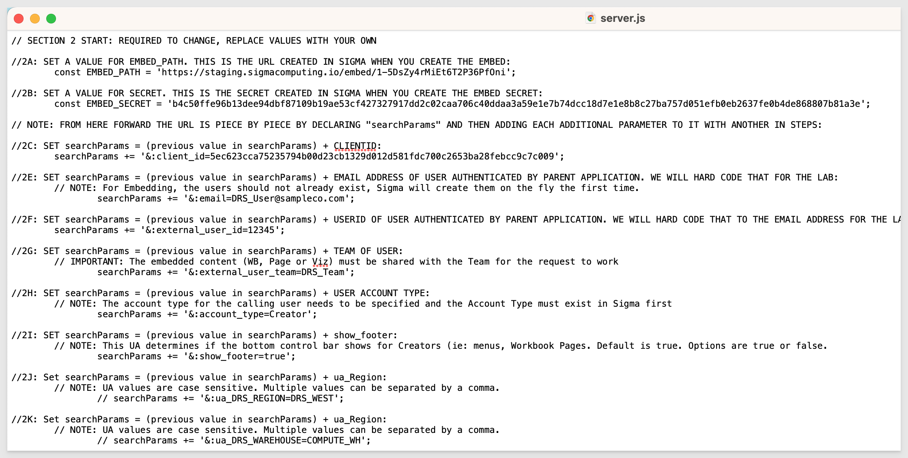

Start node in Terminal:
```plaintext
cd\site
supervisor server.js
```

Browse to:
```plaintext
http//localhost:3000
```

Our application should render with the Workbook embedded and showing 35 rows as we have not applied any DRS in Sigma yet. We are just using the hard coded values in the Sigma Snowflake Connection we added earlier for Role.

<aside class="negative">
<strong>NOTE:</strong><br> The values shown for Role and Warehouse are the defaults we set for each Sigma User Attribute. These will change as we pass need values
</aside>

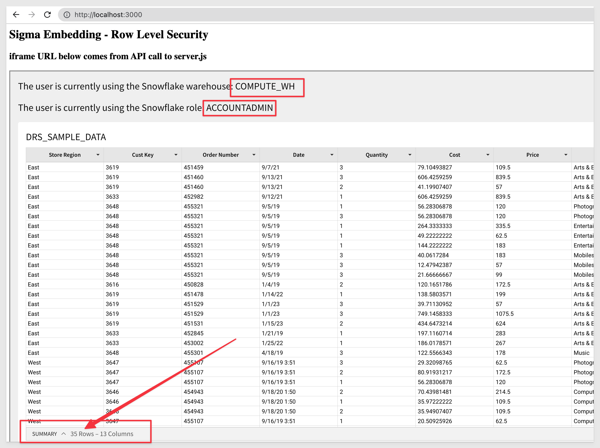


<!-- END -->

## Test Different Roles
Duration: 5

To save time we will not worry about changing embed users in server.js. We will just change the Role the embed user configured in server.js uses. You can create different values in server.js for email address, userid and account type if you prefer; that is not really the point of the exercise but will also work as expected.

In `server.js` , change replace the text for row 2J with this code:

```plaintext
//2J: Set searchParams = (previous value in searchParams) + ua_Region:
	// NOTE: UA values are case sensitive. Multiple values can be separated by a comma. 
		searchParams += '&:ua_DRS_REGION=DRS_EAST';
```    

Notice that the 3rd line is no longer commented out and the parameter is using the User Attribute we created in Sigma and it is passing a value for `DRS_East`. Snowflake will use this to evaluate against it's Row Access Policy we created in Step 3 of this QuickStart.

Also uncomment out row 2K for sending the searchParams so we also send the desired Warehouse to Sigma.

Save server.js.

Refresh the browser. We should only return 20 rows and not the full 36. Only `STORE_REGION = EAST` should exist in the Table:


Go ahead and change server.js to use the `DRS_WEST` role. We expect that will return only 10 rows:

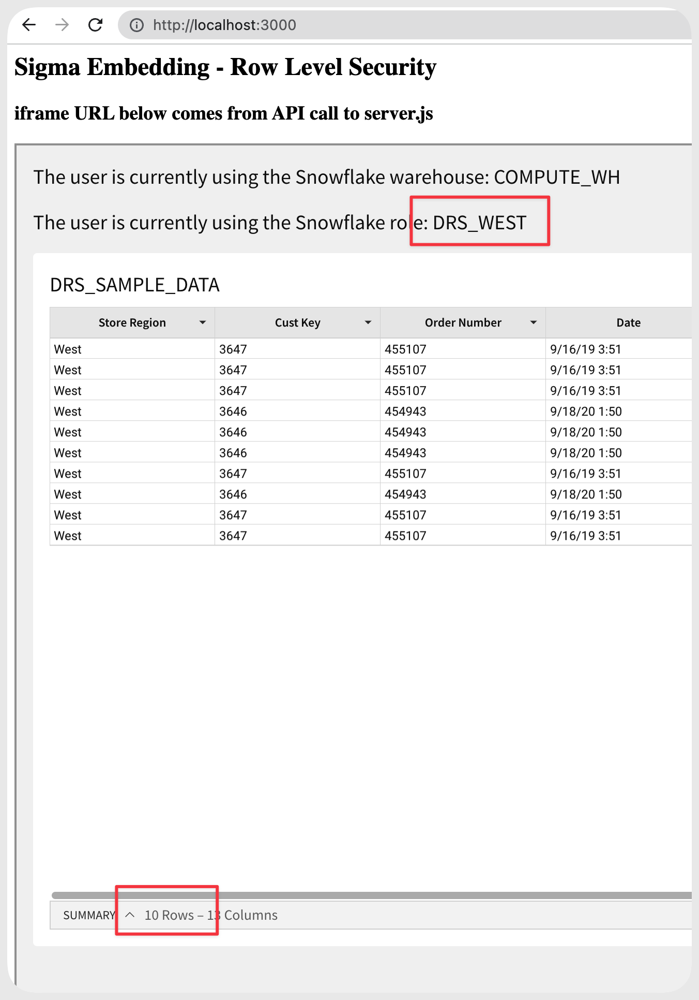

For completeness, change server.js to use the `DRS_Executive` role. We expect that will return all 35 rows including the South region rows:

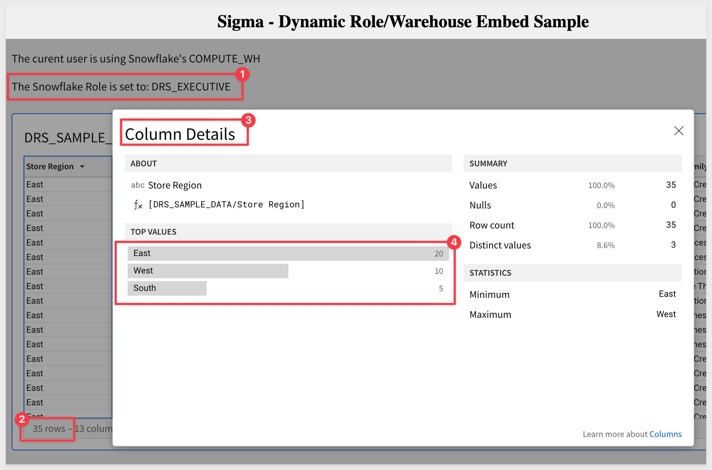


<!-- END -->

## Warehouse Switching
Duration: 5

Given we have already guided on how to configure all of this we will step through this example pretty quickly.

<aside class="postive">
<strong>IMPORTANT:</strong><br> The Warehouse attribute allows you to dynamically change the value of the warehouse based on the user role. This is beneficial because it allows you to create separate warehouses for every client and easily monitor the compute costs incurred per client.

You can also monetize this by providing separate warehouses for large customers, rather than combining small and large customers in one warehouse.
</aside>

We already created a User Attribute for Warehouse in Sigma and also created a second Warehouse in Snowflake earlier. 

We simply adjust the server.js file, item 2K to send the name of the 2nd Snowflake Warehouse to Sigma.

The change uses this code:

```plaintext
//2K: Set searchParams = (previous value in searchParams) + ua_Region:
	// NOTE: UA values are case sensitive. Multiple values can be separated by a comma. 
		 searchParams += '&:ua_DRS_WAREHOUSE=COMPUTE_WH2';
```

Save the change to server.js and refresh the Browser using localhost:3000:

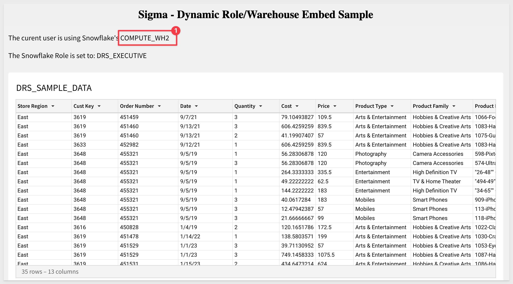


<!-- END -->

## What we've covered
Duration: 5

In this QuickStart we created Snowflake assets and a Row Access Policy and used a Sigma Dynamic Connection & Role Switching to limit the data exposed to a user based on values passed to Sigma at runtime.

<!-- THE FOLLOWING ADDITIONAL RESOURCES IS REQUIRED AS IS FOR ALL QUICKSTARTS -->
**Additional Resource Links**

Be sure to check out all the latest developments at [Sigma's First Friday Feature page!](https://quickstarts.sigmacomputing.com/firstfridayfeatures/)

[Help Center Home](https://help.sigmacomputing.com)<br>
[Sigma Community](https://community.sigmacomputing.com/)<br>
[Sigma Blog](https://www.sigmacomputing.com/blog/)<br>
<br>

[](https://twitter.com/sigmacomputing)&emsp;
[](https://www.linkedin.com/company/sigmacomputing)&emsp;
[](https://www.facebook.com/sigmacomputing)


<!-- END -->
<!-- END OF QUICKSTART -->
