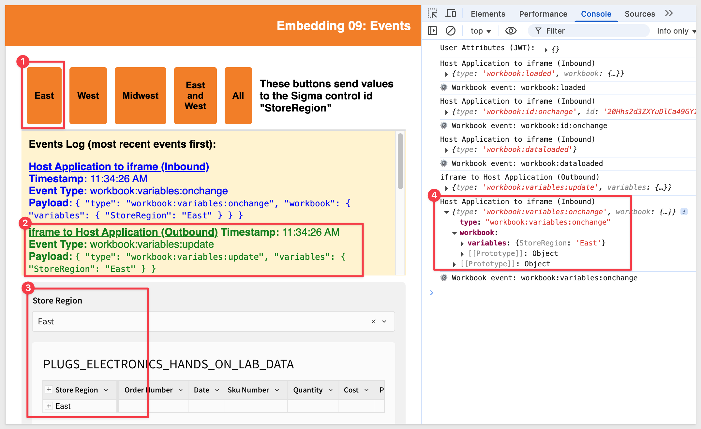
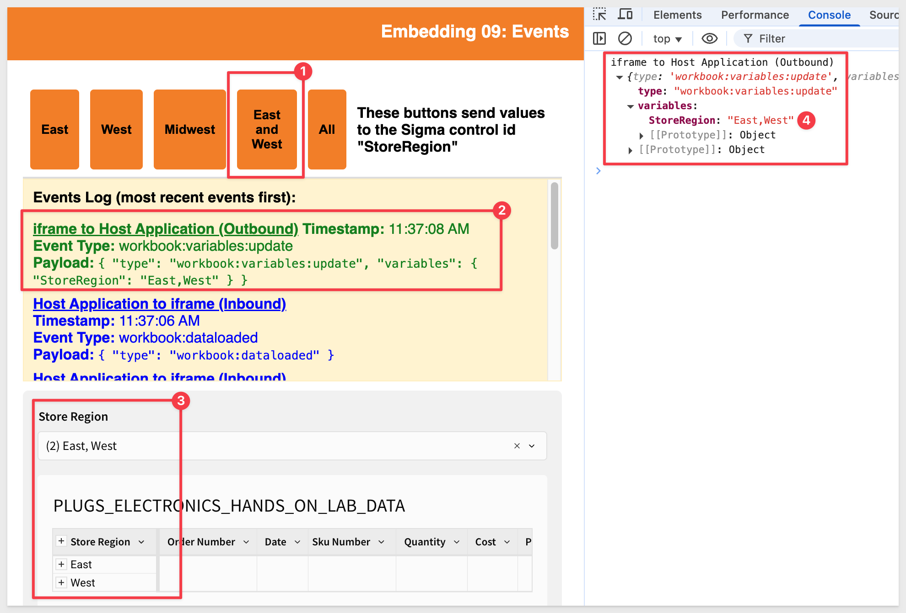

author: pballai
id: embedding_09_events_v3
summary: embedding_09_events_v3
categories: Embedding
environments: web
status: published
feedback link: https://github.com/sigmacomputing/sigmaquickstarts/issues
tags: embedding
lastUpdated: 2024-05-20

# Embedding 09: Events

## Overview 
Duration: 5 

In this QuickStart, we demonstrate how to pass variables between the native application application and Sigma. Sigma is embedded in the native application using HTML iframe. 

**Inbound Events:**<br>
These are variables sent from the native application to Sigma. **No listener needs to be coded into the iframe**. Sigma can use these messages to update control values. For example, passing a new value to a Sigma control that is used to filter table data.

Inbound events can be passed using either JavaScript or URL. 

***In general:***
<ul>
      <li>JavaScript is used when you want to pass values from the native application to the embed without causing the embed to refresh.</li>
      <li>The URL method is used at runtime, with variable values appended to the embed URL.</li>
</ul>

**Outbound Events:**<br>
These are variables sent from Sigma to the native application, which must have a listener coded to receive and respond to the message.

In this QuickStart, we will use the local native application we created in [Embedding 01: Getting Started](https://quickstarts.sigmacomputing.com/guide/embedding_03_secure_access/index.html?index=..%2F..index#0)

<aside class="positive">
<strong>IMPORTANT:</strong><br> Some screens in Sigma may appear slightly different from those shown in QuickStarts. This is because Sigma continuously adds and enhances functionality. Rest assured, Sigma’s intuitive interface ensures that any differences will not prevent you from successfully completing any QuickStart.
</aside>

For more information on Sigma's product release strategy, see [Sigma product releases](https://help.sigmacomputing.com/docs/sigma-product-releases)

If something is not working as you expect, here's how to [contact Sigma support](https://help.sigmacomputing.com/docs/sigma-support)

### Target Audience
The typical audience for this QuickStart includes users of Excel, common Business Intelligence or Reporting tools, and semi-technical users who want to try out or learn Sigma.

### Prerequisites

<ul>
  <li>A computer with a current browser. It does not matter which browser you want to use.</li>
  <li>Access to your Sigma environment.</li>
  <li>Embedding 01: Getting Started is required to complete this QuickStart.</li>
</ul>

<aside class="positive">
<strong>IMPORTANT:</strong><br> Sigma recommends using non-production resources when completing QuickStarts.
</aside>

<button>[Sigma Free Trial](https://www.sigmacomputing.com/free-trial/)</button>

<aside class="negative">
<strong>IMPORTANT:</strong><br> Some features may carry a "Beta" tag. Beta features are subject to quick, iterative changes. As a result, the latest product version may differ from the contents of this document.
</aside>
 
ooter.png)
<!-- END -->

## Sigma Workbook
Duration: 15

We will move through this quickly, as it is assumed you have done similar configurations before in the Getting Started QuickStart.

Log into Sigma as `Administrator`, create a new workbook and place a new table element on the page.

We will use the Sigma sample database to create a workbook that has one table and one control.

Set the table’s source to `PLUGS_ELECTRONICS_HANDS_ON_LAB_DATA` from the `Sigma Sample Database` > `Retail` > `Plugs Electronics` schema.

Click `Save as` and name the workbook `Embedding 09 - Events`:


Add a new `List value` control from the `Element bar` > `Control` group to the page and configure it as shown below, and set its target to the table:


<aside class="negative">
<strong>NOTE:</strong><br> Set the control's target to "StoreRegion". This ID is important because our code will reference it by name later.
</aside>

In the `Element panel` set a target for the control of `Store Region` in the `PLUGS_ELECTRONICS_HANDS_ON_LAB_DATA` table:


Group the table on `Store Region`:


Click `Publish`, then open the published version:


Copy the URL from the browser. We will use this in the next section.

<aside class="negative">
<strong>NOTE:</strong><br> Sigma supports embedding workbooks, pages, single elements or even the Ask Sigma interface.
</aside>

For more information on URL formats for JWT embedding, see [What URL to use](https://help.sigmacomputing.com/docs/create-an-embed-api-with-json-web-tokens#what-url-to-use)

<aside class="positive">
<strong>IMPORTANT:</strong><br> We must also share this workbook with the team used in the native application's JWT for the embed to work.
</aside>

Share the workbook with the `Sales_People` team we created in the `Embedding 01: Getting Started` QuickStart:


<!-- END -->

## Native Application
Duration: 5

In VSCode, open the `embedding_qs_series_2` project and edit the `.env` file.

In the `# QS: events` section, set the parameters as shown, using your own base URL:


<aside class="positive">
<strong>IMPORTANT:</strong><br> Your embed client credentials should still work if you completed the Getting Started QuickStart.
</aside>

In the VSCode Terminal, start the local web server:
```
npm start
```

In a browser, navigate to:
```
http://localhost:3000/events/?mode=events
```

We have designed this page to display an `Events Log` using JavaScript for easy testing:


Event log types are color-coded:
- **Blue:** Native Application to iframe (Inbound)
- **Green:** iframe to Native Application (Outbound)

The orange region buttons are part of the native application. Clicking any of them sends the selected region value to Sigma via the iframe.

Changing the list control inside the iframe triggers an event that is logged in the `Events Log` and can be handled by the native application for other operations too.

We can also confirm that the `Events Log` is working by using the browser's inspector while testing. 

For example, if we click the `East` button:



Conversely, if you select` West` from the list control, we can see the outbound event that matches:



<aside class="negative">
<strong>NOTE:</strong><br> We are using Chrome for this QuickStart but any browser with inspection functionality should work.
</aside>


<!-- END -->

## Event Listeners
Duration: 15

This works because we’ve added JavaScript listeners to our `index.html` page that render the embed.

These listeners allow us to log and inspect messages to and from the iframe — such as confirmation of variable updates or events like workbook loaded, element clicked, etc.

Two key code blocks handle message flow in our HTML file:

1. **Inbound events from Sigma to the iframe** are captured using a `window.addEventListener("message")` listener.
2. **Outbound events from the iframe to Sigma** are triggered via the `postMessage()` call in `setStoreRegion(region)`.

Each message is logged to the panel with a timestamp, type, payload, and directional label for clarity.

### Inbound events to the iframe
The specific code block for inbound events is:

```code
window.addEventListener("message", (event) => {
  if (event.origin !== "https://app.sigmacomputing.com") return;

  const { type } = event.data || {};
  console.log("Native Application to iframe (Inbound)", event.data);

  const logContainer = document.getElementById("event-output");
  const logItem = document.createElement("li");
  logItem.style.marginBottom = "8px";
  logItem.style.color = "blue";
  logItem.innerHTML = `
    <strong style="text-decoration: underline;">Native Application to iframe (Inbound)</strong><br/>
    <strong>Timestamp:</strong> ${new Date().toLocaleTimeString()}<br/>
    <strong>Event Type:</strong> ${type || "unknown"}<br/>
    <strong>Payload:</strong> <code>${JSON.stringify(event.data, null, 2)}</code>
  `;
  logContainer.prepend(logItem);
});
```

This block listens for messages from Sigma and logs them using the message event.

### Outbound events from the iframe
This function sends variable updates to Sigma and logs the outbound message.

```code
function setStoreRegion(region) {
  const sigma_iframe = document.getElementById("sigma-embed");
  const message = {
    type: "workbook:variables:update",
    variables: { StoreRegion: region },
  };

  if (sigma_iframe && sigma_iframe.contentWindow) {
    sigma_iframe.contentWindow.postMessage(
      message,
      "https://app.sigmacomputing.com"
    );
    console.log("iframe to Native Application (Outbound)", message);

    const logContainer = document.getElementById("event-output");
    const logItem = document.createElement("li");
    logItem.style.marginBottom = "8px";
    logItem.style.color = "green";
    logItem.innerHTML = `
      <strong style="text-decoration: underline;">iframe to Native Application (Outbound)</strong><br/>
      <strong>Timestamp:</strong> ${new Date().toLocaleTimeString()}<br/>
      <strong>Event Type:</strong> ${message.type}<br/>
      <strong>Payload:</strong> <code>${JSON.stringify(message, null, 2)}</code>
    `;
    logContainer.prepend(logItem);
  }
}
```

Here is an explanation of the first command:


The second command sends a new value for the variable called “StoreRegion” to the Sigma iframe using the JavaScript postmessage method. PostMessage() is a global method that safely enables cross-origin communication. It’s a lot like Ajax, but with cross-domain capability (i.e., communication between two websites).

Here is an explanation of the second command:


```plaintext
sigma_iframe.contentWindow.postMessage({type:"workbook:variables:update", variables: {StoreRegion: "West"},}, 'https://app.sigmacomputing.com',);
```


<!-- END -->

## What we've covered
Duration: 5

In this QuickStart, we explored inbound and outbound event handling for Sigma embeds, demonstrating how to exchange messages between the native application and Sigma using HTML and JavaScript.

<!-- THE FOLLOWING ADDITIONAL RESOURCES IS REQUIRED AS IS FOR ALL QUICKSTARTS -->
**Additional Resource Links**

Be sure to check out all the latest developments at [Sigma's First Friday Feature page!](https://quickstarts.sigmacomputing.com/firstfridayfeatures/)

[Help Center Home](https://help.sigmacomputing.com)<br>
[Sigma Community](https://community.sigmacomputing.com/)<br>
[Sigma Blog](https://www.sigmacomputing.com/blog/)<br>
<br>

[](https://twitter.com/sigmacomputing)&emsp;
[](https://www.linkedin.com/company/sigmacomputing)&emsp;
[](https://www.facebook.com/sigmacomputing)


<!-- END OF WHAT WE COVERED -->
<!-- END OF QUICKSTART -->

