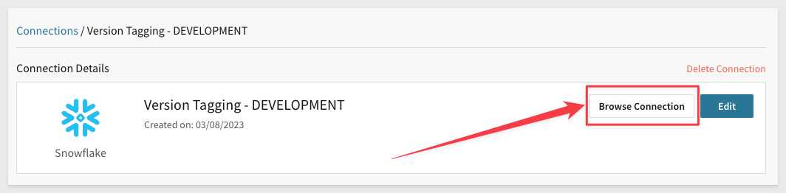
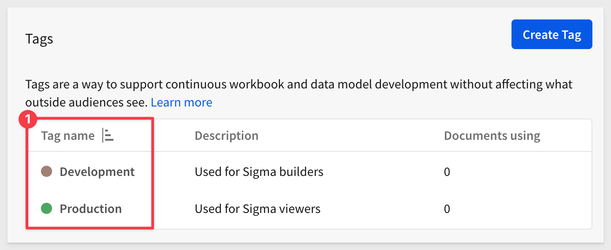
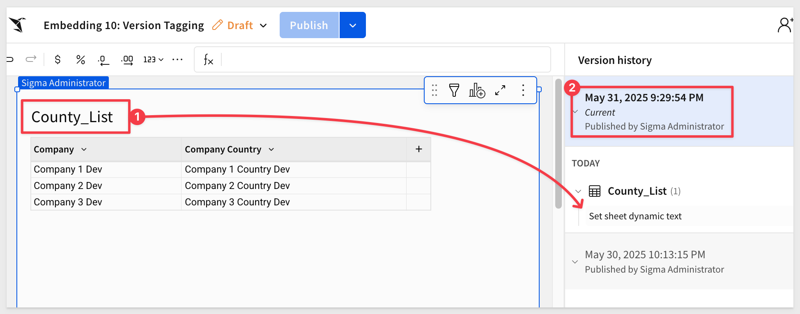
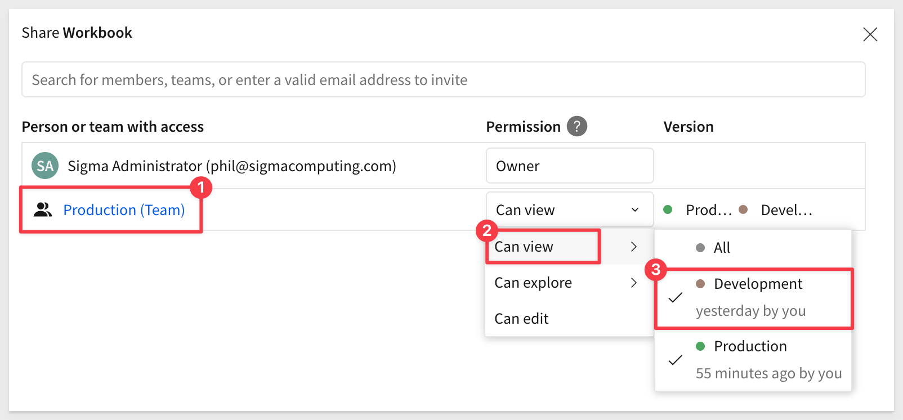

author: pballai
id: embedding_10_version_tagging_v3
summary: embedding_10_version_tagging_v3
categories: embedding
environments: web
status: Published
feedback link: https://github.com/sigmacomputing/sigmaquickstarts/issues
tags: default
lastUpdated: 2025-05-30

# Embedding 10: Version Tagging

## Overview 
Duration: 5 

This QuickStart introduces you to Version Tagging in a Sigma embedded environment to manage promotion of workbooks via third-party CI/CD tools. Examples of popular Continuous Integration / Continuous Development (CI/CD) tools include GitLab, Jenkins, Circle CI, Bamboo and many others.

Version tagging allows you to employ a software development lifecycle to control workbook versions, using tags. For example, Sigma can have development, staging, and production versions of a workbook and migrate changes as needed. This allows you to control which workbook versions are available to your users. 

When you create a tag and assign it to a workbook, you essentially **freeze the state of that workbook**. The process of tagging a workbook creates a duplicate that can be shared with other stakeholders and users.  

For example, you can create a "Production" tag and assign it to a workbook that is used by embed users. Moreover, you can tag additional versions of the same workbook such as "Development" or "Staging". These versions can be used by different stakeholders in your company for various purposes. Once reviewed, you can migrate this copy to production for your users via the CI/CD tool of your choice.

The tagging design is flexible but at a high level, this is the workflow involved:


<aside class="positive">
<strong>IMPORTANT:</strong><br> One of the benefits of tagging is your company can modify a "Development" workbook without affecting the experience of your customers who use the "Production" version. Once you complete your developmental changes, you can easily update the "Production" version of the workbook by incrementing the workbook version number that the tag is using.
</aside> 

In this QuickStart, we will demonstrate using Postman to simulate a CI/CD workflow and make manual edits to our local host application to evaluate the results of our API calls. In this way, we can demonstrate how a customer application using source control and pipelines could be used to make the same workflow work without asking the QuickStart user to create an excess amount of setup to become familiar with the tag workflow in Sigma. 

**Some steps may not be shown in detail as we assume you have completed any prerequisites and are familiar with Sigma workflows.**

In this QuickStart, we will use the local host application we created in [Embedding 01: Getting Started](https://quickstarts.sigmacomputing.com/guide/embedding_01_getting_started_v3/index.html?index=..%2F..embedding#0)

<aside class="positive">
<strong>IMPORTANT:</strong><br> Some screens in Sigma may appear slightly different from those shown in QuickStarts. This is because Sigma continuously adds and enhances functionality. Rest assured, Sigma’s intuitive interface ensures that any differences will not prevent you from successfully completing any QuickStart.
</aside>

For more information on Sigma's product release strategy, see [Sigma product releases](https://help.sigmacomputing.com/docs/sigma-product-releases)

If something is not working as you expect, here's how to [contact Sigma support](https://help.sigmacomputing.com/docs/sigma-support)

### Target Audience
Semi-technical users who will be aiding in the planning or implementation of Sigma with embedding. No SQL or data engineering skills are needed to complete this QuickStart. It does assume some common computer skills like installing software, using Terminal, navigating folders and copy/paste operations.

### Prerequisites

<ul>
  <li>A computer with a current browser. It does not matter which browser you want to use.</li>
  <li>Access to your Sigma environment.</li>
  <li>Embedding 01: Getting Started is required to complete this QuickStart.</li>
  <li>A Snowflake account with the proper administrative and security admin access for our use case data.</li>
  <li>Completion of the QuickStart, "Sigma API with Postman" or an API tool that you use instead.</li>
</ul>

<aside class="negative">
<strong>IMPORTANT:</strong><br> Some features may carry a "Beta" tag. Beta features are subject to quick, iterative changes. As a result, the latest product version may differ from the contents of this document.
</aside>

<aside class="postive">
<strong>IMPORTANT:</strong><br> Sigma recommends that you do not use production resources when doing QuickStarts.
</aside>

<button>[Sigma Free Trial](https://www.sigmacomputing.com/free-trial/)</button> <button>[Snowflake Free Trial](https://signup.snowflake.com/)</button> <button>[Login or Sign Up to Postman](https://identity.getpostman.com/login)</button> 


<!-- END OF OVERVIEW -->

## Create Sample Snowflake Environment
Duration: 10

We will need to create three schemas in Snowflake, each containing the same tables, with names and data adjusted to reflect the schema name. 

We’ve provided a Snowflake script to help you set this up.

<aside class="negative"><strong>NOTE:</strong><br> The remainder of this QuickStart will reference these tables as our workbook is promoted from development to to production.</aside>

```code
USE ROLE ACCOUNTADMIN;
USE WAREHOUSE COMPUTE_WH;

// 1: CREATE OR REPLACE DATABASE AND SET IT TO CURRENT
CREATE OR REPLACE DATABASE QUICKSTARTS;
USE DATABASE QUICKSTARTS;

// 2: CREATE SCHEMAS
CREATE SCHEMA IF NOT EXISTS VT_DEV;
CREATE SCHEMA IF NOT EXISTS VT_PROD;

// 3: CREATE AND LOAD DEV TABLES
USE SCHEMA VT_DEV;
CREATE OR REPLACE TABLE VT_DEV.company (company varchar);
CREATE OR REPLACE TABLE VT_DEV.company_country (company varchar, company_country varchar);
insert into vt_dev.company values ('Company 1 Dev');
insert into vt_dev.company values ('Company 2 Dev');
insert into vt_dev.company values ('Company 3 Dev');
insert into vt_dev.company_country values ('Company 1 Dev', 'Company 1 Country Dev');
insert into vt_dev.company_country values ('Company 2 Dev', 'Company 2 Country Dev');
insert into vt_dev.company_country values ('Company 3 Dev', 'Company 3 Country Dev');

// 4: CREATE AND LOAD PROD TABLES
USE SCHEMA VT_PROD;
CREATE OR REPLACE TABLE VT_PROD.company (company varchar);
CREATE OR REPLACE TABLE VT_PROD.company_country (company varchar, company_country varchar);
insert into vt_prod.company values ('Company 1 Prod');
insert into vt_prod.company values ('Company 2 Prod');
insert into vt_prod.company values ('Company 3 Prod');
insert into vt_prod.company_country values ('Company 1 Prod', 'Company 1 Country Prod');
insert into vt_prod.company_country values ('Company 2 Prod', 'Company 2 Country Prod');
insert into vt_prod.company_country values ('Company 3 Prod', 'Company 3 Country Prod');

// 6: CREATE ROLES FOR OUR USE CASES:
CREATE OR REPLACE ROLE VT_DEV;
CREATE OR REPLACE ROLE VT_PROD;

// 7: GRANT USAGE PERMISSION ON THE DATABASE TO NEW ROLES:
GRANT USAGE ON DATABASE QUICKSTARTS TO VT_DEV;
GRANT USAGE ON DATABASE QUICKSTARTS TO VT_PROD;

// 8: GRANT SELECT ON SCHEMA TO NEW ROLES:
GRANT USAGE ON SCHEMA QUICKSTARTS.VT_DEV TO VT_DEV;
GRANT USAGE ON SCHEMA QUICKSTARTS.VT_PROD TO VT_PROD;

// 9: ALLOW NEW ROLES TO QUERY TABLE WE CREATED:
GRANT SELECT ON ALL TABLES IN SCHEMA QUICKSTARTS.VT_DEV TO ROLE VT_DEV;
GRANT SELECT ON ALL TABLES IN SCHEMA QUICKSTARTS.VT_PROD TO ROLE VT_PROD;

// 10: CREATE USERS FOR EACH ROLE
CREATE OR REPLACE USER vtag_dev PASSWORD='Dev99!' MUST_CHANGE_PASSWORD = FALSE;
GRANT ROLE VT_DEV TO USER vtag_dev;

CREATE OR REPLACE  USER vtag_prod PASSWORD='Prod99!' DEFAULT_ROLE = VT_PROD MUST_CHANGE_PASSWORD = FALSE;
GRANT ROLE VT_PROD TO USER vtag_prod;

//11: GRANT WAREHOUSE USAGE TO NEW ROLES:
GRANT USAGE ON WAREHOUSE COMPUTE_WH TO ROLE VT_DEV;
GRANT USAGE ON WAREHOUSE COMPUTE_WH TO ROLE VT_PROD;
```

Once the script completes Snowflake will return `Statement executed successfully.` 

We verified that the data exists by running the following query for each schema:

```code
select * from vt_dev.company_country;
select * from vt_prod.company_country;
```

For example, for production, we see `Prod` appended to the row data:


<!-- END OF SECTION-->

## Sigma Connections
Duration: 10

In this use case, we’ll use two separate connections to the same Snowflake account.

Log into Sigma as an Administrator and head to the `Administration` / `Connections` page.

Click `Create Connection`, select `Snowflake` and fill out the form.

The values for `User`, `Password`, and `Role` were defined in our Snowflake script as:
```
Connection Name:                  User:           Password:       Role:
Version Tagging - Development     vtag_dev        Dev99!          VT_DEV       
Version Tagging - Production      vtag_prod       Prod99!         VT_PROD
```
Use your Snowflake `ACCOUNT IDENTIFIER` for `Account`.

Authentication is `Basic Auth`.

For `Warehouse` use `COMPUTE_WH`.


Click `Save`, and Sigma will validate the connection. 

<aside class="positive">
<strong>IMPORTANT:</strong><br> At the time of this QuickStart Snowflake announced that they will require key pair authentication for service users starting in November 2025. This will be a mandatory requirement, and single-factor password authentication will no longer be supported. This change is part of Snowflake's broader initiative to enhance security and enforce multi-factor authentication (MFA) for all users. 
</aside>

To learn how to set up key-pair authentication in Sigma, see [Snowflake Key-pair Authorization](https://quickstarts.sigmacomputing.com/guide/security_snowflake_keypair_rotation/index.html?index=..%2F..index#0)


Before we add the other two connections (Staging and Prod), let's take a moment to ensure the Dev data is fully reachable.

In the new connection, click the `Browse Connection` button:



Verify that you can see table data for the `Company` and `Company Country` tables.

<aside class="negative">
<strong>NOTE:</strong><br> You may need to sync the connection using the icon as shown in the screenshot.
</aside>


Now repeat the process, adding new connections for `Staging` and `Prod`. Be sure to use the correct `User` and `Role` for each accordingly.

You should now have two working connections. The main difference is the table data for each.


<!-- END OF SECTION-->

## Sigma Tags
Duration: 5

Navigate to the `Administration` / `Tags` page.

Click `Create Tag` to add a new tag.

Set the name to Development. (Pick any color you prefer — it won’t affect this example).

<aside class="positive">
<strong>IMPORTANT:</strong><br> How you name tags is entirely up to you. The draft/published state of a new workbook is technically a development version but this QuickStart aims to show that you control the workflow. If you prefer, you could just use the draft/published state as development and only have a "QA" and "Production" tags.
</aside>


To read more about tags, see [Create and manage version tags](https://help.sigmacomputing.com/docs/create-and-manage-version-tags)

Repeat the process to add a `Production` tag. You should now have two tags:



<aside class="negative">
<strong>NOTE:</strong><br> To access a tagged workbook, users must be granted access or be the workbook’s owner.
</aside>


<!-- END OF SECTION-->

## Sigma Workbook
Duration: 5

Create a new workbook, use the `Element bar` to add a `Data` > `Table` element to the page. For the source, select the `Version Tagging - DEVELOPMENT` connection.

Select the `Sigma_VT` > `Company_Country` table:


Click the `Save As` button and name the workbook `Embedding 10: Version Tagging`.

Notice that the rows in the table contain the word `Dev` appended to each value. This is what we would expect given we are using the `Development Connection`.


Open the workbook menu and select `Version` > `Version history`:


This opens a sidebar showing all changes made that have been made as the workbook has been updated. 

In this case, we are on `VERSION 1`:


Click the top entry in `Version History` and note the version number at the end of the URL. 

Also note the string next to #3 — this is the workbook GUID. It is useful to know this when using the REST API manually:


Click the `Go to latest version` button and then click `Edit`.

Change the table title to `County_List`, hit `Enter` and then `Publish`.

Sigma recorded that change and then another change when we published it:



Sigma also incremented the version from v1 to v2. 


We will reference version number 2 in our API call later when we promote to production.

### Add a New Sigma Team
Since we have a `Production` tag, we want to add a new `Team` in Sigma to allow an embed user access to the workbook in the host application, instead of reviewing it in the Sigma UI. 

Create a new team called `Production`:


<aside class="positive">
<strong>IMPORTANT:</strong><br> Sigma is flexible enough to allow customers to decide how many steps make up a tagging workflow and who has permission to specific features along the way.
</aside>

### Tag the workbook
Return to the `Embedding 10: Version Tagging` workbook.

Open the workbook menu and select `Versions` > `Tag this version...`:


Set the tag for this workbook as shown below:


We do not need to swap data sources right now as we are already using the `Development` data when we created the workbook.

Before we get into the promotion workflow, we need to make sure that our parent application with the Sigma embed is working. 

Finally, copy the URL from your browser and store it in a text file — we’ll use it later.


<!-- END OF SECTION-->

## Host Application Setup
Duration: 10

In the QuickStart "Embedding 01: Getting Started", we deployed a native application locally.

For testing, we’ll use the pre-built embed page that demonstrates this approach.

In VSCode, open a new Terminal session inside the `embedding_qs_series` project and run the following command:

```code
npm start
```


Now edit the `.env` file to update a few values.

The `CLIENT_ID` and `SECRET` values from the Getting Started QuickStart should still be present and working. If they’re missing or misconfigured, revisit the Getting Started QuickStart to complete that step.

In the `# QS: version_tagging` section, we need to configure the values below, using the URL saved earlier for the `VERSION_TAGGING_BASE_URL=` value.

Use only the required portion of the URL, as explained in the documentation, [What URL to use](https://help.sigmacomputing.com/docs/create-an-embed-api-with-json-web-tokens#what-url-to-use)

For example, in our URL we removed the trailing section composed of this:
```code 
?:nodeId=RWw-kr3_UG
```

This is the section that needs the URL:
```code
VERSION_TAGGING_BASE_URL=
VERSION_TAGGING_BASE_EMAIL=sales_person@example.com
VERSION_TAGGING_BASE_ACCOUNT_TYPE=View
VERSION_TAGGING_BASE_TEAMS=Production
```

Save the `.env` file.

In a browser, open:
```code
http://localhost:3000/version_tagging/?mode=version_tagging
```


We should get an error `You don't have permission to access this page.`.

This is because the embedded workbook has not been shared to our `Production` team yet and we don't have a `Development` team either. This is the expected result.

At this point we could share the workbook with the `Production` team but it still won't render as the embedded workbook is assigned the `Development` version anyway. 

What we want to do is promote the workbook to `Production`, ensure that it is using the production Snowflake data and pass the pass the `Production` tag using the .env file at runtime.

Do not share the workbook just yet. We need to promote the workbook to `Production` first, so it becomes available to share with the Production team.


<!-- END OF SECTION-->

## Promote to Production
Duration: 20

In this section, we we'll use a combination of REST API calls and one edit to `embed-api.js` simulating a CI/CD workflow promotion to production.

We will demonstrate this using Postman, which many developers are already familiar with.

<aside class="positive">
<strong>NOTE:</strong><br> It is assumed that the manual REST calls and JSON editing steps shown here would be automated with a CI/CD tool and source repository of choice.
</aside>

<aside class="negative">
<strong>NOTE:</strong><br> Some steps using Postman will not be shown in detail as these were covered in the QuickStart, "Sigma API with Postman". You can use any REST tool. You may also use the Sigma API Swagger or curl commands if you are more comfortable doing that.
</aside>

<button>[Sigma swagger page](https://docs.sigmacomputing.com/#overview)</button>

In order to use the Sigma API, we must first get a new bearer token. Follow the instructions in the [Sigma API with Postman](https://quickstarts.sigmacomputing.com/guide/sigma_api_with_postman/index.html?index=..%2F..index#0) QuickStart.

We will use the API to tag the workbook with with updated values for the `Production` tag, workbook version, production connection, and production path.

This will create a new copy of the workbook (as a tagged version). The original state of the workbook is also retained if we want to roll back to it later.

<aside class="negative">
<strong>REMINDER:</strong><br> The workbook in Sigma's UI is currently showing data from the development connection.
</aside>

First, we need to use the REST API to obtain the required references. We will need to obtain the following unique identifiers:

 <ul>
      <li>workbookUrlId</li>
      <li>Development connection</li>
      <li>Development path</li>
      <li>Production connection</li>
</ul>

We will use these values to update the Sigma workbook (in json format) using a REST POST message.

Using a text editor (to temporarily hold the JSON) update each value that you obtain from the Postman calls. 

**Sample POST body for workbook tag update:**
```code
{
    "workbookId": "6DceMEz0RArq6F82wa02ha", 
    "workbookVersion": 2, 
    "tag": "Production",
    "grantSourceAccess": true,
    "sourceMappingConfig": [
      {
        "fromConnectionId": "b44fef40-b1b3-4059-b530-7e3eac51e712",
        "toConnectionId": "0c750f29-607b-4437-a824-d287431f69e8",
        "paths": [{ "fromPath": ["SIGMA_VT", "VT_DEV", "COMPANY_COUNTRY"], "toPath": ["SIGMA_VT", "PROD", "COMPANY_COUNTRY"] }]
      }
    ],
    "sourceVersions": {}
  } 
```

<aside class="negative">
<strong>NOTE:</strong><br> Values for paths may be different depending on if you created different schema in Snowflake than what was provided in this QuickStart.
</aside>

Open Postman and use the `Authenticate` method to get a bearer token:


Open the request named `Returns a workbook based on workbookId` in the `workbooks` folder. This will get the list of all workbooks. 

Click `Send` and locate the workbook named `Embedding 10: Version Tagging` in the return:


Note the workbook's `sourceWorkbookVersion` value. This is the version number for the workbook and we want to carry that forward when we promote.

Copy its `workbookUrlId` value and update the JSON sample for `workbookId`.

We now need to get the GUIDs for the development and production Sigma connections using the method `Returns a list of available connections`:

Copy the two GUIDs (one for development and another for production) from the return and update the json code. 

For example, for development, we searched for and found:


Use the values to update the sample POST body workbook tag update values. For example:
```code
{
    "workbookId": "5P9Mtgt6Mq10NE6p599BeM", 
    "workbookVersion": 2, 
    "tag": "Production",
    "grantSourceAccess": true,
    "sourceMappingConfig": [
      {
        "fromConnectionId": "309d9b74-28a2-4e84-a04a-0c3543d8885c",
        "toConnectionId": "4f841df6-d307-496a-8742-cadd2e1baa6c",
        "paths": [{ "fromPath": ["SIGMA_VT", "VT_DEV", "COMPANY_COUNTRY"], "toPath": ["SIGMA_VT", "VT_PROD", "COMPANY_COUNTRY"] }]
      }
    ],
    "sourceVersions": {}
  } 
```

### Promote
Open the `Tag a workbook` method and revise the `Body` with the adjusted values:


Click `Send` to submit the API request. A `200 Statu`s should be returned. The API should return with a `200 Status`.

We have now tagged the workbook to `Production` and a `taggedWorkbookVersion = 1`:


Returning the Sigma workbook (and refreshing the page), we can see the workbook was tagged `Production` in its `Version history`:


This was done by the API call we made.

### Share with team
Share the workbook with the `Production` team. You can grant the `Production` team different levels of permission and also the ability to access one or more workbook tags too.

We will limit the team to just `View` and the `Production` tag:


### Revise .env
Append `/tag/Production` to the value of `VERSION_TAGGING_BASE_URL` and `VERSION_TAGGING_TEAMS` to `Production`:


Save the changes.

<aside class="positive"> <strong>NOTE:</strong><br> In this QuickStart, the `tag/Development` or `tag/Production` path was hardcoded in the `.env` file and used directly in the embed URL to simplify the demonstration. In a production CI/CD workflow, this value would typically be set dynamically based on runtime parameters, such as environment variables, pipeline stage, or request context from the host application. </aside>

Refresh the sample host application page.

You should now see the table using the production connection’s data:


### Reverting from production to development

To revert, rerun the `Tag a workbook` API call, changing the tag to `Development` and flipping the values as shown:


Next, adjust `.env` for development, setting the value for `VERSION_TAGGING_BASE_URL` to have `/tag/Development` appended to it.

Save the changes.

However, when we refresh the host application, we still see the production data. This is because the `Production` team is not permitted to see the `Development` tag. 

Enable the `Production` team to access the `Development` tag:



<aside class="negative">
<strong>NOTE:</strong><br> Demonstration purposes only. In practice, production users would not see development data. 
</aside>

You should now see the development data shared with the `Production` team:


<!-- END OF SECTION-->

## What we've covered
Duration: 5

In this QuickStart, we reviewed how to use Sigma's Version Tagging to manually manage a CI/CD workflow that promotes or demotes a workbook while updating the underlying data shown to the embedded user.

**Additional Resource Links**

[Blog](https://www.sigmacomputing.com/blog/)<br>
[Community](https://community.sigmacomputing.com/)<br>
[Help Center](https://help.sigmacomputing.com/hc/en-us)<br>
[QuickStarts](https://quickstarts.sigmacomputing.com/)<br>

Be sure to check out all the latest developments at [Sigma's First Friday Feature page!](https://quickstarts.sigmacomputing.com/firstfridayfeatures/)
<br>

[](https://twitter.com/sigmacomputing)&emsp;
[](https://www.linkedin.com/company/sigmacomputing)&emsp;
[](https://www.facebook.com/sigmacomputing)


<!-- END OF WHAT WE COVERED -->
<!-- END OF QUICKSTART -->


<!-- END OF QUICKSTART -->
