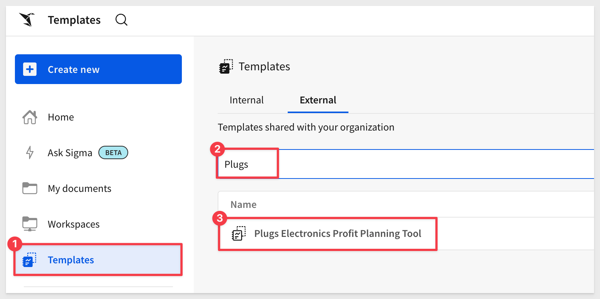
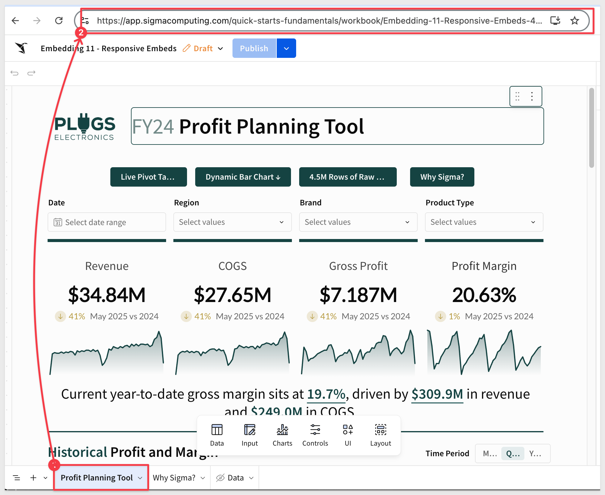

author: pballai
id: embedding_11_responsive_embeds_v3
summary: embedding_11_responsive_embeds_v3
categories: Embedding
environments: web
status: published
feedback link: https://github.com/sigmacomputing/sigmaquickstarts/issues
tags: default
lastUpdated: 2025-05-20

# Embedding 11 Responsive Embeds

## Overview 
Duration: 5 

One of the many challenges developers face when building applications is usability, and a common problem is making it obvious that a user needs to scroll to see more data.

This problem can be compounded when embedding content from any external application; even Sigma embeds. 

Scroll bars on both parent and iframe content can significantly impact the user experience, often in a negative way. Here's why:

<ul>
      <li><strong>Confusion and difficulty navigating:</strong> When both the parent page and the iframe have scroll bars, it can be confusing for the user to navigate. They may not immediately recognize which scroll bar is active, leading to a disjointed and potentially frustrating experience.</li>
      <li><strong>Nested scrolling:</strong> If the iframe content is longer than the parent page's height, users might have to deal with nested scrolling. This means they have to scroll down within the iframe before being able to continue scrolling on the parent page. This is generally considered poor user experience design and can be very frustrating.</li>
      <li><strong>Aesthetically unpleasing:</strong> Multiple scroll bars can make the page look cluttered and messy, which can detract from the overall aesthetic of the website.</li>
      <li><strong>Limited view of content:</strong> If an iframe has a scroll bar, it means that all the content isn't immediately visible to the user. This might cause users to miss important information if they don't realize they need to scroll within the iframe.</li>
      <li><strong>Mobile unfriendly:</strong> On mobile devices, where screen real estate is limited, scroll bars within iframes can be particularly problematic. Users may accidentally scroll within the iframe when they intended to scroll on the parent page, or vice versa.</li>
</ul>

To avoid these issues, it's generally best to avoid having scroll bars on both the parent and the iframed content. This can usually be solved by making by making both the iframe and parent page responsive, so that the iframe adjusts its size based on the content it contains and the size of the viewport.

 <ul>
      <li><strong>Better user experience:</strong> A responsive iframe ensures that the content within the iframe is displayed correctly regardless of the size of the user's device or browser window. This is particularly important for users on mobile devices or tablets, as it allows the iframe content to resize and fit the smaller screen sizes.</li>
      <li><strong>Consistency across devices:</strong> Since different users may be accessing the content on different devices (desktops, laptops, tablets, phones), it's important that the content looks good on all of these devices. A responsive iframe will resize based on the size of the user's device or browser window, ensuring that the content is always displayed in a user-friendly manner.</li>
      <li><strong>Keeping up with modern web standards:</strong> As of the current web standards, responsiveness is a key factor in web design and development. It's almost expected that any web page or web application be responsive to provide the best user experience.</li>
</ul>

In essence, making an iframe dynamic or responsive is about ensuring that the content within the iframe is accessible, user-friendly, and looks good on all devices and window sizes. It's about creating a better, more consistent user experience.

Since Sigma uses iframes for embedding, this issue is fairly easy to avoid.

In this QuickStart, we will use the local host application we created in [Embedding 01: Getting Started](https://quickstarts.sigmacomputing.com/guide/embedding_03_secure_access/index.html?index=..%2F..index#0)

<aside class="positive">
<strong>IMPORTANT:</strong><br> Some screens in Sigma may appear slightly different from those shown in QuickStarts. This is because Sigma continuously adds and enhances functionality. Rest assured, Sigma’s intuitive interface ensures that any differences will not prevent you from successfully completing any QuickStart.
</aside>

For more information on Sigma's product release strategy, see [Sigma product releases](https://help.sigmacomputing.com/docs/sigma-product-releases)

If something is not working as you expect, here's how to [contact Sigma support](https://help.sigmacomputing.com/docs/sigma-support)

### Target Audience
Semi-technical users who will be aiding in the planning or implementation of Sigma with embedding. No SQL or technical data skills are needed to complete this QuickStart. It does assume some common computer skills like installing software, using Terminal, navigating folders and copy/paste operations.

### Prerequisites

<ul>
  <li>A computer with a current browser. It does not matter which browser you want to use.</li>
  <li>Access to your Sigma environment.</li>
  <li>Embedding 01: Getting Started is required to complete this QuickStart.</li>
</ul>

<aside class="positive">
<strong>IMPORTANT:</strong><br> Sigma recommends using non-production resources when completing QuickStarts.
</aside>

<button>[Sigma Free Trial](https://www.sigmacomputing.com/free-trial/)</button>

<aside class="negative">
<strong>IMPORTANT:</strong><br> Some features may carry a "Beta" tag. Beta features are subject to quick, iterative changes. As a result, the latest product version may differ from the contents of this document.
</aside>
 


## Content to Embed
Duration: 5

Before we can dig into this topic, we need to configure an embed for our host application to use. 

We’ll use one of the prebuilt templates included in all Sigma instances.

After logging into Sigma, navigate to `Templates` and click the `Plugs Electronics Profit Planning Tool` example to open that template:



Click `Save As` and name the workbook `Embedding 11 Responsive Embeds`.

<aside class="positive">
<strong>IMPORTANT:</strong><br> Saving a workbook also publishes it automatically. A workbook must be published before it is embedded.
</aside>



Make sure the workbook is in `published` mode.

Share the workbook with the `Sales_People` team we created in the Getting Started QuickStart:


Click on the `Profit Planning Tool` page tab and copy the URL directly from the browser.

Because we selected a page tab, we’ll need to adjust the URL slightly as documented in [What URL to use](https://help.sigmacomputing.com/docs/create-an-embed-api-with-json-web-tokens#what-url-to-use1)

The correct URL syntax for a page is:

https://app.sigmacomputing.com/{organization-slug}/workbook/{workbookname}-{workbookUrlId}/page/{pageId}

<aside class="note"><strong>TIP:</strong><br>If you're unsure which part of the URL to replace, paste it into a text editor first and compare it to the expected format above. The `pageId` comes directly from the `?:nodeId=` query parameter.</aside>

The key item to replace is:
- ?:nodeId with /page/
- The pageId is the same value as shown for nodeId

Use this adjusted URL as the value for `RESPONSIVE_EMBEDS_BASE_URL` in your .env file, then save your changes.

We also set the other parameters to the same values used in Getting Started and confirmed we still have values for `CLIENT_ID` and `SECRET`:


Open a new Terminal in VSCode, navigate to the `embedding_qs_series_2` directory, and start the Express web server by running:

```code
npm start
```

Open `http://localhost:3000/responsive_embeds/2bars.html` in a browser:

The page will load the embedded content along with the `.env` parameters that are being used.

Notice that both the browser and the iframe have scroll bars:


<!-- END -->

## A Quick (partial) Solution
Duration: 20

Since we are embedding content that is created in Sigma, it is not always possible to ensure that the Sigma content will "fit" inside a static iframes dimensions, since the content may vary depending on use-case.

Without control over the iframe's content, it's challenging to have a fully dynamic solution that adjusts to the exact height of the content every time.

Given the initial constraint, one approach might be to:

1: Set a default height for the iframe that should ideally fit most of the content you expect to embed.

2: Allow the iframe to scroll if its content exceeds this default height.

**This ensures that:**

1: The parent application remains without a scrollbar, providing a cleaner overall look.

2: The iframe will only show a scrollbar when absolutely necessary (i.e., when its content exceeds its set height).

This approach provides somewhat of a balance between user experience and practicality, given the constraints, but does not fully address the issue of scroll bars.

In this scenario, even when the browser is full screen, the embedded content we have elected to provide from Sigma will be too long, and thus the iframe requires a scroll bar. 

The parent page, however, should still avoid having a scroll bar.

For this example, we will simply allow the iframe to scroll, but ensure the parent page does not. 

Open this page in the browser:
```code
http://localhost:3000/responsive_embeds/1bar.html
```

Now we only have one scroll bar (in the embed) and the parent application does not present a scroll bar regardless of how we resize the browser:
 


The is because we replaced two css styles and adjusted the iframe too.

The CSS adjustments made are:

```code
body {
  display: flex;                     /* Uses Flexbox for vertical layout */
  flex-direction: column;           /* Stacks children vertically (top to bottom) */
  height: 100vh;                    /* Sets the body height to 100% of the viewport */
  margin: 0;                        /* Removes default body margin (prevents scroll gap) */
  font-family: sans-serif;         /* Applies a clean, readable font */
}

iframe {
  width: 100%;                      /* Makes the iframe fill the full horizontal space */
  height: 100%;                     /* Makes the iframe fill the full height of its container */
  border: none;                    /* Removes default iframe border */
  border-radius: 6px;              /* Applies rounded corners to the iframe */
}
```

The iframe adjustment made is:

```code
<iframe id="sigma-embed" src=""></iframe>
```


<!-- END OF SECTION-->

## Alternative Method
Duration: 20

The `calc()` function in CSS can be used to dynamically compute values for various properties. This method is ideal when your page has a fixed-height topbar and you want the iframe to fill the rest of the viewport without causing scrollbars.

While `calc()` can be powerful in many scenarios, it's important to understand its limitations and its applicability to your specific case.

In our example, the `calc()` function can be used to compute dimensions based on various units, combinations of units, or viewport sizes.

For example, if we want the iframe to take up the full viewport height minus some space for a header, we could use `calc()`.

Here's how we might style the iframe using `calc()`:

```code
iframe {
  width: 100%;
  height: calc(100vh - 4rem); /* Adjusts for fixed header height */
  border: none;
  border-radius: 6px;
}
```

When we use `height: calc(100vh - 4rem)` on the iframe, we’re telling it to take up the entire remaining viewport height beneath the header. That eliminates the need for the page itself to scroll, as long as:

- The body has no extra vertical content
- The iframe content itself is sized/responsive correctly inside the Sigma workbook

To save time, we’ve pre-built a page that demonstrates this method.

Browse to this URL:
```code
http://localhost:3000/responsive_embeds/1bar.html
```


### A Few Things to Note:

 <ul>
      <li><strong>Content Size Unknown:</strong> The challenge with our iframe is that, since we may not control its content, we don't know its exact height. calc() helps with relative dimensions based on the viewport or other elements, but it can't determine the height of content inside an iframe from an external source.</li>
      <li><strong>Doesn't Eliminate Scroll:</strong> Using calc() in this manner doesn't eliminate the need for a scrollbar if the content inside the iframe exceeds its height. It just helps in setting the iframe's height relative to other known dimensions.</li>
      <li><strong>Complementary to Other CSS:</strong> calc() isn’t a replacement for other CSS tools—it’s complementary. We can use it in conjunction with other properties to achieve the desired layout.</li>
</ul>
 
In summary, while calc() is a valuable tool in CSS for dynamic calculations, it doesn't immediately solve the scrollbar issues. 

It helps set dimensions based on known values based on other known dimensions or viewport sizes, but it won't "dynamically" adjust the iframe's height based on its content. 


<!-- END OF SECTION-->

## Responsive iframes using Sigma Events
Duration: 5

Sigma emits a JavaScript event that allows us to dynamically adjust the iframe height, based on the content's actual height.

This is especially useful when the content inside the iframe can change dynamically, leading to different height requirements.

**This approach can fully resolve iframe scrollbar issues when used correctly.**

The event we’ll use is `workbook:pageheight:onchange`, which is emitted by Sigma.

We can use this event to adjust the iframe's height in real-time, ensuring that the iframe always matches the height of its content.

We pre-built a page for you to save time. Browse to this URL:
```code
http://localhost:3000/responsive_embeds/res_event.html
```

Open your browser's developer tools (F12) and click the device toggle icon (top-left) to open the device simulation toolbar.

This allows us to test different common device types as well as plain `Responsive`:


### What's involved

Here are the steps required to integrate the `workbook:pageheight:onchange` event, along with the code used.

**1: Listen for the Event:**<br>
We added a global event listener to the window object to capture message events sent by the Sigma iframe using the postMessage API. This is because cross-document communication (like between a parent page and an iframe) uses the postMessage method and message event.

```code
// Global message event listener to capture messages from the Sigma iframe
window.addEventListener("message", (event) => {
```

**2: Adjust the iframe Height:**<br>
When the event is received, we check if its type matches 'workbook:pageheight:onchange' and then adjust the iframe height based on the pageHeight value provided.

```code
 // Respond to the Sigma event indicating the iframe content height has changed
  if (event.data?.type === "workbook:pageheight:onchange") {
    const newHeight = event.data.pageHeight;

    // Ensure the height is a number and the iframe reference is valid
    if (typeof newHeight === "number" && sigmaIframe) {
      
      // Dynamically resize the iframe to fit the embedded content
      sigmaIframe.style.height = `${newHeight}px`;
```

<aside class="positive">
<strong>IMPORTANT:</strong><br> For the postMessage and event listener to work, the iframe's source domain must allow cross-document messaging with the parent page's domain. Sigma already emits this event via postMessage, so it works out of the box.

However, if there are any security restrictions, you might encounter issues. Always ensure that you're only accepting messages from trusted sources to prevent potential vulnerabilities.
</aside>

In the sample code:
    <ul>
        <li>The iframe is dynamic because it adjusts its height in real-time based on the content height, thanks to the Sigma event.</li>
        <li>It’s also responsive in width because it adjusts to the full width of its container, ensuring it looks good on all screen sizes.</li> 
    </ul>

For more information, see [Implement inbound and outbound events in embeds](https://help.sigmacomputing.com/docs/inbound-and-outbound-events-in-embeds#actions)

## What we've covered
Duration: 5

In this QuickStart, we learned how to implement a responsive Sigma embed inside an HTML page using both CSS and JavaScript.

While the best approach depends on your use case, we hope this QuickStart helped you better understand how to embed Sigma responsively.

**Additional Resource Links**

[Blog](https://www.sigmacomputing.com/blog/)<br>
[Community](https://community.sigmacomputing.com/)<br>
[Help Center](https://help.sigmacomputing.com/hc/en-us)<br>
[QuickStarts](https://quickstarts.sigmacomputing.com/)<br>

Be sure to check out all the latest developments at [Sigma's First Friday Feature page!](https://quickstarts.sigmacomputing.com/firstfridayfeatures/)
<br>

[](https://twitter.com/sigmacomputing)&emsp;
[](https://www.linkedin.com/company/sigmacomputing)&emsp;
[](https://www.facebook.com/sigmacomputing)


<!-- END OF WHAT WE COVERED -->
<!-- END OF QUICKSTART -->
