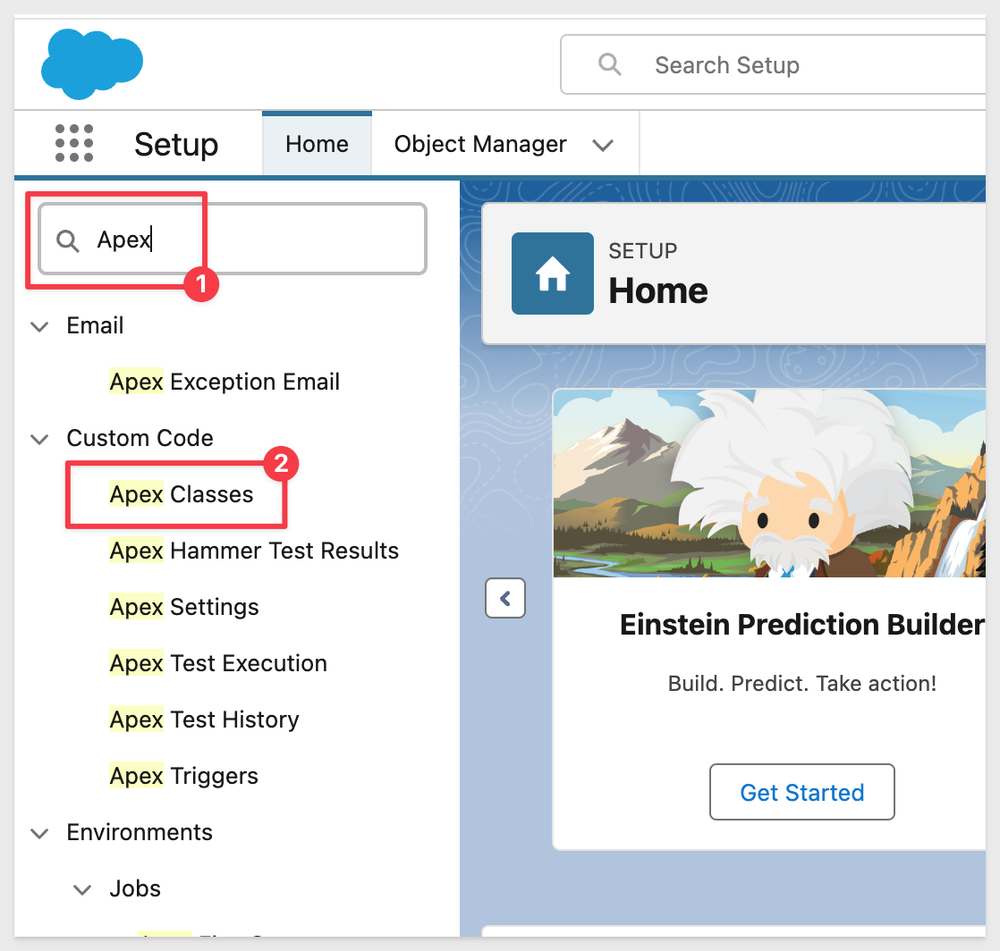
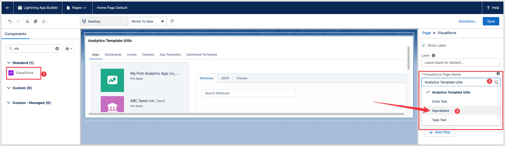

author: pballai
id: embedding_11_embedding_into_salesforce
summary: How to securely embed Sigma into SalesForce
categories: Embedding
environments: web
status: Published
feedback link: https://github.com/sigmacomputing/sigmaquickstarts/issues
tags: default
lastUpdated: 2023-06-11

# Embedding 11: Embed into Salesforce 

## Overview 
Duration: 5 

This QuickStart introduces you to Sigma embedding into Salesforce. This QuickStart assumes you have already taken the QuickStart [Embedding 1: Prerequisites](https://quickstarts.sigmacomputing.com/guide/embedding_01_prerequisites/index.html?index=..%2F..index#0) so that you have a sample environment to complete the tasks in this QuickStart.

We also recommend you take the the QuickStart [Embedding 03: Secure Access](https://quickstarts.sigmacomputing.com/guide/embedding_03_secure_access/index.html?index=..%2F..index#0).

**Some steps may not be shown in detail as we assume you have taken these other two QuickStarts or are familiar with Sigma workflows.**

 ### Target Audience
Semi-technical users who will be aiding in the planning or implementation of Sigma. Limited Salesforce and technical data skills are needed to do this QuickStart. It does assume some common computer skills like configuring software, navigating folders and edit/copy/paste operations.

### Prerequisites

<ul>
  <li>A computer with a current browser. It does not matter which browser you want to use.</li>
  <li>Access to your Sigma environment. A Sigma trial environment is acceptable and preferred.</li>
  <li>Access to Salesforce. We recommend using a free Salesforce developer account.</li>
  <li>Some content to embed. You can embed a Workbook, Table or Visualization.</li>
  <li>Familiarity navigating Salesforce and minor administrative functions.
</li>
</ul>

<button>[Free Sigma Trial](https://www.sigmacomputing.com/free-trial/)</button>   <button>[SalesForce Dev. Account](https://developer.salesforce.com/signup)</button>
  
### What You’ll Learn
The exercises in this QuickStart will discuss and walk you through the steps to embed Sigma inside a Salesforce page. 

### What You’ll Build
We will build a Salesforce page using Sigma content, embedded securely on a VisualForce page as shown below:


<!-- END -->

## Secure Embedding Configuration in Sigma
Duration: 20

In this use case we will embed a Sigma Dashboard based on one of the samples provided in the Sigma trial account. The high-level process looks like this:


### Sigma Client Credentials
Login to Sigma and navigate to the `Administration` / `Developer Access` page. 

Click the `Create new` button:


Create new `Client Credentials as:


Copy the `ClientID` and `Secret` off to a text file. We will use them later on.

### Sigma Content

Navigate to the `Templates` page.

Select `Plugs Electronics Profit Planning Tool`. 

`Dismiss` the help popup and click the Dashboard tab (bottom of the page). This is the Page we want to embed.

Click the `Save As button` (upper right corner). Name the Workbook `Salesforce Embed` and click `Save`.

Click the label `Salesforce Embed` and select `Embedding`:


Select `Profit Planning Tool` to generate a URL for the single workbook page:


Click `Copy` to copy the Embed Path URL and save it into a text file for later use.

Lastly, `Share` the workbook with the `Sales_Managers` team:


and...


<!-- END -->

## Salesforce Configuration
Duration: 20min

Salesforce is highly flexible but can sometimes confuse non-administrative users who attempt to perform more advanced configurations. With that in mind, we will focus on creating a simple, secure embed. You may notice similarities to previous QuickStarts on embedding, along with specific requirements unique to Salesforce.

Salesforce has its own programming language called "Apex," an object-oriented language created by Salesforce that allows you to extend the platform's functionality and create custom cloud-based software applications.

Apex is specifically designed for accessing and manipulating data. The method we will be using in Salesforce requires three objects to be configured:

**Apex Class:**<br>
You can think of a class as a template containing all the necessary information and instructions that you can build upon and create class instances called objects. Sigma will use an Apex class to dynamically create	the secure URL used by the iframe. You can use the Class to pass both required and optional parameters including pulling variables from the Salesforce session to pass through to Sigma to enable Row Level Security and other useful functionality. Row Level Security was covered in the QuickStart: [
Embedding 06: Row Level Security](https://quickstarts.sigmacomputing.com/guide/embedding_06_row_level_security/index.html?index=..%2F..index#0).

<aside class="positive">
<strong>IMPORTANT:</strong><br> In Salesforce Apex, moving sensitive information like API keys and client secrets to a more secure location is both possible and highly recommended.
</aside>

[Salesforce offers many pages to assist in this area. For example:](https://developer.salesforce.com/docs/atlas.en-us.secure_coding_guide.meta/secure_coding_guide/secure_coding_storing_sensitive_data.htm)

**Visualforce Component:**<br>
This is a small, reusable piece of functionality—think widgets, panels, user interface elements, that kind of thing—that you use in Visualforce page markup. You can use standard Visualforce components in our case we will create a custom component for Sigma.

**Visualforce Page:**<br>
The basic building block for application developers. A Visualforce page is similar to a standard Web page, but includes powerful features to access, display, and update your organization's data. We will embed Sigma into a Visualforce Page we will create.

In Salesforce, login (**admin rights required**) and navigate to `Setup` using the `gear icon` in the upper right corner: 


In the left sidebar menu use `Quick Find` to search for `Apex Classes` and select that:



Click the `New` button to create a new Apex Class:


Paste the following code into the class window. The Apex Class name is defined in the class code itself as `SigmaEmbedClass`.

<aside class="negative">
<strong>NOTE:</strong><br> The code is commented so you can see what each step is doing.

Replace the values for `Client ID` and `Secret` with your values in the code below:

```code
public class SigmaEmbedClass {
    // Client ID for authentication with Sigma
    private string client_id = 'Your Client ID';
    
    // Secret key used for signing the embed URL for secure access
    private string secret = 'Your Embed Secret';

    // URL path to the Sigma embed, provided by the user
    public String embed_path { get; set; }
    
    // User email for the embed session, provided by the user
    public String embed_user { get; set; }

    // Helper method to generate a random alphanumeric string of a given length
    private String generateRandomString(Integer len) {
        final String chars = 'ABCDEFGHIJKLMNOPQRSTUVWXYZabcdefghijklmnopqrstuvwxyz0123456789';
        String randStr = '';
        
        // Loop until random string reaches the desired length
        while (randStr.length() < len) {
            Integer idx = Math.mod(Math.abs(Crypto.getRandomInteger()), chars.length());
            randStr += chars.substring(idx, idx + 1);
        }
        return randStr;
    }

    // Generates a unique identifier (UUID) in the format 8-4-4-4-12
    private String generateUUID() {
        return generateRandomString(8) + '-' +
               generateRandomString(4) + '-' +
               generateRandomString(4) + '-' +
               generateRandomString(4) + '-' +
               generateRandomString(12);
    }

    // Main method to construct the full iframe URL for embedding Sigma
    public String getGenerateIframeUrl() {
        // Initialize URL with the base embed path
        String url = this.embed_path + '?';
        
        // Add a unique nonce parameter using the UUID
        url += ':nonce=' + generateUUID();

        // Append client ID to authenticate the request
        url += '&:client_id=' + this.client_id;

        // Add the user email to specify the session owner
        url += '&:email=' + this.embed_user;

        // Set static external user ID and team parameters for this session
        url += '&:external_user_team=Sales_Managers';

        // Specify the account type and mode for the embed session
        url += '&:account_type=Viewer';
        url += '&:mode=userbacked';

        // Set session length in seconds
        url += '&:session_length=3600';

        // Add a timestamp for the session start time
        url += '&:time=' + String.valueOf(DateTime.now().getTime()/1000);

        // Generate and append a secure signature using HMAC SHA-256 with the secret
        url += '&:signature=' + EncodingUtil.convertToHex(
            Crypto.generateMac('HMacSHA256', Blob.valueOf(url), Blob.valueOf(this.secret))
        );

        return url; // Return the fully constructed and signed URL
    }
}
```
</aside>

<aside class="positive">
<strong>IMPORTANT:</strong><br> To avoid initial permission errors it is advisable to use a "test" salesforce account user. The Salesforce test user will be automatically added to Sigma (by the API). Attempting to use the same email as an existing (non-embed) Sigma user email will result in error. 
</aside>

Click `Save`.

In the `left sidebar menu` use Quick Find to search for `Visualforce` and select `Visualforce Components`.

Create a `new` one called `SigmaEmbedComponent` and paste the following code into the window and save it:

<aside class="negative">
<strong>NOTE:</strong><br> In line 1 of the code, the component controller must match the Apex Class name created in the previous step.

```code
<apex:component controller="SigmaEmbedClass">
    <apex:attribute name="embedPath" description="Embed URL generated by Sigma" type="String" required="true" assignTo="{!embed_path}"/>
    <apex:attribute name="embedUser" description="Salesforce user email" type="String" required="true" assignTo="{!embed_user}"/>
    <apex:iframe id="sigmaEmbed" src="{!generateIframeUrl}" frameborder="0"></apex:iframe> 
</apex:component>                        
```
</aside>

Click `Save`.

In the left sidebar menu use Quick Find to search for `Visualforce` and select `Visualforce Pages`.

<aside class="negative">
<strong>NOTE:</strong><br> Create a new one called "SigmaSales" and paste the following code into the window, replacing for "Your Sigma Embed Path Here".

```code
<apex:page >
    <c:SigmaEmbedComponent embedPath="YOUR EMBED PATH" embedUser="{!$User.Email}"/>
</apex:page>
```
</aside>

Click `Save`:

Test your work by `editing the Visualforce Page` again and `clicking Preview`:


If you have done everything correctly, the Sigma Sales Dashboard page should appear as:


In the event the `Insufficient Privileges` error appears, the Visualforce page has to be shared with the profile:


Please refer to this [Salesforce document](https://developer.salesforce.com/docs/atlas.en-us.250.0.apexcode.meta/apexcode/apex_classes_security.htm) to resolve the issue.


<!-- END -->

## Add SalesForce Page
Duration: 10

Now that we have a working embed, we can add this Visualforce page anywhere we want in Salesforce. 

If you are using Salesforce Lightning you will need to click this checkbox on in your Visualforce page or you will not be able to add it to pages:


Navigate to a page that you want to embed onto. We will go to `Sales` / `Home`. Click `Edit Page`:

&ensp;&ensp;&ensp;

Depending on the page you select, you may want to remove existing Components or just add to it. In our case, we removed the existing content (using the small trash can in the upper right corner of the Component) and clicked the `Add Component(s) Here` button and selected `Visualforce` from the left sidebar menu:


We can then `select SigmaSales` from the right side menu as shown:



We will want to set the `Height to 800` so that the Component is taller on the page:

embe
Click `Save`.

Navigate back to the Sales homepage (or the page where you decided to embed) and see the results:


<!-- END -->

## Passing Values to Sigma
Duration: 5

It is often useful to enhance the level of interactivity between Salesforce and Sigma by passing values to Sigma when a user clicks a value in Salesforce.

For example, a user viewing an account list in Salesforce may want to select a specific account and have Sigma filter the embedded data to display information relevant to that account only.

<aside class="positive">
<strong>IMPORTANT:</strong><br> Since your Salesforce opportunity list will not contain the same key identifiers as Sigma's sample data, we won't build a fully functional example. Instead, we will demonstrate how to code the Salesforce key values to pass to Sigma.
</aside>

### Example: Salesforce AccountID
Lets use the example of a Salesforce user clicking on an opportunity and passing that unique `AccountID` to Sigma, where it will show the value in a workbook page.

The revised code blocks are provided below, with comments on what has been added.

The previous version was simple, with no dynamic components or interaction with Salesforce account data. It just displayed a Sigma embed in a static manner, without specific account-based customization.

Replacing the code with the following sections will providing an example of passing a value directly to a specific Sigma dashboard control from within Salesforce.

The Sigma control would then be used to filter the data displayed in the Sigma embed.

### Apex Class
The revised code allows dynamic account selection, passing the selected `accountId` to Sigma and displaying it within Sigma using a specified control.

Major changes are:

**1: Account Selection:**
- The revised code queries a list of accounts from Salesforce, presenting them as selectable options.
- A selected account’s Id is stored in `embed_account` and used to dynamically update the Sigma embed URL.

**2: Dynamic URL Generation with Control ID:**
- Instead of passing static session parameters, the revised URL includes the selected accountId using Sigma’s control ID format; `SF_AccountID`.
- This enables Sigma to display specific data or text related to the selected account.

**3: Improved Debugging and Default Values:**
- Added debug statements to trace variable states.
- Initialized `selectedAccountId` with a default placeholder text ("Select an account to show") for a clear indication of the initial state.

<aside class="negative">
<strong>NOTE:</strong><br> The debugging code can be removed with no impact to the functionality. It can be useful to observe Salesforce debug logs when working with development of Apex classes and other custom Salesforce customizations. 
</aside>

Here is the revised Apex class code, so we can just replace the existing class code in total and save after replacement.

Make sure to update the `client_ID` an `secret` values in this code:

```code
public class SigmaEmbedClass {
    private string client_id = 'YOUR SIGMA CLIENT_ID';
    private string secret = 'YOUR SIGMA SECRET';
    public string embed_path { get; set; }
    public string embed_user { get; set; }
    public string embed_account { get; set; }
    public String selectedAccountId { get; set; }
    public List<Account> accounts { get; set; }

    public SigmaEmbedClass() {
        accounts = [SELECT Id, Name FROM Account LIMIT 10];
        // Set default placeholder text for the initial load
        selectedAccountId = 'Select an account to show';
        System.debug('Initial selectedAccountId set to: ' + selectedAccountId);
    }
    
    public PageReference selectAccount() {
        System.debug('selectAccount() called');
        System.debug('selectedAccountId before assignment: ' + selectedAccountId);
        
        // Update embed_account with the selected account ID when an account is chosen
        embed_account = selectedAccountId;
        
        System.debug('embed_account after assignment in selectAccount: ' + embed_account);
        return null;
    }

    private String generateRandomString(Integer len) {
        final String chars = 'ABCDEFGHIJKLMNOPQRSTUVWXYZabcdefghijklmnopqrstuvwxyz0123456789';
        String randStr = '';
        while (randStr.length() < len) {
            Integer idx = Math.mod(Math.abs(Crypto.getRandomInteger()), chars.length());
            randStr += chars.substring(idx, idx + 1);
        }
        return randStr;
    }
public String getGenerateIframeUrl() {      
    System.debug('getGenerateIframeUrl() called');
    
    string url = this.embed_path + '?';
    url += ':nonce=' + generateRandomString(16);
    url += '&:allow_export=true';
    url += '&:time=' + json.serialize(datetime.now().getTime()/1000);
    url += '&:session_length=86400';
    url += '&:mode=explore';
    url += '&:external_user_id=' + EncodingUtil.urlEncode(this.embed_user, 'UTF-8');
    
    // Pass the account ID to the control ID in Sigma
    String controlId = 'SF_AccountID'; // Replace with the actual control ID
    url += '&' + EncodingUtil.urlEncode(controlId, 'UTF-8') + '=' + EncodingUtil.urlEncode(this.embed_account, 'UTF-8').replace('+', '%20');

    url += '&:client_id=' + this.client_id;
    url += '&:signature=' + EncodingUtil.convertToHex(Crypto.generateMac('HMacSHA256', Blob.valueOf(url), Blob.valueOf(this.secret))); 

    System.debug('Generated URL with Control ID: ' + url);
    return url;
    }
}
```

`Save` the changes. Do not use `Quick Save` for this step.

### Visualforce Component
This revised component code now dynamically passes the selected `accountId` from Salesforce to Sigma, allowing Sigma to display content based on that account selection.

Major changes are:

**1: Dynamic Account Passing:**
- The embedAccount attribute is now required, but its purpose has changed significantly: it directly links to embed_account in the `SigmaEmbedClass`, which holds the dynamically selected account ID.

**2: URL Construction with Dynamic Account Control ID::**
-   The `generateIframeUrl` method in `SigmaEmbedClass` now dynamically incorporates the selected `accountId` via a specified control ID ("SF_AccountID", which we will create shortly), which allows the Sigma embed to reflect account-specific content. This change means that each time `generateIframeUrl` is called, it reflects the current account selection, rather than a static embed.

- The revised component leverages the `embedAccount` dynamically to ensure that the URL in the iframe changes based on the user’s selection in real-time, improving interactivity.

Here is the revised Visualforce component code, so we can just replace the existing `component` code in total and save after replacement:

```code
<apex:component controller="SigmaEmbedClass">
    <apex:attribute name="embedPath" description="Embed URL generated by Sigma" type="String" required="true" assignTo="{!embed_path}"/>
    <apex:attribute name="embedUser" description="Salesforce user email" type="String" required="true" assignTo="{!embed_user}"/>
    <apex:attribute name="embedAccount" description="Salesforce Account ID" type="String" required="true" assignTo="{!embed_account}"/>
    <apex:iframe id="sigmaEmbed" src="{!generateIframeUrl}" frameborder="0"></apex:iframe> 
</apex:component>
```

`Quick Save` the changes.

### Visualforce Page
The revised page list some accounts from Salesforce and dynamically updates the Sigma embed based on the selected account. The Sigma embed will show the selected `Account_ID` passed from Salesforce.

The Salesforce account clicked will appear in the embed using a Sigma `CONTROL ELEMENT` > `LIST VALUES` control.

Major changes are:

**1: Dynamic Account Selection with Command Link:**
- Each account name in the `pageBlockTable` is now paired with a "View in Sigma" link. When a user clicks this link, it triggers the `selectAccount` method in `SigmaEmbedClass`, updating the `selectedAccountId` with the clicked account’s ID.
- The use of `apex:param` within the `commandLink` ensures that the correct `accountId` is passed to the controller, allowing Sigma to receive the specific account ID dynamically.


**2: Conditional Display of Sigma Embed:**
- A Salesforce `outputPanel` with embedPanel ID wraps the Sigma embed section, allowing it to be re-rendered dynamically when the selected account changes.
- Conditional Salesforce `outputText` components are used to show a placeholder message ("Select an account to show") if no account is selected, improving user guidance.
- Once an account is selected, the outputText conditionally displays the `SigmaEmbedComponent`, passing the dynamically updated `selectedAccountId` as `embedAccount.`

**3: Embedding Sigma with Account-Specific Context:**
- The `SigmaEmbedComponent` in the embed panel now receives the selected `accountId` dynamically, updating the Sigma embed URL to reflect the current account context.
- This dynamic embedding allows Sigma to display data or information specific to the chosen account, providing the desired interactivity.

Here is the revised Visualforce page code, so we can just replace the existing page code in total and save after replacement:

```code
<apex:page controller="SigmaEmbedClass">
    <apex:form >
        <apex:pageBlock title="Account List">
            <apex:pageBlockTable value="{!accounts}" var="account">
                <apex:column value="{!account.Name}"/>
                <apex:column >
                    <apex:commandLink value="View in Sigma" action="{!selectAccount}" reRender="embedPanel">
                        <apex:param name="accountId" value="{!account.Id}" assignTo="{!selectedAccountId}"/>
                    </apex:commandLink>
                </apex:column>
            </apex:pageBlockTable>
        </apex:pageBlock>

        <!-- Wrap the iframe in an outputPanel with ID "embedPanel" to enable re-rendering -->
        <apex:outputPanel id="embedPanel">
            <apex:pageBlock title="Sigma Embed">
                <apex:outputText rendered="{!selectedAccountId == 'Select an account to show'}">
                    <p>Select an account to show</p>
                </apex:outputText>
                <apex:outputText rendered="{!selectedAccountId != 'Select an account to show'}">
                    <c:SigmaEmbedComponent embedPath="YOUR SIGMA EMBED PATH FOR THE NEW PAGE WITH CONTROL ELEMENT" 
                                           embedUser="{!$User.Email}" 
                                           embedAccount="{!selectedAccountId}"/>
                </apex:outputText>
            </apex:pageBlock>
        </apex:outputPanel>
    </apex:form>
</apex:page>
```

`Quick Save` the changes.

## Configuring Sigma 

#### User Attribute
In Sigma, navigate to `Administration` > `User Attributes` and click the `Create Attribute` button.

Name the new attribute `sfaccount`. 

Assign the new user attribute to the `Sales_Managers` team with a placeholder default value of `0`.

Click `Save`:


#### Configure Sigma workbook
Navigate back to the `Profit Planning Tool` workbook we used for the embed, place it in `Edit` mode and add a new workbook page.

On the new page, add a new `UI ELEMENT` > `CONTROLS` > `LIST VALUES.`

Configure it's properties to be:


<aside class="positive">
<strong>IMPORTANT:</strong><br> The `CONTROL_ID` used must match exactly, as it is reference in the Salesforce code by name.
</aside>

The `Control_ID` used needs to be `SF_AccountID`.

`Publish` the workbook.

Generate a new `Embed path` for the new page only:


Copy this new `Embed path` and use the new url to update the `Visualforce page` code with this new URL:


Save the `Visualforce page` after updating the url.

### Testing the changes
Click the `Preview` button to see the new Salesforce page render:


For more information on sing controls to filter data in Sigma, see [Intro to control elements](https://help.sigmacomputing.com/docs/intro-to-control-elements#how-controls-work)


<!-- END -->

## What we've covered
Duration: 5

In this QuickStart we embedded a Sigma Dashboard securely into a SalesForce VisualForce page, building on the lessons in previous embedding QuickStarts.

<!-- THE FOLLOWING ADDITIONAL RESOURCES IS REQUIRED AS IS FOR ALL QUICKSTARTS -->
**Additional Resource Links**

Be sure to check out all the latest developments at [Sigma's First Friday Feature page!](https://quickstarts.sigmacomputing.com/firstfridayfeatures/)

[Help Center Home](https://help.sigmacomputing.com)<br>
[Sigma Community](https://community.sigmacomputing.com/)<br>
[Sigma Blog](https://www.sigmacomputing.com/blog/)<br>
<br>

[](https://twitter.com/sigmacomputing)&emsp;
[](https://www.linkedin.com/company/sigmacomputing)&emsp;
[](https://www.facebook.com/sigmacomputing)


<!-- END OF WHAT WE COVERED -->
<!-- END OF QUICKSTART -->
