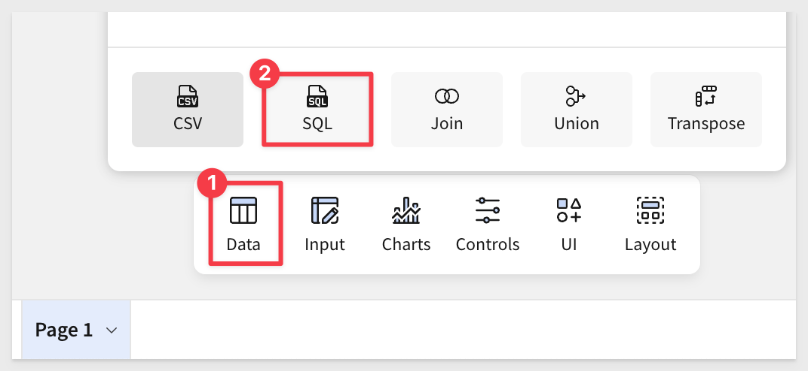
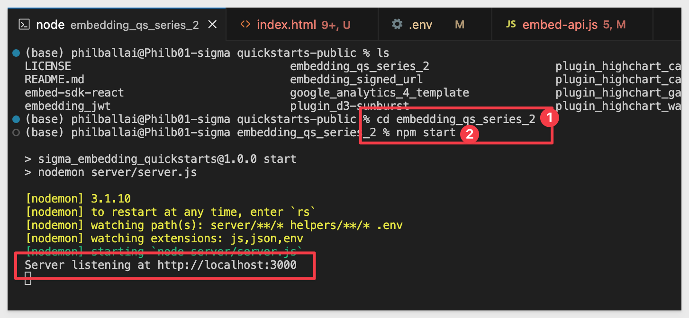

author: pballai
id: embedding_12_parameterized_queries_v3
summary: embedding_12_parameterized_queries_v3
categories: Embedding
environments: web
status: published
feedback link: https://github.com/sigmacomputing/sigmaquickstarts/issues
tags: embedding
lastUpdated: 2024-05-21

# Embedding 12: Parameterized Queries

## Overview
Duration: 5 

This QuickStart introduces Sigma embedding using parameterized queries.

Parameterized queries are especially useful when each embedded customer has their own database with the same schema.

While there are various ways to store customer data, this pattern is fairly common.

To accomplish this in Sigma, we’ll use queries that leverage custom user attributes.

### How it works
End users are authenticated by the parent application. When the user navigates to a parent page containing embedded Sigma content, the parent sends a request to Sigma via the embed API, containing user attributes that specify the database and schema names. Sigma parses that request, and applies the user attributes to the SQL query. The query is then evaluated by Sigma and, if needed, sent to the cloud data warehouse.

How Sigma performs calculations is beyond the scope of this QuickStart, but covered in-depth in the QuickStart [Sigma's Query Engine.](https://quickstarts.sigmacomputing.com/guide/developers_sigma_calculations/index.html?index=..%2F..index#0)

This differs from other options Sigma offers for common architectural patterns.

Other options include:

[Embedding 05: Multi-tenancy]()

[Embedding 07: Dynamic Role Switching with Snowflake]()

In this QuickStart, we will use the local native application we created in [Embedding 01: Getting Started](https://quickstarts.sigmacomputing.com/guide/embedding_03_secure_access/index.html?index=..%2F..index#0)

<aside class="positive">
<strong>IMPORTANT:</strong><br> Some screens in Sigma may appear slightly different from those shown in QuickStarts. This is because Sigma continuously adds and enhances functionality. Rest assured, Sigma’s intuitive interface ensures that any differences will not prevent you from successfully completing any QuickStart.
</aside>

For more information on Sigma's release strategy, see [Sigma product releases](https://help.sigmacomputing.com/docs/sigma-product-releases)

If something is not working as you expected, here's how to [contact Sigma support](https://help.sigmacomputing.com/docs/sigma-support)

### Target Audience
Semi-technical users who will be aiding in the planning or implementation of Sigma with embedding. No SQL or technical data skills are needed to complete this QuickStart. It does assume some common computer skills like installing software, using Terminal, navigating folders and copy/paste operations.

### Prerequisites

<ul>
  <li>A computer with a current browser. It does not matter which browser you want to use.</li>
  <li>Access to your Sigma environment.</li>
  <li>Embedding 01: Getting Started is required to complete this QuickStart.</li>
</ul>

<aside class="positive">
<strong>IMPORTANT:</strong><br> Sigma recommends using non-production resources when completing QuickStarts.
</aside>

<button>[Sigma Free Trial](https://www.sigmacomputing.com/free-trial/)</button>

<aside class="negative">
<strong>IMPORTANT:</strong><br> Some features may carry a "Beta" tag. Beta features are subject to quick, iterative changes. As a result, the latest product version may differ from the contents of this document.
</aside>
 


## Typical use cases
Duration: 20

Sigma supports the most common multi-tenant architectures, which are widely used to offer secure portal access with proper data separation.

The most common examples of this are:

**1: One Snowflake account with per-customer databases:**<br> 
Database names are different, but schema names are the same.

**2: One Snowflake account with a single database and per-customer schemas:**<br>
Database and schema names are different.

**3: Two Snowflake accounts with similarly structured databases and/or schemas, but different names:**<br>
This requires the previously mentioned connection-swapping user attribute along with custom user attributes for database and schema names.

The core design pattern, based on custom user attributes, offers flexibility to match a variety of architectural models.

While we’ve outlined three common use cases, the fundamental design pattern remains the same. For this QuickStart, we’ll focus on use case #2, as the steps are largely the same for the other two, with only minor differences.


<!-- END OF SECTION-->

## One Snowflake account, per customer database and schema
Duration: 20

Imagine Sigma content embedded in a SaaS application used by multiple clients.

Each client accesses similar types of data (e.g., store sales), all stored in the same Snowflake account.

Database and schema names reflect each client’s name.

For this demonstration, we’ll assume the SaaS provider is a national retail distributor with clients selling goods across U.S. regions.

The distributor wants to embed Sigma into their client portal.

They prefer a shared dashboard to simplify training, support, and development as new clients are onboarded.

In this example, we’ll use two clients: `Client_A` and `Client_B`.

Each client has a `STORE_SALES` table with the same structure, but their data is client-specific.

To demonstrate this setup, we’ll use our trial Snowflake account to create per-customer databases and schemas.

<aside class="negative">
<strong>NOTE:</strong><br> We’ll use a small amount of data for each client for demonstration purposes. While Sigma supports massive data scale, data volume and dashboard appearance are not the focus of this QuickStart.
</aside>


<!-- END OF SECTION-->

## Snowflake Configuration
Duration: 20

Use the following Snowflake script to automate creation of roles, databases, schemas, and sample data.

Log into Snowflake as `ACCOUNTADMIN`.

Open a new `SQL Worksheet`.

The script below creates roles for `Client_A` and `Client_B`, sets up their databases and schemas, grants the required permissions, and inserts sample data into their `STORE_SALES` tables.

It also creates a default client (`Client_Default`) with a table containing a single row of dummy data. This will serve as the default in our later Sigma configuration. This ensures that if the parent application fails to send database and/or schema values, Sigma falls back to the default without exposing other client data.

<aside class="positive">
<strong>IMPORTANT:</strong><br> There are other ways to deal with default values, but we want to keep this demonstration focused on the overall setup and concepts for simplicity sake. 
</aside>

Copy and paste this code into the worksheet:
```code
-- Use the ACCOUNTADMIN role and COMPUTE_WH warehouse
USE ROLE ACCOUNTADMIN;
USE WAREHOUSE COMPUTE_WH;

-- Step 1: Create Roles
CREATE OR REPLACE ROLE Client_A_Role;
CREATE OR REPLACE ROLE Client_B_Role;
CREATE OR REPLACE ROLE Client_Default_Role;

-- Step 2: Create Databases and Schemas
CREATE OR REPLACE DATABASE Client_A_DB;
CREATE OR REPLACE SCHEMA Client_A_DB.Client_A_Schema;

CREATE OR REPLACE DATABASE Client_B_DB;
CREATE OR REPLACE SCHEMA Client_B_DB.Client_B_Schema;

CREATE OR REPLACE DATABASE Client_Default_DB;
CREATE OR REPLACE SCHEMA Client_Default_DB.Client_Default_Schema;

-- Step 3: Create Tables and Insert Sample Data

-- Client_A
CREATE TABLE Client_A_DB.Client_A_Schema.STORE_SALES (
    sale_id INT,
    sale_date DATE,
    store_id INT,
    amount DECIMAL(10, 2)
);

INSERT INTO Client_A_DB.Client_A_Schema.STORE_SALES (sale_id, sale_date, store_id, amount) VALUES
(1, '2024-01-01', 100, 100.00),
(2, '2024-02-02', 200, 200.00),
(3, '2024-03-03', 300, 300.00),
(4, '2024-04-04', 400, 400.00),
(5, '2024-05-05', 500, 500.00);

-- Client_B
CREATE TABLE Client_B_DB.Client_B_Schema.STORE_SALES (
    sale_id INT,
    sale_date DATE,
    store_id INT,
    amount DECIMAL(10, 2)
);

INSERT INTO Client_B_DB.Client_B_Schema.STORE_SALES (sale_id, sale_date, store_id, amount) VALUES
(1, '2024-06-06', 600, 600.00),
(2, '2024-07-07', 700, 700.00),
(3, '2024-08-08', 800, 800.00),
(4, '2024-09-09', 900, 900.00),
(5, '2024-10-10', 1000, 1000.00);

-- Client_Default
CREATE TABLE Client_Default_DB.Client_Default_Schema.STORE_SALES (
    sale_id INT,
    sale_date DATE,
    store_id INT,
    amount DECIMAL(10, 2)
);

INSERT INTO Client_Default_DB.Client_Default_Schema.STORE_SALES (sale_id, sale_date, store_id, amount) VALUES
(1, '2024-01-01', 0, 0.00);

-- Step 4: Grant Permissions

-- Client_A
GRANT USAGE ON DATABASE Client_A_DB TO ROLE Client_A_Role;
GRANT USAGE ON SCHEMA Client_A_DB.Client_A_Schema TO ROLE Client_A_Role;
GRANT SELECT ON ALL TABLES IN SCHEMA Client_A_DB.Client_A_Schema TO ROLE Client_A_Role;

-- Client_B
GRANT USAGE ON DATABASE Client_B_DB TO ROLE Client_B_Role;
GRANT USAGE ON SCHEMA Client_B_DB.Client_B_Schema TO ROLE Client_B_Role;
GRANT SELECT ON ALL TABLES IN SCHEMA Client_B_DB.Client_B_Schema TO ROLE Client_B_Role;

-- Client_Default
GRANT USAGE ON DATABASE Client_Default_DB TO ROLE Client_Default_Role;
GRANT USAGE ON SCHEMA Client_Default_DB.Client_Default_Schema TO ROLE Client_Default_Role;
GRANT SELECT ON ALL TABLES IN SCHEMA Client_Default_DB.Client_Default_Schema TO ROLE Client_Default_Role;

-- Step 5: Grant Permissions to ACCOUNTADMIN
GRANT SELECT ON ALL TABLES IN SCHEMA Client_A_DB.Client_A_Schema TO ROLE ACCOUNTADMIN;
GRANT SELECT ON ALL TABLES IN SCHEMA Client_B_DB.Client_B_Schema TO ROLE ACCOUNTADMIN;
GRANT SELECT ON ALL TABLES IN SCHEMA Client_Default_DB.Client_Default_Schema TO ROLE ACCOUNTADMIN;

GRANT USAGE ON WAREHOUSE COMPUTE_WH TO ROLE ACCOUNTADMIN;

-- Step 6: Replace "YOUR_SIGMA_USER" with your Snowflake user with ACCOUNTADMIN role
GRANT ROLE Client_Default_Role TO USER YOUR_SIGMA_USER;
```

<aside class="positive">
<strong>IMPORTANT:</strong><br> In Step 6, be sure to replace "YOUR_SIGMA_USER" with your actual Snowflake user who has the ACCOUNTADMIN role so you can later create a Sigma connection to Snowflake.
</aside>

Run the script. Once complete, you should see the message `Statement executed successfully.`

In the `Databases` tab, you’ll see the new tables:


<!-- END OF SECTION-->


## Sigma Configuration 
Duration: 20

Log into Sigma as `Administrator`.

### Create teams
Navigation to `Administration` > `Teams` and create add the `CLIENT_A` and `CLIENT_B` teams:


No need to assign anyone to these teams now. 

<aside class="positive">
<strong>IMPORTANT:</strong><br> Users are added automatically to Sigma, when coming in via the embedding integration. They will be added to the user ("people") database, assigned to the specified team and permissions by the embed-API. You will not have to manage Sigma embed users separately from your existing user management system, saving you time.
</aside>

### Create custom user attributes<br>
We need to create a few attributes that will serve as placeholders for values that will be passed from the native application at runtime.

Navigate to `Administration` > `User Attributes` and click `Create Attribute`.

Give the attribute the name `Client_DB`, set the default value to `Client_Default_DB` and click `Create`:


Repeat the process, creating new a attribute for `Client_Schema`, taking care to assign the expected default; `Client_Default_Schema`.

Repeat the process one more time, creating new a attribute for `Client_Role`, taking care to assign the expected default; `Client_Default_Role`.

### Create Connection to Snowflake:<br>
Create a new connection in `Administration` > `Connections` and name it`Parameterized Queries QuickStart`.

Configure the rest of the connection as shown below, adjusting for your Snowflake account and selecting `Client_Role` from the list menu:


Click `Save.` Sigma will validate the connection, warning if there are any errors.

Click the `Browse connection` button:


Make sure you can see all the client database/schema:


### Create the workbook
Click the `Explore` button to open the `STORE_SALES` table in a new Sigma workbook. It does not matter if you were browsing the `Client_A` or `Client_B` connection.

Use the `Save As` button to create the new workbook named `Embedding 12: Parameterized Queries`. 


It is really great that Sigma can just launch a connection to data directly into a familiar spreadsheet interface, creating optimized SQL on-the-fly for us in seconds.

<aside class="positive">
<strong>IMPORTANT:</strong><br> For use cases that require row-level-security it is recommended to base the parameterized query off of a data model instead. The workflow is slightly different but the application of the query is the same.
</aside>

However, we want to have a single workbook that provides all clients a common interface, using each clients data only. 

The table on this page does not do that, so lets delete it:


To accomplish that, we need to create a table based on parameterized SQL instead.

Using the `Element bar`, click `Data` > `Table` and `SQL`:



Select our new `Embedding 12: Parameterized Queries` connection:


We are now able to create a custom SQL statement to return data instead of Sigma doing it for us. We will use this to create a parameterized query.

Copy and paste this code and click the `Run` button:
```code
SELECT * FROM CLIENT_A_DB.CLIENT_A_SCHEMA.STORE_SALES
```

While our query is not yet parameterized, this verifies that we can retrieve data as expected:


Now replace the code to use our user attributes instead:
```code
SELECT * FROM {{#raw system::CurrentUserAttributeText::Client_DB}}.{{#raw system::CurrentUserAttributeText::Client_Schema}}.STORE_SALES
```

We are present with the single row of data from the `Client_Default_DB` table:


Recall that when we created the user attributes for `Client_DB` and `Client_Schema` we set default values. This is why we are seeing data still, instead of a SQL error.

It may also be nice to know which user is accessing data when we test the embed later. This is easy enough to do.

Add a new `Text` element from the `UI` element bar group and configure it by typing `=CurrentUserEMail()` and clicking the :


At this point, the workbook looks like this:


Click `Publish`.

### Share with teams
To be able to test this workbook, we need to share it with the two teams. 

Add the `CLIENT_A` and `CLIENT_B` teams. Set the permission to `Can View` and select `Share`:


### Embed URL

Open the workbook's menu and click `Go to published verion`:


Copy the URL from the browser and store it in a text file; we will use that later.

## Configure and Test
Duration: 5

In the QuickStart [Embedding 01: Getting Started](https://quickstarts.sigmacomputing.com/guide/embedding_01_prerequisites/index.html?index=..%2F..index#0) we deployed a native application locally.

For testing, we’ll use the pre-built page that demonstrates this approach.

In VSCode, open a new Terminal session inside the `embedding_qs_series` project and run the following command:

```code
npm start
```



Now edit the `.env` file to update a few values.

The `CLIENT_ID` and `SECRET` from the Getting Started QuickStart should still be present and working. If they aren’t configured, revisit the Getting Started QuickStart to complete that step.

In the `# QS: parameterized_queries` section, we need to configure the values below, using the URL saved earlier for the `PARAMETERIZED_QUERIES_BASE_URL` value:

```code
PARAMETERIZED_QUERIES_BASE_URL=
PARAMETERIZED_QUERIES_EMAIL=sales_person@client_a.com
PARAMETERIZED_QUERIES_ACCOUNT_TYPE=View
PARAMETERIZED_QUERIES_TEAMS=Client_A

UPARAMETERIZED_QUERIES_ua_Client_Role=Client_A_Role
PARAMETERIZED_QUERIES_ua_Client_Schema=Client_A_Schema
PARAMETERIZED_QUERIES_ua_Client_DB=Client_A_DB
```

Save the `.env` file.


In a browser, open:
```code
http://localhost:3000/parameterize_queries/?mode=parameterize_queries
```

The table loads with the Snowflake data for `Client_A` and the user attributes that were passed are shown in the left sidebar:


This configuration uses Snowflake’s role-based access control to enforce data-level security.

Embed users are authenticated by the native application, which then passes user attributes to Sigma via the embed API. Embed users are automatically added to Sigma and assigned to a team based on instructions from the native application.

<aside class="negative">
<strong>NOTE:</strong><br> Embed users cannot log directly into the Sigma UI.
</aside>

### Switch users

To simulate a different user, update the `.env` values for `Client_B`:

```code
PARAMETERIZED_QUERIES_EMAIL=sales_person@client_b.com
PARAMETERIZED_QUERIES_ACCOUNT_TYPE=View
PARAMETERIZED_QUERIES_TEAMS=Client_B

PARAMETERIZED_QUERIES_ua_Client_Role=Client_B_Role
PARAMETERIZED_QUERIES_ua_Client_Schema=Client_B_Schema
PARAMETERIZED_QUERIES_ua_Client_DB=Client_B_DB
```

Save the file and refresh the browser.

You should now see only `Client_B` data:


We can now deploy a Sigma dashboard that is shared across multiple clients, ensuring per-client data isolation through parameterized queries in Sigma.


<!-- END OF WHAT WE COVERED -->

## What we've covered
Duration: 5

In this QuickStart, we learned how to set up Sigma embedding using parameterized queries with Snowflake, and explored the use cases where this approach is most useful.

**Additional Resource Links**

[Blog](https://www.sigmacomputing.com/blog/)<br>
[Community](https://community.sigmacomputing.com/)<br>
[Help Center](https://help.sigmacomputing.com/hc/en-us)<br>
[QuickStarts](https://quickstarts.sigmacomputing.com/)<br>

Be sure to check out all the latest developments at [Sigma's First Friday Feature page!](https://quickstarts.sigmacomputing.com/firstfridayfeatures/)
<br>

[](https://twitter.com/sigmacomputing)&emsp;
[](https://www.linkedin.com/company/sigmacomputing)&emsp;
[](https://www.facebook.com/sigmacomputing)


<!-- END OF WHAT WE COVERED -->
<!-- END OF QUICKSTART -->
