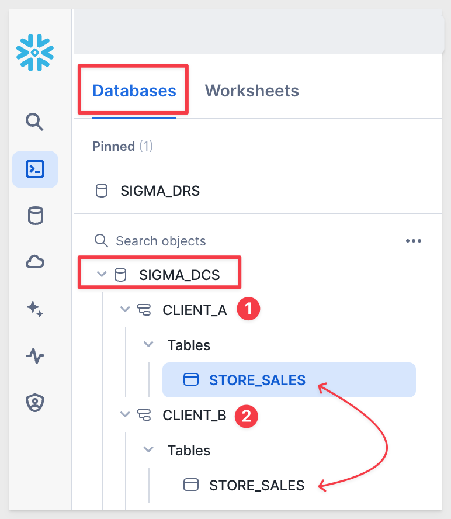

author: pballai
id: embedding_13_connection_swapping
summary: embedding_13_connection_swapping
categories: Embedding
environments: web
status: Published
feedback link: https://github.com/sigmacomputing/sigmaquickstarts/issues
tags: default
lastUpdated: 2024-04-30

# Embedding 13: Connection Swapping
<!-- The above name is what appears on the website and is searchable. -->

## Overview 
Duration: 5 

This QuickStart introduces and demonstrates Sigma embedding using Dynamic Connection Swapping **(DCS)**. 

This QuickStart assumes you have already taken the [QuickStart Embedding 1: Prerequisites](https://quickstarts.sigmacomputing.com/guide/embedding_3_application_embedding/index.html#0) so that you have a sample environment to complete the tasks in this QuickStart.

We also recommend you take the the [QuickStart Embedding 3: Secure Embedding](https://quickstarts.sigmacomputing.com/guide/embedding_03_secure_access/index.html?index=..%2F..index#0) as we will build on that content. 

<aside class="positive">
<strong>IMPORTANT:</strong><br> Some steps may not be shown in detail as we assume you have taken these other two QuickStarts or are familiar with Sigma workflows.
</aside>

DSC with Sigma can be efficiently managed through embedding parameters, specifically the parameter:

```code
:eval_connection_id=<connection_id> 
```

This parameter, when added to an embed URL, allows the embedded Sigma application to dynamically switch the Sigma database connection used for queries, based on the specified `connectionId.`

This functionality is particularly useful in environments where different users or groups require access to **different data sources that share the same schema.**

### Key Features and Benefits:
 <ul>
      <li><strong>Seamless Integration:</strong> By simply appending the ":eval_connection_id" parameter to the embed URL, the Sigma application can change its data source without requiring any changes to the dashboard or report setup.</li>
      <li><strong>Dynamic Data Access:</strong> This feature enhances flexibility for single-tenant architectures.</li>
</ul>   
     
### Important Caveats:
<ul>
      <li><strong>Different Schema / Same Structure :</strong> The structure of the tables, the columns, and other objects within these schemas must be identical<li>
      <li><strong>Limited to Read-Only Features:</strong> The dynamic connection swapping feature is limited to read-only operations. It does not support writeback features like materialization or input tables, which means any functions involving writing data back to the database cannot use this dynamic switching mechanism.</li>
      <li><strong>Overrides User-Attributes:</strong> Using this parameter will override any configurations set via user attributes for warehouse or role switching within Sigma. This means the connection specified in the URL takes precedence over any user-specific settings.</li>
      <li><strong>Scheduled Exports:</strong> The data connection used will be the one specified in the URL at the time the schedule was created or last modified.</li>
      <li><strong>Immediate Exports:</strong> Immediate data exports will utilize the connection specified in the current embed URL.</li>
      <li><strong>Session Consistency:</strong> Throughout an embed session, any workbook opened will utilize the connection ID provided in the embed URL, ensuring consistency in data source usage.</li>
</ul>

### Implementation Considerations:
When implementing dynamic connection swapping, it is crucial to ensure that all embed URLs are correctly formatted with the appropriate `connectionId` to maintain data integrity and security. Additionally, understanding the limitations and behaviors (listed above) related to exports and overrides is essential for effective use of this feature.

 ### Target Audience
Semi-technical users who will be aiding in the planning or implementation of Sigma. Limited SQL and technical data skills are needed to do this QuickStart. It does assume some common computer skills like installing software, using Terminal, navigating folders and edit/copy/paste operations.

### Prerequisites

<ul>
  <li>A computer with a current browser. It does not matter which browser you want to use.</li>
  <li>Access to your Sigma environment. A Sigma trial environment is acceptable and preferred.</li>
  <li>A working web server based on Node.js as demonstrated in the QuickStart Embedding 1: Prerequisites</li>
  <li>Some content to embed. You can embed a workbook, Table or Visualization.</li>
  <li>A Snowflake account with the proper administrative and security admin access.</li>
</ul>

<aside class="postive">
<strong>IMPORTANT:</strong><br> Sigma recommends that you do not use production resources when doing QuickStarts.
</aside>

<button>[Sigma Free Trial](https://www.sigmacomputing.com/free-trial/)</button> <button>[Snowflake Free Trial](https://signup.snowflake.com/)</button>

<ul>
  <li></li>
    <li>Node.js and required Packages (all free, discussed in prior QuickStarts in detail):
        <ul>
        <li>Express</li>
        <li>Node-supervisor</li>
        <li>crypto (included with Node.js installation)</li>
        </ul>
    </li>
</ul>

### What You’ll Learn
The exercises in this QuickStart will discuss and walk you through the steps to implement DCS with User Attributes (**UA**).

### What You’ll Build
We will embed Sigma content inside a Node.js web application, passing runtime parameters to configure the embed and demonstrate using different Sigma connections, based on passed `connectionId`.


## Typical Use Case: Multi-Tenant Dashboard
Duration: 20

Imagine a scenario where a Sigma dashboard is embedded into a SaaS application used by multiple clients. Each client accesses the same type of data (e.g., sales, operations) but their data is stored in separate databases or schemas to ensure data isolation.

### Setup:
The dashboard is designed once using Sigma, based on a standard schema that includes tables like Sales, Inventory, and Orders.

There are two connections configured in Sigma, each having their own `connectionId`.

Each client's data is stored in a different schema in Snowflake, but the structure (DDL) of these schemas is the same.

### Usage:
**User-A:** 
When User-A logs into the SaaS application, the application determines that User-A belongs to Client A. The embed URL for the Sigma dashboard is dynamically generated to include :eval_connection_id=<connection_id_for_client_a>, which points to Client-A's specific schema.

**User B:** 
Similarly, when User-B logs in and they belong to Client-B, their dashboard embed URL includes :eval_connection_id=<connection_id_for_client_b>.

### Result:
Each user sees data only from their respective schema, ensuring data security and privacy. 

Despite accessing different data sets, both users experience the same dashboard functionality because the underlying data structure is consistent across schemas.


<!-- END OF SECTION-->

## Snowflake Configuration
Duration: 20

We have created the following Snowflake script to automate the process of creating users, roles and sample data, so that it is easy for us to demonstrate DCS.

We will create one database that has two schema; one for each customer ("client"). The data is different for each client and consists of retail store sales data. 

Client_A only sells in the eastern region of the US. Client_B only in the south.




In Sigma, we will demonstrate by creating one workbook that has the `Customer` table on it.

We will embed this workbook page and populate the table's data at runtime, with the data for the correct client.


<!-- END OF SECTION-->

## Sigma Configuration 
Duration: 20

Log into Sigma as `Administrator`.

### Create a Connection - Client-A
Create a new connection in `Administration` > `Connections` and configure it for the TPCH_SF1 database.


<!-- END OF SECTION-->


## asdqsgfsdfg
Duration: 20


<!-- END OF SECTION-->


## What we've covered
Duration: 5

In this lab we learned how to setup Sigma embedding using Dynamic Connection Swapping with Snowflake and the different use-cases where it could be useful.

<!-- THE FOLLOWING ADDITIONAL RESOURCES IS REQUIRED AS IS FOR ALL QUICKSTARTS -->
**Additional Resource Links**

[Blog](https://www.sigmacomputing.com/blog/)<br>
[Community](https://community.sigmacomputing.com/)<br>
[Help Center](https://help.sigmacomputing.com/hc/en-us)<br>
[QuickStarts](https://quickstarts.sigmacomputing.com/)<br>

Be sure to check out all the latest developments at [Sigma's First Friday Feature page!](https://quickstarts.sigmacomputing.com/firstfridayfeatures/)
<br>

[](https://twitter.com/sigmacomputing)&emsp;
[](https://www.linkedin.com/company/sigmacomputing)&emsp;
[](https://www.facebook.com/sigmacomputing)


<!-- END OF WHAT WE COVERED -->
<!-- END OF QUICKSTART -->