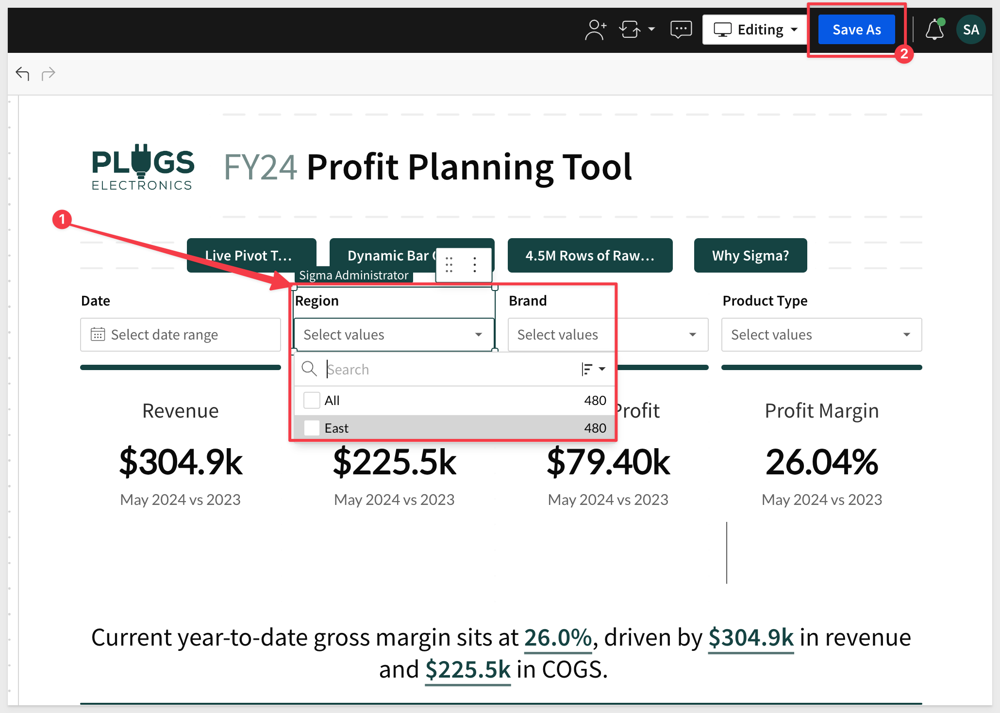
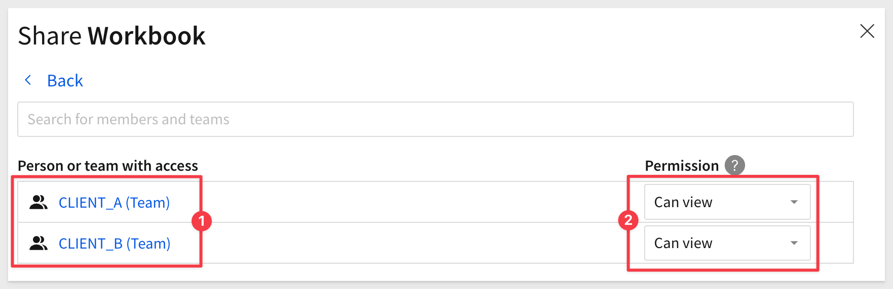

author: pballai
id: embedding_13_connection_swapping
summary: embedding_13_connection_swapping
categories: Embedding
environments: web
status: Published
feedback link: https://github.com/sigmacomputing/sigmaquickstarts/issues
tags: default
lastUpdated: 2024-04-30

# Embedding 13: Connection Swapping
<!-- The above name is what appears on the website and is searchable. -->

## Overview 
Duration: 5 

This QuickStart introduces and demonstrates Sigma embedding using Dynamic Connection Swapping **(DCS)**. 

This QuickStart assumes you have already taken the [QuickStart Embedding 1: Prerequisites](https://quickstarts.sigmacomputing.com/guide/embedding_3_application_embedding/index.html#0) so that you have a sample environment to complete the tasks in this QuickStart.

We also recommend you take the the [QuickStart Embedding 3: Secure Embedding](https://quickstarts.sigmacomputing.com/guide/embedding_03_secure_access/index.html?index=..%2F..index#0) as we will build on that content. 

<aside class="positive">
<strong>IMPORTANT:</strong><br> Some steps may not be shown in detail as we assume you have taken these other two QuickStarts or are familiar with Sigma workflows.
</aside>

DCS with Sigma can be efficiently managed through embedding parameters, specifically the parameter:

```code
:eval_connection_id=<connection_id> 
```

This parameter, when added to an embed URL, allows the embedded Sigma application to dynamically switch the Sigma database connection used for queries, based on the specified `connectionId.`

This functionality is particularly useful in environments where different users or groups require access to **different data sources that share the same schema.**

### Key Features and Benefits:
 <ul>
      <li><strong>Seamless Integration:</strong> By simply appending the ":eval_connection_id" parameter to the embed URL, the Sigma application can change its data source without requiring any changes to the dashboard or report setup.</li>
      <li><strong>Dynamic Data Access:</strong> This feature enhances flexibility for single-tenant architectures.</li>
</ul>   
     
### Important Caveats:
<ul>
      <li><strong>Different Schema / Same Structure :</strong> The structure of the tables, the columns, and other objects within these schemas must be identical<li>
      <li><strong>Limited to Read-Only Features:</strong> The dynamic connection swapping feature is limited to read-only operations. It does not support writeback features like materialization or input tables, which means any functions involving writing data back to the database cannot use this dynamic switching mechanism.</li>
      <li><strong>Overrides User-Attributes:</strong> Using this parameter will override any configurations set via user attributes for warehouse or role switching within Sigma. This means the connection specified in the URL takes precedence over any user-specific settings.</li>
      <li><strong>Scheduled Exports:</strong> The data connection used will be the one specified in the URL at the time the schedule was created or last modified.</li>
      <li><strong>Immediate Exports:</strong> Immediate data exports will utilize the connection specified in the current embed URL.</li>
      <li><strong>Session Consistency:</strong> Throughout an embed session, any workbook opened will utilize the connection ID provided in the embed URL, ensuring consistency in data source usage.</li>
</ul>

### Implementation Considerations:
When implementing dynamic connection swapping, it is crucial to ensure that all embed URLs are correctly formatted with the appropriate `connectionId` to maintain data integrity and security. Additionally, understanding the limitations and behaviors (listed above) related to exports and overrides is essential for effective use of this feature.

 ### Target Audience
Semi-technical users who will be aiding in the planning or implementation of Sigma. Limited SQL and technical data skills are needed to do this QuickStart. It does assume some common computer skills like installing software, using Terminal, navigating folders and edit/copy/paste operations.

### Prerequisites

<ul>
  <li>A computer with a current browser. It does not matter which browser you want to use.</li>
  <li>Access to your Sigma environment. A Sigma trial environment is acceptable and preferred.</li>
  <li>A working web server based on Node.js as demonstrated in the QuickStart Embedding 1: Prerequisites</li>
  <li>Some content to embed. You can embed a workbook, Table or Visualization.</li>
  <li>A Snowflake account with the proper administrative and security admin access.</li>
</ul>

<aside class="postive">
<strong>IMPORTANT:</strong><br> Sigma recommends that you do not use production resources when doing QuickStarts.
</aside>

<button>[Sigma Free Trial](https://www.sigmacomputing.com/free-trial/)</button> <button>[Snowflake Free Trial](https://signup.snowflake.com/)</button>

<ul>
  <li></li>
    <li>Node.js and required Packages (all free, discussed in prior QuickStarts in detail):
        <ul>
        <li>Express</li>
        <li>Node-supervisor</li>
        <li>crypto (included with Node.js installation)</li>
        </ul>
    </li>
</ul>

### What You’ll Learn
The exercises in this QuickStart will discuss and walk you through the steps to implement DCS with User Attributes (**UA**).

### What You’ll Build
We will embed Sigma content inside a Node.js web application, passing runtime parameters to configure the embed and demonstrate using different Sigma connections, based on passed `connectionId`.


## Use Case: Multi-Tenant Dashboard
Duration: 20

Sigma DCS supports the common multi-tenant architectures that many businesses use today when they need to provide portal access but also ensure data separation. 

The most common examples of this are:

1: One Snowflake account, per customer databases.
2: One Snowflake account, single database, per customer schema.
3: Per customer Snowflake accounts.

Imagine a scenario where a Sigma dashboard is embedded into a SaaS application used by multiple clients. 

Each client accesses the same type of data (e.g., sales, operations) but their data is stored in single database, with per-customer schemas to ensure data isolation.

For our demonstration, assume a retail distributor who has customers (clients) who sell goods in each region of the country. 

The distributor has a portal they want to embed Sigma in, and want to use a common dashboard that all clients have access to. 

Client data needs to be restricted to only their region (schema) at all times.

There are two clients, `Client_A` only sells in the eastern region of the US. `Client_B` only in the south.

### Snowflake Setup

To accomplish this, we will create one database that has two schema; one for each client.

Each client has a `STORE_SALES` table with the same structure, but the data is different for each. 

The data consists of typical retail store sales data. 


We will use Snowflake roles in two Sigma connections to ensure data isolation.

<aside class="negative">
<strong>NOTE:</strong><br> We have created small datasets for each client to make this demonstration simple. With Sigma, the size of the dataset does not really matter; Sigma can handle very large datasets that are common these days.
</aside>

### Sigma Setup:
There are two connections configured in Sigma, each having their own `connectionId`, but use different Snowflake user and role configurations.

The dashboard is designed once using Sigma, based on a standard schema that is common across clients. 

### Usage:
**User-A:** 
When User-A logs into the SaaS application, the application determines that User-A belongs to Client A. The embed URL for the Sigma dashboard is dynamically generated (by the [Embed API](https://help.sigmacomputing.com/docs/example-embed-api-and-url)) to include :eval_connection_id=<connection_id_for_client_a>, which points to Client-A's schema.

**User B:** 
Similarly, when User-B logs in and they belong to Client-B, their dashboard embed URL includes :eval_connection_id=<connection_id_for_client_b>.

### Result:
Each user sees data only from their respective schema, ensuring data security and privacy. 

Despite accessing different data sets, both users experience the same dashboard functionality because the underlying data structure is consistent across schemas.


<!-- END OF SECTION-->

## Snowflake Configuration
Duration: 20

We have created the following Snowflake script to automate the process of creating users, roles and sample data, so that it is easy for us to demonstrate DCS.

It is recommended to run commands one at a time to ensure success.

For example, in the screenshot below we highlight the command `USE ROLE ACCOUNTADMIN` and click the run icon in the upper right corner:


If you are familiar with Snowflake scripts, highlight rows `1-91` and click the run icon.

Copy and paste this code into a new Snowflake Worksheet:
```code
// ----------------------------------------------------------------------------------------------------------
// SECTION 1: DATA CONFIGURATION
// ----------------------------------------------------------------------------------------------------------

USE ROLE ACCOUNTADMIN;

// 1: CREATE OR REPLACE DATABASE AND SWITCH TO IT
CREATE OR REPLACE DATABASE SIGMA_DCS;
USE DATABASE SIGMA_DCS;

// 2: CREATE A NEW SCHEMA TO HOLD OUR FUTURE SAMPLE DATA TABLE:
CREATE SCHEMA IF NOT EXISTS CLIENT_A;
CREATE SCHEMA IF NOT EXISTS CLIENT_B;

// 3: CREATE THE SAMPLE DATA TABLE SCHEMA after switching context to the respective schema
CREATE OR REPLACE TABLE CLIENT_A.STORE_SALES (
    order_number VARCHAR,
    date DATETIME,
    sku_number VARCHAR,
    quantity VARCHAR,
    cost VARCHAR,
    price VARCHAR,
    product_type VARCHAR,
    product_family VARCHAR,
    product_name VARCHAR,
    store_name VARCHAR,
    store_key VARCHAR,
    store_region VARCHAR,
    store_state VARCHAR,
    store_city VARCHAR,
    store_latitude VARCHAR,
    store_longitude VARCHAR,
    customer_name VARCHAR,
    cust_key VARCHAR,
    cust_json VARCHAR
);

CREATE OR REPLACE TABLE CLIENT_B.STORE_SALES LIKE CLIENT_A.STORE_SALES;

// 4: CREATE STAGES FOR EXTERNAL STORAGE OF CSV FILES
CREATE STAGE IF NOT EXISTS CLIENT_A_DATA URL='s3://sigma-quickstarts-main/embedding/Client_A_Store_Sales.csv';
CREATE STAGE IF NOT EXISTS CLIENT_B_DATA URL='s3://sigma-quickstarts-main/embedding/Client_B_Store_Sales.csv';

// 5: CSV FORMAT TO HANDLE HEADER ROW IN DATA FILES
CREATE OR REPLACE FILE FORMAT my_csv_format
  TYPE = 'CSV'
  FIELD_DELIMITER = ','
  SKIP_HEADER = 1   -- Skip the first line of the file
  FIELD_OPTIONALLY_ENCLOSED_BY = '"'
  ESCAPE_UNENCLOSED_FIELD = 'NONE'
  NULL_IF = ('NULL', 'null');

// 6: COPY DATA FROM STAGE TO RESPECTIVE TABLES
COPY INTO CLIENT_A.STORE_SALES FROM @CLIENT_A_DATA FILE_FORMAT= my_csv_format;
COPY INTO CLIENT_B.STORE_SALES FROM @CLIENT_B_DATA FILE_FORMAT= my_csv_format;

// 7: CONFIRM DATA IS LANDED IN SNOWFLAKE TABLE:
SELECT * FROM CLIENT_A.STORE_SALES; //EAST
SELECT * FROM CLIENT_B.STORE_SALES; //SOUTH

// ----------------------------------------------------------------------------------------------------------
// SECTION 2: ROLE AND USER CONFIGURATION
// ----------------------------------------------------------------------------------------------------------

// 1: CREATE ROLES FOR OUR USE CASES:
CREATE OR REPLACE ROLE CLIENT_A;
CREATE OR REPLACE ROLE CLIENT_B;

// 2: CREATE USERS FOR EACH CLIENT
CREATE USER CLIENT_A_USER PASSWORD = 'StrongPassword1!';
CREATE USER CLIENT_B_USER PASSWORD = 'StrongPassword2!';

// 3: GRANT ROLES TO USERS
GRANT ROLE CLIENT_A TO USER CLIENT_A_USER;
GRANT ROLE CLIENT_B TO USER CLIENT_B_USER;

// 4: GRANT USAGE ON WAREHOUSE COMPUTE_WH TO ROLES
GRANT USAGE ON WAREHOUSE COMPUTE_WH TO ROLE CLIENT_A;
GRANT USAGE ON WAREHOUSE COMPUTE_WH TO ROLE CLIENT_B;

// 5: GRANT USAGE PERMISSION ON THE DATABASE TO NEW ROLES:
GRANT USAGE ON DATABASE SIGMA_DCS TO ROLE CLIENT_A;
GRANT USAGE ON DATABASE SIGMA_DCS TO ROLE CLIENT_B;

// 6: GRANT USAGE ON SCHEMA TO NEW ROLES:
GRANT USAGE ON SCHEMA CLIENT_A TO ROLE CLIENT_A;
GRANT USAGE ON SCHEMA CLIENT_B TO ROLE CLIENT_B;

// 7: ALLOW NEW ROLES TO QUERY TABLES WE CREATED:
GRANT SELECT ON ALL TABLES IN SCHEMA CLIENT_A TO ROLE CLIENT_A;
GRANT SELECT ON ALL TABLES IN SCHEMA CLIENT_B TO ROLE CLIENT_B;

// ----------------------------------------------------------------------------------------------------------
// SECTION 5:  TEST OUT ROLES AND SEE DIFFERENT RESULTS. *** RUN ONE ROLE AT A TIME ***
// ----------------------------------------------------------------------------------------------------------

// 1: GRANT TO ACCOUNTADMIN FOR TESTING
GRANT ROLE CLIENT_A TO ROLE ACCOUNTADMIN;
GRANT ROLE CLIENT_B TO ROLE ACCOUNTADMIN;

// 2: AS CLIENT_A, VIEW STORE_SALES
USE ROLE CLIENT_A;
SELECT * FROM CLIENT_A.STORE_SALES; // SHOULD SHOW ROW DATA
SELECT * FROM CLIENT_B.STORE_SALES; // SHOULD FAIL WITH "Schema 'SIGMA_DCS.CLIENT_B' does not exist or not authorized.""


// 3: AS CLIENT_B, VIEW STORE_SALES
USE ROLE CLIENT_B;
SELECT * FROM CLIENT_B.STORE_SALES; // SHOULD SHOW ROW DATA
SELECT * FROM CLIENT_A.STORE_SALES; // SHOULD FAIL WITH "Schema 'SIGMA_DCS.CLIENT_A' does not exist or not authorized.""
```

One Snowflake is configured, we can move on to Sigma.


<!-- END OF SECTION-->

## Sigma Configuration 
Duration: 20

Log into Sigma as `Administrator`.

### Create a Connection - Client-A
Create a new connection in `Administration` > `Connections` and configure it for the TPCH_SF1 database.

Recall that the Role, User and Password where specified in the Snowflake script. Here they are again for convenance:

**For Connection `Client_A`:**
User: CLIENT_A_USER
Role: CLIENT_A
Password: StrongPassword1!

**For Connection `Client_B`:**
User: CLIENT_B_USER
Role: CLIENT_B
Password: StrongPassword2!


Verify the connection is providing the expected data isolation by clicking the `Browse Connection` button:


Click the `Store Region` drop arrow and select `Column details` to see that only the expected region is exposed:


### Connection IDs
Before we try to test the embed, we need to get the ID of each of our client connections.

Navigate to `Connections` and select the `Client_A` connection. The ID for Client_A is shown in the URL:


For example, the id for this example is (your's will be different):
```code
3FPtHAqcaJ8Hs8Xx0i9gKc
```

Copy this and the connectionId for the "Client_B" connection off to a text file for use later.

### Optional
While it is possible to build the Sigma dashboard that will common to all clients using just one of the "Client" connections, you can also create an additional connection that has access to all schemas in the `SIGMA_DCS` database. This can be useful when building as well as subsequent administrative tasks. 

<aside class="positive">
<strong>IMPORTANT:</strong><br> We provide this optional step for information only. Care must be taking to ensure that no client every has access to this connection to ensure data isolation. 
</aside>


<!-- END OF SECTION-->

## Common Dashboard
Duration: 20

We will not use a Sigma Template to create the common dashboard, based on the client data we created earlier in Snowflake. 

In Sigma, navigate to `Templates` and select the `Plugs Electronics Profit Planning Tool`:


Select `Swap now` on the next screen:


We want to use one of the client connections we created earlier to drive this dashboard. 

Sigma will try to match another connection and datasource if it can but if not, you can select the specific connection and manually match the datasource:


When selecting manual match, we are presented with the current source/columns and a button that allows us to `Select Source` for the match. Click that:


Under `Select Source`, expand `Sigma_DCS` > `Client_A` and click `STORE_SALES`. You could also have selected `Client_B` as the columns are the same.


Notice that we have matches on 22/22 columns. This means we are good to go, and can click `Swap`.


<aside class="negative">
<strong>NOTE:</strong><br> This interface allows for remapping of columns to handle source > destination terminology adjustments and so forth.
</aside>

We now have an un-saved dashboard and if we check the `Region` filter control, we only have access to the `East` region:



Click `Save As` and name the workbook `DCS QuickStart`.

<aside class="positive">
<strong>IMPORTANT:</strong><br> This works because this dashboard is being driven off the data in the "Data" workbook page. Our Snowflake client data has the same column structure so it all just works. Very cool!.
</aside>

### Share with Team
To be able to test this workbook, we need to share it with at least one team. We will use this team later when we test the embed.

In the `` workbook, click `Share`:


Select an existing team, set the permission to `Can View` and select `Share`:



## Embed Configuration

Click as shown to access the `Embedding` options:


Select `Entire Workbook`, and then click `Test`. 


### Testing: Embed Sandbox
Sigma provides a sandbox to allow for "in-product" testing of embed functionality. This saves developers time by allowing quick validation of all the various configuration options available. 

Read more about the [Embed Sandbox](https://help.sigmacomputing.com/docs/test-an-embed-url-in-the-embed-sandbox)

In the embed sandbox, we need to select a valid `Client credential` from the available list. 

If you have not created [embed client credentials](https://help.sigmacomputing.com/docs/generate-embed-client-credentials) yet, go back and do that. 

For `Mode`, make sure `Secure` is selected.

Select any team that is available. If you need to add one, see [Create and manage teams](https://help.sigmacomputing.com/docs/manage-teams)

For email, we an use `embed_test@test.com`.

Select `Viewer` as account type to keep this simple.


<!-- END OF SECTION-->


## What we've covered
Duration: 5

In this lab we learned how to setup Sigma embedding using Dynamic Connection Swapping with Snowflake and the different use-cases where it could be useful.

<!-- THE FOLLOWING ADDITIONAL RESOURCES IS REQUIRED AS IS FOR ALL QUICKSTARTS -->
**Additional Resource Links**

[Blog](https://www.sigmacomputing.com/blog/)<br>
[Community](https://community.sigmacomputing.com/)<br>
[Help Center](https://help.sigmacomputing.com/hc/en-us)<br>
[QuickStarts](https://quickstarts.sigmacomputing.com/)<br>

Be sure to check out all the latest developments at [Sigma's First Friday Feature page!](https://quickstarts.sigmacomputing.com/firstfridayfeatures/)
<br>

[](https://twitter.com/sigmacomputing)&emsp;
[](https://www.linkedin.com/company/sigmacomputing)&emsp;
[](https://www.facebook.com/sigmacomputing)


<!-- END OF WHAT WE COVERED -->
<!-- END OF QUICKSTART -->