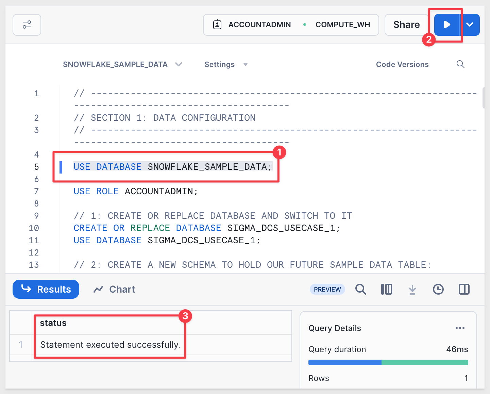

author: pballai
id: embedding_13_connection_swapping
summary: embedding_13_connection_swapping
categories: Embedding
environments: web
status: Published
feedback link: https://github.com/sigmacomputing/sigmaquickstarts/issues
tags: default
lastUpdated: 2024-04-30

# Embedding 13: Connection Swapping
<!-- The above name is what appears on the website and is searchable. -->

## Overview 
Duration: 5 

This QuickStart introduces and demonstrates Sigma embedding using Dynamic Connection Swapping **(DCS)**. 

This QuickStart assumes you have already taken the [QuickStart Embedding 1: Prerequisites](https://quickstarts.sigmacomputing.com/guide/embedding_01_prerequisites/index.html?index=..%2F..index#0) so that you have a sample environment to complete the tasks in this QuickStart.

We also recommend you take the the [QuickStart Embedding 3: Secure Embedding](https://quickstarts.sigmacomputing.com/guide/embedding_03_secure_access/index.html?index=..%2F..index#0) as we will build on that content. 

<aside class="positive">
<strong>IMPORTANT:</strong><br> Some steps may not be shown in detail as we assume you have taken these other two QuickStarts or are familiar with Sigma workflows.
</aside>

DCS with Sigma can be efficiently managed through embedding parameters, specifically the parameter:

```code
:eval_connection_id=<connection_id> 
```

This parameter, when added to an embed URL, allows the embedded Sigma application to dynamically switch the Sigma connection used for queries, based on the specified `connectionId.`

This functionality is particularly useful in environments where different users or groups require access to **different data sources that share the same schema.**

### Key Features and Benefits:
 <ul>
      <li><strong>Seamless Integration:</strong> By simply appending the ":eval_connection_id" parameter to the embed URL, the Sigma application can change it's data source without requiring any changes to the dashboard or report setup.</li>
      <li><strong>Dynamic Data Access:</strong> This feature enhances flexibility for data isolation options as well as requiring fewer workbooks.</li>
</ul>   
     
### Important Caveats:
<ul>
      <li><strong>Different Schema / Same Structure :</strong> The structure of the tables, the columns, and other objects within these schemas must be identical.</li>
      <li><strong>Limited to Read-Only Features:</strong> The dynamic connection swapping feature is limited to read-only operations. It does not support writeback features like materialization or input tables, which means any functions involving writing data back to the database cannot use this dynamic switching mechanism.</li>
      <li><strong>Overrides User-Attributes:</strong> Using this parameter will override any configurations set via user attributes for warehouse or role switching within Sigma. This means the connection specified in the URL takes precedence over any user-specific settings.</li>
      <li><strong>Scheduled Exports:</strong> The data connection used will be the one specified in the URL at the time the schedule was created or last modified.</li>
      <li><strong>Immediate Exports:</strong> Immediate data exports will utilize the connection specified in the current embed URL.</li>
      <li><strong>Session Consistency:</strong> Throughout an embed session, any workbook opened will utilize the connectionId provided in the embed URL, ensuring consistency in data source usage.</li>
</ul>

### Implementation Considerations:
When implementing dynamic connection swapping, it is crucial to ensure that all embed URLs are correctly formatted with the appropriate `connectionId` to maintain data integrity and security. Additionally, understanding the limitations and behaviors (listed above) related to exports and overrides is essential for effective use of this feature.

 ### Target Audience
Semi-technical users who will be aiding in the planning or implementation of Sigma. Limited SQL and technical data skills are needed to do this QuickStart. It does assume some common computer skills like installing software, using Terminal, navigating folders and edit/copy/paste operations.

### Prerequisites

<ul>
  <li>A computer with a current browser. It does not matter which browser you want to use.</li>
  <li>Access to your Sigma environment. A Sigma trial environment is acceptable and preferred.</li>
  <li>A working web server based on Node.js as demonstrated in the QuickStart Embedding 1: Prerequisites.</li>
  <li>Some content to embed. You can embed a workbook, page, table or visualization.</li>
  <li>Snowflake account(s) with the proper administrative and security admin access.</li>
</ul>

<aside class="postive">
<strong>IMPORTANT:</strong><br> Sigma recommends that you do not use production resources when doing QuickStarts.
</aside>

<button>[Sigma Free Trial](https://www.sigmacomputing.com/free-trial/)</button> <button>[Snowflake Free Trial](https://signup.snowflake.com/)</button>

<ul>
  <li></li>
    <li>Node.js and required Packages (all free, discussed in prior QuickStarts in detail):
        <ul>
        <li>Express</li>
        <li>Node-supervisor</li>
        <li>crypto (included with Node.js installation)</li>
        </ul>
    </li>
</ul>

### What You’ll Learn
The exercises in this QuickStart will discuss and walk you through the steps to implement DCS in two different use cases.

### What You’ll Build
We will embed Sigma content inside a Node.js web application, passing runtime parameters to configure the embed and demonstrate using different Sigma connections, based on passed `connectionId`.


## Typical Use Cases
Duration: 20

Sigma DCS supports the common multi-tenant architectures widely used by businesses today to provide portal access while ensuring data separation.

The most common examples of this are:

### Primary Use Case: 

**Per-customer Snowflake accounts:**<br>
This works just using eval_connection_id. Must have the same database and schema names AND column structure. If names differ, custom user attributes (**UA**) are required.

### Other Use Cases:

**1: One Snowflake account, per customer databases:**<br>
This requires eval_connection_id, UA for database name and custom SQL to fetch the data.

**2: One Snowflake account, single database, per customer schema:**<br>
Can be solved with just UA and custom SQL.

**3: Two Snowflake accounts with databases and/or schema that has same structure but different names:**<br>
Can be solved with just UA and custom SQL.

There are more variations of "other use cases" but these are the ones that are most commonly seen. 

The basic design pattern with DCS and UA provides flexibility to allow customers to select the model that best suits their architectural needs. 


<!-- END OF SECTION-->

## Use case 1: per-customer Snowflake accounts
Duration: 20

Imagine a scenario where Sigma content is embedded into a customer's SaaS application that used os by multiple clients. 

Each client accesses the same type of data (e.g., store sales data) but their data is stored in two distinct Snowflake accounts. 

The database name and schema names are the same for both clients. 

Each new client is on-boarded with a new Snowflake account.

For our demonstration, lets assume the SaaS provider is a national retail distributor who has clients who sell goods in specific regions of the United States. 

The distributor has a client portal they want to embed Sigma in. 

They prefer that all clients use a common dashboard to ease training, support and related development work, as new clients are on-boarded. 

There are two clients, `Client_A` only sells in the eastern region of the US. `Client_B` only in the south.

The data consists of typical retail store sales data.

Each client has a `STORE_SALES` table with the same structure, but the sales data is specific to each client. 

### The source data

To accomplish this, we will use two Snowflake accounts and create a common database that has the same schema in each account.

<aside class="negative">
<strong>NOTE:</strong><br> If you don't have access to two Snowflake accounts, that's fine; simply follow along, as the steps are straightforward.
</aside>


<!-- END OF SECTION-->

## Snowflake Configuration
Duration: 20

We have created the following Snowflake script to automate the process of creating users, roles and sample data, so that it is easy for us to demonstrate DCS.

<aside class="negative">
<strong>NOTE:</strong><br> It is recommended to run commands one at a time to ensure success.
</aside>

For example, in the screenshot below we highlight the command `USE ROLE ACCOUNTADMIN` and click the run icon in the upper right corner:



If you are familiar with Snowflake scripts, you can just highlight rows `1-97` and click the run icon.

First, log into the first Snowflake account as `ACCOUNTADMIN`.

Open a new `Worksheet`.

Copy and paste this code into the worksheet:
```code
// ----------------------------------------------------------------------------------------------------------
// SECTION 1: DATA CONFIGURATION
// ----------------------------------------------------------------------------------------------------------

USE ROLE ACCOUNTADMIN;

// 1: CREATE OR REPLACE DATABASE AND SWITCH TO IT
CREATE OR REPLACE DATABASE SIGMA_DCS_USECASE_1;
USE DATABASE SIGMA_DCS_USECASE_1;

// 2: CREATE A NEW SCHEMA TO HOLD OUR FUTURE SAMPLE DATA TABLE:
CREATE SCHEMA IF NOT EXISTS CLIENTS;

// 3: CREATE THE SAMPLE DATA TABLE SCHEMA
CREATE OR REPLACE TABLE CLIENTS.STORE_SALES (
    CLIENT_NAME VARCHAR,
    STORE_REGION VARCHAR,
    ORDER_NUMBER VARCHAR,
    DATE TIMESTAMP,
    SKU_NUMBER VARCHAR,
    QUANTITY INT,
    COST FLOAT,
    PRICE FLOAT,
    COGS FLOAT,
    SALES FLOAT,
    PROFIT FLOAT,
    PROFIT_MARGIN FLOAT,
    PRODUCT_TYPE VARCHAR,
    PRODUCT_FAMILY VARCHAR,
    PRODUCT_LINE VARCHAR,
    BRAND VARCHAR,
    PRODUCT_NAME VARCHAR,
    STORE_NAME VARCHAR,
    STORE_KEY VARCHAR,
    STORE_STATE VARCHAR,
    STORE_CITY VARCHAR,
    STORE_ZIP_CODE VARCHAR,
    STORE_LATITUDE FLOAT,
    STORE_LONGITUDE FLOAT,
    CUST_KEY INT,
    CUSTOMER_NAME VARCHAR,
    DAY VARCHAR,
    WEEK VARCHAR,
    MONTH VARCHAR,
    QUARTER VARCHAR,
    YEAR VARCHAR
);

// 4: CREATE STAGES FOR EXTERNAL STORAGE OF CSV FILES
CREATE STAGE IF NOT EXISTS CLIENT_A_DATA URL='s3://sigma-quickstarts-main/embedding_2/Client_A_Store_Sales.csv';

// 5: CSV FORMAT TO HANDLE HEADER ROW IN DATA FILES
CREATE OR REPLACE FILE FORMAT my_csv_format
  TYPE = 'CSV'
  FIELD_DELIMITER = ','
  SKIP_HEADER = 1   -- Skip the first line of the file
  FIELD_OPTIONALLY_ENCLOSED_BY = '"'
  ESCAPE_UNENCLOSED_FIELD = 'NONE'
  NULL_IF = ('NULL', 'null');

// 6: COPY DATA FROM STAGE TO RESPECTIVE TABLE
COPY INTO CLIENTS.STORE_SALES FROM @CLIENT_A_DATA FILE_FORMAT= my_csv_format;

// 7: CONFIRM DATA IS LANDED IN SNOWFLAKE TABLE:
SELECT * FROM CLIENTS.STORE_SALES; //EAST

// ----------------------------------------------------------------------------------------------------------
// SECTION 2: ROLE AND USER CONFIGURATION
// ----------------------------------------------------------------------------------------------------------

// 1: CREATE ROLES FOR OUR USE CASES:
CREATE OR REPLACE ROLE CLIENT_A;

// 2: CREATE USERS FOR EACH CLIENT
CREATE USER IF NOT EXISTS CLIENT_A_USER PASSWORD = 'StrongPassword2!';

// 3: GRANT ROLES TO USERS
GRANT ROLE CLIENT_A TO USER CLIENT_A_USER;

// 4: GRANT USAGE ON WAREHOUSE COMPUTE_WH TO ROLES
GRANT USAGE ON WAREHOUSE COMPUTE_WH TO ROLE CLIENT_A;

// 5: GRANT USAGE PERMISSION ON THE DATABASE TO NEW ROLES:
GRANT USAGE ON DATABASE SIGMA_DCS_USECASE_1 TO ROLE CLIENT_A;

// 6: GRANT USAGE ON SCHEMA TO NEW ROLES:
GRANT USAGE ON SCHEMA SIGMA_DCS_USECASE_1.CLIENTS TO ROLE CLIENT_A;

// 7: ALLOW NEW ROLES TO QUERY TABLES WE CREATED:
GRANT SELECT ON ALL TABLES IN SCHEMA SIGMA_DCS_USECASE_1.CLIENTS TO ROLE CLIENT_A;

// ----------------------------------------------------------------------------------------------------------
// SECTION 5:  TESTING
// ----------------------------------------------------------------------------------------------------------

// 1: 
SELECT * FROM SIGMA_DCS_USECASE_1.CLIENTS.STORE_SALES; // SHOULD SHOW ROW DATA
```

Execute the script. When it completes, you will see some row data:


<aside class="negative">
<strong>NOTE:</strong><br> A small sample dataset is provided automatically when running each of these scripts.
</aside>

#### Second Snowflake account
We want to perform the same operations in the second account, adjusting the Snowflake script to load a different set of data into the same structure.

Log into a second Snowflake account as `ACCOUNTADMIN` and paste this script into a new Worksheet:
```code
// ----------------------------------------------------------------------------------------------------------
// SECTION 1: DATA CONFIGURATION
// ----------------------------------------------------------------------------------------------------------

USE ROLE ACCOUNTADMIN;

// 1: CREATE OR REPLACE DATABASE AND SWITCH TO IT
CREATE OR REPLACE DATABASE SIGMA_DCS_USECASE_1;
USE DATABASE SIGMA_DCS_USECASE_1;

// 2: CREATE A NEW SCHEMA TO HOLD OUR FUTURE SAMPLE DATA TABLE:
CREATE SCHEMA IF NOT EXISTS CLIENTS;

// 3: CREATE THE SAMPLE DATA TABLE SCHEMA
CREATE OR REPLACE TABLE CLIENTS.STORE_SALES (
    CLIENT_NAME VARCHAR,
    STORE_REGION VARCHAR,
    ORDER_NUMBER VARCHAR,
    DATE TIMESTAMP,
    SKU_NUMBER VARCHAR,
    QUANTITY INT,
    COST FLOAT,
    PRICE FLOAT,
    COGS FLOAT,
    SALES FLOAT,
    PROFIT FLOAT,
    PROFIT_MARGIN FLOAT,
    PRODUCT_TYPE VARCHAR,
    PRODUCT_FAMILY VARCHAR,
    PRODUCT_LINE VARCHAR,
    BRAND VARCHAR,
    PRODUCT_NAME VARCHAR,
    STORE_NAME VARCHAR,
    STORE_KEY VARCHAR,
    STORE_STATE VARCHAR,
    STORE_CITY VARCHAR,
    STORE_ZIP_CODE VARCHAR,
    STORE_LATITUDE FLOAT,
    STORE_LONGITUDE FLOAT,
    CUST_KEY INT,
    CUSTOMER_NAME VARCHAR,
    DAY VARCHAR,
    WEEK VARCHAR,
    MONTH VARCHAR,
    QUARTER VARCHAR,
    YEAR VARCHAR
);

// 4: CREATE STAGES FOR EXTERNAL STORAGE OF CSV FILES
CREATE STAGE IF NOT EXISTS CLIENT_B_DATA URL='s3://sigma-quickstarts-main/embedding_2/Client_B_Store_Sales.csv';

// 5: CSV FORMAT TO HANDLE HEADER ROW IN DATA FILES
CREATE OR REPLACE FILE FORMAT my_csv_format
  TYPE = 'CSV'
  FIELD_DELIMITER = ','
  SKIP_HEADER = 1   -- Skip the first line of the file
  FIELD_OPTIONALLY_ENCLOSED_BY = '"'
  ESCAPE_UNENCLOSED_FIELD = 'NONE'
  NULL_IF = ('NULL', 'null');

// 6: COPY DATA FROM STAGE TO RESPECTIVE TABLE
COPY INTO CLIENTS.STORE_SALES FROM @CLIENT_B_DATA FILE_FORMAT= my_csv_format;

// 7: CONFIRM DATA IS LANDED IN SNOWFLAKE TABLE:
SELECT * FROM CLIENTS.STORE_SALES; //EAST

// ----------------------------------------------------------------------------------------------------------
// SECTION 2: ROLE AND USER CONFIGURATION
// ----------------------------------------------------------------------------------------------------------

// 1: CREATE ROLES FOR OUR USE CASES:
CREATE OR REPLACE ROLE CLIENT_B;

// 2: CREATE USERS FOR EACH CLIENT
CREATE USER IF NOT EXISTS CLIENT_B_USER PASSWORD = 'StrongPassword1!';

// 3: GRANT ROLES TO USERS
GRANT ROLE CLIENT_B TO USER CLIENT_B_USER;

// 4: GRANT USAGE ON WAREHOUSE COMPUTE_WH TO ROLES
GRANT USAGE ON WAREHOUSE COMPUTE_WH TO ROLE CLIENT_B;

// 5: GRANT USAGE PERMISSION ON THE DATABASE TO NEW ROLES:
GRANT USAGE ON DATABASE SIGMA_DCS_USECASE_1 TO ROLE CLIENT_B;

// 6: GRANT USAGE ON SCHEMA TO NEW ROLES:
GRANT USAGE ON SCHEMA SIGMA_DCS_USECASE_1.CLIENTS TO ROLE CLIENT_B;

// 7: ALLOW NEW ROLES TO QUERY TABLES WE CREATED:
GRANT SELECT ON ALL TABLES IN SCHEMA SIGMA_DCS_USECASE_1.CLIENTS TO ROLE CLIENT_B;

// ----------------------------------------------------------------------------------------------------------
// SECTION 5:  TESTING
// ----------------------------------------------------------------------------------------------------------

// 1: 
SELECT * FROM SIGMA_DCS_USECASE_1.CLIENTS.STORE_SALES; // SHOULD SHOW ROW DATA
```

Execute the script and verify the data show rows for `Client_B`:


Once Snowflake is configured, we can move on to the Sigma configuration.


<!-- END OF SECTION-->

## Sigma Configuration 
Duration: 20

Log into Sigma as `Administrator`.

### Create Connections:<br>
Create a new connection in `Administration` > `Connections` and configure it for the `SIGMA_DCS_USECASE_1` database.

Recall that the `Role`, `User` and `Password` were specified in each Snowflake script. 

Here they are again for convenience:

#### CLIENT_A - Snowflake Account 1:
User: CLIENT_A_USER<br>
Role: CLIENT_A<br>
Password: StrongPassword1!

Create another connection for `Client_B`:

#### CLIENT_B - Snowflake Account 2:
User: CLIENT_B_USER<br>
Role: CLIENT_B<br>
Password: StrongPassword2!


Verify both connections are providing the expected data isolation by clicking the `Browse Connection` button:


Click the `Explore` button to open the `STORE_SALES` table in a new Sigma workbook. It does not matter if you were browsing the `Client_A` or `Client_B` connection. 

Rename the `Page 1` tab to `Use Case 1`.

Use the `Save As` button to create the new workbook named `DCS QuickStart`. 


### Create Teams
Navigation to `Administration` > `Teams` and create add the `CLIENT_A` and `CLIENT_B` teams.


No need to assign anyone to these teams now. 

<aside class="positive">
<strong>IMPORTANT:</strong><br> Users are added automatically to Sigma, when coming in via the embedding integration. They will be  added to the user database, assigned to the specified team and permissions by the Embed API. You will not have to manage Sigma embed users separately from your existing user management system, saving you time.
</aside>

### Share with Team
To be able to test this workbook, we need to share it with the two team. 

In the drop menu for the workbook, click `Share`:


Add the `CLIENT_A` and `CLIENT_B` teams. Det the permission to `Can View` and select `Share`:


### Embed Configuration

Click as shown to access the `Embedding` options:


Select `Embed Path` and select the workbook page `Use Case 1`. Copy the `Embed path` url to a text file. We will use that later. 


### Connection IDs
Before we try to test the embed, we need to get the ID of each of our Snowflake connections.

Navigate to `Administration` > `Connections` and select the `Client_A` connection. 

The ID for `Client_A` is shown in the URL:


For example, the id for this example is (your's will be different):
```code
e168cc27-50e9-4de3-81b6-32c8ff17d3b1
```

Copy this connectionId off to a text file for use later.

Do the same for `Client_B`.


<!-- END OF SECTION-->

## Testing
For testing, we will use the same Node.js framework that was setup during the [QuickStart: Embedding 01: Prerequisites.](https://quickstarts.sigmacomputing.com/guide/embedding_01_prerequisites/index.html?index=..%2F..index#0)

You will also need to provide embed client credentials. It is fine to reuse one that you created during the prerequisite QuickStart. 

If you have not created [embed client credentials](https://help.sigmacomputing.com/docs/generate-embed-client-credentials) yet, go back and do that. 

To save time, we have provided the required project files for download.

Download the [project files here](https://sigma-quickstarts-main.s3.us-west-1.amazonaws.com/embedding_2/sigma_DCS.zip)

Unzip the folder `sigma_DCS.zip` and open a Terminal session from it (right-click and select `):


Run the command:
```code
supervisor embed-api.js
```

The expected response is:


Open the file `embed-api.js` and change the values for `YOUR_EMBED_PATH`, `YOUR_EMBED_SECRET` and `YOUR_CLIENT_ID` for your configuration.

Save the changes.

Scroll to section #5 in the file and study the searchParams for `Client A` and `Client B`. They are very similar, but not the same.

For this use case, we will only be changing the value for `connectionId`, **using your values.**

Update the values for each client's `eval_connection_id`, using values for each `connectionId` that was created earlier in this QuickStart. 

All other value can remain the same:


Client B's searchParams are all commented out, so when we check our embed in the browser, we will see only values for `Client_A` as that is the connectionId we are passing to Sigma.

```code 
localhost:3000
```


Commenting out the `Client A` lines and uncommenting the `Client B` lines will result in only `Client_B` rows appearing:


Save the file `embed-api.js`.

Refreshing the browser for the embed results in `Client_B` data being displayed from the second Snowflake connection:


We can now deploy a Sigma dashboard that is shared across multiple clients, ensuring data isolation through dynamic connection swapping in Sigma.


<!-- END OF SECTION-->

## Use case 2: One Snowflake account, per customer databases
Duration: 20

For this use case, we will reuse much of the previous exercises learning, but in this example, we will have two Snowflake accounts that has one customer database but **different schema names** (column structure is still common).

For example, in our first use case, both clients use the same schema name of `CLIENTS`. In this next example, the customer has a schema name that represents the clients actual name. For example, the schema for the yet to be created client_D will look like this:


To support this use case we will need to use DCS, Sigma custom user attributes and custom SQL to ensure data isolation.

<aside class="positive">
<strong>IMPORTANT:</strong><br> The ability to create and pass custom user attributes provides a great deal of design flexibility. This use case is a simple example of using one user attribute (to account for different schema names) but this method can be extended to suite a variety of use cases.
</aside>

### How it works

When a Client_C user logs into the SaaS application, the application determines that the user belongs to Client_C (for example). 

The embed URL for the Sigma dashboard is dynamically generated (by the [Embed API](https://help.sigmacomputing.com/docs/example-embed-api-and-url)) to include two user attributes:

```code
:eval_connection_id=<connectionId for client_c>; 
:ua_schema_name=<schema name for client_c>;
...other user related attributes like team, email address and so on.
```

**Client_D user:** 
Similarly, when another user logs in and they belong to Client-D, their embed URL includes:
```code
:eval_connection_id=<connectionId for_Client_d>; 
:ua_schema_name=<schema name for Client_d>;
...other user related attributes like team, email address and so on.
```

### Result
Each user sees data only from their respective schema, despite the schema names being different. This works to ensure data security and privacy. 

Both users experience the same dashboard functionality because the underlying data structure is consistent across schemas.


<!-- END OF SECTION-->

## Snowflake Configuration
We have created the following Snowflake scripts to automate the process of creating users, roles and sample data, so that it is easy for us to demonstrate this use case. 

<aside class="positive">
<strong>IMPORTANT:</strong><br> To avoid overlap with use case 1, we will be using "Client_C" and "Client_D" for this use case.
</aside>

If you are familiar with Snowflake scripts, highlight rows `1-100` and click the run icon.

Copy and paste this code into a new Snowflake Worksheet for Client_C:
```code
// ----------------------------------------------------------------------------------------------------------
// SECTION 1: DATA CONFIGURATION
// ----------------------------------------------------------------------------------------------------------

USE ROLE ACCOUNTADMIN;

// 1: CREATE OR REPLACE DATABASE AND SWITCH TO IT
CREATE OR REPLACE DATABASE SIGMA_DCS_USECASE_2;
USE DATABASE SIGMA_DCS_USECASE_2;

// DROP DATABASE SIGMA_DCS_USECASE_2;

// 2: CREATE A NEW SCHEMA TO HOLD OUR FUTURE SAMPLE DATA TABLE:
CREATE SCHEMA IF NOT EXISTS CLIENT_C;

CREATE OR REPLACE TABLE CLIENT_C.STORE_SALES (
    CLIENT_NAME VARCHAR,
    STORE_REGION VARCHAR,
    ORDER_NUMBER VARCHAR,
    DATE TIMESTAMP,
    SKU_NUMBER VARCHAR,
    QUANTITY INT,
    COST FLOAT,
    PRICE FLOAT,
    COGS FLOAT,
    SALES FLOAT,
    PROFIT FLOAT,
    PROFIT_MARGIN FLOAT,
    PRODUCT_TYPE VARCHAR,
    PRODUCT_FAMILY VARCHAR,
    PRODUCT_LINE VARCHAR,
    BRAND VARCHAR,
    PRODUCT_NAME VARCHAR,
    STORE_NAME VARCHAR,
    STORE_KEY VARCHAR,
    STORE_STATE VARCHAR,
    STORE_CITY VARCHAR,
    STORE_ZIP_CODE VARCHAR,
    STORE_LATITUDE FLOAT,
    STORE_LONGITUDE FLOAT,
    CUST_KEY INT,
    CUSTOMER_NAME VARCHAR,
    DAY VARCHAR,
    WEEK VARCHAR,
    MONTH VARCHAR,
    QUARTER VARCHAR,
    YEAR VARCHAR
);

// 4: CREATE STAGES FOR EXTERNAL STORAGE OF CSV FILES
CREATE STAGE IF NOT EXISTS CLIENT_C_DATA URL='s3://sigma-quickstarts-main/embedding_2/Client_C_Store_Sales.csv';

// 5: CSV FORMAT TO HANDLE HEADER ROW IN DATA FILES
CREATE OR REPLACE FILE FORMAT my_csv_format
  TYPE = 'CSV'
  FIELD_DELIMITER = ','
  SKIP_HEADER = 1   -- Skip the first line of the file
  FIELD_OPTIONALLY_ENCLOSED_BY = '"'
  ESCAPE_UNENCLOSED_FIELD = 'NONE'
  NULL_IF = ('NULL', 'null');

// 6: COPY DATA FROM STAGE TO RESPECTIVE TABLES
COPY INTO CLIENT_C.STORE_SALES FROM @CLIENT_C_DATA FILE_FORMAT= my_csv_format;

// ----------------------------------------------------------------------------------------------------------
// SECTION 2: ROLE AND USER CONFIGURATION
// ----------------------------------------------------------------------------------------------------------

// 1: CREATE ROLES FOR OUR USE CASES:
CREATE OR REPLACE ROLE CLIENT_C;
CREATE OR REPLACE ROLE CLIENT_D;

// 2: CREATE USERS FOR EACH CLIENT
CREATE OR REPLACE USER CLIENT_C_USER PASSWORD = 'StrongPassword1!';

// 3: GRANT ROLES TO USERS
GRANT ROLE CLIENT_C TO USER CLIENT_C_USER;

// 4: GRANT USAGE ON WAREHOUSE COMPUTE_WH TO ROLES
GRANT USAGE ON WAREHOUSE COMPUTE_WH TO ROLE CLIENT_C;

// 5: GRANT USAGE PERMISSION ON THE DATABASE TO NEW ROLES:
GRANT USAGE ON DATABASE SIGMA_DCS_USECASE_2 TO ROLE CLIENT_C;

// 6: GRANT USAGE ON SCHEMA TO NEW ROLES:
GRANT USAGE ON SCHEMA CLIENT_C TO ROLE CLIENT_C;

// 7: ALLOW NEW ROLES TO QUERY TABLES WE CREATED:
GRANT SELECT ON ALL TABLES IN SCHEMA CLIENT_C TO ROLE CLIENT_C;

// ----------------------------------------------------------------------------------------------------------
// SECTION 5: QUICK TEST
// ----------------------------------------------------------------------------------------------------------

// 2: VERIFY DATA LANDED
// SELECT * FROM SIGMA_DCS_USECASE_2.CLIENT_C.STORE_SALES; // SHOULD SHOW ROW DATA FOR CLIENT_C
```

In the second Snowflake account, run this script for Client_D:
```code
// ----------------------------------------------------------------------------------------------------------
// SECTION 1: DATA CONFIGURATION
// ----------------------------------------------------------------------------------------------------------

USE ROLE ACCOUNTADMIN;

// 1: CREATE OR REPLACE DATABASE AND SWITCH TO IT
CREATE OR REPLACE DATABASE SIGMA_DCS_USECASE_2;
USE DATABASE SIGMA_DCS_USECASE_2;

// DROP DATABASE SIGMA_DCS_USECASE_2;

// 2: CREATE A NEW SCHEMA TO HOLD OUR FUTURE SAMPLE DATA TABLE:
CREATE SCHEMA IF NOT EXISTS CLIENT_D;

CREATE OR REPLACE TABLE CLIENT_D.STORE_SALES (
    CLIENT_NAME VARCHAR,
    STORE_REGION VARCHAR,
    ORDER_NUMBER VARCHAR,
    DATE TIMESTAMP,
    SKU_NUMBER VARCHAR,
    QUANTITY INT,
    COST FLOAT,
    PRICE FLOAT,
    COGS FLOAT,
    SALES FLOAT,
    PROFIT FLOAT,
    PROFIT_MARGIN FLOAT,
    PRODUCT_TYPE VARCHAR,
    PRODUCT_FAMILY VARCHAR,
    PRODUCT_LINE VARCHAR,
    BRAND VARCHAR,
    PRODUCT_NAME VARCHAR,
    STORE_NAME VARCHAR,
    STORE_KEY VARCHAR,
    STORE_STATE VARCHAR,
    STORE_CITY VARCHAR,
    STORE_ZIP_CODE VARCHAR,
    STORE_LATITUDE FLOAT,
    STORE_LONGITUDE FLOAT,
    CUST_KEY INT,
    CUSTOMER_NAME VARCHAR,
    DAY VARCHAR,
    WEEK VARCHAR,
    MONTH VARCHAR,
    QUARTER VARCHAR,
    YEAR VARCHAR
);

// 4: CREATE STAGES FOR EXTERNAL STORAGE OF CSV FILES
CREATE STAGE IF NOT EXISTS CLIENT_D_DATA URL='s3://sigma-quickstarts-main/embedding_2/Client_D_Store_Sales.csv';

// 5: CSV FORMAT TO HANDLE HEADER ROW IN DATA FILES
CREATE OR REPLACE FILE FORMAT my_csv_format
  TYPE = 'CSV'
  FIELD_DELIMITER = ','
  SKIP_HEADER = 1   -- Skip the first line of the file
  FIELD_OPTIONALLY_ENCLOSED_BY = '"'
  ESCAPE_UNENCLOSED_FIELD = 'NONE'
  NULL_IF = ('NULL', 'null');

// 6: COPY DATA FROM STAGE TO RESPECTIVE TABLES
COPY INTO CLIENT_D.STORE_SALES FROM @CLIENT_D_DATA FILE_FORMAT= my_csv_format;

// ----------------------------------------------------------------------------------------------------------
// SECTION 2: ROLE AND USER CONFIGURATION
// ----------------------------------------------------------------------------------------------------------

// 1: CREATE ROLES FOR OUR USE CASES:
CREATE OR REPLACE ROLE CLIENT_D;
CREATE OR REPLACE ROLE CLIENT_D;

// 2: CREATE USERS FOR EACH CLIENT
CREATE OR REPLACE USER CLIENT_D_USER PASSWORD = 'StrongPassword2!';

// 3: GRANT ROLES TO USERS
GRANT ROLE CLIENT_D TO USER CLIENT_D_USER;

// 4: GRANT USAGE ON WAREHOUSE COMPUTE_WH TO ROLES
GRANT USAGE ON WAREHOUSE COMPUTE_WH TO ROLE CLIENT_D;

// 5: GRANT USAGE PERMISSION ON THE DATABASE TO NEW ROLES:
GRANT USAGE ON DATABASE SIGMA_DCS_USECASE_2 TO ROLE CLIENT_D;

// 6: GRANT USAGE ON SCHEMA TO NEW ROLES:
GRANT USAGE ON SCHEMA CLIENT_D TO ROLE CLIENT_D;

// 7: ALLOW NEW ROLES TO QUERY TABLES WE CREATED:
GRANT SELECT ON ALL TABLES IN SCHEMA CLIENT_D TO ROLE CLIENT_D;

// ----------------------------------------------------------------------------------------------------------
// SECTION 5: QUICK TEST
// ----------------------------------------------------------------------------------------------------------

// 2: VERIFY DATA LANDED
// SELECT * FROM SIGMA_DCS_USECASE_2.CLIENT_D.STORE_SALES; // SHOULD SHOW ROW DATA FOR CLIENT_D
```

Once Snowflake is configured, we can move on to Sigma.


<!-- END OF SECTION-->

## Sigma Configuration 
While the steps are similar to the first use case, there are a few adjustments we will need to make along the way:

 <ul>
      <li>Add new custom user attribute for schema name.</li>
      <li>Add new connections in Sigma.</li>
      <li>Adjust the `DCS QuickStart` workbook that we created earlier, adding a new page called `Use Case 2`.</li>
      <li>Create a new embed path for the new workbook page.</li>
      <li>Create new client teams.</li>
      <li>Download and adjust new project files.</li>
</ul>

Log into Sigma as `Administrator`.

### Create Custom User Attributes
Navigate in Sigma to  > `Administration` > `User Attributes` and click `Create Attribute`:


For Name, use `schema_name`, provide a useful description and the `Default Value` to `CLIENT_C`:


### Create Connections:<br>
Create two new connections in `Administration` > `Connections` and configure them for the `SIGMA_DCS_USECASE_2` databases.

Name the first connection `DCS QuickStart Use Case 2`.

Recall that the `Role`, `User` and `Password` values where specified in the Snowflake script.

Here they are again for convenience:

#### CLIENT_C - Snowflake Account 1:
User: CLIENT_C_USER<br>
Role: CLIENT_C<br>
Password: StrongPassword1!

Create another connection for `Client_B`:

#### CLIENT_D - Snowflake Account 2:
User: CLIENT_D_USER<br>
Role: CLIENT_D<br>
Password: StrongPassword2!

Verify the connection is providing the expected data isolation by clicking the `Browse Connection` button:


Create the another connection to the same Snowflake account, but use the `User` and `Role` for `Client_D`.

### Connection IDs
Before we try to test the embed, we need to get the ID of each of our client connections.

Navigate to `Administration` > `Connections` and select the `Client_C` connection. The ID for Client_C is shown in the URL:


For example, the id for this example is (your's will be different):
```code
e168cc27-50e9-4de3-81b6-32c8ff17d3b1
```

Copy this and the connectionId for the "Client_D" connection off to a text file for use later.

### Create Teams
Navigation to `Administration` > `Teams` and create add the `CLIENT_C` and `CLIENT_D` teams.


No need to assign anyone to these teams now. 

<aside class="positive">
<strong>IMPORTANT:</strong><br> Users are added automatically to Sigma, when coming in via the embedding integration. They will be  added to the user database, assigned to the specified team and permissions by the Embed API. You will not have to manage Sigma embed users separately from your existing user management system, saving you time.
</aside>

### Share with Team
Return the the `DCS QuickStart` workbook.

To be able to test this workbook, we need to share it with the two team. 

In the drop menu for the workbook, click `Share`:

Add the `CLIENT_C` and `CLIENT_D` teams. Det the permission to `Can View` and select `Share`:


### Common Dashboard
Place the workbook in `edit` mode.

Add a new `page` and rename it to `Use Case 2`.

Add a new `TABLE` > `NEW` > `WRITE SQL` and select the connection for `Client_C`.

Paste the following SQL statement in the area `Enter Custom SQL`:
```code
SELECT * FROM SIGMA_DCS_USECASE_2.{{#raw system::CurrentUserAttributeText::schema_name}}.STORE_SALES
```

Click `Run` to see the results:


We see rows for `Client_C` only. This is because we set the default value for the custom user attribute `schema_name` to `CLIENT_C`.

Click `Save`.

Click `Publish` in the workbook `DCS QuickStart`.

### Embed Configuration

Click as shown to access the `Embedding` options:


Select `Use Case 2`, and then copy the url off to a text file. We will use that shortly. 


## Testing

<aside class="negative">
<strong>NOTE:</strong><br> If you already completed the first use case, you can skip to the "Start Testing" section below.
</aside>

For testing, we will use the same Node.js framework that was setup during the [QuickStart: ](https://quickstarts.sigmacomputing.com/guide/embedding_01_prerequisites/index.html?index=..%2F..index#0).

You will also need to provide embed client credentials. It is fine to reuse one that you created during the prerequisite QuickStart. 

If you have not created [embed client credentials](https://help.sigmacomputing.com/docs/generate-embed-client-credentials) yet, go back and do that. 

### Start Testing

<aside class="negative">
<strong>NOTE:</strong><br> If you have left the Terminal session open from the first use case, exit that to free up the port 3000 we will be using to test.
</aside>

Download the [project files for this use case here:](https://sigma-quickstarts-main.s3.us-west-1.amazonaws.com/embedding_2/sigma_DCS_2.zip)

Unzip the folder `sigma_DCS_Usecase_2.zip` and open a Terminal session from it (right-click and select `):


Run the command:
```code
supervisor embed-api.js
```

The expected response is:


Open the file `embed-api.js` and update the values for `YOUR_EMBED_PATH`, `YOUR_EMBED_SECRET` and `YOUR_CLIENT_ID` for your configuration.

`Save` the changes.

Scroll to `section #5` in the file and study the searchParams for `Client C` and `Client D`. They are very similar, but not the same.

Update the values for each client's eval_connection, using the `connectionId` that was created earlier in this QuickStart. 

All other value can remain the same:


Client D's searchParams are all commented out so when we check our embed in the browser, we will see only values for `Client_C` in the `East` region:
```code 
localhost:3000
```


Commenting out the `Client C` lines and uncommenting the `Client D` lines will result in only `Client_D` and `South` region rows to appear:

Save the file `embed-api.js`.

Refreshing the browser for the embed results in:


We are now able to deploy embedded Sigma content, and restrict different clients based on a single Snowflake account and per-customer schemas.


<!-- END OF WHAT WE COVERED -->

## What we've covered
Duration: 5

In this lab we learned how to setup Sigma embedding using Dynamic Connection Swapping with Snowflake and the different use-cases where it is useful.

<!-- THE FOLLOWING ADDITIONAL RESOURCES IS REQUIRED AS IS FOR ALL QUICKSTARTS -->
**Additional Resource Links**

[Blog](https://www.sigmacomputing.com/blog/)<br>
[Community](https://community.sigmacomputing.com/)<br>
[Help Center](https://help.sigmacomputing.com/hc/en-us)<br>
[QuickStarts](https://quickstarts.sigmacomputing.com/)<br>

Be sure to check out all the latest developments at [Sigma's First Friday Feature page!](https://quickstarts.sigmacomputing.com/firstfridayfeatures/)
<br>

[](https://twitter.com/sigmacomputing)&emsp;
[](https://www.linkedin.com/company/sigmacomputing)&emsp;
[](https://www.facebook.com/sigmacomputing)


<!-- END OF WHAT WE COVERED -->
<!-- END OF QUICKSTART -->