author: pballai
id: embedding_13_link_sharing_v3
summary: embedding_13_link_sharing_v3
categories: Embedding
environments: web
status: published
feedback link: https://github.com/sigmacomputing/sigmaquickstarts/issues
tags: default
lastUpdated: 2025-05-22

# Embedding 13: Link Sharing

## Overview 
Duration: 5 

Embedded link sharing allows users to share specific workbooks, explorations, or bookmarks via URLs generated within an embed while working in Sigma.

These links can be copied into user-generated emails (or other systems), allowing recipients to access the relevant content directly—without navigating back to Sigma.

These links are also included in any scheduled exports, allowing recipients to click through to the shared content.

Alternatively, developers can use these links to enhance their application's functionality.

### Use Cases
**Sharing the Entire Embedded Workbook:**
- Users can share a link that brings other users directly to the full embedded workbook within the customer’s application.

**Sharing an Exploration Created from an Embedded Workbook:**
- Users can share a specific exploration they’ve created within a workbook. The shared link opens the exact exploration view, preserving the context of the analysis.

**Sharing a Bookmark:**
- Users can create and share bookmarks, which preserves the state of a workbook or exploration at a specific point in time. The shared link brings recipients directly to the bookmarked view, ensuring the exact context and data state are preserved.

**Scheduling an Export of a Workbook:**
- Users can schedule an export of a workbook, exploration, or bookmark. The export emails include a link that directs recipients to the specific embedded content view, ensuring they access the relevant data directly from the email.

### Benefits of Embedded Link Sharing
**Enhanced Collaboration:**
- Users can share specific views, explorations, or bookmarks with their teams, ensuring that the exact context and state of the data are maintained.

**Consistency Across Platforms:**
- Shared links return recipients to the same embedded content within the customer’s application, whether it’s a full workbook, an exploration, or a bookmark.

### How It Works
Developers can trigger an iframe event in Sigma to set a `sharingLink` or `sharingExplorationLink`, and optionally include bookmarks.

This event allows Sigma to generate the appropriate link, which users can share. The link ensures that recipients access the exact workbook, exploration, or bookmarked view within the embedded Sigma environment.

We have provided inline annotations for the major code-blocks in:

**index.html:**
- Embeds the Sigma iframe
- Listens for exploreKey and bookmarkId events
- Updates the URL and shares links dynamically

**server.js:**
- Handles backend routing and serves static files
- Delegates JWT generation to embed-api.js

**embed-api.js:**
- Generates signed embed URLs with support for contextual sharing
- Append :explore=... and :bookmark=... to the embed URL if present
- Injects query parameters into the final Sigma embed URL

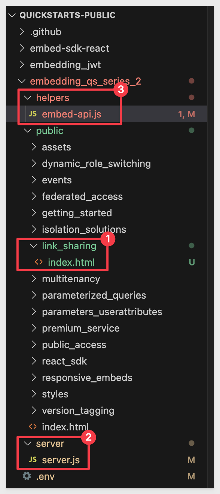

For more information, see [Configure a shareable link for an embed](https://help.sigmacomputing.com/docs/configure-a-shareable-link-for-an-embed)

<aside class="positive">
<strong>IMPORTANT:</strong><br> Some screens in Sigma may appear slightly different from those shown in QuickStarts. This is because Sigma continuously adds and enhances functionality. Rest assured, Sigma’s intuitive interface ensures that any differences will not prevent you from successfully completing any QuickStart.
</aside>

For more information on Sigma's product release strategy, see [Sigma product releases](https://help.sigmacomputing.com/docs/sigma-product-releases)

If something is not working as you expect, here's how to [contact Sigma support](https://help.sigmacomputing.com/docs/sigma-support)

### Target Audience
The typical audience for this QuickStart includes users of Excel, common Business Intelligence or Reporting tools, and semi-technical users who want to try out or learn Sigma.

### Prerequisites

In this QuickStart, we will use the local host application we created in [Embedding 01: Getting Started](https://quickstarts.sigmacomputing.com/guide/embedding_03_secure_access/index.html?index=..%2F..index#0)

<ul>
  <li>Any modern browser is acceptable.</li>
  <li>Access to your Sigma environment.</li>
  <li>Some familiarity with Sigma is assumed. Not all steps will be shown, as the basics are assumed to be understood.</li>
 </ul>

<aside class="positive">
<strong>IMPORTANT:</strong><br> Sigma recommends using non-production resources when completing QuickStarts.
</aside>

<button>[Sigma Free Trial](https://www.sigmacomputing.com/free-trial/)</button>

<aside class="negative">
<strong>IMPORTANT:</strong><br> Some features may carry a "Beta" tag. Beta features are subject to quick, iterative changes. As a result, the latest product version may differ from the contents of this document.
</aside>
 


## Sigma Workbook
Duration: 5 

We’ll move through this section quickly, assuming you've completed similar steps in the Getting Started QuickStart.

Log into Sigma as the `Administrator`, create a new workbook, and add a table element to the page.

Use the Sigma sample database to create a workbook containing one table.

Set the table’s source to `PLUGS_ELECTRONICS_HANDS_ON_LAB_DATA` from the `Sigma Sample Database` > `Retail` > `Plugs Electronics` schema.

Click `Save as` and name the workbook `Embedding 13: Link Sharing`.

Open the published version:

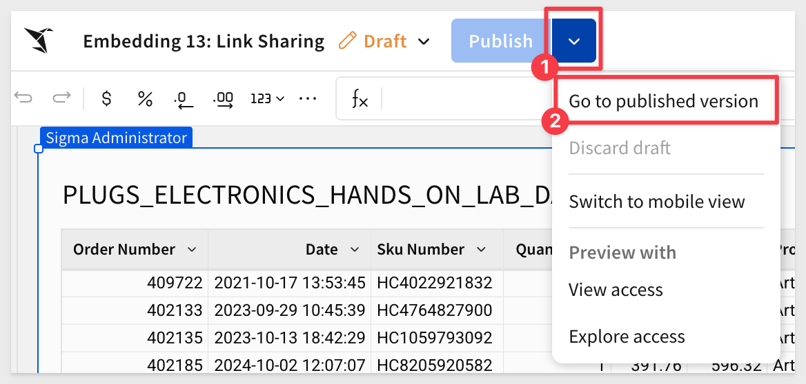

Copy the URL from the browser. We will use this in the next section.

<aside class="negative">
<strong>NOTE:</strong><br> Sigma supports embedding workbooks, pages, single elements or even the Ask Sigma interface.
</aside>

For more information on URL formats for JWT embedding, see [What URL to use](https://help.sigmacomputing.com/docs/create-an-embed-api-with-json-web-tokens#what-url-to-use)

Share the workbook with the `Sales_People` team we created in the `Embedding 01: Getting Started` QuickStart, granting `Can explore` permission:

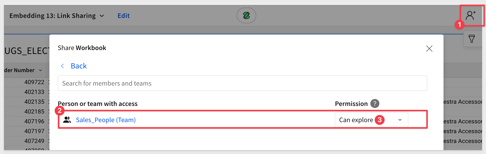


<!-- END OF SECTION-->

## Host Application Prep
Duration: 5 

In the QuickStart [Embedding 01: Getting Started](https://quickstarts.sigmacomputing.com/guide/embedding_01_prerequisites/index.html?index=..%2F..index#0), we deployed a host application locally.

For testing, we’ll use the pre-built page that demonstrates this approach.

In VSCode, open a new Terminal session inside the `embedding_qs_series` project and run the following command:

```code
npm start
```


Next, edit the `.env` file to update a few values.

The `CLIENT_ID` and `SECRET` from the Getting Started QuickStart should still be present and working. If they aren’t configured, revisit the Getting Started QuickStart and complete that step.

In the `# QS: link_sharing` section, we need to configure the values below, using the URL you saved earlier for the `LINK_SHARING_BASE_URL` value:

```code
LINK_SHARING_BASE_URL={YOUR WORKBOOK EMBED URL SAVED FROM EARLIER}
LINK_SHARING_EMAIL=sales_person@example.com
LINK_SHARING_ACCOUNT_TYPE=Build
LINK_SHARING_TEAMS=Sales_People
```

Save the `.env` file.

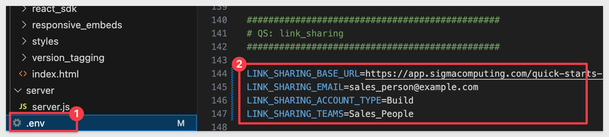

In a browser, open:
```code
http://localhost:3000/link_sharing/?mode=link_sharing
```

The page should render like this, with both a `Share` menu option and a share icon. Either works fine:

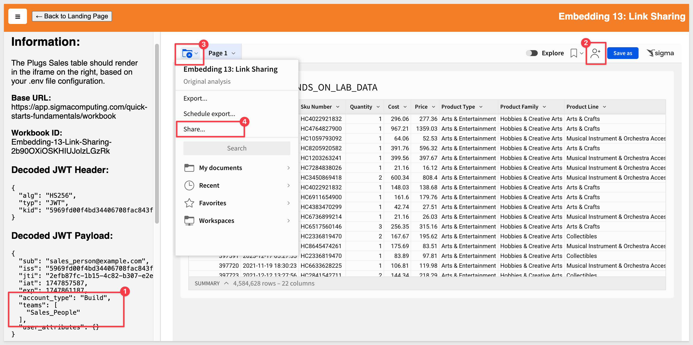

<aside class="negative">
<strong>NOTE:</strong><br> Note: our sample code includes logging, viewable in the browser’s developer console:
</aside>

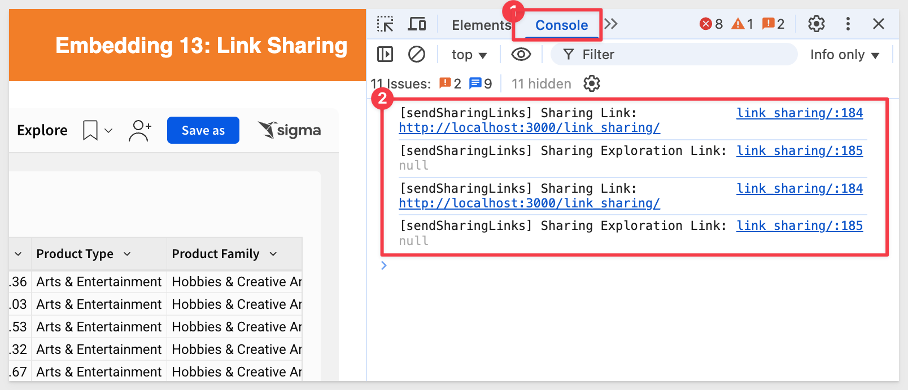

Now that we have a working embed, we can test embed link sharing.


<!-- END OF SECTION-->

## Embed Link Sharing Workflow
Duration: 5 

Copy the link and paste it into another browser to simulate a different user. The report will render as expected. For example, we tried it using Safari:

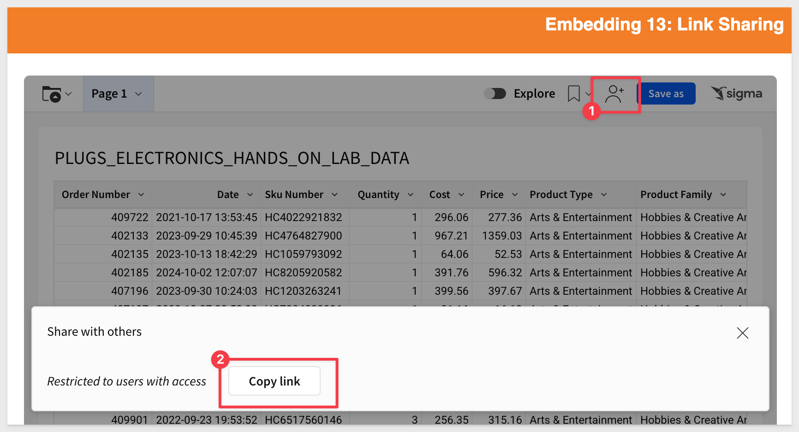

<aside class="negative">
<strong>NOTE:</strong><br> In real usage, users typically paste the embed sharing link into an email or another messaging tool. Recipients can click the link, and—assuming they have access—the parent application will render the embed as shared.
</aside>

### Create an exploration
It’s common for users to share an exploration they've created—especially when it contains valuable insights.

To support this important feature, exploration link sharing is enabled.

To demonstrate, we can create a simple filter on the embed, as shown in the screenshot below:

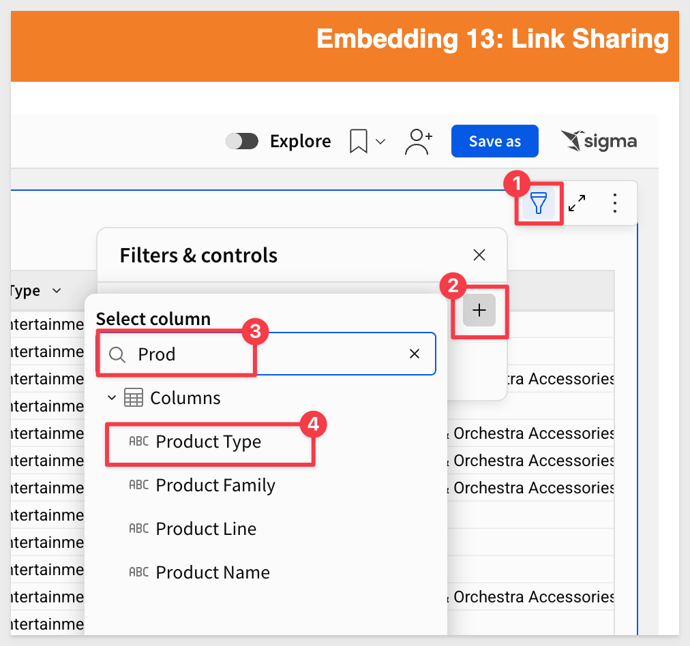

Let's say we want to filter for `Mobiles` only:

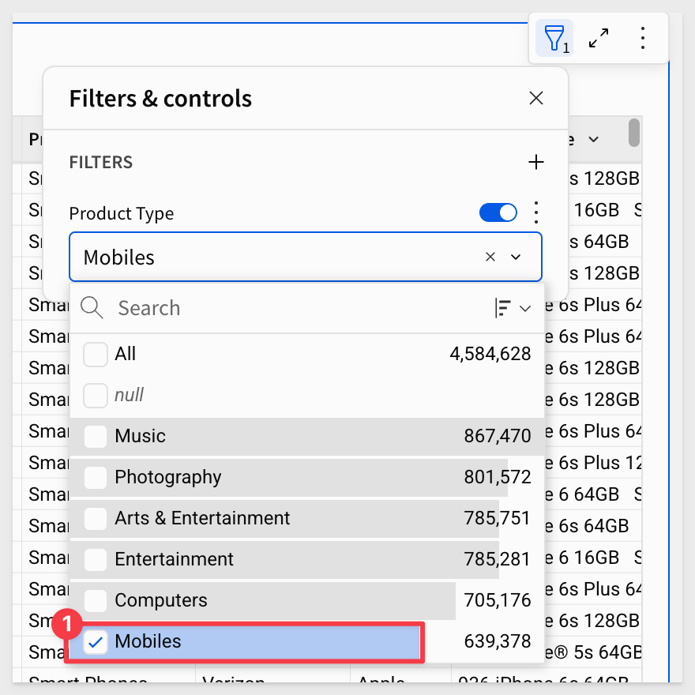

Now when we select either of the sharing options, the modal shows the option (enabled by default) to `Link to current custom view`:

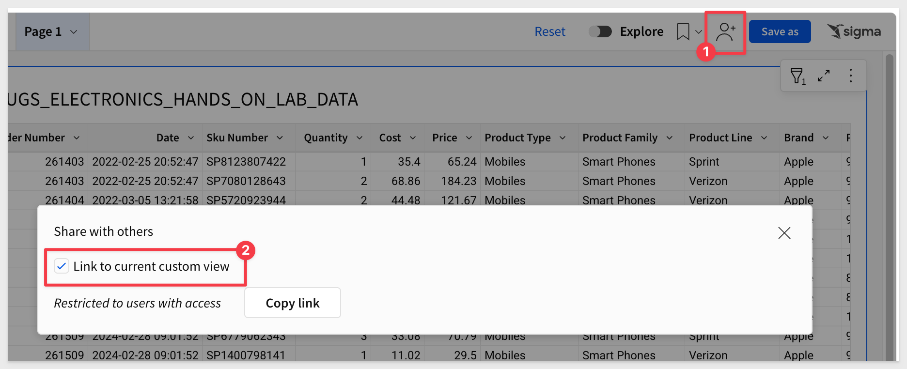

If we copy this link and open it again in Safari, the embed will still be filtered to show only `Mobiles`:

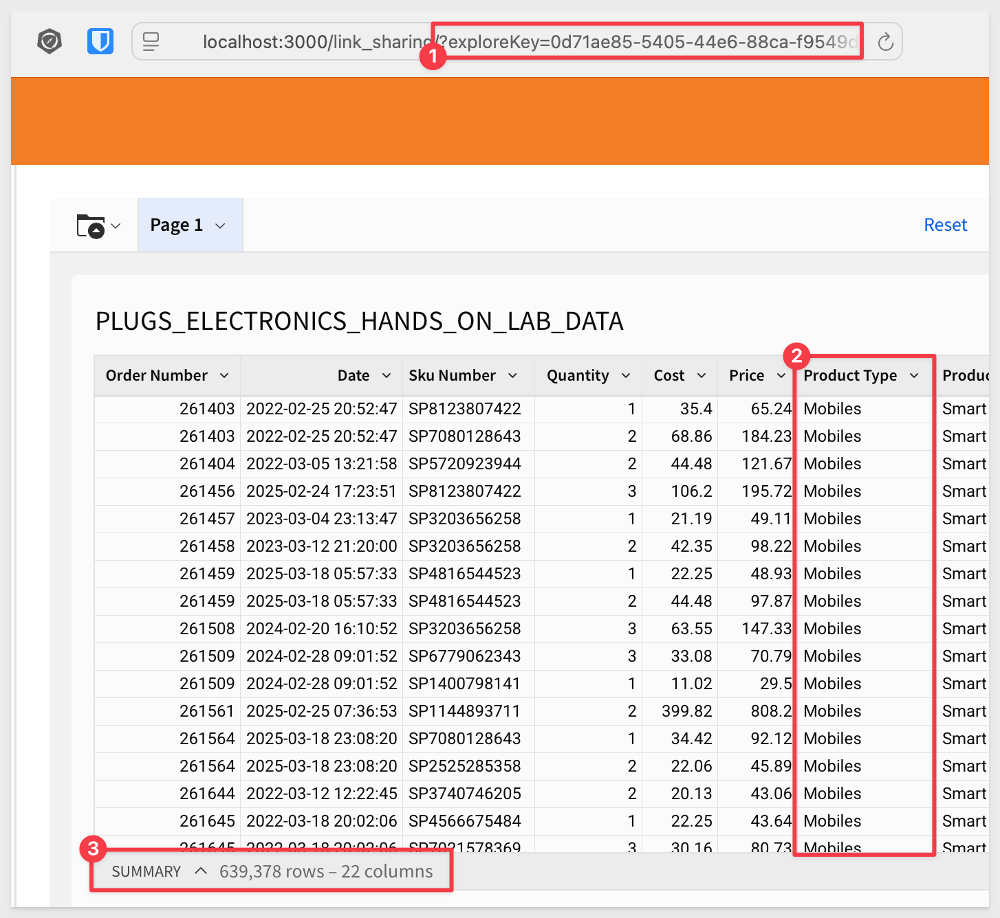

In looking at the link that Sigma generates, we can see there is a value for `exploreKey`. This is the reference to the shared exploration:
```code
http://localhost:3000/link_sharing/?exploreKey=0d71ae85-5405-44e6-88ca-f9549d0433b5
```

The exploration sharing link is also shown in the browser’s developer console:

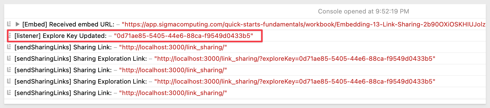


<!-- END OF SECTION-->

## Bookmark Sharing
Duration: 5 

The link sharing workflow with bookmarks is very similar. Since not all customers use bookmarks, you can skip this section if your organization doesn’t use them.

<aside class="negative">
<strong>NOTE:</strong><br> Bookmarks allow you to save the state of a published workbook in Explore or View mode. In a published workbook, you can make changes to the filters, controls, and other elements, and save the changes as a personal bookmark.
</aside>

To learn more about personal bookmarks, [see here.](https://help.sigmacomputing.com/docs/create-and-manage-bookmarks)

Let’s create a bookmark for the filtered workbook we left off with.

Click the `bookmark` icon and select `Save as new view`:

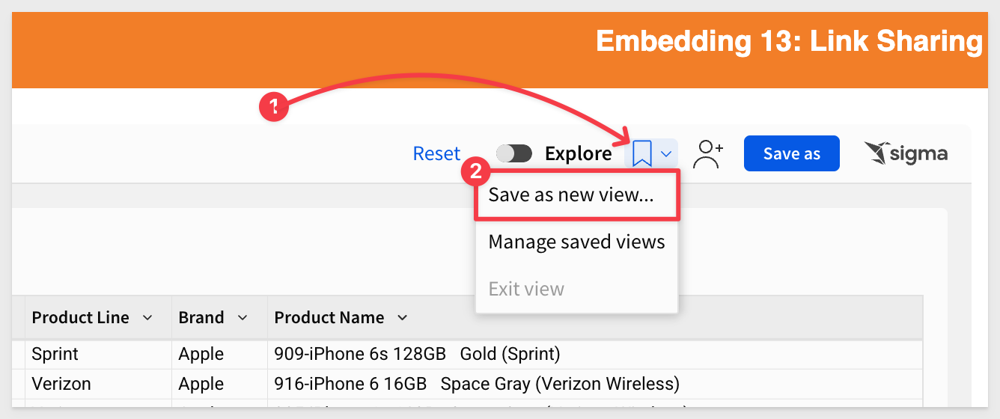

Name the new view `Plugs_Electronics_Sales_Mobiles_Only` and click `Save`.

In the developer console, you’ll see the new bookmarkId and an updated sharing link:k:

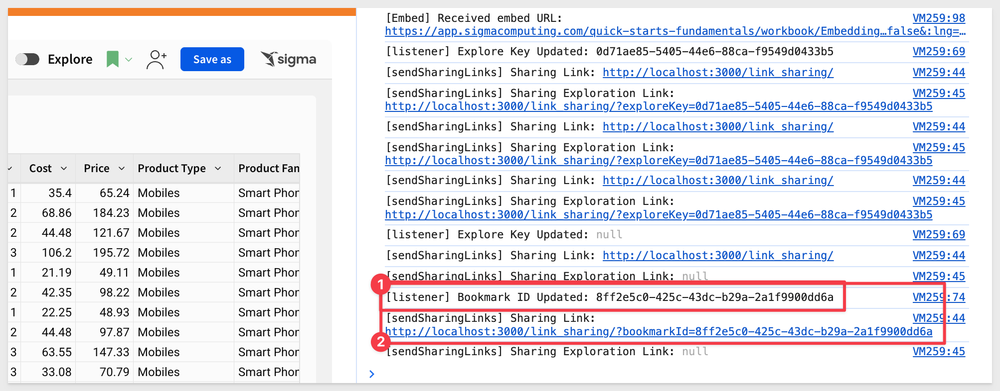

You can share this new workbook (note: this is still a workbook, not an exploration) by clicking the share icon and selecting `Copy link`.

Paste the link into your browser to verify that it shows only the filtered rows, using a bookmarkId in the shared exploration link:

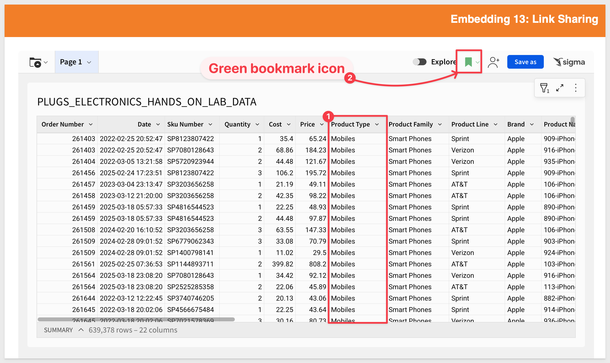

Continuing with the bookmarked workbook, we can add another filter to create a new exploration:

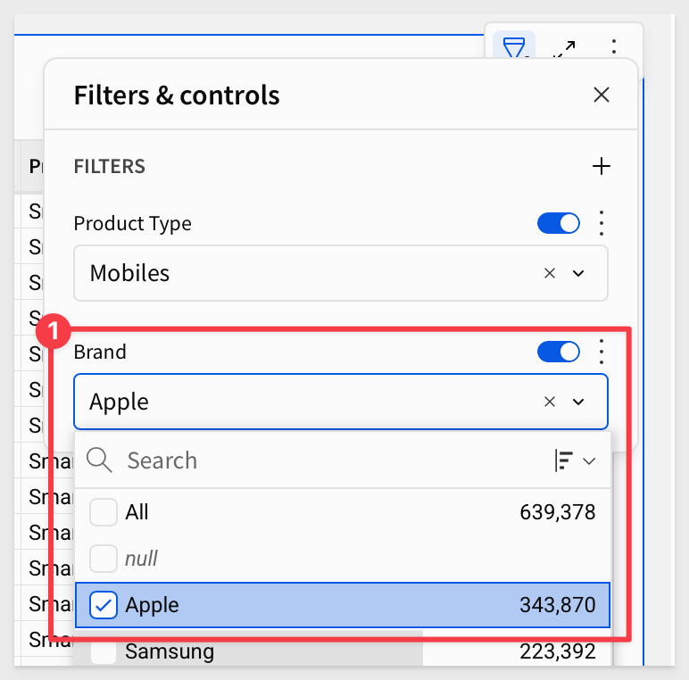

If we copy the exploration sharing link now, it also includes a reference to the new bookmark:
```code
http://localhost:3000/link_sharing/?exploreKey=7f4e31c0-d22d-4a25-bbc2-7a2cbc8bf054&bookmarkId=8ff2e5c0-425c-43dc-b29a-2a1f9900dd6a
```


<!-- END OF SECTION-->

## Scheduled Exports
Duration: 5

Continuing from the last section, let’s schedule a report for our bookmarked exploration.

Open the embed’s menu and click `Schedule export`:

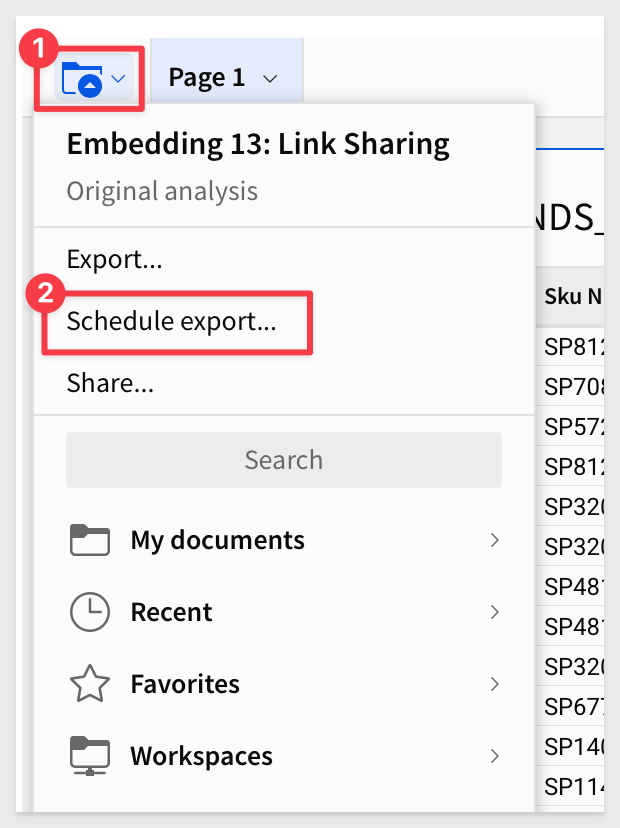

Click the `Add schedule` button.

Provide a valid email address, set the `Frequency` to `Monthly` and set `Send` to `always`:

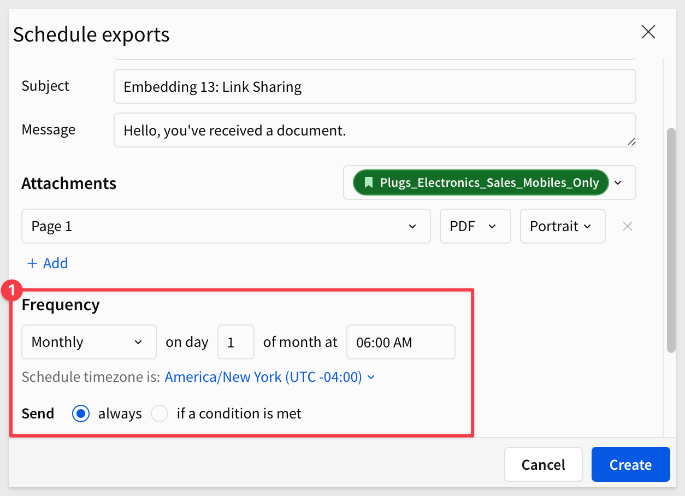

Click `Create`.

Open the `Actions` menu and click `Send now` to test the export:

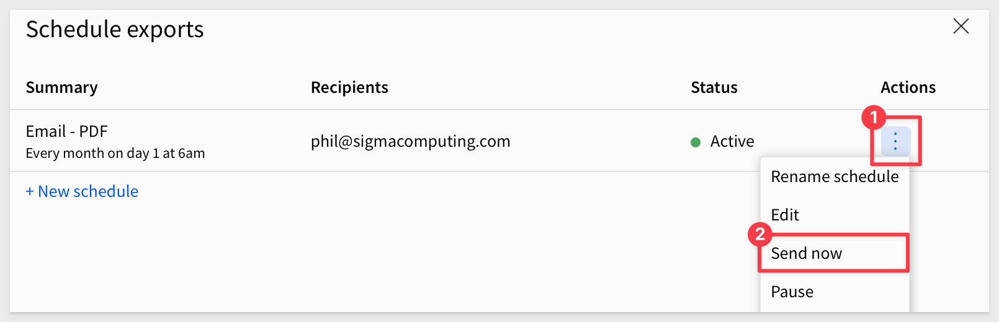

Once the email is received, the recipient can just click the link to access the shared workbook (assuming they have permissions to do so from the parent application):

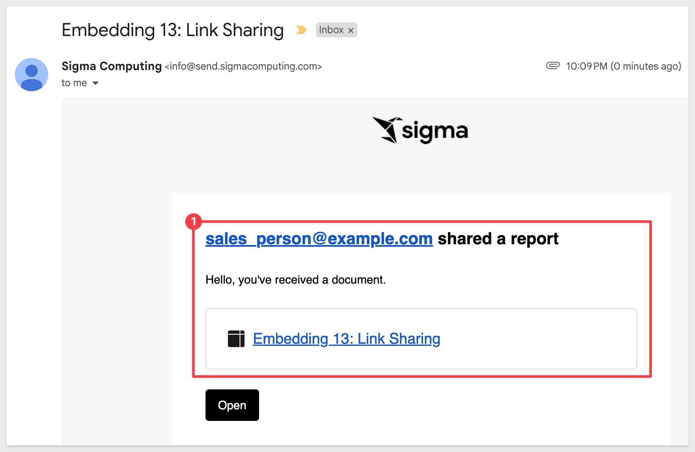

Clicking the link opens the original workbook (with one filter set), as that’s the link passed via sharingLink in the iframe event:

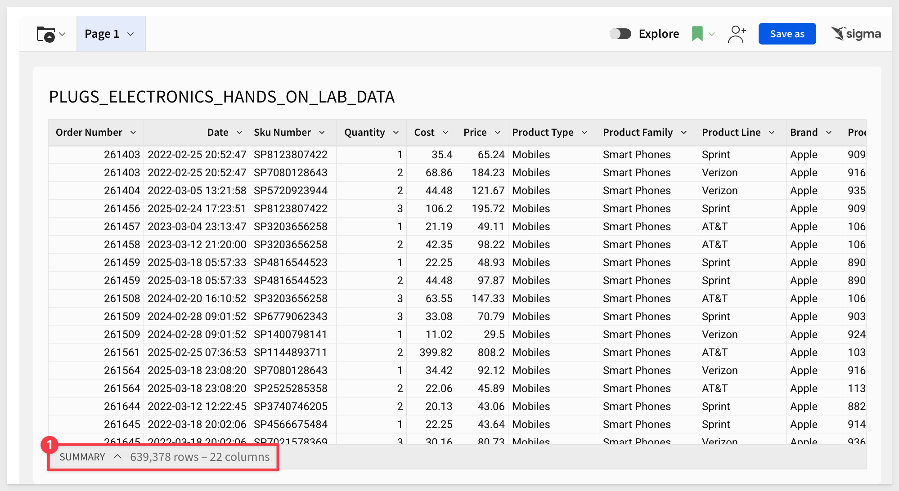

<aside class="negative">
<strong>NOTE:</strong><br> Without setting up link sharing, users can still schedule an export, but the email won’t include a shareable link back to the workbook. It would just contain the report in the selected export format.
</aside>

Don’t forget to delete the scheduled export job from the `Scheduled export` menu.


<!-- END OF SECTION-->

## What We've Covered
Duration: 5

In this QuickStart, we demonstrated how to enable embedded link and bookmark sharing in Sigma.

**Additional Resource Links**

[Blog](https://www.sigmacomputing.com/blog/)<br>
[Community](https://community.sigmacomputing.com/)<br>
[Help Center](https://help.sigmacomputing.com/hc/en-us)<br>
[QuickStarts](https://quickstarts.sigmacomputing.com/)<br>

Be sure to check out all the latest developments at [Sigma's First Friday Feature page!](https://quickstarts.sigmacomputing.com/firstfridayfeatures/)
<br>

[](https://twitter.com/sigmacomputing)&emsp;
[](https://www.linkedin.com/company/sigmacomputing)&emsp;
[](https://www.facebook.com/sigmacomputing)


<!-- END OF WHAT WE COVERED -->
<!-- END OF QUICKSTART -->
