author: pballai
id: embedding_14_connection_swapping_v3
summary: embedding_14_connection_swapping_v3
categories: Embedding
environments: web
status: hidden
feedback link: https://github.com/sigmacomputing/sigmaquickstarts/issues
tags: embedding
lastUpdated: 2025-06-04

# Embedding 14: Connection Swapping

## Overview 
Duration: 5 

This QuickStart introduces and demonstrates Sigma embedding using Dynamic Connection Swapping **(DCS)**. 

Before proceeding with this QuickStart guide, ensure you've completed the [Embedding 01: Getting Started](https://quickstarts.sigmacomputing.com/guide/embedding_01_getting_started_v3/index.html?index=..%2F..embedding#1)

<aside class="positive">
<strong>IMPORTANT:</strong><br> Some steps may not be shown in detail as we assume you have taken these other two QuickStarts or are familiar with Sigma workflows.
</aside>

DCS with Sigma can be efficiently managed by using the JWT claim:

```code
:eval_connection_id=<connection_id> 
```

This JWT claim, when added to an embed URL, allows the embedded Sigma application to dynamically switch the Sigma connection used for queries, based on the specified `connectionId`.

This functionality is particularly useful in environments where different users or groups require access to **different data sources that share the same schema.**

### Key Features and Benefits:
 <ul>
      <li><strong>Seamless Integration:</strong> By simply appending the ":eval_connection_id" JWT claim to the embed URL, the Sigma application can change its data source without requiring any changes to the dashboard or report setup.</li>
      <li><strong>Dynamic Data Access:</strong> This feature enhances flexibility for data isolation options and reduces the need for multiple workbooks.</li>
</ul>   
     
### Important Caveats:
<ul>
      <li><strong>Different Schema / Same Structure:</strong> The structure of the tables, the columns, and other objects within these schemas must be identical.</li>
      <li><strong>Limited to Read-Only Features:</strong> The dynamic connection swapping feature is limited to read-only operations. It does not support writeback features like materialization or input tables, which means any functions involving writing data back to the database cannot use this dynamic switching mechanism.</li>
      <li><strong>Overrides User Attributes:</strong> Using this JWT claim will override any configurations set via user attributes for warehouse or role switching within Sigma. This means the connection specified in the JWT takes precedence over any user-specific settings.</li>
      <li><strong>Scheduled Exports:</strong> The data connection used will be the one specified in the JWT at the time the schedule was created or last modified.</li>
      <li><strong>Immediate Exports:</strong> Immediate data exports will utilize the connection specified in the current embed URL.</li>
      <li><strong>Session Consistency:</strong> Throughout an embed session, any workbook opened will utilize the connectionId provided in the embed URL, ensuring consistency in data source usage.</li>
</ul>

### Implementation Considerations:
When implementing dynamic connection swapping, it is crucial to ensure that all JWTs are correctly formatted with the appropriate `connectionId` to maintain data integrity and security. Additionally, understanding the limitations and behaviors (listed above) related to exports and overrides is essential for effective use of this feature.

<aside class="positive">
<strong>IMPORTANT:</strong><br> Some screens in Sigma may appear slightly different from those shown in QuickStarts. This is because Sigma continuously adds and enhances functionality. Rest assured, Sigma’s intuitive interface ensures that any differences will not prevent you from successfully completing any QuickStart.
</aside>

For more information on Sigma's product release strategy, see [Sigma product releases](https://help.sigmacomputing.com/docs/sigma-product-releases)

If something is not working as you expect, here's how to [contact Sigma support](https://help.sigmacomputing.com/docs/sigma-support)

### Target Audience
Semi-technical users who will be aiding in the planning or implementation of Sigma with embedding. No SQL or data engineering skills are needed to complete this QuickStart. It does assume some common computer skills like installing software, using Terminal, navigating folders and copy/paste operations.

### Prerequisites

<ul>
  <li>A computer with a current browser. It does not matter which browser you want to use.</li>
  <li>Access to your Sigma environment.</li>
  <li>You must complete "Embedding 01: Getting Started" before beginning this QuickStart..</li>
  <li>A Snowflake account with the proper administrative and security admin access for our use case data.</li>
</ul>

<aside class="negative">
<strong>IMPORTANT:</strong><br> Some features may carry a "Beta" tag. Beta features are subject to quick, iterative changes. As a result, the latest product version may differ from the contents of this document.
</aside>

<aside class="positive">
<strong>IMPORTANT:</strong><br> Sigma recommends that you do not use production resources when doing QuickStarts.
</aside>

<button>[Sigma Free Trial](https://www.sigmacomputing.com/free-trial/)</button> <button>[Snowflake Free Trial](https://signup.snowflake.com/)</button>


<!-- END OF SECTION-->


## Typical Use Cases
Duration: 20

Sigma DCS supports the common multi-tenant architectures used by businesses today to provide portal access while maintaining data separation.

The most common examples of this are:

### Primary Use Case: 

**Per-customer Snowflake accounts:**<br>
This works by using only eval_connection_id. All tenants must use the same database and schema names, as well as identical column structures. 

If names differ, custom user attributes (UA) are required.

### Other Use Cases:

**1: One Snowflake account, per customer databases:**<br>
This requires eval_connection_id, user attributes for the database name, and custom SQL to fetch the data.

**2: One Snowflake account, single database, per customer schema:**<br>
This can be addressed using only user attributes and custom SQL, and does not require DSC.

**3: Two Snowflake accounts with databases and/or schema that has same structure but different names:**<br>
This can be addressed using only user attributes and custom SQL.

There are many other variations of these use cases but these are the ones that are most commonly seen. 

The basic design pattern with DCS and user attributes provides flexibility to allow customers to select the model that best suits their architectural needs. 


<!-- END OF SECTION-->

## Use Case: Per-customer Snowflake Accounts
Duration: 20

Imagine a scenario where Sigma content is embedded into a customer's SaaS application that is used by multiple clients. 

Each client accesses the same type of data (e.g., store sales data), but their data resides in separate Snowflake accounts. 

The database and schema names are the same for both clients.

Each new client is onboarded with its own Snowflake account.

For our demonstration, let's assume the SaaS provider is a national retail distributor who has clients who sell goods in specific regions of the United States. 

The distributor has a client portal they want to embed Sigma into.

They prefer that all clients use a common dashboard to ease training, support, and related development work, as new clients are onboarded. 

There are two clients, `Client_A` only sells in the eastern region of the US. `Client_B` only sells in the southern region of the US.

The dataset contains typical retail store sales metrics.

Each client has a `STORE_SALES` table with the same structure, but client-specific sales data.

### The source data
To demonstrate this, we’ll use two Snowflake accounts with identical databases and schemas.

<aside class="negative">
<strong>NOTE:</strong><br> If you don't have access to two Snowflake accounts, that's fine; simply follow along, as the steps are straightforward.
</aside>


<!-- END OF SECTION-->

## Snowflake Configuration
Duration: 20

We have created the following Snowflake script to automate the process of creating users, roles, and sample data, to simplify the DCS demonstration.

<aside class="negative">
<strong>NOTE:</strong><br> It is recommended to run commands one at a time to ensure success.
</aside>

Open a new worksheet in Snowflake.

Copy and paste this code into the worksheet:
```code
//// This is account 1
// ----------------------------------------------------------------------------------------------------------
// SECTION 1: DATA CONFIGURATION
// ----------------------------------------------------------------------------------------------------------

USE ROLE ACCOUNTADMIN;
USE WAREHOUSE COMPUTE_WH;

// 1: CREATE OR REPLACE DATABASE AND SWITCH TO IT
CREATE OR REPLACE DATABASE SIGMA_DCS_USECASE_1;
USE DATABASE SIGMA_DCS_USECASE_1;

// 2: CREATE A NEW SCHEMA TO HOLD OUR FUTURE SAMPLE DATA TABLE:
CREATE SCHEMA IF NOT EXISTS CLIENTS;

// 3: CREATE THE SAMPLE DATA TABLE SCHEMA
CREATE OR REPLACE TABLE CLIENTS.STORE_SALES (
    CLIENT_NAME VARCHAR,
    STORE_REGION VARCHAR,
    ORDER_NUMBER VARCHAR,
    DATE TIMESTAMP,
    SKU_NUMBER VARCHAR,
    QUANTITY INT,
    COST FLOAT,
    PRICE FLOAT,
    COGS FLOAT,
    SALES FLOAT,
    PROFIT FLOAT,
    PROFIT_MARGIN FLOAT,
    PRODUCT_TYPE VARCHAR,
    PRODUCT_FAMILY VARCHAR,
    PRODUCT_LINE VARCHAR,
    BRAND VARCHAR,
    PRODUCT_NAME VARCHAR,
    STORE_NAME VARCHAR,
    STORE_KEY VARCHAR,
    STORE_STATE VARCHAR,
    STORE_CITY VARCHAR,
    STORE_ZIP_CODE VARCHAR,
    STORE_LATITUDE FLOAT,
    STORE_LONGITUDE FLOAT,
    CUST_KEY INT,
    CUSTOMER_NAME VARCHAR,
    DAY VARCHAR,
    WEEK VARCHAR,
    MONTH VARCHAR,
    QUARTER VARCHAR,
    YEAR VARCHAR
);

// 4: CREATE STAGES FOR EXTERNAL STORAGE OF CSV FILES
CREATE STAGE IF NOT EXISTS CLIENT_A_DATA URL='s3://sigma-quickstarts-main/embedding_2/Client_A_Store_Sales.csv';

// 5: CSV FORMAT TO HANDLE HEADER ROWS IN DATA FILES
CREATE OR REPLACE FILE FORMAT my_csv_format
  TYPE = 'CSV'
  FIELD_DELIMITER = ','
  SKIP_HEADER = 1   -- Skip the first line of the file
  FIELD_OPTIONALLY_ENCLOSED_BY = '"'
  ESCAPE_UNENCLOSED_FIELD = 'NONE'
  NULL_IF = ('NULL', 'null');

// 6: COPY DATA FROM STAGE TO RESPECTIVE TABLE
COPY INTO CLIENTS.STORE_SALES FROM @CLIENT_A_DATA FILE_FORMAT= my_csv_format;

// 7: CONFIRM DATA IS LANDED IN SNOWFLAKE TABLE:
SELECT * FROM CLIENTS.STORE_SALES; //EAST

// ----------------------------------------------------------------------------------------------------------
// SECTION 2: ROLE AND USER CONFIGURATION
// ----------------------------------------------------------------------------------------------------------

// 1: CREATE ROLES FOR OUR USE CASES:
CREATE OR REPLACE ROLE CLIENT_A;

// 2: CREATE USERS FOR EACH CLIENT
CREATE USER IF NOT EXISTS CLIENT_A_USER PASSWORD = 'StrongPassword1!';

// 3: GRANT ROLES TO USERS
GRANT ROLE CLIENT_A TO USER CLIENT_A_USER;

// 4: GRANT USAGE ON WAREHOUSE COMPUTE_WH TO ROLES
GRANT USAGE ON WAREHOUSE COMPUTE_WH TO ROLE CLIENT_A;

// 5: GRANT USAGE PERMISSION ON THE DATABASE TO NEW ROLES:
GRANT USAGE ON DATABASE SIGMA_DCS_USECASE_1 TO ROLE CLIENT_A;

// 6: GRANT USAGE ON SCHEMA TO NEW ROLES:
GRANT USAGE ON SCHEMA SIGMA_DCS_USECASE_1.CLIENTS TO ROLE CLIENT_A;

// 7: ALLOW NEW ROLES TO QUERY TABLES WE CREATED:
GRANT SELECT ON ALL TABLES IN SCHEMA SIGMA_DCS_USECASE_1.CLIENTS TO ROLE CLIENT_A;

// ----------------------------------------------------------------------------------------------------------
// SECTION 5:  TESTING
// ----------------------------------------------------------------------------------------------------------

// 1: 
SELECT * FROM SIGMA_DCS_USECASE_1.CLIENTS.STORE_SALES; // SHOULD SHOW ROW DATA
```

If you are familiar with Snowflake scripts, you can just use the `Run All` under the `Play` button.

Execute the script. When it completes, you should see data for `Client_A`:

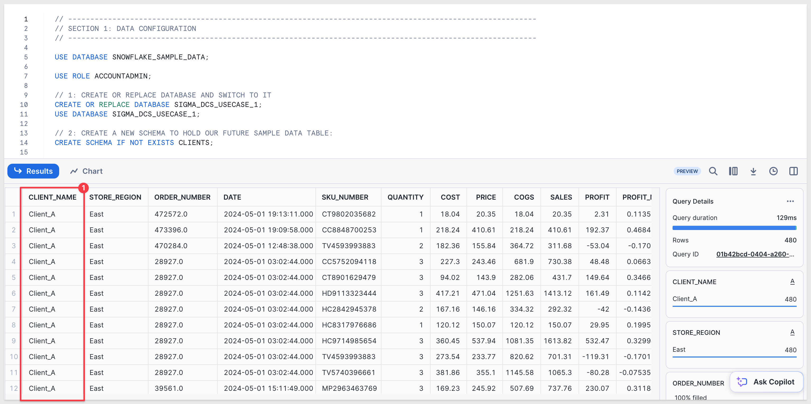

<aside class="negative">
<strong>NOTE:</strong><br> A small sample dataset is provided automatically when running each of these scripts.
</aside>

#### Second Snowflake account
Repeat the same operations in a second Snowflake account, adjusting the Snowflake script to load a different dataset into the same schema.

Log into a **second** Snowflake account as `ACCOUNTADMIN` and paste this script into a new Worksheet:
```code
// This is account 2
// ----------------------------------------------------------------------------------------------------------
// SECTION 1: DATA CONFIGURATION
// ----------------------------------------------------------------------------------------------------------

USE ROLE ACCOUNTADMIN;
USE WAREHOUSE COMPUTE_WH;

// 1: CREATE OR REPLACE DATABASE AND SWITCH TO IT
CREATE OR REPLACE DATABASE SIGMA_DCS_USECASE_1;
USE DATABASE SIGMA_DCS_USECASE_1;

// 2: CREATE A NEW SCHEMA TO HOLD OUR FUTURE SAMPLE DATA TABLE:
CREATE SCHEMA IF NOT EXISTS CLIENTS;

// 3: CREATE THE SAMPLE DATA TABLE SCHEMA
CREATE OR REPLACE TABLE CLIENTS.STORE_SALES (
    CLIENT_NAME VARCHAR,
    STORE_REGION VARCHAR,
    ORDER_NUMBER VARCHAR,
    DATE TIMESTAMP,
    SKU_NUMBER VARCHAR,
    QUANTITY INT,
    COST FLOAT,
    PRICE FLOAT,
    COGS FLOAT,
    SALES FLOAT,
    PROFIT FLOAT,
    PROFIT_MARGIN FLOAT,
    PRODUCT_TYPE VARCHAR,
    PRODUCT_FAMILY VARCHAR,
    PRODUCT_LINE VARCHAR,
    BRAND VARCHAR,
    PRODUCT_NAME VARCHAR,
    STORE_NAME VARCHAR,
    STORE_KEY VARCHAR,
    STORE_STATE VARCHAR,
    STORE_CITY VARCHAR,
    STORE_ZIP_CODE VARCHAR,
    STORE_LATITUDE FLOAT,
    STORE_LONGITUDE FLOAT,
    CUST_KEY INT,
    CUSTOMER_NAME VARCHAR,
    DAY VARCHAR,
    WEEK VARCHAR,
    MONTH VARCHAR,
    QUARTER VARCHAR,
    YEAR VARCHAR
);

// 4: CREATE STAGES FOR EXTERNAL STORAGE OF CSV FILES
CREATE STAGE IF NOT EXISTS CLIENT_B_DATA URL='s3://sigma-quickstarts-main/embedding_2/Client_B_Store_Sales.csv';

// 5: CSV FORMAT TO HANDLE HEADER ROW IN DATA FILES
CREATE OR REPLACE FILE FORMAT my_csv_format
  TYPE = 'CSV'
  FIELD_DELIMITER = ','
  SKIP_HEADER = 1   -- Skip the first line of the file
  FIELD_OPTIONALLY_ENCLOSED_BY = '"'
  ESCAPE_UNENCLOSED_FIELD = 'NONE'
  NULL_IF = ('NULL', 'null');

// 6: COPY DATA FROM STAGE TO RESPECTIVE TABLE
COPY INTO CLIENTS.STORE_SALES FROM @CLIENT_B_DATA FILE_FORMAT= my_csv_format;

// 7: CONFIRM DATA IS LANDED IN SNOWFLAKE TABLE:
SELECT * FROM CLIENTS.STORE_SALES; //SOUTH

// ----------------------------------------------------------------------------------------------------------
// SECTION 2: ROLE AND USER CONFIGURATION
// ----------------------------------------------------------------------------------------------------------

// 1: CREATE ROLES FOR OUR USE CASES:
CREATE OR REPLACE ROLE CLIENT_B;

// 2: CREATE USERS FOR EACH CLIENT
CREATE USER IF NOT EXISTS CLIENT_B_USER PASSWORD = 'StrongPassword2';

// 3: GRANT ROLES TO USERS
GRANT ROLE CLIENT_B TO USER CLIENT_B_USER;

// 4: GRANT USAGE ON WAREHOUSE COMPUTE_WH TO ROLES
GRANT USAGE ON WAREHOUSE COMPUTE_WH TO ROLE CLIENT_B;

// 5: GRANT USAGE PERMISSION ON THE DATABASE TO NEW ROLES:
GRANT USAGE ON DATABASE SIGMA_DCS_USECASE_1 TO ROLE CLIENT_B;

// 6: GRANT USAGE ON SCHEMA TO NEW ROLES:
GRANT USAGE ON SCHEMA SIGMA_DCS_USECASE_1.CLIENTS TO ROLE CLIENT_B;

// 7: ALLOW NEW ROLES TO QUERY TABLES WE CREATED:
GRANT SELECT ON ALL TABLES IN SCHEMA SIGMA_DCS_USECASE_1.CLIENTS TO ROLE CLIENT_B;

// ----------------------------------------------------------------------------------------------------------
// SECTION 5:  TESTING
// ----------------------------------------------------------------------------------------------------------

// 1: 
SELECT * FROM SIGMA_DCS_USECASE_1.CLIENTS.STORE_SALES; // SHOULD SHOW ROW DATA
```

Execute the script and verify the data shows rows for `Client_B`:

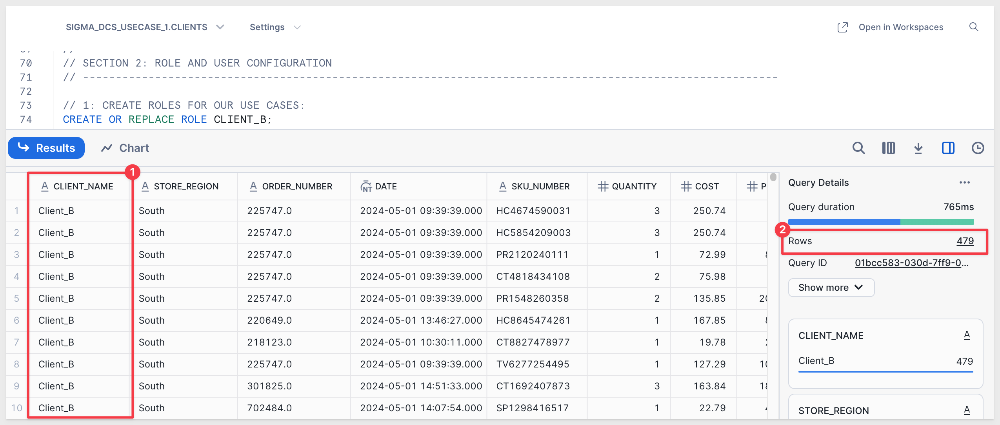

Once Snowflake is configured, continue to the Sigma configuration.


<!-- END OF SECTION-->

## Sigma Configuration 
Duration: 20

Log in to Sigma as `Administrator`.

### Create Connections
Create a new connection in `Administration` > `Connections` and configure it for the `SIGMA_DCS_USECASE_1` database.

Recall that the `Role`, `User`, and `Password` were specified in each Snowflake script. 

Here they are again for convenience:

#### CLIENT_A - Snowflake Account 1:
Connection Name: CLIENT_A - Snowflake Account 1<br>
Warehouse: COMPUTE_WH<br>
User: CLIENT_A_USER<br>
Role: CLIENT_A<br>
Password: StrongPassword1!

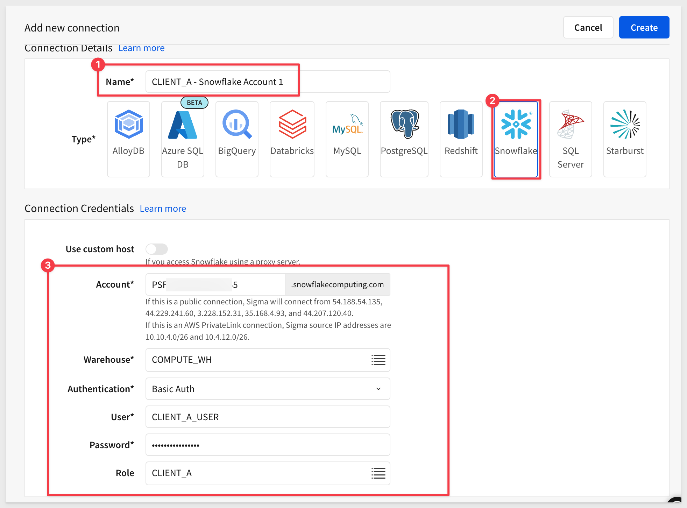

Then create another connection for `Client_B`:

#### CLIENT_B - Snowflake Account 2:
Connection Name: CLIENT_B - Snowflake Account 2<br>
Warehouse: COMPUTE_WH<br>
User: CLIENT_B_USER<br>
Role: CLIENT_B<br>
Password: StrongPassword2!

Verify the `CLIENT_B - Snowflake Account 2` connection is providing the expected data isolation by clicking the `Browse Connection` button:

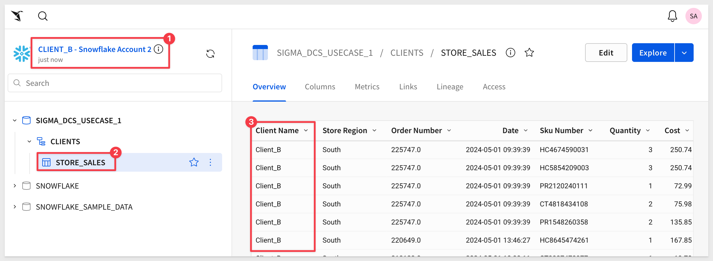

Also verify the table data in `CLIENT_A - Snowflake Account 1`.

Click the `Explore` button to open the `STORE_SALES` table in a new Sigma workbook. It doesn’t matter whether you were browsing the `Client_A` or `Client_B` connection.

Rename the `Page 1` tab to `Use Case 1`.

Use the `Save As` button to create the new workbook named `Embedding 14: Connection Swapping`. 

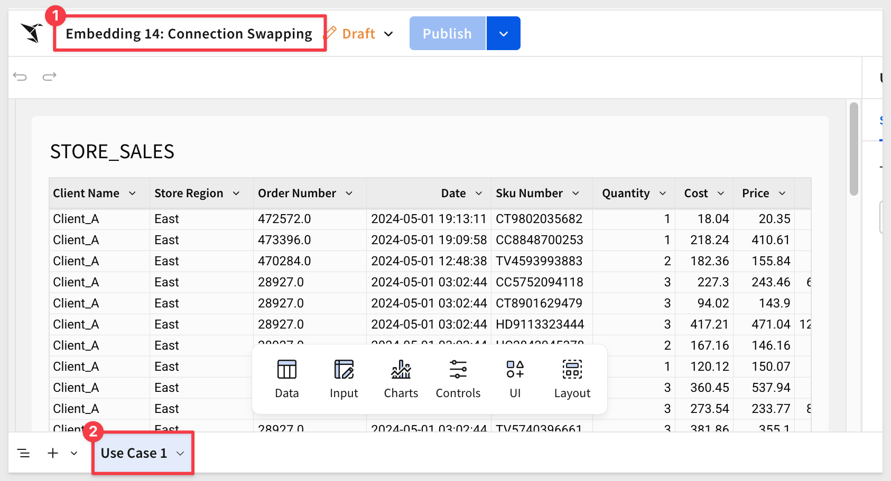

### Create Teams
Navigation to `Administration` > `Teams` and create the `CLIENT_A` and `CLIENT_B` teams.

<aside class="negative">
<strong>NOTE:</strong><br> These two teams may already exist if you previously created the "Embedding 12: Parameterized Queries QuickStart". In that case, we can just reuse them.
</aside>

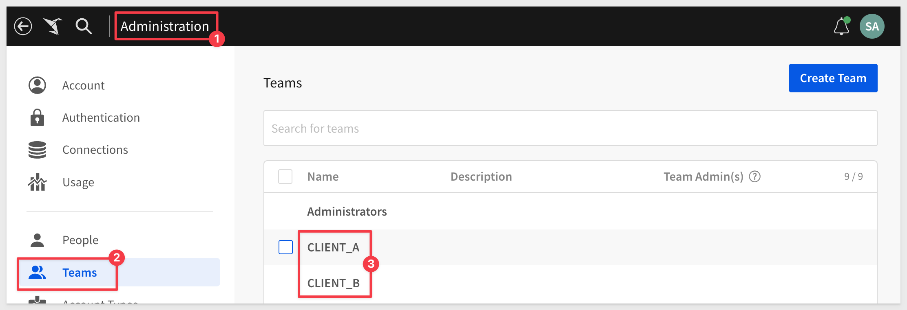

No need to assign anyone to these teams now. 

<aside class="positive">
<strong>IMPORTANT:</strong><br> Users are added automatically to Sigma, when coming in via the embedding integration. They will be added to the user database, assigned to the specified team and permissions by the Embed API. You will not have to manage Sigma embed users separately from your existing user management system, saving you time.
</aside>

### Share with Teams
To be able to test this workbook, we need to share it with the two teams. 

Click the `Share` icon then add `CLIENT_A` and `CLIENT_B` teams. Set the permission to `Can View` for both:

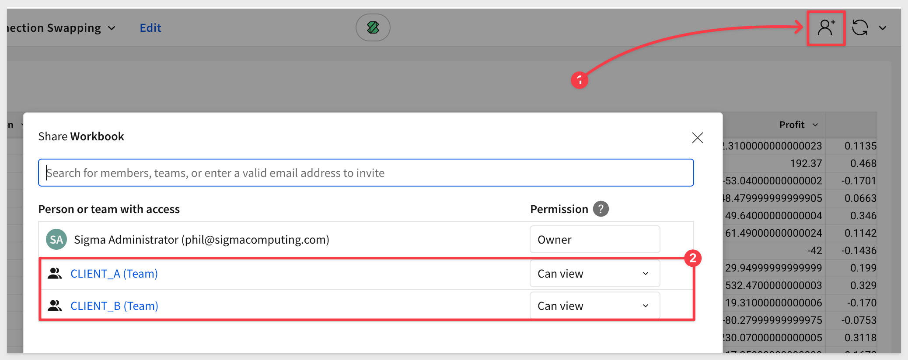

### Embed Base URL
Open the workbook's menu and click `Go to published version`:

<aside class="negative">
<strong>NOTE:</strong><br> If the `Edit` link is showing in the workbook header, you are already in published mode.
</aside>

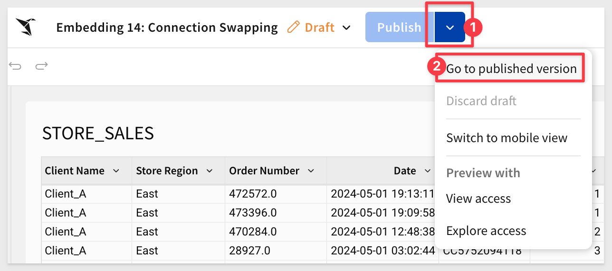

Copy the URL from the browser and store it in a text file; we will use that later.

### Connection IDs
Before we try to test the embed, we need to get the ID of each of our Snowflake connections. We do this with Sigma's [REST API](https://help.sigmacomputing.com/reference/listconnections), but for simplicity we will just grab them from the URL.

Navigate to `Administration` > `Connections` and select the `Client_A` connection. 

The connection ID for `Client_A` is shown in the URL:

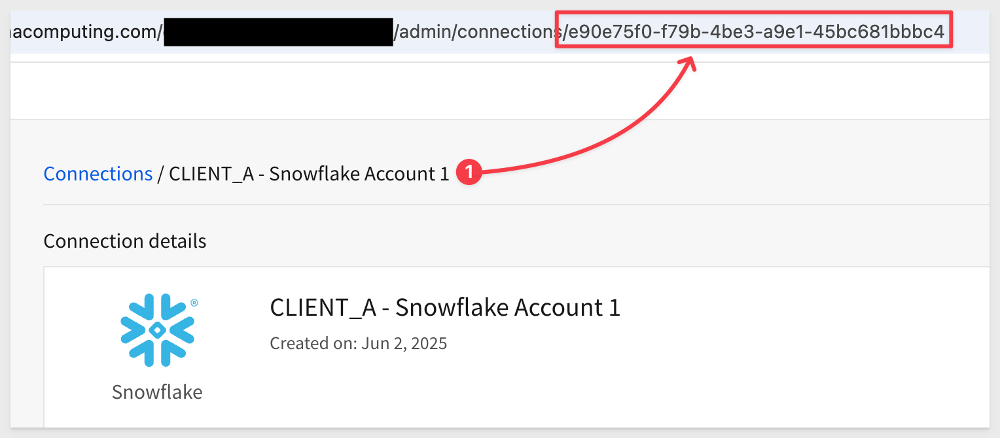

For example, the id for this example is (yours will be different):
```code
e90e75f0-f79b-4be3-a9e1-45bc681bbbc4
```

Copy this connectionId to a text file for use later.

Repeat the process for `Client_B`.


<!-- END OF SECTION-->

## Testing
Duration: 5

In the QuickStart [Embedding 01: Getting Started]() we deployed a host application locally.

For testing, we'll use the prebuilt page that demonstrates this approach.

In VSCode, open a new Terminal session inside the `embedding_qs_series` project and run the following command:

```code
npm start
```

The expected response is:

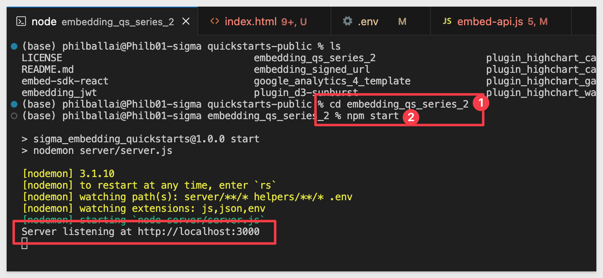

Next, edit the .env file to update a few values.

The `CLIENT_ID` and `SECRET` values from the "Getting Started" QuickStart should still be present and working. 

If they aren't configured, revisit the "Getting Started" QuickStart to complete that step.

In the `# QS: connection_swapping` section, we need to configure the values below, using the URL saved earlier for the `CONNECTION_SWAPPING_BASE_URL` value.

We have preconfigured two sections, one for each client. `Client_B's` values are commented out so we can test `Client_A` first.

Provide the `connection_ID` values for each client:

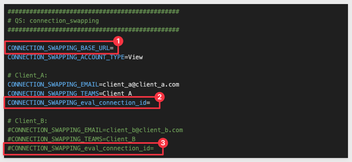

All other values can remain the same.

Save the changes.

In a browser, open:
```code
http://localhost:3000/connection_swapping/?mode=connection_swapping
```

The table shows Client_A's data and we can see the values passed in the sidebar:

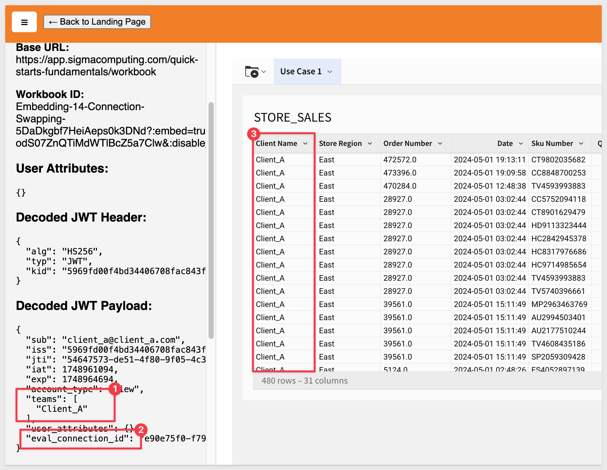

### Test Client_B
Comment `Client_A's` values in `.env` and uncomment `Client_Bs`:

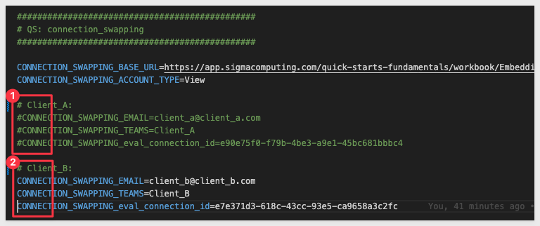

Save the changes and refresh the browser.

You should now see `Client_B's` data:

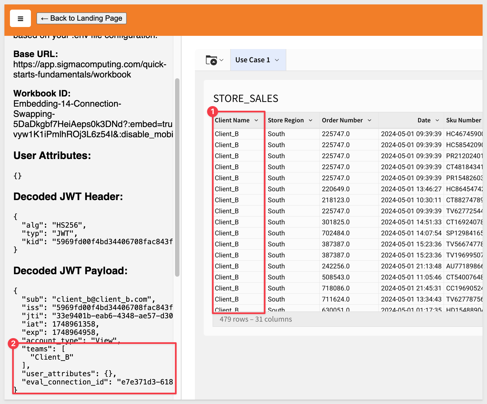

We can now deploy a Sigma dashboard that is shared across multiple clients, ensuring data isolation through Dynamic Connection Swapping in Sigma.


<!-- END OF SECTION-->

## Different Schema Names
Duration: 20

It is possible that each customer has a schema name that represents the client's actual name. 

To support this use case Sigma's custom user attributes and custom SQL ensure data isolation. In this way, a common dashboard can be used for all customers, with the connection and schema determined at runtime.

All users experience the same dashboard functionality because the underlying data structure is consistent across schemas.

<aside class="positive">
<strong>IMPORTANT:</strong><br> The ability to create and pass custom user attributes provides a great deal of design flexibility. This use case is a simple example of using one user attribute (to account for different schema names) but this method can be extended to suit a variety of use cases.
</aside>

This is a less common use case, so we won’t fully demonstrate it here, but know that this capability is available.

Below is an example of what the custom SQL might look like when using custom user attributes to pass the schema name:

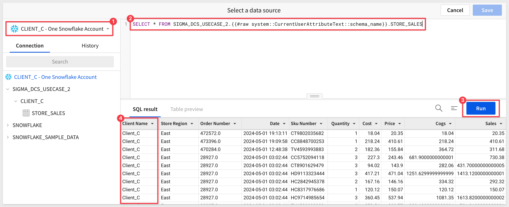

For more information, see the QuickStart: [Embedding 03: Parameters and User-Attributes](https://quickstarts.sigmacomputing.com/guide/embedding_03_parameters_ua_v3/index.html?index=..%2F..embedding#0)


<!-- END OF SECTION-->

## What we've covered
Duration: 5

In this QuickStart, we learned how to set up Sigma embedding using Dynamic Connection Swapping with Snowflake, and explored the different use cases where it is most effective.

<!-- THE FOLLOWING ADDITIONAL RESOURCES IS REQUIRED AS IS FOR ALL QUICKSTARTS -->
**Additional Resource Links**

[Blog](https://www.sigmacomputing.com/blog/)<br>
[Community](https://community.sigmacomputing.com/)<br>
[Help Center](https://help.sigmacomputing.com/hc/en-us)<br>
[QuickStarts](https://quickstarts.sigmacomputing.com/)<br>

Be sure to check out all the latest developments at [Sigma's First Friday Feature page!](https://quickstarts.sigmacomputing.com/firstfridayfeatures/)
<br>

[](https://twitter.com/sigmacomputing)&emsp;
[](https://www.linkedin.com/company/sigmacomputing)&emsp;
[](https://www.facebook.com/sigmacomputing)


<!-- END OF WHAT WE COVERED -->
<!-- END OF QUICKSTART -->
