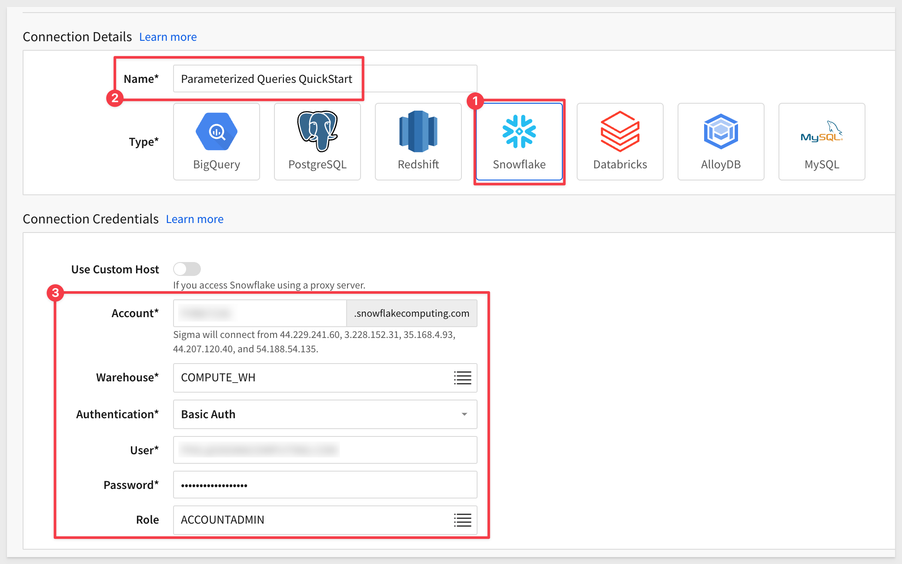
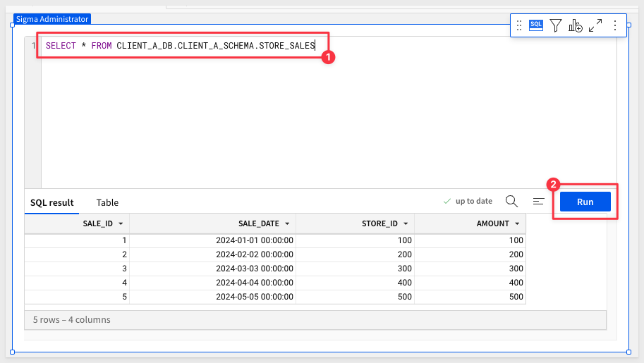
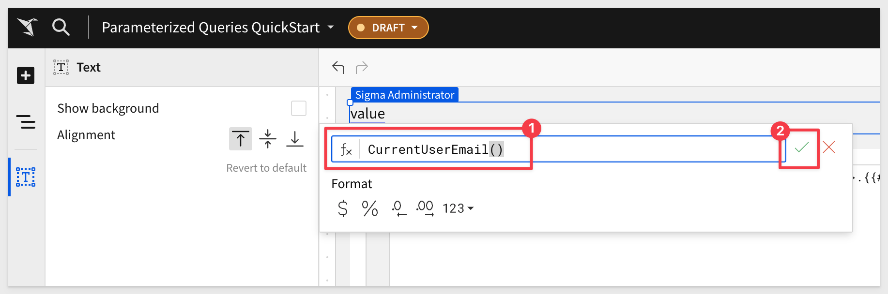

author: pballai
id: embedding_14_parameterized_queries
summary: embedding_14_parameterized_queries
categories: Embedding
environments: web
status: Published
feedback link: https://github.com/sigmacomputing/sigmaquickstarts/issues
tags: deprecated
lastUpdated: 2024-08-02

# Embedding 14: Parameterized Queries
<!-- The above name is what appears on the website and is searchable. -->

## Overview 
Duration: 5 

This QuickStart introduces and demonstrates Sigma embedding using parameterized queries.

Parameterized queries are quite useful when embedded customers have per-customer databases with the same schema. 

While there are several ways to store customer data, this method is fairly common.

To accomplish this in Sigma, we will use queries and leverage custom user attributes.

### How it works
End users are authenticated by the parent application. When the user navigates to a parent page containing embedded Sigma content, the parent sends a request to Sigma via the embed API, containing query parameters (user attributes) that specify the database and schema names. Sigma parses that request, and applies the user attributes to the SQL query. The query is then evaluated by Sigma and if required, sent to the cloud data warehouse.

How Sigma performs calculations is beyond the scope of this QuickStart, but covered in-depth [here.](https://quickstarts.sigmacomputing.com/guide/administration_sigma_calculations/index.html?index=..%2F..index#0)

This is different from other options that Sigma offers to handle common architectural designs. 

Other options include:

[Snowflake connection swapping.](https://quickstarts.sigmacomputing.com/guide/embedding_13_connection_swapping/index.html?index=..%2F..index#0)

[Embedding 09: Dynamic Role Switching.](https://quickstarts.sigmacomputing.com/guide/embedding_09_dynamic_role_switching_snowflake/index.html?index=..%2F..index#0)

<aside class="positive">
<strong>Bottom Line:</strong><br> Sigma is very flexible; we are here to help with your design challenges. Reach out to your Sigma team or Sigma support with questions.
</aside>

<aside class="positive">
<strong>IMPORTANT:</strong><br> Some steps may not be shown in detail as we assume you have taken these other two QuickStarts or are familiar with Sigma workflows.
</aside>

<aside class="positive">
<strong>IMPORTANT:</strong><br> Some screens in Sigma may appear slightly different from those shown in QuickStarts. This is because Sigma is continuously adding and enhancing functionality. Rest assured, Sigma’s intuitive interface ensures that any differences will not prevent you from successfully completing any QuickStart.
</aside>

For more information on Sigma's product release strategy, see [Sigma product releases.](https://help.sigmacomputing.com/docs/sigma-product-releases)

 ### Target Audience
Semi-technical users who will be aiding in the planning or implementation of Sigma. Limited SQL and technical data skills are needed to do this QuickStart. It does assume some common computer skills like installing software, using Terminal, navigating folders and edit/copy/paste operations.

### Prerequisites
This QuickStart assumes you have already taken the [QuickStart Embedding 1: Prerequisites](https://quickstarts.sigmacomputing.com/guide/embedding_01_prerequisites/index.html?index=..%2F..index#0) so that you have a sample environment to complete the tasks in this QuickStart.

We also recommend you take the the [QuickStart Embedding 3: Secure Embedding](https://quickstarts.sigmacomputing.com/guide/embedding_03_secure_access/index.html?index=..%2F..index#0) as we will build on that content. 

<ul>
  <li>A computer with a current browser. It does not matter which browser you want to use.</li>
  <li>Access to your Sigma environment. A Sigma trial environment is acceptable and preferred.</li>
  <li>A working web server based on Node.js as demonstrated in the QuickStart Embedding 1: Prerequisites.</li>
  <li>Some content to embed. You can embed a workbook, page, table or visualization.</li>
  <li>Snowflake account(s) with the proper administrative and security admin access.</li>
</ul>

<aside class="postive">
<strong>IMPORTANT:</strong><br> Sigma recommends that you do not use production resources when doing QuickStarts.
</aside>

<button>[Sigma Free Trial](https://www.sigmacomputing.com/free-trial/)</button> <button>[Snowflake Free Trial](https://signup.snowflake.com/)</button>


## Typical use cases
Duration: 20

Sigma provides support for the most common multi-tenant architectures, widely used by businesses today to provide portal access while ensuring data separation.

The most common examples of this are:

**1: One Snowflake account, per-customer databases:**<br> 
Database names are different, but schema names are the same.

**2: One Snowflake account, single database, per-customer schema:**<br>
Database and schema names are different.

**3: Two Snowflake accounts with databases and/or schemas that have the same structure but different names:**<br>
This requires the previously mentioned connection-swapping user attribute along with custom user attributes for database and schema names.

The basic design pattern with custom user attributes provides enough flexibility to allow customers to select the model that best suits their architectural needs.

We listed three common use cases, but regardless, the fundamental design pattern will be the same. In light of that, we will focus on use case #2 for demonstration, since the steps will be common to the other two use cases, with some variations in functionality

<!-- END OF SECTION-->

## One Snowflake account, per customer database and schema
Duration: 20

Imagine a scenario where Sigma content is embedded into a customer’s SaaS application that is used by multiple clients.

Each client accesses the same type of data (e.g., store sales data), but their data is stored in the same Snowflake account.

The database and schema names reflect the actual name of each client.

For our demonstration, let’s assume the SaaS provider is a national retail distributor who has clients selling goods in specific regions of the United States.

The distributor has a client portal they want to embed Sigma in.

They prefer that all clients use a common dashboard to ease training, support, and related development work as new clients are on-boarded.

There are two clients, `Client_A` and `Client_B`.

The data consists of typical retail store sales data.

Each client has a `STORE_SALES` table with the same structure, but the sales data is specific to each client.

To accomplish this, we will use our trial Snowflake account and create per-customer databases and schemas.

<aside class="negative">
<strong>NOTE:</strong><br> We will create a very small amount of data for each client for demonstration purposes. While Sigma supports massive data scale, the size of the data or the appearance of the dashboard is not part of the goal in this QuickStart.
</aside>


<!-- END OF SECTION-->

## Snowflake Configuration
Duration: 20

We have created the following Snowflake script to automate the process of creating roles, and sample data.

Log into Snowflake as `ACCOUNTADMIN`.

Open a new `SQL Worksheet`.

The following script creates roles for `Client_A` and `Client_B`, sets up databases and schemas for each client, grants appropriate access permissions, and populates sample sales data into the respective `STORE_SALES` tables.

It also creates the same for `Client_Default`, but table data only has one row of dummy data. This will be used as our default setting later on in the Sigma configuration. We do this so that in the event the parent application fails to send values for database and/or schema, the default will be used and not expose other customer data. 

<aside class="positive">
<strong>IMPORTANT:</strong><br> There are other ways to deal with default values, but we want to keep this demonstration focused on the overall setup and concepts for simplicity sake. 
</aside>

Copy and paste this code into the worksheet:
```code
-- Use the ACCOUNTADMIN role and COMPUTE_WH warehouse
USE ROLE ACCOUNTADMIN;
USE WAREHOUSE COMPUTE_WH;

-- Step 1: Create Roles
CREATE OR REPLACE ROLE Client_A_Role;
CREATE OR REPLACE ROLE Client_B_Role;
CREATE OR REPLACE ROLE Client_Default_Role;

-- Step 2: Create Databases and Schemas
CREATE OR REPLACE DATABASE Client_A_DB;
CREATE OR REPLACE SCHEMA Client_A_DB.Client_A_Schema;

CREATE OR REPLACE DATABASE Client_B_DB;
CREATE OR REPLACE SCHEMA Client_B_DB.Client_B_Schema;

CREATE OR REPLACE DATABASE Client_Default_DB;
CREATE OR REPLACE SCHEMA Client_Default_DB.Client_Default_Schema;

-- Step 3: Create Tables and Insert Sample Data

-- Client_A
CREATE TABLE Client_A_DB.Client_A_Schema.STORE_SALES (
    sale_id INT,
    sale_date DATE,
    store_id INT,
    amount DECIMAL(10, 2)
);

INSERT INTO Client_A_DB.Client_A_Schema.STORE_SALES (sale_id, sale_date, store_id, amount) VALUES
(1, '2024-01-01', 100, 100.00),
(2, '2024-02-02', 200, 200.00),
(3, '2024-03-03', 300, 300.00),
(4, '2024-04-04', 400, 400.00),
(5, '2024-05-05', 500, 500.00);

-- Client_B
CREATE TABLE Client_B_DB.Client_B_Schema.STORE_SALES (
    sale_id INT,
    sale_date DATE,
    store_id INT,
    amount DECIMAL(10, 2)
);

INSERT INTO Client_B_DB.Client_B_Schema.STORE_SALES (sale_id, sale_date, store_id, amount) VALUES
(1, '2024-06-06', 600, 600.00),
(2, '2024-07-07', 700, 700.00),
(3, '2024-08-08', 800, 800.00),
(4, '2024-09-09', 900, 900.00),
(5, '2024-10-10', 1000, 1000.00);

-- Client_Default
CREATE TABLE Client_Default_DB.Client_Default_Schema.STORE_SALES (
    sale_id INT,
    sale_date DATE,
    store_id INT,
    amount DECIMAL(10, 2)
);

INSERT INTO Client_Default_DB.Client_Default_Schema.STORE_SALES (sale_id, sale_date, store_id, amount) VALUES
(1, '2024-01-01', 0, 0.00);

-- Step 4: Grant Permissions

-- Client_A
GRANT USAGE ON DATABASE Client_A_DB TO ROLE Client_A_Role;
GRANT USAGE ON SCHEMA Client_A_DB.Client_A_Schema TO ROLE Client_A_Role;
GRANT SELECT ON ALL TABLES IN SCHEMA Client_A_DB.Client_A_Schema TO ROLE Client_A_Role;

-- Client_B
GRANT USAGE ON DATABASE Client_B_DB TO ROLE Client_B_Role;
GRANT USAGE ON SCHEMA Client_B_DB.Client_B_Schema TO ROLE Client_B_Role;
GRANT SELECT ON ALL TABLES IN SCHEMA Client_B_DB.Client_B_Schema TO ROLE Client_B_Role;

-- Client_Default
GRANT USAGE ON DATABASE Client_Default_DB TO ROLE Client_Default_Role;
GRANT USAGE ON SCHEMA Client_Default_DB.Client_Default_Schema TO ROLE Client_Default_Role;
GRANT SELECT ON ALL TABLES IN SCHEMA Client_Default_DB.Client_Default_Schema TO ROLE Client_Default_Role;

-- Step 5: Grant Permissions to ACCOUNTADMIN
GRANT SELECT ON ALL TABLES IN SCHEMA Client_A_DB.Client_A_Schema TO ROLE ACCOUNTADMIN;
GRANT SELECT ON ALL TABLES IN SCHEMA Client_B_DB.Client_B_Schema TO ROLE ACCOUNTADMIN;
GRANT SELECT ON ALL TABLES IN SCHEMA Client_Default_DB.Client_Default_Schema TO ROLE ACCOUNTADMIN;

GRANT USAGE ON WAREHOUSE COMPUTE_WH TO ROLE ACCOUNTADMIN;

-- Step 6: Verify Grants - OPTIONAL VERIFICATION

-- Verify grants for Client_A_Role
    -- SHOW GRANTS TO ROLE Client_A_Role;

-- Verify grants for Client_B_Role
    -- SHOW GRANTS TO ROLE Client_B_Role;

-- Verify grants for Client_Default_Role
    -- SHOW GRANTS TO ROLE Client_Default_Role;

-- Verification Queries
    -- SELECT * FROM Client_A_DB.Client_A_Schema.STORE_SALES;
    SELECT * FROM Client_B_DB.Client_B_Schema.STORE_SALES;
    -- SELECT * FROM Client_Default_DB.Client_Default_Schema.STORE_SALES;
```

Execute the script. When it completes, you will see some row data for `Client_B`:


<!-- END OF SECTION-->

## Sigma Configuration 
Duration: 20

Log into Sigma as `Administrator`.

### Create teams
Navigation to `Administration` > `Teams` and create add the `CLIENT_A` and `CLIENT_B` teams.


No need to assign anyone to these teams now. 

<aside class="positive">
<strong>IMPORTANT:</strong><br> Users are added automatically to Sigma, when coming in via the embedding integration. They will be added to the user database, assigned to the specified team and permissions by the embed-API. You will not have to manage Sigma embed users separately from your existing user management system, saving you time.
</aside>

### Create custom user attributes (attibutes):<br>
We need to create a few attributes that will serve as placeholders for values that will be passed from the parent application at runtime.

Navigate to `Administration` > `User Attributes` and click `Create Attribute`.

Give the attribute the name `Client_DB`, set the default value to `Client_Default_DB` and click `Create`:


Repeat the process, creating new a attribute for `Client_Schema`, taking care to assign the expected default; `Client_Default_Schema`.


Repeat the process one more time, creating new a attribute for `Client_Role`, taking care to assign the expected default; `Client_Default_Role`.

### Create Connection to Snowflake:<br>
Create a new connection in `Administration` > `Connections` and name it`Parameterized Queries QuickStart`.

Configure the rest of the connection as shown below, adjusting for your Snowflake account.



Click the `Browse connection` button and make sure you can see all the client database/schema:


### Create the workbook

Click the `Explore` button to open the `STORE_SALES` table in a new Sigma workbook. It does not matter if you were browsing the `Client_A` or `Client_B` connection:


Use the `Save As` button to create the new workbook named `Parameterized Queries QuickStart`. 


It is really great that Sigma can just launch a connection to data directly into a familiar spreadsheet interface, creating optimized SQL on-the-fly for us in seconds.

<aside class="positive">
<strong>IMPORTANT:</strong><br> For use cases that require row-level-security it is recommended to base the parameterized query off of a dataset instead. The workflow is slightly different but the application of the query is the same.
</aside>

However, we want to have a single workbook that provides all clients a common interface, using each clients data only. 

The table on this page does not do that, so lets delete it:


To accomplish that, we need to create a table based on parameterized SQL instead.

In the `Element panel`, click `Table` and `SQL`:


Select our new `Parameterized Queries QuickStart` connection:


We are now able to create a custom SQL statement to return data instead of Sigma doing it for us. We will use this to create a parameterized query.

Copy and paste this code and click the `Run` button:
```code
SELECT * FROM CLIENT_A_DB.CLIENT_A_SCHEMA.STORE_SALES
```

While our query is not yet parameterized, this verifies that we can retrieve data as expected:



Now replace the code to use our user attributes instead:
```code
SELECT * FROM {{#raw system::CurrentUserAttributeText::Client_DB}}.{{#raw system::CurrentUserAttributeText::Client_Schema}}.STORE_SALES
```

We are present with the single row of data from the `Client_Default_DB` table:


Recall that when we created the user attributes for `Client_DB` and `Client_Schema` we set default values. This is why we are seeing data still, instead of a SQL error.

It may also be nice to know which user is accessing data when we test the embed later. This is easy enough to do.

Add a new `Text` element and configure it by typing `=CurrentUserEMail()` and clicking the :



Click `Publish`.

### Share with teams
To be able to test this workbook, we need to share it with the two teams. 

In the drop menu for the workbook, click `Share`:


Add the `CLIENT_A` and `CLIENT_B` teams. Det the permission to `Can View` and select `Share`:


### Embed configuration

Open the workbook's menu and click `Embedding`. Create a `Secure` embed for the `Entire Workbook` and copy the `Embed path`:


Store the `Embed path` in a text file; we will use that later.

### Client credentials
If you already have a valid set of client credentials, you can skip this part. If not, navigate to `Administration` > `Developer Access` and click the `Create new` button.

Select `Embedding` and add Sigma administrator account as the `Owner`. Click `Create`:


Sigma will present the `Client Id` and `Secret` one time for you to copy off to a safe location. Make those copies; we will these values later.

Close the `Access Credentials` modal once you have copied the two values.

## Configure the Embed-API
For testing, we will use the same Node.js framework that was setup during the [QuickStart: Embedding 01: Prerequisites.](https://quickstarts.sigmacomputing.com/guide/embedding_01_prerequisites/index.html?index=..%2F..index#0)

To save time, we have provided the required project files for download.

Download the [project files here](https://sigma-quickstarts-main.s3.us-west-1.amazonaws.com/embedding/sigma_parameterized_queries.zip)

Unzip the folder `sigma_parameterized_queries.zip` and open a Terminal session from it (right-click and select `):

Run the command:
```code
supervisor embed-api.js
```

The expected response is:


Open the file `embed-api.js` and change the values for `YOUR_EMBED_PATH`, `YOUR_EMBED_SECRET` and `YOUR_CLIENT_ID` for your configuration:


Save the changes.

Scroll to section #6 in the file. We have created sections for `Client_A` and `Client_B`. 

`Client_B`'s configuration is commented out for now ("//"):


Check our embed in a browser, we will see only data for `Client_A`:
```code 
localhost:3000
```


In this configuration, Snowflake's role-based access control is being used to control data access. Embed users are authenticated by the parent application and pass information to Sigma (after they are authenticated) via the Sigma embed API. Embed users are automatically added to Sigma (for logging purposes) and assigned to a team, based on the parent applications instruction.

For example, once we used our local embed api for `Client_A`, a user was automatically created in Sigma and assigned to the `Client_A` team:


### Switch users

Commenting out the `Client A` lines and uncommenting the `Client B` lines will result in only `Client_B` rows appearing.


Save the file `embed-api.js`.

Refreshing the browser for the embed results in `Client_B` data being displayed from the second Snowflake connection:


We can now deploy a Sigma dashboard that is shared across multiple clients, ensuring data isolation through parameterized queries in Sigma.


<!-- END OF WHAT WE COVERED -->

## What we've covered
Duration: 5

In this QuickStart we learned how to setup Sigma embedding using parametrized queries with Snowflake and the different use-cases where it is useful.

<!-- THE FOLLOWING ADDITIONAL RESOURCES IS REQUIRED AS IS FOR ALL QUICKSTARTS -->
**Additional Resource Links**

[Blog](https://www.sigmacomputing.com/blog/)<br>
[Community](https://community.sigmacomputing.com/)<br>
[Help Center](https://help.sigmacomputing.com/hc/en-us)<br>
[QuickStarts](https://quickstarts.sigmacomputing.com/)<br>

Be sure to check out all the latest developments at [Sigma's First Friday Feature page!](https://quickstarts.sigmacomputing.com/firstfridayfeatures/)
<br>

[](https://twitter.com/sigmacomputing)&emsp;
[](https://www.linkedin.com/company/sigmacomputing)&emsp;
[](https://www.facebook.com/sigmacomputing)


<!-- END OF WHAT WE COVERED -->
<!-- END OF QUICKSTART -->
