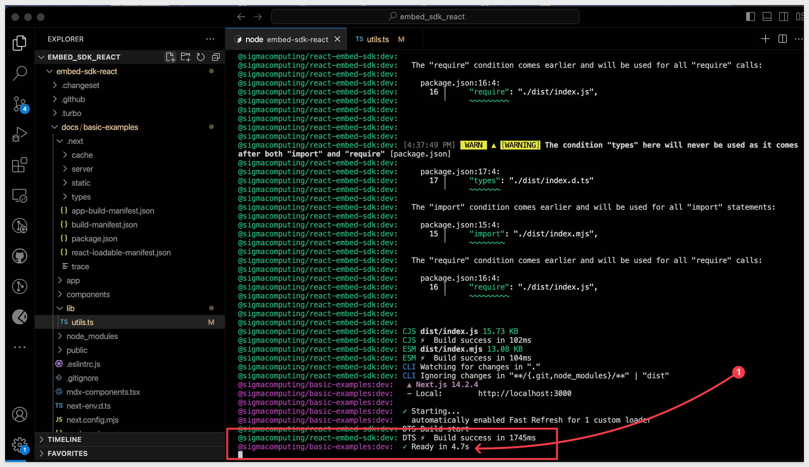
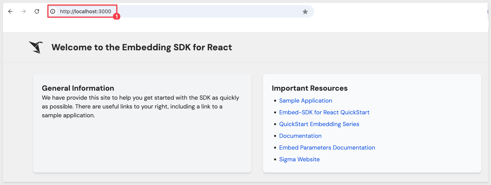
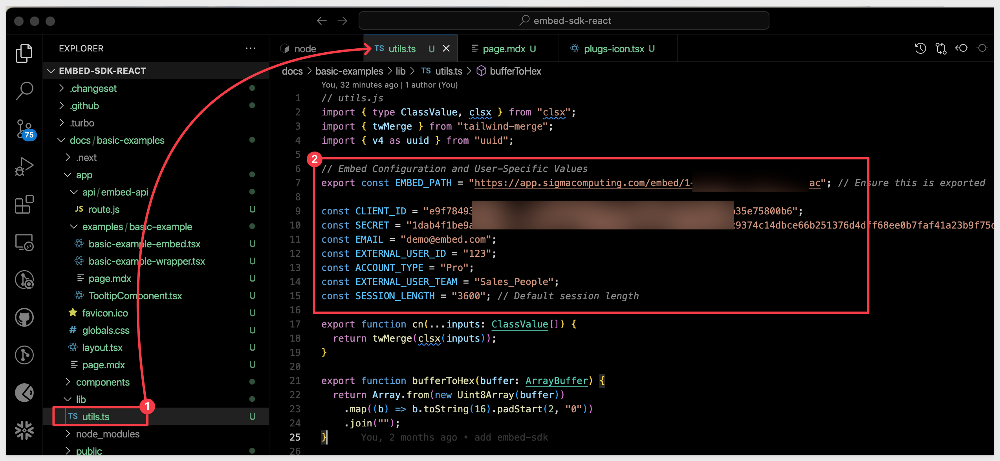

author: pballai
id: embedding_15_embed_sdk
summary: embedding_15_embed_sdk
categories: Embedding
environments: web
status: Published
feedback link: https://github.com/sigmacomputing/sigmaquickstarts/issues
tags: default
lastUpdated: 2024-09-18

# Embedding 15: Embed-SDK for React

## Overview 
Duration: 5 

Sigma provides many methods to allow users and developers to interact with its systems including web-ui, [REST API,](https://help.sigmacomputing.com/reference/get-started-sigma-api) [Javascript Embed API](https://help.sigmacomputing.com/docs/example-embed-api-and-url) and an SDK for the [React](https://react.dev/) framework. 

The Embed-SDK for React offers a higher-level, developer-friendly interface that simplifies integration into applications, in contrast to Sigma’s lower-level JavaScript Embed-API, which provides more granular control but may require additional coding

There are some reasons why developers might choose one over the other. Each method offers distinct advantages depending on the project requirements, developer expertise, and desired level of control or simplicity.2

Some of those reasons can be:

### Simplification of Integration:
**Ease of Use:** An SDK typically provides higher-level abstractions and utilities that simplify integration into various frameworks and environments. It’s often designed to handle common tasks, setup, and error handling more automatically.

**Reduced Boilerplate Code:** Using an SDK can significantly reduce the amount of code developers need to write themselves, as it often includes methods that encapsulate multiple steps of a process into single function calls.

### Consistency and Reliability:
**Standardized Code:** SDKs provide a standardized way of interacting with an API, which can reduce errors and inconsistencies in how different developers or teams implement their solutions.

**Maintained by Source:** Since SDKs are usually provided and maintained by the source company (in this case, Sigma), they are likely to be well-supported and updated regularly, ensuring compatibility with the latest versions of the API.

### Framework-Specific Integration:
**Framework Optimizations:** SDKs often include optimizations for specific programming frameworks (like React, Angular, or Vue.js). For example, a React SDK might use hooks or context providers to integrate more seamlessly with React apps.
	
**Handling Dependencies:** The SDK might automatically manage dependencies and interactions with other libraries, which can help in maintaining clean and efficient codebases.

Choosing between an SDK and directly using an API depends on the specific needs of your project, your team’s expertise, and the level of custom functionality required. 

SDKs are generally recommended for most standard implementations due to their ease of use, while direct API integration might be better suited for more customized or lower-level integrations.

### Target Audience
Developers interested in evaluating Sigma software development kit ("SDK") for [React.](https://react.dev/)

### Prerequisites

<ul>
  <li>A computer with a current browser. It does not matter which browser you want to use.</li>
  <li>Access to your Sigma environment.</li>
  <li>Some familiarity with Sigma is assumed. Not all steps will be shown as the basics are assumed to be understood.</li>
  <li>A development environment of choice. We will demonstrate with Microsoft VSCode and related extensions</li>
</ul>

<aside class="postive">
<strong>IMPORTANT:</strong><br> Sigma recommends that you use non-production resources when doing QuickStarts.
</aside>

<button>[Sigma Free Trial](https://www.sigmacomputing.com/free-trial/)</button>
 


## Source Code Editor - VSCode 
Duration: 5 

For this QuickStart, we will demonstrate using Visual Studio Code (VSCode), but you may use any IDE you prefer. 

VSCode, is a source-code editor developed by Microsoft for Windows, Linux and macOS. Features include support for debugging, syntax highlighting, intelligent code completion, snippets, code refactoring, and embedded Git.

[Install VSCode from Microsoft's download site.](https://code.visualstudio.com/download)

Run the installation with all defaults.

Open VSCode and make sure it loads without error.


<!-- END OF SECTION-->

## Using in Projects
Duration: 5

For experienced developers who just want to see how to use the SDK in a React project, we provide the following information.

The pubic embed-sdk git repository is [here.](https://github.com/sigmacomputing/embed-sdk)

<aside class="negative">
<strong>NOTE:</strong><br> If you are interested in running a sample application that is included in a git repo, skip to the section "Running the Sample Application".
</aside>

### For react-embed-sdk:
Use the following command, depending on your package manager:

```code
npm:
npm install @sigmacomputing/react-embed-sdk

yarn:
yarn add @sigmacomputing/react-embed-sdk

pnpm:
pnpm add @sigmacomputing/react-embed-sdk
```

### For embed-sdk:
Use the following command, depending on your package manager:

```code
npm:
npm install @sigmacomputing/embed-sdk

yarn:
yarn add @sigmacomputing/embed-sdk

pnpm:
pnpm add @sigmacomputing/embed-sdk
```

### Building
The repo uses turbo for its build system. It currently has 3 packages:

- embed-sdk: "bare-bones" wrappers over postMessages
- react-embed-sdk: React hooks to easily use the embed-sdk
- docs: A bare-bone documentation / examples

To build:
```code
pnpm run build
```

For additional information on Sigma embedding, see the [documentation.](https://help.sigmacomputing.com/docs/intro-to-embedded-analytics)

There is also a QuickStart series on embedding [here.](https://quickstarts.sigmacomputing.com/?cat=embedding)


<!-- END OF SECTION-->

## Running the Sample Application
Duration: 5 

We created a simple application, that you can add an embed to.

To save you time, we've stored all the necessary project files in a [GitHub](https://github.com/) repository ("git repo"). Simply clone the git repo using a VSCode to download a copy to our local computer.

To clone the git repository in VSCode, click the link to `Clone Git Repository`:

We have made the source code available for this QuickStart's demonstration in a [public GitHub repository.](https://github.com/sigmacomputing/quickstarts-public).

While you may clone the entire repository (it is not that large), we want to avoid cloning sections of the repository that are not of immediate interest. 

Instead, we will use VSCode and terminal to perform a git `sparse-checkout` of the specific project folder we are interested in. A few extra steps, but cleaner local project folder. 

Open `VSCode` and a new `terminal` session.

In terminal, navigate to the desired directory where we want to clone the repo folder into.

For example:
```code
cd {/path/to/your/directory}
```

Execute the terminal command:
```code
git init
```

Add the remote repository as the origin:
```code
git remote add -f origin https://github.com/sigmacomputing/quickstarts-public.git
```

Enable sparse checkout:
```code
git config core.sparseCheckout true
```

Specify the folder you want to clone by adding it to the sparse-checkout configuration:
```code
echo "embedding_sdk_react" > .git/info/sparse-checkout
```

At this point, we have run each command and not seen any errors:


Finally, pull the specified folder from the repository:
```code
git pull origin main
```

We can now see the cloned project folder:


The folder contains the entire `embed-sdk-react` for you to explore, and there is a sample application we will use for demonstration. 

Before we do that, we need to install a few other dependencies to prepare the project folder for initial use.


<!-- END OF SECTION-->

## Environment Setup
Duration: 20

We need to install Node and other related packages. While this can be done manually, Homebrew allows us to install Node and pnpm with a simple command. 

This avoids the need to manually download and install from the official websites.

Using VSCode, open a terminal session (or use the old session):


Paste the following command into terminal and press Enter. This command will download and install Homebrew:

```code
/bin/bash -c "$(curl -fsSL https://raw.githubusercontent.com/Homebrew/install/HEAD/install.sh)"
```

The system will prompt for your system password, and then wait till enter is pressed:


Homebrew will be downloaded and setup. Once completed, a success message will be shown:


To verify the installation, run the command:
```code
brew --version
```

A version number should be returned. If not, review the next section.

### Brew: command not found error
This error generally indicates that brew cannot be found by the terminal session. This can be resolved by manually adding Homebrew to the path.

In terminal, open your .zshrc file with this command (still in terminal):
```code
nano ~/.zshrc
```

Add the following line at the end of the file to include Homebrew’s path:
```code
export PATH="/opt/homebrew/bin:$PATH"
```


<aside class="positive">
<strong>IMPORTANT:</strong><br> Review the other content of the .zshrc to make sure there the path to Homebrew is not already set from a previous installation. The path value needs to be assigned to where the Homebrew code is actually installed. 

If the path was already present, close the editor and run the command shown below.
</aside>

Save the changes, overwriting the existing file (the commands are shown on the editor's footer). 

Close the editor after saving.

Reload your shell configuration by running this command:
```code
source ~/.zshrc
```

The terminal prompt will reappear with no reply.

Retry brew verification:
```code
brew --version
```

The expected response looks like this:


### Runtime Environment - Node.js

[Node.js](https://nodejs.org/en) (Node) is an open-source, cross-platform, back-end JavaScript runtime environment that runs on a JavaScript engine and executes JavaScript plaintext outside a web browser, which was designed to build scalable network applications.
 
We will install Node by using a terminal session in VSCode and leverage Homebrew via command line.

In VSCode, open a new terminal session and run the following command to check if Node is already installed:

```code
node -v
```

In our case, we see a recent version number, so no need to install again:


If Node.js is not already installed, install it by running the following command:

```code
brew install node
```

This command will download and install the latest stable version of Node along with `npm` (Node Package Manager) on your system. Once the installation is complete, you can verify the installation by checking the versions of Node.js as described earlier.

<aside class="negative">
<strong>NOTE:</strong><br> You version number will likely vary from what is shown in the screenshot, based on when you installed Node.
</aside>

### Additional Dependencies

#### Corepack 
[Corepack](https://nodejs.org/api/corepack.html) is a Node tool intended to manage package managers without needing global installs of these package managers. It comes pre-installed with Node starting from version 16.10, but we still need to enable it.

Run the following command to enable `Corepack`:

```code
corepack enable
```

The terminal prompt will appear with no other message unless there is an error. 

<aside class="negative">
<strong>NOTE:</strong><br> We have seen instances where it is required to run the command shown above as "sudo". If an error is thrown regarding access, rerun the command as "sudo corepack enable". Terminal will prompt for the system password, allowing the action to be allowed.
</aside>

#### pnpm
[pnpm](https://www.npmjs.com/package/pnpm) is a package manager like npm or Yarn, known for its efficiency regarding disk space and speed.

Running `pnpm i` installs the dependencies listed in your project’s package.json file. It creates a node_modules directory where all your project’s dependencies are stored and also updates the pnpm-lock.yaml file, which ensures that the same versions of the dependencies are installed every time you or anyone else runs pnpm install.

Run the following command to install  `pnpm`:

```code
pnpm i
```

If terminal throws an error "This project is configured to use yarn", make sure you are in the correct directory, which should be:
```code
{your path}/embed-sdk-react
```

The results look like this:


<!-- END OF SECTION-->


## Start Development Server

We are ready to test the `Embed-SDK` application. Run the following command in terminal:

```code
pnpm run dev
```

The first time, the system may prompt to allow network connections. Click `Allow`, as this is only running on our local machine, port 3000. 

This starts the development server and when ready will appear like this. 



Open a browser and navigate to:
```code
http://localhost:3000
```

Sigma has provided a sample application page, with useful links.



In the next section will will look at how the embed is configured in code.


<!-- END OF SECTION-->

## Sample Application
Duration: 5 

From the landing page, click the link for the `Sample Application`.

The sample application has an example of a Sigma embed (provided from a Sigma instance) along with a list of the primary files involved. 

The list of files has tooltips to provide general information but the files themselves are commented to assist you.

<aside class="negative">
<strong>NOTE:</strong><br> The "Sample embed" in the screenshot below will not render as we need to provide an embed and credentials from your Sigma environment.
</aside>


### Primary source files

There are five files involved in this example embed:

 <ul>
      <li><strong>.env:</strong> Application environment variables file. This is where we are storing the Sigma embed credentials</li>
      <li><strong>File Path: </strong>embed-sdk-react/docs/basic-examples/.env</li>
</ul>

```code
# .env
# Sigma Embed Credentials. These two values will need to be changed when using your own Sigma instance to embed content

# Values from my Sigma instance
EMBED_URL={url path to embed}
EMBED_CLIENT_ID={your client id}
EMBED_SECRET=(your embed secret)
```

<ul>
      <li><strong>utils.ts:</strong> This file contains utility functions that facilitate the embedding of Sigma dashboards into a web application by generating signed URLs. These signed URLs ensure secure and authorized access to Sigma dashboards or visualizations.</li>
      <li><strong>File Path: </strong>embed-sdk-react/docs/basic-examples/lib/utils.ts</li>
</ul>

```code
/* utils.tx */
/* contains utility functions that facilitate the embedding of Sigma dashboards into a web application by generating signed URLs */

import { type ClassValue, clsx } from "clsx";
import { twMerge } from "tailwind-merge";
import { v4 as uuid } from "uuid";

/**
 * Merges Tailwind CSS classes conditionally.
 * @param inputs - An array of class values to conditionally merge.
 * @returns A string of merged class names.
 */
export function cn(...inputs: ClassValue[]) {
  return twMerge(clsx(inputs));
}

/**
 * Converts an ArrayBuffer to a hex string.
 * - Converts the buffer to a byte array.
 * - Maps each byte to a two-character hex string.
 * @see https://developer.mozilla.org/en-US/docs/Web/API/SubtleCrypto/digest#converting_a_digest_to_a_hex_string
 */
export function bufferToHex(buffer: ArrayBuffer) {
  return Array.from(new Uint8Array(buffer))
    .map((b) => b.toString(16).padStart(2, "0"))
    .join("");
}

/**
 * Uses the Web Crypto API to create a SHA256 HMAC hex string.
 * @param key - The key used for signing.
 * @param data - The data to be signed.
 * @returns An object containing the hex string of the HMAC signature.
 */
async function simpleHmac({ key, data }: { key: string; data: string }) {
  const encoder = new TextEncoder();
  const encodedKey = encoder.encode(key);
  const encodedData = encoder.encode(data);

  // Import the key for HMAC signing
  const hmacKey = await crypto.subtle.importKey(
    "raw",
    encodedKey,
    {
      name: "HMAC",
      hash: "SHA-256",
    },
    true,
    ["sign", "verify"],
  );

  // Sign the data using the imported key
  const signature = await crypto.subtle.sign("HMAC", hmacKey, encodedData);

  // Convert the signature to a hex string
  const hex = bufferToHex(signature);

  return { hex };
}

/**
 * Signs a Sigma embed URL with a cryptographic signature.
 * @param dashboard - The base URL of the Sigma dashboard or visualization.
 * @returns A signed URL with appended query parameters.
 */
export async function signEmbedUrl(dashboard: string): Promise<string> {
  const { EMBED_SECRET, EMBED_CLIENT_ID } = process.env;
  if (!EMBED_SECRET || !EMBED_CLIENT_ID) {
    throw new Error("SIGMA_EMBED_SECRET is not set");
  }

  // Sigma Embed Parameters (normally, these are generated programmatically)
  const searchParamsObject = {
    ":mode": "userbacked", // mode for secure embedding
    ":email": "embed-sdk@sigmacomputing.com", // Email associated with the embedded session
    ":external_user_team": "Sales_People", // External team associated with the user
    ":account_type": "viewer", // Account type, e.g., viewer or editor
    ":nonce": uuid(), // Unique identifier for the session to prevent replay attacks
    ":time": `${Math.floor(new Date().getTime() / 1000)}`, // Current timestamp in seconds
    ":session_length": "36000", // Session length in seconds (10 hours)
    ":client_id": EMBED_CLIENT_ID, // Client ID for authentication
    ":external_user_id": "123", // External user ID for tracking purposes
  };

  const searchParams = new URLSearchParams(searchParamsObject);

  // Append search parameters to the base dashboard URL
  const urlWithSearchParams = `${dashboard}?${searchParams.toString()}`;

  // Create a cryptographic signature using the embed secret
  const SIGNATURE = await simpleHmac({
    key: EMBED_SECRET,
    data: urlWithSearchParams,
  });

  // Append the signature to the query parameters
  searchParams.append(":signature", SIGNATURE.hex);

  // Construct the final signed URL
  const signedUrl = `${dashboard}?${searchParams.toString()}`;

  return signedUrl;
}
```

<ul>
	<li><strong>basic-example-wrapper.tsx:</strong> The SignedIframe component is responsible for securely embedding a Sigma Computing dashboard into a React application.</li>
  <li><strong>File Path: </strong>embed-sdk-react/docs/basic-examples/app/examples/basic-example/basic-example-wrapper.tsx</li>
</ul>

```code
// basic-example-wrapper.tsx
// The SignedIframe component is responsible for securely embedding a Sigma Computing dashboard into a React application.
// 	signEmbedUrl: This function is imported from the Sigma Embed SDK library and is used to generate a signed URL for secure access to a Sigma dashboard.

// Import the signEmbedUrl function from the utilities module
import { signEmbedUrl } from "@/lib/utils";
// Import the BasicExample component, which is responsible for rendering the iframe
import BasicExample from "./basic-example-embed";

// Define an asynchronous component to sign the URL and render the iframe
export default async function SignedIframe() {
  // Get the base URL from the environment variable
  const src = process.env.EMBED_URL || ""; // Use the value from the .env file

  try {
    // Await the signed URL by passing the base URL to the signEmbedUrl function
    const signedSrc = await signEmbedUrl(src);

    // Log the base and signed URLs as output in server-side terminal session
    console.log("Signed URL:", signedSrc);

    // Return the BasicExample component with the signed URL as a prop
    return <BasicExample src={signedSrc} />;
  } catch (error) {
    // Log any errors encountered during signing
    console.error("Error signing URL:", error);
    return <p>Error loading iframe</p>;
  }
}
```

<ul>
	<li><strong>basic-example-embed.tsx:</strong> This file is a React component designed to embed a Sigma Computing dashboard using an iframe within a React application.</li>
</ul>

```code
// basic-example-embed.tsx
// Utilizes the Sigma Computing Embed SDK to integrate an iframe within a React application.

"use client"; // Next.js directive to ensure this component runs only on the client-side.

import React from "react";
// Import the useSigmaIframe hook from the Sigma Computing React Embed SDK
import { useSigmaIframe } from "@sigmacomputing/react-embed-sdk";

// Define the BasicExample component, which receives a 'src' prop for the iframe URL
export default function BasicExample({ src }: { src: string }) {
  // Destructure the iframeRef, loading, and error values from the useSigmaIframe hook
  const { iframeRef, loading, error } = useSigmaIframe();

  return (
    // Parent container with full height
    <div className="h-full">
      {/* Conditional rendering: Display loading text if the iframe is loading */}
      {loading && <p className="text-center">Loading...</p>}
      {/* Conditional rendering: Display error message if there is an error loading the iframe */}
      {error && <p className="text-center text-red-500">Error loading iframe</p>}
      {/* Render the iframe, filling the parent container */}
      <iframe
        src={src} // Source URL for the iframe
        ref={iframeRef} // Reference from useSigmaIframe hook for managing iframe interactions
        className={`w-full h-full ${loading || error ? "hidden" : ""}`} // CSS classes for full width/height and conditional visibility
        style={{ border: "none" }} // Inline style to remove default border
      />
    </div>
  );
}
```

 <ul>
      <li><strong>page.mdx:</strong> Renders the webpage, SignedIframe and logs the Signed URL for console log display only.</li>
</ul>

```code
{/* page.mdx */}
{/*Renders the webpage and SignedIframe*/}

import SignedIframe from './basic-example-wrapper';
import TooltipComponent from './TooltipComponent';

export default function ExamplePage() {
  return (
    <div className="p-4">
      <h1 className="text-2xl font-bold mb-4">Sigma Dashboard Example</h1>

      {/* Grid Container */}
      <div className="grid grid-cols-1 gap-8 md:grid-cols-2">

        {/* Example Embed */}
        <div className="bg-gray-100 p-6 rounded-lg shadow-md mb-8">
          <h2 className="text-xl font-bold">Example Embed</h2>
          <p>
            The embed shown below is provided free of charge by Sigma Computing, as an example only. The files that
            have been customized are listed on your left.
          </p>
          <p>
            While you will not be able to customize this example in terms of parameters that are
            sent to Sigma by the Embed-SDK, you can review the files involved to see a working example of what is
            minimally required.
          </p>
        </div>

        {/*Files Involved*/}
        <div className="bg-gray-50 p-6 rounded-lg shadow-md mb-8">
          <h2 className="text-xl font-bold">Files Involved (all files in docs/basic-examples/..) </h2>
          <ul className="list-disc pl-5 mt-2 space-y-2">
    <li className="list-inside">
              <TooltipComponent text="Application environment variables file. This is where we are storing the Sigma embed credentials">
               .env
              </TooltipComponent>
            </li>
    <li className="list-inside">
              <TooltipComponent text="This file contains utility functions that facilitate the embedding of Sigma dashboards into a web application by generating signed URLs. These signed URLs ensure secure and authorized access to Sigma dashboards or visualizations.">
                /lib/utils.ts
              </TooltipComponent>
            </li>
    <li className="list-inside">
              <TooltipComponent text="The SignedIframe component is responsible for securely embedding a Sigma Computing dashboard into a React application.">
                app/examples/basic-example/basic-example-wrapper.tsx
              </TooltipComponent>
            </li>
    <li className="list-inside">
              <TooltipComponent text="This file is a React component designed to embed a Sigma Computing dashboard using an iframe within a React application.">
                /app/examples/basic-example/basic-example-embed.tsx
              </TooltipComponent>
            </li>
          </ul>
        </div>
      </div>

      {/* BasicExample Block - Full Width */}
      <div className="bg-white p-6 rounded-lg shadow-md h-[calc(100vh-16rem)] w-full">
        <SignedIframe />
      </div>
    </div>
  );
}
    
{/* Generate Signed URL for console log display only */}
console.log("Signed URL:", signedSrc);
```

### Logging
When the sample application is running, the server displayed in VSCode’s Terminal will show a one-time-use SignedURL for debugging purposes only. **While not required**, we’ve included this to demonstrate and assist in debugging any issues you may encounter while customizing embed parameters.


<!-- END OF SECTION-->

## Customize the Embed
Duration: 5 

We want to use our own Sigma instance for this embed, so we will need to do a few things.

### 1: Embed credentials
Log into your own Sigma instance as `Administrator` and navigate to `Administration` > `Developer Access` and click the button to `Create New` client credentials. 

Check the box on for `Embedding`, provide a name and assign the new credentials to a Sigma administrator for now.

Copy the `Client Id` and `Secret` and update the `.env` file that is part of the new `basic-example` folder, over-writing the old values. `Save` the `.env` file.

For more information on generating embed client credentials, [see here.](https://help.sigmacomputing.com/docs/generate-embed-client-credentials)

### 2: Create a new workbook

Create a new workbook in Sigma and add any available table to it. It does not matter at this point what content is added.

<aside class="negative">
<strong>NOTE:</strong><br> The Sigma Sample Database has lots of data you can use to quickly start working on common example datasets.
</aside>

Save the workbook, the name does not matter at this point. 

### 3: Share the Workbook
Click the caret to the right of the workbook's name and select `Share...`. Share the workbook with any team, making note of which you selected. 

<aside class="negative">
<strong>NOTE:</strong><br> If no teams exist yet, navigate to "Administration" > "Teams" and create a new public team.
</aside>


We are sharing ours with the `Sales_People` team:


For more information on teams in Sigma, [see here.](https://help.sigmacomputing.com/docs/manage-teams)

### Generate Embed URL
Open the workbook's menu again and select `Embedding...` this time.

Select `Secure` and `Entire Workbook`. Copy this url and click `Close`.

Open the project file `.env`, and add your `client_ID`, `secret` and `embed url` values:



### Embed parameters
The last step is to adjust the parameters that the parent application will send to Sigma as it constructs the signedURL.

Recall that this is done in the `utils.ts` file in the section `const searchParamsObject`.

<aside class="positive">
<strong>IMPORTANT:</strong><br> We are hard-coding parameter values but these are normally generate programmatically by the parent application at runtime and are based on the requesting user.
</aside>

The only value we will change is the `external_user_team`, which we will set to `Sales_People` (yours may be different).

We commented the old value and made a copy of the line, adjusting for the value of `Sales_People`:


The rest can stay the same for now, while we test this works.

Save the `utils.tx` file.

### Test the application

Refresh the browser using the url:
```code
http://localhost:3000/examples/basic-example
```

The workbook we elected to embed is shown on the React application page, in the iframe as expected:


For more information on using parameters and user attributes in Sigma embedding scenarios, the following resources are available:

Embed URL Parameters documentation, [see here.](https://help.sigmacomputing.com/docs/embed-url-parameters)

[QuickStart on Parameters and User-Attributes](https://quickstarts.sigmacomputing.com/guide/embedding_05_leverage_parameters_and_ua/index.html?index=..%2F..index#0)

Implement inbound and outbound events in embeds documentation, [see here.](https://help.sigmacomputing.com/docs/inbound-and-outbound-events-in-embeds)


<!-- END OF SECTION-->

## What we've covered
Duration: 5

In this QuickStart we explored how to use the embedding SDK for React with Sigma. 

**Additional Resource Links**

[Blog](https://www.sigmacomputing.com/blog/)<br>
[Community](https://community.sigmacomputing.com/)<br>
[Help Center](https://help.sigmacomputing.com/hc/en-us)<br>
[QuickStarts](https://quickstarts.sigmacomputing.com/)<br>


Be sure to check out all the latest developments at [Sigma's First Friday Feature page!](https://quickstarts.sigmacomputing.com/firstfridayfeatures/)
<br>

[](https://twitter.com/sigmacomputing)&emsp;
[](https://www.linkedin.com/company/sigmacomputing)&emsp;
[](https://www.facebook.com/sigmacomputing)


<!-- END OF WHAT WE COVERED -->
<!-- END OF QUICKSTART -->