author: pballai
id: embedding_16_jwt
summary: embedding_16_jwt
categories: Embedding
environments: web
status: published
feedback link: https://github.com/sigmacomputing/sigmaquickstarts/issues
tags: deprecated
lastUpdated: 2024-10-24

# Embedding 16: Secure Embedding with JWT

## Overview 
Duration: 5 

Many customers want a simple, but secure way to embed content that can be accessed by both external (users who do not have a registered account in Sigma) and internal user (users who access Sigma only through an embed, inside a parent application). 

To enable this, Sigma supports authenticating secure embeds using <a href="https://jwt.io/" target="_blank">JSON Web Tokens (JWT)</a>. 

### Benefits of JWT
Signing your secure embed URLs with JWTs has several advantages:

- JWTs are compact, URL-safe tokens that can be digitally signed, ensuring that the data they contain is tamper-proof.

- Embed developers no longer have to use the Sigma UI to generate embed paths; they may use the URL instead.

- Embedding workbooks, pages and individual visualizations is supported.

- JWT-signed embed URLs can authenticate internal Sigma users to access embedded content with the same email address they use for their Sigma account. 

- When using JWT-signed URLs with Sigma, you have the option to disable automatic embed user account provisioning for non-Sigma users, effectively restricting your embed content to the users you have explicitly provisioned in Sigma or your IdP.

<aside class="positive">
<strong>REPLAY ATTACK PREVENTION:</strong><br> Existing embed customers are likely familiar with Sigma’s "signed URL" embed-API, which uses a nonce to ensure that the constructed URL is for one-time use only. Similarly, JWTs are also for one-time use. 

<aside class="negative">
<strong>NOTE:</strong><br> The existing secure Embed-API solution will continue to work. Customers will not have to make any changes immediately, although JWT is likely to become the preferred solution over time, due to it's many benefits.
</aside>


When a JWT is issued, the jti claim—a unique identifier for the token—is stored server-side. 

When the JWT is used (e.g., to access an embedded Sigma dashboard), the server checks whether the jti has already been seen. 

If it has, the token is rejected as a replay attempt, ensuring it cannot be reused.
</aside>

<aside class="positive">
<strong>IMPORTANT:</strong><br> Some screens in Sigma may appear slightly different from those shown in QuickStarts. This is because Sigma is continuously adding and enhancing functionality. Rest assured, Sigma’s intuitive interface ensures that any differences will not prevent you from successfully completing any QuickStart.
</aside>

For more information on Sigma's product release strategy, see [Sigma product releases.](https://help.sigmacomputing.com/docs/sigma-product-releases)

### Target Audience
Developers evaluating Sigma embedding and the security options.

### Prerequisites

<ul>
  <li>A computer with a current browser. It does not matter which browser you want to use.</li>
  <li>Access to your Sigma environment.</li>
  <li>Some familiarity with Sigma is assumed. Not all steps will be shown as the basics are assumed to be understood.</li>
  <li>A development environment of choice. We will demonstrate with Microsoft VSCode and related extensions.</li>
</ul>

<aside class="postive">
<strong>IMPORTANT:</strong><br> Sigma recommends that you use non-production resources when doing QuickStarts.
</aside>

<button>[Sigma Free Trial](https://www.sigmacomputing.com/free-trial/)</button>
 


## How JWT Works
Duration: 5

JSON Web Token (JWT) is a compact, URL-safe means of representing claims to be transferred between two parties. It is a product of the Internet Engineering Task Force (IETF) [RFC 7519](https://datatracker.ietf.org/doc/html/rfc7519).

The claims in a JWT are encoded as a JSON object that is used as the payload of a JSON Web Signature (JWS) structure or as the plaintext of a JSON Web Encryption (JWE) structure, enabling the claims to be digitally signed or integrity protected with a Message Authentication Code (MAC) and/or encrypted.

The remaining discussion in this section is intended for those less familiar with JWT, how it is structured, the transaction flow and benefits. Feel free to jump to the next section if you just want a demonstration of JWT in Sigma.

In the typical workflow, a client requests embedded content using a JSON Web Token (JWT), and the server processes, validates, and serves the embedded content based on user credentials and environment variables.

#### Step-by-Step JWT Flow:

**1. Client Request (ie: end user's web browser):**<br>
The client (e.g., a web application or another service) sends a request to the server to obtain a URL for accessing embedded Sigma content. This request may include user-related information, such as identity or a general request for access to Sigma content.

**2. Server-Side JWT Generation (ie: customer created embed-API):**
***Credential Handling:***<br>
The server securely manages the necessary credentials to generate the JWT, such as the secret key (EMBED_SECRET) and client ID (EMBED_CLIENT_ID). These credentials ensure that the JWT is properly signed and trusted by Sigma.

***User Claims:***<br>
The server retrieves or determines relevant claims about the user, such as their email (sub), roles, or team memberships. These claims are vital for defining what the user can do in the embedded Sigma content and ensure that permissions are enforced correctly.

***JWT Creation:***<br>
The server combines these user claims with the necessary credentials to create a JWT. The JWT is signed using the server’s secret key, ensuring its integrity and authenticity. The JWT contains claims that specify key information, including:

- Who the user is (email, user roles)
- What permissions they have
- How long the JWT is valid (expiry or exp claim)

This process ensures that each JWT is unique, secure, and reflects the user's specific access rights.

**3. Response with Signed URL:**<br>
The server responds to the client with a signed URL, which contains the JWT as a query parameter. For example, the URL might look like:
```code
https://app.sigmacomputing.com/<org-slug>?jwt=<jwt>
```

This URL includes the signed JWT that will be used to authenticate and authorize the user when they access the embedded Sigma content.

**4. Client Accesses the Signed URL:**<br>
When the client (e.g., the end-user's browser or a web app) loads the signed URL, Sigma verifies the JWT. Sigma ensures that:

- The JWT signature is valid, confirming that the token hasn’t been tampered with.
- The claims (like sub, roles, exp) are still valid, checking whether the user is authorized and whether the token is within its allowed time frame.
- Replay protection is enforced by validating the jti (JWT ID) claim, ensuring that the token is not reused maliciously.

**5. Sigma Provides Embedded Content:**<br>
If the JWT passes all verification checks (valid claims, signature, jti uniqueness, etc.), Sigma serves the requested embedded content. The content provided matches the user’s permissions and scope, ensuring that users can only access what they are authorized to view.

This workflow ensures secure, one-time use access to Sigma’s embedded content, protecting both user data and application integrity.

### Structure of JWT:

An actual JWT is composed of three parts: `Header`, `Payload`, and `Signature`, which are concatenated with dots (.) to form a single string:

**Header:** Typically consists of two parts: the type of token (JWT) and the signing algorithm (e.g., [HMAC SHA256](https://en.wikipedia.org/wiki/HMAC)).

**Payload:** Contains the claims. Claims are statements about an entity (typically, the user) and additional data. There are three types of claims: registered, public, and private claims.

**Signature:** Used to verify that the sender of the JWT is who it says it is and to ensure that the message wasn’t changed along the way.

#### Claims in Sigma

**1: Registered Claims:** These are predefined, standardized claims that are recommended to be used in a JWT. They have specific purposes and are commonly recognized across implementations.

Examples:<br>
- sub (Subject): This claim identifies the subject of the JWT, usually the user. In Sigma, it is often the email of the user accessing the embedded content.

- iss (Issuer): This claim identifies the issuer of the JWT. In Sigma, it is the client ID used to issue the token.

- jti (JWT ID): This is a unique identifier for the JWT. It’s used to prevent the JWT from being replayed.

**2. Public Claims:** These are claims that can be defined at will by those using JWTs.

Examples:<br>
- account_type: the type of account the user has (e.g., “lite”, pro”). 

- teams: indicates the teams to which a user belongs. 

**3. Private Claims:** These are custom claims created to share information between parties that agree on using them but do not need to be registered or standardized. They are specific to the application and are not meant to be shared beyond the agreed-upon parties.

Examples:<br>
- custom user attributes
- eval_connection_id

For more information on JWT claims in Sigma, [see here.](https://help.sigmacomputing.com/docs/create-an-embed-api-with-json-web-tokens)


<aside class="positive">
<strong>NOTE:</strong><br> JWT-signed embed URLs can authenticate internal Sigma users to access embedded content with the same email address they use for their Sigma account.
</aside>


## Making it Work In Sigma
Duration: 5 

### Clone the Git Repository Project Folder
We have made sample project code available in a public GitHub repository to save time.

While you may clone the entire repository (it is not that large), we want to avoid cloning sections of the repository that are not of immediate interest. 

Instead, we will use VSCode and terminal to perform a git `sparse-checkout` of the specific project folder we are interested in. A few extra steps, but cleaner local project folder. 

Open `VSCode` and a new `terminal` session.

In terminal, navigate to the desired directory where we want to clone the repo folder into.

For example:
```code
cd {/path/to/your/directory}
```

Make a new directory:
```code
mkdir sigma_secure_embed_jwt
```

Change to the new directory:
```code
cd sigma_secure_embed_jwt
```

Execute the terminal command:
```code
git init
```

Add the remote repository as the origin:
```code
git remote add -f origin https://github.com/sigmacomputing/quickstarts-public.git
```

Enable sparse checkout:
```code
git config core.sparseCheckout true
```

Specify the folder you want to clone by adding it to the sparse-checkout configuration:
```code
echo "embedding_jwt/jwt/" >> .git/info/sparse-checkout
```

At this point, we have run each command and not seen any errors:

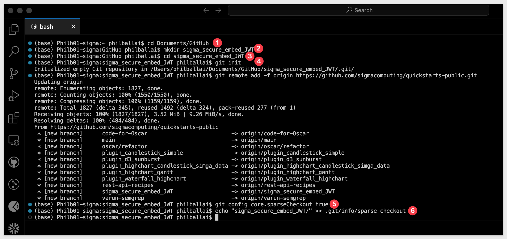

Finally, pull the specified folder from the repository:
```code
git pull origin main
```

<aside class="positive">
<strong>IMPORTANT:</strong><br> The next step requires Node.js. If it has never been installed on your machine, install it from the official site:

[Download Node.js](https://nodejs.org/)

We recommend installing the **LTS (Long Term Support)** version.

Once installed, you can verify the installation in Terminal with:

node -v
npm -v
</aside>

Finally, load node into the local project:
```code
npm install
```

After the command runs, click the button to `Open Folder`:

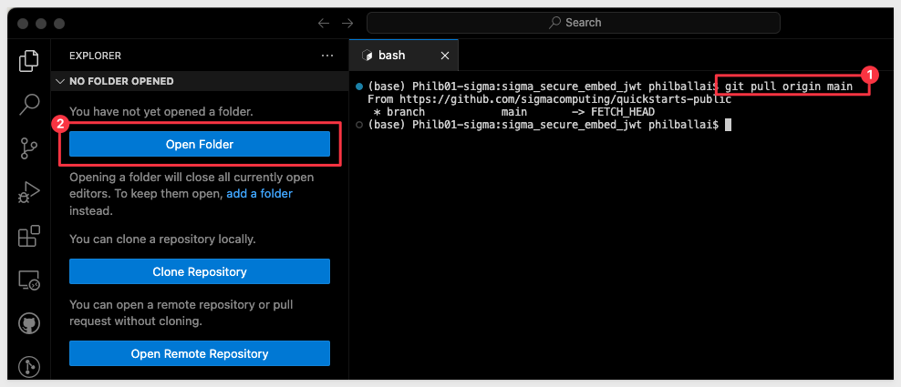

Navigate to where your folder is and click `Open`.

We can now see the project called `embedding_JWT` with the files stored in the `jwt` folder:

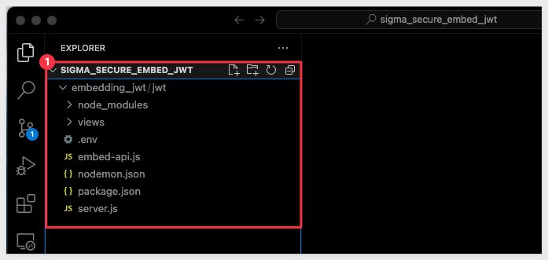

### Additional node.js packages
We need to install two additional node packages that provide us some additional "convenience functionality". 

**1: nodemon:**<br>
This package is a development tool that automatically restarts our Node.js application whenever it detects changes in specific code files. This helps streamline development by eliminating the need to manually restart the server after each change we make.

**2: jsonwebtoken**<br>
We use this package to decode a JWT in the VSCode console. This allows us to read the payload and header data from the token without verifying its authenticity. This is helpful when you need to access the information embedded within the token for non-secure contexts or for inspection/debugging purposes.

To install these two packages, open a new terminal window in VSCode in the project folder.

Run the command:
```code
npm install jsonwebtoken
```

and
```code
npm install nodemon
```

The expected output is:

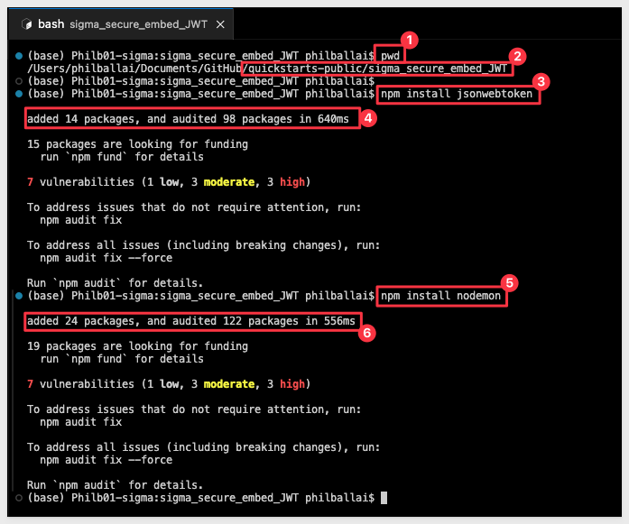

The project has almost everything we need, but we will need some embedded content and credentials from Sigma before we can test this out.


<!-- END OF SECTION-->

## Create Embed Credentials
Duration: 5 

We will create the required information to pass to the developer of the Parent application (in this case the developer is us).

### Sigma Embed Client credentials
Embed `Client credentials` ("credentials") are a crucial component for creating a Sigma embed. These credentials are encoded within your embed URL, providing an additional layer of validation to ensure the embed's authenticity and security.

The credentials are made up of the `Client ID` and `Client Secret`, and are generated using the Sigma UI.

The credentials will be used in the embed API, to ensure your embed URLs are valid at run-time.

**Here are some important points to note about the credentials:**

**Irretrievable**: Once created, you cannot retrieve the original credentials. Ensure to store them securely.

**Regeneration**: If the credentials are lost, they can be regenerated, but with different values. This will invalidate all existing embeds until the new values are in place in the embed API.

**Update Requirement**: After regenerating new credentials, you must update all existing embeds, using the Embed API for that change. 

Remember to keep your credentials in a secure location, as losing them requires action to maintain your embedded analytics functionality.

<aside class="positive">
<strong>IMPORTANT:</strong><br> You cannot look up your organizations existing credentials (Sigma support has no access to your credentials) after they have been created. 

If you lose your credentials, you must regenerate new credentials. 

If this happens, your existing embeds will be rendered invalid until the embed API is updated with the new credentials.
</aside>

### Client Credentials Creation

We will now create credentials that are specific to our workbook embed. 

**1:** Navigate to `Administration` > `Developer Access`:

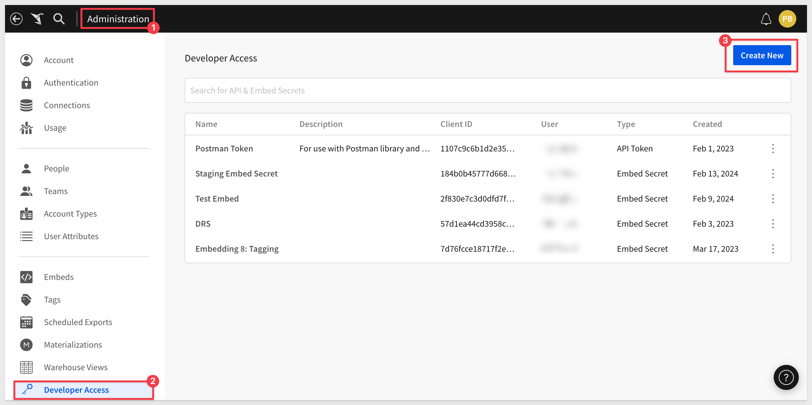

**2:** Click `Create New`, located in the page's top right corner. This will open the `Create Client Credentials` modal.

**3:** Under `Access Credential Type?` select `Embedding`.

**4:** Enter a `Name` and `Description` as you see fit.

**5:** Under `Owner`, select an organization member with the account type you would like to associate with the embed secret. For now, just select yourself or an `Administrator`. It is recommended to always select a user with administrative access to allow adjustments in the future, if needed. 

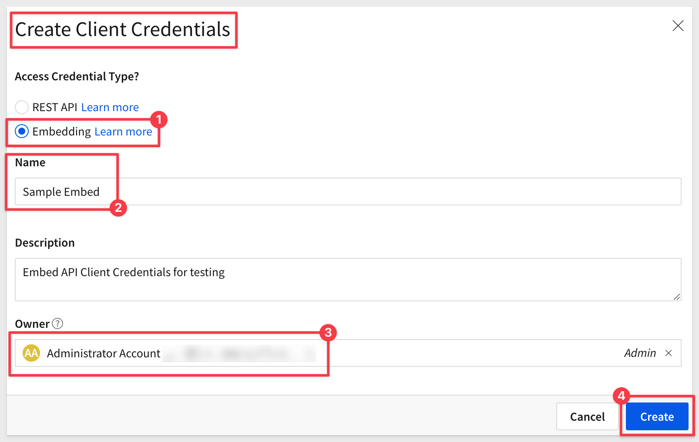

<aside class="negative">
<strong>NOTE:</strong><br> Some customers elect to have a "Service Account" user with administrative privileges for this "owner" assignment.
</aside>

**6:** Click Create:

**7:** Copy the provided `ClientID` and `Secret` and store them.


**8:** Click Close.

Paste the credentials into a text file for now, we will use them later. 

<aside class="negative">
<strong>NOTE:</strong><br> We can use these credentials for all embeds, but you may create as many credentials as you prefer.
</aside>


<!-- END OF SECTION-->

## Something to Embed
Duration: 5 

This embedding method allows you to use any Sigma URL to embed, assuming the proper permissions are passed along with it as parameters. 

Sigma is very flexible and has different workflows for creating content, based on source data. 

For example, we could first create a [data model](https://help.sigmacomputing.com/docs/intro-to-data-models), set permission on it, and then save it off for later use in a workbook. We would then create a workbook with a table, that shows data from the data model we saved earlier.

<aside class="negative">
<strong>NOTE:</strong><br> To leverage the features in secure embedding, permission to your data is required at some level. Creating a data model and granting permissions to it is considered a best practice.
</aside>

To minimize the steps, we will leverage a different workflow.

<aside class="positive">
<strong>IMPORTANT:</strong><br> In either case, customers should evaluate the many options in Sigma against their own information security, compliance and governance policies, in order to make the best choices for their organizations. Sigma will be there to assist in these decisions, at any time you need.
</aside>

### Create a Team
To demonstrate our embed, we need to create a [Team](https://help.sigmacomputing.com/docs/manage-teams) to share our new workbook with. 

Navigate to `Administration` > `Teams` and click `Create Team`. 

Name the new team `Sales_People`, and click `Create`. 

<aside class="positive">
<strong>AUTOMATIC EMBED USER ACCOUNT CREATION - PLEASE READ!</strong><br> We don't need to manually add users to this team, as they will be added automatically once they are authenticated by the parent application and access any embedded Sigma content.

When using JWT-signed URLs for secure embeds, you have the option to disable the automatic creation and updating of embed user accounts for non-Sigma users.

If you choose to disable this default behavior, you can restrict access to your embed content exclusively to users that you have explicitly provisioned in Sigma or your Identity Provider (IdP).

By default, automatic user creation is enabled. Sigma will automatically create embed users and assign them to the team specified in the teams claim. It will also update existing user assignments if new teams are provided in the teams claim.
</aside>

### Create a Workbook with Sample Data

From Sigma / `Home` click the `+` Create New button and click `Workbook`:

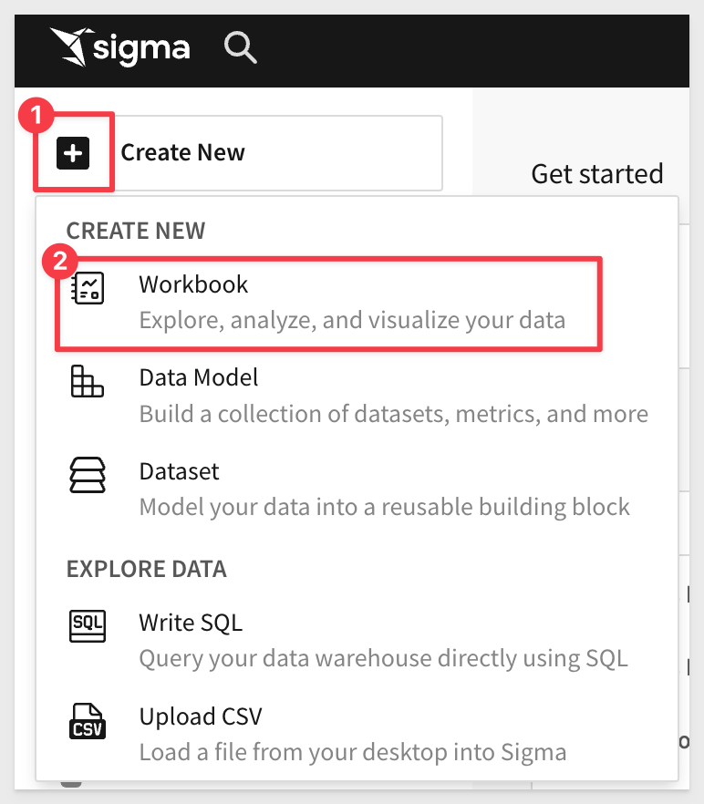

We will use `Table` from the options:

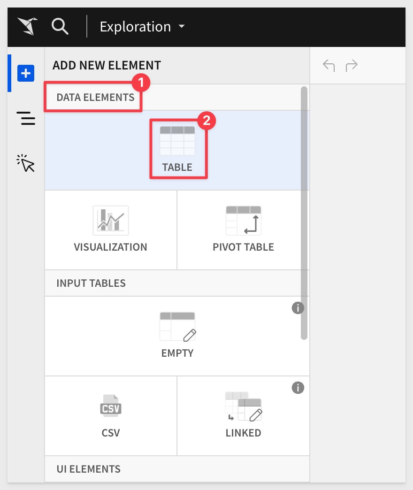

Next we need to select our source data. We will use the typical sample data, as in other QuickStarts.

Sigma allows users to search for tables by name; type `Hands` in the search bar and select the `PLUGS_ELECTRONICS_HANDS_ON_LAB_DATA` table:

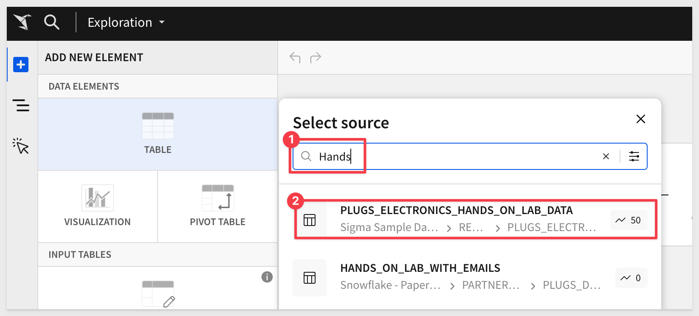

This opens the selected table in a new (unpublished) workbook that carries the temporary name `Exploration`:

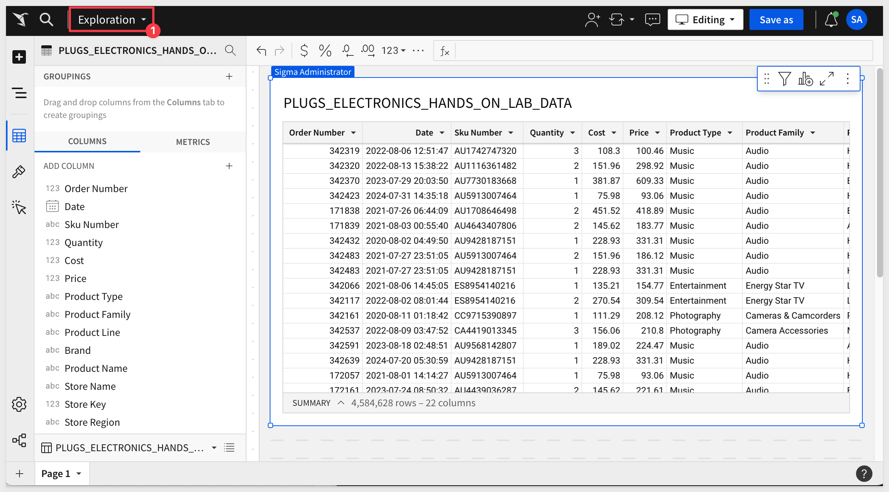

The first thing we want to do is click the `Save As` button, choose where to store the workbook and give it the name `My Plugs Sales Table - JWT` and save it.

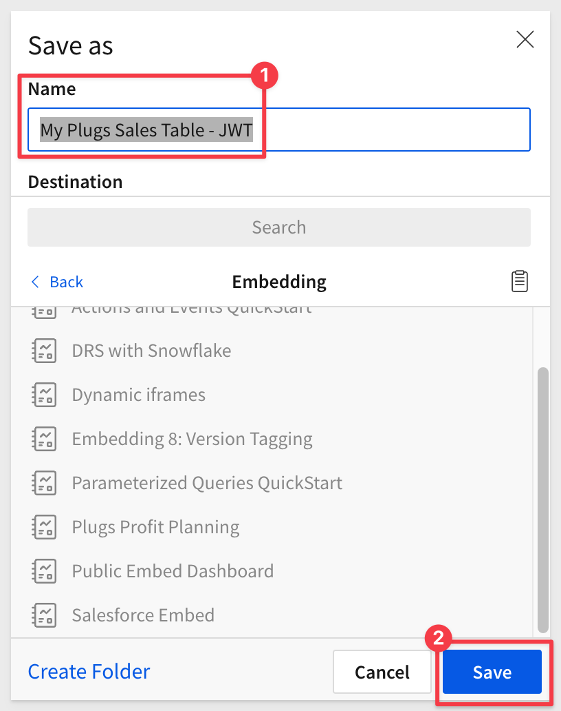

You may have noticed that Sigma provides `folders`, a `My Documents` folder and also [workspaces](https://help.sigmacomputing.com/docs/manage-workspaces). This enables a variety of use-cases to be possible with regards to how documents are stored, managed and shared with others.

### Share the Workbook
Click the caret to the right of the workbook's name and select `Share`

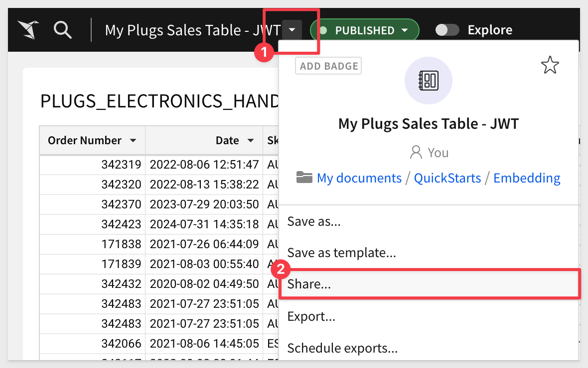

Search for the `Sales_People` team, select it and provision `Can view` permission:

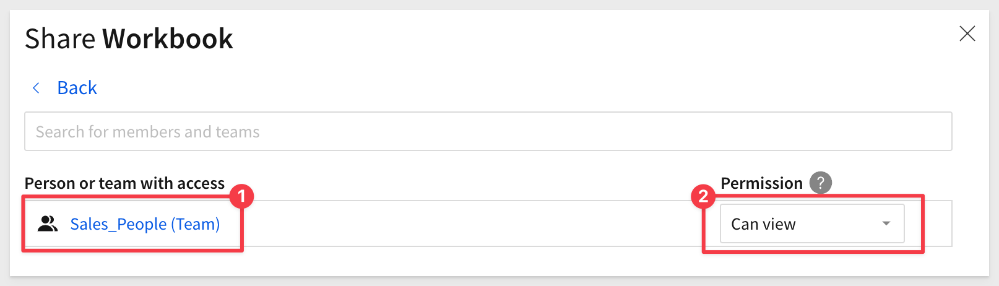

### BASE_URL vs. Embed Path

For those users who have used Sigma embedding before, this step is a little different. We used to use Sigma's UI to create an `Embed Path`. 

**This is no longer required when using JWT.**

For those users who have used Sigma embedding before, this step is a little different. We used to use Sigma's UI to create a `Workbook URL` > `Embed Path`. **This is no longer required when using JWT.**

With JWT embedding, we simply use the `Published` url, taken directly from the browser.

In light of this change, our Git project will refer to this URL as the `BASE_URL`.

Go to the `Published` version of our workbook:

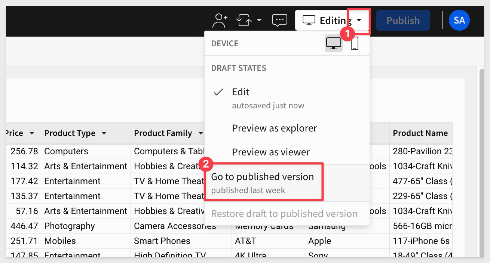

Copy the URL of to a text file, so that we can reference it in the embedding script later:

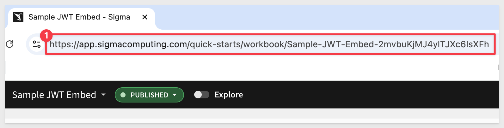

We are now ready to configure our secure embed for our workbook and team.


<!-- END OF SECTION-->

## Edit Project Environment File
Duration: 5 

Return to VSCode and open the file `.env`. It will have placeholders for the values we need to provide:

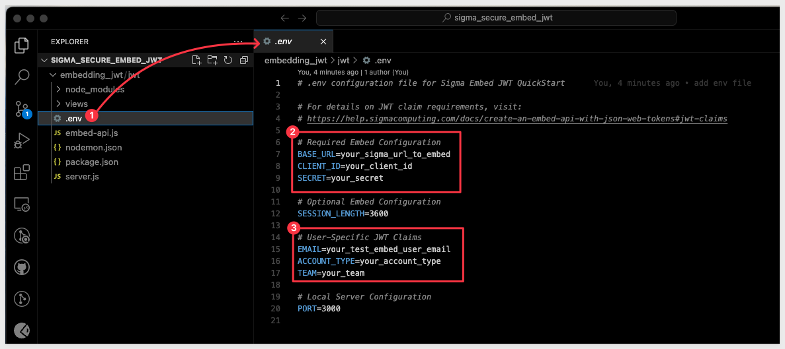

Replace the six placeholders with the values we saved from earlier steps:

For example:
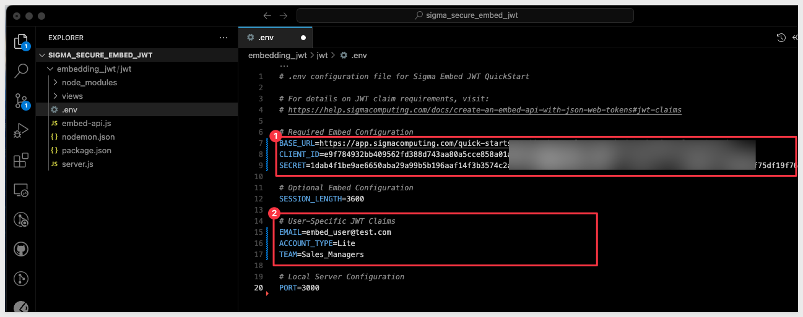

### Embed-API Script
We have commented the code in the Embed-API script so that you can understand what it is doing at each step. The code is shown below, although you can just review it in VSCode as well.

<aside class="negative">
<strong>NOTE:</strong><br> The code shown below has extra logging that is not appropriate for a production environment, but is useful while learning / debugging.
</aside>

```code
const jwt = require('jsonwebtoken');
const { v4: uuid } = require('uuid');
const dotenv = require('dotenv');

dotenv.config();

async function generateSignedUrl() {
    try {
        const time = Math.floor(Date.now() / 1000); // Current Unix timestamp
        const expirationTime = time + Math.min(parseInt(process.env.SESSION_LENGTH) || 3600, 2592000);

        // Convert TEAM into an array if it is a single value
        const teamsArray = process.env.TEAM ? [process.env.TEAM] : [];

        const token = jwt.sign({
            sub: process.env.EMAIL,
            iss: process.env.CLIENT_ID,
            jti: uuid(),
            iat: time,
            exp: expirationTime,
            account_type: process.env.ACCOUNT_TYPE,
            teams: teamsArray,
        }, process.env.SECRET, {
            algorithm: 'HS256',
            keyid: process.env.CLIENT_ID
        });

        // Decode the JWT to inspect its content and log it
        const decodedToken = jwt.decode(token, { complete: true });
        console.log('Decoded JWT:', decodedToken); // Log the decoded JWT for debugging
        
        const signedEmbedUrl = `${process.env.BASE_URL}?:jwt=${encodeURIComponent(token)}&:embed=true`;
        // Log important configuration details to ensure they are correctly set
        console.log('BASE_URL:', process.env.BASE_URL);
        console.log('CLIENT_ID:', process.env.CLIENT_ID); // Verify the client ID
        console.log('SESSION_LENGTH:', process.env.SESSION_LENGTH);
        console.log('TEAMS:', teamsArray);
        console.log('ACCOUNT_TYPE:', process.env.ACCOUNT_TYPE);
        console.log('Signed Embed URL:', signedEmbedUrl);

        return signedEmbedUrl;
    } catch (error) {
        console.error("Failed to generate JWT:", error);
        throw new Error("JWT generation failed");
    }
}

module.exports = { generateSignedUrl };
```


<!-- END OF SECTION-->

## Test the Project
Duration: 5 

In VSCode, open a new terminal session, make sure to be in the correct folder (as shown in the screenshot below).

Run the command:
```code
npm install nodemon
```

Next, run the command:
```code
nodemon server.js
```

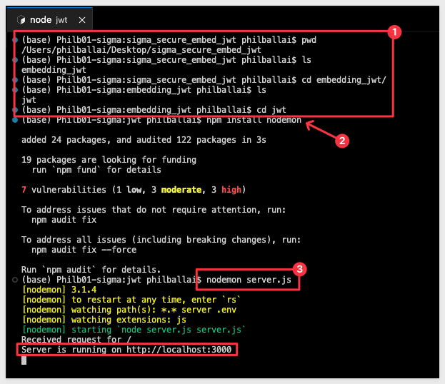

In a browser, browse to:
```code
http://locahost:3000
```

We now see our workbook embedded into a parent application. The parent only has a header of `Sigma Embed with JWT` but as a demonstration, this is sufficient:

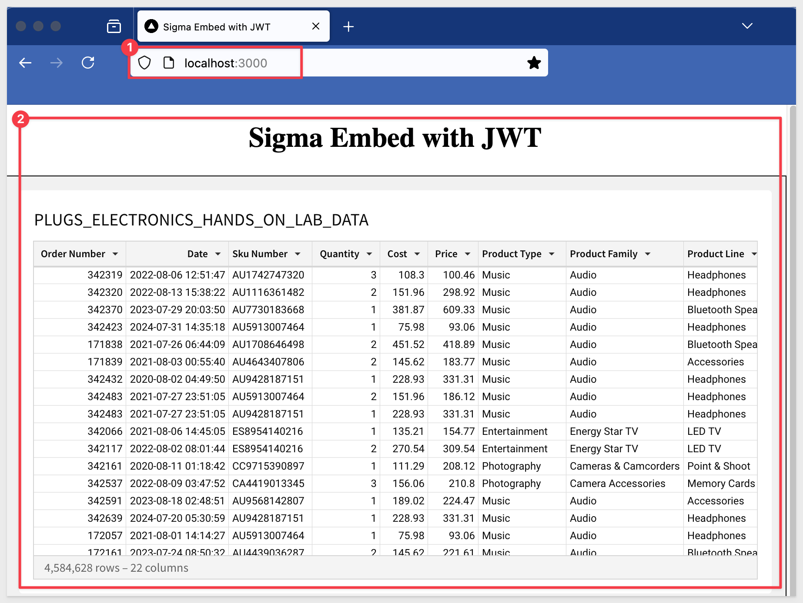

### Logging
We have included code that returns key values in the terminal console, for debugging and demonstration purposes only. These would normally not be included in production code and are not required to make this work. We felt is was useful to see these values to better understand what is being passed. 

For example, my log of the last step looks like this:

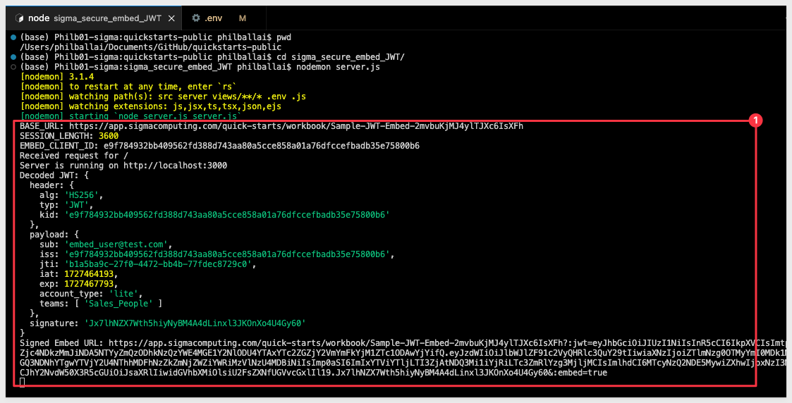

The log will show a decoded JWT each time a embedded webpage is loaded.

We use the the `jwt.decode()` function that is provided by the `jsonwebtoken` library to decodes a JWT without verifying its signature.

It simply parses the JWT and returns its payload (the claims it contains) along with the header and signature if you use the complete.

<aside class="positive">
<strong>IMPORTANT:</strong><br> jwt.decode() only reveals the claims and metadata inside the token (such as the data in the header), but does not include the secret key. The secret key used to sign the JWT is never included in the token itself. It remains securely stored on the server where the JWT was generated.

This ensures that the integrity of the JWT can be verified without exposing the secret key to any client or external party.
</aside>

An alternative method is to use a third-party website to decode the token. For example [JWT Debugger](https://token.dev/) can decode the token just as we have done in our sample code:

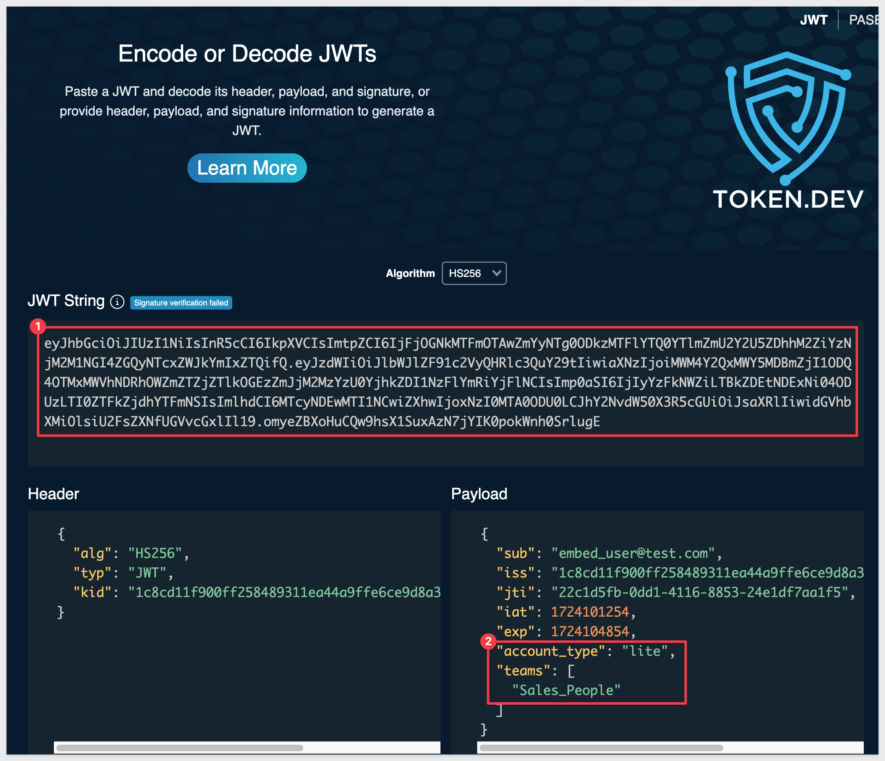

## Single Element or Page
Duration: 5 

Sigma allows a workbook, page or single element to be embedded. 

In the case of single elements and workbook pages, we need to adjust the copied url.

### Single Elements

The correct URL syntax that is required by the Embed_API is:
```code
https://app.sigmacomputing.com/{organization-name}/workbook/{workbookname}-{workbookUrlId}/element/{elementId}
```

If we add a quick bar chart to the workbook, based on the table data:

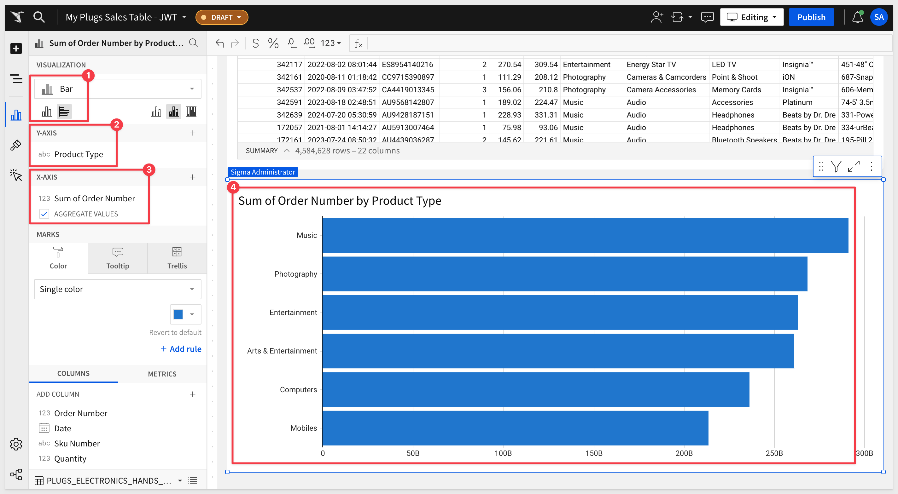

We can select the bar chart and grab it's URL, and format using the syntax described above.
```code
https://app.sigmacomputing.com/XXXXXXXX/workbook/My-Plugs-Sales-Table-JWT-28xgywpg21TkRWtz3jVRCe/element/bAGJb_-0AS
```

Paste the URL into the `.env` file, over-writing the existing value for `EMBED_URL` and save the file.

<aside class="negative">
<strong>NOTE:</strong><br> No need to restart the server session. Nodemon is configured to detect changes to the project files, including the environment file.
</aside>

Refresh the browser page to see the single element embed:

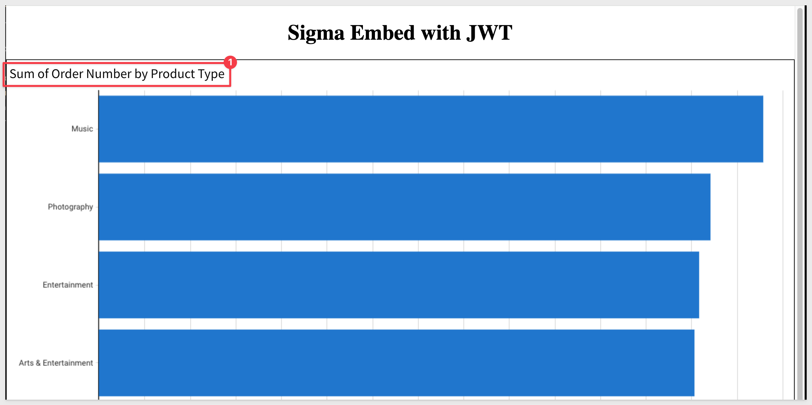

### Workbook page embed:
We can repeat the single element workflow, adjusting the workbook to have a second page and using the page's URL in .env.

The correct syntax for constructing the page URL is:
```code
https://app.sigmacomputing.com/{organization-name}/workbook/{workbookname}-{workbookUrlId}/page/{pageId}
```

We added a second page to our workbook that looks like this:
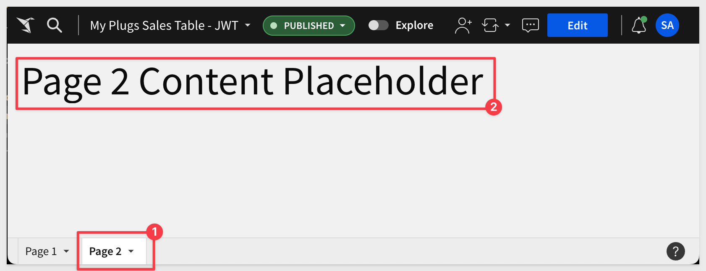

After adjusting the `.env` file for the page URL, the embed looks like this:

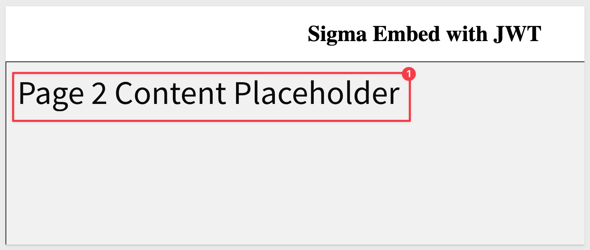

<aside class="negative">
<strong>NOTE:</strong><br> For convenience, we modified our .env file by commenting out our three test urls. This allows us to switch between them easily. 
</aside>

Our .env looks like this (just for your information):
```code
# .env configuration file for Sigma Embed JWT QuickStart

# Workbook:
#BASE_URL=https://app.sigmacomputing.com/XXXXXX/workbook/My-Plugs-Sales-Table-JWT-28xgywpg21TkRWtz3jVRCe

# Element
#BASE_URL=https://app.sigmacomputing.com/XXXXXX/workbook/My-Plugs-Sales-Table-JWT-28xgywpg21TkRWtz3jVRCe/element/bAGJb_-0AS

#Page (this one is enabled for testing...)
#BASE_URL=https://app.sigmacomputing.com/XXXXXX/workbook/My-Plugs-Sales-Table-JWT-28xgywpg21TkRWtz3jVRCe/page/GHs4vJQxig

...the rest of the file's contents
```


<!-- END OF SECTION-->

## Deeper Integration - REST API (API)
Duration: 5 

We have already demonstrated how to obtain a Sigma URL manually, using the UI and browser. Many customers will want to automate this in order to create their own navigation menus (for example). To enable this, Sigma provides a REST API. 

The API supports all the common methods for programmatically interacting with Sigma. In the case mentioned (navigation menu), the specific endpoint can be [List all workbooks](https://help.sigmacomputing.com/reference/listworkbooks).

However, it is likely that a navigation menu would benefit from only showing workbooks that are `shared with me`. In support of this, Sigma provides [API Recipes](https://help.sigmacomputing.com/recipes) that are API scripts (in JavaScript), demonstrating common use-cases. 

There are also two QuickStarts to assist with using the API and Recipes. 

[Sigma API with Postman](https://quickstarts.sigmacomputing.com/guide/sigma_api_with_postman/index.html?index=..%2F..index#0)

[Sigma REST API Recipes](https://quickstarts.sigmacomputing.com/guide/administration_api_code_samples/index.html?index=..%2F..index#0)


<!-- END OF SECTION-->


## What we've covered
Duration: 5

In this QuickStart, we explained and demonstrated how to use JSON Web Tokens (JWT) for embedding content in Sigma.

**Additional Resource Links**

[Blog](https://www.sigmacomputing.com/blog/)<br>
[Community](https://community.sigmacomputing.com/)<br>
[Help Center](https://help.sigmacomputing.com/hc/en-us)<br>
[QuickStarts](https://quickstarts.sigmacomputing.com/)<br>


Be sure to check out all the latest developments at [Sigma's First Friday Feature page!](https://quickstarts.sigmacomputing.com/firstfridayfeatures/)
<br>

[](https://twitter.com/sigmacomputing)&emsp;
[](https://www.linkedin.com/company/sigmacomputing)&emsp;
[](https://www.facebook.com/sigmacomputing)


<!-- END OF WHAT WE COVERED -->
<!-- END OF QUICKSTART -->
