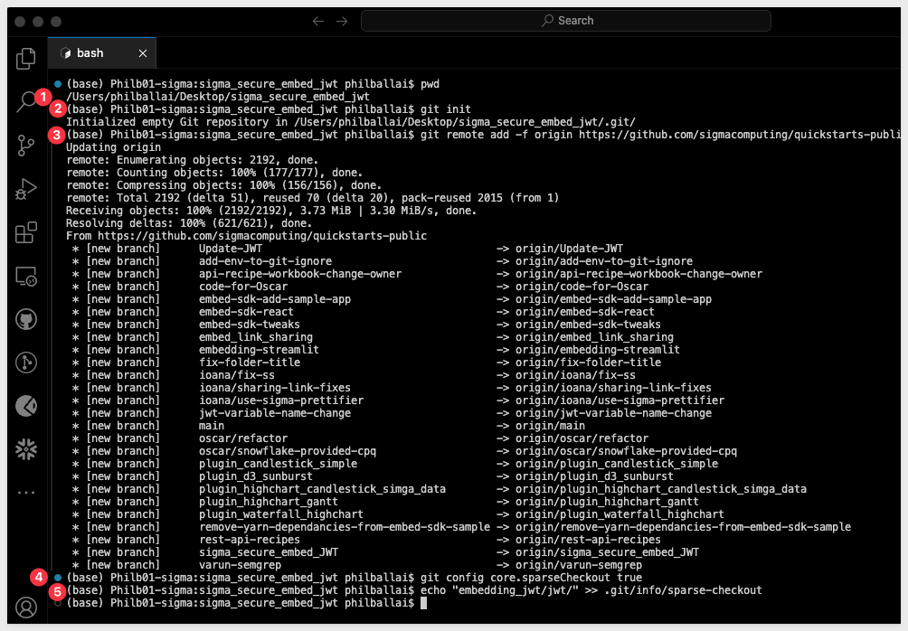
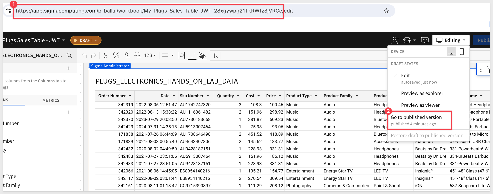
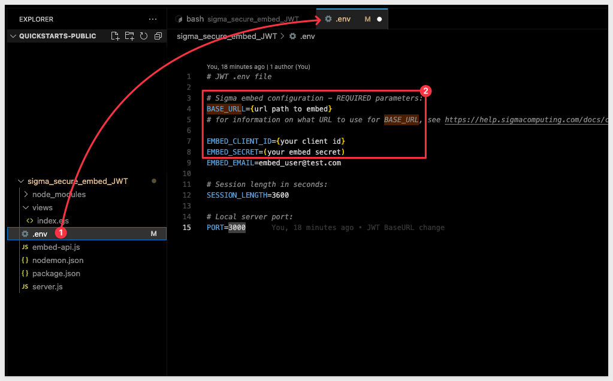
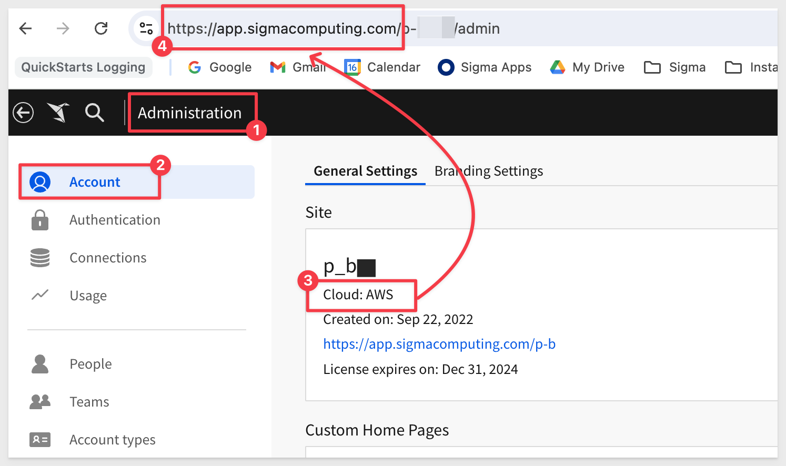
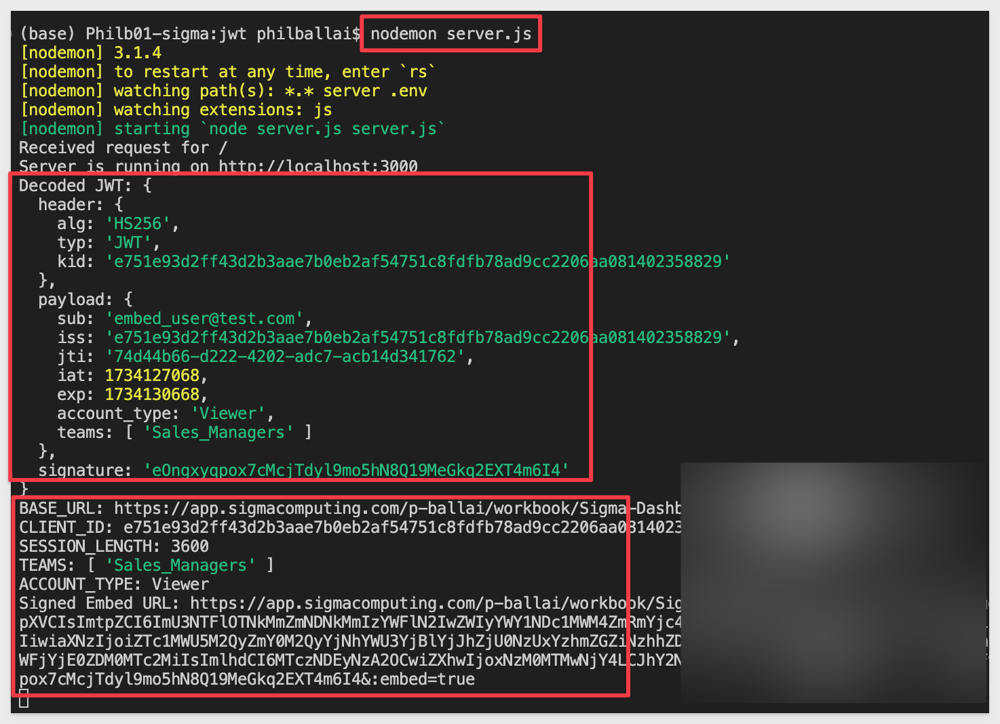

author: pballai
id: embedding_16_jwt
summary: embedding_16_jwt
categories: Embedding
environments: web
status: published
feedback link: https://github.com/sigmacomputing/sigmaquickstarts/issues
tags: default
lastUpdated: 2024-08-21

# Embedding 16: Secure Embedding with JWT

## Overview 
Duration: 5 

Many customers want a simple, but secure way to embed content that can be accessed by both external (users who do not have a registered account in Sigma) and internal user (users who access Sigma only through an embed, inside a parent application). 

To enable this, Sigma supports authenticating secure embeds using <a href="https://jwt.io/" target="_blank">JSON Web Tokens (JWTs)</a>. Signing your secure embed URLs with JWTs has several advantages, but a few limitations too:

### Benefits of JWT

- JWTs are compact, URL-safe tokens that can be digitally signed, ensuring that the data they contain is tamper-proof.

- Embed developers no longer have to use the Sigma UI to generate embed paths; they may use the URL instead.

- Embedding workbooks, pages and individual visualizations is supported.

- JWT-signed embed URLs can authenticate internal Sigma users to access embedded content with the same email address they use for their Sigma account. 

### Limitations

- Most embed URL parameters are not currently supported in JWT-signed embed URLs.

- Only admins will be able to impersonate other users (including embed users). Non-admins can only login as themselves.

- You cannot test an JWTs in the embed sandbox.

<aside class="positive">
<strong>IMPORTANT:</strong><br> The existing secure Embed-API solution will continue to work. Customers will not have to make any changes immediately, although JWT is likely to become the preferred solution over time.
</aside>

### What is JWT?
JSON Web Token (JWT) is a compact, URL-safe means of representing claims to be transferred between two parties. The claims in a JWT are encoded as a JSON object that is used as the payload of a JSON Web Signature (JWS) structure or as the plaintext of a JSON Web Encryption (JWE) structure, enabling the claims to be digitally signed or integrity protected with a Message Authentication Code (MAC) and/or encrypted.

The remaining discussion in this section is intended for those less familiar with JWT, how it is structured, the transaction flow and benefits. Feel free to jump to the next section if you just want a demonstration of JWT in Sigma.

### Structure of JWT:

A JWT is composed of three parts: `Header`, `Payload`, and `Signature`, which are concatenated with dots (.) to form a single string:

**Header:** Typically consists of two parts: the type of token (JWT) and the signing algorithm (e.g., HMAC SHA256).

**Payload:** Contains the claims. Claims are statements about an entity (typically, the user) and additional data. There are three types of claims: registered, public, and private claims.

**Signature:** Used to verify that the sender of the JWT is who it says it is and to ensure that the message wasn’t changed along the way.

#### Claims in Sigma

**1: Registered Claims:** These are predefined, standardized claims that are recommended to be used in a JWT. They have specific purposes and are commonly recognized across implementations.

Examples:<br>
- sub (Subject): This claim identifies the subject of the JWT, usually the user. In Sigma, it is often the email of the user accessing the embedded content.

- iss (Issuer): This claim identifies the issuer of the JWT. In Sigma, it is the client ID used to issue the token.

- jti (JWT ID): This is a unique identifier for the JWT. It’s used to prevent the JWT from being replayed.

**2. Public Claims:** These are claims that can be defined at will by those using JWTs.

Examples:<br>
- account_type: the type of account the user has (e.g., “lite”, pro”). 

- teams: indicates the teams to which a user belongs. 

**3. Private Claims:** These are custom claims created to share information between parties that agree on using them but do not need to be registered or standardized. They are specific to the application and are not meant to be shared beyond the agreed-upon parties.

Examples:<br>
- custom user attributes
- eval_connection_id

<aside class="negative">
<strong>NOTE:</strong><br> - Most embed URL parameters are not currently supported in JWT-signed embed URLs.
</aside>

For more information on JWT claims in Sigma, [see here.](https://help.sigmacomputing.com/docs/create-an-embed-api-with-json-web-tokens)

### How JWT Works in Sigma

Let’s walk through a typical workflow where a client requests an embedded content using a JSON Web Token (JWT) and how the server handles this request, validates it, and serves the embedded content based on the credentials and environment variables.

Upon receiving a request from the client for a URL to access embedded Sigma content, the server securely generates a JWT by combining the configured embed client credentials with known user claims (such as email, account type, and team). This signed and encrypted JWT is then embedded into the URL returned to the client, enabling secure and authorized access to the content.

Expanding on this description a bit more:

#### 1: Client Request:
The client (e.g., a web application or another service) sends a request to the server to obtain a URL for accessing embedded Sigma content. 
This request might include minimal information, such as the user’s identity or a general request for access.
	
#### 2: Server-Side JWT Generation:
**Credential Handling:** The server securely manages the necessary credentials, such as the secret key (EMBED_SECRET) and client ID (EMBED_CLIENT_ID), that are required to generate the JWT.

**User Claims:** The server retrieves or determines relevant claims about the user, such as their email address (sub), roles, or teams. These claims are crucial for defining the user’s permissions and the scope of access within the embedded content.

**JWT Creation:** The server uses the credentials and claims to create a JWT. This JWT is signed with the secret key, ensuring its authenticity. The JWT includes claims that specify who the user is, what they are allowed to do, and how long their access is valid.
	
#### 3: Response with Signed URL:
The server constructs a signed URL that includes the JWT as a query parameter. This URL is then sent back to the client.

**Authorization:** When the client uses this URL to access the embedded content, the JWT is used by the Sigma server to verify the user’s identity and permissions, granting or denying access accordingly.

<aside class="positive">
<strong>IMPORTANT:</strong><br> Existing embed customers are likely familiar with Sigma’s “signed URL” embed-API, which uses a nonce to ensure that the constructed URL is one-time use only. Similarly, JWTs are also one-time use. When a JWT is issued, the jti claim—a unique identifier for the token—is stored server-side. When the JWT is used (e.g., to access an embedded Sigma dashboard), the server checks whether the jti has already been seen. If it has, the token is rejected as a replay attempt, ensuring it cannot be reused.
</aside>

<aside class="positive">
<strong>NOTE:</strong><br> JWT-signed embed URLs can authenticate internal Sigma users to access embedded content with the same email address they use for their Sigma account.
</aside>

### Target Audience
Developers evaluating Sigma embedding and the security options.

### Prerequisites

<ul>
  <li>A computer with a current browser. It does not matter which browser you want to use.</li>
  <li>Access to your Sigma environment.</li>
  <li>Some familiarity with Sigma is assumed. Not all steps will be shown as the basics are assumed to be understood.</li>
  <li>A development environment of choice. We will demonstrate with Microsoft VSCode and related extensions</li>
</ul>

<aside class="postive">
<strong>IMPORTANT:</strong><br> Sigma recommends that you use non-production resources when doing QuickStarts.
</aside>

<button>[Sigma Free Trial](https://www.sigmacomputing.com/free-trial/)</button>
 


## Clone the Git Repository Project Folder
Duration: 5 

While you may clone the entire repository (it is not that large), we want to avoid cloning sections of the repository that are not of immediate interest. 

Instead, we will use VSCode and terminal to perform a git `sparse-checkout` of the specific project folder we are interested in. A few extra steps, but cleaner local project folder. 

Open `VSCode` and a new `terminal` session.

In terminal, navigate to the desired directory where we want to clone the repo folder into.

For example:
```code
cd {/path/to/your/directory}
```

Make a new directory:
```code
mkdir sigma_secure_embed_JWT
```

Change to the new directory:
```code
cd sigma_secure_embed_JWT
```

Execute the terminal command:
```code
git init
```

Add the remote repository as the origin:
```code
git remote add -f origin https://github.com/sigmacomputing/quickstarts-public.git
```

Enable sparse checkout:
```code
git config core.sparseCheckout true
```

Specify the folder you want to clone by adding it to the sparse-checkout configuration:
```code
echo "sigma_secure_embed_JWT/" >> .git/info/sparse-checkout
```

At this point, we have run each command and not seen any errors:



Finally, pull the specified folder from the repository:
```code
git pull origin main
```

After the command runs, click the button to `Open Folder`:


Navigate to where your folder is and click `Open`:

For example, our folder is in the `GitHub` folder on the local machine:


We can now see the project called `sigma_secure_embed_JWT`:


The project has almost everything we need, but we will need some embedded content and credentials from Sigma before we can test this out.


<!-- END OF SECTION-->

## Create Embed Credentials
Duration: 5 

We will create the required information to pass to the developer of the Parent application (in this case the developer is us).

### Sigma Embed Client credentials

Embed `Client credentials` ("credentials") are a crucial component for creating a Sigma embed. These credentials are encoded within your embed URL, providing an additional layer of validation to ensure the embed's authenticity and security.

The credentials are made up of the `Client ID` and `Client Secret`, and are generated using the Sigma UI.

The credentials will be used in the embed API, to ensure your embed URLs are valid at run-time.

**Here are some important points to note about the credentials:**

**Irretrievable**: Once created, you cannot retrieve the original credentials. Ensure to store them securely.

**Regeneration**: If the credentials are lost, they can be regenerated, but with different values. This will invalidate all existing embeds until the new values are in place in the embed API.

**Update Requirement**: After regenerating new credentials, you must update all existing embeds, using the Embed API for that change. 

Remember to keep your credentials in a secure location, as losing them requires action to maintain your embedded analytics functionality.

<aside class="positive">
<strong>IMPORTANT:</strong><br> You cannot look up your organizations existing credentials (Sigma support has no access to your credentials) after they have been created. 

If you lose your credentials, you must regenerate new credentials. 

If this happens, your existing embeds will be rendered invalid until the API is updated with the new embed credentials.
</aside>

### Client Credentials Creation

We will now create credentials that are specific to our workbook embed. 

**1:** Navigate to `Administration` > `Developer Access`:


**2:** Click `Create New`, located in the page's top right corner. This will open the `Create Client Credentials` modal.

**3:** Under `Access Credential Type?` select `Embedding`.

**4:** Enter a `Name` and `Description` as you see fit.

**5:** Under `Owner`, select an organization member with the account type you would like to associate with the embed secret. For now, just select yourself or an `Administrator`.


<aside class="negative">
<strong>NOTE:</strong><br> Some customers elect to have a "Service Account" user with administrative privileges for this "owner" assignment.
</aside>

**6:** Click Create:

**7:** Copy the provided `ClientID` and `Secret` and store them.


**8:** Click Close.

Paste the credentials into a text file for now, we will use them later. 

<aside class="negative">
<strong>NOTE:</strong><br> We can use these credentials for all embeds, but you may create as many credentials as you prefer.
</aside>


<!-- END OF SECTION-->

## Select Something to Embed
Duration: 5 

This embedding method allows you to use any Sigma URL to embed, assuming the proper permissions are passed along with it as parameters. 

Sigma is very flexible and has different workflows for creating content, based on source data. 

For example, we could first create a [data model](https://help.sigmacomputing.com/docs/intro-to-data-models), set permission on it, and then save it off for later use in a workbook(s). We would then create a workbook with a table, that shows data from the data model we saved earlier.

<aside class="negative">
<strong>NOTE:</strong><br> To leverage the features in secure embedding, permission to your data is required at some level. Creating a data model and granting permissions to it is considered a best practice.
</aside>

To minimize the steps, we will leverage a different workflow.

<aside class="positive">
<strong>IMPORTANT:</strong><br> In either case, customers should evaluate the many options in Sigma against their own information security, compliance and governance policies, in order to make the best choices for their organizations. Sigma will be there to assist in these decisions, at any time you need.
</aside>

### Create a Team
To demonstrate our embed, we need to create a [Team](https://help.sigmacomputing.com/docs/manage-teams) to share our new workbook with. 

Navigate to `Administration` > `Teams` and click `Create Team`. 

Name the new team `Sales_People`, and click `Create`. 

<aside class="positive">
<strong>IMPORTANT:</strong><br> We don't need to add any people to this team as they will be added automatically after they are authenticated by the parent application and access any embedded Sigma content.
</aside>

### Create a Workbook with Sample Data

From Sigma / `Home` click the `+` Create New button and click `Workbook`:


We will use `Table` from the options:


Next we need to select our source data. We will use the typical sample data, as in other QuickStarts.

Sigma allows users to search for tables by name; type `Hands` in the search bar and select the `PLUGS_ELECTRONICS_HANDS_ON_LAB_DATA` table:


This opens the selected table in a new (unpublished) workbook that carries the temporary name `Exploration`:


The first thing we want to do is click the `Save As` button, choose where to store the workbook and give it the name `My Plugs Sales Table - JWT` and save it.


You may have noticed that Sigma provides `folders`, a `My Documents` folder and also [workspaces](https://help.sigmacomputing.com/docs/manage-workspaces). This enables a variety of use-cases to be possible with regards to how documents are stored, managed and shared with others.

Before we move to the next step, copy the URL for the workbook so that we can reference it in the embedding script. 

Since we are in `edit` mode currently, we can copy the url as shown (#1 in the screenshot) and simply remove the tailing `/edit` or `Go to published version` (#2). The resulting URL will be the same, trailing edit aside. 

For example, my URL looks like this:
```code
https://app.sigmacomputing.com/XXXXXXX/workbook/My-Plugs-Sales-Table-JWT-28xgywpg21TkRWtz3jVRCe
```



Copy your selected URL off to a text file; we will use that shortly.

### Share the Workbook

Click the caret to the right of the workbook's name and select `Share`


Search for the `Sales_People` team, select it and provision `Can view` permission:


We are now ready to configure our secure embed for our workbook and team.


<!-- END OF SECTION-->

## Edit Project Environment File
Duration: 5 

Return to VSCode and open the file `.env`. It will have placeholders for the values we need to provide:



Replace the three placeholders with the values we saved from earlier steps:

For example:


The `BASE_URL` has been provided for you and assumes your Sigma instance is hosted at AWS. If it is not, you will need to update that for Azure or GCP as required. This information can be confirmed in Sigma, as shown below:



### Embed-API Script

We have commented the code in the Embed-API script so that you can understand what it is doing at each step. The code is shown below, although you can just review it in VSCode as well.

<aside class="negative">
<strong>NOTE:</strong><br> The code shown below has extra logging that is not appropriate for a production environment, but is useful while learning / debugging.
</aside>

```code
const jwt = require('jsonwebtoken'); // Import jsonwebtoken library for handling JWTs
const { v4: uuid } = require('uuid'); // Import uuid for generating unique identifiers
const dotenv = require('dotenv'); // Import dotenv for loading environment variables

dotenv.config(); // Load environment variables from .env file

// Define constants for the embed URL and session length
const EMBED_URL = process.env.EMBED_URL;
const SESSION_LENGTH = Math.min(process.env.SESSION_LENGTH || 3600, 2592000); // Max 30 days in seconds

// Log important configuration details to ensure they are correctly set
console.log('EMBED_URL:', EMBED_URL);
console.log('SESSION_LENGTH:', SESSION_LENGTH);
console.log('EMBED_CLIENT_ID:', process.env.EMBED_CLIENT_ID); // Verify the client ID

// Function to generate a signed URL for embedding Sigma dashboards
async function generateSignedUrl() {
    try {
        // Retrieve the secret and email from environment variables
        const secret = process.env.EMBED_SECRET;
        const email = process.env.EMBED_EMAIL;
        const time = Math.floor(Date.now() / 1000); // Generate the current time as a Unix timestamp

        // Generate JWT with claims
        // See https://help.sigmacomputing.com/docs/create-an-embed-api-with-json-web-tokens for list of available claims
        const token = jwt.sign({
            sub: email, // Subject (the email of the user)
            iss: process.env.EMBED_CLIENT_ID, // Issuer (client ID)
            jti: uuid(), // JWT ID (unique identifier for the token)
            iat: time, // Issued at time (current time)
            exp: time + SESSION_LENGTH, // Expiration time (current time + session length)
            account_type: "lite", // Optional claim for account type
            teams: ["Sales_People"] // Optional claim for user teams
        }, secret, {
            algorithm: 'HS256', // Algorithm used for signing the JWT
            keyid: process.env.EMBED_CLIENT_ID // Key ID for the JWT header, should match Sigma's expectations
        });

        // Decode the JWT to inspect its content and log it
        const decodedToken = jwt.decode(token, { complete: true });
        console.log('Decoded JWT:', decodedToken); // Log the decoded JWT for debugging

        // Construct the signed embed URL by appending the JWT and embed parameters
        const signedEmbedUrl = `${EMBED_URL}?:jwt=${token}&:embed=true`;

        // Log the constructed signed URL
        console.log('Signed Embed URL:', signedEmbedUrl);

        return signedEmbedUrl; // Return the signed embed URL
    } catch (error) {
        // Log any errors that occur during JWT generation
        console.error("Failed to generate JWT:", error);
        throw new Error("JWT generation failed"); // Throw an error if JWT generation fails
    }
}

// Export the generateSignedUrl function so it can be used in other files
module.exports = { generateSignedUrl };
```


<!-- END OF SECTION-->

## Test the Project
Duration: 5 

In VSCode, open a new terminal session, make sure to be in the correct folder (as shown in the screenshot below):


Run the command:
```code
nodemon server.js
```

In a browser, browse to:
```code
http://locahost:3000
```

We now see our workbook embedded into a parent application. The parent only has a header of `Sigma Embed with JWT` but as a demonstration, this is sufficient.

### Logging
We have include code that returns key values in the terminal console, for debugging and demonstration purposes only. These would normally not be included in production code and are not required to make this work. We felt is was useful to see these values to better understand what is being passed. 

For example, my log of the last step looks like this:



We use the the jwt.decode() function that is provided by the jsonwebtoken library to decodes a JWT without verifying its signature.
It simply parses the JWT and returns its payload (the claims it contains) along with the header and signature if you use the complete.

<aside class="positive">
<strong>IMPORTANT:</strong><br> jwt.decode() only reveals the data (claims) inside the token and some metadata from the header. The secret key is never included in the JWT itself and remains on the server where the JWT was signed.
</aside>

An alternative method is to use a third-party website to decode the token. For example [JWT Debugger](https://token.dev/) can decode the token just ass we have done in our sample code:


## Single Element or Page

Sigma allows a workbook, page or single element to be embedded. 

In the case of single elements and workbook pages, we need to manually adjust the copied url (at the time of this QuickStart). This will be automated in the near term in the Sigma UI.

### Single Elements

The correct URL syntax that is required by the Embed_API is:
```code
https://app.sigmacomputing.com/{organization-name}/workbook/{workbookname}-{workbookUrlId}/element/{elementId}
```

If we add a quick bar chart to the workbook, based on the table data:


We can select the bar chart and grab it's URL, and format using the syntax described above.
```code
https://app.sigmacomputing.com/XXXXXXXX/workbook/My-Plugs-Sales-Table-JWT-28xgywpg21TkRWtz3jVRCe/element/bAGJb_-0AS
```

Paste the URL into the `.env` file, over-writing the existing value for `EMBED_URL` and save the file.

<aside class="negative">
<strong>NOTE:</strong><br> No need to restart the server session. Nodemon is configured to detect changes to the project files, including the environment file.
</aside>

Refresh the browser page to see the single element embed:


### Workbook page embed:
We can repeat the single element workflow, adjusting the workbook to have a second page and using the page's URL in .env.

The correct syntax for constructing the page URL is:
```code
https://app.sigmacomputing.com/{organization-name}/workbook/{workbookname}-{workbookUrlId}/page/{pageId}
```

We added a second page to our workbook that looks like this:


After adjusting the `.env` file for the page URL, the embed looks like this:


<aside class="negative">
<strong>NOTE:</strong><br> For convenience, we modified our .env file by commenting out our three test urls. This allows us to switch between them easily. 
</aside>

Our .env looks like this (just for your information):
```code
# .env file

# Sigma embed configuration - REQUIRED parameters:

# Workbook:
#EMBED_URL=https://app.sigmacomputing.com/XXXXXX/workbook/My-Plugs-Sales-Table-JWT-28xgywpg21TkRWtz3jVRCe

# Element
#EMBED_URL=https://app.sigmacomputing.com/XXXXXX/workbook/My-Plugs-Sales-Table-JWT-28xgywpg21TkRWtz3jVRCe/element/bAGJb_-0AS

#Page (this one is enabled for testing...)
EMBED_URL=https://app.sigmacomputing.com/XXXXXX/workbook/My-Plugs-Sales-Table-JWT-28xgywpg21TkRWtz3jVRCe/page/GHs4vJQxig

...the rest of the file's contents
```


<!-- END OF SECTION-->

## What we've covered
Duration: 5

In this QuickStart, we explained and demonstrated how to use JSON Web Tokens (JWT) for embedding content in Sigma.

**Additional Resource Links**

[Blog](https://www.sigmacomputing.com/blog/)<br>
[Community](https://community.sigmacomputing.com/)<br>
[Help Center](https://help.sigmacomputing.com/hc/en-us)<br>
[QuickStarts](https://quickstarts.sigmacomputing.com/)<br>


Be sure to check out all the latest developments at [Sigma's First Friday Feature page!](https://quickstarts.sigmacomputing.com/firstfridayfeatures/)
<br>

[](https://twitter.com/sigmacomputing)&emsp;
[](https://www.linkedin.com/company/sigmacomputing)&emsp;
[](https://www.facebook.com/sigmacomputing)


<!-- END OF WHAT WE COVERED -->
<!-- END OF QUICKSTART -->
