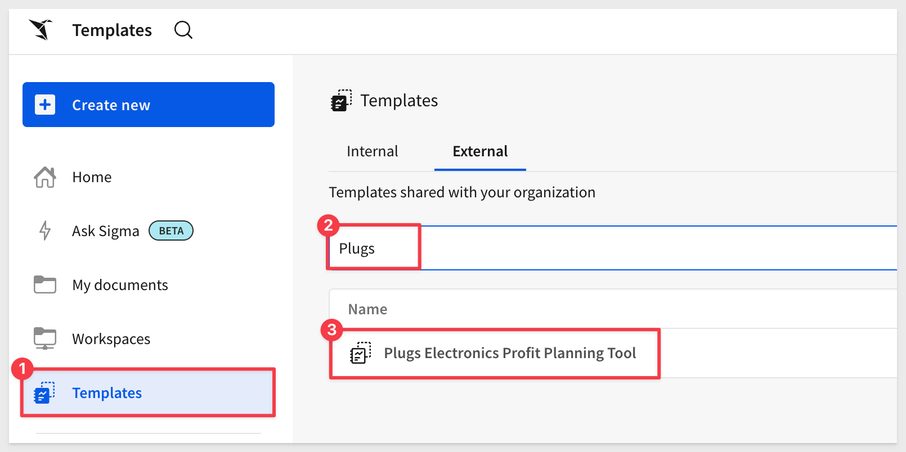
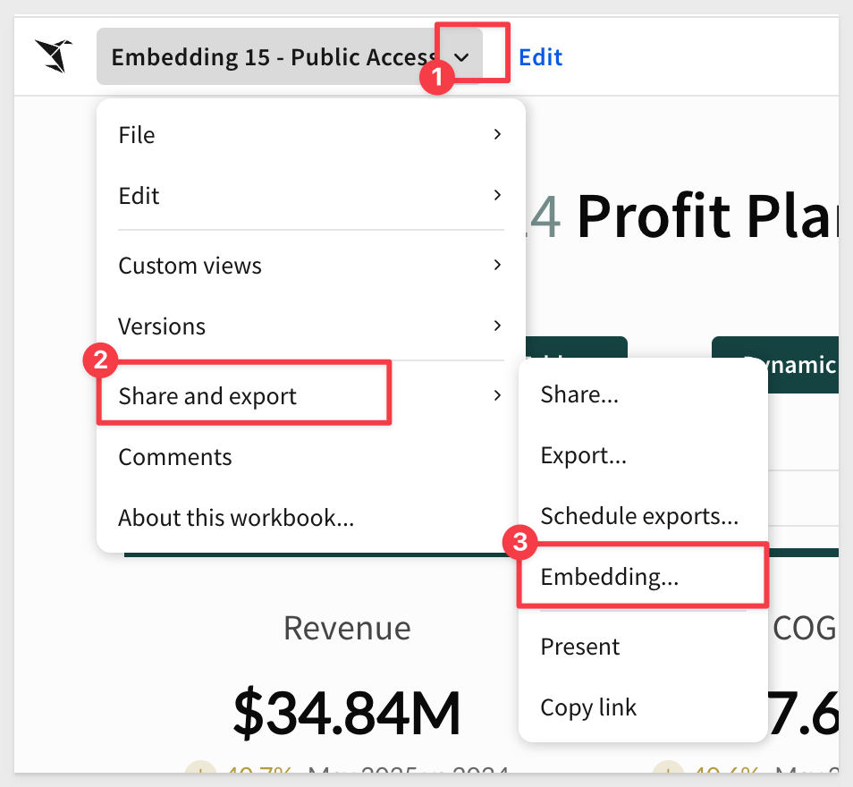
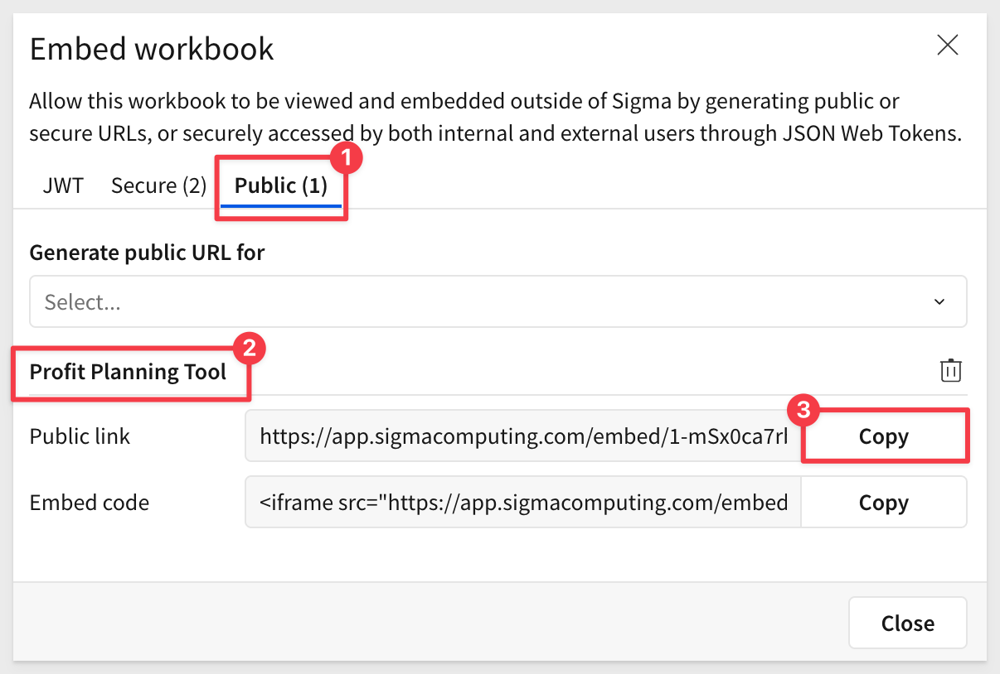
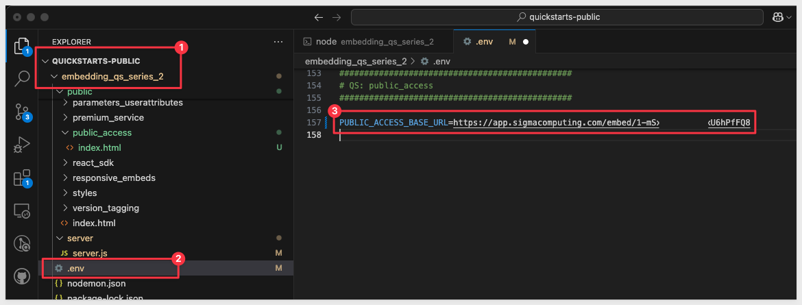
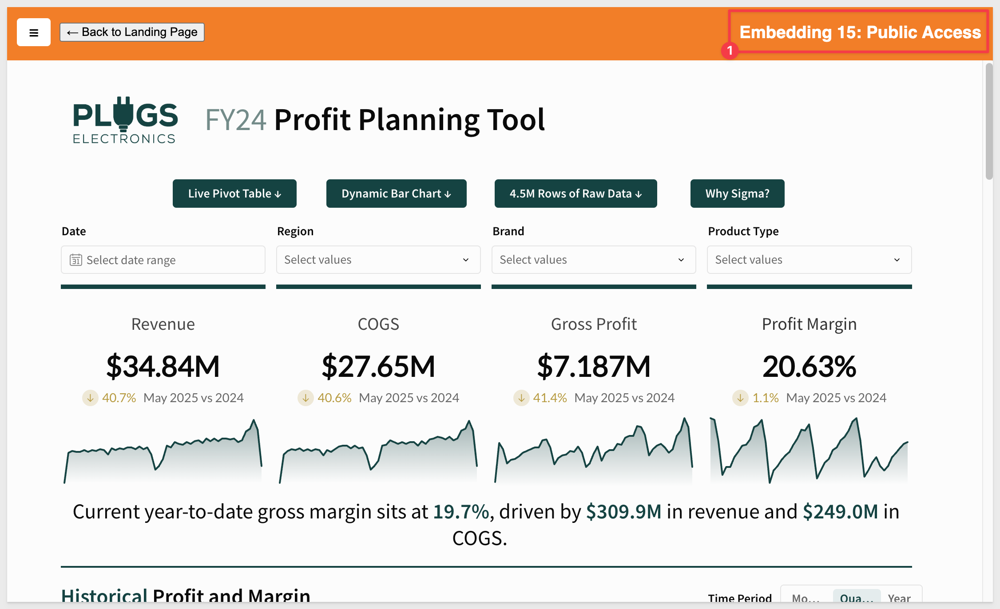

author: pballai
id: embedding_16_public_access_v3
summary: embedding_16_public_access_v3
categories: Embedding
environments: web
status: published
feedback link: https://github.com/sigmacomputing/sigmaquickstarts/issues
tags: embedding
lastUpdated: 2024-05-19

# Embedding 16: Public Access

## Overview 
Duration: 5 

In this QuickStart, we demonstrate how to embed a Sigma workbook **without using JWT authentication**. 

Sigma supports public access embeds, which require no login and no token — anyone with the link can view the content. This allows us to present content outside of Sigma in a controlled, public-facing format.

To support this, we will adjust the HTML and iframe setup to **use the base embed URL directly in the iframe**, without appending a `?:jwt=` parameter.

This is ideal for use cases where:
- The content is non-sensitive
- You want to embed the workbook on a public website
- You don’t need user-level filtering or row-level security

<aside class="negative">
<strong>WARNING:</strong><br>
Public embeds should only be used with content that is safe for unrestricted viewing. Anyone with the link or access to the page can see the embedded content.
</aside>
 
### Common use cases for public embeds

**1: Marketing Dashboards on Public Websites**
- Showcase product adoption, feature usage, customer metrics, etc.
- For example: A SaaS company shows “Live Stats: 20,000 Customers and Counting”

**2: Open Data Portals**
- Government, education, or nonprofit groups publishing public data.
- For example: “COVID-19 Cases by Region” or “Public School Enrollment Trends”

**3: Investor Relations Pages**
- Public companies showing high-level KPIs without sensitive detail.
- For example: “Quarterly Earnings Summary” or “Year-over-Year Revenue Growth”

**4: Product Documentation with Embedded Analytics**
- Help centers or support portals with embedded Sigma visualizations.
- For example: “System Uptime – Last 90 Days” or “API Usage by Endpoint”

**5: Public Event or Conference Dashboards**
- Live metrics displayed at a booth or on a projector at events.
- For example: “Live Survey Results” or “Top Booth Interactions Today”

**6: Internal Kiosks or Wallboards (Non-sensitive)**
- For use in factories, call centers, or lobbies where sign-in isn't feasible.
- For example: “Calls Answered Today” or “Production Totals by Shift”

<aside class="negative">
<strong>NOTE:</strong><br> Access to a public embed will not allow someone else access to Sigma directly.
</aside>

Sigma supports embedding a workbook, individual page, or even a single element.

<aside class="positive">
<strong>IMPORTANT:</strong><br> Some screens in Sigma may appear slightly different from those shown in QuickStarts. This is because Sigma continuously adds and enhances functionality. Rest assured, Sigma’s intuitive interface ensures that any differences will not prevent you from successfully completing any QuickStart.
</aside>

For more information on Sigma's product release strategy, see [Sigma product releases](https://help.sigmacomputing.com/docs/sigma-product-releases)

If something is not working as you expect, here's how to [contact Sigma support](https://help.sigmacomputing.com/docs/sigma-support)

### Target Audience
Semi-technical users who will be aiding in the planning or implementation of Sigma with embedding. No SQL or technical data skills are needed to complete this QuickStart. It does assume some common computer skills like installing software, using Terminal, navigating folders and copy/paste operations.

### Prerequisites

<ul>
  <li>Any modern browser is acceptable.</li>
  <li>Access to your Sigma environment.</li>
  <li>Some familiarity with Sigma is assumed. Not all steps are shown, as we assume you’re familiar with the basics.</li>
 </ul>

<aside class="positive">
<strong>IMPORTANT:</strong><br> Sigma recommends using non-production resources when completing QuickStarts.
</aside>

<button>[Sigma Free Trial](https://www.sigmacomputing.com/free-trial/)</button>

<aside class="negative">
<strong>IMPORTANT:</strong><br> Some features may be marked as “Beta” and are subject to rapid, iterative changes. As a result, the latest product version may differ from the contents of this document.
</aside>
 


## Content to Embed
Duration: 5

Since public embeds require no security, we can embed the iframe anywhere — such as on a website or internal page.

To create a public embed, we will need to complete a few steps in Sigma and in your host application.

Log into Sigma and navigate to any workbook you want to embed. 

It doesn’t matter which workbook you choose. Once you complete your first embed, this step becomes very straightforward regardless of embedding an entire workbook, page or single element.

We’ll use one of the prebuilt templates included in a Sigma trial, but the steps are the same no matter what content you choose to embed.

	After logging into Sigma, navigate to `Templates` and click the `Plugs Electronics Profit Planning Tool` example to open that template:



Click `Save As` and name the workbook and name the workbook `Embedding 15 - Public Access`.

<aside class="positive">
<strong>IMPORTANT:</strong><br> Saving a workbook also publishes it automatically. A workbook must be published before it is embedded.
</aside>

We can continue editing the workbook, but changes will not appear in the public embed until the workbook is republished.

<aside class="negative">
<strong>NOTE:</strong><br> Sigma supports embedding workbooks, pages, single elements or even the Ask Sigma interface.
</aside>

Open the workbook's menu and select `Share and export` > `Embedding`:



Select the `Public` tab and `Profit Planning Tool` from the list. Then click `Copy` as shown, for the `Public link`:



Now that we have the URL, we can use it in our sample host application.


<!-- END -->

## host Application Configuration
Duration: 10

In VSCode, open the `embedding_qs_series_2` project and edit the `.env `file to configure the public access settings.

In the `# QS: public_access` section, set the parameters as shown, using your own base URL:



In the VSCode terminal, start the local web server:
```
npm start
```

	In a browser, go to:
```
http://localhost:3000/public_access/?mode=public_access
```

You should see something like this:



## Final Thoughts 
Duration: 5 

Here are a few things to consider when working with public embeds.

- Public embeds are available to anyone with the embed URL.

- Public embeds reflect real-time data in your cloud data warehouse (CDW) or database (DBMS) as well as any changes published in the embedded workbook.

- Users will be able to interact with any controls you’ve made visible on the workbook.

- Access to a public embed will not grant access to any additional data in Sigma without a valid account and proper permissions. 


<!-- END -->

## What we've covered
Duration: 5

In this QuickStart, we learned how to how to embed Sigma into a Public facing website. 

**Additional Resource Links**

[Blog](https://www.sigmacomputing.com/blog/)<br>
[Community](https://community.sigmacomputing.com/)<br>
[Help Center](https://help.sigmacomputing.com/hc/en-us)<br>
[QuickStarts](https://quickstarts.sigmacomputing.com/)<br>

Be sure to check out all the latest developments at [Sigma's First Friday Feature page!](https://quickstarts.sigmacomputing.com/firstfridayfeatures/)
<br>

[](https://twitter.com/sigmacomputing)&emsp;
[](https://www.linkedin.com/company/sigmacomputing)&emsp;
[](https://www.facebook.com/sigmacomputing)


<!-- END OF WHAT WE COVERED -->
<!-- END OF QUICKSTART -->
