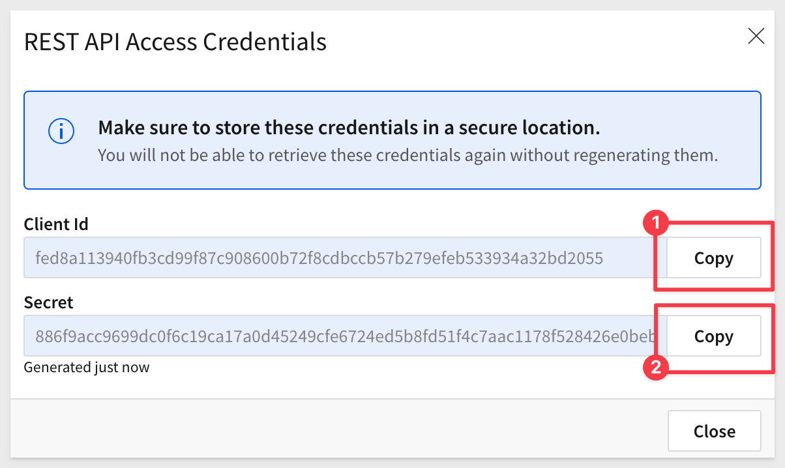
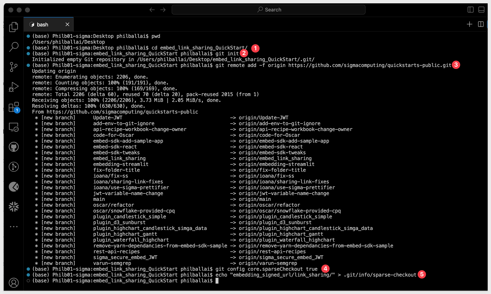
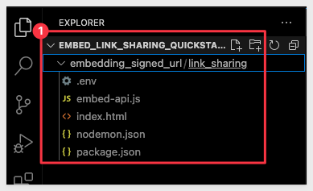
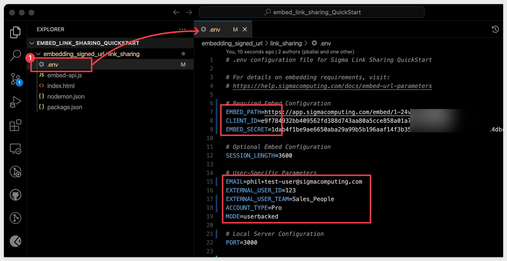
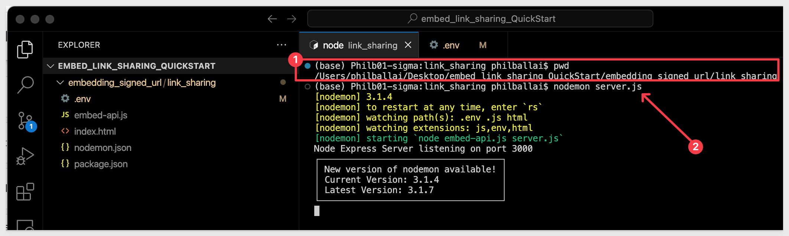
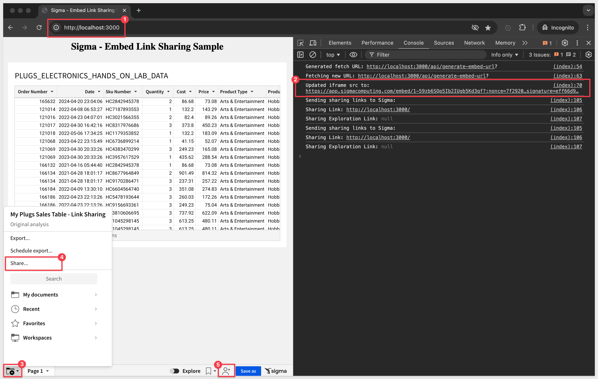
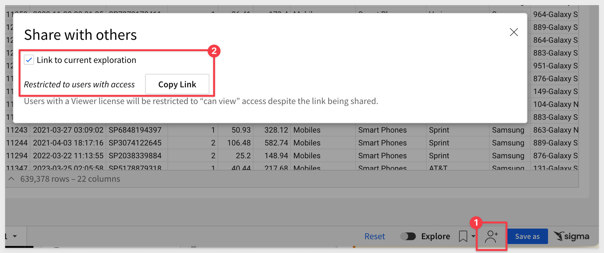
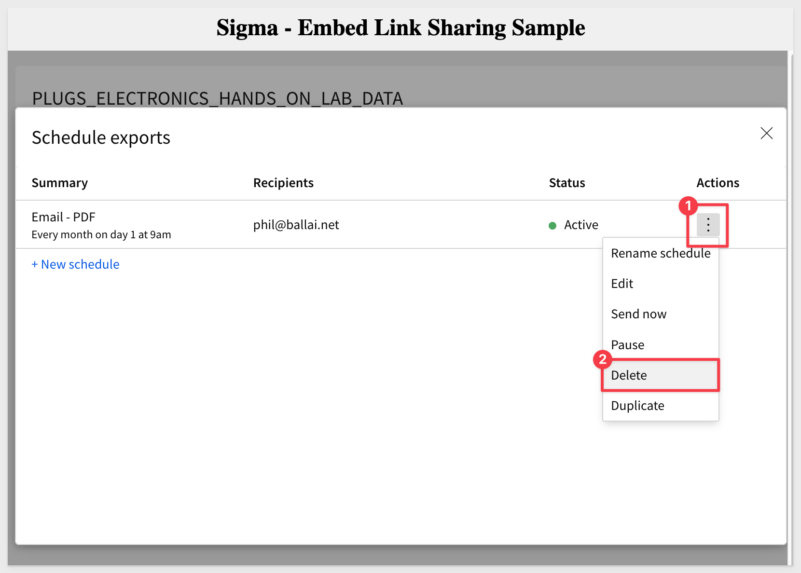

author: pballai
id: embedding_17_link_sharing
summary: embedding_17_link_sharing
categories: Embedding
environments: web
status: published
feedback link: https://github.com/sigmacomputing/sigmaquickstarts/issues
tags: deprecated
lastUpdated: 2024-08-31

# Embedding 17: Link Sharing 

## Overview 
Duration: 5 

Embedded Link Sharing, when enabled, allows users to share specific workbooks, explorations, or bookmarks through URLs generated within an embed as they work in Sigma.

These links can be copied and pasted into user-created emails (or other systems), allowing recipients to access the relevant content directly from their emails without needing to navigate back to Sigma.

These links will also be included in any scheduled exports created by the user, allowing recipients to click a link to access the shared content.

Alternatively, customer developers can use these links to enhance their application's functionality.

### Use Cases
**Sharing the Entire Embedded Workbook:**
- Users can share a link that brings other users directly to the full embedded workbook within the customer’s application.

**Sharing an Exploration Created from an Embedded Workbook:**
- Users can share a specific exploration they’ve created within a workbook. The shared link opens the exact exploration view, preserving the context of the analysis.

**Sharing a Bookmark:**
- Users can create and share bookmarks, which save the state of a workbook or exploration at a specific point in time. The shared link brings recipients directly to the bookmarked view, maintaining the exact state of the data.

**Scheduling an Export of a Workbook:**
- Users can schedule an export of a workbook, exploration, or bookmark. The export emails include a link that directs recipients to the specific embedded content, ensuring they access the relevant data directly from the email.

### Benefits of Embedded Link Sharing
**Enhanced Collaboration:**
- Users can share specific views, explorations, or bookmarks with their teams, ensuring that the exact context and state of the data are maintained.

**Consistency Across Platforms:**
- Shared links bring recipients back to the same embedded content within the customer’s application, whether it’s a full workbook, an exploration, or a bookmark.

### How It Works
Developers can trigger an iframe event in Sigma to set a `sharingLink` or `sharingExplorationLink` and include `bookmarks` when needed:

```code
{
    type: 'workbook:sharinglink:update',
    sharingLink: string | null,
    sharingExplorationLink?: string | null
}
```

This event allows Sigma to generate the appropriate link, which users can share. The link ensures that recipients access the exact workbook, exploration, or bookmarked view within the embedded Sigma environment.

<aside class="positive">
<strong>IMPORTANT:</strong><br> Some screens in Sigma may appear slightly different from those shown in QuickStarts. This is because Sigma is continuously adding and enhancing functionality. Rest assured, Sigma’s intuitive interface ensures that any differences will not prevent you from successfully completing any QuickStart.
</aside>

For more information on Sigma's product release strategy, see [Sigma product releases.](https://help.sigmacomputing.com/docs/sigma-product-releases)

### Target Audience
Developers using Sigma for embedding who may want to allow users to generate sharing links in various scenarios.

### Prerequisites

<ul>
  <li>A computer with a current browser. It does not matter which browser you want to use.</li>
  <li>Access to your Sigma environment.</li>
  <li>Some familiarity with Sigma is assumed. Not all steps will be shown as the basics are assumed to be understood.</li>
  <li>A development environment of choice. We will demonstrate with Microsoft VSCode and related extensions</li>
  <li>A working web server based on Node.js, as demonstrated in the QuickStart Embedding 1: Prerequisites</li>
</ul>

<aside class="postive">
<strong>IMPORTANT:</strong><br> Sigma recommends that you use non-production resources when doing QuickStarts.
</aside>

<button>[Sigma Free Trial](https://www.sigmacomputing.com/free-trial/)</button>
 


## Create Something to Embed
Duration: 5 

Sigma is very flexible and has different workflows for creating content, based on source data. 

For example, we could first create a [data model](https://help.sigmacomputing.com/docs/intro-to-data-models), set permission on it, and then save it off for later use in a workbook(s). We would then create a workbook with a table, that shows data from the data model we saved earlier.

<aside class="negative">
<strong>NOTE:</strong><br> To leverage the features in secure embedding, permission to your data is required at some level. Creating a data model and granting permissions to it is considered a best practice.
</aside>

To minimize the steps, we will leverage a different workflow.

<aside class="positive">
<strong>IMPORTANT:</strong><br> In either case, customers should evaluate the many options in Sigma against their own information security, compliance and governance policies, in order to make the best choices for their organizations. Sigma will be there to assist in these decisions, at any time you need.
</aside>

### Create a Team
To demonstrate our embed, we need to create a [Team](https://help.sigmacomputing.com/docs/manage-teams) to share our new workbook with. 

Navigate to `Administration` > `Teams` and click `Create Team`. 

Name the new team `Sales_People`, and click `Create`. 

<aside class="positive">
<strong>IMPORTANT:</strong><br> We don’t need to manually add users to this team, as they will be added automatically once they are authenticated by the parent application and access any embedded Sigma content.
</aside>

### Create a Workbook with Sample Data

From Sigma / `Home` click the `+` Create New button and click `Workbook`:


We will use `Table` from the options:


Next we need to select our source data. We will use the typical sample data, as in other QuickStarts.

Sigma allows users to search for tables by name; type `Hands` in the search bar and select the `PLUGS_ELECTRONICS_HANDS_ON_LAB_DATA` table:


This opens the selected table in a new (unpublished) workbook that carries the temporary name `Exploration`:


The first thing we want to do is click the `Save As` button, choose where to store the workbook and give it the name `My Plugs Sales Table - Link Sharing` and save it.


You may have noticed that Sigma provides `folders`, a `My Documents` folder and also [workspaces](https://help.sigmacomputing.com/docs/manage-workspaces). This enables a variety of use-cases to be possible with regards to how documents are stored, managed and shared with others.

### Share the Workbook

In order to fully demonstration this functionality, we will need another user. This user will be automatically added to Sigma's `Users` page upon first use of the parent application containing a Sigma embed. 

We will refer to this user as our `test-user` going forward, and use a valid email address so that can check the emails that Sigma sends to the `test-user`.

<aside class="negative">
<strong>NOTE:</strong><br> To keep this simple, we are using Gmail's alias feature so that we can see the test-users email in our primary email account. 
</aside>

The Embed-API will assign our `test-user` to the `Sales_People` team, which will grant the permission to them.

Click the caret to the right of the workbook's name and select `Share`


Search for the `Sales_People` team and provision `Can explore` permission, click `Share`. 


### Create Embed Path

Open the workbook's menu and and this time select `Embedding`:


Create a `secure` embed for the `Entire Workbook` and copy the `Embed URL` off to a text file for later use:


We are now ready to configure our secure embed for our workbook and team.


<!-- END OF SECTION-->

## Create Embed Credentials
Duration: 5 

Next, we will create the required information to provide to the developer of the Parent application (in this case the developer is us). They will need to update the Embed-API with this information.

### Sigma Embed Client credentials

Embed `Client credentials` ("credentials") are a crucial component for creating a Sigma embed. These credentials are encoded within your embed URL, providing an additional layer of validation to ensure the embed's authenticity and security.

The credentials are made up of the `Client ID` and `Client Secret`, and are generated using the Sigma UI.

The credentials will be used in the embed API, to ensure your embed URLs are valid at run-time.

**Here are some important points to note about the credentials:**

**Irretrievable**: Once created, you cannot retrieve the original credentials. Ensure to store them securely.

**Regeneration**: If the credentials are lost, they can be regenerated, but with different values. This will invalidate all existing embeds until the new values are in place in the embed API.

**Update Requirement**: After regenerating new credentials, you must update all existing embeds, using the Embed API for that change. 

Remember to keep your credentials in a secure location, as losing them requires action to maintain your embedded analytics functionality.

<aside class="positive">
<strong>IMPORTANT:</strong><br> You cannot look up your organizations existing credentials (Sigma support has no access to your credentials) after they have been created. 

If you lose your credentials, you must regenerate new credentials. 

If this happens, your existing embeds will be rendered invalid until the API is updated with the new embed credentials.
</aside>

### Client Credentials Creation

We will now create credentials that are specific to our workbook embed. 

**1:** Navigate to `Administration` > `Developer Access`:


**2:** Click `Create New`, located in the page's top right corner. This will open the `Create Client Credentials` modal.

**3:** Under `Access Credential Type?` select `Embedding`.

**4:** Enter a `Name` and `Description` as you see fit.

**5:** Under `Owner`, select an organization member with the account type you would like to associate with the embed secret. For now, just select yourself or an `Administrator`.


<aside class="negative">
<strong>NOTE:</strong><br> Some customers elect to have a "Service Account" user with administrative privileges for this "owner" assignment.
</aside>

**6:** Click Create:

**7:** Copy the provided `ClientID` and `Secret` and store them.



**8:** Click Close.

Paste the credentials into a text file for now, we will use them later. 

<aside class="negative">
<strong>NOTE:</strong><br> We can use these credentials for all embeds, but you may create as many credentials as you prefer.
</aside>


<!-- END OF SECTION-->


## Clone the Git Repository Project Folder
Duration: 5 

We have made the source code available for this QuickStart's demonstration in a [public GitHub repository.](https://github.com/sigmacomputing/quickstarts-public).

While you may clone the entire repository (it is not that large), we want to avoid cloning sections of the repository that are not of immediate interest. 

Instead, we will use VSCode and terminal to perform a git `sparse-checkout` of the specific project folder we are interested in. A few extra steps, but cleaner local project folder. 

Open `VSCode` and a new `terminal` session.

In terminal, navigate to the desired directory where we want to clone the repo folder into.

For example:
```code
cd {/path/to/your/directory}
```

Execute the terminal command:
```code
git init
```

Add the remote repository as the origin:
```code
git remote add -f origin https://github.com/sigmacomputing/quickstarts-public.git
```

Enable sparse checkout:
```code
git config core.sparseCheckout true
```

Specify the folder you want to clone by adding it to the sparse-checkout configuration:
```code
echo "embedding_signed_url/link_sharing/" > .git/info/sparse-checkout
```

At this point, we have run each command and not seen any errors:



Finally, pull the specified folder from the repository:
```code
git pull origin main
```

We can now see the cloned project folder:




<!-- END OF SECTION-->

## Parent Application
Duration: 5 

Open the cloned project folder in VSCode and click to open the `.env` file. This file contains variables that we will configure manually. In production environments, these values would be generated by the parent application at runtime. 

Replace the placeholder values for `EMBED_PATH`, `CLIENT_ID`, `EMBED_SECRET`, `EMAIL` and `EXTERNAL_USER_TEAM` to match your values created earlier.

For `ACCOUNT_TYPE` use `Pro` for now.




### Launch Node Express Web-server
In `VS-Code`, open a new terminal session and run the command:
```code
nodemon server.js
```

If an error indicates nodemon is not installed, run the command:

```code
npm install nodemon
```

Make sure the command is run in the correct directory, using the terminal command `pwd` or "present working directory".

<aside class="positive">
<strong>IMPORTANT:</strong><br> Your actual directory structure may be different than shown in the screenshot.
</aside>


The response in terminal will look like this:



The specific code block that informs Sigma to enable embed link sharing is in the file index.html:


### Test that the embed works
In your default browser, browse to:
```code
http://localhost:3000
```

It should look like this the screenshot below. Notice that there are now sharing options shown (#2/3 and #4):


Now that we have a working embed, we can test embed link sharing.


<!-- END OF SECTION-->

## Embed Link Sharing Workflow
Duration: 5 

With our embed working, we can start sharing links. 

Note that our sample code includes some logging, which can be seen in the browser's inspection console:



Both options (#4 and 5 in the image above) open a `Share with others` modal where the sharing link can be easily copied:


Go ahead and copy the link and paste it into another browser (to simulate a different user). The report will render as expected. For example, we tried it using Safari:


<aside class="negative">
<strong>NOTE:</strong><br> In real usage, users would just paste the embed sharing link into an email (for example) to other users. Upon receiving the email, users can then just click the link, and assuming they have permissions, the parent application will render the embed as it was shared.
</aside>

### Create an exploration
It is very common for users to want to share an exploration they have created, especially when it contains interesting insights.

To support this important feature, exploration link sharing is enabled.

To demonstrate, we can create a simple filter on the embed, as shown in the screenshot below:


Lets say we want to show just `Mobiles`:


Now when we select either of the sharing options, the modal gives us the option (enabled by default) to `Link to current exploration`:



If we copy this link and open it again in Safari, the embed will be filtered to show only `Mobiles`:


In looking at the link that Sigma generates, we can see there is a value for `exploreKey`. This is the reference to the shared exploration:
```code
http://localhost:3000?workbookId=3vgLIaDPizJG2LmoThUPYu&exploreKey=286b0a60-7586-494d-851c-77ebb3066bff
```

The exploration sharing link is also shown the the browsers inspection console:


<!-- END OF SECTION-->

## Bookmark Sharing
Duration: 5 

The embed link sharing workflow with bookmarks is very similar. Since not all customers use bookmarks, you can skip this section if your organization does not utilize them.

<aside class="negative">
<strong>NOTE:</strong><br> Bookmarks allow you to save the state of a published workbook in Explore or View mode. In a published workbook, you can make changes to the filters, controls, and other elements, and save the changes as a personal bookmark.
</aside>

To learn more about personal bookmarks, [see here.](https://help.sigmacomputing.com/docs/create-and-manage-bookmarks)

Lets create a bookmark for the filtered workbook we left off at. 

Click the `bookmark` icon and select `Save as new bookmark`:


Give the new workbook a name and click `Save`:


In the inspection console, we can see the new workbookID and also a new sharing link:


We can share this new workbook (remember, this is a workbook and not yet an exploration!) by clicking the share icon and clicking `Copy Link`:


Paste this into the browser and verify that we only have access to the filtered rows with a bookmarkID in the sharing exploration link:


If we continue the workflow, using the bookmarked workbook, we can add another filter to create a new exploration:


If we copy the exploration sharing link now, it also includes reference to the bookmark:
```code
http://localhost:3000/?exploreKey=3a976df5-2a22-4a97-ac37-cb94f1b374ef&bookmarkId=353b632f-e230-4919-9101-5512847e4075
```


<!-- END OF SECTION-->

## Scheduled Exports
Duration: 5

Continuing from the last section, lets schedule a report for our bookmarked exploration.

This time, open the embed's footer menu and click `Schedule export`:


Click the `Add schedule` button.

Provide a value email address and set the `Frequency` to `Monthly` and click `Create`:


Open the `Actions` menu and click `Send now` to test:


Once the email is received and opened, the recipient can just click the link to access the shared workbook (assuming they have permissions to do so from the parent application):


Clicking the link opens the original workbook since that is the link passed in sharingLink in the iframe event:


<aside class="negative">
<strong>NOTE:</strong><br> Without setting up link sharing, users can still schedule an export without  a sharable link back to the workbook. It would just contain the report in the selected export format.
</aside>

Don't forget to delete the schedule export job:




<!-- END OF SECTION-->

## What We've Covered
Duration: 5

In this QuickStart, we explained and demonstrated how to enable embedded link sharing in Sigma.

**Additional Resource Links**

[Blog](https://www.sigmacomputing.com/blog/)<br>
[Community](https://community.sigmacomputing.com/)<br>
[Help Center](https://help.sigmacomputing.com/hc/en-us)<br>
[QuickStarts](https://quickstarts.sigmacomputing.com/)<br>


Be sure to check out all the latest developments at [Sigma's First Friday Feature page!](https://quickstarts.sigmacomputing.com/firstfridayfeatures/)
<br>

[](https://twitter.com/sigmacomputing)&emsp;
[](https://www.linkedin.com/company/sigmacomputing)&emsp;
[](https://www.facebook.com/sigmacomputing)


<!-- END OF WHAT WE COVERED -->
<!-- END OF QUICKSTART -->
