author: pballai
id: embedding_1_prerequisites
summary: Prerequisites for the Sigma Embedding Series of QuickStarts
categories: Embedding
environments: web
status: Published
feedback link: https://github.com/sigmacomputing/sigmaquickstarts/issues
tags: Getting Started, Analytics, Data Engineering, BI, Business Intelligence, Sigma, Sigma Computing, Snowflake, Dashboarding, Visualization, Analysis, Excel, Spreadsheet, Embedding

# Embedding 1: Prerequisites

## **Overview** 
Duration: 5 

This QuickStart introduces you to the user interface and embedding capabilities of Sigma Workbooks. It is part one of a series of QuickStarts focused on Embedding and should be taken first.
 
We have broken the different types of embeds into separate documents based on use cases to allow a user to focus on those areas of interest and improve overall readability and supportability of each document.
 
**This QuickStart is foundational to all the other embedding QuickStarts.** Additionally, it will demonstrate how to set up a local web application so that you can simulate using Sigma Embedding on your local computer. The local web application (Parent application) is to be reused on a few of the other embedding QuickStarts as required. 

 ### Target Audience
Semi-technical users who will be aiding in the planning or implementation of Sigma with Embedding. No SQL or technical data skills are needed to do this QuickStart. It does assume some common computer skills like installing software, using Terminal, navigating folders and copy/paste operations.

### Prerequisites

<ul>
  <li>A computer with a current browser. It does not matter which browser you want to use.</li>
  <li>Access to your Sigma environment. A Sigma trial environment is acceptable and preferred.</li>
  <li>If have not already, you can sign up for a Sigma Trial here:</li>
</ul>

<button>[Free Trial](https://www.sigmacomputing.com/free-trial/)</button>

<ul>
  <li></li>
    <li>Node.js and required Packages (all free):
        <ul>
        <li>Express</li>
        <li>Node-supervisor</li>
        <li>crypto (is now included with Node.js installation)</li>
        </ul>
    </li>
</ul>

### What You’ll Learn
We will cover the types of Embedding Sigma provides and how to setup a local environment to simulate an Application that we can embed into.

### What You’ll Build
We will install, configure and verify a local Node.js web server to be used in later Embedding Series QuickStarts.

<aside class="negative">
<strong>NOTE:</strong><br> There are many programming languages and libraries you can use to plaintext a client and server-side application. Node.js is the one we will be using today. The plaintext today will also be highly simplified and commented to assist in your learning.
</aside>

<aside class="positive">
<strong>IMPORTANT:</strong><br> We will refer to the Node.js Express web application as the “Parent” application going forward. This is analogous to a customer’s application that Sigma would be embedded into. 
</aside>


<!-- END -->

## **Use Cases**
There are two types of embedding in Sigma: **Application** and **Public**.

### **Application Embedding**
Application is the most common type of embedding. This is used when a company has a web portal that they wish to embed Sigma content directly into while retaining security, tenancy and a tailored user experience.
 
For example, a company may have an internal web site that employees have to log onto with Single-Sign-On where they want to provide a dashboard that only shows data filtered for each employee’s region. Another common use case is where a company has a web portal that their customers or partners can securely log onto to see data filtered for their own organization.
 
Sigma also allows you to extend or create custom Application embed experiences as well.

These are the high-level use cases of Application embedding that are most commonly seen:

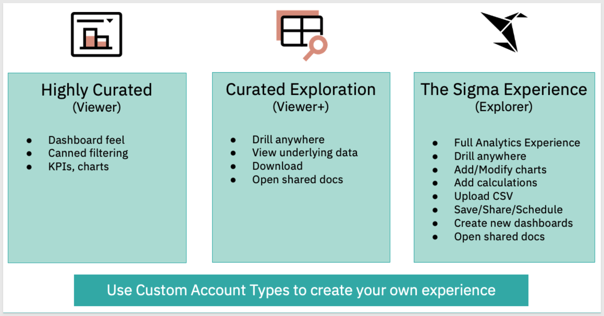

There are three “modes” that Application embedding can be operated in; `View, Explore and Userbacked.` 

`Userbacked` is by far the most popular mode as it works with the Parent application’s authentication to pass user-level permissions.

We will review each mode and fully demonstrate Application embedding in a separate QuickStart: Embedding 3: Application Embedding.

Sigma also supports Application embedding in other 3rd party applications like Salesforce and there is a separate QuickStart: Embedding 5: Application Embedding into SalesForce.
 
**For more information, please see these links:**<br>
[Application Embedding: ](https://help.sigmacomputing.com/hc/en-us/articles/1500011574541-Application-Embedding)<br>
[Drive Revenue by Using Sigma with Salesforce: ](https://www.sigmacomputing.com/blog/drive-revenue-by-using-sigma-with-salesforce/)

### **Public Embedding**
The simplest use case we provide is called Public embedding. **Customers use this when security is not required** but there is a need to embed Sigma content. For example, embedding some KPIs or charts on a company’s public website that anyone can see. We will demonstrate Public embedding in a separate QuickStart:[Embedding 2: Public Embedding](https://quickstarts.sigmacomputing.com/guide/embedding_embedding_2_public_embedding/index.html) 
### **A word about iFrames**
Sigma uses iframe(s) to embed Sigma content. An iframe is the type of HTML element that renders the embed in the browser. To tell the iframe what to render, you will need to pass it an embed URL. Embed URL creation varies depending on the embed type you are implementing and affords a great deal of flexibility for customization by passing runtime parameters both to render the embed but also to pass parameters between the Parent application and the iframe and back. This parameter passing affords an easy to implement method for developers but also better end user experience through deep interactivity of all the page/iframe elements.


<!-- END -->

## **Parent Application Setup**
Duration: 20

First, we need to install and configure the portal where we can embed Sigma content. We will provide instructions for Mac systems, but the process is nearly identical for Windows and Linux. It does not matter which system you decide to use since Sigma runs in a browser, the Parent application can be developed and run in the environment of your choice.
 
We will use the popular framework Node.js. Node.js is an open-source, cross-platform, back-end JavaScript runtime environment that runs on a JavaScript Engine and executes JavaScript plaintext outside a web browser, which was designed to build scalable network applications.
 
Node is going to allow us to set up a local web server that will make a web page available that we will use to securely embed our Sigma content. 

### **Public Embed Project Files**
Download and unzip the project file to a suitable location of your choice that is easily accessible on your system. We placed it in a folder on the computer's desktop called sigma_public_embed. 

 sigma_embed_prerequisites.zip and the zip file contains these two files:
[The download is here:](https://sigma-quickstarts-main.s3.us-west-1.amazonaws.com/embedding/sigma_embed_prerequisites.zip)

 <ul>
      <li><strong>Index.html:</strong> is the web page that contains the iframe we are embedding into</li>
      <li><strong>Server.js:</strong> is a JavaScript routine that sets up the services required and allows configuration of the Sigma options. This is also referred to as the Parent API.</li>
</ul>

 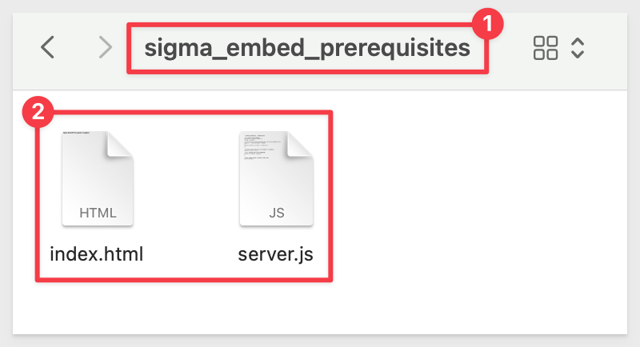

### **Node.js Installation and Setup**

[Download and install Node.js from here:](https://Nodejs.org/en/download/)

Use the LTS (long term supported) version appropriate for your operating system.

Run the installer selecting all the defaults. This will install both Node and the Node package manager (which manages optional Node components). The package manager is abbreviated to “npm” when running commands.

You can verify your installation using Terminal:

**Run the command:**
```plaintext
node -v
```

`Right click` on the prereguisite folder and select `New terminal at folder`:

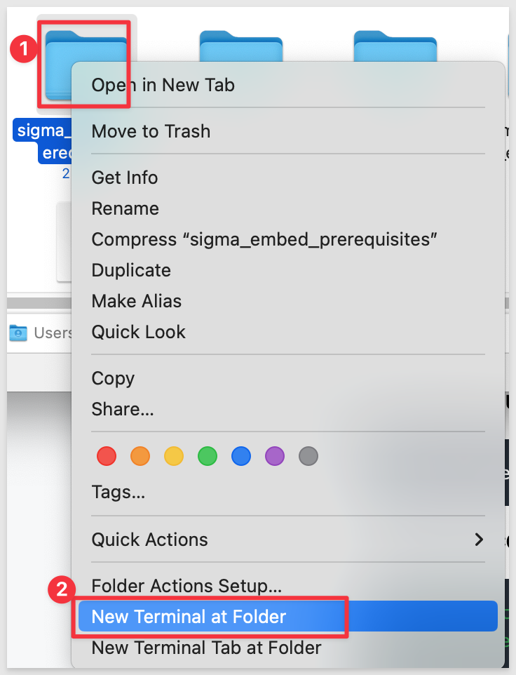

This should return the version number as below:

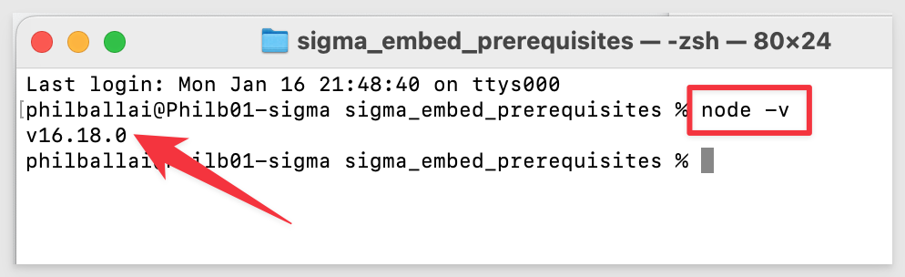

We now need to install two Node.js Packages. These will provide a web server and a random number generator for our web application. To do this, we will use the Node Package Manager (npm) which was installed as part of the Node.js installation.

Reuse the same Terminal session (or open a new one using the same method we just did).

We will install two Node.js Packages. These will provide a web server and a random number generator for our web application. To do this, we will use the Node Package Manager (npm) which was installed as part of the Node.js installation.

We will use the nmp flag -g `global` so that in later Embedding QuickStarts Express and Node-supervisor will be available to different folders.

<aside class="negative">
<strong>NOTE:</strong><br> sudo su will prompt you for your operating system password.
</aside>

**Run the command:**
```plaintext
sudo su
```
Provide your password and hit Return.

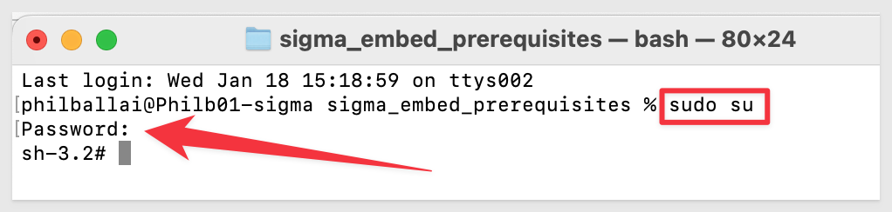

**Run the command:**
```plaintext
npm install express -g
```

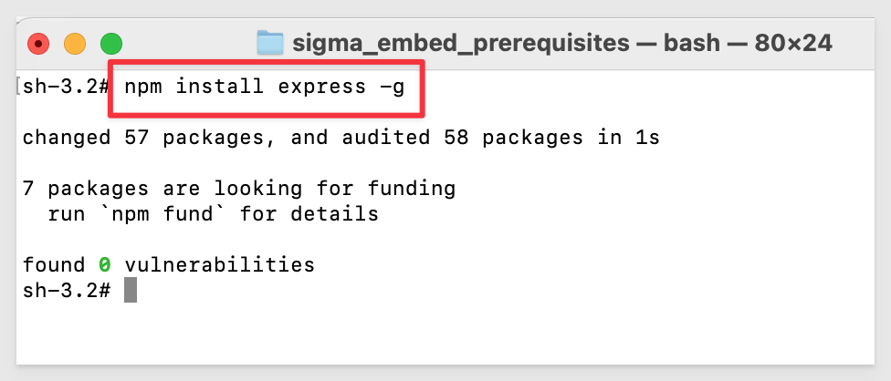

Node-supervisor is a Package that runs your program, and watches for plaintext changes so you can have hot-plaintext reloading-ish behavior, without worrying about if you need to restart your application each time you make a change. A browser refresh will still be required to see the changes on the page. While this Package is technically not required, it is a real time-saver in the QuickStart.

We don't need to run sudo su (to login as superuser) as long as we use the same Terminal session again.

**Run the command:**
```plaintext
npm install supervisor -g 
```
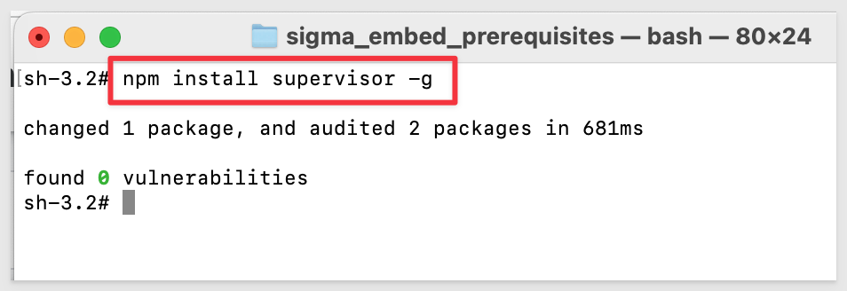


<!-- END OF NEXT SECTION-->

## **Bring up Express**

You are now ready to test Node using your server.js file. 

**Run the command:** 
```plaintext
supervisor server.js
```
<aside class="negative">
<strong>NOTE:</strong><br> Make sure to run this from the folder where the server.js file is stored.
</aside>

You should see the output as shown below indicating that the Express Web server is running and Node-supervisor is watching for plaintext changes:

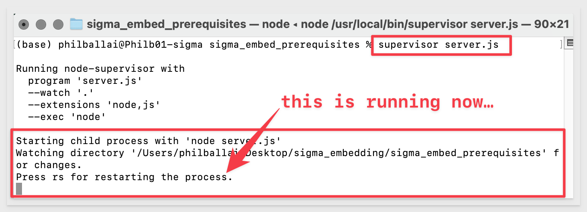


<!-- END OF NEXT SECTION-->

## **Test the Parent Website**

You are now ready to check if the Parent application website is reachable in a browser.

Open a browser and set the URL to:

```plaintext
http://localhost:3000
```
The return should be:
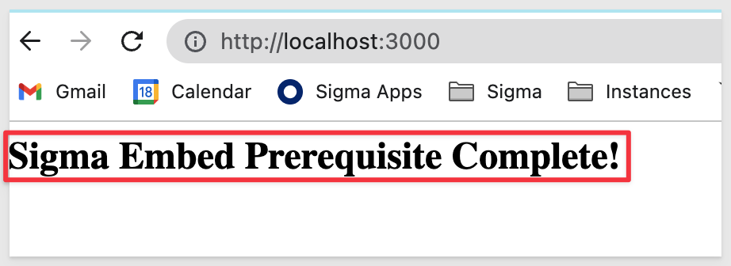

<aside class="negative">
<strong>NOTE:</strong><br> Node-supervisor will watch for changes but in the event you want to force the Express server to stop either manually exit Terminal or hit CTRL+C to stay in Terminal but terminate the Express process so you can restart it as before.
</aside>


<!-- END -->


## **Make a Change**

Let's make a small change to the plaintext that is driving the default webpage and see what happens.

The default webpage is changed by editing the file `index.html`.

With Node supervisor, you can make changes to `index.html` and save them. Supervisor will notice the change and restart Express to load your changes. Just refresh your browser page to see the changes. When you make changes, you may notice activity in the Terminal window and this is expected and normal. 

Make sure that Terminal is still open and running the last command `npm run supervisor'. 

Right-click on the `index.html` file and open it in a text editor:

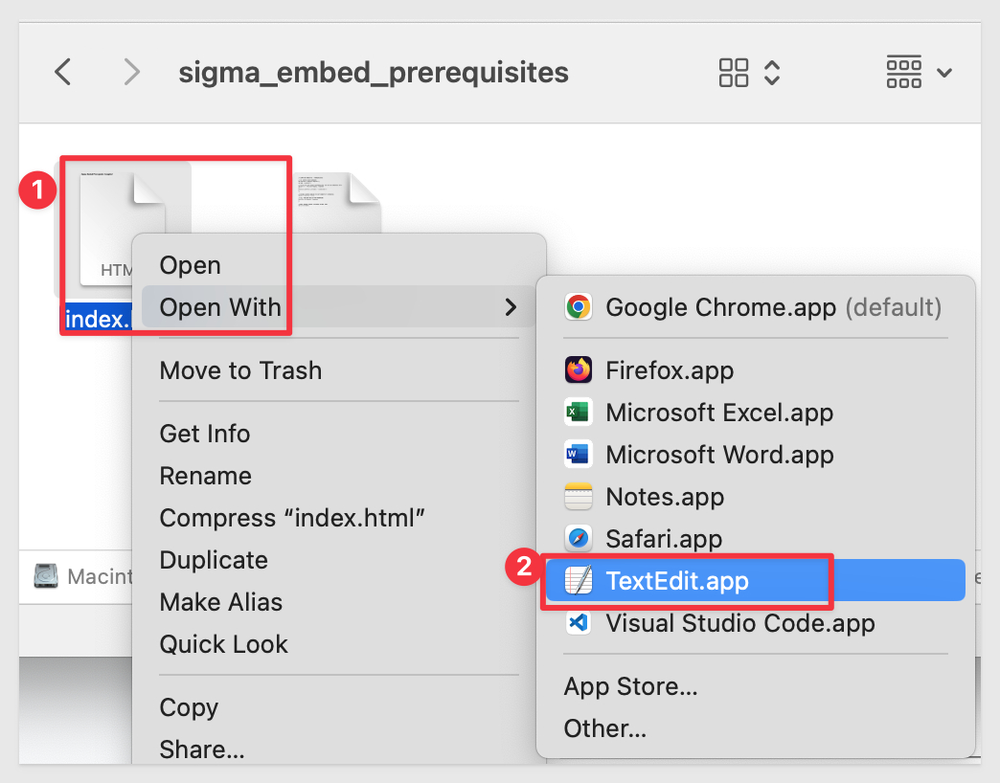

Add and lew line and some text just below the `Sigma Embed Prerequisite Complete!` line. Save the change and refresh your browser. You should see the change:

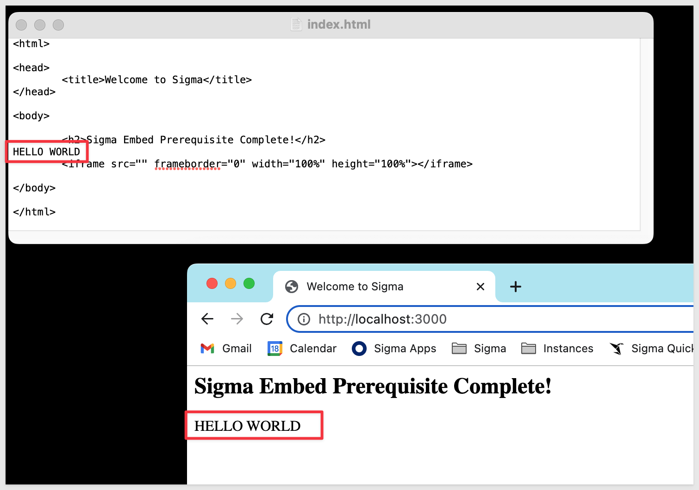

If you do, you are ready to progress to the next QuickStart in this Series which will use this framework we have setup.


<!-- END -->

## What we've covered
Duration: 5

We covered the types of Embedding Sigma provides and how to setup a local environment to simulate an Application that we can embed into.

<button>[Click to move to the next QuickStart in the Embedding Series]( https://quickstarts.sigmacomputing.com/guide/embedding_2_public_embedding/index.html)</button>
                                                                   
**Additional Resource Links**

[Help Center Home](https://help.sigmacomputing.com/hc/en-us)<br>
[Sigma Community](https://community.sigmacomputing.com/)<br>
[Sigma Blog](https://www.sigmacomputing.com/blog/)<br>
<br>

[](https://twitter.com/sigmacomputing)&emsp;
[](https://www.linkedin.com/company/sigmacomputing)
[](https://www.facebook.com/sigmacomputing)


<!-- END OF WHAT WE COVERED -->
<!-- END OF QUICKSTART -->