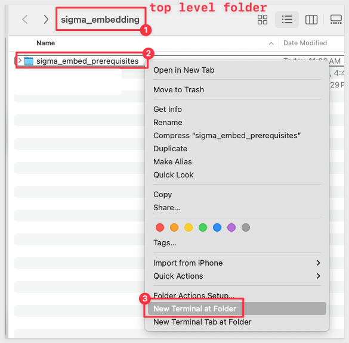
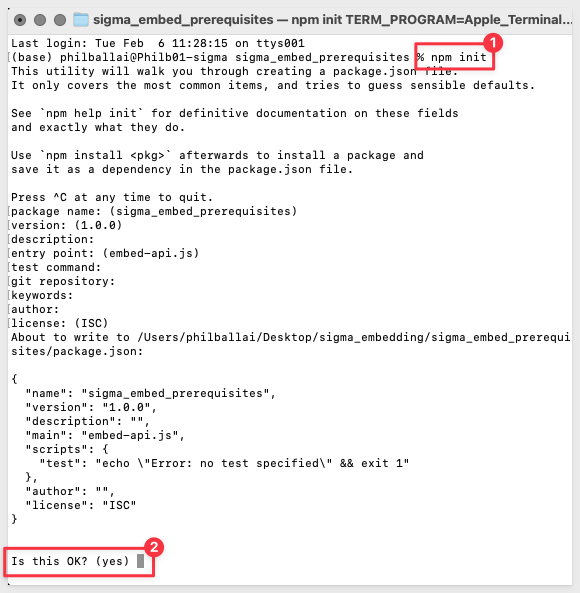
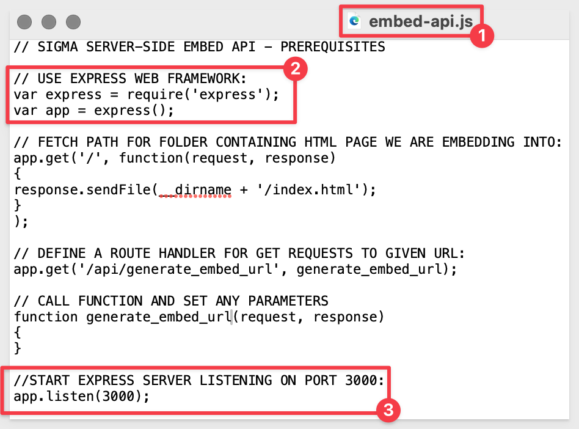

author: pballai
id: 01_embedding_prerequisites
summary: Prerequisites for the Sigma Embedding Series of QuickStarts
categories: Embedding
environments: web
status: Published
feedback link: https://github.com/sigmacomputing/sigmaquickstarts/issues
tags: default
lastUpdated: 2024-01-31

# 01: Embedding Prerequisites

## Overview 
Duration: 5 

This QuickStart introduces you to the user interface and embedding capabilities of Sigma Workbooks. It is part one of a series of QuickStarts focused on Embedding and should be taken first.
 
We have broken the different types of embeds into separate documents based on use cases to allow a user to focus on those areas of interest and improve overall readability and supportability of each document.
 
**This QuickStart is foundational to all the other embedding QuickStarts.** 

Additionally, it will demonstrate how to set up a local web application so that you can simulate using Sigma Embedding on your local computer. The local web application (Parent application) is to be reused on a few of the other embedding QuickStarts as required. 

For those interested, there is a comprehensive whitepaper, [Embedded Analytics Solutions for Secure Embedding](https://www.sigmacomputing.com/white-papers/white-paper-embedded-analytics) 

 ### Target Audience
Semi-technical users who will be aiding in the planning or implementation of Sigma with embedding. No SQL or technical data skills are needed to do this QuickStart. It does assume some common computer skills like installing software, using Terminal, navigating folders and copy/paste operations.

### Prerequisites

<ul>
  <li>A computer with a current browser. It does not matter which browser you want to use.</li>
  <li>Access to your Sigma environment. A Sigma trial environment is acceptable and preferred.</li>
  <li>If have not already, you can sign up for a Sigma Trial here:</li>
</ul>

<aside class="postive">
<strong>IMPORTANT:</strong><br> Sigma recommends using non-production resources when engaging in QuickStarts.
</aside>

<button>[Free Trial](https://www.sigmacomputing.com/free-trial/)</button>

<ul>
  <li></li>
    <li>Node.js and required Packages (all free):
        <ul>
        <li>Express</li>
        <li>Node-supervisor</li>
        <li>crypto (included with Node.js installation)</li>
        </ul>
    </li>
</ul>

### What You’ll Learn
We will cover the types of embedding Sigma provides, and how to setup a local environment to simulate an application that we can embed into.

<aside class="positive">
<strong>IMPORTANT:</strong><br> This QuickStart series demonstrates methods using Node.js, JavaScript and HTML, but Sigma also provides an "Embed Sandbox" built directly into Sigma's interface. This allows developers to quickly test configurations / parameters / theming, without leaving Sigma. It is good to have options!
</aside>

### What You’ll Build
We will install, configure and verify a local Node.js web server to be used in later embedding series QuickStarts.

<aside class="negative">
<strong>NOTE:</strong><br> There are many programming languages and libraries you can use to develop a server-side application. Node.js is the one we will be using today. The sample code provided is simplified and commented to assist in your learning.
</aside>

<aside class="positive">
<strong>IMPORTANT:</strong><br> We will refer to the Node.js Express web application as the “Parent” application going forward. This is analogous to a customer’s application that Sigma is be embedded into. 
</aside>


<!-- END -->

## Use Cases
There are two types of embedding in Sigma: **Secure** and **Public**.

### **Secure Embedding**
**Secure** is the most common type of Sigma embedding. 

This is used when a company has a web portal that they wish to embed Sigma content directly into while retaining security, tenancy, and a tailored user experience.
 
For example, a company may have an internal web site that employees have to log onto with single-sign-on where they want to provide a dashboard that only shows data filtered for each employee’s region. 

Another common use case is where a company has a web portal that their customers or partners can securely log onto to see data filtered for their own organization. 
 
Sigma also allows you to extend or create custom Secure embed experiences as well.

These are the high-level use cases of Secure embedding that are most commonly seen:


Sigma also supports **Secure** embedding in other 3rd party applications like Salesforce or Streamlit:

[QuickStart: Embedding 5: Application Embedding into SalesForce.](https://quickstarts.sigmacomputing.com/guide/embedding_5_application_embedding_into_salesforce/index.html?index=..%2F..index#0)

[QuickStart: Embedding Sigma in Streamlit Applications.](https://quickstarts.sigmacomputing.com/guide/embedding_9_embedding_into_streamlit/index.html?index=..%2F..index#0)
 
### **Public Embedding**
The simplest use case we provide is called **Public** embedding. 

**Customers use this when security is not required,** but there is a need to embed Sigma content. 

For example, embedding some KPIs or charts on a company’s public website that anyone can see. 

We demonstrate Public embedding in a separate [QuickStart: Public Embedding](https://quickstarts.sigmacomputing.com/guide/embedding_2_public_embedding/index.html) 

### **Interactivity**

Sigma uses iframe(s) to embed Sigma content. An iframes are HTML elements that renders external content (in this case, a Sigma embed) in a browser. 

To tell the iframe what to render, you will need to pass it a URL. 

Sigma embed URLs offer a great deal of flexibility for customization by passing runtime parameters to render the embed. 

The parent application make use of standard and custom parameters passing (think "variables") at user login.

This parameter passing is an **"easy-to-implement"** method for developers, but also provides for richer end user experience through deep interactivity of all the page/iframe elements.

There is a QuickStart that covers parameters and all the available options: [QuickStart: Leverage Parameters and User-Attributes with Sigma Embedding](https://quickstarts.sigmacomputing.com/guide/embedding_howto_leverage_parameters_and_ua/index.html?index=..%2F..index#0)

Once a user is logged in, the parent application and embed can interact by passing parameters to each other.

Sigma provides a built-in JavaScript event "listener" in support of this. 

This is covered in the [QuickStart: Actions and Events.](https://quickstarts.sigmacomputing.com/guide/embedding_6_actions_events/index.html?index=..%2F..index#1)

Lastly, iframes can be made "responsive" to optimize the end-users browser experience: 
[QuickStart: How to: Responsive iframes with Sigma](https://quickstarts.sigmacomputing.com/guide/embedding_dynamic_iframes/index.html?index=..%2F..index#0)


<!-- END -->

## Parent Application Setup
Duration: 20

First, we need to install Node.js and configure a local project folder (with the associated project files), where we can embed Sigma content. 

We will provide instructions for Mac systems, but the process is nearly identical for Windows and Linux. It does not matter which system you decide to use since Sigma runs in a browser. **The Parent application can be developed and run in the environment of your choice.**
 
We will use the popular framework [Node.js. ](https://nodejs.org/en)

Node.js (Node) is an open-source, cross-platform, back-end JavaScript runtime environment that runs on a JavaScript engine and executes JavaScript plaintext outside a web browser, which was designed to build scalable network applications.
 
With Node, we are able to set up a local web server that will make a web page available, that we will use to securely embed our Sigma content. 

### **Create Top Level Project Folder**
Create a new folder on your local system where we will store individual project folders as we progress through the QuickStart embedding series. 

Each QuickStart in the series should end up with it's own folder. 

Each folder will have it's own version of the required code and dependencies.

There may be some overlap as we progress through each QuickStart, but that is to be expected as some people may not do every QuickStart in the embedded series.

<aside class="negative">
<strong>NOTE:</strong><br> It is a development best practice to isolate project and their respective dependencies.
</aside>

We created a top level folder called `sigma_embedding` on our systems's desktop, for ease of access. 

### **Node.js Installation**

[Download and install Node.js from here:](https://Nodejs.org/en/download/)

Use the LTS (long term supported) version appropriate for your operating system.

Run the installer selecting all the defaults. **We do not need to specify our project folder for this installation.**

This will install both `Node` and the `Node package manager` (which manages optional Node components, which add more functionality). 

The package manager is abbreviated to `npm` when running commands.

You can verify your installation using Terminal:

`Right click` on the `sigma_embedding` folder and select `New terminal at folder`:


**Run the command:**
```code
node -v
```

This should return the version number as below:


<aside class="negative">
<strong>NOTE:</strong><br> You version number will likely vary from what is shown in the screenshot, based on when you installed Node.
</aside>

`Exit` Terminal.

### **Prerequisite Embed Project Files**
Download and unzip the project file (for this QuickStart) to the folder called `sigma_embedding`.

[Download sigma_embed_prerequisites.zip](https://sigma-quickstarts-main.s3.us-west-1.amazonaws.com/embedding/sigma_embed_prerequisites.zip)

The zip file contains these two files:

 <ul>
      <li><strong>index.html:</strong> the simplified HTML web page that contains the iframe we are embedding into.</li>
      <li><strong>embed-api.js:</strong> a JavaScript routine that sets up the services required and allows configuration of the Sigma options. This is referred to as the server-side embed API (embed API), and is created by the customer, and stored server-side.</li>
</ul>


### **Install Node Dependencies Locally**

We now need to initialize Node and install two Node packages inside our local project folder.

These will provide a web server and a "manager" for our web application. We will explain the manager in a bit.

To do this, we will use the Node Package Manager (npm) which was installed as part of the main Node installation.

We do this to make sure the next steps are done from the correct folder. 

<aside class="positive">
<strong>IMPORTANT:</strong><br> For Node and packages that your project depends on (like Express.js), it's common to install them locally, within each project to avoid version conflicts between different projects. 

You may also use the -g flag (global) to make the express package available to all your Node.js projects, not just the one in your current directory. 

We have seen some instances (on various versions of operating systems and system configurations) where Express could not be found when trying to run our node application after using the -g flag. 

For this reason will just install Node and packages for any embed QuickStart folders we create later too.
</aside>

`Right click` on the `sigma_embed_prerequisites` folder (inside the `sigma_embedding` folder) and select `New terminal at folder`:

<aside class="positive">
<strong>IMPORTANT:</strong><br> Make sure your terminal is using the correct directory when running the next three command. Failure to do so will result in unexpected behavior later.
</aside>



**Run the command to initialize Node locally:**
```code
npm init
```

Npm will prompt you:

**"This utility will walk you through creating a package.json file. It only covers the most common items, and tries to guess sensible defaults."**

Keep pressing `Enter` to accept the defaults till you get to `Is this OK? (yes)` and hit `Enter` one last time:



This creates a new file in our project folder called `package.json`. This file allows `npm` to correctly manage the dependencies for your project. This is very useful for project with a large number or different versions of dependencies. 

We will not need to edit this file at this time.

**Run the command to install the Express web-server:**
```code
npm install express
```


### Node Supervisor
Node-supervisor is a package that runs our program, and watches for plaintext changes, so we can have hot-reloading-ish behavior. 

This means that we don't need to  worry about restarting your application (in this case, Node) each time we make a change to the server.js file.

**A browser refresh will still be required to see the changes on the webpage. **

<aside class="negative">
<strong>NOTE:</strong><br> There is an extension for Chrome called "LiveReload" which will also handle the browser refresh for you. We leave that up to the user to decide if they want to install and enable any browser extension.
</aside>

While the supoervisor package is not technically required, it is a real time-saver when making quick code changes during the QuickStart embed series.

**Run the command:**
```code
npm install supervisor
```


<!-- END OF NEXT SECTION-->

## Setup the Webserver

You are now ready to test Node using your server.js file. 

**Run the command:** 
```code
supervisor embed-api.js
```
<aside class="negative">
<strong>NOTE:</strong><br> Make sure to run this from the folder where the embed-api.js file is stored.
</aside>

You should see the output as shown below indicating that the Express Web server is running and Node-supervisor is watching for code changes/saves:


**How is Node Express running, we did not start it did we?**

By opening `embed-api.js` in a text editor, we can see that there are commands to require Express be loaded when Node is started. 

Recall that our Node command requested Supervisor to also read embed-api.js when it starts Node, all inside our local folder we created called "sigma_embed_prerequisites".

We also set the running port to be 3000:




<!-- END OF NEXT SECTION-->

## Test the Parent Website

You are now ready to check if the Parent application website is reachable in a browser.

Open a browser and set the URL to:

```code
http://localhost:3000
```
The return should be:


<aside class="negative">
<strong>NOTE:</strong><br> Supervisor will constantly watch for changes, but in the event you want to force Supervisor to stop, you can either manually exit Terminal, or hit CTRL+C to stay in Terminal, but terminate the Supervisor process so you can restart it as before.
</aside>


<!-- END -->


## Make a Change

Let's make a small change to the plaintext that is driving the default webpage and see what happens.

The default webpage is changed by editing the file `index.html`.

With Node supervisor, you can make changes to `index.html` and save them. 

Supervisor will notice the change and restart Express to load your changes. 

Just refresh your browser page to see the changes. When you make changes, you may notice activity in the Terminal window and this is expected and normal. 

Make sure that Terminal is still open and running the last command `supervisor embed-api.js`. 

Right-click on the `index.html` file and open it in a text editor:


Add and new line and some text just below the `Sigma Embed Prerequisite Complete!` line. 

Save the change and refresh your browser. 

You should see the change:


If you do, you are ready to progress to the next QuickStart in this series. which will extend this framework.


<!-- END -->

## What we've covered
Duration: 5

We covered the types of embedding Sigma provides, common use cases, and how to setup a local environment to simulate an application that we can embed into.

For those interested in embedding without security (ie: Public embedding), proceed to [QuickStart: Embedding 2: Public Embedding](https://quickstarts.sigmacomputing.com/guide/embedding_2_public_embedding/index.html?index=..%2F..index#0)

If you are only interested in the Secure method, you can skip `Embedding 2: Public Embedding`.

For those interested in embedding with security, proceed to [QuickStart: Embedding 3: Secure Embedding ](https://quickstarts.sigmacomputing.com/guide/embedding_3_application_embedding/index.html?index=..%2F..index#0)

                                                                  
**Additional Resource Links**

Be sure to check out all the latest developments at [Sigma's First Friday Feature page!](https://quickstarts.sigmacomputing.com/firstfridayfeatures/)

[Help Center Home](https://help.sigmacomputing.com)<br>
[Sigma Community](https://community.sigmacomputing.com/)<br>
[Sigma Blog](https://www.sigmacomputing.com/blog/)<br>
<br>

[](https://twitter.com/sigmacomputing)&emsp;
[](https://www.linkedin.com/company/sigmacomputing)&emsp;
[](https://www.facebook.com/sigmacomputing)


<!-- END OF WHAT WE COVERED -->
<!-- END OF QUICKSTART -->
