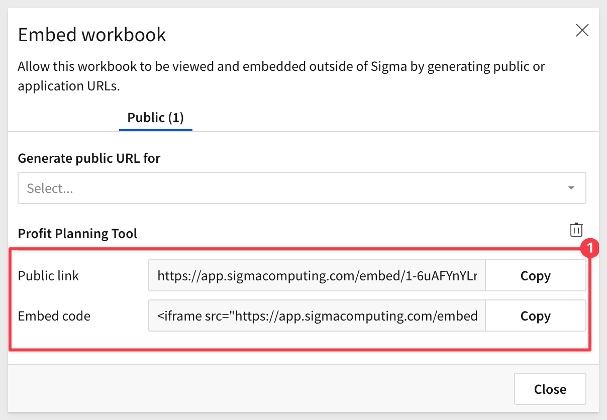
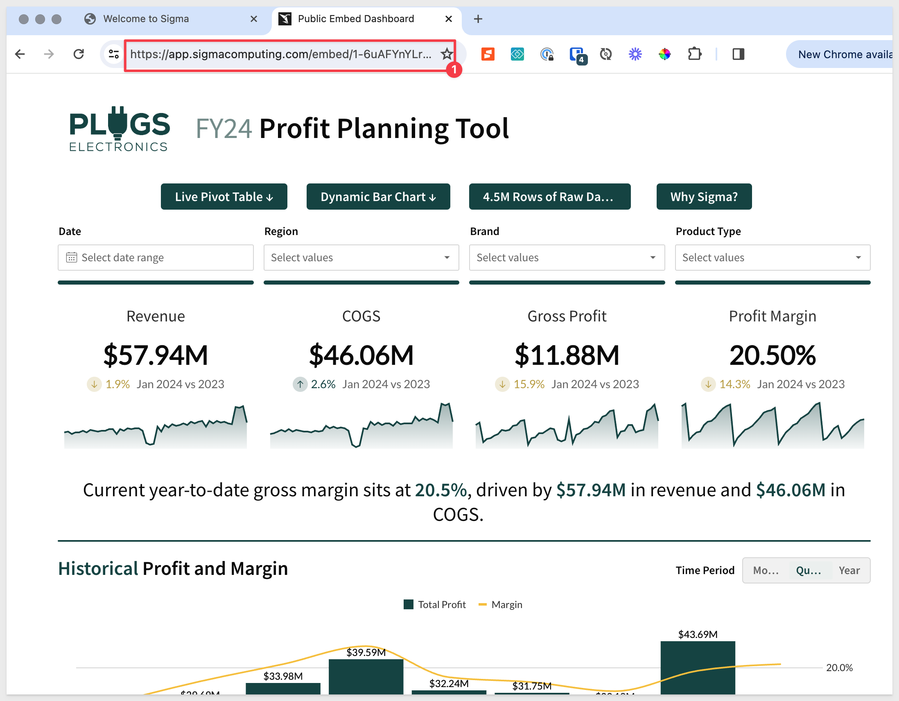
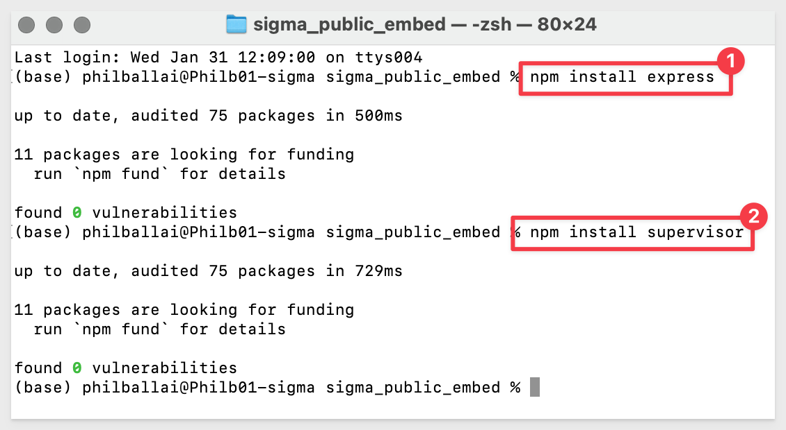

author: pballai
id: embedding_2_public_embedding
summary: How to embed Sigma in Public websites with no security
categories: Embedding
environments: web
status: Published
feedback link: https://github.com/sigmacomputing/sigmaquickstarts/issues
tags: default
lastUpdated: 2023-03-15

# Embedding 2: Public Embedding

## Overview 
Duration: 5 

This QuickStart introduces you to Sigma Public embedding and demonstrates how to embed Sigma content in a public (no user security) website. 

This QuickStart assumes you have already taken the [QuickStart: Embedding 1: Prerequisites](https://quickstarts.sigmacomputing.com/guide/embedding_1_prerequisites/index.html?index=..%2F..index#0) so that you have a sample environment to complete the tasks in this QuickStart.
 
Public embedding allows you to present content outside of Sigma, in a controlled manner for public consumption. 

This is a good option if you want to display an embed on a public facing website (for example). 

Access to a public embed will not allow someone to access your data deeper in Sigma without a Sigma account for your organization and proper permissions. 

There is support for embedding a Sigma workbook, page or single element.

 ### Target Audience
Semi-technical users who will be aiding in the planning or implementation of Sigma with Embedding. No SQL or technical data skills are needed to do this QuickStart. It does assume some common computer skills like installing software, using Terminal, navigating folders and copy/paste operations.

### Prerequisites

<ul>
  <li>A computer with a current browser. It does not matter which browser you want to use.</li>
  <li>Access to your Sigma environment. A Sigma trial environment is acceptable and preferred.</li>
  <li>A working web server based on Node.js (Node) as demonstrated in the QuickStart Embedding 1: Prerequisites</li>
  <li>Some content to embed. You can embed a Workbook, Table or Visualization.</li>
  <li>Downloadable project files discussed later in this document.</li>
</ul>

<aside class="postive">
<strong>IMPORTANT:</strong><br> Sigma recommends using non-production resources when engaging in QuickStarts.
</aside>

<button>[Free Trial](https://www.sigmacomputing.com/free-trial/)</button>

### What You’ll Learn
The exercises in this QuickStart will discuss and walk you through the steps to embed Sigma content in a demonstration web application without security (ie: Public).

### What You’ll Build
We will embed a Sigma dashboard, inside a html page, served by a Node web application. The final result will look like this:


<aside class="positive">
<strong>IMPORTANT:</strong><br> We will refer to the Node Express web application as the “Parent” application going forward. This is analogous to a customer’s application that Sigma would be embedded into. The application will only have one file, "index.html".
</aside>


<!-- END -->

## Initial Steps
Duration: 5

To create a Public embed, you will need to complete a few steps in Sigma and your Parent application. 

This requires implementation of client `(the index.html file)` and server-side embed API `(the server.js file)` code. 

Of course, customers may just embed the iframe anywhere, as there is no security involved. 

This generalized workflow provides a visual overview of the steps:


<!-- END -->

## Content Preparation
Duration: 5

Log into Sigma and navigate to a workbook you want to embed. It doesn't really matter what you choose and once you have completed your first embed, this portion of the process is very straightforward regardless of embedding an entire workbook, page or single element.

We will use one of the pre-built templates that are included in a Sigma trial, but the steps are the same regardless of what you choose to work with.

After `logging into Sigma`, navigate to `Templates` and click the `Plugs Electronics Profit Planning Tool` example to open that workbook:


Click `Dismiss` to exit the on-screen help:


<aside class="positive">
<strong>IMPORTANT:</strong><br> A workbook must be "Published" to create or manage any embeds. 
</aside>

Click the `Save As` button and give your workbook any name you like:


We called our workbook `Public Embed Dashboard` and clicked the `Save` button. The workbook is now `Published`. 

We could continue to make edits, but they will not show up later in the Public embed until they are again published.

Click the `caret (▼)` icon button to the right of the Workbook title in the header and select `Embedding`:


This modal displays all available embeds. 

Select the `Public (0)` tab and then select `Profit Planning Tool`. 

This will allow us to only display the Profit Planning Page in our embed.


<aside class="negative">
<strong>NOTE:</strong><br> You can choose the entire workbook, page or one or more elements (Tables, Viz ect...).
</aside>

You will be presented with the required links to embed in your application. Copy both of the links and save them off to a text file. These are what you would normally provide to the Parent application developer, but in this case, that is you. 



Now that we have the `embed URL,` we can simple paste it into the URL address of  a browser, hit enter and we can see the `Profit Panning` Dashboard:




<!-- END -->

## Using the iframe in Node Example
Duration: 10

Browsing directly to the dashboard is useful, but what if we want to embed the Public Sigma embed into our own publicly available application framework?2

We will now reuse the Node-based framework we setup in the [Embedded Prerequisites QuickStart,](https://quickstarts.sigmacomputing.com/guide/embedding_1_prerequisites/index.html?index=..%2F..index#0), but with a few more configuration details in them to support the Public embed. 

### Download the Project Files
Let's not modify our QuickStart prerequisite files, in case we want them in the future. 

Instead, download and unzip the project files for this QuickStart to a suitable location of your choice that is easily accessible on your system. We placed it in a folder on the computer's desktop called `sigma_embedding`. 

[The download is here](https://sigma-quickstarts-main.s3.us-west-1.amazonaws.com/embedding/sigma_public_embed.zip) 

Like in the prerequisite QuickStart, the zip file contains two files:
 
 <ul>
      <li><strong>Index.html: </strong> the web page that contains the iframe we are embedding into</li>
      <li><strong>Server.js:</strong>  a JavaScript routine that sets up the services required and configuration of the Sigma options. We refer to this file as the server-side embed API.</li>
</ul>

### Install Node Packages for Folder

If you haven't installed Node already, please do so by referring to section 3 of the [QuickStart: Embedding 1: Prerequisites.](https://quickstarts.sigmacomputing.com/guide/embedding_1_prerequisites/index.html?index=..%2F..index#2)

If you have already installed Node, recall that we still need to install the required Node packages for our new `sigma_public_embed` folder. 

The folder is created for you when you extract the project zip file.

Open a new Terminal session from the folder 'sigma_public_embed` and run this command:

**Run the command tro install the Express web-server:**
```code
npm install express
```

and...

**Run the command:**
```code
npm install supervisor
```

The returns will appear similar to this:



### Edit server.js

Open `server.js` in a text editor and paste the `Public Link` url you copied from Sigma as shown below, over-writing the value provided in the sample:


`Save the file` and `Close` it.

### **Edit index.html**
`Open index.html` in a text editor and `paste the Embed Code` you copied from Sigma as shown below, over-writing the entire line with the value provided in the sample. 


The Embed Code is not just the URL but rather the full iframe, so don't just replace the URL.

`Save the file` and `Close` it.

### Start the Web Server
You are now ready to start the Node.js Express web server.

Reuse the same Terminal session or reopen Terminal as done earlier.

Run the command from the folder where you stored the unzipped download:
```code
supervisor server.js
```


### Test your Web Application
Open your browser and navigate to `http://localhost:3000`. 

Notice that we only show the Profit Planning Tool since we decided to embed only that.  

You should see the webpage with the title and the iframe embed below as show:


Once the embed is in place and working, changing it is as easy as updating the content in Sigma and Publishing it.

<aside class="negative">
<strong>NOTE:</strong><br> Any changes you make to server.js after starting the Express server via supervisor will be automatically available but the browser page will need to be refreshed to reflect your code change.
</aside>

## Final Thoughts 
Duration: 5 
 <ul>
      <li>Public embeds are available to anyone with the embed url. </li><br><br>
      <li>Users will be able to input values into any controls you make visible on the workbook. </li><br><br>
      <li>Access to a public embed will not allow anyone to access additional data in Sigma without a Sigma account for your organization and proper on the workbook. 
      </li><br><br>
</ul>


<!-- END -->

## What we've covered
Duration: 5

In this QuickStart we learned how to how to embed Sigma into a Public facing website. 

<button>[Click to move to the next QuickStart in the Embedding Series](https://quickstarts.sigmacomputing.com/guide/embedding_3_application_embedding/index.html)</button>

**Additional Resource Links**

Be sure to check out all the latest developments at [Sigma's First Friday Feature page!](https://quickstarts.sigmacomputing.com/firstfridayfeatures/)

[Help Center Home](https://help.sigmacomputing.com)<br>
[Sigma Community](https://community.sigmacomputing.com/)<br>
[Sigma Blog](https://www.sigmacomputing.com/blog/)<br>
<br>

[](https://twitter.com/sigmacomputing)&emsp;
[](https://www.linkedin.com/company/sigmacomputing)&emsp;
[](https://www.facebook.com/sigmacomputing)


<!-- END OF WHAT WE COVERED -->
<!-- END OF QUICKSTART -->
