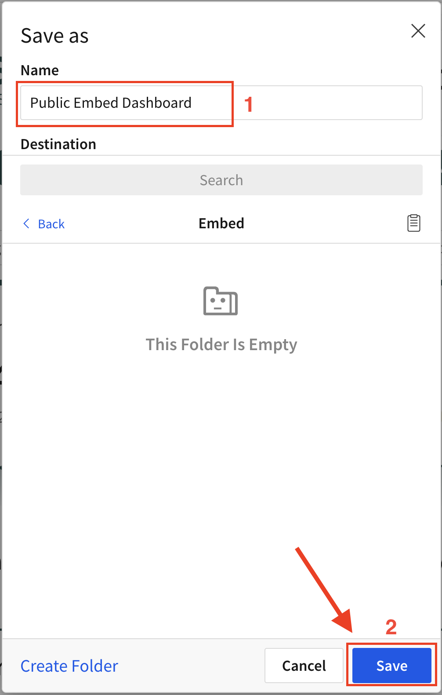

author: pballai
id: embedding_2_public_embedding
summary: How to embed Sigma in Public websites with no security
categories: Embedding
environments: web
status: Published
feedback link: https://github.com/sigmacomputing/sigmaquickstarts/issues
tags: default
lastUpdated: 2023-03-15

# Embedding 2: Public Embedding

## Overview 
Duration: 5 

This QuickStart introduces you to Sigma Public Embedding and demonstrates how to embed Sigma content in a public website. This QuickStart assumes you have already taken the QuickStart [Embedding 1: Prerequisites](https://quickstarts.sigmacomputing.com/guide/embedding_1_prerequisites/index.html?index=..%2F..index#0) so that you have a sample environment to complete the tasks in this QuickStart.
 
Public Embedding allows you to present content outside of Sigma in a controlled manner for public consumption. This is a good option if you want to display an embed on a public facing website. Access to a public embed will not allow someone to access your data deeper in Sigma without a Sigma account for your organization and proper permissions. There is support for Workbook, Page or single Viz embeds.

 ### Target Audience
Semi-technical users who will be aiding in the planning or implementation of Sigma with Embedding. No SQL or technical data skills are needed to do this QuickStart. It does assume some common computer skills like installing software, using Terminal, navigating folders and copy/paste operations.

### Prerequisites

<ul>
  <li>A computer with a current browser. It does not matter which browser you want to use.</li>
  <li>Access to your Sigma environment. A Sigma trial environment is acceptable and preferred.</li>
  <li>A working web server based on Node.js as demonstrated in the QuickStart Embedding 1: Prerequisites</li>
  <li>Some content to embed. You can embed a Workbook, Table or Visualization.</li>
  <li>Downloadable project files discussed later in this document.</li>
</ul>

<button>[Free Trial](https://www.sigmacomputing.com/free-trial/)</button>

<ul>
  <li></li>
    <li>Node.js and required Packages (all free):
        <ul>
        <li>Express</li>
        <li>Node-supervisor</li>
        <li>crypto (is now included with Node.js installation)</li>
        </ul>
    </li>
</ul>

### What You’ll Learn
The exercises in this QuickStart will discuss and walk you through the steps to embed Sigma content in a demonstration web application without security (ie: Public).


### What You’ll Build
We will embed a Sigma Dashboard inside a Node.js web application. The final result will look like this:


<aside class="negative">
<strong>NOTE:</strong><br> There are many programming languages and libraries you can use to plaintext a client and server-side application. Node.js is the one we will be using today. The plaintext today will also be highly simplified and commented to assist in your learning.
</aside>

<aside class="positive">
<strong>IMPORTANT:</strong><br> We will refer to the Node.js Express web application as the “Parent” application going forward. This is analogous to a customer’s application that Sigma would be embedded into. 
</aside>


<!-- END -->
## **Initial Steps**
Duration: 5
To create a Public embed, you will need to complete a few steps in Sigma and your Parent application. This requires implementation of client `(the index.html file)` and server-side `(the server.js file)` code. Of course, customers may just embed the iframe directly as they see fit as there is no security involved. 

This workflow provides a visual overview of the steps:


<!-- END -->

## **Content Preparation**
Duration: 5

Log into Sigma and navigate to a Workbook you want to embed. It doesn't really matter what you choose and once you have completed your first embed, this portion of the process is very straightforward regardless of embedding an entire Workbook, Page or Viz.

We will use one of the pre-built Templates that are included in the Sigma Trial but the steps are the same regardless of what you choose to work with.

After `logging into Sigma`, navigate to `Templates` and click the `Plugs Sales Sales Performance` example to open that Workbook. 


Click Dismiss to exit the on-screen help.


A Workbook must be published to create or manage embeds. Click the `Save As` button and give your Workbook any name you like. We called our Workbook `Public Embed Dashboard` and `clicked the Save button`. The Workbook is now Published. 

We could continue to make edits but they will not show up later in the Public embed until they are again Published.




Click the `caret (▼)` icon button to the right of the Workbook title in the header and select `Embedding`:


This modal displays all available Public and Application embeds. Select the `Public (0)` tab and then select `Dashboard`. This will allow us to only display the Dashboard Page in our embed.

<aside class="negative">
<strong>NOTE:</strong><br> You can choose the entire Workbook, Page or one or more Elements (Tables, Viz ect...).
</aside>

You will be presented with the required links to embed in your application. Copy both of the links and save them off to a text file. These are what you would normally provide to the Parent application developer but in this case, that is you. 


<!-- END -->

## **Parent Application Setup**
Duration: 10

This QuickStart will use a similar set of files as the Embedded Prerequisites QuickStart but with more configuration information in them to support the Public embed. 

### **Download the Project Files**
Download and unzip the project files to a suitable location of your choice that is easily accessible on your system. We placed it in a folder on the computer's desktop called `sigma_public_embed`. [The download is here.](https://sigma-quickstarts-main.s3.us-west-1.amazonaws.com/embedding/sigma_public_embed.zip) The zip file contains these two files.
 
 <ul>
      <li><strong>Index.html: </strong> the web page that contains the iframe we are embedding into</li>
      <li><strong>Server.js:</strong>  a JavaScript routine that sets up the services required and configuration of the Sigma options. We refer to this file as the Parent API.</li>
</ul>

### **Edit server.js**
`Open server.js` in a text editor and `paste the Public Link URL` you copied from Sigma as shown below, over-writing the value provided in the sample. `Save the file`. It does not matter if you close the file or not at this point.


### **Edit index.html**
`Open index.html` in a text editor and `paste the Embed Code` you copied from Sigma as shown below, over-writing the entire line with the value provided in the sample. The Embed Code is not just the URL but rather the full iframe so don't just replace the URL. `Save the file`. It does not matter if you close the file or not at this point. 


### **Start the Web Server**
You are now ready to start the Node.js Express web server. `Use Terminal` and `navigate to the Public folder`where you just modified the two files. 

Run the command from the folder where you stored the unzipped download:
```plaintext 
supervisor server.js
```

If you get an error about port 3000 being used already (not typically) you can change the port value in the server.js to use a different port.


### **Test your Web Application**
Open your browser and navigate to `http://localhost:3000`. 

Notice that we only show the Dashboard since we decided to embed only that.  

You should see the webpage with the title and the iframe embed below as show:


Changing the Parent Application embed is as easy as generating a new Public Link and Embed Code in Sigma, place those in the server.js and index.html, save the files and refresh the browser to see the results. 

<aside class="negative">
<strong>NOTE:</strong><br> Any changes you make to server.js after starting the Express server via supervisor will be automatically available but the browser page will need to be refreshed to reflect your code change.
</aside>


<!-- END -->

## Final Thoughts 
Duration: 5 
 <ul>
      <li>Public embeds are available to anyone with the embed url. </li><br><br>
      <li>Users will be able to input values into any controls you make visible on the workbook. </li><br><br>
      <li>Access to a public embed will not allow anyone to access additional data in Sigma without a Sigma account for your organization and proper on the workbook. 
      </li><br><br>
      <li>There are other QuickStarts that may be based on the configuration and content we created here. Recommend you hold onto what you have created here until you have completed all the Sigma QuickStarts you are interested in.  </li><br>
</ul>


<!-- END -->

## What we've covered
Duration: 5

In this QuickStart we learned how to how to embed Sigma into a Public facing website. 

<button>[Click to move to the next QuickStart in the Embedding Series](https://quickstarts.sigmacomputing.com/guide/embedding_3_application_embedding/index.html)</button>

**Additional Resource Links**

Be sure to check out all the latest developments at [Sigma's First Friday Feature page!](https://quickstarts.sigmacomputing.com/firstfridayfeatures/)

[Help Center Home](https://help.sigmacomputing.com)<br>
[Sigma Community](https://community.sigmacomputing.com/)<br>
[Sigma Blog](https://www.sigmacomputing.com/blog/)<br>
<br>

[](https://twitter.com/sigmacomputing)&emsp;
[](https://www.linkedin.com/company/sigmacomputing)&emsp;
[](https://www.facebook.com/sigmacomputing)


<!-- END OF WHAT WE COVERED -->
<!-- END OF QUICKSTART -->
