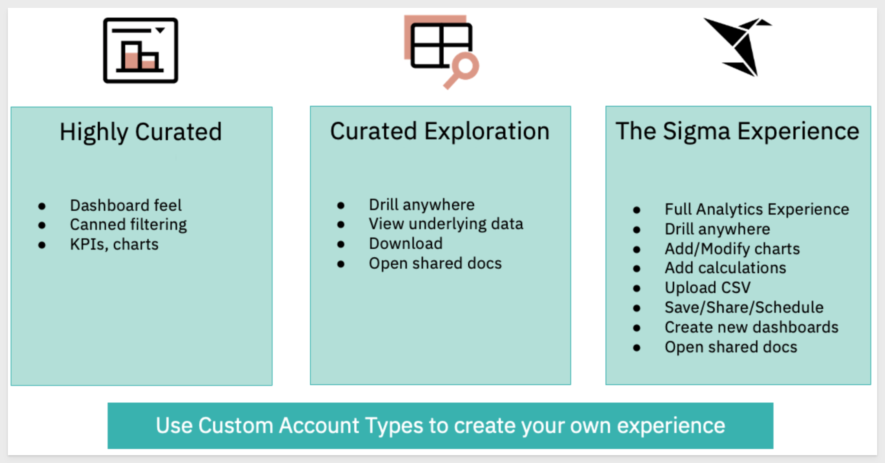
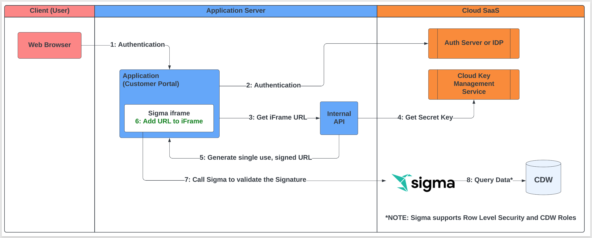
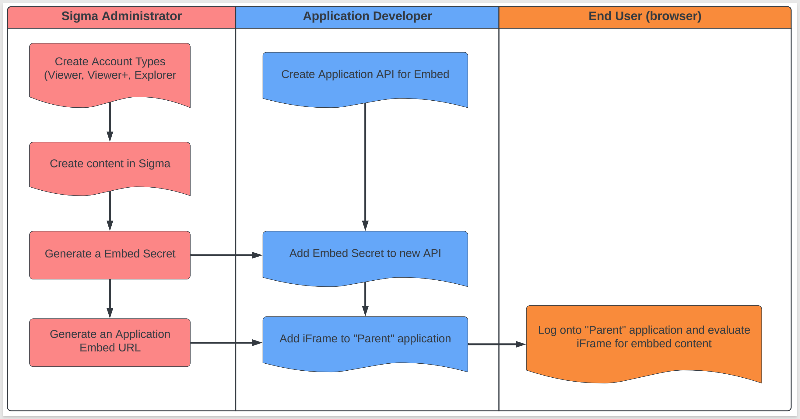

author: pballai
id: embedding_3_application_embedding
summary: How to securely embed Sigma content in an external Application.
categories: Embedding
environments: web
status: Published
feedback link: https://github.com/sigmacomputing/sigmaquickstarts/issues
tags: 

# Embedding 3: Application Embedding

## Overview 
Duration: 5 

This QuickStart introduces you to Sigma Application Embedding and demonstrates how to embed Sigma content in a public website. This QuickStart assumes you have already taken the QuickStart [Embedding 1: Prerequisites](https://quickstarts.sigmacomputing.com/guide/embedding_1_prerequisites/index.html?index=..%2F..index#0) so that you have a sample environment to complete the tasks in this QuickStart.
 
There are three “modes” that Application embedding can be operated in; View, Explore and User-backed. 

**User-backed** is by far the most popular mode as that works the the Parent application’s authentication to pass user-level permissions. WIth this method each user is treated as an individual, with an account type and team permissions. We will refer to these individuals as embed users. 

User-backed is used to implement row-level security (RLS) at the team and user level and also allow embed users to save and edit their own versions of embedded workbook

**View** and **Explore** modes are used then the user is not known by the Parent application but the embed still requires security.

The most common User-backed use-case (or experience) that our customers use are shown below. 

Sigma also allows you to extend or create custom experiences as well. We will demonstrate each of these three later in the QuickStart.

### Target Audience
Semi-technical users who will be aiding in the planning or implementation of Sigma, embedded into a secure website. No SQL or technical data skills are needed to do this QuickStart. It does assume some common computer skills like installing software, using Terminal, navigating folders and edit/copy/paste operations.

### Prerequisites
<ul>
  <li>A computer with a current browser. It does not matter which browser you want to use.</li>
  <li>Access to your Sigma environment. A Sigma trial environment is acceptable and preferred.</li>
  <li>A working web server based on Node.js as demonstrated in the QuickStart Embedding 1: Prerequisites</li>
  <li>Some content to embed. You can embed a Workbook, Table or Visualization.</li>
  <li>Downloadable project files discussed later in this document.</li>
</ul>

<button>[Free Trial](https://www.sigmacomputing.com/free-trial/)</button>

<ul>
  <li></li>
    <li>Node.js and required Packages (all free):
        <ul>
        <li>Express</li>
        <li>Node-supervisor</li>
        <li>crypto (is now included with Node.js installation)</li>
        </ul>
    </li>
</ul>
  
### What You’ll Learn
The exercises in this QuickStart will discuss and walk you through the steps to:

<ul>
  <li></li>
    <li>Embed with User-backed mode</li>
    <li>Embed with different Account Types:
        <ul>
        <li>Viewer</li>
        <li>Viewer+</li>
        <li>Explorer</li>
        </ul>
    </li>
</ul>

### What You’ll Build
We will embed Sigma content inside a Node.js web application, passing runtime parameters to configure the embed and demonstrate Account Type use-cases.

<!-- END -->

## Sigma Application Embedding
Duration: 10

Embedding is a way to securely embed your data without your users needing to authenticate through Sigma. This “authentication pass-through” is a key feature of Sigma’s embedding model and makes it fast to implement as well. 

**Application embedding is the most popular method for including Sigma content because it fully supports high security and the ability to pass parameters and more**. Passing parameters creates a personalized user experience in addition to other Sigma functionality we will explore later. 

Application embedding is made possible by the creation of a unique and encrypted embed URL pointing to the workbook, workbook page, or element you wish to display. **This URL is generated on the server side of your Parent application, accessed through an API you set up** (we will show you an example in this QuickStart), and rendered client side in an html iFrame element.

When you create the API to generate your embed URL you can specify parameters that define who the user is, what role they have (Account Type / Team membership), what they will see and how they can interact with your embedded content.

<aside class="negative">
<strong>NOTE:</strong>  If the user logging into the Parent application does not exist in Sigma, it will be created automatically in Sigma once authenticated by the Parent application. Sigma is relying on the Parent application authentication to determine user entitlements along with Account Type / Team membership in Sigma.
</aside>

With that in mind, User-backed users are assumed not to exist in Sigma’s Users list; the user information will be passed at run-time to Sigma by the Parent application. Of course, you can still have manually created Sigma users for administration purposes. This saves you time and management overhead. This does not matter to the anonymous user modes (View and Explore).

Also very important to know that each API generated URL can only be used once and if modified externally and resent, will generate an error message in the browser.

The flowchart below provides a high-level overview of how **User-backed Application embedding** works for Sigma, step-by-step. The steps for anonymous users are similar but there is no user authentication passed from the Parent application. 

To embed, you will need to complete a few steps in Sigma and your Parent application. This requires implementation of client and server-side code. The workflow below demonstrates the minimum steps involved so that you may see the process all at once before we do each step.

<aside class="negative">
<strong>NOTE:</strong>  This is very high-level and does not include the fine points involved. These fine points will be covered in each use-case.
</aside>

<aside class="postive">
<strong>IMPORTANT:</strong> To create the embed you will use a Sigma embed secret, custom session times, and a server side generated embed URL. Only organization Admins can generate application embed links.
</aside>

<!-- END -->

## Administrator Steps
Duration: 5

Stopped here phil

<!-- END -->

## What we've covered
Duration: 5

In this QuickStart we learned how to.........

INSERT FINAL IMAGE OF BUILD IF APPROPRIATE

**Additional Resource Links**

[Help Center Home](https://help.sigmacomputing.com/hc/en-us) 
[Sigma Community](https://community.sigmacomputing.com/) 
[Sigma Blog](https://www.sigmacomputing.com/blog/) 
 

&emsp;

<!-- END -->
<!-- END OF QUICKSTART -->