author: pballai
id: embedding_3_application_embedding
summary: How to securely embed Sigma content in an external Application.
categories: Embedding
environments: web
status: Published
feedback link: https://github.com/sigmacomputing/sigmaquickstarts/issues
tags: default
lastUpdated: 2023-05-18

# Embedding 3: Secure Embedding

## Overview 
Duration: 5 


This QuickStart introduces you to Sigma Secure Embedding and demonstrates how to embed Sigma content in a external website.
 
This QuickStart assumes you have already taken the QuickStart [Embedding 1: Prerequisites](https://quickstarts.sigmacomputing.com/guide/embedding_1_prerequisites/index.html?index=..%2F..index#0) so that you have a sample environment to complete the tasks in this QuickStart.
 
There are three “modes” that Application embedding can be operated in; View, Explore and User-backed. 

**User-backed** is by far the most popular mode as that works the Parent application’s authentication to pass user-level permissions. WIth this method each user is treated as an individual, with an account type and team permissions. We will refer to these individuals as embed users. 

User-backed is used to implement row-level security (RLS) at the team and user level and also allow embed users to save and edit their own versions of embedded workbook

**View** and **Explore** modes are used then the user is not known by the Parent application but the embed still requires security.

The most common User-backed use-case (or experience) that our customers use are shown below. 


Sigma also allows you to extend or create custom experiences as well. We will demonstrate each of these three later in the QuickStart.

### Target Audience
Semi-technical users who will be aiding in the planning or implementation of Sigma, embedded into a secure website. No SQL or technical data skills are needed to do this QuickStart. It does assume some common computer skills like installing software, using Terminal, navigating folders and edit/copy/paste operations.

### Prerequisites
<ul>
  <li>A computer with a current browser. It does not matter which browser you want to use.</li>
  <li>Access to your Sigma environment. A Sigma trial environment is acceptable and preferred.</li>
  <li>A working web server based on Node.js as demonstrated in the QuickStart Embedding 1: Prerequisites</li>
  <li>Some content to embed. You can embed a Workbook, Table or Visualization.</li>
  <li>Downloadable project files discussed later in this document.</li>
</ul>

<button>[Free Trial](https://www.sigmacomputing.com/free-trial/)</button>

<ul>
  <li></li>
    <li>Node.js and required Packages (all free):
        <ul>
        <li>Express</li>
        <li>Node-supervisor</li>
        <li>crypto (is now included with Node.js installation)</li>
        </ul>
    </li>
</ul>
  
### What You’ll Learn
The exercises in this QuickStart will discuss and walk you through the steps to:

<ul>
  <li></li>
    <li>Embed with User-backed mode</li>
    <li>Embed with different Account Types:
        <ul>
        <li>Viewer</li>
        <li>Viewer+</li>
        <li>Explorer</li>
        </ul>
    </li>
</ul>

### What You’ll Build
We will embed Sigma content inside a Node.js web application, passing runtime parameters to configure the embed and demonstrate Account Type use-cases.


<!-- END -->


## Sigma Application Embedding
Duration: 5

Embedding is a way to securely embed your data without your users needing to authenticate through Sigma. This “authentication pass-through” is a key feature of Sigma’s embedding model and makes it fast to implement as well. 

**Application embedding is the most popular method for including Sigma content because it fully supports high security and the ability to pass parameters and more**. Passing parameters creates a personalized user experience in addition to other Sigma functionality we will explore later. 

Application embedding is made possible by the creation of a unique and encrypted embed URL pointing to the workbook, workbook page, or element you wish to display. **This URL is generated on the server side of your Parent application, accessed through an API you set up** (we will show you an example in this QuickStart), and rendered client side in an html iFrame element.

When you create the API to generate your embed URL you can specify parameters that define who the user is, what role they have (Account Type / Team membership), what they will see and how they can interact with your embedded content.

<aside class="negative">
<strong>NOTE:</strong><br> If the user logging into the Parent application does not exist in Sigma, it will be created automatically in Sigma once authenticated by the Parent application. Sigma is relying on the Parent application authentication to determine user entitlements along with Account Type / Team membership in Sigma.
</aside>

With that in mind, User-backed users are assumed not to exist in Sigma’s Users list; the user information will be passed at run-time to Sigma by the Parent application. Of course, you can still have manually created Sigma users for administration purposes. This saves you time and management overhead. This does not matter to the anonymous user modes (View and Explore).

Also very important to know that each API generated URL can only be used once and if modified externally and resent, will generate an error message in the browser.

The flowchart below provides a high-level overview of how **User-backed Application embedding** works for Sigma, step-by-step. The steps for anonymous users are similar but there is no user authentication passed from the Parent application. 

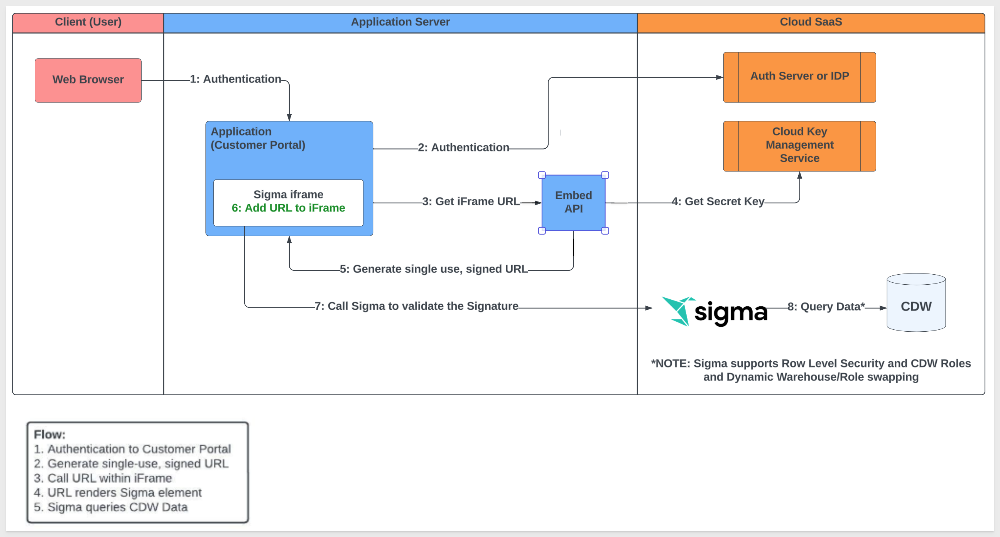

To embed, you will need to complete a few steps in Sigma and your Parent application. This requires implementation of client and server-side code. The workflow below demonstrates the minimum steps involved so that you may see the process all at once before we do each step.

<aside class="negative">
<strong>NOTE:</strong><br> This is very high-level and does not include the fine points involved. These fine points will be covered in each use-case.
</aside>


<aside class="postive">
<strong>IMPORTANT:</strong><br>To create the embed you will use a Sigma embed secret, custom session times, and a server side generated embed URL. Only organization Admins can generate application embed links.
</aside>


<!-- END -->

## Administrator Steps
Duration: 5

Before we can work on the content we need to provision `Account Types`, `Teams` and `Workspaces` in Sigma for our QuickStart. This will allow us to group users and set various permissions. 

Log into Sigma (as an Administrative user). 

Sigma is very flexible, at a high level the following describes the permission hierarchy:

**User Account Types:** A user's account type determines their highest level of interaction with data and content in Sigma. Each user is assigned a single account type; they can only be assigned one account type at a time. More information can be found here: [User Account Types](https://help.sigmacomputing.com/docs/user-account-types)

**Teams:** allows for organized management of user groups. To view and interact with User-backed embedded workbooks, a user must be assigned to at least one team in your organization. Users can be members of more than one Team. Data source permissions can be granted to entire teams. This option is also available for folders and documents. For team members or individual users to save and edit versions of embedded workbooks, they must have Contribute access to a workspace. More information can be found here: [Teams](https://help.sigmacomputing.com/docs/manage-teams)

**Workspaces:** allows folders and documents to be compartmentalized, categorized, and easily shared with the correct people. They can be shared amongst users and teams via permission grants. Workspaces are managed by organization admins. Admins also have access to an additional `ALL WORKSPACES` tab. More information about can be found here: [Workspaces](https://help.sigmacomputing.com/docs/manage-workspaces)

### Account Types:
We will use Account Types to allow different users different rights as we go through the use-cases. Sigma provides a few default types and we create two additional. Navigate to Administration / Account Types.

The **Viewer Account Type** already exists so we will just use that as is. Here are the settings:
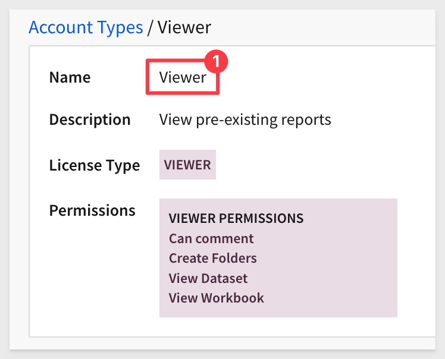

Create a new Account Type called `Viewer+` and set it as follows:


Create another new Account Type called “Explorer” and set it as follows:
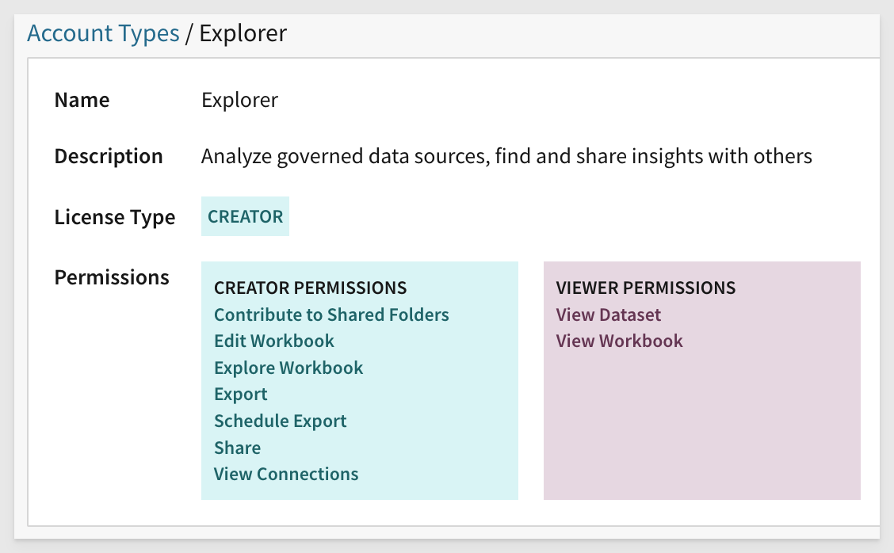

When done your Account Types should look like:
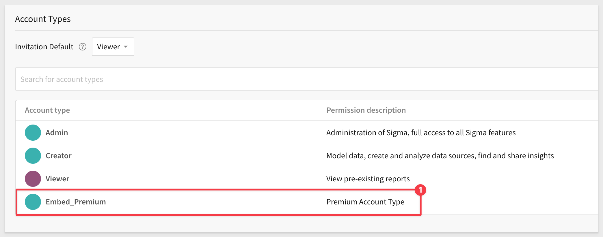

### Teams:
Navigate to the `Administration` `Teams` page and use the `Create Team` button to add two new Teams. **Tick the checkbox to also create a Workspace.** We will use this later to share user created content directly from the Embed.

We will call our teams `FinanceViewers` and `FinanceCreators`.

<aside class="negative">
<strong>NOTE:</strong><br> Avoid using spaces / special characters in Team names which could cause code errors depending on your development framework.
</aside>


<aside class="negative">
<strong>NOTE:</strong><br> When creating a new Team, there is a checkbox to "Create a Workspace associated with this Team". It is off by default but check it on and Sigma will create a matching Workspace automatically for you. You can also just create the Workspace manually if you prefer.
</aside>

Exiting Administration (upper left corner Sigma Back Button or click the papercrane icon) you can click on the `Workspaces` menu item and see that this also created a Workspace for each Team. This is useful when we later want to save the default Workbook as a copy, make changes and share with the rest of the Team. This functionality provides a lot of flexibility in how your users access shared work. 


<aside class="negative">
<strong>NOTE:</strong><br> Notice that we have not added any users, Sigma will do that automatically when the Embed tries to load content via the API. 
</aside>

From the `Workspaces menu`, click the "hamburger menu" (the 3-dots) to the right of the `FinanceViewers` Team. 

Select `Share`:

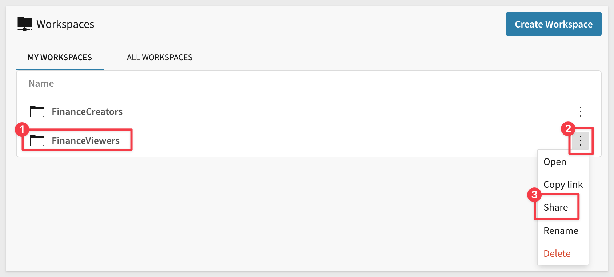

 Use the search feature to locate and add add `FinanceCreators (Team)`, setting the permission to `Can Contribute`. This will allow members of the FinanceCreators Team to share data to this Workspace.


<!-- END -->

## Create a Shared Dataset
Duration: 5

In this step we are logged into Sigma as Administrator and will create a curated set of data that we will expose to others via their Account Team later. 

To leverage the features in User-backed embedding you must grant permissions to your data. Creating a Dataset and setting permissions on it is considered best practice.

From Sigma / `Home` click the `+` Create New button and click `Dataset`:


We will use Table from the options; click Select under Table:


We will use sample data as in other QuickStarts as below. You must first select a `Connection`. Use the Sigma Sample Database provided and then use the `PLUGS_ELECTRONICS_HANDS_ON_LAB` table as shown:


Once you have selected the table it will show it and then you can click the `Get Started` button:


Change the name of the new Dataset to `Application Embedding` by just double-clicking over the existing name. Then click `Publish`.


Click the caret (▼) to the right of the Dataset name. We will want to save this Dataset in a place we can easily find it later. `Create a Workspace` folder called `Datasets` to save this one in. Click Move after you have navigated to where you want to save the Dataset. 

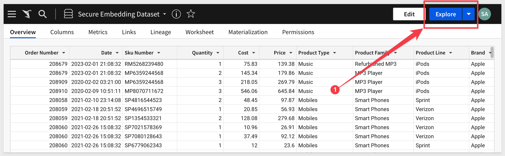

We now have a Dataset but users have no ability to view them yet. We can consider this our data library and we can decide who else can work with each Dataset. We will share the “Application Embedding” Dataset.

Click `Permissions` and the `Add Permission` button. Add permission for the Finance Teams as below. Since users will be coming in with different Account Types, adjusted at runtime, we will `use View rights` for now. 

Uncheck the send email checkbox. Click `Save`. Click `Publish` (if it was not already Published).


You now have a Dataset that is available to users in our Application embeds, on the Finance Team.


<!-- END -->

## Create a Workbook
Duration: 5

From Sigma / Home click the + Create New button and click `Workbook` and add a Table to it. We called ours `Application Embedding`. 

Select `Tables and Datasets`. You will have to use the navigation in the modal, click back and find the location where you saved the Dataset. Choose your Dataset and click the Select button:

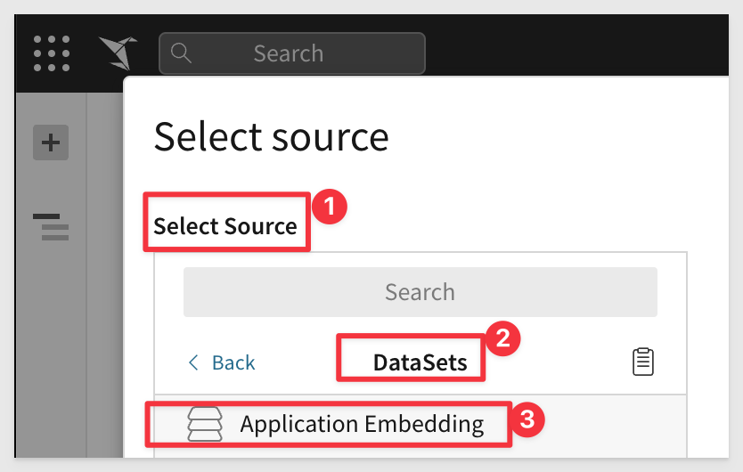

`Click Publish`. **A Workbook must be published to create or manage embeds.**

The Workbook is now ready for Application embedding. The Workbook looks like this:

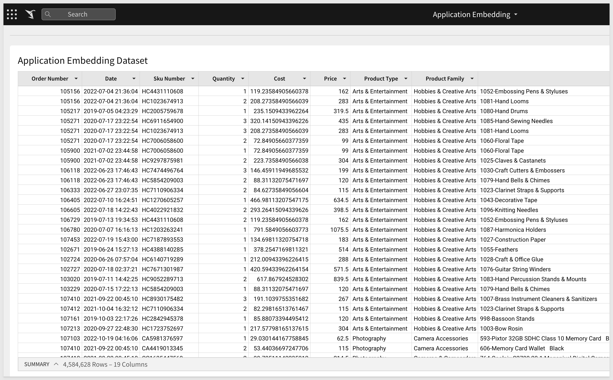

Share the workbook with the Finance Teams. Click the caret (▼) icon button to the right of the workbook title in the header and click Share. Untick the send email checkbox and click Save. 

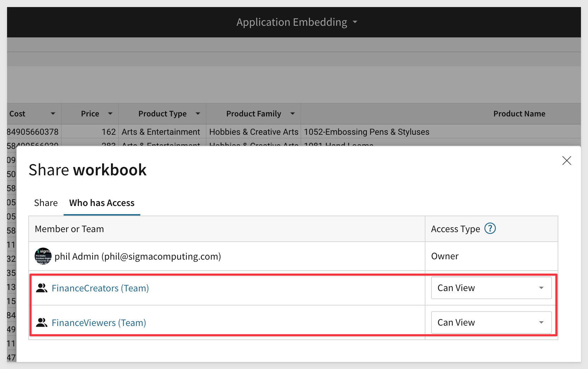

We are now ready to work on the first Application embedding use case.


<!-- END -->

## Embed Secrets and Links
Duration: 5

We will create the Embedding information that we will pass to the developer of the Parent application (in this case the developer is us but not always).

### Enable Application Embedding

Application Embedding is a premium feature of Sigma, but while in a trial account, we can use it for free.

In Sigma, navigate to `Administration` > `Account`. 

Under the group `Embedding` we can see that Application Embedding has not been added.


Click the `Add` button to add the feature. Once enabled, a checkmark will appear and buttons for `Revoke` and `Manage` will appear:


Click `Manage` and then `Enable` in the pop-up.

Click `Copy` to copy the Secret to the clipboard. Close the popup.

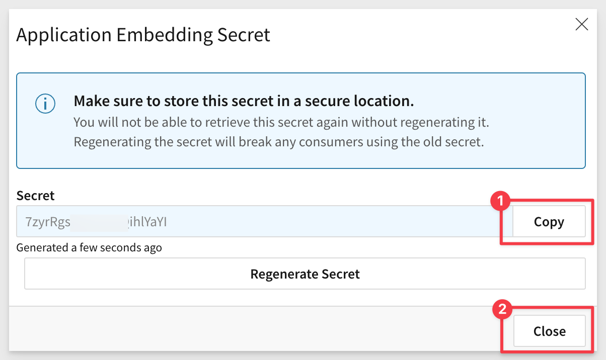

Paste the Secret into a known safe location. We can use this single secret for all embeds, but instead we will create a secret for each embed we want to allow. This option is there for you to decide how you want to manage your embed security.

**You cannot look up your organizations existing embed secret after it has been created.** If you lose your embed secret, you can generate a new one. In this case your existing embeds will be rendered invalid until the API is updated with the new secret.

### Generate Dashboard Embed Secret
We will now create a secret that is specific to our Dashboard embed. This secret will be used server-side and encrypted in your embed URLs to ensure your application embed URLs are valid at run-time.

**1:** Navigate to `Administration` > `APIs & Embed Secrets`:

**2:** Click `Create New`, located in the page's top right corner. This will open the Create New API Token or Embed Secret modal:


**3:** Under `API Token or Embed Secret` select `Embed Secret`.

**4:** Enter a Name and Description as you see fit.

**5:** Under Owner, select an organization member with the account type you would like to associate with the embed secret. For now, just select yourself.

**6:** Click Create:


**7:** Copy the provided `ClientID` and `Secret` and store them.


**8:** Click Close

### Generate Embed Links
Return to our Workbook.

Click the caret (▼) icon button to the right of the workbook title in the header.

Click `Embedding` to open the Application tab.

Under `Generate Application Embed Path` for, select your embed target. We selected the Entire Workbook.


The embed path will automatically be generated. `Click Copy` to copy this path. Save this off to a text file for later use. Close the modal.


<!-- END -->
## Parent Application Setup
Duration: 10
Download and unzip the project file to a suitable location of your choice that is easily accessible on your system. We placed it in a folder on the computer's desktop called sigma_embedding_viewer.

[Click here to download sigma_application_embed.zip](https://sigma-quickstarts-main.s3.us-west-1.amazonaws.com/embedding/sigma_application_embed.zip)

The zip file contains these two files:

**Index.html:** the web page that contains the iFrame we are embedding into. No changes are required for this file.<br><br>
**Server.js:** a JavaScript routine that sets up the services required and configuration of the Sigma options. We refer to this file as the Parent API.

### Edit server.js
Open server.js in a text editor and review all the comments (lines starting with “//”). This will give you an understanding of the minimum required parameters to pass to make Embedding work. We will pass more in later sections so it is good to get familiar now. 

We have organized the file into sections that have “Required to Change”, “Optional to Change” and “Don’t Change” values.  We will show the entire file for completeness.

**Section 1:**<br>
All required values, nothing to change.


**Section 2:**<br>
`Lines 2A-2H` will need to be changed to match values for your embed. 

**Read the comments for each item in server.js and it will be clear what the required values are.**

For example notice item 2A’s EMBED_PATH value is what was generated for my Workbook embed. Also notice that we are using the Finance Team that we created earlier.

The email address and external userID would normally be passed by the Parent Application at runtime after user login but since our Parent application code is hard coded, we will use a unique email for the three Account Types. This matters because when a Creator shares content, the content is owned by the Creator. If you just try to cheat here and use the same email for all three, you will find Viewers have elevated permission in content shared by the Creator. 

We want to avoid that in the QuickStart although it is not likely to happen in the real world. It is helpful to understand how things can go awry.

Here are the email addresses we used. You can use the same or make up your own:
```plaintext
embed_viewer@sigmacomputing.com = Viewer
embed_viewer+@sigmacomputing.com = Viewer+
embed_creator@sigmacomputing.com = Creator
```

<aside class="negative">
<strong>NOTE:</strong><br> Take care when pasting values into your server.js to not remove any required syntax, add any spaces etcetera. A leading space in server.js (for example an email address) will throw an error on page load.
</aside>

We have provided inline comments to guide you through.


**Section 3:**<br>
All required values, nothing to change in this use case. 


### Start the Web Server
You are now ready to start the Node.js Express web server. Use Terminal and navigate to the Public folder where you just modified the two files. 

**Run the command from the folder where you stored the unzipped download:**
```plaintext
supervisor server.js
```
If you get an error about port 3000 being used already (not typically) you can change the port value in the server.js to use a different port. That is configured in server.js on `line 3H`.


### Additional Information - Optional Reading
This provides a little more information about each numbered step of server.js. The sample file has some in-line comments but we did not want to overly clutter the file with long text descriptions. If you are satisfied with your understanding of server.js already, you may skip this section. 


**SECTION 1:**<br>
This section sets up an Express web server and a route handler for GET requests.

For more information on the Express webserver, [click here](https://expressjs.com/)

**1A:**<br>
The Express package for Node.js is imported.

**1B:**<br> 
A route is defined to handle GET requests to the base URL ('/'). When a request is made to this URL, the server responds by sending the file 'index.html' located in the current directory.

**1C:**<br> 
Another route is defined to handle GET requests to the URL '/api/foo'. This route will trigger the function 'foo' when accessed.

**1D:**<br> 
The function 'foo' is defined. This function will be called when a GET request is made to '/api/foo'.

**1E:**<br> 
The Node.js "crypto" module is imported. The crypto module is a core module in Node.js, meaning it is included with Node.js and does not need to be installed separately. It provides cryptographic functionalities that include a set of wrappers for OpenSSL's hash, HMAC, cipher, decipher, sign, and verify functions.

**1F:**<br> 
A unique identifier (nonce) is created using the 'randomUUID' function from the 'crypto' module. The crypto.randomUUID() function is used to generate a version 4 random UUID (Universally Unique Identifier). A UUID is a 128-bit number used to uniquely identify some object or entity on the Internet. In this case, it's being used to generate a nonce, or "number used once", which is a unique, random value meant to be used for a single operation, often to prevent replay attacks.

**1G:**<br> 
A search parameter string is initialized with the nonce.


**SECTION 2:**<br>
This section contains user-specific variables that need to be updated by the user.

**2A:**<br>
The path for the Sigma embed is set.

**2B:**<br>
The secret key for the Sigma embed is set.

**2C:**<br> 
The client_id parameter is added to the search parameters string.

**2D:**<br>
The email parameter is added to the search parameters string. This should be the email of the authenticated user in the parent application.

**2E:**<br>
The external_user_id parameter is added to the search parameters string. This should be the user ID of the authenticated user in the parent application.

**2F:**<br>
The external_user_team parameter is added to the search parameters string. The content must be shared with this team for the request to work.

**2G:**<br> 
The account_type parameter is added to the search parameters string. This specifies the account type of the user, which must exist in Sigma first.


**SECTION 3:**<br>
This section constructs the final URL that will be sent.

**3A:**<br>
The mode parameter is added to the search parameters string. This will always be 'userbacked' for application embedding.

**3B:**<br> 
The session_length parameter is added to the search parameters string. This is the number of seconds the user should be allowed to view the embed before logging out.

**3C:**<br> 
The time parameter is added to the search parameters string. This is the current time in Unix timestamp format.

**3D:**<br>
The final URL with all the search parameters is constructed.

**3E:**<br>
Here, the crypto module is used to create an HMAC, or Hash-Based Message Authentication Code. This is a type of message authentication code (MAC) involving a cryptographic hash function and a secret cryptographic key. It's used to verify both the data integrity and the authenticity of a message.

Broken down into individual parts:

`crypto.createHmac('sha256', Buffer.from(EMBED_SECRET, 'utf8'))`<br>
This line of code is creating the HMAC object. 

The "sha256" is the specific type of hash function used, and `EMBED_SECRET` is the secret key. `Buffer.from(EMBED_SECRET, 'utf8')` is converting the secret key from a string to a buffer, which is the type of data the `createHmac` function expects.

`.update(Buffer.from(URL_WITH_SEARCH_PARAMS, 'utf8'))`<br>
This is updating the HMAC object with the data that you want to create a hash of, which is `URL_WITH_SEARCH_PARAMS` in this case. The data is converted from a string to a buffer because that's what the `update` function expects.

`.digest('hex')`<br>
This is generating the actual hash and returns it as a hexadecimal string. The "hex" argument specifies the output format of the hash.

In summary, what this line of code is doing is it's creating a cryptographic hash of the URL parameters using a secret key. The hash is unique to the specific URL parameters and secret key. **Any slight change in either the URL parameters or the secret key would result in a completely different hash.** 

This hash (or "signature") is then added to the URL parameters as a way to verify that the parameters haven't been tampered with. When the server receives the URL, it can generate its own hash of the parameters using the secret key and compare it to the signature in the URL. 

If they match, then it knows the URL parameters are authentic and haven't been tampered with. If they don't match, then it knows something is wrong and can reject the request.

For more information on crypto with HMAC, [click here](https://nodejs.org/api/crypto.html#cryptocreatehmacalgorithm-key-options)

**3F:**<br>
The final URL is constructed by combining the URL from 3D and the signature from 3E.

**3G:**<br>
The final URL is sent as a response to the GET request.

**3H:**<br>
The Express application is set to listen for requests on port 3000.


<!-- END -->
## Test the Embed
Duration: 5

Open your browser and navigate to:
```plaintext
 http://localhost:3000
```
 
You should see the webpage with the Title and the iframe embed below as shown. Notice that Page Controls are available on the Dashboard tab. 

The red arrows point to functionality that is allowed to the Account Type we passed in the API, in this case, Viewer. This is very limited but very useful for static dashboards and reports.


We can do only a limited number of things to the Table like sort columns and refresh the data. If we click the folder link shown below, we see that this is the only document you currently have access to and you cannot save a copy. As a Viewer, the page will always look the same to you on each visit. 

Clink in the menu in the lower left corner and expand the `Workspace folder`. Because we shared the Finance Workspace earlier with the team members, the Viewer has access to it. It is empty for now.


Notice that there is a new user in Sigma, `Administration`, `People` now as an “Embed User” with the email we set and Viewer Account Type. This was automatically added by the API on first successful access of the Parent application.

<aside class="postive">
<strong>IMPORTANT:</strong><br> Embed User types will not be able to login to Sigma directly. 
</aside>


<!-- END -->

## Debugging Issues
Duration: 10

So that you are generally familiar with how you might debug the problem **we will make an intentional error** in our server.js file, see the error and use common web inspection tools to evaluate the request URL that was passed to Sigma. 

This is not the only method; just an example you can use if you have an issue in the Embedding QuickStarts. 

If you are already experienced in web debugging you can skip this section. 

Remove the last value from the ClientID in section 2C. In this case we removed the trailing `2`. 

Save the file.

Browse to the site again at:
```plaintext
http://localhost:3000
```
You will see an error message:


<aside class="negative">
<strong>NOTE:</strong><br> Error messages may be different depending on the source of the issue.
</aside>

Open your web browser inspector. How to do that varies between browsers so we will demonstrate using Google Chrome. 

`Hit F12` on your keyboard. This will bring up Chrome’s Inspection tool.

Click the Elements tab and look for the node `iframe id`, It will be in under the body section as shown below and you may have to click the arrows to expand the body node. Note that you can now see the “src” url and as you hover over it, you can see the entire url. 


Right click on the url and click `copy link address`.

Paste the url in a text editor. You can also separate each parameter for readability as I have below. In this case, I did not paste the last digit of the ClientID:

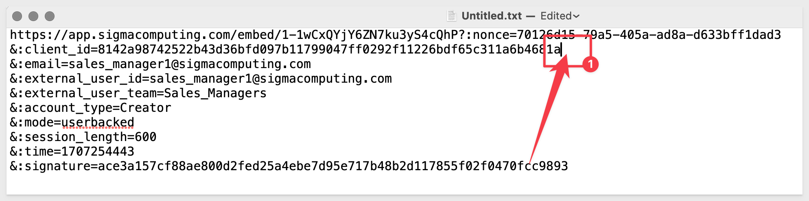

Go ahead and fix the ClientID in server.js and save. Check to make sure your embed works again. 

**But wait, you now can use inspector to grab any Sigma embed url and just use that access the embed right? Let’s test that assumption.**

With your page working, open Inspector and copy the link url again. This time paste it into a new webpage and hit return. 

Notice the error? 


URL snooping and reuse is not possible.


<!-- END -->

## Viewer+ Use Case
Duration: 5

We are ready to start working on the second use case, reusing the same content but accessing it with the high level Account Type (Viewer+) we created earlier. We will start moving faster now that you are familiar with the Sigma workflows. 

Recall that earlier we shared the Workbook and Dataset with everyone on the Finance Team so now we just want to give users slightly more functionality using the Viewer+ Account Type. 

All we need to do is pass the Viewer+ Account Type to Sigma for the user and the additional functionality afforded to that role is unlocked. 

`Open server.js` and change the values for:

**Section 2F:**
```plaintext
searchParams += '&:external_user_id=embed_viewer+@sigmacomputing.com';
```
**Section 2H:**
```plaintext
searchParams += '&:account_type=Viewer+';
```

Refresh your webpage. 

You will see some additional options available now based on our Account Type settings. For example, the user can send a copy of the Workbook in email and they can also download the data (limited to 1M rows).

This user can also see the Finance Workspace being a member of the Finance Team still:


<!-- END -->

## Creator Use Case
Duration: 10

We are ready to start working on the third use case, reusing the same content but accessing it with the high level Account Type `Creator` we created earlier. 

Open server.js and change the values for section account_type to creator (2H)

Change the values for email (2E):
```plaintext
searchParams += '&:email=embed_creator@sigmacomputing.com';
```

Change the value of external_userID (2F):
```plaintext
searchParams += '&:external_user_id=embed_creator@sigmacomputing.com';
```

Change the value of external_user_team (2G):
```plaintext
searchParams += '&:external_user_team=FinanceCreators';
```

Change the value of account_type (2H):
```plaintext
searchParams += '&:account_type=Creator';
```


Refresh your webpage. 

You are now looking at the fixed Workbook that will always look this way (or until someone with the rights to change it using the Sigma portal does so). 

The big addition here is the Save As button as shown below. This allows the Creator to make a copy, change it and share it with others.


`Click the Save As` button and use the modal to navigate to the `FinanceViewers folder`. Give the new Workbook a name. We called ours `Working Copy for Finance (by Creator)` to be obvious later and click `Save`.


The new Workbook is opened in the Embed window. It looks a little different and there is an `Edit button in the lower left corner`. Click that.

You are now able to Edit (as Creator) just as if you were working in Sigma’s portal. Any changes you publish will be available to anyone who has access to the Finance Workspace.

Let's make some changes.

Add a visualization that suits you. We added a pie chart showing sales by Region. It doesn't really matter, just make some changes that are obvious. 

<aside class="negative">
<strong>NOTE:</strong><br> Take care when selecting the source data for the new Viz. You want to use the data that is on this page and so that the experience is consistent as you add functionality. To do that, select the dataset from “Page Elements” as below:
</aside>


We also added a Title to our Workbook:


Click Save/Publish.

### Let's Switch Users in Real Time
Now change the 4 values in server.js to use the Viewer type, save that change. You may have to review earlier sections of the QuickStart if you have issues doing this:


Refresh your browser page. 

Notice that even though you were just working on the new Finance page as `Creator`, you are now back to the initial Workbook as `Viewer`.


Open the Workspace menu and navigate to the Finance Workspace. You should see the new Workbook that the Creator saved there for users to access. Click to open that and see new shared content:


<!-- END -->

## People (user) Accounts
Duration: 5

It is important to understand that there are several ways for users to obtain access to Sigma content based on use case. They are:

<ul>
  <li></li>
    <li><strong>Provisioned at Activation by Sigma:</strong>
        <ul>
        <li>Only for the initial Administrative account</li>
        <li>There must be at least one Admin user</li>
        <li>Sigma does not provision other users on behalf of customers</li>
        </ul>
    </li>
    <li><strong>Manually created by Admin in Sigma portal:</strong>
        <ul>
        <li>These are termed “portal users” and appear by name in the Sigma portal </li>
        </ul>
    </li>  
    <li><strong>Manually or Automatically created via Sigma Public API:</strong>
        <ul>
        <li>These are termed “portal users” and appear by name in the Sigma portal </li>
        </ul>
    </li>  
    <li><strong>Automatically created through Embed integration:</strong>
        <ul>
        <li>These are termed “Embed User” in the Sigma portal</li>
        <li>When the user is no longer granted access to the Parent application (through whatever authentication mechanism the customer is using), Sigma still has a record of that user and they are not automatically deactivated. It is up to the customer to decide if Sigma deactivation is necessary or not. Embed users who remain active have no ability to log into Sigma portal directly because they are not “regular” Sigma user accounts but rather “Embed User” accounts. </li>
        </ul>
    </li>        
</ul>

**Regardless of how the user was registered, they cannot be fully deleted.** 

Users (from the list above type 1-3) can be deactivated by a Sigma Admin or via the Sigma API at any time. 

When deactivating a user who owns some content (they created it) the Admin will be prompted by the Sigma portal to reassign ownership of said content to another user of their choice. This old content will be automatically stored in the new users My Documents / Archived Users folder. 

This is an important consideration when embedding content that was created by an account who later leaves the company, and their account is deactivated. 

### Final Thoughts
There are other QuickStarts that may be based on the configuration and content we created here. Recommend you hold onto what you have created here until you have completed all the Embedding QuickStarts you are interested in. 


<!-- END -->

## What we've covered
Duration: 5

We embedded Sigma content inside a Node.js web application, passing runtime parameters to configure the embed and demonstrate Account Type use-cases.

**Additional Resource Links**

Be sure to check out all the latest developments at [Sigma's First Friday Feature page!](https://quickstarts.sigmacomputing.com/firstfridayfeatures/)

[Help Center Home](https://help.sigmacomputing.com)<br>
[Sigma Community](https://community.sigmacomputing.com/)<br>
[Sigma Blog](https://www.sigmacomputing.com/blog/)<br>
<br>

[](https://twitter.com/sigmacomputing)&emsp;
[](https://www.linkedin.com/company/sigmacomputing)&emsp;
[](https://www.facebook.com/sigmacomputing)


<!-- END -->
<!-- END OF QUICKSTART -->
