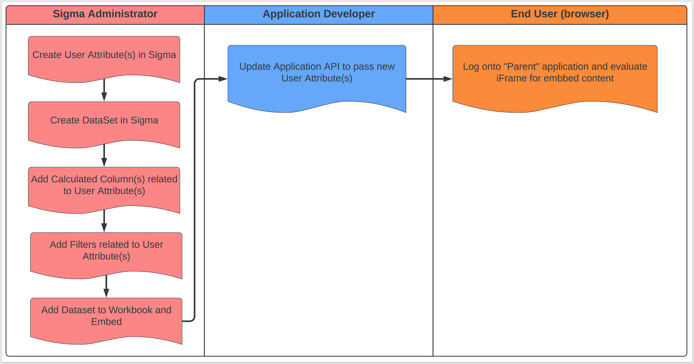
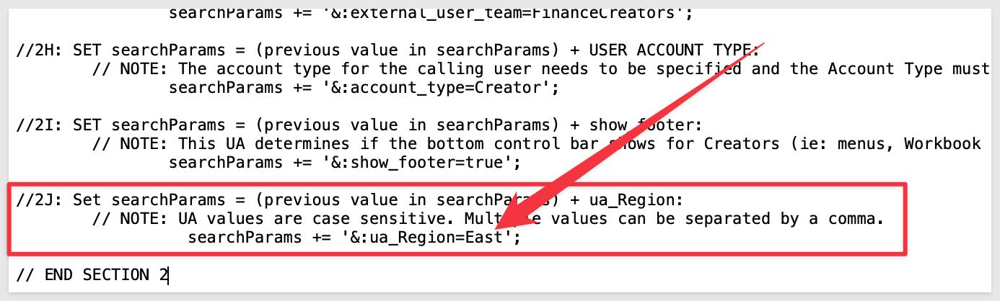
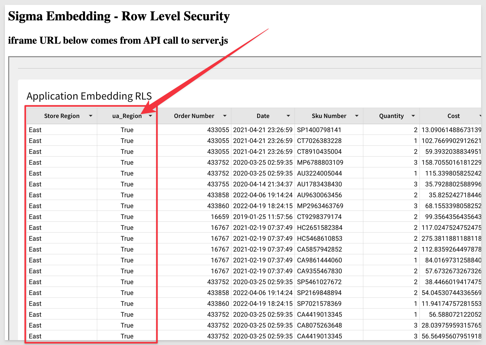
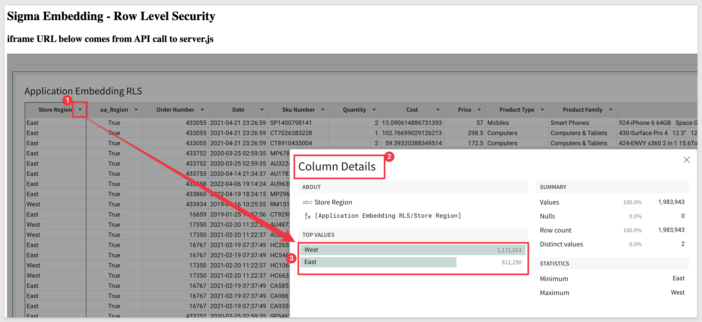
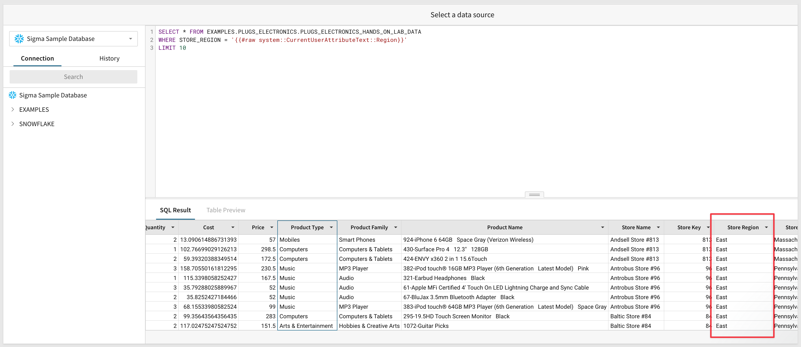
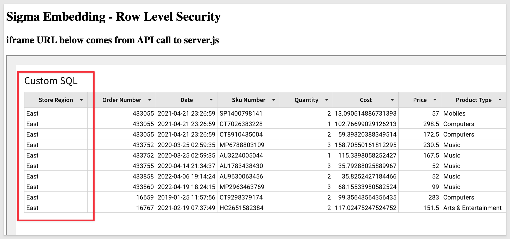
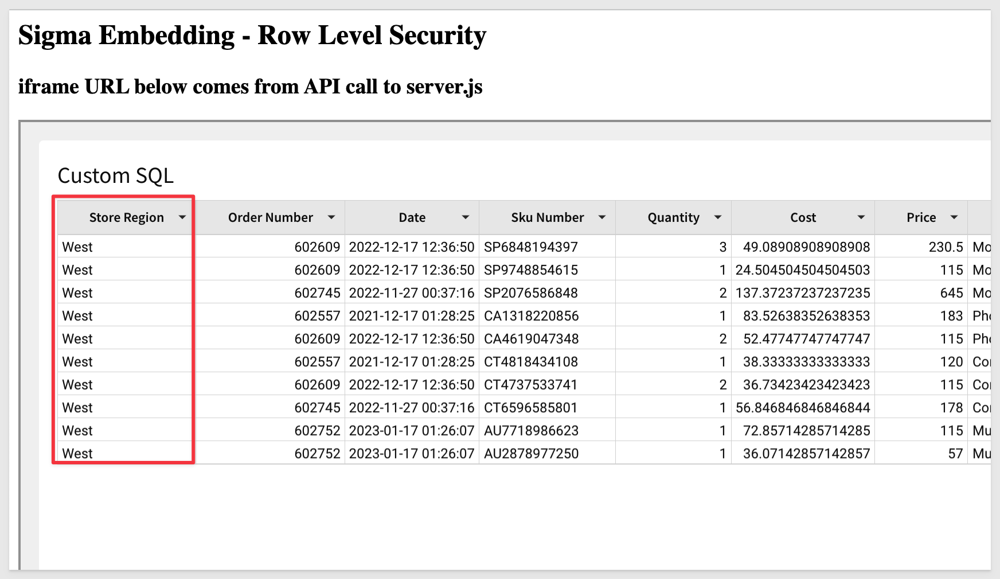

author: pballai
id: embedding_4_row_level_security
summary: TApplication Embedding with Row Level Security using User Attributes
categories: Embedding
environments: web
status: Published
feedback link: https://github.com/sigmacomputing/sigmaquickstarts/issues
tags: Getting Started, Analytics, Data Engineering, BI, Business Intelligence, Sigma, Sigma Computing, Snowflake, Dashboarding, Visualization, Analysis, Excel, Spreadsheet, Embedding

# Embedding 4: Application Row Level Security

## Overview 
Duration: 5 

This QuickStart introduces you to Sigma embedding using Row-Level Security **(RLS)** to personalize / limit the data exposed to a user based on values passed to Sigma at runtime. This QuickStart assumes you have already taken the QuickStart [Embedding 1: Prerequisites](https://quickstarts.sigmacomputing.com/guide/embedding_3_application_embedding/index.html) so that you have a sample environment to complete the tasks in this QuickStart.

We also recommend you table the the QuickStart [Embedding 3: Application Embedding](https://quickstarts.sigmacomputing.com/guide/embedding_1_prerequisites/index.html?index=..%2F..index#0) as we will build on that content. 

**Some steps may not be shown in detail as we assume you have taken these other two QuickStarts or are familiar with Sigma workflows.**

RLS is a method for restricting data access based on user identity or characteristics. Sigma supports RLS in a few different ways but the vast majority of Sigma customers use RLS with User Attributes at the Dataset level. This QuickStart will cover how to implement RLS Dataset with User Attributes.

### Target Audience
Semi-technical users who will be aiding in the planning or implementation of Sigma. Limited SQL and technical data skills are needed to do this QuickStart. It does assume some common computer skills like installing software, using Terminal, navigating folders and edit/copy/paste operations.

### Prerequisites

<ul>
  <li>A computer with a current browser. It does not matter which browser you want to use.</li>
  <li>Access to your Sigma environment. A Sigma trial environment is acceptable and preferred.</li>
  <li>A working web server based on Node.js as demonstrated in the QuickStart Embedding 1: Prerequisites</li>
  <li>Some content to embed. You can embed a Workbook, Table or Visualization.</li>
  <li>Downloadable project files discussed later in this document.</li>
</ul>

<button>[Free Trial](https://www.sigmacomputing.com/free-trial/)</button>

<ul>
  <li></li>
    <li>Node.js and required Packages (all free):
        <ul>
        <li>Express</li>
        <li>Node-supervisor</li>
        <li>crypto (is now included with Node.js installation)</li>
        </ul>
    </li>
</ul>
  
### What You’ll Learn
The exercises in this QuickStart will discuss and walk you through the steps to implement Dataset RLS with User Attributes (UA for short).

### What You’ll Build
We will embed Sigma content inside a Node.js web application, passing runtime parameters to configure the embed and demonstrate Row-Level-Security.


<!-- END -->

## **User Attributes**
Duration: 10

Sigma uses this method to restrict data access based on **user identity combined with User Attributes (UA)** passed by the Parent application at runtime.

Datasets are used to implement all RLS in embedded Sigma objects.

The UA must be defined ahead of time (one time) in the Sigma portal. You can define any UA and as many as required to enforce the required data security. You can set a default value to a UA at this time. 

The Parent application must pass an embed `mode` argument of `userbacked`.

To implement this feature, you must have minimum Can Edit access on the individual dataset.

The workflow (as shown below) is very straightforward and yet flexible to allow only the data that is appropriate for the user to be shown, based on one or more UAs. How you decide to filter the data is up to your organization's roles/rules. 

<aside class="negative">
<strong>NOTE:</strong><br> This workflow does not map to RLS with Custom SQL which eliminates the need to create the calculated column and filter in the Dataset. We will cover that later.
</aside>




<!-- END -->

## Dataset RLS
Duration: 20

Let's build an example based on the previous QuickStart, Embedding 4: Application Row Level Security. It is ok to build your own if you are familiar with Sigma.

Download the Lab file called [sigma_application_embed_RLS.zip](https://sigma-quickstarts-main.s3.us-west-1.amazonaws.com/embedding/sigma_application_embed_RLS.zip). 

Unzip the file and use Terminal to launch the Node web server.

### Steps:
Open Sigma.

Navigate to `Administration` / `User Attributes` and add a new attribute called `Region`. You can give it a description but no need for any default value. `Click Create`.

<aside class="negative">
<strong>NOTE:</strong><br> There is no need to assign the UA to a Team so you can ignore the next screen. We are not filtering based on Team membership in this QuickStart.
</aside>

Open the `Dataset` called `Application Embedding`.

Click on the `three vertical dots` next to the Dataset name at the top of the page and select `Duplicate Dataset`.  

Rename the new Dataset to `Application Embedding RLS`

Add an `new Column` and rename it to `ua_Region`

Use this formula for column:
```plaintext
CurrentUserAttributeText("Region") = [Store Region]
```

On the `left sidebar`, add a `filter`. Filter against the column `ua_Region = True`

**At Runtime (page refresh in this case):**
 <ul>
      <li>The new column `ua_region` will be evaluated against the Store Region column for each row</li>
      <li>The filter will only show rows where there is a match for ua_Region and Store Region</li>
      </ul>

`Open` the Workbook `Application Embedding` and add a `new Page` called `Application RLS`

Add the `new Dataset` to the new Page and `Publish` it. 

`Open server.js` from the downloaded files. 

<aside class="negative">
<strong>NOTE:</strong><br> We have hardcoded the value to equal “East”. This value would normally be provided by the Parent application at runtime. 
</aside>


You are now ready to start the Node.js Express web server. Use Terminal and navigate to the Public folder where you just modified the two files. 

**In Terminal run the command:**
```plaintext
supervisor server.js
```

Browse to `http://localhost:3000`. You should only see rows from the East Region. 

<aside class="postive">
<strong>IMPORTANT:</strong><br> We did not hide the ua_column so that you could see its value but normally you would hide this column since the user does need to see it. Its value can only be True or False so there is no risk of data exposure anyway; users just won’t get any value from seeing it. 
</aside>



Back in your server.js file, `change the ua_Region to East,West`. `Save` the file and `refresh the browser` page. You should see the Region has been updated to reflect the new values. 

You can use the Column Details feature to see that there East and West are present in the data now. 



<aside class="negative">
<strong>NOTE:</strong><br> Be sure to leave no space after the commas as the server.js code does not provide handling for that and your browser page will not load as expected. This could be handled by the Parent application API but we want to keep it simple for this exercise.
</aside>


<!-- END -->

## Custom SQL Query
Duration: 20

Once we successfully configured User Attributes, we can use them in a Custom SQL dataset to provide security. This method can be used anywhere in the SQL statement for any user attribute. For example, it can be used to switch the database name, table name, in the select clause or where clause.

For instance, assume that data for each customer is present in a separate schema. We can leverage Custom SQL to switch the schema based on the user.

<aside class="negative">
<strong>NOTE:</strong><br> To use Custom SQL in the manner described above, the tables must have the same schema.
</aside>

Using the example we just did in the last exercise, you can create a Dataset based on SQL query instead of Table and leverage a SQL Where clause to enforce the UA passed at runtime. 

We will reuse the embedding framework used in the last section except that we will create a new Dataset based on SQL Query and use the Where clause to accept the UA passed at runtime.

### Steps:
`Open Sigma` and navigate to `Administration` / `Attributes` and open the `Region` attribute.

Click `Edit`

This time set the default Value to `East`. 

`Click Save`
</aside>

<aside class="negative">
<strong>NOTE:</strong><br> Prior to this, when developing in Sigma we would get “no data” until we looked at the actual embed page with UA passed for Region. That can be desirable in the case that the Parent Application fails to pass a value for Region and we show data we should not. 
</aside>
Navigate to the `Application RLS` Workbook and `edit` it.

Create a `new Page` and rename it to `RLS SQL Query`.

Click `+ Add New` and `Table`. 

For `Source`, select `Write SQL`.

In the Connections drop down, select `Sigma Sample Database`.

In the large open whitespace `paste the following code`:

```sql
SELECT * FROM EXAMPLES.PLUGS_ELECTRONICS.PLUGS_ELECTRONICS_HANDS_ON_LAB_DATA
WHERE STORE_REGION = '{{#raw system::CurrentUserAttributeText::Region}}'
LIMIT 10
```

//Contains(Concat(",", CurrentUserAttributeText("region"), ","), Concat(",", West, ","))

This SQL code will get all columns from the table we have used previously but limit the return based on the “Region” UA and return only 10 rows.

<aside class="negative">
<strong>NOTE:</strong><br>  This syntax ('{{#raw system::CurrentUserAttributeText::Region}}') can be used anywhere in the SQL statement for any user attribute e.g. it can be used to switch the database name, table name, in the select clause or where clause.
</aside>

Set to value for ua_region in server.js to `East`.

`Click Run.` You should only see rows from Store Region=East (since that is the UA Default). Click `Done` and `Publish`.



Refresh your browser to see the embed (make sure you are looking at the right Workbook Page `RLS SQL Query`):



<aside class="negative">
<strong>NOTE:</strong><br> Using this workflow, the Workbook Page is using custom SQL but there is no Dataset also created. You could also have created a new Dataset based on custom SQL following the workflows we have done previously. In this case, you do not need to add Permissions for the Finance Teams to view this Dataset because there is no Dataset.
</aside>

Change server.js to `West` and `save`. 

Check your embed in the browser. You should now see Region = West. 



<aside class="negative">
<strong>NOTE:</strong><br> The actual syntax used in server.js or the customer SQL may vary when attempting to pass more than one value for region in a comma delimited list. This will be dependent on the data source (ie: Snowflake, BigQuery etcetera) and how it interprets the request syntax.
</aside>


<!-- END -->


## What we've covered
Duration: 5

Using our existing Sigma Application Embed we passed a runtime parameter to configure the embed and demonstrate Row-Level-Security at the Workbook and Dataset level. 

<!-- THE FOLLOWING ADDITIONAL RESOURCES IS REQUIRED AS IS FOR ALL QUICKSTARTS -->
**Additional Resource Links**

[Help Center Home](https://help.sigmacomputing.com/hc/en-us)<br>
[Sigma Community](https://community.sigmacomputing.com/)<br>
[Sigma Blog](https://www.sigmacomputing.com/blog/)<br>
<br>

[](https://twitter.com/sigmacomputing)&emsp;
[](https://www.linkedin.com/company/sigmacomputing)
[](https://www.facebook.com/sigmacomputing)


<!-- END OF WHAT WE COVERED -->
<!-- END OF QUICKSTART -->