author: pballai
id: Sembedding_8_version_tagging
summary: Tembedding_8_version_tagging
categories: embedding
environments: web
status: Published
feedback link: https://github.com/sigmacomputing/sigmaquickstarts/issues
tags: Getting Started

# Embedding 8: Version Tagging

## Overview 
Duration: 5 

This QuickStart introduces you to Version Tagging in a Sigma embedded environment in order to manage promotions of Workbooks via the 3rd party tools. 

Version tagging allows you to employ a software development cycle to control workbook versions, using tags. For example, Sigma can have a development, staging, and production version of a workbook and migrate changes as needed. This allows you to control which workbook versions are viewable by your users. 

When you create a tag and assign it to a workbook, you essentially **freeze the state of that workbook**. The process of tagging a workbook creates a duplicate that can be shared with other stakeholders and users.  

For example, you can create a Production tag and assign it to a workbook that's used by embed users. Moreover, you can tag additional versions of the same workbook such as Development or Staging. These versions can be used by different stakeholders in your org for review purposes. Once reviewed, you can migrate this copy to Production for your users via external tool of your choice.

<aside class="postive">
<strong>IMPORTANT:</strong><br> One of the benefits of Tagging is your org can modify a Development workbook without affecting the experience of your customers who use the Production version. Once you complete your developmental changes, you can easily update the Production version of the workbook.
</aside>

There are many 3rd party tools available to manage the Continuous Integration / Continuous Development (CI/CD) workflow. 

In this QuickStart, we will demonstration using Github for source control and GitLabs for CI/CD pipelines. 

**Some steps may not be shown in detail as we assume you have taken these other two QuickStarts or are familiar with Sigma workflows.**

 ### Target Audience
 Semi-technical users who will be aiding in the DevOps implementation of Sigma. 

**Sigma strongly advises against using production resources when replicating the exercises in this QuickStart.** 

### Prerequisites

<ul>
  <li>A computer with a current browser. It does not matter which browser you want to use.</li>
  <li>Access to your Sigma environment. A Sigma trial environment is acceptable and preferred.</li>
  <li>A working web server based on Node.js as demonstrated in the QuickStart Embedding 1: Prerequisites</li>
  <li>A GitHub account with the proper administrative and security admin access.</li>
  <li>A GitLab account with the proper administrative and security admin access.</li>
  <li>A Snowflake account with the proper administrative and security admin access for our use case data.</li>
</ul>
</ul>

<aside class="postive">
<strong>IMPORTANT:</strong><br> Sigma recommends that you do not use production resources when doing QuickStarts.
</aside>

<button>[Sigma Free Trial](https://www.sigmacomputing.com/free-trial/)</button> <button>[GitHub Sign-up](https://github.com/signup)</button>  <button>[GitLabs Sign-up](https://gitlab.com/users/sign_in)</button> <button>[Snowflake Free Trial](https://signup.snowflake.com/)</button>
  
### What You’ll Learn
How to manage CI/CD operations for a Sigma embedded environment.

### What You’ll Build

INSERT IMAGE OF FINAL BUILD IF APPROPRIATE.........


<!-- END OF OVERVIEW -->

## **Create Sample Snowflake Environment**
Duration: 10

We will need to create three schemas in Snowflake, each having the same tables with names and data adjusted to match the schema name. 

To help you accomplish this, we will provide the Snowflake script required to do this. 

<aside class="negative"><strong>NOTE:</strong><br> The remainder of this QuickStart with reference these tables as our Workbook is promoted from Dev to Staging to Prod.</aside>

```plaintext
// 1: CREATE OR REPLACE DATABASE AND SET IT TO CURRENT
CREATE OR REPLACE DATABASE SIGMA_VT;
USE DATABASE SIGMA_VT;

// 2: CREATE SCHEMAS
CREATE SCHEMA IF NOT EXISTS VT_DEV;
CREATE SCHEMA IF NOT EXISTS VT_STAGING;
CREATE SCHEMA IF NOT EXISTS VT_PROD;

// 3: CREATE AND LOAD DEV TABLES
USE SCHEMA VT_DEV;
CREATE OR REPLACE TABLE VT_DEV.company (company varchar);
CREATE OR REPLACE TABLE VT_DEV.company_country (company varchar, company_country varchar);
insert into vt_dev.company values ('Company 1 Dev');
insert into vt_dev.company values ('Company 2 Dev');
insert into vt_dev.company values ('Company 3 Dev');
insert into vt_dev.company_country values ('Company 1 Dev', 'Company 1 Country Dev');
insert into vt_dev.company_country values ('Company 2 Dev', 'Company 2 Country Dev');
insert into vt_dev.company_country values ('Company 3 Dev', 'Company 3 Country Dev');

// 4: CREATE AND LOAD STAGING TABLES
USE SCHEMA VT_STAGING;
CREATE OR REPLACE TABLE VT_STAGING.company (company varchar);
CREATE OR REPLACE TABLE VT_STAGING.company_country (company varchar, company_country varchar);
insert into vt_staging.company values ('Company 1 Stg');
insert into vt_staging.company values ('Company 2 Stg');
insert into vt_staging.company values ('Company 3 Stg');
insert into vt_staging.company_country values ('Company 1 Stg', 'Company 1 Country Stg');
insert into vt_staging.company_country values ('Company 2 Stg', 'Company 2 Country Stg');
insert into vt_staging.company_country values ('Company 3 Stg', 'Company 3 Country Stg');

// 5: CREATE AND LOAD PROD TABLES
USE SCHEMA VT_PROD;
CREATE OR REPLACE TABLE VT_PROD.company (company varchar);
CREATE OR REPLACE TABLE VT_PROD.company_country (company varchar, company_country varchar);
insert into vt_prod.company values ('Company 1 Prod');
insert into vt_prod.company values ('Company 2 Prod');
insert into vt_prod.company values ('Company 3 Prod');
insert into vt_prod.company_country values ('Company 1 Prod', 'Company 1 Country Prod');
insert into vt_prod.company_country values ('Company 2 Prod', 'Company 2 Country Prod');
insert into vt_prod.company_country values ('Company 3 Prod', 'Company 3 Country Prod');

// 6: CREATE ROLES FOR OUR USE CASES:
CREATE OR REPLACE ROLE VT_DEV;
CREATE OR REPLACE ROLE VT_STAGING;
CREATE OR REPLACE ROLE VT_PROD;

// 7: GRANT USAGE PERMISSION ON THE DATABASE TO NEW ROLES:
GRANT USAGE ON DATABASE SIGMA_VT TO VT_DEV;
GRANT USAGE ON DATABASE SIGMA_VT TO VT_STAGING;
GRANT USAGE ON DATABASE SIGMA_VT TO VT_PROD;

// 8: GRANT SELECT ON SCHEMA TO NEW ROLES:
GRANT USAGE ON SCHEMA SIGMA_VT.VT_DEV TO VT_DEV;
GRANT USAGE ON SCHEMA SIGMA_VT.VT_STAGING TO VT_STAGING;
GRANT USAGE ON SCHEMA SIGMA_VT.VT_PROD TO VT_PROD;

// 9 ALLOW NEW ROLES TO QUERY TABLE WE CREATED:
GRANT SELECT ON ALL TABLES IN SCHEMA SIGMA_VT.VT_DEV TO ROLE VT_DEV;
GRANT SELECT ON ALL TABLES IN SCHEMA SIGMA_VT.VT_STAGING TO ROLE VT_STAGING;
GRANT SELECT ON ALL TABLES IN SCHEMA SIGMA_VT.VT_PROD TO ROLE VT_PROD;

// 10: CREATE USERS FOR EACH ROLE
CREATE OR REPLACE USER vtag_dev PASSWORD='Dev99!' MUST_CHANGE_PASSWORD = FALSE;
GRANT ROLE VT_DEV TO USER vtag_dev;

CREATE OR REPLACE  USER vtag_staging PASSWORD='Staging99!' DEFAULT_ROLE = VT_STAGING MUST_CHANGE_PASSWORD = FALSE;
GRANT ROLE VT_STAGING TO USER vtag_staging;

CREATE OR REPLACE  USER vtag_prod PASSWORD='Prod99!' DEFAULT_ROLE = VT_PROD MUST_CHANGE_PASSWORD = FALSE;
GRANT ROLE VT_PROD TO USER vtag_prod;

// 11: VERIFY DATA LANDED (RUN CORRECT 'USE' STATEMENT TO SET THE SCHEMA, TO VALIDATE TABLES HAVE DATA IN EACH)
    // USE SCHEMA VT_DEV;
    // USE SCHEMA VT_STAGING;
    // USE SCHEMA VT_PROD;

select * from vt_dev.company;
select * from vt_staging.company;
select * from vt_prod.company;

select * from vt_dev.company_country;
select * from vt_staging.company_country;
select * from vt_prod.company_country;

// END
```

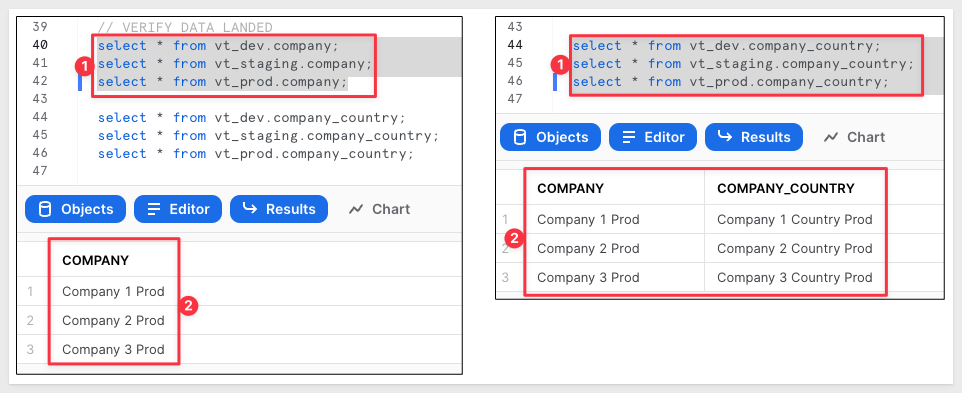

Once the script runs (with no errors) and we verified the data exists, we can move the next step.


<!-- END OF SECTION-->

## **Sigma Connections**
Duration: 10

Log into Sigma as an Administrator and head to the `Administration` / `Connections` page.

Click the `Create Connection` button. Select `Snowflake` and fill out the form.

The values for `User`, `Password` and `Role` were defined in our Snowflake Script so use those. 

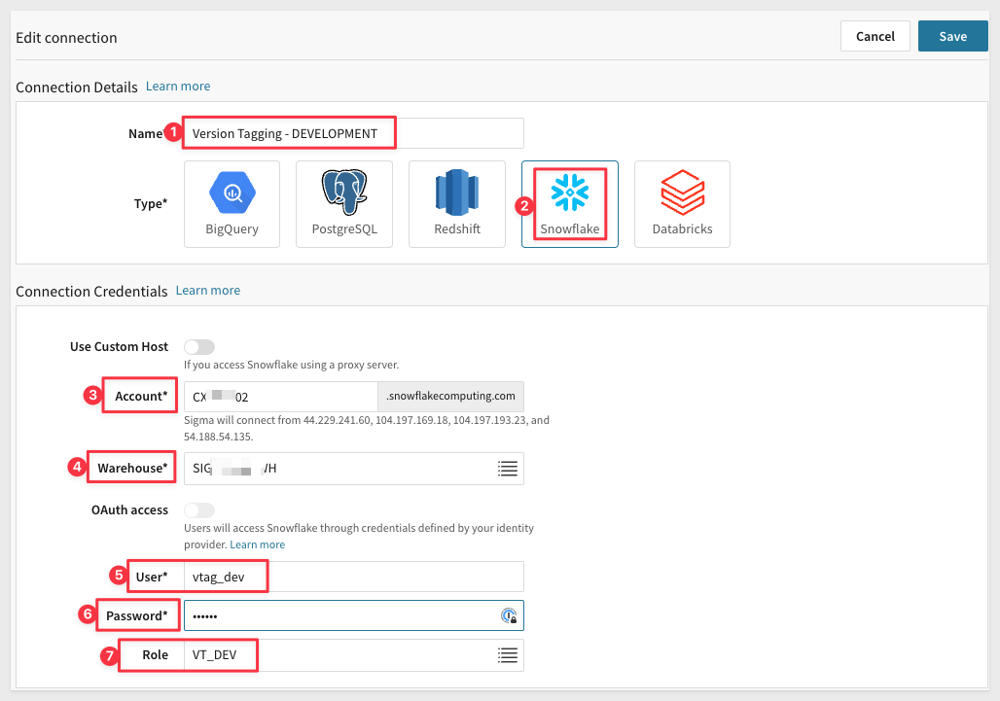

Click `Save` and Sigma will validate the connection is good. 

Before we add the other two connections (Staging and Prod), lets take a moment to ensure the Dev data is fully reachable.

In the new connection, click the `Browse Connection` button:

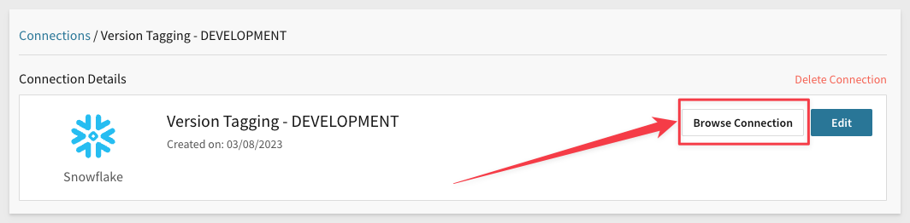

Verify that you can see table data for the `Company` and `Company Country` tables.

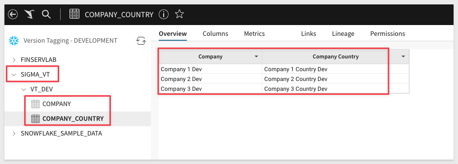

Now repeat the process, adding new Connections for `Staging` and `Prod`. Be sure to use the correct `User` and `Role` for each accordingly.

You should now have three working connections. The only different is the table data for each.

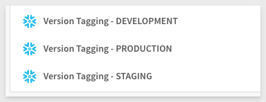


<!-- END OF SECTION-->

## **Sigma Tags**
Duration: 5

<aside class="postive">
<strong>VERY IMPORTANT:</strong><br> When you create a tag and assign it to a workbook, you essentially freeze the state of that workbook. The process of tagging a workbook creates a duplicate that can be shared with other stakeholders and users. When you share the final (Production) version of the Workbook, it will be different than the original "Published" version of the Workbook in the Sigma creator's UI. Other tagged versions of the Workbook will not be accessible (creator and Administrator aside) unless explicitly shared with others. The tag name is appended to the URL and we will cover that later. 
</aside>

Log into Sigma as an Administrator and head to the `Administration` / `Tags` page.

Click `Create` to add a new tag, 

Set the name to `Development` (pick any color you prefer, it won't matter for our example). 

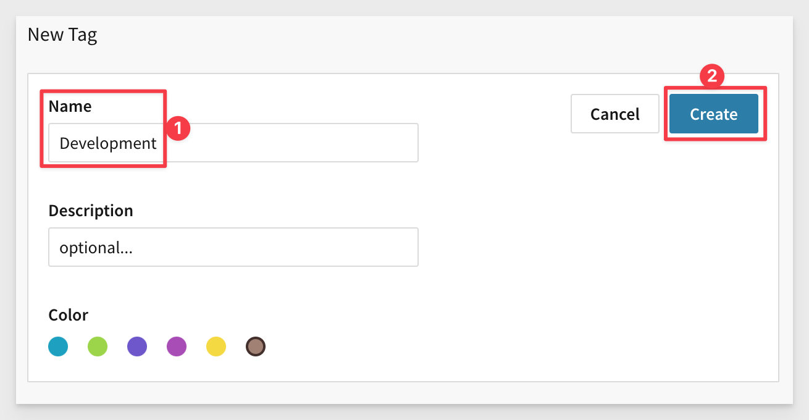

Repeat the process, adding a `Production` tag. You should now have two tags:

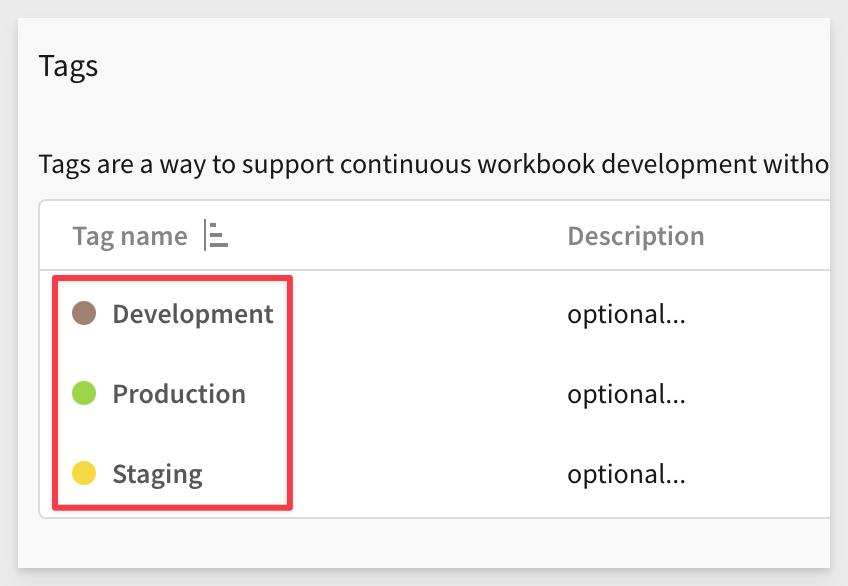

<aside class="negative">
<strong>NOTE:</strong><br> To access a tagged workbook, users must be granted access to the workbook or be the workbook's editor. 
</aside>


<!-- END OF SECTION-->

## Sigma Dateset and Workbook

Create a new Dataset and save it as `Version Tagging`, selecting from the `Version Tagging - DEVELOPMENT` connection.

Select the `Sigma_VT` / `Company_Country` table.

Click `Get Started`

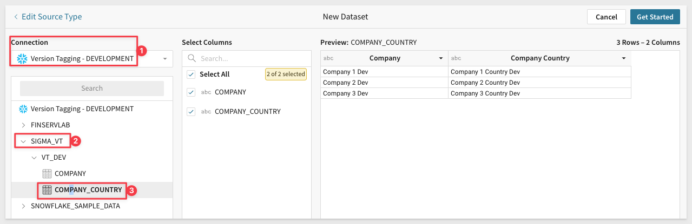

Click `Publish` then click `Explore`.

Click the `Save As` button and name the new Workbook `Embedding 8: Version Tagging`

Rename the table to `COMPANY_COUNTRY - DEVELOPMENT CONNECTION`.

and `Publish` the change.

Notice that in the table columns we are seeing `dev` appended in the rows. This is what we would expect given we are using the `Development Connection`.

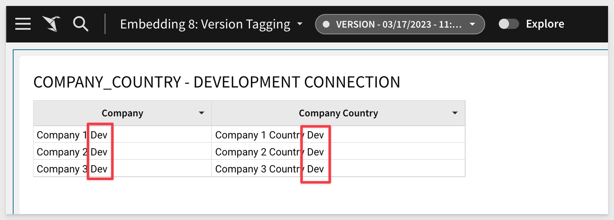


<!-- END OF SECTION-->


## Add QA User

To simulate sharing a promoted workbook to another user, we will need to add one. 

<aside class="negative">
<strong>NOTE:</strong><br> You must use a unique email for each Sigma user. If you have a Gmail address you can use this trick. Just use your Gmail address but append a "+" and it will automatically route email to your base Gmail account. 
</aside>

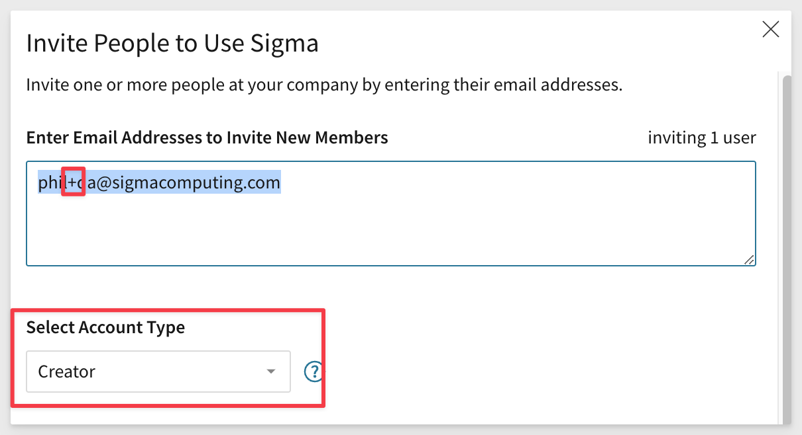

In Sigma, navigate to `Administration`, `People` and click the `Invite People` button. 

To make testing easier, you can login to Sigma in a different browser with the new account (you will get an email to setup your new account.). We will use Chrome `Profiles` to create a isolated browser instance so that we can have two Chrome browsers open at the same time, each logged in to Sigma with different logins, one simulate the `Developer` and another for `QA`.

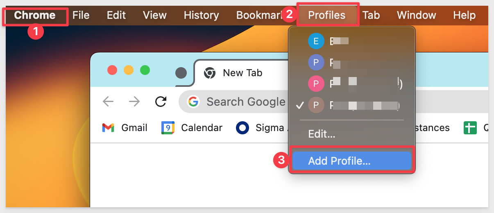

Choose `Continue without an account`. 

Give you Profile a name. We used `2nd Sigma User`.

Now use this new Profile to browse to Sigma (you can use the email link Sigma sent to setup the new account) and login.

You can now have two Chrome windows side by side, each using a different `Profile`.

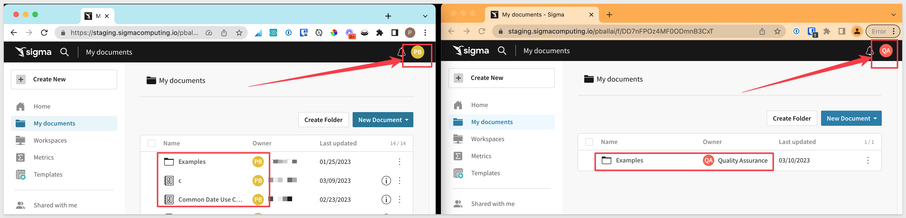

QA user does not see the `Version Tagging Workflow` Workbook yet, we need to share it with them. Their `Shared with me` folder is empty.

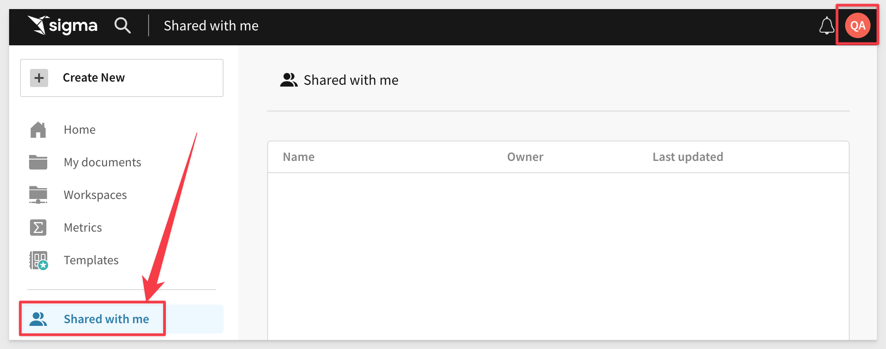


<!-- END OF SECTION-->


## **Verify Local Environment**
Duration: 20

Before we do anything else, lets make sure the local embed environment is working at a base level. Creating this local environment was covered on the Embedding 1: Prerequisites QuickStart so it is assumed the steps are familiar and we will move quickly in regards to those details. 


<!-- END OF SECTION-->

## **2**
Duration: 20


<!-- END OF SECTION-->


## **3**
Duration: 20


<!-- END OF SECTION-->


## **4**
Duration: 20


<!-- END OF SECTION-->


## What we've covered
Duration: 5

In this lab we learned how to.........

INSERT FINAL IMAGE OF BUILD IF APPROPRIATE

<!-- THE FOLLOWING ADDITIONAL RESOURCES IS REQUIRED AS IS FOR ALL QUICKSTARTS -->
**Additional Resource Links**

[Help Center Home](https://help.sigmacomputing.com/hc/en-us)<br>
[Sigma Community](https://community.sigmacomputing.com/)<br>
[Sigma Blog](https://www.sigmacomputing.com/blog/)<br>
<br>

[](https://twitter.com/sigmacomputing)&emsp;
[](https://www.linkedin.com/company/sigmacomputing)
[](https://www.facebook.com/sigmacomputing)


<!-- END OF WHAT WE COVERED -->
<!-- END OF QUICKSTART -->