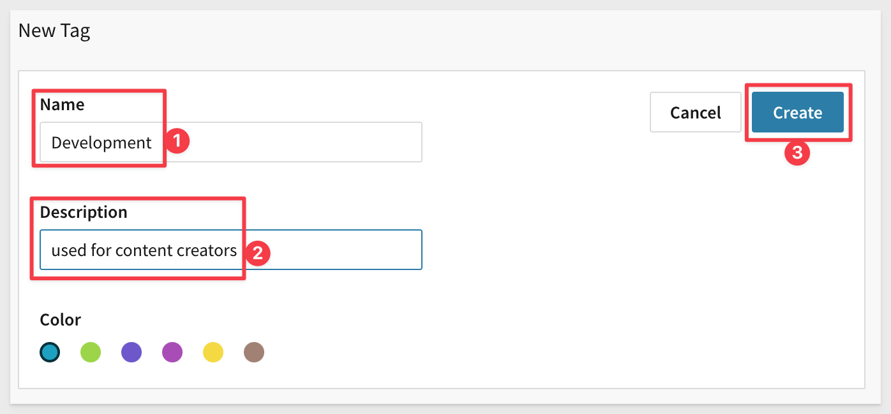
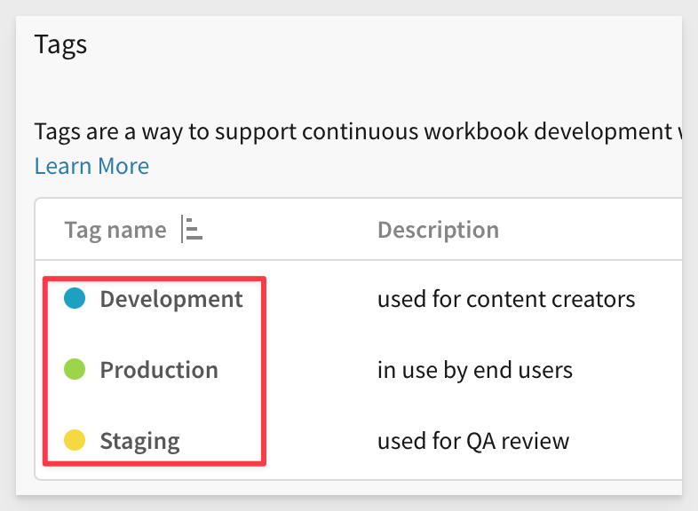
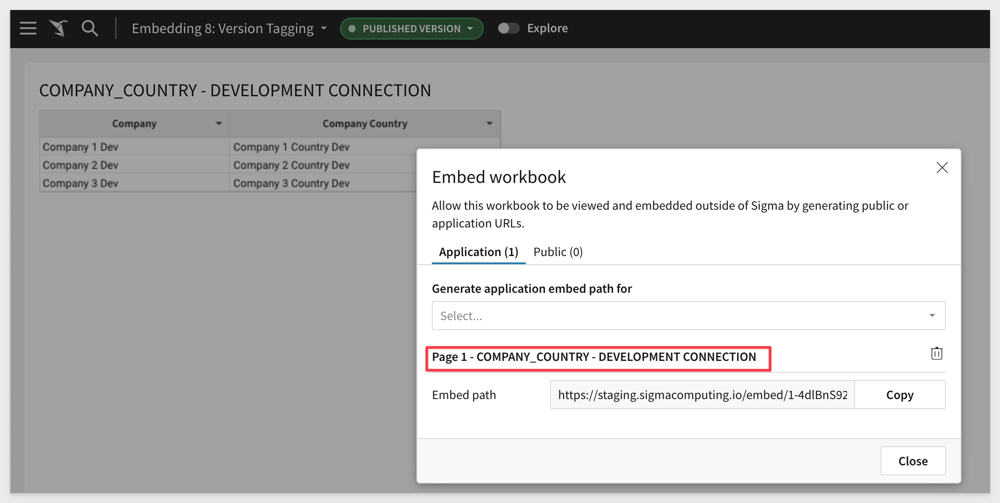
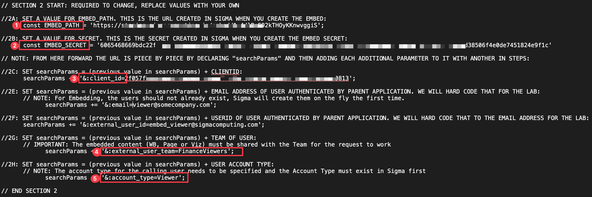
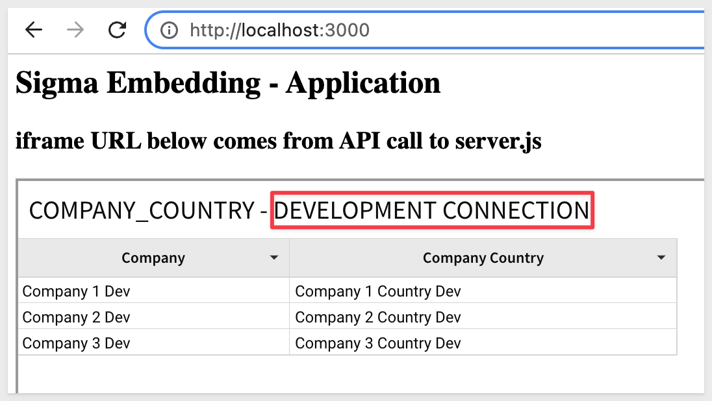
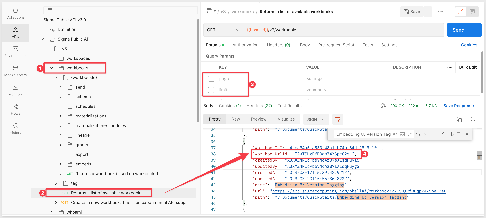
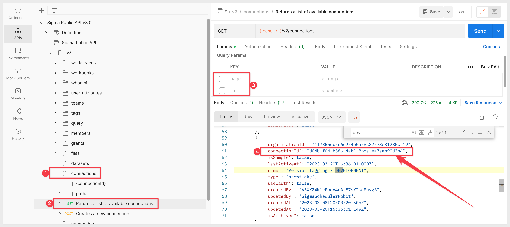
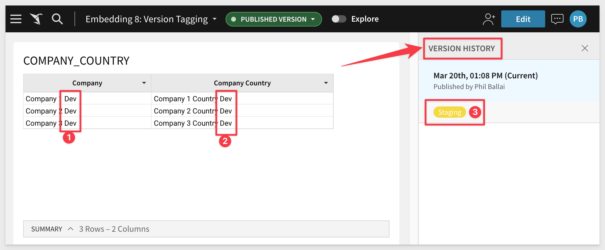
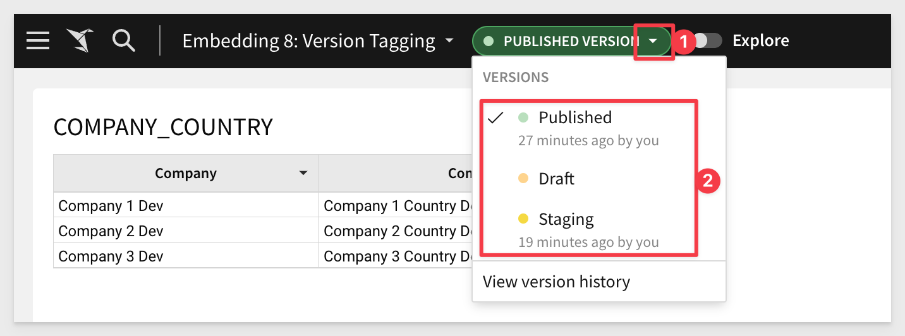
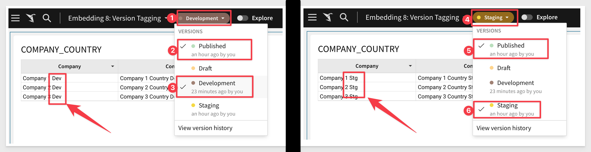

author: pballai
id: Sembedding_8_version_tagging
summary: Tembedding_8_version_tagging
categories: embedding
environments: web
status: Published
feedback link: https://github.com/sigmacomputing/sigmaquickstarts/issues
tags: Getting Started

# Embedding 8: Version Tagging

## Overview 
Duration: 5 

This QuickStart introduces you to Version Tagging in a Sigma embedded environment in order to manage promotions of Workbooks via the 3rd party tools. 

Version tagging allows you to employ a software development cycle to control Workbook versions, using Tags. For example, Sigma can have a development, staging, and production version of a workbook and migrate changes as needed. This allows you to control which workbook versions are viewable by your users. 

When you create a tag and assign it to a workbook, you essentially **freeze the state of that workbook**. The process of tagging a workbook creates a duplicate that can be shared with other stakeholders and users.  

For example, you can create a Production tag and assign it to a workbook that's used by embed users. Moreover, you can tag additional versions of the same workbook such as Development or Staging. These versions can be used by different stakeholders in your org for review purposes. Once reviewed, you can migrate this copy to Production for your users via external tool of your choice.

<aside class="postive">
<strong>IMPORTANT:</strong><br> One of the benefits of Tagging is your org can modify a Development workbook without affecting the experience of your customers who use the Production version. Once you complete your developmental changes, you can easily update the Production version of the workbook.
</aside>

There are many 3rd party tools available to manage the Continuous Integration / Continuous Development (CI/CD) workflow. 

In this QuickStart, we will demonstration using Postman to simulate a CI/CD workflow and make manual edits to our local Node.js environment to evaluate the results of our API calls. In this way, we can demonstrate how a customer application using source control and pipelines could be used to make the same workflow work without asking the QuickStart user to create an excess amount of setup to become familiar with the Tag workflow in Sigma. 

**Some steps may not be shown in detail as we assume you have taken these other two QuickStarts or are familiar with Sigma workflows.**

 ### Target Audience
 Semi-technical users who will be aiding in the DevOps implementation of Sigma. 

**Sigma strongly advises against using production resources when replicating the exercises in this QuickStart.** 

### Prerequisites

<ul>
  <li>A computer with a current browser. It does not matter which browser you want to use.</li>
  <li>Access to your Sigma environment. A Sigma trial environment is acceptable and preferred.</li>
  <li>A working web server based on Node.js as demonstrated in the QuickStart Embedding 1: Prerequisites</li>
  <li>A Snowflake account with the proper administrative and security admin access for our use case data.</li>
  <li>Completion of the QuickStart, "Sigma API with Postman" or an API tool that you use instead.</li>
</ul>

<aside class="postive">
<strong>IMPORTANT:</strong><br> Sigma recommends that you do not use production resources when doing QuickStarts.
</aside>

<button>[Sigma Free Trial](https://www.sigmacomputing.com/free-trial/)</button> <button>[Snowflake Free Trial](https://signup.snowflake.com/)</button>
  
### What You’ll Learn
How to manage CI/CD operations for a Sigma embedded environment.

### What You’ll Build

INSERT IMAGE OF FINAL BUILD IF APPROPRIATE.........


<!-- END OF OVERVIEW -->

## **Create Sample Snowflake Environment**
Duration: 10

We will need to create three schemas in Snowflake, each having the same tables with names and data adjusted to match the schema name. 

To help you accomplish this, we will provide the Snowflake script required to do this. 

<aside class="negative"><strong>NOTE:</strong><br> The remainder of this QuickStart with reference these tables as our Workbook is promoted from Dev to Staging to Prod.</aside>

```plaintext
// 1: CREATE OR REPLACE DATABASE AND SET IT TO CURRENT
CREATE OR REPLACE DATABASE SIGMA_VT;
USE DATABASE SIGMA_VT;

// 2: CREATE SCHEMAS
CREATE SCHEMA IF NOT EXISTS VT_DEV;
CREATE SCHEMA IF NOT EXISTS VT_STAGING;
CREATE SCHEMA IF NOT EXISTS VT_PROD;

// 3: CREATE AND LOAD DEV TABLES
USE SCHEMA VT_DEV;
CREATE OR REPLACE TABLE VT_DEV.company (company varchar);
CREATE OR REPLACE TABLE VT_DEV.company_country (company varchar, company_country varchar);
insert into vt_dev.company values ('Company 1 Dev');
insert into vt_dev.company values ('Company 2 Dev');
insert into vt_dev.company values ('Company 3 Dev');
insert into vt_dev.company_country values ('Company 1 Dev', 'Company 1 Country Dev');
insert into vt_dev.company_country values ('Company 2 Dev', 'Company 2 Country Dev');
insert into vt_dev.company_country values ('Company 3 Dev', 'Company 3 Country Dev');

// 4: CREATE AND LOAD STAGING TABLES
USE SCHEMA VT_STAGING;
CREATE OR REPLACE TABLE VT_STAGING.company (company varchar);
CREATE OR REPLACE TABLE VT_STAGING.company_country (company varchar, company_country varchar);
insert into vt_staging.company values ('Company 1 Stg');
insert into vt_staging.company values ('Company 2 Stg');
insert into vt_staging.company values ('Company 3 Stg');
insert into vt_staging.company_country values ('Company 1 Stg', 'Company 1 Country Stg');
insert into vt_staging.company_country values ('Company 2 Stg', 'Company 2 Country Stg');
insert into vt_staging.company_country values ('Company 3 Stg', 'Company 3 Country Stg');

// 5: CREATE AND LOAD PROD TABLES
USE SCHEMA VT_PROD;
CREATE OR REPLACE TABLE VT_PROD.company (company varchar);
CREATE OR REPLACE TABLE VT_PROD.company_country (company varchar, company_country varchar);
insert into vt_prod.company values ('Company 1 Prod');
insert into vt_prod.company values ('Company 2 Prod');
insert into vt_prod.company values ('Company 3 Prod');
insert into vt_prod.company_country values ('Company 1 Prod', 'Company 1 Country Prod');
insert into vt_prod.company_country values ('Company 2 Prod', 'Company 2 Country Prod');
insert into vt_prod.company_country values ('Company 3 Prod', 'Company 3 Country Prod');

// 6: CREATE ROLES FOR OUR USE CASES:
CREATE OR REPLACE ROLE VT_DEV;
CREATE OR REPLACE ROLE VT_STAGING;
CREATE OR REPLACE ROLE VT_PROD;

// 7: GRANT USAGE PERMISSION ON THE DATABASE TO NEW ROLES:
GRANT USAGE ON DATABASE SIGMA_VT TO VT_DEV;
GRANT USAGE ON DATABASE SIGMA_VT TO VT_STAGING;
GRANT USAGE ON DATABASE SIGMA_VT TO VT_PROD;

// 8: GRANT SELECT ON SCHEMA TO NEW ROLES:
GRANT USAGE ON SCHEMA SIGMA_VT.VT_DEV TO VT_DEV;
GRANT USAGE ON SCHEMA SIGMA_VT.VT_STAGING TO VT_STAGING;
GRANT USAGE ON SCHEMA SIGMA_VT.VT_PROD TO VT_PROD;

// 9 ALLOW NEW ROLES TO QUERY TABLE WE CREATED:
GRANT SELECT ON ALL TABLES IN SCHEMA SIGMA_VT.VT_DEV TO ROLE VT_DEV;
GRANT SELECT ON ALL TABLES IN SCHEMA SIGMA_VT.VT_STAGING TO ROLE VT_STAGING;
GRANT SELECT ON ALL TABLES IN SCHEMA SIGMA_VT.VT_PROD TO ROLE VT_PROD;

// 10: CREATE USERS FOR EACH ROLE
CREATE OR REPLACE USER vtag_dev PASSWORD='Dev99!' MUST_CHANGE_PASSWORD = FALSE;
GRANT ROLE VT_DEV TO USER vtag_dev;

CREATE OR REPLACE  USER vtag_staging PASSWORD='Staging99!' DEFAULT_ROLE = VT_STAGING MUST_CHANGE_PASSWORD = FALSE;
GRANT ROLE VT_STAGING TO USER vtag_staging;

CREATE OR REPLACE  USER vtag_prod PASSWORD='Prod99!' DEFAULT_ROLE = VT_PROD MUST_CHANGE_PASSWORD = FALSE;
GRANT ROLE VT_PROD TO USER vtag_prod;

// 11: VERIFY DATA LANDED (RUN CORRECT 'USE' STATEMENT TO SET THE SCHEMA, TO VALIDATE TABLES HAVE DATA IN EACH)
    // USE SCHEMA VT_DEV;
    // USE SCHEMA VT_STAGING;
    // USE SCHEMA VT_PROD;

select * from vt_dev.company;
select * from vt_staging.company;
select * from vt_prod.company;

select * from vt_dev.company_country;
select * from vt_staging.company_country;
select * from vt_prod.company_country;

// END
```


Once the script runs (with no errors) and we verified the data exists, we can move the next step.


<!-- END OF SECTION-->

## **Sigma Connections**
Duration: 10

Log into Sigma as an Administrator and head to the `Administration` / `Connections` page.

Click the `Create Connection` button. Select `Snowflake` and fill out the form.

The values for `User`, `Password` and `Role` were defined in our Snowflake Script so use those. 


Click `Save` and Sigma will validate the connection is good. 

Before we add the other two connections (Staging and Prod), lets take a moment to ensure the Dev data is fully reachable.

In the new connection, click the `Browse Connection` button:


Verify that you can see table data for the `Company` and `Company Country` tables.


Now repeat the process, adding new Connections for `Staging` and `Prod`. Be sure to use the correct `User` and `Role` for each accordingly.

You should now have three working connections. The only different is the table data for each.


<!-- END OF SECTION-->

## **Sigma Tags**
Duration: 5

<aside class="postive">
<strong>VERY IMPORTANT:</strong><br> When you create a tag and assign it to a workbook, you essentially freeze the state of that workbook. The process of tagging a workbook creates a duplicate that can be shared with other stakeholders and users. When you share the final (Production) version of the Workbook, it will be different than the original "Published" version of the Workbook in the Sigma creator's UI. Other tagged versions of the Workbook will not be accessible (creator and Administrator aside) unless explicitly shared with others. The tag name is appended to the URL and we will cover that later. 
</aside>

Log into Sigma as an Administrator and head to the `Administration` / `Tags` page.

Click `Create` to add a new tag, 

Set the name to `Development` (pick any color you prefer, it won't matter for our example). 



Repeat the process, adding a `Production` tag. You should now have two tags:



<aside class="negative">
<strong>NOTE:</strong><br> To access a tagged workbook, users must be granted access to the workbook or be the workbook's editor. 
</aside>


<!-- END OF SECTION-->

## Sigma Dateset and Workbook

Create a new Dataset and save it as `Version Tagging`, selecting from the `Version Tagging - DEVELOPMENT` connection.

Select the `Sigma_VT` / `Company_Country` table.

Click `Get Started`


Click `Publish` then click `Explore`.

Click the `Save As` button and name the new Workbook `Embedding 8: Version Tagging`

Rename the table to `COMPANY_COUNTRY - DEVELOPMENT CONNECTION`.

and `Publish` the change.


Notice that in the table columns we are seeing `dev` appended in the rows. This is what we would expect given we are using the `Development Connection`.


Share the Workbook with the `FinanceViewers` team (this team was created in previous embedding QuickStarts) with `Can View` access:


Before we get into the promotion workflow, we need to make sure that our parent application with the Sigma embed is working. 


<!-- END OF SECTION-->

## **Verify Local Node.js Environment**
Duration: 20

Before we do anything else, lets make sure the local embed environment is working at a base level. Creating this local environment was covered on the **Embedding 1: Prerequisites QuickStart**. so it is assumed the steps are familiar and we will move quickly in regards to those details. 

If you went though the other embedded QuickStarts, you may have multiple folders for each one. Lets make a copy of the `sigma_application_embed` QuickStart folder and rename it to `sigma_application_embed_tagging`.

<aside class="negative">
<strong>NOTE:</strong><br> You can use and of the other QuickStart embedding base folders if you only did a few of them.
</aside>

We will need to edit the `server.js` file for our Workbook so go ahead and do that. We only need to embed the Table.



Place replace the `Embed Path` value at a minimum. Your `server.js` may require the to change the `clientID` and `secret` if they are no longer valid.

We will also just use the `Viewer` "Account Type":



Bring up a Terminal session against the `sigma_application_embed_tagging` folder and run:

`supervisor server.js`.

Browse to `localhost:3000` to verify you can see a web page with the embed. 



We need to make a change to also pass the tag to Sigma at runtime. We do that but adding a section to `server.js` to set the value and then appending that value to the URL that is constructed prior to send.

<aside class="negative">
<strong>NOTE:</strong><br> In the string `/tag/Development` the work "Development" should match a Tag that exists in Sigma. We will use this to inform the embed which tagged version to use later. The specific Workbook version number will also be passed in the API call, but is not part of the URL string.
</aside>


Here is the code for convenience. 
```plaintext
// SECTION TAGGING:
	   let tag = '/tag/Development';
	// let tag = '/tag/Staging';
	// let tag = '/tag/Production';
// END SECTION TAGGING

<aside class="negative">
<strong>NOTE:</strong><br> In the code sample above, we have three statements setting the value for "tag".  Two are commented out. This is so when we test, we can just comment/uncomment the tag we want to use and save the server.js. It saves a few bits of typing and that is always appreciated.
</aside>
```

and...

```plaintext
// SECTION TAGGING:
const URL_WITH_SEARCH_PARAMS = EMBED_PATH + tag + searchParams;
```

Save `server.js` after making the change and refresh the browser to make sure the page loads after this change.

The page should be showing data from the Development connection.

**Bear in mind that we have not applied a Development tag to this Workbook. We will see what happens later.**

We are ready to move to the next step.


<!-- END OF SECTION-->

## **Promote to Staging**
Duration: 20

In this section we will use a combination of REST API calls (using Postman) and one edit to `server.js` to simulate a CI/CD workflow promotion to a Staging environment.

<aside class="postive">
<strong>NOTE:</strong><br> It is assumed that the manual REST calls and json editing steps shown here would be automated with a CI/CD tool and source repository of choice.
</aside>

<aside class="negative">
<strong>NOTE:</strong><br> Some steps using Postman will not be shown in detail as these were covered in the QuickStart, "Sigma API with Postman". Any REST tool can be used. You may also use the Sigma API Swagger or curl commands if you are more comfortable doing that.
</aside>

<button>[Sigma swagger page](https://docs.sigmacomputing.com/api/v2/#auth)</button>

[It may also be useful to reference Sigma's API reference](https://help.sigmacomputing.com/hc/en-us/articles/4408827709459-Sigma-s-Swagger-Playground)

In order to use the Sigma API, we must first get a new bearer token. Do that, as instructed in the "Sigma API with Postman" QuickStart.

We are ready to have the QA (Staging) team look at the Workbook in the Embed.

We will use the API to set the Staging tag, the version, the Staging connection and Staging path and the Workbook that exists in Sigma. 

<aside class="negative">
<strong>NOTE:</strong><br> The Workbook in Sigma's UI is currently showing data from the Development connection.
</aside>

We will accomplish this using the REST API only to obtain the required references. For example, we will need to obtain the unique identifiers for:

 <ul>
      <li>workbookUrlId</li>
      <li>Development connection.</li>
      <li>Development path.</li>
      <li>Staging connection.<li>
</ul>

We will use these values to update values send to Sigma (in json format) using a REST POST message.

Using a text editor (to hold the json temporarily) update each valuea that you obtain from the Postman calls. 

**Sample json without the identifiers for workbookId, fromConnectionId and toConnectionId:**
```plaintext
{
    "workbookId": "", 
    "workbookVersion": 1, 
    "tag": "Staging",
    "grantSourceAccess": true,
    "sourceMappingConfig": [
      {
        "fromConnectionId": "",
        "toConnectionId": "",
        "paths": [{ "fromPath": ["SIGMA_VT", "VT_DEV", "COMPANY_COUNTRY"], "toPath": ["SIGMA_VT", "VT_STAGING", "COMPANY_COUNTRY"] }]
      }
    ],
    "sourceVersions": {}
  } 
```

<aside class="negative">
<strong>NOTE:</strong><br> Values for paths may be different depending on if you created different schema in Snowflake than what was provided in this QuickStart.
</aside>

In Postman, open the request for `Returns a workbook based on workbookId` in the `workbooks` folder. This will get the list of all workbooks. 

Click `Send` and locate the Workbook named `Embedding 8: Version Tagging` in the return. 

Copy it's workbookUrlId value and update the json sample:



We now need to get the GUIDs for the Development and Staging connection using the method `Returns a list of available connections`:

Copy the two GUIDs (one for Development and another for Staging) from the return and update the json code. 



Send the API request. The API should return with a 200 Status and three lines of information (number 10)


We have now tagged the Workbook to Staging, version 1. We can make this what is displayed in the Parent application by changing the one line of code in server.js.

First, verify in Sigma that the published version is showing the Development connection. This is expected:



The red arrow is showing `Version History` and showing that the Workbook has also been tagged `Staging` (#3). This was done by the API call we made.

Now the Parent application will still be using the Development connection until we alter `server.js` to adjust the URL to point to Staging.

Edit server.js:
```plaintext
// SECTION TAGGING:
	// let tag = '/tag/Development';
	 let tag = '/tag/Staging';
	// let tag = '/tag/Production';

// END SECTION TAGGING
```

Save `server.js` and refresh the Parent application page. We now see the table is using the Staging connection's data and the embed URL is point to Stating (on two lines...)


Let's try demoting this Workbook back to the Developers connection.

Edit server.js:
```plaintext
// SECTION TAGGING:
	 let tag = '/tag/Development';
	// let tag = '/tag/Staging';
	// let tag = '/tag/Production';

// END SECTION TAGGING
```

Save `server.js` and refresh the Parent application page.

Now we get an error; what happened?


In section 5 and 6 we never tagged the initial Workbook `Development` so any reference to that in the URL was ignored as no tags existed at then. Once we tagged the Workbook `Staging` and later tried to request the Workbook with the Development tag, Sigma could not find that tag associated with a tagged workbook with the requested `workbookUrlId` so it failed with a `404`, page not found.

We can also confirm this in the Sigma UI by looking at what versions exist as:



This is an easy fix and we could have prevented it earlier but wanted to demonstrate it during the promotion workflow as it is a "fine point".

We just need to rerun the `Tags a Workbook` API call, changing the tag to `Development` and flipping the values as shown:


Back in Sigma, we can see that there are now Staging and Development versions of the Workbook.


Experiment changing the version by selecting between Staging and Development copies of the Workbook. 

When "toggling" between the `Production` versions of Staging and Development you can see the data changes as expected due to the connection configuration associated with the tags assigned to the Workbook.



There also an option for `Draft` shown. Selecting this along with a tagged version will take you to the Workbook in edit more for that tag.

In the next section, we will want the developer to make one small change and push to production. To do this, we will have to use the Workbook tagged with the `Development` tag and select the draft to edit it. This will also create a new version (by number) for the tagged Workbook, which we will demonstrate.


<!-- END OF SECTION-->


## Production Version
Duration: 20

We left the Parent application using the Development version of the Workbook. 

Lets assume QA (in Staging) asked us to change the table title and then push right into production. 

PHIL - DELETE EVERYTHING and start over. want to show that DEv / Draft versions the workbook by number


<!-- END OF SECTION-->

## What we've covered
Duration: 5

In this lab we learned how to.........

INSERT FINAL IMAGE OF BUILD IF APPROPRIATE

<!-- THE FOLLOWING ADDITIONAL RESOURCES IS REQUIRED AS IS FOR ALL QUICKSTARTS -->
**Additional Resource Links**

[Help Center Home](https://help.sigmacomputing.com/hc/en-us)<br>
[Sigma Community](https://community.sigmacomputing.com/)<br>
[Sigma Blog](https://www.sigmacomputing.com/blog/)<br>
<br>

[](https://twitter.com/sigmacomputing)&emsp;
[](https://www.linkedin.com/company/sigmacomputing)
[](https://www.facebook.com/sigmacomputing)


<!-- END OF WHAT WE COVERED -->


<!-- END OF QUICKSTART -->