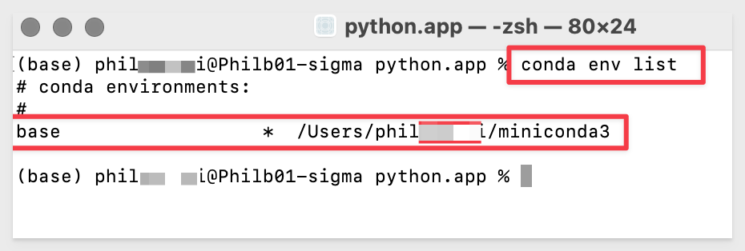

author: pballai
id: embedding5_embedding_into_streamlit
summary: embedding5_embedding_into_streamlit
categories: Embedding
environments: web
status: Published
feedback link: https://github.com/sigmacomputing/sigmaquickstarts/issues
tags: default

# Embedding Sigma in Streamlit Applications
<!-- The above name is what appears on the website and is searchable. -->

## Overview 
Duration: 5 

 ### Target Audience
Snowflake customers who are using (or interested in using) Streamlit and want to also embed Sigma content in a Streamlit application.

### Prerequisites

<ul>
  <li>A computer with a current browser. It does not matter which browser you want to use.</li>
  <li>Access to your Sigma environment. A Sigma trial environment is acceptable and preferred.</li>
  <li>A Snowflake account with the proper administrative and security admin access.</li>
  <li>A development environment of choice. We will demonstrate with Microsoft VSCode and related extensions</li>
  <li>Miniconda for required Python packages</li>
</ul>

<aside class="postive">
<strong>IMPORTANT:</strong><br> Sigma recommends that you use non-production resources when doing QuickStarts.
</aside>

<button>[Sigma Free Trial](https://www.sigmacomputing.com/free-trial/)</button> <button>[Snowflake Free Trial](https://signup.snowflake.com/)</button> <button>[Microsoft VSCode](https://code.visualstudio.com/download)</button> <button>[Miniconda](https://docs.conda.io/en/latest/miniconda.html)</button>
  
### What You’ll Learn
What is Snowflake Streamlit and how can we embed Sigma content into it.

### What You’ll Build

INSERT IMAGE OF FINAL BUILD IF APPROPRIATE.........


<!-- END OF OVERVIEW -->

## **Setup Python**
Duration: 20

We will start by setting up our local Python environment based on Miniconda, which is a "thin" version of Conda.

Conda is an open-source, cross-platform, language-agnostic package manager and environment management system. It was originally developed to solve difficult package management challenges faced by Python data scientists, and today is a popular package manager for Python and R.

Miniconda is the much smaller (about 200 MB vs. 4+ gig) installer version of Conda and will save us time and disk-space compared with installing the full Conda (Anaconda) application. 

It includes only Conda, Python, the packages they depend on, and a small number of other useful packages, including pip, zlib and a few others. Packages that are not included, have to be called at runtime or installed individually.

[Use the following link to download the Miniconda.](https://docs.conda.io/en/latest/miniconda.html) Download the version that includes **Python 3.8 or above** based on your operating system and its configuration (32 bit or 64 bit).

<aside class="negative">
<strong>NOTE:</strong><br> Snowpark requires Python version 3.7 or later.
</aside>

After downloading the operation system appropriate version from Miniconda, go ahead and run the installation, accepting the license and all the defaults.


Now that Miniconda is installed (along with our selected version of Python; v3.8), we can move to the next step.


<!-- END OF NEXT SECTION-->

## **Setup VSCode**
Duration: 20

[Install VSCode from Microsoft's download site.](https://code.visualstudio.com/download)

Run the installation with all defaults.

Once the software is installed, we need to configure it for our use case. 

Open VSCode and click the sidebar icon for `Extentions`. 

Search for `Python` and select the extension from the list as shown. Click `Install`:


<aside class="negative">
<strong>NOTE:</strong><br> VSCode may notify you (in the lower left corner of the application) that it requires a restart. Go ahead and select restart. This is required when the extension needs to perform additional registration with VSCode.
</aside>


We now have a development environment ready but we need to do a few more steps.


<!-- END OF NEXT SECTION-->

## **Create a Python Environment**
Duration: 20

Since we installed Miniconda, every available Conda package is not present in our system. While this saves install time and saves disk-space, we will have to be aware that each VScode project will need to have required package dependencies installed at runtime. 

We could solve this by installing packages globally but we prefer to avoid that and maintain tight control of our development environment. 

To properly support this control, we will make use of `Python environments` to create project/package isolation. 

For our first project, we will create a Python environment called `streamlit`.

In our local computer, navigate to where Miniconda is installed. The default is based on your computer username.

Right-click and open a terminal session:


First, let's see what environments already exist. Run the command:
```plaintext
conda env list
```

We should see the "base" environment that is included with Miniconda. 



Now let's create our "streamlit" environment for our VSCode project. Run the command:
```plaintext
conda create --name streamlit python=3.8
```

When prompted to proceed, type `y` and hit return:


Listing the environments again, we should see `base` and `streamlit` with base being the current select noted by the "*":
```plaintext
conda env list
```


We are ready with our new Conda environment called `streamlit`. 

## Install Streamlit

To install Streamlit on our local computer, run the command:
```plaintext
pip install streamlit
```

A lot of information will be displayed and the command prompt will appear when done. There should be no error messages:


Now we can test our local Streamlit environment:
```plaintext
streamlit hello
```

Accept the warning about incoming network connections:


The following prompt should appear in terminal asking for email address (we will skip over that, so hit `Enter`):


The following page should appear using your default browser:


<aside class="negative">
<strong>NOTE:</strong><br> Streamlit uses port 8501 on your local computer. This port is not commonly used but if it happens to be in use, you will need to stop the other service temporarily.
</aside>


## Streamlit - Hello World
Duration: 20


<!-- END OF SECTION-->

## What we've covered
Duration: 5

In this lab we learned how to.........

INSERT FINAL IMAGE OF BUILD IF APPROPRIATE

<!-- THE FOLLOWING ADDITIONAL RESOURCES IS REQUIRED AS IS FOR ALL QUICKSTARTS -->
**Additional Resource Links**

[Help Center Home](https://help.sigmacomputing.com/hc/en-us)<br>
[Sigma Community](https://community.sigmacomputing.com/)<br>
[Sigma Blog](https://www.sigmacomputing.com/blog/)<br>
<br>

[](https://twitter.com/sigmacomputing)&emsp;
[](https://www.linkedin.com/company/sigmacomputing)
[](https://www.facebook.com/sigmacomputing)


<!-- END OF WHAT WE COVERED -->
<!-- END OF QUICKSTART -->