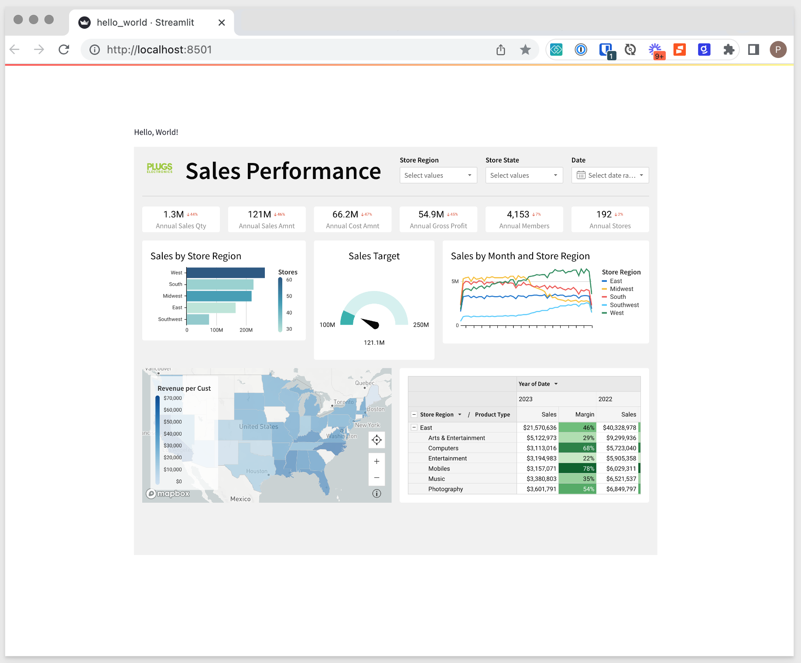
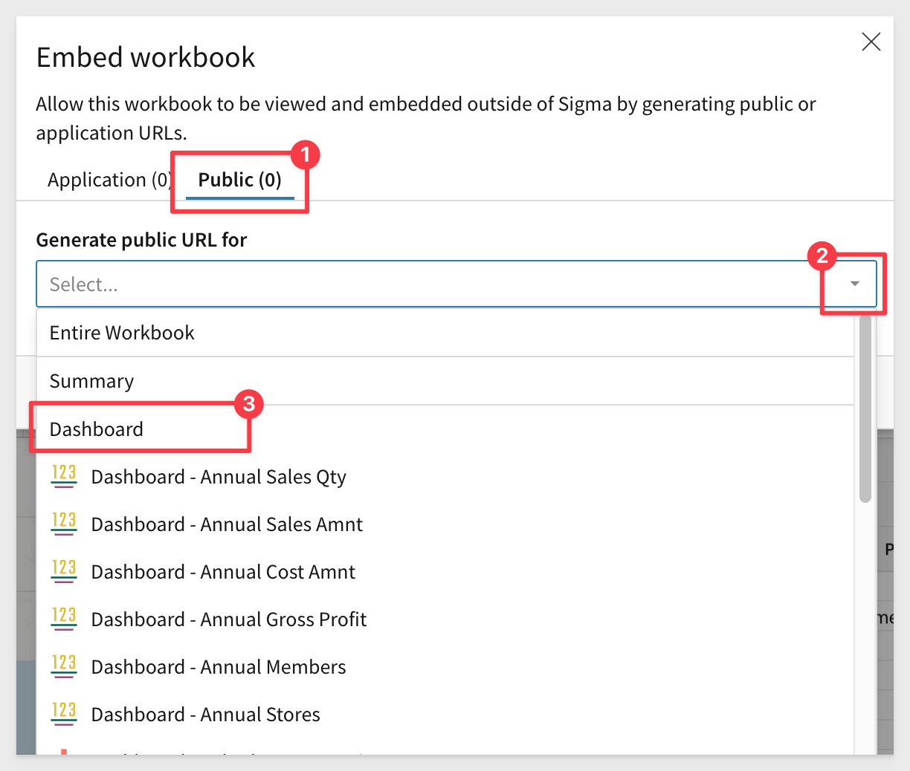

author: pballai
id: embedding_9_embedding_into_streamlit
summary: embedding5_embedding_into_streamlit
categories: Embedding
environments: web
status: Published
feedback link: https://github.com/sigmacomputing/sigmaquickstarts/issues
tags: default
lastUpdated: 2023-07-18

# Embedding Sigma in Streamlit Applications
<!-- The above name is what appears on the website and is searchable. -->

## Overview 
Duration: 5 

This QuickStart will guide you through the implementation of a quick, easy, and rapid to develop method to embed Sigma content in a Streamlit application. Embedding Sigma content within Streamlit applications is a powerful tool-set that enables and empowers developers, data analysts, and even business users to create interactive data applications backed by the power of Sigma.

### What is Streamlit
Streamlit is an open source app framework in Python language. It will help us to create interactive web apps for data science and machine learning in a short time. It is compatible with all major Python libraries, such as scikit-learn, Keras, PyTorch, SymPy(latex), NumPy, pandas, Matplotlib, and more.

Streamlit is intended to provide Snowflake users the ability to rapidly deploy applications and share data.

**Teams use Streamlit to build Python applications to benefit from:**
<ul>
    <li>Rapid Development Cycle</li>
    <li>Simplified Coding Experience</li>
    <li>Flexible Components</li>
    <li>Internal or External Facing</li>
    <li>Extensible Embedding</li>
</ul>

Streamlit works great with Sigma to accelerate your path of deployment for any data applications built, especially those that rely on visualizations, while providing the user with our industry-differentiated ability to deep dive into the data powering those visuals and unlocking the power of your data warehouse.

**Building the analytics front-end In Sigma provides:**
<ul>
    <li>End users a familiar, spreadsheet-like interface.</li>
    <li>No Code or Semantic knowledge required.</li> 
    <li>Full Role-based Access Control Support.</li>
    <li>Data Governance and Lineage.</li> 
    <li>Full Feature Set While Embedded.</li>
    <li>Ability to leverage massive datasets</li>
</ul>

 ### Target Audience
Snowflake customers who are using (or interested in using) Streamlit and want to also embed Sigma content in a Streamlit application. Sigma customer who are looking to rapidly develop and deploy data applications in Streamlit.

### Prerequisites

<ul>
  <li>A computer with a current browser. It does not matter which browser you want to use.</li>
  <li>Access to your Sigma environment. A Sigma trial environment is acceptable and preferred.</li>
  <li>A development environment (or RTE) of your choice. In this QuickStart we use Microsoft VSCode with related extensions.</li>
  <li>A Python 3.8, or later, environment. In this QuickStart we use Miniconda for the required Python environment and packages as a Python Virtual Environment is recommended.</li>
</ul>

<aside class="postive">
<strong>IMPORTANT:</strong><br> Sigma recommends that you use non-production resources when doing QuickStarts.
</aside>

<button>[Sigma Free Trial](https://www.sigmacomputing.com/free-trial/)</button> <button>[Microsoft VSCode](https://code.visualstudio.com/download)</button> <button>[Miniconda](https://docs.conda.io/en/latest/miniconda.html)</button>
  
### What You’ll Learn
What is Snowflake Streamlit and how can we embed Sigma content into it.

### What You’ll Build

We will use Streamlit and Sigma to build a webpage that embed a Sigma dashboard:




<!-- END OF OVERVIEW -->

## **Setup Python**
Duration: 20

We will start by setting up our local Python environment based on Miniconda, which is a "thin" version of Conda (Anaconda). If you already have an existing Python environment, you may make use of that or proceed with Miniconda as well.

Conda is an open-source, cross-platform, language-agnostic package manager and environment management system. It was originally developed to solve difficult package management challenges faced by Python data scientists, and today is a popular package manager for Python and R.

Miniconda is the much smaller (~200 MB vs. ~4+ GB) installer version of Conda and will save us time and disk-space compared with installing the full Conda application.

It includes only Conda, Python, the packages they depend on, and a small number of other useful packages, including pip, zlib and a few others. Packages that are not included, have to be called at runtime or installed individually.

Use the following link to download the Miniconda. Download the version that includes Python 3.8 or above based on your operating system and its processor (x86 32 bit or 64 bit, Apple Silicon, or etc.)

[Use the following link to download the Miniconda.](https://docs.conda.io/en/latest/miniconda.html) Download the version that includes **Python 3.8 or above** based on your operating system and its configuration (32 bit or 64 bit).

<aside class="negative">
<strong>NOTE:</strong><br> Snowpark requires Python version 3.7 or later.
</aside>

After downloading the operation system appropriate version from Miniconda, go ahead and run the installation, accepting the license and all the defaults.


Now that Miniconda is installed (along with our selected version of Python; v3.8), we can move to the next step.


<!-- END OF NEXT SECTION-->

## **Setup VSCode**
Duration: 20

[Install VSCode from Microsoft's download site.](https://code.visualstudio.com/download)

Run the installation with all defaults.

Once the software is installed, we need to configure it for our use case. 

Open VSCode and click the sidebar icon for `Extentions`. 

Search for `Python` and select the extension from the list as shown. Click `Install`:


<aside class="negative">
<strong>NOTE:</strong><br> VSCode may notify you (in the lower left corner of the application) that it requires a restart. Go ahead and select restart. This is required when the extension needs to perform additional registration with VSCode.
</aside>


<aside class="negative">
<strong>NOTE:</strong><br> Microsoft has made a Python extention for VSCode and you may want to install that as well although not required to complete this QuickStart. Pylance enhances productivity, minimizes the likelihood of errors, and improves the overall efficiency of writing Python code in VS Code.
</aside>

[Link to Pylance Extension page.](https://marketplace.visualstudio.com/items?itemName=ms-python.vscode-pylance)

We now have a development environment ready, but we need to do a few more steps.


<!-- END OF NEXT SECTION-->

## **Create a Python Environment**
Duration: 20

Since we installed Miniconda, every available Conda package is not present in our system. While this saves install time and saves disk-space, we will have to be aware that each VScode project will need to have required package dependencies installed at runtime. 

We could solve this by installing packages globally but we prefer to avoid that and maintain tight control of our development environment. 

To properly support this control, we will make use of `Python environments` to create project/package isolation. 

For our first project, we will create a Python environment called `streamlit`.

In our local computer, navigate to where Miniconda is installed. The default is based on your computer username.

Right-click and open a terminal session:


First, let's see what environments already exist. Run the command:
```plaintext
conda env list
```

We should see the "base" environment that is included with Miniconda. 


Now let's create our "streamlit" environment for our VSCode project. Run the command:
```plaintext
conda create --name streamlit python=3.8
```

When prompted to proceed, type `y` and hit return:


We need to activate our new environment. Run the command:
```plaintext
conda activate streamlit
```

Listing the environments again, we should see `streamlit` being the current select noted by the "*":
```plaintext
conda env list
```


We are ready with our new Conda environment called `streamlit`. 

## Install Streamlit

<aside class="negative">
<strong>NOTE:</strong><br> The following instructions demonstrate installation on MacOS, your installation will differ somewhat on a different Operating System.
</aside>

To install Streamlit on our local computer, execute the following command in Terminal:
```plaintext
pip install streamlit
```

A lot of information will be displayed and the command prompt will appear when done. There should be no error messages:


Now we can test our local Streamlit environment. Execute the following command in Terminal:
```plaintext
streamlit hello
```

Click the `Allow` button to allow Python to accept incoming network connections:


The following prompt should appear in terminal asking for email address (we will skip over that, so leave it blank and press `Enter`):


Streamlit will automatically open your default browser to the standard webpage that comes with Streamlit:


<aside class="negative">
<strong>NOTE:</strong><br> Streamlit uses port 8501 on your local computer. This port is not commonly used but if it happens to be in use, you will need to stop the other service temporarily. If port 8501 is unavailable, or if you are running multiple Streamlit apps, it will try to launch on sequentially additive ports such as 8502, 8503, etc, however you may still want to stop other services temporarily.
</aside>

## Streamlit - Hello World
Duration: 20

Open VSCode. 

We need to select the Python interpreter we want to use for our project.

Access the VSCode editor commands. `Ctrl+Shift+P` will bring you directly to the editor commands.

<aside class="negative">
<strong>NOTE:</strong><br> This is not the same thing as the VSCode search bar that is always on by default.
</aside>

In the editor bar, type `select inter` and you should see `Python: Select Interpreter` listed. Select that.


There may by a few versions installed (depending on your system) and we want to select the one that is based on our `streamlit` environment.

We can tell which that is as it will say `streamlit`. 


<aside class="negative">
<strong>NOTE:</strong><br> We have seen VSCode request another restart after this step so check (lower left corner of VSCode) to see if it is required again. 
</aside>

After restart (if required), VSCode will revert to the default Python environment so change that back to `streamlit` again. 

Make sure that the Python Interpreter selected in blue is `streamlit`, indicating that it is active.


<aside class="negative">
<strong>NOTE:</strong><br> It is possible to change the default interpreter, but that is a distraction and we want to just start building.
</aside>

We are now setup to get build a Python webpage for Streamlit using VSCode.

Using the VSCode button (or the file menu if you dont see the button), click to `Open Folder`:


Navigate to where you installed Streamlit and select that top-level folder:


Right-click on new file icon (as shown) to create a blank new file:


Name the new file `hello-world.py` and paste the following code in editor for this new file:
```plaintext
import streamlit as st

st.write("Hello, World!")
```


Save the file.

Open a new Terminal session inside VSCode:


In the VSCode Terminal session, execute the following command:
```plaintext
streamlit run hello_world.py
```

Streamlit will open in your default browser with our new webpage:


We are now ready to embed Sigma into our new Streamlit page.


<!-- END OF SECTION-->

## Sigma Embed Content
Duration: 20

We will need something to embed into Streamlit from Sigma. To keep this simple, we will use a [Public Embed](hhttps://help.sigmacomputing.com/docs/public-embedding) of the Plugs Electronics Profit Planning Tool Template.

<aside class="positive">
<strong>IMPORTANT:</strong><br> It is also possible to secure the Streamlit application and use Sigma's secure embedding methods but that is out-side the scope of this QuickStart.
</aside

Log into Sigma (as Administrator) and navigate to `Templates` and click the **Plugs Electronics Profit Planning Tool** Template:


Dismiss the pop-up help regarding swapping of data sources. We will just use the sample data provided.

Click the `Save As` button in the upper right corner and use the name `Sigma Dashboard`; click `Save`.

Now click the drop menu (as shown below) and select `Embedding`:


In the `Embed workbook` pop-up, click the `Public` tab and then the drop arrow followed by the `Profit Planning Tool`. This will define all the elements on the Workbook's Dashboard page to be embedded. 

<aside class="positive">
<strong>IMPORTANT:</strong><br> Sigma embedding supports a Workbook, Page or any Elements to be embedded into external applications.
</aside



Once we selected to embed the Profit Planning Tool, we are presented with both a Public Link to the content as well as the Embed Code. 

Click `Copy` to select the `Public Link` and paste it into a text file; we will use it in the next step:


In VSCode, we are going to delete the code in our "hello_world.py" file with this code:
```plaintext
import streamlit as st

st.write("Hello, World!")
st.components.v1.iframe("REPLACE WITH PATH TO YOUR SIGMA PUBIC EMBED")
```

You may have noticed that the code is the identical but extended with a call to the st.components.v1.iframe function to add the required iframe.

Save the new code and refresh the browser page to see the embedded Sigma content:


Congratulations, you have setup your Streamlit app with Sigma embedded into it. 


<!-- END OF SECTION-->

## What we've covered
Duration: 5

In this lab we learned what is Streamlit and how to Embed Sigma into Streamlit application that we built together.

If you would like to learn more about Streamlit, there is a [video series available.](https://www.youtube.com/watch?v=bfw28e6v4_s)

<!-- THE FOLLOWING ADDITIONAL RESOURCES IS REQUIRED AS IS FOR ALL QUICKSTARTS -->
**Additional Resource Links**

Be sure to check out all the latest developments at [Sigma's First Friday Feature page!](https://quickstarts.sigmacomputing.com/firstfridayfeatures/)

[Streamlit Documentation](https://docs.streamlit.io/)<br>
[Get started with Streamlit](https://docs.streamlit.io/library/get-started)<br>
<br>

[Help Center Home](https://help.sigmacomputing.com)<br>
[Sigma Community](https://community.sigmacomputing.com/)<br>
[Sigma Blog](https://www.sigmacomputing.com/blog/)<br>
<br>

[](https://twitter.com/sigmacomputing)&emsp;
[](https://www.linkedin.com/company/sigmacomputing)&emsp;
[](https://www.facebook.com/sigmacomputing)


<!-- END OF WHAT WE COVERED -->
<!-- END OF QUICKSTART -->
