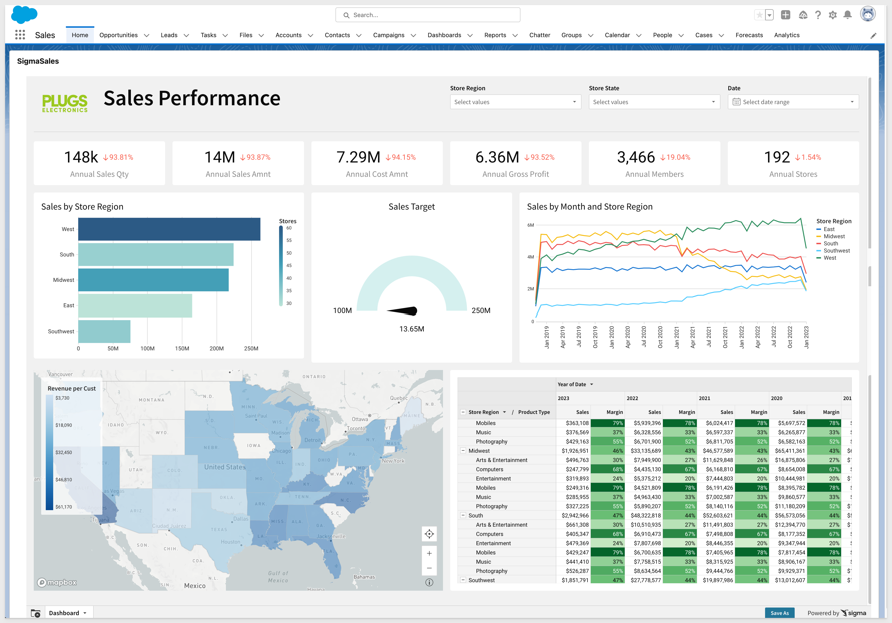
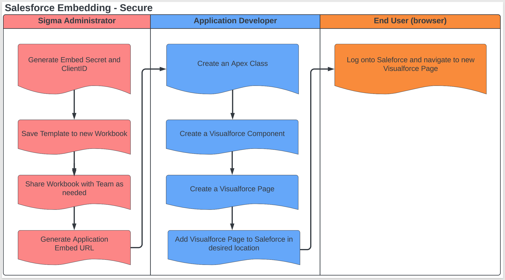
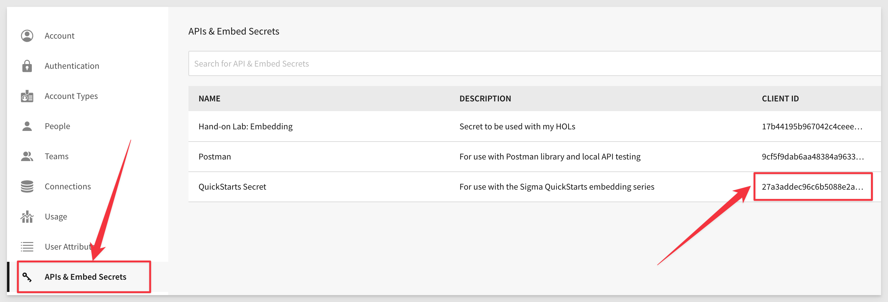
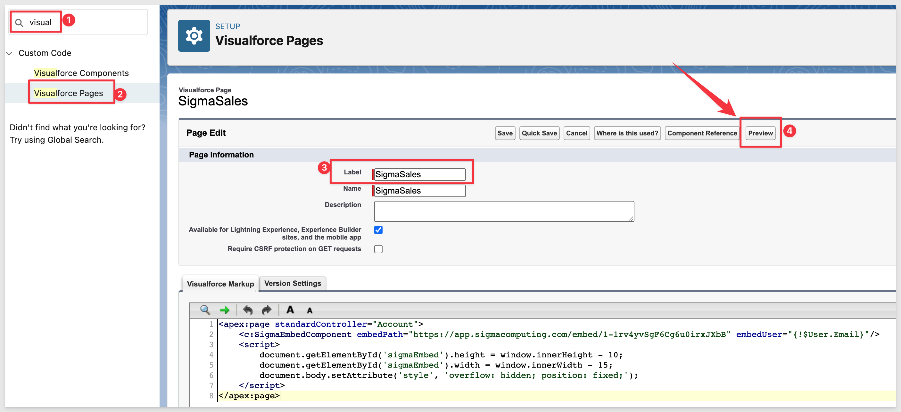
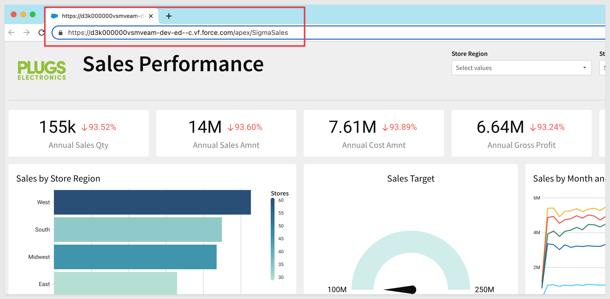

author: pballai
id: embedding_5_application_embedding_into_salesforce
summary: How to securely embed Sigma into SalesForce
categories: Embedding
environments: web
status: Published
feedback link: https://github.com/sigmacomputing/sigmaquickstarts/issues
tags: Getting Started, Analytics, Data Engineering, BI, Business Intelligence, Sigma, Sigma Computing, Snowflake, Dashboarding, Visualization, Analysis, Excel, Spreadsheet, Embedding

# Embedding 5: Application Embedding into SalesForce

## Overview 
Duration: 5 

This QuickStart introduces you to Sigma embedding into Salesforce. This QuickStart assumes you have already taken the QuickStart [Embedding 1: Prerequisites](https://quickstarts.sigmacomputing.com/guide/embedding_1_prerequisites/index.html) so that you have a sample environment to complete the tasks in this QuickStart.

We also recommend you table the the QuickStart [Embedding 3: Application Embedding](https://quickstarts.sigmacomputing.com/guide/embedding_3_application_embedding/index.html).

**Some steps may not be shown in detail as we assume you have taken these other two QuickStarts or are familiar with Sigma workflows.**

 ### Target Audience
Semi-technical users who will be aiding in the planning or implementation of Sigma. Limited Salesforce and technical data skills are needed to do this QuickStart. It does assume some common computer skills like configuring software, navigating folders and edit/copy/paste operations.

### Prerequisites

<ul>
  <li>A computer with a current browser. It does not matter which browser you want to use.</li>
  <li>Access to your Sigma environment. A Sigma trial environment is acceptable and preferred.</li>
  <li>Access to Salesforce. We recommend using a free Salesforce developer account.</li>
  <li>Some content to embed. You can embed a Workbook, Table or Visualization.</li>
  <li>Familiarity navigating Salesforce and minor administrative functions.
</li>
</ul>

<button>[Free Sigma Trial](https://www.sigmacomputing.com/free-trial/)</button>   <button>[SalesForce Dev. Account](https://developer.salesforce.com/signup)</button>
  
### What You’ll Learn
The exercises in this QuickStart will discuss and walk you through the steps to embed Sigma inside a Salesforce page. 

### What You’ll Build
We will build a SalesForce page using Sigma content, embedded securely on a VisualForce page as shown below:




<!-- END -->


## **Application Embed**
Duration: 20

In this use case we will embed a Sigma Dashboard based on one of the samples provided in the Sigma trial account. The high-level process looks like this:



### Sigma Configuration
Login to Sigma and navigate to the `Administration` / `APIs & Embed Secrets` page. 

Generate a `new Embed Secret`, copy it off for later use. 

`Copy the Client ID` value for later use.



Navigate to the `Templates` page.

Select `Sales Performance Example`. 

Dismiss the help popup and click the Dashboard tab (bottom of the page). This is the Page we want to embed.

Click the `Save As button` (upper right corner). Name the Workbook `Salesforce Embed` and click `Save`.

Click the label `Salesforce Embed` and select `Embedding` and then select `Dashboard` to generate a URL for the entire Dashboard tab:

&ensp;&ensp;&ensp;

Click Copy to copy the Embed Path URL and save it into a text file for later use.

### Salesforce Configuration
Salesforce is very flexible but also can confuse non-administrative users who are trying to perform more advanced configuration. With that in mind we will just do a simple, secure embed. You will notice similarities to embedding from previous QuickStarts but also see things that are required by Salesforce. 

Salesforce has its own language called “Apex” which is an object-oriented programming language created by Salesforce that allows you to extend the platform’s existing functionality and create your own custom cloud-based software applications.

Apex is specifically designed for accessing and manipulating data. The method we will be using in Salesforce requires three objects to be configured:

**Apex Class:**<br>
You can think of a class as a template containing all the necessary information and instructions that you can build upon and create class instances called objects. Sigma will use an Apex class to dynamically create	the secure URL used by the iframe. You can use the Class to pass both required and optional parameters including pulling variables from the Salesforce session to pass through to Sigma to enable Row Level Security and other useful functionality. Row Level Security was covered in the QuickStart: [Embedding 4: Row Level Security](https://quickstarts.sigmacomputing.com/guide/embedding_4_row_level_security/index.html).

**Visualforce Component:**<br>
This is a small, reusable piece of functionality—think widgets, panels, user interface elements, that kind of thing—that you use in Visualforce page markup. You can use standard Visualforce components in our case we will create a custom component for Sigma.

**Visualforce Page:**<br>
The basic building block for application developers. A Visualforce page is similar to a standard Web page, but includes powerful features to access, display, and update your organization's data. We will embed Sigma into a Visualforce Page we will create.


In Salesforce, login (**admin rights required**) and navigate to `Setup` using the `gear icon` in the upper right corner: 


In the left sidebar menu use `Quick Find` to search for `Apex Classes` and select that:


Click the `New` button to create a new Apex Class:


Paste the following code into the class window. The Apex Class name is defined in the class code itself as `SigmaEmbedClass`.

<aside class="negative">
<strong>NOTE:</strong><br> The code is commented so you can see what each step is doing.

```plaintext
public class SigmaEmbedClass {
    // Declare string values to be used in Class:
    private string secret = 'YOUR SIGMA EMBED SECRET HERE';
    private string client_id = ''YOUR SIGMA CLIENT ID HERE ';
    
    // Declare string values to be used in Apex:
    public string embed_path {get; set;}
    public string embed_user {get; set;}
        
    // Generate a unique value to be used as nonce (number used only once) later:
    private String generateRandomString(Integer len) 
        {
        final String chars = 'ABCDEFGHIJKLMNOPQRSTUVWXYZabcdefghijklmnopqrstuvwxyz0123456789';
        String randStr = '';
        while (randStr.length() < len) 
            {
            Integer idx = Math.mod(Math.abs(Crypto.getRandomInteger()), chars.length());
            randStr += chars.substring(idx, idx+1);
            }
        return randStr;
        }
        
    // Declare string value to hold url to call Sigma embed:
        public String getGenerateIframeUrl() {      
        string url = this.embed_path + '?';
        
    // Append nonce to url using generateRandomString defined earlier
        url += ':nonce=' + generateRandomString(16);
              
    // :client_id - account-specific permissions to apply to the embed  
        url += '&:client_id=' + this.client_id;      
              
    // Append current time as UNIX Timestamp to url
        url += '&:time=' + json.serialize(datetime.now().getTime()/1000);
        
    // Append a value to the url (in seconds) the user is allowed to view the embed before the url becomes invalid
        url += '&:session_length=86400';

    // Append the email address of Saleforce user:
    // NOTE: For Sigma embedding the user must be created on the fly the first time and used thereafter:
        url += '&:email=' + EncodingUtil.urlEncode(this.embed_user,'UTF-8');
        
    // APPEND External_user_id - a unique string identifying the user. We are using Salesforce user email address:
        url += '&:external_user_id=' + EncodingUtil.urlEncode(this.embed_user,'UTF-8');
                        
    // Append the Sigma embedding method to the url. For secure embedding, always use "userbacked":
        url += '&:mode=userbacked';
        
    // Append Sigma Team of user:
    // IMPORTANT: The embedded content (WB, Page or Viz) must be shared with the Team in Sigma or permission will be denied:
        url += '&:external_user_team=FinanceCreators';
                           
    // Generate the cryptographic hash key using a combination of the URL and Sigma secret using SHA256 cypher
        url += '&:signature=' + EncodingUtil.convertToHex(Crypto.generateMac('HMacSHA256',Blob.valueOf(url),Blob.valueOf(this.secret))); 
        
    // Class return of url to be used by Visualforce Component
        return url;
    }
}
```
</aside>

Click `Save`.

In the `left sidebar menu` use Quick Find to search for `Visualforce` and select `Visualforce Components`.

Create a `new` one called `SigmaEmbedController` and paste the following code into the window and save it:

<aside class="negative">
<strong>NOTE:</strong><br> In line 1 of the code, the component controller must match the Apex Class name created in the previous step.

```plaintext
<apex:component controller="SigmaEmbedClass">
    <apex:attribute name="embedPath" description="embed URL generated by Sigma" type="String" required="true" assignTo="{!embed_path}"/>
    <apex:attribute name="embedUser" description="Salesforce user email" type="String" required="true" assignTo="{!embed_user}"/>  
    <apex:iframe id="sigmaEmbed" src="{!generateIframeUrl}" frameborder="0" ></apex:iframe> 
</apex:component>
```
</aside>

Click `Save`.

In the left sidebar menu use Quick Find to search for `Visualforce` and select `Visualforce Pages`.

Create a `new` one called `SigmaSales` and paste the following code into the window, `replacing for Your Sigma Embed Path Here`:

```plaintext
<apex:page>
    <c:SigmaEmbedComponent embedPath="YOUR SIGMA EMBED PATH HERE" embedUser="{!$User.Email}"/>
    <script>
        document.getElementById('sigmaEmbed').height = window.innerHeight - 10;
        document.getElementById('sigmaEmbed').width = window.innerWidth - 15;
        document.body.setAttribute('style', 'overflow: hidden; position: fixed;');
    </script>
</apex:page>
```

Click `Save`:

Test your work by `editing the Visualforce Page` again and `clicking Preview`:



If you have done everything correctly, the Sigma Sales Dashboard page should appear as:




<!-- END -->

## Add SalesForce Page
Duration: 10

Now that we have a working embed, we can add this Visualforce page anywhere we want in Salesforce. 

If you are using Salesforce Lightning you will need to click this checkbox on in your Visualforce page or you will not be able to add it to pages:


Navigate to a page that you want to embed onto. We will go to `Sales` / `Home`. Click `Edit Page`:

&ensp;&ensp;&ensp;

Depending on the page you select, you may want to remove existing Components or just add to it. In our case, we removed the existing content (using the small trash can in the upper right corner of the Component) and clicked the `Add Component(s) Here` button and selected `Visualforce` from the left sidebar menu:


We can then `select SigmaSales` from the right side menu as shown:


We will want to set the `Height to 800` so that the Component is taller on the page:


Click `Save`.

Navigate back to the Sales homepage (or the page where you decided to embed) and see the results:


Click the Save button.


<!-- END -->

## What we've covered
Duration: 5

In this QuickStart we embedded a Sigma Dashboard securely into a SalesForce VisualForce page, building on the lessons in previous embedding QuickStarts.

<!-- THE FOLLOWING ADDITIONAL RESOURCES IS REQUIRED AS IS FOR ALL QUICKSTARTS -->
**Additional Resource Links**

[Help Center Home](https://help.sigmacomputing.com/hc/en-us)<br>
[Sigma Community](https://community.sigmacomputing.com/)<br>
[Sigma Blog](https://www.sigmacomputing.com/blog/)<br>
<br>

[](https://twitter.com/sigmacomputing)&emsp;
[](https://www.linkedin.com/company/sigmacomputing)
[](https://www.facebook.com/sigmacomputing)


<!-- END OF WHAT WE COVERED -->
<!-- END OF QUICKSTART -->