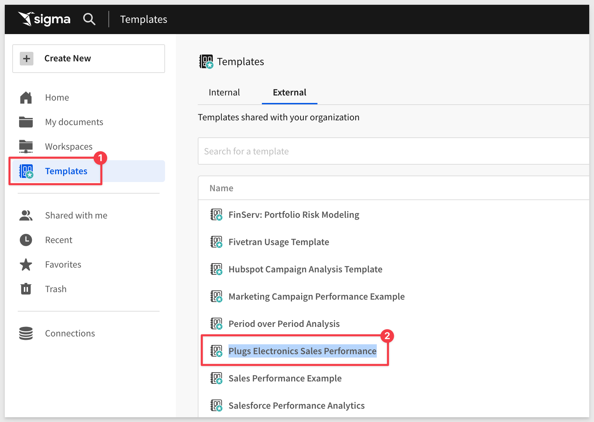
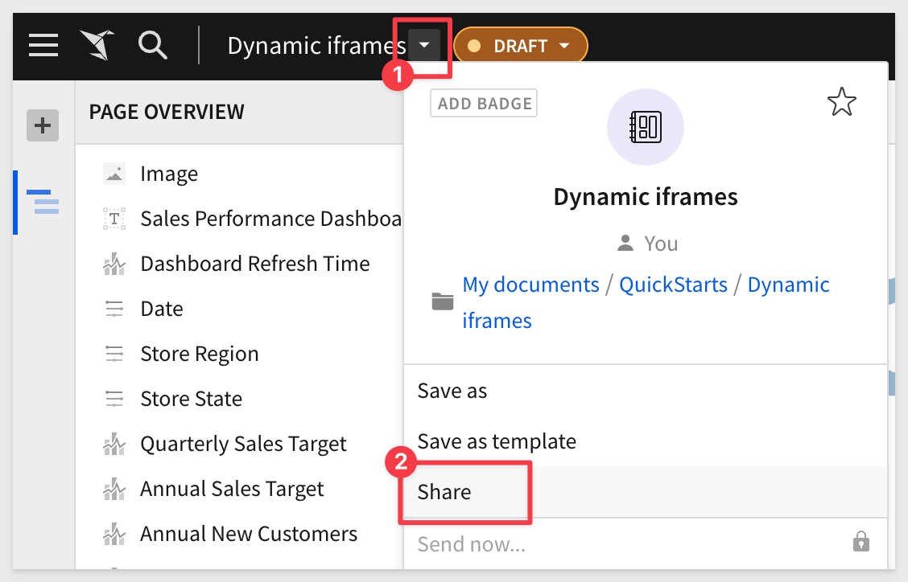
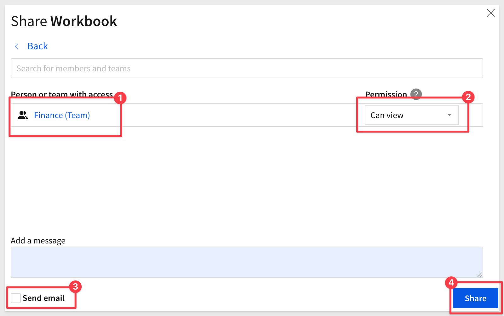
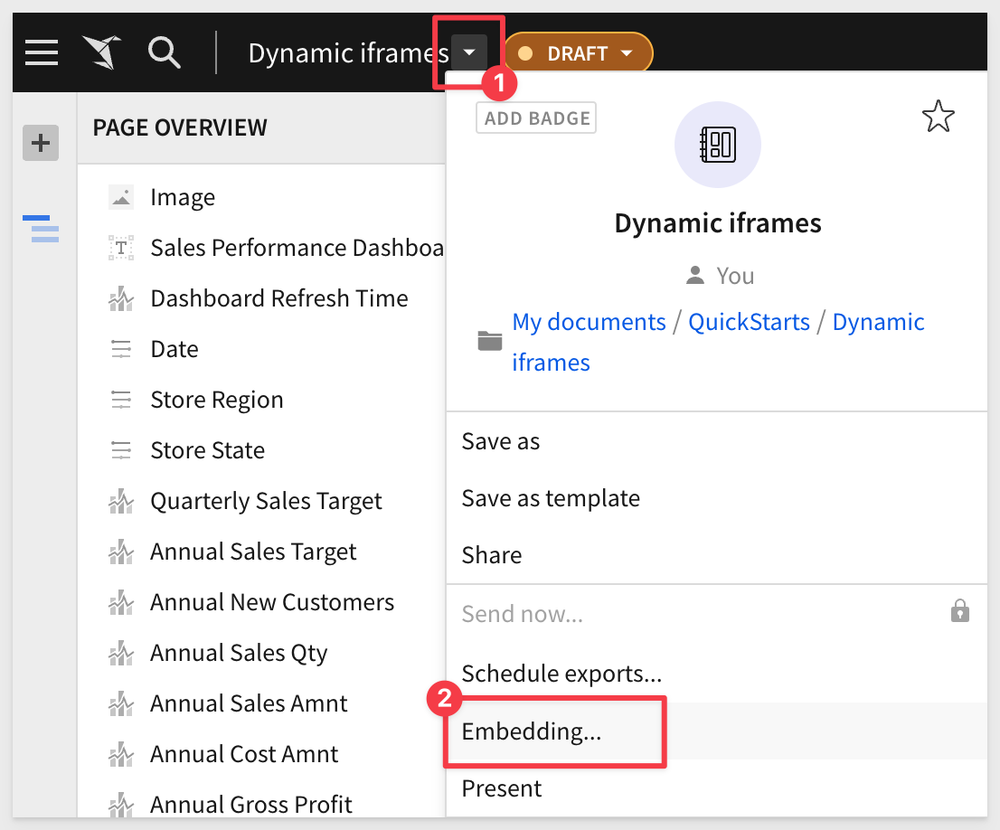
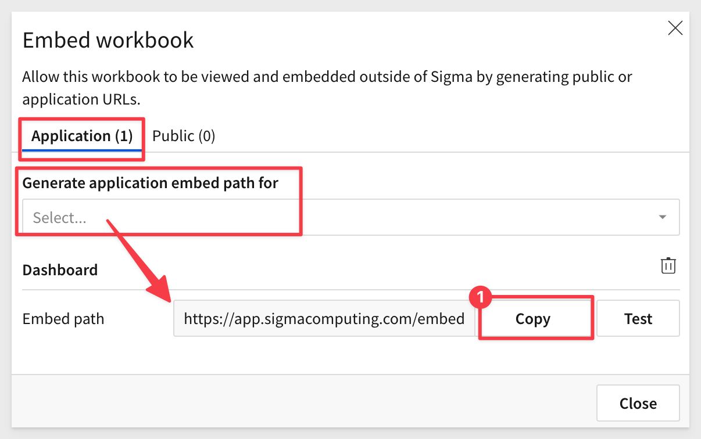
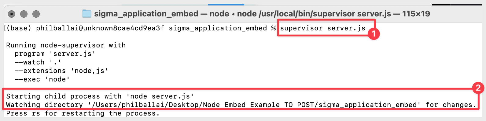
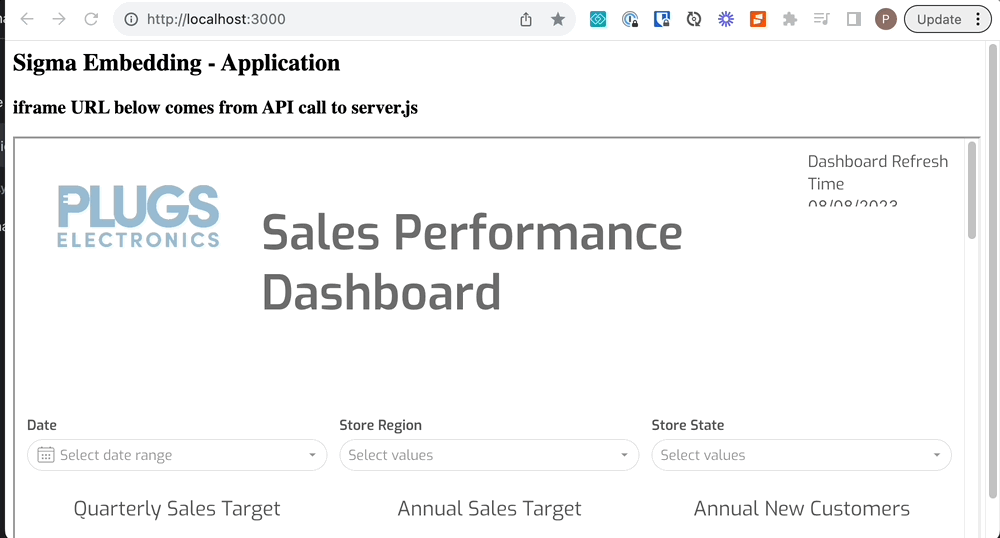
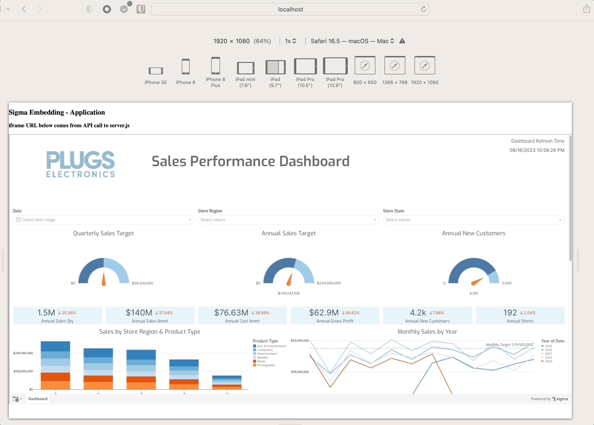

author: pballai
id: embedding_dynamic_iframes
summary: embedding_dynamic_iframes
categories: Embedding
environments: web
status: Published
feedback link: https://github.com/sigmacomputing/sigmaquickstarts/issues
tags: Default
lastUpdated: 2023-08-18

# How to: Responsive iframes with Sigma

## Overview 
Duration: 5 

One of the many challenges developers face when building applications is usability, and a common problem is making it obvious that a user needs to scroll to see more data.

This problem can be compounded when embedding content from any external application; even Sigma. 

Scroll bars on both parent and iframe content can significantly impact the user experience, often in a negative way. Here's why:

 <ul>
      <li><strong>Confusion and difficulty navigating:</strong> When both the parent page and the iframe have scroll bars, it can be confusing for the user to navigate. They may not immediately realize which scroll bar is active, leading to a disjointed and potentially frustrating experience.</li>
      <li><strong>Nested scrolling:</strong> If the iframe content is longer than the parent page's height, users might have to deal with nested scrolling. This means they have to scroll down within the iframe before being able to continue scrolling on the parent page. This is generally considered poor user experience design and can be very frustrating</li>
      <li><strong>Aesthetically unpleasing:</strong> Multiple scroll bars can make the page look cluttered and messy, which can detract from the overall aesthetic of the website.</li>
      <li><strong>Limited view of content:</strong> If an iframe has a scroll bar, it means that all the content isn't immediately visible to the user. This might cause users to miss important information if they don't realize they need to scroll within the iframe.</li>
      <li><strong>Mobile unfriendly:</strong> On mobile devices, where screen real estate is limited, scroll bars within iframes can be particularly problematic. Users may accidentally scroll within the iframe when they intended to scroll on the parent page, or vice versa.</li>
</ul>

To avoid these issues, it's generally best to avoid having scroll bars on both the parent and the iframed content. This can often be achieved by making the iframe (and potentially also the parent page) responsive, so that the iframe adjusts its size based on the content it contains and the size of the viewport.

 <ul>
      <li><strong>Better user experience:</strong> A responsive iframe ensures that the content within the iframe is displayed correctly regardless of the size of the user's device or browser window. This is particularly important for users on mobile devices or tablets, as it allows the iframe content to resize and fit the smaller screen sizes.</li>
      <li><strong>Consistency across devices:</strong> Since different users may be accessing the content on different devices (desktops, laptops, tablets, phones), it's important that the content looks good on all of these devices. A responsive iframe will resize based on the size of the user's device or browser window, ensuring that the content is always displayed in a user-friendly manner.</li>
      <li><strong>Keeping up with modern web standards:</strong> As of the current web standards, responsiveness is a key factor in web design and development. It's almost expected that any web page or web application be responsive to provide the best user experience.</li>
</ul>

In essence, making an iframe dynamic or responsive is about ensuring that the content within the iframe is accessible, user-friendly, and looks good on all devices and window sizes. It's about creating a better, more consistent user experience.

Since Sigma uses iframes for embedding, it is fairly easy to avoid this situation.

This QuickStart assumes you have already taken the QuickStart [Embedding 1: Prerequisites](https://quickstarts.sigmacomputing.com/guide/embedding_1_prerequisites/index.html?index=..%2F..index#0) so that you have a sample environment to complete the tasks in this QuickStart.

 ### Target Audience
Developers who are interested in how to leverage dynamic iframes to embed Sigma into their applications.

### Prerequisites

<ul>
  <li>A computer with a current browser. It does not matter which browser you want to use.</li>
  <li>Access to your Sigma environment.</li>
  <li>A working web server based on Node.js as demonstrated in the QuickStart Embedding 1: Prerequisites</li>
  <li>Some familiarity with Sigma is assumed. Not all steps will be shown as the basics are assumed to be understood.</li>
</ul>

<aside class="postive">
<strong>IMPORTANT:</strong><br> Sigma recommends that you use non-production resources when doing QuickStarts.
</aside>

<button>[Sigma Free Trial](https://www.sigmacomputing.com/free-trial/)</button>


<!-- END OF SECTION-->

## Sigma Content
Duration: 20

Login to Sigma and navigate to the `Templates` page.

Click to select the `Plugs Electronics Sales Performance` template:



`Dismiss` the dialogue asking if you want to use your own data.

Click the `Save As` button and name the Workbook `Dynamic iframes`.

`Share` the Workbook with the `Finance Team` we created in the earlier QuickStarts.





Open the `Embedding` controls:



Select `Dashboard` for just the entire workbook and select `Copy`:



In the node project folder, open `server.js` and replace the value for `EMBED PATH` with this new value.

<aside class="negative">
<strong>NOTE:</strong><br> If you recently completed the QuickStarts for embedding, you probably already have valid APIs and Embed Secrets. If you don't, you will need to generate them from "Administration > "APIs & Embed Secrets".
</aside>


Ensure that server.js has the correct API and Embed Secrets.

Once server.js is setup, make sure that node's express server is running:



Browse to localhost:3000 to verify that we have a working application with our Sigma table on it.

When you reduce the size of the browser you can see that there are two scroll bars present. 



This is what we want to try and avoid by making our iframe dynamic.


<!-- END OF SECTION-->

## A Quick (partial) Solution
Duration: 20

Since we are embedding content that is created in Sigma, it is not always possible to ensure that the Sigma content will "fit" inside a static iframes dimensions, since the content may vary depending on use-case.

Without control over the iframe's content, it's challenging to have a fully dynamic solution that adjusts to the exact height of the content every time.

Given the initial constraint, one approach might be to:

1: Set a default height for the iframe that should ideally fit most of the content you expect to embed.

2: Allow the iframe to scroll if its content exceeds this default height.

**This ensures that:**

1: The parent application remains without a scrollbar, providing a cleaner overall look.

2: The iframe will only show a scrollbar when absolutely necessary (i.e., when its content exceeds its set height).

This approach provides somewhat of a balance between user experience and practicality, given the constraints, but does not fully address the issue of scroll bars.

In this scenario, even when the browser is full screen, the embedded content we have elected to provide from Sigma will be too long, and thus the iframe requires a scroll bar. 

The parent page, however, should still avoid having a scroll bar.

For this example, we will simply allow the iframe to scroll, but ensure the parent page does not. 

Replace the code in your embed project folder for `index.html` with this code:
```sql
<!DOCTYPE html>
<html>

<head>
    <title>Sigma Embedding - Application</title>
    <style>
        /* Ensure html and body tags occupy full height */
        html, body {
            height: 100%; /* This makes sure the entire height of the viewport is covered by the page. */
            margin: 0;    /* Resetting default margins to prevent any unexpected space. */
            padding: 0;   /* Resetting default padding. */
            overflow: hidden; /* This hides scrollbars and prevents scrolling on the parent page. */
        }

        /* Set a height for the iframe and allow it to scroll */
        #sigmaDashboard {
            height: 85vh; /* This sets the iframe height to be 85% of the viewport's height. */
            width: 100%;  /* This ensures the iframe takes the full width of its container. */
            overflow: auto; /* This allows scrolling within the iframe if its content exceeds its height. */
        }
    </style>
</head>

<body>
    <h2>Sigma Embedding - Application</h2>
    <h3>iframe URL below comes from API call to server.js</h3>
    <iframe id="sigmaDashboard"></iframe> <!-- This is the iframe that will embed the content. -->
    <script>
        /* Define the API URL from where the iframe's source will be fetched. */
        const URL = "http://localhost:3000/api/foo";

        /* Fetch the URL using the Fetch API */
        fetch(URL)
        .then(data => { 
            return data.json(); /* Parse the response data as JSON. */
        })
        .then(res => { 
            /* Set the iframe's source URL to the value fetched from the API. */
            document.getElementById("sigmaDashboard").src = res.url;
        })
        .catch(e => {
            /* Log any errors that occur during the fetch. */
            console.log(e);
        });
    </script>
</body>

</html>

```

<aside class="negative">
<strong>NOTE:</strong><br> We have added in-line comments to explain what each line is doing in the html file.
</aside>

Once you have made the changes and saved `index.html`, refresh the browser page. 

Now we only have one scroll bar (in the embed) and the parent application does not present a scroll bar regardless of how we resize the browser. 


<!-- END OF SECTION-->

## Alternative Method
Duration: 20

The calc() function in CSS can be used to dynamically compute values for various properties. While calc() can be powerful in many scenarios, it's important to understand its limitations and its applicability to your specific case.

In our example, the calc() function can be used to compute dimensions based on various units, combinations of units, or viewport sizes.

For example, if we want the iframe to take up the full viewport height minus some space for a header, you could use calc():

```code
#sigmaDashboard {
    height: calc(100vh - 60px); /* Assuming 60px is the height of your header */
    width: 100%;
    overflow: auto;
}
```

This would make the iframe's height equal to the full viewport height minus 60 pixels for the header.

To test this, we simple replace the relevant code for `#sigmaDashboard`. Here is that code for your convienence.

```code
<!DOCTYPE html>
<html>

<head>
    <title>Sigma Embedding - Application</title>
    <style>
        /* Ensure html and body tags occupy full height */
        html, body {
            height: 100%;
            margin: 0;
            padding: 0;
            overflow: hidden; /* To prevent scrolling on the parent */
        }
        /* Set a default height for the iframe and allow it to scroll if content exceeds */
            #sigmaDashboard {
                height: calc(100vh - 60px); /* Assuming 60px is the height of your header */
                width: 100%;
                overflow: auto;
            }
    </style>
</head>

<body>
    <h2>Sigma Embedding - Application</h2>
    <h3>iframe URL below comes from API call to server.js</h3>
    <iframe id="sigmaDashboard"></iframe>
    <script>
        const URL = "http://localhost:3000/api/foo";
        fetch(URL)
        .then(data => { return data.json() })
        .then(res => { document.getElementById("sigmaDashboard").src = res.url })
        .catch(e => console.log(e));
    </script>
</body>

</html>
```

### A Few Things to Note:

 <ul>
      <li><strong>Content Size Unknown:</strong> The challenge with our iframe is that, since we may not control its content, we don't know its exact height. calc() can help with relative dimensions based on the viewport or other elements, but it can't determine the height of content inside an iframe from an external source.</li>
      <li><strong>Doesn't Eliminate Scroll:</strong> Using calc() in this manner doesn't eliminate the need for a scrollbar if the content inside the iframe exceeds its height. It just helps in setting the iframe's height relative to other known dimensions.</li>
      <li><strong>Complementary to Other CSS:</strong> calc() is not an alternative to the other CSS properties or values we have used; it's complementary. We can use it in conjunction with other properties to achieve the desired layout.</li>
</ul>
 
In summary, while calc() is a valuable tool in CSS for dynamic calculations, it doesn't immediately solve the scrollbar issues. It can aid in setting dimensions based on other known dimensions or viewport sizes, but it won't "dynamically" adjust the iframe's height based on its content. 


<!-- END OF SECTION-->

## Responsive iframes
Duration: 5

Sigma provides a Javascript method that enables developers to dynamically adjust the iframe height, based on the content's actual height.

This is especially useful when the content inside the iframe can change dynamically, leading to different height requirements.

**This can be used to fully address the scroll bar issues.**

The method is `workbook:pageheight:onchange`, and is an "event" in Sigma.

You can read about [Javascript actions in user-backed embeds here.](https://help.sigmacomputing.com/hc/en-us/articles/6797945342483-User-Backed-Embedding-)

We can use this event to adjust the iframe's height in real-time, ensuring that the iframe always matches the height of its content.

Here's are the steps required to integrate the `workbook:pageheight:onchange` event, along with sample code:

**1: Listen for the Event:**<br>
You'll need to add an event listener to the window object that listens for the message event. This is because cross-document communication (like between a parent page and an iframe) uses the postMessage method and message event.

**2: Adjust the iframe Height:**<br>
    When the event is received, we check if its type matches 'workbook:pageheight:onchange' and then adjust the iframe height based on the pageHeight value provided.

**3: Modified code:**<br>
Here's the modified script to include the handling of the workbook:pageheight:onchange event:

```code
<!DOCTYPE html>
<html>

<head>
    <title>Sigma Embedding - Application</title>
    <style>
        /* Ensure the entire height of the viewport is covered by the page. */
        html, body {
            height: 100%;
            margin: 0;    /* Reset default margins to prevent any unexpected spacing. */
            padding: 0;   /* Reset default padding. */
            overflow: hidden; /* Prevent scrolling on the parent page. */
        }

        /* Set default dimensions for the iframe. */
        #sigmaDashboard {
            height: 85vh; /* Set the iframe height to be 85% of the viewport's height. */
            width: 100%;  /* Ensure the iframe takes the full width of its container. */
            overflow: auto; /* Allow content inside the iframe to scroll if it exceeds the iframe's height. */
        }
    </style>
</head>

<body>
    <h2>Sigma Embedding - Application</h2>
    <h3>iframe URL below comes from API call to server.js</h3>
    <iframe id="sigmaDashboard"></iframe> <!-- The iframe that will embed content. -->

    <script>
        /* Define the API URL from which the iframe's source will be fetched. */
        const URL = "http://localhost:3000/api/foo";

        /* Fetch the URL using the Fetch API. */
        fetch(URL)
        .then(data => {
            return data.json(); /* Parse the fetched data as JSON. */
        })
        .then(res => {
            const iframe = document.getElementById("sigmaDashboard");
            iframe.src = res.url; /* Set the iframe's source URL to the value fetched from the API. */

            /* Listen for messages (events) from the iframe content. */
            window.addEventListener('message', function(event) {
                /* Check if the received event is of type 'workbook:pageheight:onchange'. */
                if (event.data && event.data.type === 'workbook:pageheight:onchange') {
                    /* Adjust the iframe's height based on the height of its content. */
                    iframe.style.height = event.data.pageHeight + 'px';
                }
            });
        })
        .catch(e => {
            /* Log any errors that occur during the fetch operation. */
            console.log(e);
        });
    </script>
</body>

</html>

```

<aside class="positive">
<strong>IMPORTANT:</strong><br> For the postMessage and event listener to work, the iframe's source domain must allow cross-document messaging with the parent page's domain. If Sigma's iframe content sends this event using postMessage, it should work. However, if there are any security restrictions, you might encounter issues. Always ensure that you're only accepting messages from trusted sources to prevent potential vulnerabilities.
</aside>

In the sample code:
    <ul>
        <li>The iframe is dynamic because it adjusts its height in real-time based on the content height, thanks to the Sigma event.</li>
        <li>The iframe is also responsive in terms of width because it adjusts to the full width of its container, ensuring it looks good on all screen sizes.</li> 
    </ul>

After updating our HTML page to use this code, we see the following results (using Safari's developer tools to simulate different device screen sizes):




<!-- END OF SECTION-->

## What we've covered
Duration: 5

In this lab we learned how to implement a responsive iframe Sigma embed into an html page, using CSS and Javascript methods.

Choosing the best approach is up to the developer, but we hope this QuickStart provided useful information when embedding Sigma. 

<!-- THE FOLLOWING ADDITIONAL RESOURCES IS REQUIRED AS IS FOR ALL QUICKSTARTS -->
**Additional Resource Links**

[Help Center Home](https://help.sigmacomputing.com/hc/en-us)<br>
[Sigma Community](https://community.sigmacomputing.com/)<br>
[Sigma Blog](https://www.sigmacomputing.com/blog/)<br>
<br>

[](https://twitter.com/sigmacomputing)&emsp;
[](https://www.linkedin.com/company/sigmacomputing)
[](https://www.facebook.com/sigmacomputing)


<!-- END OF WHAT WE COVERED -->
<!-- END OF QUICKSTART -->