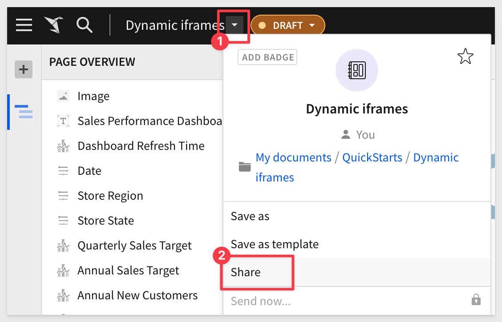
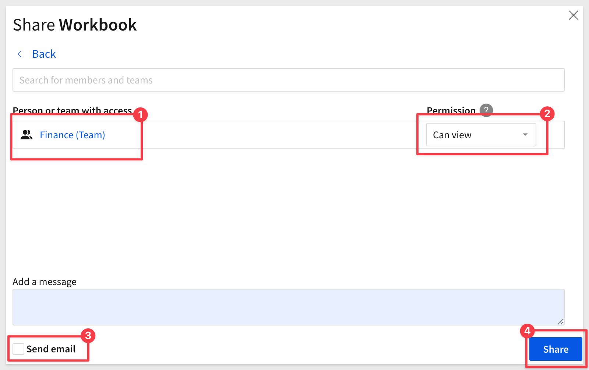

author: pballai
id: embedding_how_to_federate_access_with_sigma
summary: embedding_how_to_federate_access_with_sigma
categories: Administration
environments: web
status: Published
feedback link: https://github.com/sigmacomputing/sigmaquickstarts/issues
tags: default
lastUpdated: {lasted updated using the date format yyyy-mm-dd}

# How to: Federate Access with Sigma Embedding

## Overview 
Duration: 5 

Sigma's embedded solution is very flexible and can support a wide variety of use cases. For example, 

1: Provide all of your customers with a common dashboard
2: Only some customers a more specialized dashboard
3: Support users at differing levels of functionality (ie: view only versus edit)
4: Combinations of all three or other scenarios

Sigma uses federated user access to support all these use cases and more. 

Federated user access refers to a mechanism that allows users to use a single set of credentials (such as username and password or other authentication methods) to access multiple software systems without requiring separate accounts for each system. 

This is typically achieved through single sign-on (SSO) technologies and trust relationships established between the participating systems.

With Sigma embedding, the user logs onto your application (parent application), is authenticated (and optionally assigned a role), and that information is passed to Sigma when an embed in part of your application. 

It is important to understand that Sigma provides it's own role-based-access-control (RBAC) system and some customers use that exclusively. However, many customers have an existing identity management provider (IDP) and they can leverage that with Sigma instead. Sigma even supports user and group automation using a system for cross-domain identity management (SCIM). 

If you are interested in learning more about [IDP-based Sigma implementations, click here.](https://help.sigmacomputing.com/hc/en-us/articles/1500002044821-Managing-Users-and-Teams-with-SCIM)

In this QuickStart, we will use the local node.js application framework we created in [QuickStart: Embedding 3: Application Embedding](https://quickstarts.sigmacomputing.com/guide/embedding_3_application_embedding/index.html?index=..%2F..index#0), and Sigma for team and workspace assignments, at runtime. 

 ### Target Audience
Anyone who is trying to create QS content for Sigma. 

### Prerequisites

<ul>
  <li>A computer with a current browser. It does not matter which browser you want to use.</li>
  <li>Access to your Sigma environment.</li>
  <li>Some familiarity with Sigma is assumed. Not all steps will be shown as the basics are assumed to be understood.</li>
  <li>Completion of the QuickStart: Embedding 3: Application Embedding</li>
</ul>

<aside class="postive">
<strong>IMPORTANT:</strong>  Sigma recommends that you use non-production resources when doing QuickStarts.
</aside>

<button>[Sigma Free Trial](https://www.sigmacomputing.com/free-trial/)</button>
  
### What You’ll Learn
How to apply Sigma approved Markdown for your QS.

## Use Case 1: Common Dashboard
Duration: 20

In this use case, we want to embed a Sigma dashboard inside our parent application, and make it accessible to all customers after they are authenticated.

Log in to Sigma and navigate to the `Templates` page.

Click to select the `Plugs Electronics Sales Performance` template:

`Dismiss` the dialogue asking if you want to use your own data.

Click the `Save As` button and name the Workbook `Dynamic iframes`.

`Share` the Workbook with the `Finance Team` we created in the earlier QuickStarts.

Open the `Embedding` controls:

Select `Dashboard` for just the entire workbook and select `Copy`:

In the node project folder, open `server.js` and replace the value for `EMBED PATH` with this new value.

<aside class="negative">
<strong>NOTE:</strong>  If you recently completed the QuickStarts for embedding, you probably already have valid APIs and Embed Secrets. If you don't, you will need to generate them from "Administration > "APIs & Embed Secrets".
</aside>

Once server.js is setup, make sure that node's express server is running:

Browse to localhost:3000 to verify that we have a working application with our Sigma table on it.

First, lets create a new `Team` and `Workspace` in Sigma.

<!-- END OF SECTION-->

## **NEXT SECTION**
Duration: 20

<!-- END OF SECTION-->

## **NEXT SECTION**
Duration: 20

<!-- END OF SECTION-->

## What we've covered
Duration: 5

In this lab we learned how to.........

INSERT FINAL IMAGE OF BUILD IF APPROPRIATE

<!-- THE FOLLOWING ADDITIONAL RESOURCES IS REQUIRED AS IS FOR ALL QUICKSTARTS -->
**Additional Resource Links**

[Help Center Home](https://help.sigmacomputing.com/hc/en-us) 
[Sigma Community](https://community.sigmacomputing.com/) 
[Sigma Blog](https://www.sigmacomputing.com/blog/) 
 

&emsp;

<!-- END OF WHAT WE COVERED -->
<!-- END OF QUICKSTART -->