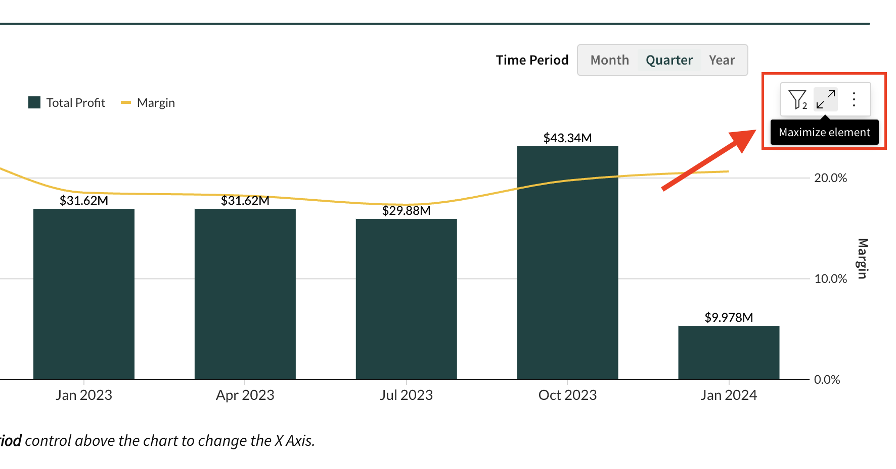
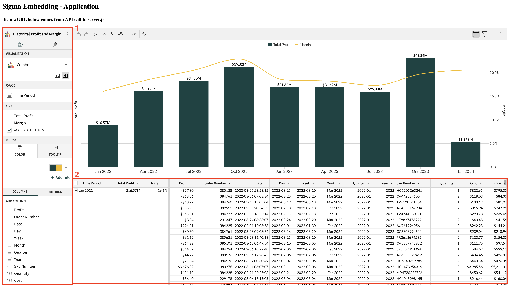

author: pballai
id: embedding_how_to_federate_access_with_sigma
summary: embedding_how_to_federate_access_with_sigma
categories: Embedding
environments: web
status: Published
feedback link: https://github.com/sigmacomputing/sigmaquickstarts/issues
tags: default
lastUpdated: 2023-08-17

# How to: Federate Access with Sigma Embedding

## Overview 
Duration: 5 

Sigma's embedded solution is highly flexible and can accommodate a myriad of use cases. These include:
<ul>
      <li>Providing all of your customers with a common dashboard,</li>
      <li>Offering only certain customers a more specialized dashboard,</li>
      <li>Supporting users at varying levels of functionality (e.g., view-only versus edit), and</li>
      <li>Any combination of the above scenarios or other possibilities.</li>
</ul>

Sigma employs federated user access to cater to all these needs and beyond. This is often realized through single sign-on (SSO) technologies and the establishment of trust relationships between the systems involved.

With Sigma embedding, users log onto your main application, get authenticated (with an optional role assignment), and this information is conveyed to Sigma when a part of your app requires embedding.

It's crucial to note that Sigma has its proprietary role-based-access-control (RBAC) system. While some customers exclusively use this system, many others with an existing identity management provider (IDP) prefer to integrate that with Sigma. 

For further details on [using SSO with Sigma, click here.](https://help.sigmacomputing.com/hc/en-us/articles/360037429833-Single-Sign-On-with-SAML)

For details on [managing user and teams with SCIM, click here.](https://help.sigmacomputing.com/hc/en-us/articles/1500002044821-Manage-Users-and-Teams-with-SCIM)

In this QuickStart, we will use the local node.js application framework we created in [QuickStart: Embedding 3: Application Embedding](https://quickstarts.sigmacomputing.com/guide/embedding_3_application_embedding/index.html?index=..%2F..index#0)

 ### Target Audience
Sigma Administrators and developers keen on understanding strategies for dictating what users can view and perform when Sigma is embedded within an application.

### Prerequisites

<ul>
  <li>A computer with a current browser. It does not matter which browser you want to use.</li>
  <li>Access to your Sigma environment.</li>
  <li>Some familiarity with Sigma is assumed. Not all steps will be shown as the basics are assumed to be understood.</li>
  <li>Completion of the QuickStart: Embedding 3: Application Embedding</li>
</ul>

<aside class="postive">
<strong>IMPORTANT:</strong>  Sigma recommends that you use non-production resources when doing QuickStarts.
</aside>

<button>[Sigma Free Trial](https://www.sigmacomputing.com/free-trial/)</button>
  
### What You’ll Learn
Master the art of employing Sigma Teams and Workspaces to supply shared and exclusive content to embedded users, with varied functionality tiers.

<!-- END -->

## Federated Access
Duration: 5 

Federated user access refers to a mechanism that allows users to use a single set of credentials (such as username and password or other authentication methods) to access multiple software systems without requiring separate accounts for each system. This is typically achieved through single sign-on (SSO) technologies and trust relationships established between the participating systems.

**There are Advantages**:

1. **User Convenience**: Users don't have to remember multiple passwords. They can log in once and access multiple systems seamlessly.
  
2. **Improved Security**: Centralized authentication reduces the risk of password fatigue, where users reuse passwords or choose weak passwords because they have too many to remember. With federation, strong authentication mechanisms can be uniformly enforced across all connected systems.
   
3. **Efficient User Management**: IT departments can manage user accounts centrally. When a user leaves the organization or changes roles, access can be modified or revoked from a single point, ensuring timely and consistent updates across all systems.
  
4. **Reduced Administrative Overhead**: With fewer accounts to manage, there's a reduction in the time and resources required for account maintenance, password resets, and other administrative tasks.

5. **Interoperability**: Federated user access often relies on standards such as SAML (Security Assertion Markup Language), which ensures different systems, even from different vendors, can work together seamlessly.

To read more about how [Sigma supports SSO with SAML, click here.](https://help.sigmacomputing.com/hc/en-us/articles/360037429833-Single-Sign-On-with-SAML)

**There Can Be Some Challenges**:

1. **Complex Setup**: Establishing trust relationships and integrating systems can be technically challenging, especially when dealing with legacy systems or those without native federation support. Sigma makes this easy by adopting the parent applications security at runtime, via our server-side API.

2. **Potential Single Point of Failure**: If the central identity provider suffers downtime or issues, it might affect user access to all connected systems.

3. **Security Concerns**: While federation can enhance security in many ways, it's crucial to secure the central identity provider. If compromised, attackers might gain access to all linked systems.

4. **Interoperability Issues**: While standards exist, not all systems interpret or implement these standards consistently, leading to potential integration challenges.

**Common Use Cases**:

1. **Business Partnerships**: Companies that collaborate frequently might use federated access to provide their employees access to shared tools and platforms without creating multiple accounts.
  
2. **Cloud Services**: As organizations adopt more cloud services, federated user access ensures employees can seamlessly access all cloud platforms without multiple logins.

3. **Academic Institutions**: Universities and colleges often federate access to libraries, learning management systems, and other resources, allowing students and faculty to access everything they need with a single set of credentials.

4. **Enterprise Intranets and Applications**: Large organizations might have many internal tools, dashboards, and systems. Federated access ensures employees can navigate these resources smoothly.

Now that we have an understanding of federated access at a high level, let's explore how you can leverage it with Sigma.

<!-- END -->

## Team and Workspace Creation
Duration: 20

Log in to Sigma and navigate to `Administration` > `Teams` and click `Create Team`:

Name the team `all_clients_team`, set it to `Private`, check the box to `Create a Workspace` and click `Create`:

A new `Workspace` is created for you automatically, with the name `all_clients_team`.  

By doing this you create a Team and create a Workspace. **It also gives the team access to that workspace, automatically.**

Workspaces serve multiple purposes, but in this use-case, we will use one to store content that is common to all our customers.

Workspaces are shown by returning to the `Home` page (click the white crane icon in the upper left corner) and clicking `Workspaces`:

<aside class="positive">
<strong>IMPORTANT:</strong>  Adopt clear naming conventions for teams and workspaces to ensure easy understanding of their purpose and contents. To keep embedded URLs readable and easy to troubleshoot, avoid spaces in names for Teams, Account Types, and User Attributes. Spaces necessitate URL encoding, which can clutter the URL and make it less intuitive. Ensure you only URL encode when dealing with HTML special characters or spaces.
</aside>

Let's change the name of the new Workspace to something more descriptive. We will use `Curated Master Dashboards`:

<aside class="positive">
<strong>IMPORTANT:</strong>  Creating a team with all of your embedded customers means that you don’t have to give explicit access to the “Curated Dashboard” Workspace every time, which is less of a headache for onboarding. It’s like a catch all.
</aside>

Once you’ve done this, server.js (our server-side API from QuickStart Embedding 3: Application Embedding) needs to be updated to pass the new team value:

<aside class="negative">
<strong>NOTE:</strong>  We reference server.js only as an example of how the code looks, based on our example code in previous QuickStarts. It is assumed that your code may be different, but the value passed as a parameter will still need to be the same.
</aside>

<!-- END -->

## Content to Embed
In order to test this, we need some content to embed. We will use Sigma's default content, provided via a template. 

<aside class="negative">
<strong>NOTE:</strong>  We are not showing every step in the embed process now, as it is assumed you have completed the QuickStart Embedding 3: Application Embedding.
</aside>

Navigate to the `Templates` page.

Click to select the `Plugs Electronics Sales Performance` template:

`Dismiss` the dialogue asking if you want to use your own data.

Click the `Save As` button and name the Workbook `Common Dashboard`.

Be sure to save the Workbook to the `Curated Master Dashboards` folder. **Failure to do so will result in the Workbook not being shared.**

<aside class="positive">
<strong>IMPORTANT:</strong>  Though Workbooks can be shared individually, saving them to a Workspace shared with a Team streamlines permission management. This approach becomes increasingly beneficial as the volume of Workbooks expands over time.
</aside>

<aside class="negative">
<strong>NOTE:</strong>  If you saved the Workbook to the wrong location, Sigma has a "move" feature that allows you to change where a Workbook is stored. 
</aside>

Now, our `Common Dashboard` will adopt the permissions of the `Curated Master Dashboard` Workspace.

Open the `Embedding` controls:

Select `Dashboard` for only the Dashboard page and then select `Copy`:

In the node project folder, open `server.js` and replace the value for `EMBED PATH` with this new value.

<aside class="negative">
<strong>NOTE:</strong>  If you recently completed the QuickStarts for embedding, you probably already have valid APIs and Embed Secrets. If you don't, you will need to generate them from "Administration > "APIs & Embed Secrets".
</aside>

Let's pass a new embed user into Sigma to demonstrate this works as expected.

Edit server.js to change the embed user and userID to use `common_client@sigmacomputing.com`. 

Set the values as displayed in image below, specifically for `&email` and `&external_user_id`, then save the changes:

Once server.js is setup, make sure that node's express server is running:

`Browse to localhost:3000` to verify that we have a working application with our Sigma dashboard on it:

Notice that if you click on the  icon, for the `Sales by Store Region & Product Type` chart controls (the 3-dot menus, upper right corner of the chart), you notice that there is limited functionality. This is because we set the `all_clients_team` to `view` access only:

We can see some data, but are not allowed to explore it. We do not see the Sigma Element Panel either.

In Sigma, navigate back to `Administration` > `Teams` and click into the `all_clients_team`. 

The embed user we just used (via the server.js api) was added to the team automatically. 

<aside class="positive">
<strong>IMPORTANT:</strong>  With Sigma embedded, users do not need to be maintained in two different places. Sigma adopts the security from your application at runtime via the server-side API.
</aside>

Now, any new embed user who is assigned to the  `all_clients_team`, has access to the `Common Dashboard` that is made available by embedding it in the parent application.

You can check which people or teams have access to a workbook by opening the workbook and clicking on the `Share` link.

In this case, we can see that our `all_clients_team` has view access that was inherited from a folder. We know this folder is our `Curated Master Dashboards` folder. 

<!-- END OF SECTION-->

## Unique Content
Duration: 20

As Sigma embed customers evolve in their implementations, there's frequently a desire to enhance the functionalities provided to their end-users. Often, this materializes as a "premium" offering. Such upgrades can be driven by various factors, be it potential revenue growth, competitive pressures, or other motivations.

We have shown how all your clients can access common content. 

Let's consider the case where you want to provide some specialized reports or dashboards to some of your customers. In addition to that, you also want to provide "tiers" of functionality like view, edit and share for this content. 

Sigma supports this use case through `Teams` and `Account Types`. 

Using the same framework we have already explored, we can create easily control what a user can access, and what they are allow to do with that content. 

Back in Sigma, create a new private `Team` called `CustomerA` and check the `Create a Workspace` check-box on.

<aside class="negative">
<strong>NOTE:</strong>  Sigma enables you to automate this process by calling the teams API. The API contains a boolean that allows you to also create a Workspace associated with a Team at the same time. We recommend this as part of your embed onboarding process.
</aside>

For more information on the Teams API, [click here](https://help.sigmacomputing.com/hc/en-us/articles/4408555643923-Team-API).

Next, you need to assign permissions to `CustomerA` users that will be able to explore our Common Dashboard. 

You do this in Sigma with `Account Types` which control permissions in the application. 

In Sigma, `Administration` > `Account Types`, create a new `Account Type` called `dashboard-editor` with `Edit Workbook` and `Contribute to Shared Folders` permissions. 

Please note, `View Workbook` and `View Dataset` are selected by default. **Keep those checked and don’t add spaces to the Account Type name!**

Click the `Create` button:

For more information on [using Account Types, click here.](https://help.sigmacomputing.com/hc/en-us/articles/360037430633-User-account-types)

We also need to allow `CustomerA` to explore our `Common Dashboard`. 

We could just grant then explore rights to the `Curated Master Dashboards` Workspace but maybe we don't want them to have explore on all the workbooks we store there later. 

Let's grant `CustomerA` explore rights to directly on the `Common Dashboard`

Open the Workbook and click `Share`.  You can do this from the Workbook itself, or from where the Workbook is stored:

Share the Workbook withe `CustomerA` and `Explore` rights:

Make the following four changes to server.js:

Refresh the browser page. Now we can see the dashboard which is stored in the `Common` Workpsace but we also have `Explore` rights.

Now if we click the  icon for the `Sales by Store Region & Product Type` chart, we can see that we have the ability to explore the underlying data. 

  

Item #1 is the `Element Panel` and item #2 is the underlying data.

This example showed how we can provide one customer a different level of access ("Can Explore") than all the rest of the customers. 

We also demonstrated how we can pass multiple account types in the API.

It also touched on creating a customer specific workspace so that only one customer (CustomerA in this example) could source content from.

Through this flexible architecture, it is possible to create a variety of scenarios to match your customer segmentation needs. 

<!-- END OF SECTION-->

## What we've covered
Duration: 5

In this QuickStart, we learned how to use Sigma Teams and Workspaces to provide common and isolated content for embedded consumers, with different levels of functionality.

There is information on related content you can also review:

[Embedding QuickStarts](https://quickstarts.sigmacomputing.com/?cat=embedding) 
[Row Level Security QuickStart](https://quickstarts.sigmacomputing.com/guide/embedding_4_row_level_security/index.html?index=..%2F..index#0)

<!-- THE FOLLOWING ADDITIONAL RESOURCES IS REQUIRED AS IS FOR ALL QUICKSTARTS -->
**Additional Resource Links**

[Help Center Home](https://help.sigmacomputing.com/hc/en-us) 
[Sigma Community](https://community.sigmacomputing.com/) 
[Sigma Blog](https://www.sigmacomputing.com/blog/) 
 

&emsp;

<!-- END OF WHAT WE COVERED -->
<!-- END OF QUICKSTART -->