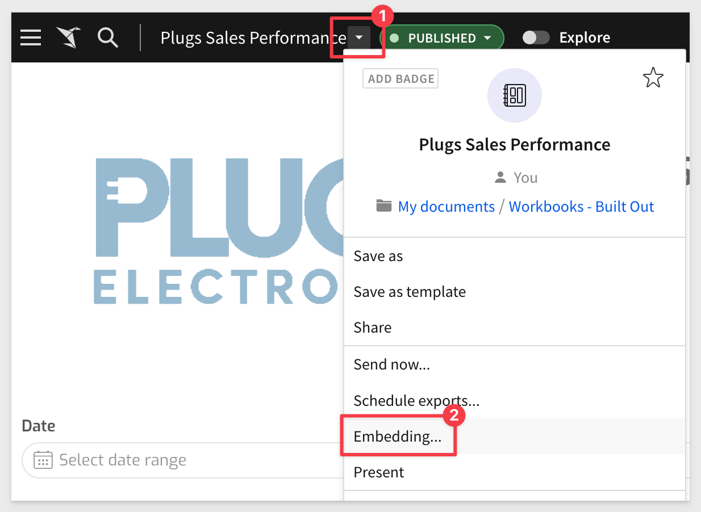
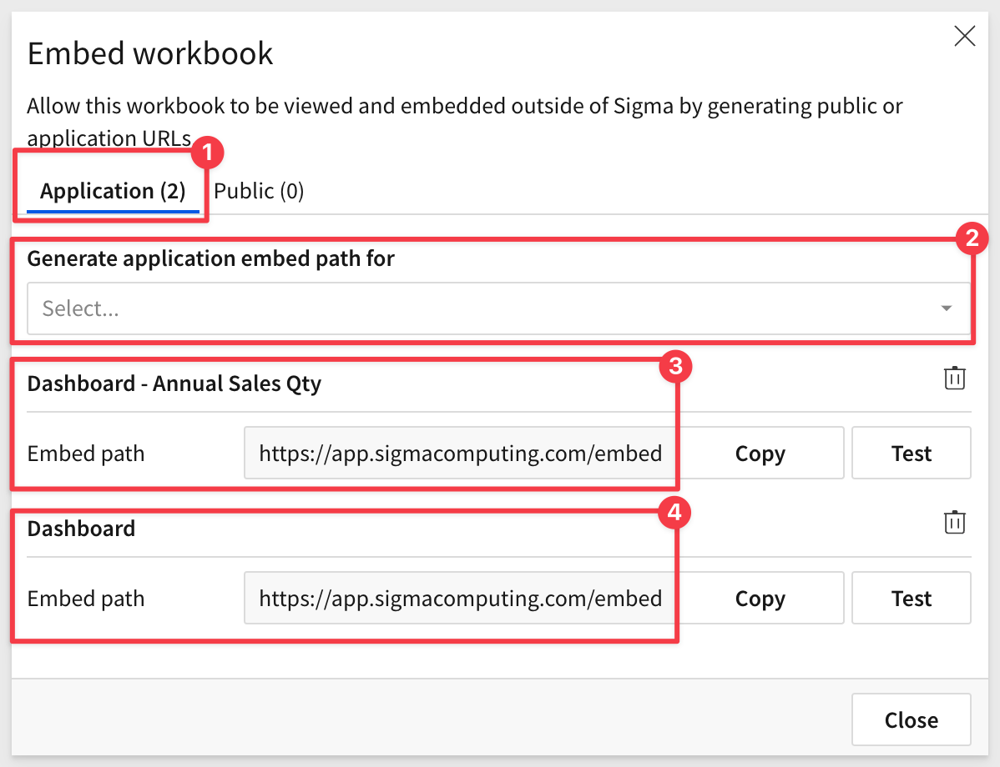
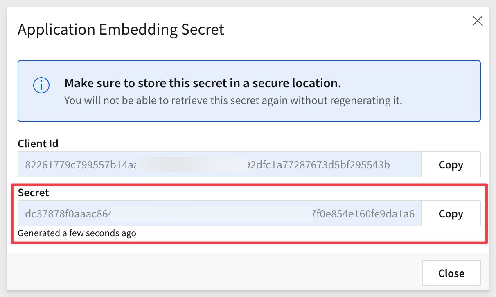
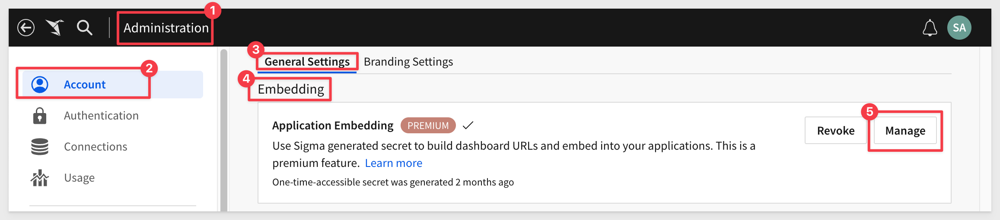
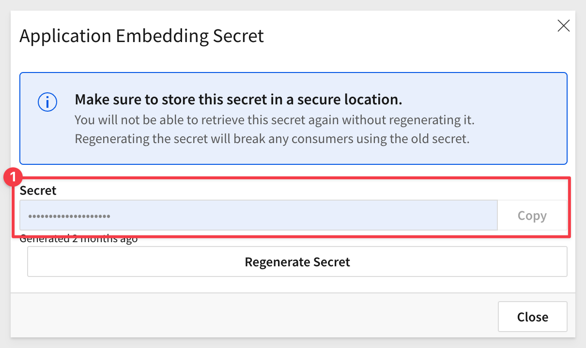
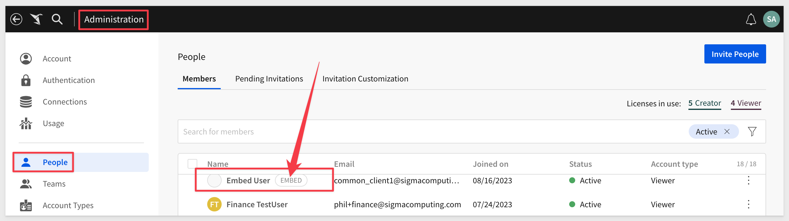

author: pballai
id: embedding_howto_leverage_parameters_and_ua
summary: embedding_howto_leverage_parameters_and_ua
categories: Administration
environments: web
status: Published
feedback link: https://github.com/sigmacomputing/sigmaquickstarts/issues
tags: default
lastUpdated: 2023-08-23

# How To: Leverage Parameters and User-Attributes with Sigma Embedding
<!-- The above name is what appears on the website and is searchable. -->

## Overview 
Duration: 5 

This QuickStart guide explains how Sigma utilizes its server-side API (API) to facilitate embedding into external applications.

The server-side API is essential for embedding Sigma into an external application. Its primary function is to generate a secure, one-time-use URL. This allows Sigma content to seamlessly integrate with the parent application's security during runtime.

A secondary use of the API is to further control the functionality of the embed, using optional parameters.

Detailed documentation of this functionality can be [found here.](https://help.sigmacomputing.com/hc/en-us/articles/6797945342483-User-Backed-Embedding-#h_01G50PPN275X08R4HJJKAQ6XFV) 

This QuickStart guide will offer illustrative examples and screenshots of the available optional parameters, to help developers grasp the significance of each one.

This QuickStart assumes you have completed the [Embedding 3: Application Embedding QuickStart.](https://quickstarts.sigmacomputing.com/guide/embedding_3_application_embedding/index.html?index=..%2F..index#0)

 ### Target Audience

Developers who are interested in how to leverage required and optional parameters and user attributes when embedding Sigma into their applications.

### Prerequisites

<ul>
  <li>A computer with a current browser. It does not matter which browser you want to use.</li>
  <li>Access to your Sigma environment.</li>
  <li>A working web server based on Node.js as demonstrated in the QuickStart Embedding 1: Prerequisites</li>
  <li>Some familiarity with Sigma is assumed. Not all steps will be shown as the basics are assumed to be understood.</li>
</ul>

<aside class="postive">
<strong>IMPORTANT:</strong><br> Sigma recommends that you use non-production resources when doing QuickStarts.
</aside>

<button>[Sigma Free Trial](https://www.sigmacomputing.com/free-trial/)</button>
  
### What You’ll Learn

How to leverage required and optional parameters and user attributes when embedding Sigma into their applications.


<!-- NOTE: SIGMA LOGO REQUIRED AT END OF EACH ## SECTION -->
<!-- END OF OVERVIEW -->

## Required Parameters
Duration: 20

This section is provided for completeness and it is assumed you are already familiar with these parameters, since you completed [Embedding 3: Application Embedding QuickStart.](https://quickstarts.sigmacomputing.com/guide/embedding_3_application_embedding/index.html?index=..%2F..index#0)

For each required parameter, we have provided an example of it being used. Examples are based on Node.js code.

The following are **always required** parameters:

**1: nonce:**<br>
A random unique string (less than 255 characters). Sigma uses this to prevent application embed URLs from being shared and reused. In this way, URLs can only be used one-time.

Sample Code:
```code
//CREATE A NONCE (NUMBER USED ONCE) BASED ON CRYPTO'S UUID FUNCTION:
const nonce = crypto.randomUUID();

Start to construct the list of parameters to be sent with the URL by the API:
let searchParams = `?:nonce=${nonce}`;
```

<aside class="negative">
<strong>NOTE:</strong><br> The code provided closely reflects the code used in the other Sigma embedding QuickStarts. Above we defined a value of "searchParams", and as we go, we will append more parameters to it. In the end, searchParams will contain a comma-separated list of all the required and optional parameters and user-attributes desired.
</aside>


**2: workbook_embed_path:**<br>
This is the URL that is generated by a Sigma user, inside the Workbook, and for whatever portion of a Workbook is desired to be embedded. For example, you can access the `Embedding` interface as:



Then select which element, page or the entire dashboard you want to embed. In this example, we are creating two `Embed Paths`, one for the whole dashboard and one for just one of the charts:



Sample Code:
```code
//SET A VALUE FOR EMBED_PATH:
const EMBED_PATH = 'https://app.sigmacomputing.com/embed/1-1YyXQ2H3j9oMygkpubIy0j';
```


**3: embed secret:**<br>
The <embed secret> is used by the API to generate the signature. This must be encoded in hexadecimal. The secret is generated by inside Sigma > `Administration` > `APIs & Embed Secrets`:



<aside class="negative">
<strong>NOTE:</strong><br> When generating a secret using the Administration interface, a client_id is also generated. Using the embed_secret generated from this interface will require you to also use the client_id in the API.
</aside>

Sample Code:
```code
//SET A VALUE FOR SECRET:
const EMBED_SECRET = '3eb4680a3a34fdd593bec42546.....your full secret';
```


**4: mode**<br>
Always set this to `userbacked` when embedding Sigma in an external application, where Sigma will be adopting the security of the parent application, for the logged in user.

Sample Code:
```code
//SET searchParams = (previous value in searchParams) + Sigma Embed mode:
searchParams += '&:mode=userbacked';
```

<aside class="positive">
<strong>IMPORTANT:</strong><br> Sigma supports a few other "modes" but they are used less-often. After the embed user has accessed a Sigma embed, their "mode" can't be changed later.  When you create a user, they're assigned one of the three user types: internal, guest, and embedded (user-backed). In the event this happens, you can pass Sigma an email for the user as "user+{mode}. This will create an additional user in Sigma, but could also have license implications. Sigma support can assist you should user management issues occur. 
</aside>


**5: client_id:**<br>
Only required if the secret is generated by from Sigma > `Administration` > `APIs & Embed Secrets` (as shown above in item 2). When a embed_secret is created from the Account page, a client_id is not created or required:



Notice that there is no client_id created here:



Sample code (when required):
```code
//SET searchParams = (previous value in searchParams) + CLIENTID:
searchParams += '&:client_id=b7f210045d4bb4....your full clientID;
```


**6: user_email**<br>
The email address associated with the user’s account and must be unique, in Sigma.

Email addresses already associated with a standard (not embed) Sigma user account, will not be considered valid. It is possible to append a `+embed` to a user's email address who already has a Sigma account. 


<aside class="positive">
<strong>IMPORTANT:</strong><br> Embed users will automatically be added to Sigma's "People" page. This is facilitate logging and assignment of an content the embed user may save, assuming that level of access has been provided. 
</aside>

Example of how embed user appears in Sigma `Administration` > `People` page:




**7: external_user_id:**<br>
A unique identifier for each individual using the embed. Sigma uses this identifier for licensing purposes. It is a good idea to use a value that maps to the userID in the parent applications user table. The sample code shows passing a GUID.

Sample Code:
```code
//SET searchParams = (previous value in searchParams) + UserID of if the user authenticated by the parent application::
searchParams += '&:external_user_id=c880bc83-bd98-4085-8688-c27f8375dff9';
```


**8: external_user_team**<br>
The name of your embedded users' team(s) (e.g. "TeamName1"). Team membership in Sigma is used provision access and functionality in Sigma, to groups of users who are in the same role (Role Based Access Control). The API can pass one or multiple team membership for the logged-in user, at runtime.

Sample Code:
```code
//SET searchParams = (previous value in searchParams) + TEAM OF USER:
// IMPORTANT: The embedded content (WB, Page or Viz) must be shared with the Team for the request to work
searchParams += '&:external_user_team=TeamName1,TeamName2';	
```

The user's team membership in the example code would be recognized by Sigma as `TeamName1` and `TeamName2`. The user would have access to whatever content has been shared with these two teams, in Sigma.

<aside class="positive">
<strong>IMPORTANT:</strong><br> Adopt clear naming conventions for teams and workspaces to ensure easy understanding of their purpose and contents. To keep embedded URLs readable and easy to troubleshoot, avoid spaces in names for Teams, Account Types, and User Attributes. Spaces necessitate URL encoding, which can clutter the URL and make it less intuitive. Ensure you only URL encode when dealing with HTML special characters or spaces.
</aside>

In the event you must include spaces or other special characters, you can URL encode the parameter. For example, to send an account_type of `Sales Team` you would use this code:

Sample Code:
```code
// searchParams += '&:external_user_team=' + encodeURIComponent('Sales Team');	
```

To learn more about [user access in Sigma, click here.](https://quickstarts.sigmacomputing.com/guide/embedding_how_to_federate_access_with_sigma/index.html?index=..%2F..index#0)


**9: session_length:**<br> 
The number of seconds the embed URL should remain valid after the application embed URL was generated. After the specified number of seconds, the Application Embed will no longer display new values. The maximum session length is 2592000 seconds (30 days).

Sample Code:
```code
//SET searchParams = (previous value in searchParams) + SESSION LENGTH:
searchParams += '&:session_length=600';
```

When a session length has been exceeded, the embed page will show this message:


INSERT IMAGE


10
<unix_timestamp> [required] - The current time as a UNIX timestamp. Sigma uses this in combination with the <session_length> to determine if your link has expired. The URL is valid after the <unix_timestamp> and before the <session_length> expiration.


## **NEXT SECTION**
Duration: 20


<!-- END OF SECTION-->

## Common Error Messages
Duration: 20

Failure to include one of these parameters will throw an error when the embed is loading. 


EEXIST is for duplicates. Duplicate team, duplicate user, etc. Unlikely to happen for embeds
EPERM operation not permitted, e.g.  if a user forgets to share an embed with a team, account type does not give you edit access to a workbook.
ESTALE you should not see this in embeds.
ENOENT Object Does Not Exist'. If you try to bring up a workbook which does not exist.
EACCES Permission Denied e.g. when you do not have access to edit a workbook and try to.
EINVAL Invalid Argument. e.g. when the URL contains team that does not exist.
ETIMEDOUT Request Timed Out
NETWORK Unable to Connect to Sigma
UNKNOWN DEFAULT_API_ERROR_MESSAGE,


<!-- END OF SECTION-->


## **NEXT SECTION**
Duration: 20


<!-- END OF SECTION-->

## **NEXT SECTION**
Duration: 20


<!-- END OF SECTION-->

## What we've covered
Duration: 5

In this lab we learned how to.........

INSERT FINAL IMAGE OF BUILD IF APPROPRIATE

<!-- THE FOLLOWING ADDITIONAL RESOURCES IS REQUIRED AS IS FOR ALL QUICKSTARTS -->
**Additional Resource Links**

[Help Center Home](https://help.sigmacomputing.com/hc/en-us)<br>
[Sigma Community](https://community.sigmacomputing.com/)<br>
[Sigma Blog](https://www.sigmacomputing.com/blog/)<br>
<br>

[](https://twitter.com/sigmacomputing)&emsp;
[](https://www.linkedin.com/company/sigmacomputing)
[](https://www.facebook.com/sigmacomputing)


<!-- END OF WHAT WE COVERED -->
<!-- END OF QUICKSTART -->
