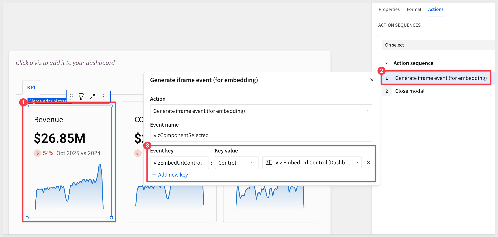

author: pballai
id: embedding_plugin_useage_01_dashboard_builder
summary: embedding_plugin_useage_01_dashboard_builder
categories: embedding
environments: web
status: hidden
feedback link: https://github.com/sigmacomputing/sigmaquickstarts/issues
tags:
lastUpdated: 2025-10-15

# Plugin Use Case 01: Dashboard Builder

## Overview 
Duration: 5 

In this QuickStart, you’ll build a customizable dashboard experience using Sigma’s embedded plugin framework, enhanced by a locally hosted Angular plugin and a lightweight JavaScript host application. 

Users will be able to dynamically configure dashboards by selecting KPIs and layout areas, and save those configurations using Sigma bookmarks and a local JSON database for extended metadata.

You’ll learn how to:
- Set up an Angular-based plugin using Sigma’s development tools
- Register the plugin in Sigma for local testing
- Use a prebuilt Sigma workbook template to define dashboard areas and curated KPI elements
- Configure control logic to drive KPI selection and display behavior
- Host a parent application that tracks user selections and synchronizes them with Sigma bookmarks

<aside class="positive">
<strong>IMPORTANT:</strong><br> This QuickStart builds on the setup from "REST API Usage 01: Getting Started". 
</aside>

[REST API Usage 01: Getting Started](https://quickstarts.sigmacomputing.com/guide/embedding_rest_api_usage_01_getting%20started_started/index.html?index=..%2F..index#0)

<aside class="positive">
<strong>IMPORTANT:</strong><br> Some screens in Sigma may appear slightly different from those shown in QuickStarts. This is because Sigma continuously adds and enhances functionality. Rest assured, Sigma’s intuitive interface ensures that any differences will not prevent you from successfully completing any QuickStart.
</aside>

For more information on Sigma's product release strategy, see [Sigma product releases](https://help.sigmacomputing.com/docs/sigma-product-releases)

If something doesn’t work as expected, here's how to [contact Sigma support](https://help.sigmacomputing.com/docs/sigma-support)

### Target Audience
This project is ideal for developers and data teams looking to offer flexible, self-service dashboard building inside a web app—without compromising governance or requiring custom front-end development from scratch.

### Prerequisites

<ul>
  <li>Any modern browser will work.</li>
  <li>Access to your Sigma environment.</li>
  <li>Some familiarity with Sigma is assumed. Not all steps are shown, as the basics are assumed understood.</li>
  <li>Microsoft VSCode or other suitable development tool.</li>
 </ul>

<aside class="positive">
<strong>IMPORTANT:</strong><br> Sigma recommends using non-production resources when completing QuickStarts.
</aside>

<button>[Sigma Free Trial](https://www.sigmacomputing.com/free-trial/)</button><br>

<button>[Download Visual Studio Code](https://code.visualstudio.com/download)</button>

<aside class="negative">
<strong>IMPORTANT:</strong><br> Some features may carry a "Beta" tag. Beta features are subject to quick, iterative changes. As a result, the latest product version may differ from the contents of this document.
</aside>
 


## Angular Live Development Server
Duration: 5

We have made the plugin code for this project available in a public GitHub repository to save time. Once cloned locally and configured, it provides an Angular Live Development Server which acts as the hosting provider for the included dashboard builder plugin.

### Clone the Git Repository Project Folder
While you can clone the entire repository, we recommend avoiding parts that aren’t immediately relevant.

Instead, we’ll use VS Code and the terminal to perform a `sparse checkout` of the specific project folder we are interested in. This adds a few extra steps but results in a cleaner local project folder.

### Project Setup
Open `VS Code` and start a new `Terminal` session.

Create a new directory in your preferred location:
```code
mkdir sigma_quickstarts
```

Change to the new directory:
```code
cd sigma_quickstarts
```

Execute the terminal command:
```code
git init
```

Add the remote repository as the origin:
```code
git remote add -f origin https://github.com/sigmacomputing/quickstarts-public.git
```

Enable sparse checkout:
```code
git config core.sparseCheckout true
```

Specify the folder you want to clone:
```code
echo "plugin_dashboard_builder" >> .git/info/sparse-checkout
```

Pull the specified folder from the repository:
```code
git pull origin main
```

Change directory to the new folder:
```bash
cd plugin_dashboard_builder
```

<aside class="positive">
<strong>IMPORTANT:</strong><br> The next step requires Node.js. If it has never been installed on your machine, install it from the official site:

[Download Node.js](https://nodejs.org/)

We recommend installing the 22.12.0 version or higher.

Once installed, you can verify the installation in Terminal with:

node -v <br>
npm -v
</aside>

### Node Version Management (optional but recommended for those having multiple versions of Node.js installed)
This reads the Node.js version (22.12.0) from the `.nvmrc` file.
```code
nvm use
```

### Install Yarn package manager:
```code
npm install yarn
```

### Start the Angular Live Development Server
```code
yarn start
```

If prompted with `Would you like to share pseudonymous usage data about this project with the Angular Team...` enter `N` and press `Enter`.

The expected terminal output (ignoring warnings) is:
```code

Angular Live Development Server is listening on localhost:4200, open your browser on http://localhost:4200/


✔ Compiled successfully.
```

Open a browser and navigate to `http://localhost:4200` (the default Angular port).

The page will render with a placeholder bar chart:


This indicates the plugin is working locally and can be used for our development work.

<aside class="positive">
<strong>IMPORTANT:</strong><br> Sigma plugins support both development and production URLs if configured to do so in the administration panel in Sigma. 

**For production use, the plugin must be hosted by your organization**
</aside>

### Key plugin files
This QuickStart does not require any changes or additional configuration for the plugin, so we won't cover i further than to point out the key files.

- src/app/main/main.component.ts:68-80 - Plugin configuration
- src/app/main/main.component.ts:118-136 - URL parsing logic
- src/app/main/main.component.ts:160-187 - Event registration


<!-- END OF SECTION-->

## Register Plugin in Sigma
Duration: 5

Log into Sigma as an administrator and navigate to `Administration` > `Account` > `General Settings` > `Custom Plugins` and click `Add`:


Name the plugin `Dashboard Builder` and set both the development and production URLs to `http://localhost:4200`. Click `Create Plugin`:


The plugin is now registered with Sigma.


<!-- END OF SECTION-->

## Sigma Workbook Prep
Duration: 5

We need to prepare a workbook that allows users to select from a small set of curated content (charts, KPIs, tables, etc.) to create their own custom dashboard. This workbook will be embedded into a host application later. 

To make this process easier, we have created a [template](https://help.sigmacomputing.com/docs/create-and-edit-workbook-templates) that has a few KPIs preconfigured already.

Return to the Sigma homepage and click `Templates`. Click to select the `Dashboard Builder QuickStart` template:


This creates a new (unsaved) workbook we can use for our embed. Let's spend a few moments breaking down the structure:


There are three page tabs (#1 in the screenshot):

**Dashboard Builder Page:**<br>
**#2:** Provides the embedded user three "containers" where elements may be placed. Elements can be selected from any of curated elements provided in the library by clicking an `Edit` button when in `Edit` mode. 

Each container has an independent iframe element which is preconfigured for an click action to generate an iframe event when clicked:


The action sets the nodeID and URL value (each area has a different static value assigned) once a KPI is selected for the selected area, if the nodeID is not empty. 

**3:** The controls are shown on the Dashboard Builder page only so that we can see the values change as we make changes.

In order for the host application to know which control and "viz / container" is configured for which element, it needs to be able to construct the proper combination of URL, NodeID and most recent Explore key for each element the user has selected.

Storing the values in controls allows the dashboard to be changed by the user at any time, without effecting other users. 

Once the user has saved a bookmark, the configuration data is written to a local JSON database. 

<aside class="positive">
<strong>IMPORTANT:</strong><br>  In normal operation, they would all be moved to the hidden data page as users do not need to see them.  
</aside>

**4:** A toggle control to allow the user to place the workbook into edit mode and select from the library. 

If we click `Edit`, the modal appears, and displays the three KPI that are curated for us on the `Library` page:


**Library Page:**<br>
Houses the curated elements that users can select from. We have pre-build three KPI for the QuickStart and included them in the template.

Looking at the actions for the `Revenue` KPI, we can see that when it is clicked, the `vizEmbedUrlControl` on the `Dashboard Builder` page is updated. This allow Sigma to know which KPI was selected by the user:



**data Page:**<br>
Contains the source data table that drives the elements in the library, using Sigma sample data. 

Click `Save as`, name the workbook `Custom_Dashboard` and save to the `Embed_Users` workspace.

<aside class="negative">
<strong>NOTE:</strong><br> The Embed_Users workspace will exist if you completed the REST API Usage 01: Getting Started QuickStart. If that workspace does not exist, create it and save the workbook there.
</aside>

On the `Dashboard Builder` page, set the toggle to `View Mode` and go to the `Published version`.

Copy the full URL from the browser and save it to a text file for later use.

### Share the workbook
Since we are using this workbook in an embed context, we only need to share it with a team and pass the team name to Sigma when identifying the embed user as a member of that team.

We will share with the `Embed_Users` team created in the `REST API Usage 01: Getting Started` QuickStart. If the team does not exist, create it—it will be required later.


<!-- END OF SECTION-->

## Host Application
Duration: 5

We’ve also created a simple JavaScript application that acts as the host or parent application. This simulates a custom application into which Sigma is embedded.

### Clone the git project
Open the `VS Code` window that's running the plugin server.

We will use the same `QuickStarts` folder to store this new project. 

Open a second terminal session, leaving the first one running (it's hosting the plugin):

In the second terminal, ensure you're in the `QuickStarts` folder, then run the following commands:

```code
mkdir dashboard_builder
```

```code
cd dashboard_builder
```

```code
git init
```

Add the remote repository as the origin:
```code
git remote add -f origin https://github.com/sigmacomputing/quickstarts-public.git
```

Enable sparse checkout:
```code
git config core.sparseCheckout true
```

Specify the folder you want to clone:
```code
echo "plugin_use_cases" >> .git/info/sparse-checkout
```

Pull the specified folder from the repository:
```code
git pull origin main
```

You will now have two projects as shown below:


### Install node for the project

```
npm install
```

### Setup Local Database
The only extra setup we need is installing a local database to store extended bookmark information. We will use a version of [lowdb](https://www.npmjs.com/package/lowdb) that supports commonJS for this. 

<aside class="negative">
<strong>ABOUT lowdb:</strong><br> lowdb is a small, fast, and zero-dependency local JSON database. It stores data in a plain .json file and provides a simple JavaScript API for reading and writing. It’s ideal for lightweight use cases like demos, prototypes, and local development — perfect for this QuickStart, where we want to persist bookmark metadata without setting up a full database server.
</aside>

Run the following command in terminal:

```code
npm install lowdb@1.0.0
```

Lowdb installs very quickly:


### Local Database schema
The system maintains the local lowdb database in the `multi-area-bookmarks.json` file. Initially, it contains only header data:

```code
{
  "_comment": "Default empty database for multi-area bookmarks. User bookmarks will be added here at runtime.",
  "bookmarks": {},
  "metadata": {
    "version": "1.0.0",
    "created": "2025-10-15T02:38:08.120Z"
  }
}
```

Sigma is the source of truth for bookmarks, using the following structure: For example, if we query via API we can see how a bookmark is structured in Sigma:

```code
{
    "entries": [
        {
            "bookmarkId": "f1eda0f7-bd9e-4d64-b097-4bc4fdbcc72b",
            "name": "3",
            "isShared": true,
            "exploreKey": "7f574a68-5dab-45f4-85c5-78904e61a3c8"
        }
    ],
    "nextPage": null
}
```

<aside class="negative">
<strong>NOTE:</strong><br> In this QuickStart, we hardcode the list of users and teams for simplicity. In a production environment, these could be dynamically retrieved using the Sigma API endpoints /v2/members and /v2/teams.
</aside>

<aside class="positive">
<strong>IMPORTANT:</strong><br> We’ll rely on the information in the README for implementation details, rather than cover them in this QuickStart.
</aside>

### Configure environment settings
In VSCode, open the `.env` file and add the required values for:

```code
ORG_SLUG=
CLIENT_ID=
SECRET=
```

The `ORG_SLUG` is the name of your Sigma instance. This can be found in the URL. For example:


The `CLIENT_ID` and `SECRET` are generated in the Sigma administration panel, under developer access. Creating these values is discussed in the [REST API Usage 01: Getting Started](https://quickstarts.sigmacomputing.com/guide/embedding_rest_api_usage_01_getting%20started_started/index.html?index=..%2F..index#2) QuickStart.

Once configured, `save` the .env file.

<aside class="positive">
<strong>IMPORTANT:</strong><br> Notice that the value for `WORKBOOK_NAME=Custom_Dashboard` is hard coded in the `.env` file for this QuickStart. 
</aside>

When we saved the workbook earlier we used this name. In production, this value might be dynamic depending on your application’s requirements.

### Start the host application server
Run the following command in terminal:

```code
cd plugin_use_cases
npm start
```


Browse to:
```code
http://localhost:3000/dashboard-builder/
```

The page will render like this:


<!-- END OF SECTION-->

## Testing
Duration: 5

Let’s run some quick validation tests to make sure everything works as expected. Here is a simple test plan to run through.

### Test One: Single Area
1. Toggle into `Edit` mode, click the `Edit` button under Area 1 and select the `Revenue` KPI:


2. Name a new bookmark `1` and click `Save Bookmark`:


3. The dropdown should stay on `1` and the `Revenue` KPI should be in `Area 1`.
4. Using the select control, switch between `Original` and `1` - Area 1 should restore correctly.

The rest of the tests are really similar so screenshots are not provided as the workflow and result is really similar to test one.

### Test Two: Dual Area
1. Starting from the `Original Workbook`, place KPI in `Area 1`
2. Place KPI in `Area 2`
3. Save as bookmark `2`
4. Dropdown should stay on `2`
5. Switch between bookmarks - both areas should restore correctly

### Test 3: Incremental Building:
3. Select the `2` bookmark
4. Add KPI to Area 3
5. Save as bookmark `Incremental`
6. Dropdown should stay on `Incremental`
7. Switch between bookmarks and confirm the expected results display correctly.


After completing the last test, the local database file will look similar to this:
```code
{
  "_comment": "Default empty database for multi-area bookmarks. User bookmarks will be added here at runtime.",
  "bookmarks": {
    "7a5ec4b2-9556-425d-9af9-9bf6f4eb3cb2": {
      "id": "7a5ec4b2-9556-425d-9af9-9bf6f4eb3cb2",
      "name": "1",
      "sigmaBookmarkId": "eeabb12f-e3fa-4f68-9de6-ff8a278e43aa",
      "workbookUrlId": "2z7MYRPW9PZmdJf6AFuZHk",
      "areas": {
        "viz1_nodeid": "NDqnIvkXP2",
        "viz2_nodeid": null,
        "viz3_nodeid": null
      },
      "created": "2025-10-15T17:33:36.498Z",
      "updated": "2025-10-15T17:33:36.498Z"
    },
    "6eddf721-b278-4f18-9d0c-973a753502b7": {
      "id": "6eddf721-b278-4f18-9d0c-973a753502b7",
      "name": "2",
      "sigmaBookmarkId": "b4c15d66-66de-407a-b404-d212d51da571",
      "workbookUrlId": "2z7MYRPW9PZmdJf6AFuZHk",
      "areas": {
        "viz1_nodeid": "NDqnIvkXP2",
        "viz2_nodeid": "4Mv2YcqPSJ",
        "viz3_nodeid": null
      },
      "created": "2025-10-15T17:41:17.823Z",
      "updated": "2025-10-15T17:41:17.823Z"
    },
    "1695501f-4e3c-4fe1-9512-6408f4468b40": {
      "id": "1695501f-4e3c-4fe1-9512-6408f4468b40",
      "name": "Incremental",
      "sigmaBookmarkId": "cc614723-306b-46e5-b7f1-55ddba106dfb",
      "workbookUrlId": "2z7MYRPW9PZmdJf6AFuZHk",
      "areas": {
        "viz1_nodeid": "NDqnIvkXP2",
        "viz2_nodeid": "4Mv2YcqPSJ",
        "viz3_nodeid": "-j-GzZaxjj"
      },
      "created": "2025-10-15T17:42:56.484Z",
      "updated": "2025-10-15T17:42:56.484Z"
    }
  },
  "metadata": {
    "version": "1.0.0",
    "created": "2025-10-15T02:38:08.120Z"
  }
}
```

The corresponding bookmarks in Sigma, queried using the [List bookmarks in a workbook](https://help.sigmacomputing.com/reference/getworkbookbookmarks) API call look like this:
```code
{
    "entries": [
        {
            "bookmarkId": "cc614723-306b-46e5-b7f1-55ddba106dfb",
            "name": "Incremental",
            "isShared": true,
            "exploreKey": "637048d6-87b5-4699-a284-6cfe2896d065"
        },
        {
            "bookmarkId": "b4c15d66-66de-407a-b404-d212d51da571",
            "name": "2",
            "isShared": true,
            "exploreKey": "02a642bc-46da-44ef-8479-5e0a355530be"
        },
        {
            "bookmarkId": "3e8fa013-6465-4caa-aaaf-63589a0940dc",
            "name": "2",
            "isShared": true,
            "exploreKey": "949837ce-7602-4223-aa30-2e7770408c7d"
        },
        {
            "bookmarkId": "eeabb12f-e3fa-4f68-9de6-ff8a278e43aa",
            "name": "1",
            "isShared": true,
            "exploreKey": "075342af-8c6a-4e30-abc8-d6f801f9e884"
        }
    ],
    "nextPage": null
}
```

Click `Delete Bookmark` to remove the selected bookmark from both Sigma and the local database.


<!-- END OF SECTION-->

## What we've covered
Duration: 5

In this QuickStart, we walked through the complete setup of a Sigma plugin-powered dashboard builder, including:

- Cloning and launching the Angular plugin development server
- Registering and testing the plugin within Sigma
- Using a Sigma workbook template to define editable dashboard zones
- Hosting a JavaScript application to simulate an embedded environment
- Persisting user-generated dashboards using Sigma bookmarks and a local JSON database
- Testing the full configuration across multiple user-generated bookmark scenarios

By the end, you created a working system that combines Sigma's governance and bookmark system with a responsive, dynamic UI—all powered by plugins and embeddable components.

**Additional Resource Links**

[Blog](https://www.sigmacomputing.com/blog/)<br>
[Community](https://community.sigmacomputing.com/)<br>
[Help Center](https://help.sigmacomputing.com/hc/en-us)<br>
[QuickStarts](https://quickstarts.sigmacomputing.com/)<br>

Be sure to check out all the latest developments at [Sigma's First Friday Feature page!](https://quickstarts.sigmacomputing.com/firstfridayfeatures/)
<br>

[](https://twitter.com/sigmacomputing)&emsp;
[](https://www.linkedin.com/company/sigmacomputing)&emsp;
[](https://www.facebook.com/sigmacomputing)


<!-- END OF WHAT WE COVERED -->
<!-- END OF QUICKSTART -->


