author: pballai
id: embedding_rest_api_03_bookmark_sharing_with_a_local_db
summary: embedding_rest_api_03_bookmark_sharing_with_a_local_db
categories: embedding
environments: web
status: published
feedback link: https://github.com/sigmacomputing/sigmaquickstarts/issues
tags: default
lastUpdated: 2025-07-01

# REST API Usage 03: Bookmark Sharing with a Local DB

## Overview 
Duration: 5 

This QuickStart demonstrates how to extend an embedded Sigma workbook with bookmark functionality using the Sigma REST API.

In the previous bookmarks QuickStart, `Build` users created bookmarks, and `View` users could select and apply saved bookmarks via a dropdown in the host application.

We will extend/replace that functionality to provide `Build` users a way to tightly control bookmark sharing. We won't cover every possibility, but we will cover these three:

**1: Save a bookmark:**<br>
Allow `Build` users to save a bookmark and also select from users or teams to share the bookmark with. It is this extra detail that requires the local db, but we also need to instruct Sigma (via the API) to create a bookmark too.

**2: Delete a bookmark:**<br>
Delete from the local db and Sigma API instead of just Sigma.

**3: Manage bookmarks:**<br>
Allow the sharing assignments for bookmarks (selected from a list control) to be adjusted after they are created.

This approach enables a more personalized sharing experience using bookmarks. It’s especially useful for SaaS providers or internal teams who want to give users the ability to revisit saved views or share context across roles — without requiring access to the full Sigma interface.

This simplified workflow diagram illustrates how `Build` and `View` interact with a host application to manage and access Sigma bookmarks:

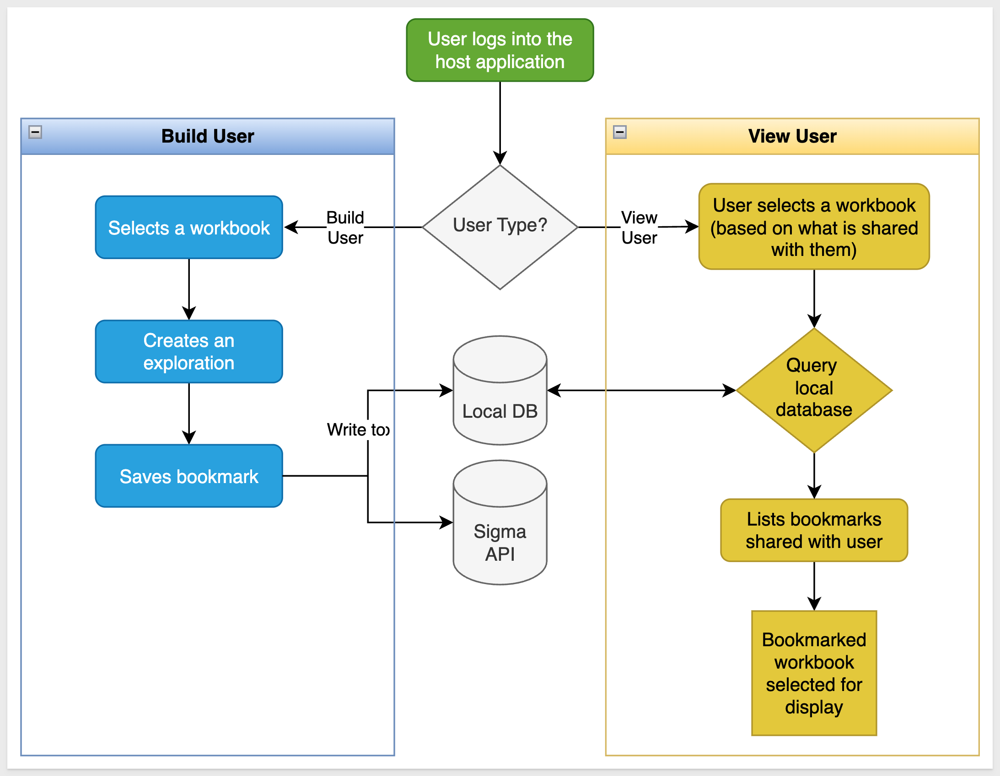

<aside class="positive">
<strong>IMPORTANT:</strong><br> This QuickStart builds on the setup from "REST API Usage 01: Getting Started". If you haven’t yet cloned the repo, installed dependencies, and configured your Sigma workspace, please follow that QuickStart first.
</aside>

[REST API Usage 01: Getting Started](https://quickstarts.sigmacomputing.com/guide/embedding_rest_api_usage_01_getting_started)

<aside class="positive">
<strong>IMPORTANT:</strong><br> Some screens in Sigma may appear slightly different from those shown here. This is because Sigma continuously adds and enhances functionality. Rest assured—Sigma’s intuitive interface ensures that any differences won’t prevent you from completing the QuickStart successfully.
</aside>

For more information on Sigma's product release strategy, see [Sigma product releases](https://help.sigmacomputing.com/docs/sigma-product-releases)

If something doesn’t work as expected, here's how to [contact Sigma support](https://help.sigmacomputing.com/docs/sigma-support)

### Target Audience
Developers who want to use Sigma's REST API to programmatically control Sigma in an embedded context.

### Prerequisites

<ul>
  <li>Any modern browser will work.</li>
  <li>Access to your Sigma environment.</li>
  <li>Some familiarity with Sigma is assumed. Not all steps are shown, as the basics are assumed understood.</li>
  <li>Microsoft VSCode or other suitable development tool.</li>
 </ul>

<aside class="positive">
<strong>IMPORTANT:</strong><br> Sigma recommends using non-production resources when completing QuickStarts.
</aside>

<button>[Sigma Free Trial](https://www.sigmacomputing.com/free-trial/)</button><br>

<button>[Download Visual Studio Code](https://code.visualstudio.com/download)</button>

<aside class="negative">
<strong>IMPORTANT:</strong><br> Some features may carry a "Beta" tag. Beta features are subject to quick, iterative changes. As a result, the latest product version may differ from the contents of this document.
</aside>
 


## API Embed Bookmarks 
Duration: 5

### Setup Local Database
If you haven't already, open the project in VSCode and start a terminal session and open the folder `embedding_qs_series_2_api_use_cases` in terminal. 

The only extra thing we need to do is install a local database that will be used to store extended bookmark information. We will use a version of [lowdb](https://www.npmjs.com/package/lowdb) that supports commonJS for this. 

<aside class="negative">
<strong>ABOUT lowdb:</strong><br> lowdb is a small, fast, and zero-dependency local JSON database. It stores data in a plain .json file and provides a simple JavaScript API for reading and writing. It’s ideal for lightweight use cases like demos, prototypes, and local development — perfect for this QuickStart, where we want to persist bookmark metadata without setting up a full database server.
</aside>

Run the following command in terminal:
```code
npm install lowdb@1.0.0
```

Lowdb installs really quickly:

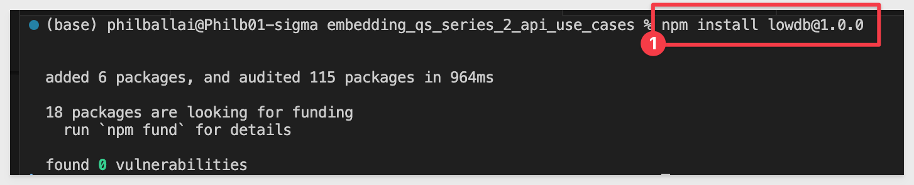

The git repository already contains a `Data` folder with the required `bookmarks.json` file. The data file is initially empty except for:
```code
{
  "bookmarks": []
}
```

### Database schema
The system maintains the local lowdb database in the `bookmarks.json` file storing:

```json
{
  "id": "sigma-bookmark-id",
  "userEmail": "creator@example.com", 
  "workbookUrlId": "workbook-identifier",
  "exploreKey": "captured-state",
  "name": "Bookmark Name",
  "descr": "Description",
  "isShared": true/false,
  "sharedWith": ["email1@example.com", "team:Embed_Users"]
}
```

Sigma acts as the source of truth for bookmarks using the following parameters:
```code
bookmarkId 
name 
exploreKey 
isShared
isDefault
```

<aside class="negative">
<strong>NOTE:</strong><br> In this QuickStart, we hardcode the list of users and teams for simplicity. In a production environment, these could be dynamically retrieved using the Sigma API endpoints /v2/members and /v2/teams.
</aside>

<aside class="positive">
<strong>IMPORTANT:</strong><br> We will rely on the information in the README for the implementation details and not discuss them in this QuickStart. A button is provided on the webpage for easy access.
</aside>

### Start the server
Start the Express server in terminal from the `embedding_qs_series_2_api_use_cases` folder and enable debugging:
```code
DEBUG=true npm start
```

The server is ready when it displays: `Server listening at http://localhost:3000`.

Browse to the landing page:
```code
http://localhost:3000
```

Select the `API Embed Bookmarks` page and click `Go`:

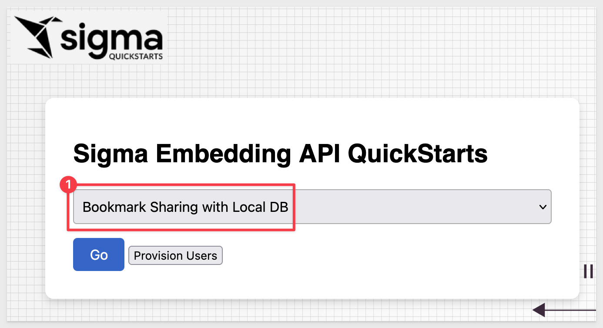

Select the `View` user and the `Embed_API_QuickStart` workbook. 

The embed loads but there are no bookmarks in the `Saved Bookmark` list yet. The `View` user has no way to create bookmarks or explore the data further as expected:

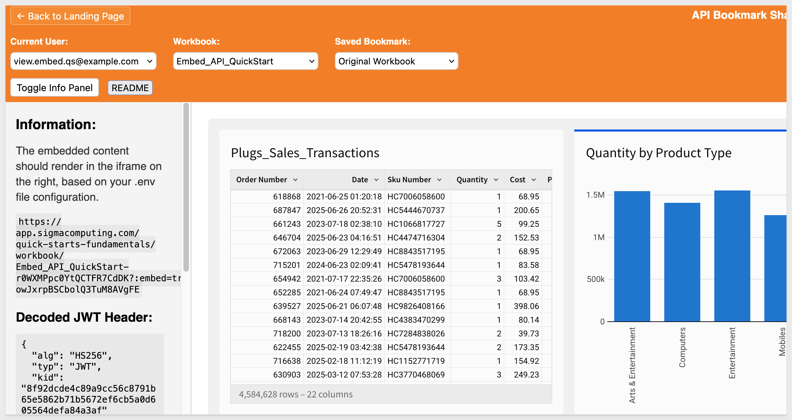


<!-- END OF SECTION-->

## Create a bookmark
Duration: 5

Let's say the `View` user has requested for the workbook only to show data for mobile phones. With this embed configuration, the `Build` user can provide that by creating a bookmark.

Switching to the `Build` user, we can set a filter on the table to display only rows with `Product Type` that are `Mobiles`:

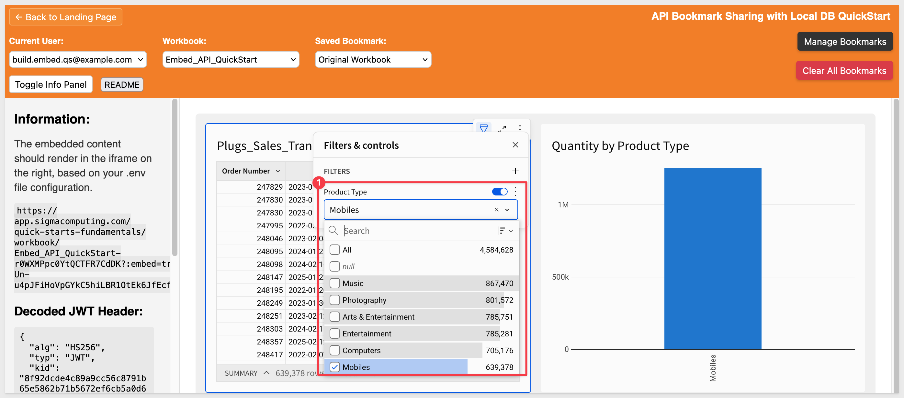

A few things happen when we start to interact with the table, in this case selecting a column to filter on (Product Type) and then selecting a value (Mobiles).

In web browser inspection we can see that each time, a different `exploreKey` event was emitted from Sigma. This is an important observation as we only really want to create a bookmark on the most recent `exploreKey` and this needs to be handled in the code:

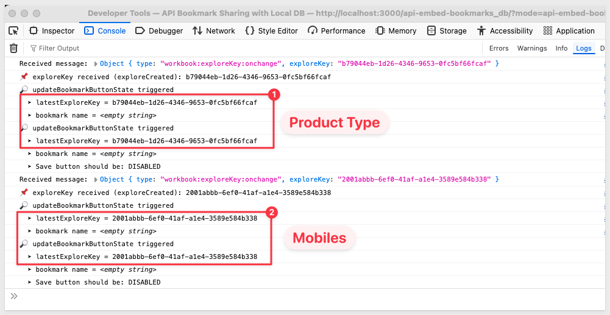

In `api-embed-bookmarks/index.html`, we added an event listener to store the most recent `exploreKey`:
```code
window.addEventListener("message", (event) => {
  if (event.data?.type === "workbook:exploreKey:available") {
    latestExploreKey = event.data.exploreKey;
    if (DEBUG) console.log("Received exploreKey:", latestExploreKey);
  }
});
```

This ensures that the latest exploreKey is always stored in the global `latestExploreKey` variable.

Later, when the `Build` user clicks a `Save Bookmark` button, the value of `latestExploreKey` is passed into the API call:
```code
const response = await fetch("/api/bookmarks/create", {
  method: "POST",
  headers: { "Content-Type": "application/json" },
  body: JSON.stringify({
    workbookId,
    name: bookmarkName,
    exploreKey: latestExploreKey, // only the most recent value is sent
  }),
});
```

As soon as an `exploreKey` is detected, the `Manage Bookmarks` button is enabled in the host application header and we can click it to open the sidebar form. Give the bookmark the name `Mobile Phones`, and assign it to the `View User` and click `Create New`:

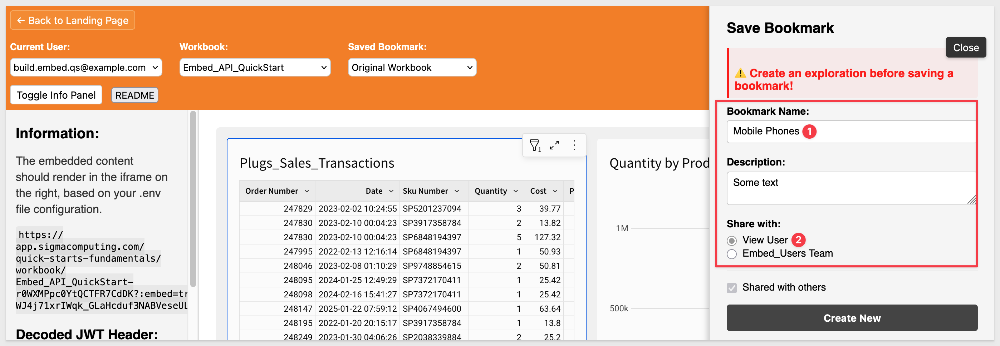

A popup will confirm the bookmark was created with `Bookmark saved`.

Click `Ok`.

The `Saved Bookmark` list now contains the new entry:

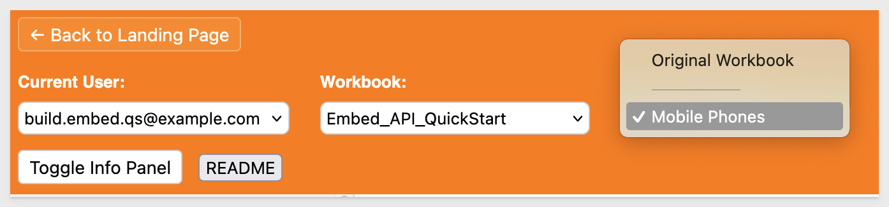

<aside class="negative">
<strong>NOTE:</strong><br> We decided to leave the "Original Workbook" selected after creating a bookmark. Another option is to set the embed to use the newly bookmarked version. Understanding the finer points of the workflow before coding will save time and improve user adoption.
</aside>

### Delete a bookmark
If we select the `Mobile Phones` bookmark and click `Manage Bookmarks` the sidebar panel now shows a delete button, but don't delete it just yet.

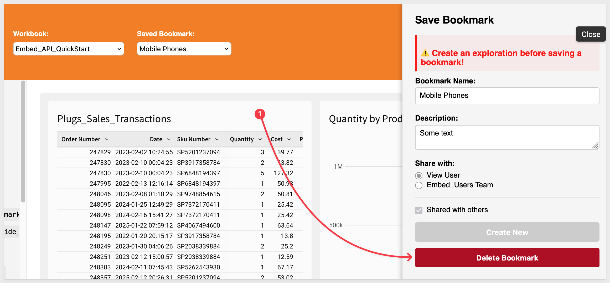


<!-- END OF SECTION-->

## Testing Bookmark Visibility
Duration: 5

We can also select the `Mobile Phones` bookmark when using the `View` user, but the view user is restricted to `View` permissions and the workbook menus are not displayed:

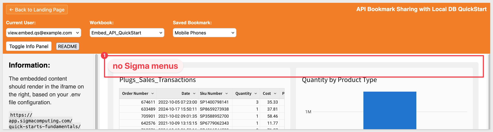

The project is configured so that the `View` user can access saved workbooks but cannot alter them or create new explorations or bookmarks.

The code that restricts the view user from seeing the manage button is in the `updateBookmarkButtonState()` function in `public/api-embed-bookmarks_db/index.html`.

Specifically, the code that hides the manage button for view users is:

- Line 535: bookmarkToggle.style.display = "none";

This line sets the `Manage Bookmarks` button's display to `none` when the current user email matches the `VIEW_EMAIL`
from the environment configuration.

This ensures `View Users` cannot see or interact with bookmark creation controls, even if they somehow interact with the embedded content.

<aside class="positive">
<strong>IMPORTANT:</strong><br> We will rely on the information in the README for the implementation details and not discuss them in this QuickStart. A button is provided on the webpage for easy access.
</aside>

### Create more bookmarks
Switch back to the `Build` user.

Let's create some more bookmarks, but this time, share one with the `Embed Users Team` and don't select anyone to share the third bookmark with. Select different filter values so that you can see only the data expected for each new bookmark.

Once created, we will have three bookmarks in the local database, each with different share settings:

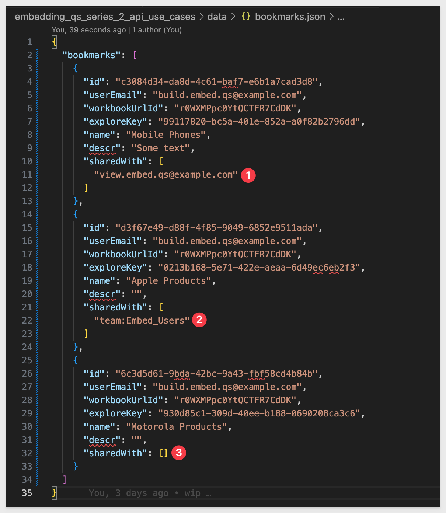

Now we can check that the `View` user can see only two; the `Motorola Products` bookmark was not shared with them:

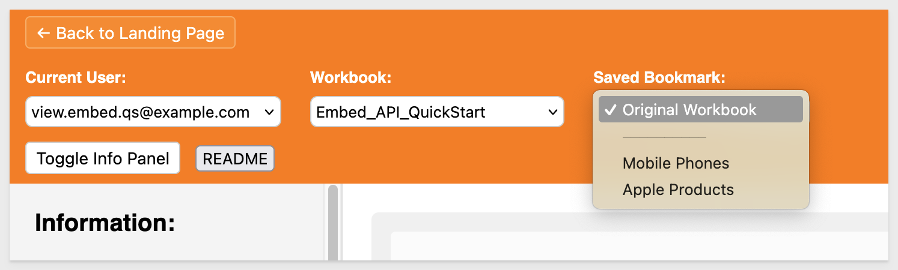

This is just a simple demonstration, but now that we understand the underpinnings, other workflows are possible. For example, we could fetch all the users from some other system and populate a list or checkbox control in the manage panel to allow one or many users to be selected.

With this design, it is possible to create a "bookmark library" that could be used to share many different designs of the same workbook!

### Bookmarks = Custom Views in Sigma
If we check the Sigma UI, we can see that there is an option to access `Custom View` > `All Views`:

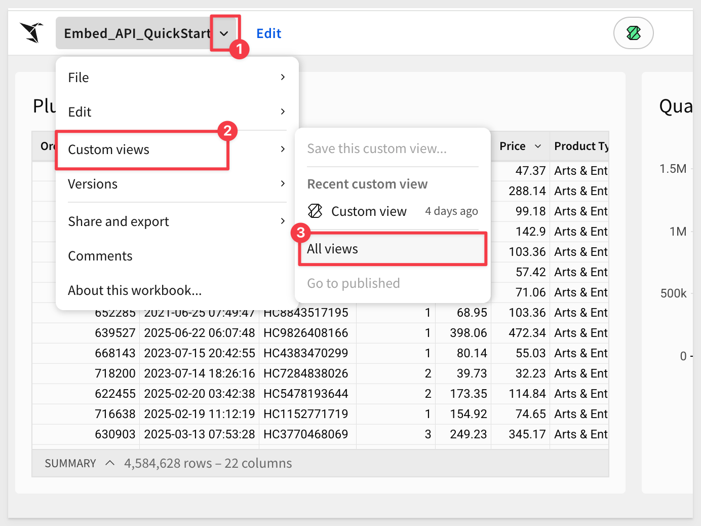

It is here that we see the result of our bookmarks in the Sigma UI. We can also see what was changed in each bookmark:

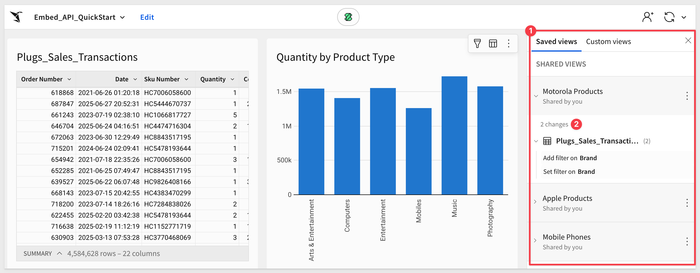

<aside class="positive">
<strong>IMPORTANT:</strong><br> We showed custom views in Sigma for clarity but when using this design, we have elected to not use the Sigma UI to create and manage these as we require the local database information to extend the functionality.

If you delete a saved view in Sigma, it also needs to be deleted from the local database to ensure operation.
</aside>


<!-- END OF SECTION-->

## Bookmark Cleanup
Duration: 5

After creating several bookmarks for testing, you may want to delete them when done. This can be done in Sigma's [API Reference](https://help.sigmacomputing.com/reference/get-started-sigma-api), but that is one at a time.

### Single delete
If we select the `Mobile Phones` bookmark, open the manage form and click `Delete Bookmark`, it will be deleted from the local database and Sigma and we will return to the `Original Workbook`.

### Bulk delete
To automate this further, we created a script under the page button labeled `Clear All Bookmarks`.

<aside class="positive">
<strong>IMPORTANT:</strong><br> Be very careful as this will permanently delete all bookmarks for the specified workbook. Use at your own risk if using against a production instance of Sigma.
</aside>

Select the `Build` user and a workbook to target.

`Clear All Bookmarks` calls the script for you. The fetch called is `api\route\bookmarks\clear-all`.

The console log will list the bookmarks that were deleted:
```code
Reusing cached bearer token
✅ Bearer token obtained for clear all operation
Fetching bookmarks from Sigma API: https://aws-api.sigmacomputing.com/v2/workbooks/0e51172a-a4c0-4954-8c8c-9d854dcf4434/bookmarks
Found 3 bookmarks in Sigma to delete
✅ Deleted Sigma bookmark: Motorola Products (44a6f434-103e-40f7-bbc7-122089b73a38)
✅ Deleted Sigma bookmark: Apple Products (c9b16a2e-92c6-486c-9029-8b30ca0d1ee7)
✅ Deleted Sigma bookmark: Mobile Phones (9b8037f4-4900-4c58-adb9-043fd8696a87)
✅ Deleted 3 bookmarks from local database
✅ Total bookmarks deleted: 3 from Sigma, 3 from local DB
```


<!-- END OF SECTION-->

## What we've covered
Duration: 5

In this QuickStart, we demonstrated how to extend your Sigma embedding experience with bookmark creation and application. Specifically, we covered:

- Detecting user-generated exploration states (`exploreKey`) from the embedded Sigma workbook.
- Creating new bookmarks via the Sigma API using the current `exploreKey`.
- Listing all existing bookmarks for a selected workbook.
- Applying a saved bookmark using outbound `postMessage` events to update the embed in real time.
- Restricting bookmark functionality to Build users only, while still allowing View users to apply saved bookmarks.

This QuickStart builds on the foundational setup from the previous one and introduces a practical use case for interactive, personalized embedding with the Sigma API.

**Additional Resource Links**

[Blog](https://www.sigmacomputing.com/blog/)<br>
[Community](https://community.sigmacomputing.com/)<br>
[Help Center](https://help.sigmacomputing.com/hc/en-us)<br>
[QuickStarts](https://quickstarts.sigmacomputing.com/)<br>

Be sure to check out all the latest developments at [Sigma's First Friday Feature page!](https://quickstarts.sigmacomputing.com/firstfridayfeatures/)
<br>

[](https://twitter.com/sigmacomputing)&emsp;
[](https://www.linkedin.com/company/sigmacomputing)&emsp;
[](https://www.facebook.com/sigmacomputing)


<!-- END OF WHAT WE COVERED -->
<!-- END OF QUICKSTART -->
