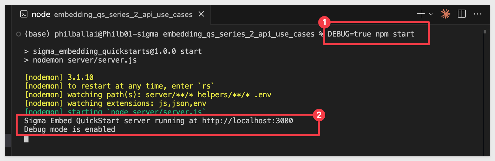
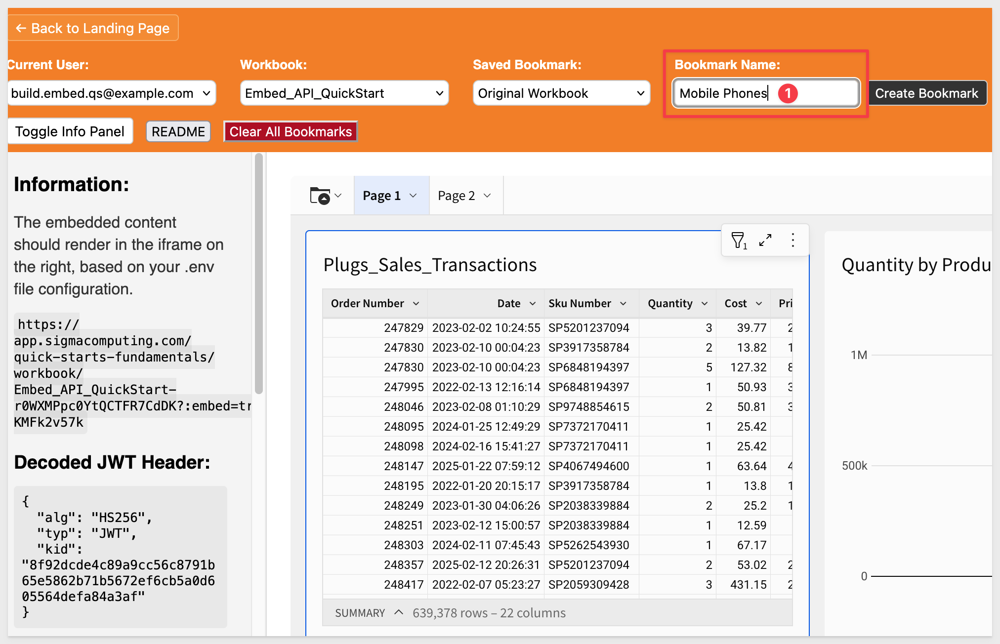
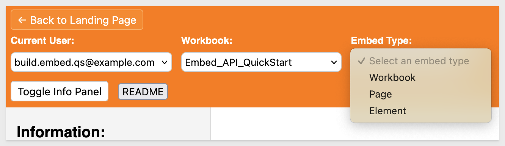
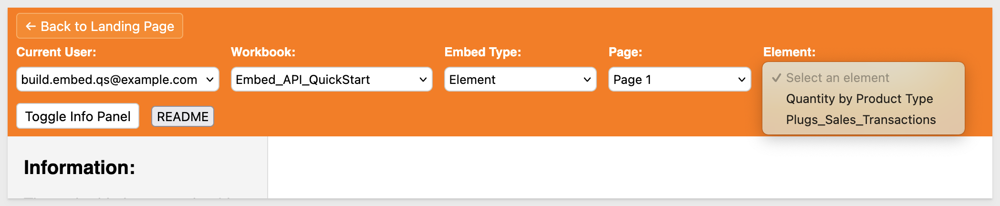
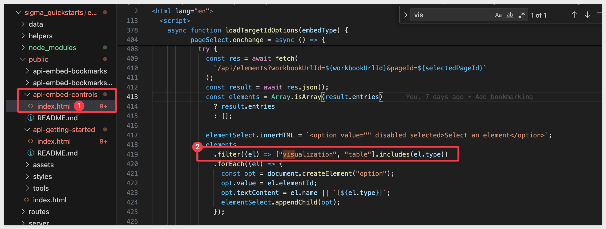

author: pballai
id: embedding_rest_api_usage_01_getting started_started
summary: embedding_rest_api_usage_01_getting_started
categories: embedding
environments: web
status: Published
feedback link: https://github.com/sigmacomputing/sigmaquickstarts/issues
tags: default
lastUpdated: 2025-07-14

# REST API Usage 01: Getting Started

## Overview 
Duration: 5 

This QuickStart demonstrates how to use the Sigma REST API to programmatically manage embedded analytics within a custom host application. You’ll learn how to provision users, retrieve available workbooks, and generate dynamic embed URLs for workbooks, pages, and individual elements.

By the end of this QuickStart, you'll have two working examples that integrates seamlessly with Sigma’s embedding framework, giving you fine-grained control over the embedded experience through API calls and user selections.

<aside class="positive">
<strong>IMPORTANT:</strong><br> Some screens in Sigma may appear slightly different from those shown in QuickStarts. This is because Sigma continuously adds and enhances functionality. Rest assured, Sigma’s intuitive interface ensures that any differences will not prevent you from successfully completing any QuickStart.
</aside>

For more information on Sigma's product release strategy, see [Sigma product releases](https://help.sigmacomputing.com/docs/sigma-product-releases)

If something doesn’t work as expected, here's how to [contact Sigma support](https://help.sigmacomputing.com/docs/sigma-support)

### Target Audience
Developers who want to use Sigma's REST API to programmatically control Sigma in an embedded context.

### Prerequisites

<ul>
  <li>A computer with a current browser. It does not matter which browser you want to use.</li>
  <li>Access to your Sigma environment.</li>
  <li>Some familiarity with Sigma is assumed. Not all steps will be shown, as basic Sigma usage is assumed.</li>
  <li>Microsoft VS Code or another suitable development tool.</li>
  <li>Node version 18+ and related dependancies.</li>
 </ul>

<aside class="positive">
<strong>IMPORTANT:</strong><br> Sigma recommends using non-production environments when completing QuickStarts.
</aside>

<button>[Sigma Free Trial](https://www.sigmacomputing.com/free-trial/)</button><br>

<button>[Download Visual Studio Code](https://code.visualstudio.com/download)</button>

<aside class="negative">
<strong>IMPORTANT:</strong><br> Some features may carry a "Beta" tag. Beta features are subject to quick, iterative changes. As a result, the latest product version may differ from the contents of this document.
</aside>
 


## Git Repository
Duration: 5

### Clone the Git Repository Project Folder
Sample project code is available in a public GitHub repository to save time.

While you can clone the entire repository, we recommend avoiding parts that aren’t immediately relevant.

Instead, we’ll use VS Code and the terminal to perform a `sparse-checkout` of the specific project folder we are interested in. This involves a few extra steps but results in a cleaner local project folder.

Open `VSCode` and start a new `Terminal` session.

Create a new directory in your preferred location using:
```code
mkdir sigma_quickstarts
```

Change to the new directory:
```code
cd sigma_quickstarts
```

Execute the terminal command:
```code
git init
```

Add the remote repository as the origin:
```code
git remote add -f origin https://github.com/sigmacomputing/quickstarts-public.git
```

You shouldn’t see any errors:


Enable sparse checkout:
```code
git config core.sparseCheckout true
```

Specify the folder you want to clone by adding it to the sparse-checkout configuration:
```code
echo "embedding_qs_series_2_api_use_cases" >> .git/info/sparse-checkout
```

Pull the specified folder from the repository:
```code
git pull origin main
```
<aside class="positive">
<strong>IMPORTANT:</strong><br> The next step requires Node.js. If it has never been installed on your machine, install it from the official site:

[Download Node.js](https://nodejs.org/)

We recommend installing the `LTS (Long-Term Support)` version.

Once installed, you can verify the installation in Terminal with:

node -v
npm -v
</aside>

Change directory to the new folder:
```code
cd embedding_qs_series_2_api_use_cases
```

Finally, install project dependencies using npm:
```code
npm install
```

After the command runs, click the button to `Open Folder`:


Use the folder navigation to locate your project folder and click `Open`. 

We should now see the project called `SIGMA_QUICKSTARTS` with a folder called `embedding_qs_series_2`:


### Additional node.js packages
We need to install two Node.js packages that provide helpful development utilities.

**1: jsonwebtoken**<br>
We use this package to decode a JWT in the VSCode terminal. This lets us inspect the token’s payload and header without verifying its authenticity. This is helpful when you need to inspect the information embedded in the token for non-secure contexts or for inspection/debugging purposes.

**2: nodemon:**<br>
This package is a development tool that automatically restarts our Node.js application whenever it detects changes in specific code files. This streamlines development by automatically restarting the server after each code change.

To install these two packages, open a new terminal window in VSCode in the project folder.

Run the command:
```code
npm install jsonwebtoken nodemon
```

The project has almost everything we need, but we will need set up some things in Sigma that will be used throughout this QuickStart Embed API series.


<!-- END OF SECTION-->

## Required Sigma Configuration
Duration: 5

### Client Credentials
Client credentials (a unique client ID and embed secret) are the foundation of secure embedding.

Sigma uses the client ID to determine which embed secret is referenced in a request. Each time a request is made, the server-side embed API uses the embed secret to generate an encrypted signature.

Together, the client ID and embed secret create a robust security framework for server-side interactions with Sigma.

Navigate to `Administration` and scroll down to `Developer Access`.

Click `Create New`:


In the `Create client credentials` modal, select both the `REST API` and `Embedding` checkboxes, provide a name, and assign an administrative user as the owner:


<aside class="negative">
<strong>BEST PRACTICE:</strong><br> Using a separate set of client credentials for REST API and embedding for production environments is considered a best practice. We use one set here to keep things simple for testing. 
</aside>

Click `Create`.

<aside class="positive">
<strong>IMPORTANT:</strong><br> For security purposes, Sigma provides a one-time view of the embed secret at the time of creation and does not display it again. Because the secret is non-retrievable, it's important that you store the secret securely when you create it.

If you lose the embed secret, or it becomes compromised, you can revoke it and generate a new one; however, this invalidates the previous secret and all embeds that use it. When a new secret is generated, you must modify the embed API and update all existing embeds.
</aside>


Copy and paste the `Client ID` and `Secret` into the respective locations in the `.env` file, in the `Sigma API Credentials` grouping.

While we are here, update the value for `ADMIN_EMAIL` with your Sigma admin email address. We will use this when we provision two new embed users by API later.

Also update the value for `ORG_SLUG` with your value. The org_slug is the organization name for your Sigma instance. It will be the text immediately after the `https://app.sigmacomputing.com/` url in the browser. 

For example, if the url is `https://app.sigmacomputing.com/quick-starts-fundamentals` the org_slug is `quick-starts-fundamentals`/

<aside class="positive">
<strong>IMPORTANT:</strong><br> The .env file provided use values for AUTH_URL and API_BASE_URL that may not match where your Sigma instance is hosted. You may need to update these two values as well. 
</aside>

For more information, see [Identify your API request URL](https://help.sigmacomputing.com/reference/get-started-sigma-api#identify-your-api-request-url)

### Teams
Next, we’ll create a team and share the workbook with this team. Then the host application will pass Sigma that team when accessing Sigma content, along with other information about the user. 

Create a team `Embed_Users` and check the box to also create a workspace:


### Test users
We will use two users to test different personas in the embedding API QuickStarts. In a Sigma trial account, you will already have an administrative user and the other two will be created by a provisioning process provided as part of this project's code. 

Here are the details for our test users:

| **Persona Name**        | **Email**                   | **Role**  | **Providing**                                |
| ----------------------- | --------------------------  | --------- | -------------------------------------------- |
| View                    | view.embed.qs@example.com   | View      | Read-only — restricted capabilities          |
| Build                   | build.embed.qs@example.com  | Build     | Can create/edit workbooks etc.               |

TThis setup demonstrates the most common functionality.

The initial .env file from the git repo should already have two users preconfigured for you:
```code
# -----------------------------------------------------------------------------
# Provisioning Feature
# -----------------------------------------------------------------------------
VIEW_EMAIL=view.embed.qs@example.com
VIEW_ACCOUNT_TYPE=View
VIEW_TEAMS=Embed_Users

BUILD_EMAIL=build.embed.qs@example.com
BUILD_ACCOUNT_TYPE=Build
BUILD_TEAMS=Embed_Users
```

<aside class="positive">
<strong>WHY PROVISION USERS?</strong><br> By default, Sigma automatically provisions embed users after they are authenticated by the host application and first access a page with embedded Sigma content. However, this feature can be disabled by customers who want to disable this default behavior, you can restrict your embed content to the users you have explicitly provisioned in Sigma or your IdP.

The next step demonstrates a simplified provisioning process using the API.
</aside>

For more information, see [Configure access to your embedded content authenticated with JWTs](https://help.sigmacomputing.com/docs/create-an-embed-api-with-json-web-tokens#configure-access-to-your-embedded-content-authenticated-with-jwts)

### Embed user provisioning
To keep this "quick", we have provided a provisioning page that uses the REST API to add two embed users mentioned in the last section. 

Once added, we can use them in the host application, polling the `.env` file at runtime for the selected users’ details.

Return to VSCode and make sure the .env file has all the required values. 

Open a new terminal session (or use the one still open).

Ensure you are in the project folder:
```code
pwd
```


Once in the correct folder, we can start the web server with:
```code
npm start
```

Some debug information is provided and the expected result is:



Once the server is running, we can browse to a preconfigured provisioning page. This page adds our two embed test users and displays the `memberId` for each, along with the admin user specified in .env (based on the provided email address):

Browse to:
```code
http://localhost:3000/tools/preload-users.html
```


Click `Start Provisioning`.

Once done, the page will respond with a summary:


If an error occurs, check the console log for more information on the error.

Once the test users are created, we don't need to run the provisioning again unless we want to add more test users. 

<aside class="negative">
<strong>NOTE:</strong><br> Running provisioning more than once is not a problem; the code will detect that the users already exist and display the users again.
</aside>

Click the `Back to Landing Page` button.

### Create Content to Embed
We need to create a few things in Sigma to embed into our host application. We will keep that part simple as that is not the focus of this QuickStart.

In Sigma, return to the homepage and click the `+ Create new` button and click `Workbook`:


Drag a new `Table` from the `Data` group on the `Element bar`:


Click `Select source`

Sigma allows users to search for tables by name; type `hands` in the search bar and select the `PLUGS_ELECTRONICS_HANDS_ON_LAB_DATA` table from the `RETAIL` schema:


This opens the selected table in a new, unsaved workbook named `Exploration`:


We can rename the table by double-clicking on the table name and changing it to `Plugs_Sales_Transactions`.

Add a `Chart` as a `child element` of the table and configure it as shown below:



Optionally, the table can be filtered to show less rows using `Top N`, just to make the table load as fast as possible. 

Also add a new `Page` to the workbook and add a `Text` element, setting the text to `PAGE 2`:


This gives us a workbook with two pages and three elements.

Click the `Save as` button and save the workbook `Embed_API_QuickStart` in the `Embed_Users` workspace. 

So we have two workbooks in our workspace, save another copy in the workspace using the name `Embed_API_QuickStart (copy)`:


The content being the same doesn’t matter, we just want to ensure both workbooks are available to embed users.

### Share the Workbooks
Share **both workbooks** as shown below, changing the permission level to `Edit`:


This grants any member of the team access and we’ll will adjust the permission level using the `Account Type` JWT claim at runtime.

This will allow the `View` user to look at the workbook and do some very basic things like sort and filter. The `Build` user will have full edit permission.

For more information in Sigma default account types, see [Default account types](https://help.sigmacomputing.com/docs/create-and-manage-account-types#default-account-types)


<!-- END -->

## Getting Started Page
Duration: 5

We last left the browser open the main landing page. If for some reason it all got closed, simply restart it.

Restart it as shown earlier, ensuring you're in the correct project folder:
```code
npm start
```

The server is ready when it displays `Server listening at http://localhost:3000`.

<aside class="negative">
<strong>NOTE:</strong><br> If the provisioning page is still open, just click the "Back to Landing Page" button.
</aside>

Browse to the landing page:
```code
http://localhost:3000
```

Select `API Getting Started` QuickStart and click `Go`:


The `API Getting Started` page comes with a side-panel that displays embedding and token details.

The actual token appears lower on the side panel for anyone who wants to validate it using a third-party site such as [JWT.io](https://jwt.io/):


You can select to operate as either embed user and also select from our test workbooks:


The terminal console displays logging output each time a page with an embed is reloaded:


Note that the token is cached, and the embed URL is also displayed.

Sigma supports different embed URL formats depending on the content type for different embeds in Sigma and this example constructs the correct format for embedding a `workbook` in the code.

For more information, see [What URL to use](https://help.sigmacomputing.com/docs/create-an-embed-api-with-json-web-tokens#what-url-to-use)

We have now successfully embedded Sigma into our host application and used the API to get information from Sigma (workbooks in the Embed_Users workspace) and passed the selected workbook back to Sigma using the correct format for a workbook embed:


### Enabling Menus and Folder Navigation for Build Users
We have designed the project to allow the `Build` user to see the Sigma menu and folder navigation, placing them at the top of the embed:


This was done to demonstrate a few of the optional runtime parameters that are available in the JWT embed. The full list is included (at the time of this QuickStart) in the `.env` file:
```code
# -----------------------------------------------------------------------------
# OPTIONAL EMBED PARAMETERS (defaults are shown)
disable_auto_refresh=false
disable_mobile_view=false
hide_folder_navigation=false
hide_menu=false
hide_page_controls=false
hide_reload_button=false
hide_title=false
hide_tooltip=false
hide_view_select=false
lng=English
menu_position=none
page_id=
responsive_height=false
theme=Lite
view_id=
# -----------------------------------------------------------------------------
```

To give the `Build` user access to Sigma’s editing tools during embedding, we configure the JWT to include specific UI flags. These values are only applied when embedding an entire workbook (not a page or element):
```code
{
  "hide_menu": "false",
  "menu_position": "top",
  "hide_folder_navigation": "false"
}
```

These settings ensure that:
- The menu bar is visible
- The menu appears at the top of the screen (instead of a side menu)
- The user can navigate folders within Sigma if allowed by their role

We apply these settings at runtime only if the selected user is a `Build` user. `View` users receive a more restricted UI by default.

<aside class="positive">
<strong>IMPORTANT:</strong><br> Optional parameters provide fine-grained control over what embedded users can see and do.

In this example, we chose to give Build users greater access than View users by enabling menus and folder navigation. This approach supports tiered functionality — allowing SaaS providers to offer a premium experience to customers with advanced permissions.
</aside>


<!-- END -->

## Constructing Embed URLs
Duration: 5

Return to the landing page and select `API Embed Control` and click `Go`.

This page extends the previous functionality to include an `Embed Type` selector. You can choose to select the workbook, page or element for the selected workbook. 



If we select `Page`, the host application will make an API call to Sigma to get the pages for the selected workbook:


Similarly, if `Element` is selected, the list of workbook elements is selected, you must first select a page before the list of workbook elements is retrieved:



To avoid including workbook elements like `Text` the frontend JavaScript filters the list to include only elements with a type of "visualization" or "table", which are the most commonly supported types for element-level embedding. This helps avoid cluttering the dropdown with non-embeddable or structural elements.

A single line of code handles this filtering:



This dynamic behavior ensures the host application continues working even if Sigma content changes, listing and displaying any content that may have changed. 

### URL construction code
The construction of the Sigma embed URLs happens in the file `helpers/build-embed-url.js`.

It is responsible for constructing the embed URLs based on `embedType`, `workbookUrlId`, and optional `targetId`. 

Here's what it does:

**For workbook:**<br>
https://{orgSlug}.sigmacomputing.com/embed/workbook/{workbookUrlId}

**For page:**<br>
https://{orgSlug}.sigmacomputing.com/embed/page/{workbookUrlId}/{pageId}

**For element:**<br>
https://{orgSlug}.sigmacomputing.com/embed/element/{workbookUrlId}/{pageId}:{elementId}

This file is used by the `/generate-jwt/:mode` route handler, defined in `routes/api/generate-jwt.js`, to construct the final embed URL that gets returned to the frontend.

This allows the user to select any workbook, page or element to embed while dynamically building the embed URL.

Let's look at the rest of the core files in the next section.


<!-- END -->

## Project Code
Duration: 5

This project follows a [Separation of Concerns (SoC) design pattern](https://en.wikipedia.org/wiki/Separation_of_concerns) to keep the codebase organized and maintainable.

Routes handle HTTP requests and define API endpoints. They control what happens when a request reaches a specific URL.

Helpers are reusable utility functions that encapsulate logic shared across routes — such as formatting data, building embed URLs, or calling Sigma’s APIs.

By separating these responsibilities, the code becomes easier to read, test, and update — especially as the application grows.

Here’s a summary of key project files and their roles:

### Helpers Folder
Contains backend utility scripts for interacting with the Sigma API and generating JWTs.
- **build-embed-url.js:** Constructs a valid Sigma embed URL based on inputs.
- **create-jwt.js:** Generates a signed JWT based on user input and environment values.
- **get-access-token.js:** Authenticates against Sigma API to get a bearer token.
- **get-workbook-metadata.js:** Fetches detailed metadata (e.g., pages/elements) for a workbook.
- **get-workbooks.js:** Retrieves the list of workbooks the API user can access.
- **provision.js:** Provisions users into Sigma (e.g., for impersonation or setup).

### Public Folder:

- **index.html:** Main landing page for the project. Lists / links to each QuickStart and provisioning page.

#### api-getting-started Folder
- index.html: First QuickStart in the series; lets users pick a user/workbook and embed a workbook (only).

#### api-embed-controls Folder
- **index.html:** Web page with controls for user, workbook, embed type, and page/element.

#### tools Folder
- **preload-users.html:** Standalone page for provisioning users before embedding.

### Routes Folder
These files define the Express route handlers that the front end calls. Each route uses a helper to interact with the Sigma API and return filtered results to the client.

**generate-jwt.js:**<br>
Handles requests to `/generate-jwt/:mode`.

- Receives the selected user type (view or build) and embed type (workbook, page, or element) from the front-end.
- Calls `build-embed-url.js` to construct the proper Sigma embed URL.
- Calls `create-jwt.js` to sign the token with your secret.

Returns the final embed URL and JWT to the front end.

**elements.js:**<br>
Handles requests to `/api/elements?workbookUrlId={id}&pageId={id}`.

- Calls get-workbook-metadata.js to fetch metadata for the workbook.
- Extracts the specified page.
- Filters and returns only embeddable elements (e.g., type = visualization or table).
- Designed for use when embedding a specific element.

**pages.js:**<br>
Handles requests to `/api/pages?workbookUrlId={id}`.

- Calls `get-workbook-metadata.js` to fetch metadata for the specified workbook.
- Returns a flat list of pages (pageId, name) for populating the Page dropdown.

**workbooks.js:**<br>
Handles requests to `/api/workbooks`.

- Calls `get-workbooks.js` (helper) to fetch all accessible workbooks via the Sigma API.
- Optionally filters by folder path or naming pattern (done client-side).
- Used to populate the Workbook dropdown.

**provision-users.js:**<br>
Handles requests to /api/provision-users. Stored in the `routes` folder.

- Receives a request payload with user email, name, and role.
- Calls functions from `helpers/provision.js`:
-   lookupMemberId() checks if the user exists.
-   provisionEmbedUser() creates a new embed user and assigns them to the "Embed_Users" team.
- Returns the memberId to the frontend.

### Server Folder
Contains the Express server setup for the project. It initializes middleware, loads environment variables, and defines the main entry point for running the backend. Acts as the bridge between API routes, helpers, and the front-end interface.

- Loads .env configuration using dotenv.
- Sets up and configures the Express server.
- Applies JSON parsing middleware.
- Mounts all API route handlers from routes/api/.
- Serves static files from the public/ directory (used for serving the HTML pages).
- Defines the port and starts the server.


<!-- END -->

## Endpoints Operations Used
Duration: 5

The following is information regarding a few of the primary API endpoints used to enable the functionality demonstrated. 

The JWT token process has previously been detailed in the QuickStart: [Embedding 01: Getting Started](https://quickstarts.sigmacomputing.com/guide/embedding_01_getting_started_v3/index.html?index=..%2F..index#0), so we won't cover that here.

### Sigma API Endpoints Used

| Endpoint                         | Purpose                         | Method |
|----------------------------------|---------------------------------|--------|
| `/v2/members?search=...`         | Check if user exists (see note) | `GET`  |
| `/v2/teams?name=...`             | Look up team ID by name         | `GET`  |
| `/v2/members?sendInvite=false`   | Provision embed user            | `POST` |
| `/v2/workbooks`                  | List workbooks                  | `GET`  |
| `/v2/workbooks/{workbookId}`     | Get workbook pages/elements     | `GET`  |

<aside class="negative">
<strong>NOTE:</strong><br> /v2/members?search= is a supported query parameter for checking if a user exists, even though it may not appear in Swagger documentation.
</aside>

### User Provisioning
Provisioning uses a helper script, `helpers/provision.js` that uses the Sigma REST API to provision embed users, assign them to a team, or look them up by email if they already exist.

#### getTeamIdByName(teamName)
Looks up a team ID by its name (e.g., "Embed_Users"). This is required because Sigma API calls for assigning users to teams require the team's internal teamId, not its display name.

- Endpoint: GET /v2/teams?name=Embed_Users
- Auth: Bearer token
- Response: Returns the first matching team and caches it in memory to reduce redundant requests.

#### lookupMemberId(email)
Checks whether a user already exists before attempting to provision them.

- Endpoint: GET /v2/members?search=email@example.com
- Response: Returns the memberId if found, or throws an error if none is found.

#### provisionEmbedUser(email, firstName, lastName, memberType)
Provisions a new Sigma embed user, or returns the existing `memberId` if the user already exists.

- Endpoint: POST /v2/members?sendInvite=false
- Payload:
``` json
json
Copy
Edit
{
  "userKind": "embed",
  "memberType": "viewer" | "explorer",
  "email": "view2.embed.qs@example.com",
  "firstName": "View",
  "lastName": "User",
  "addToTeams": [{ "teamId": "...", "isTeamAdmin": false }],
  "isGuest": false
}
```

- Response: Returns the memberId of the new or existing user.

If the API returns a 409 Conflict because the user already exists, the code extracts and returns the existing memberId from the error message.

### Fetching Workbooks
The helper file, `helpers/get-workbooks.js`, retrieves the list of workbooks that the authenticated user has access to. It's used to populate the Workbook dropdown in the QuickStart UI. All filtering is performed client-side in your helper logic, based on the path or name field.

- Endpoint: GET /v2/workbooks

- Response Structure
A successful response returns an array like:
```json
{
  "entries": [
    {
      "workbookId": "b4a6...68b",
      "name": "Embed_API_QuickStart",
      "path": ["QuickStarts", "Embed", "Embed_API_QuickStart"],
      "url": "https://.../workbook/b4a6...68b",
      ...
    }
  ]
}
```

The route, `/routes/api/workbooks` calls this helper.

The HTML/JS frontend uses the response to:
- Filter workbooks by folder or name (if needed).
- Populate the Workbook dropdown.
- Store the workbookUrlId() (parsed from the URL) for use in other API calls.

### Fetching Workbook Metadata (Pages and Elements)
The helper file, `helpers/get-workbook-metadata.js` retrieves the full metadata for a specific workbook, including its pages and the elements on each page. It powers the dynamic page and element selectors in the UI after a workbook is selected.

It supports both:
- Listing pages for the selected workbook
- Listing elements on a specific page (typically used for "element" embed types)

- Endpoint: GET /v2/workbooks/{workbookId}

**workbookId (string, required):** The short-form ID of the workbook (e.g., b4a6...68b), extracted from the workbook's URL.

- Response Structure
```code
{
  "workbookId": "...",
  "name": "...",
  "pages": [
    {
      "pageId": "...",
      "name": "Page 1",
      "elements": [
        {
          "elementId": "...",
          "name": "Quantity by Product Type",
          "type": "visualization"
        },
        ...
      ]
    },
    ...
  ]
}
```

The helper flattens the response into:
- A list of pages (each with pageId and name)
- For a specific page, a list of elements (each with elementId, name, and type)

This helper is called via these routes:
- /api/pages?workbookUrlId={id} → Returns list of pages
- /api/elements?workbookUrlId={id}&pageId={id} → Returns list of elements on a page

Used by the front end UI to:
- Populate the Page dropdown (for page or element embedding)
- Populate the Element dropdown (if the "element" type is selected)
- Filter elements by supported type (visualization, table)


<!-- END -->

## What we've covered
Duration: 5

In this QuickStart, we built a working host application that embeds Sigma using the REST API.

We demonstrated how to create or look up embed users and assign them to teams using the /v2/members and /v2/teams endpoints.

We also covered how to fetch available workbooks from /v2/workbooks, filter them for use in the embedding experience, and retrieve workbook structure — including pages and embeddable elements — using /v2/workbooks/{id}.

We also introduced optional parameters that adjust the embed behavior based on the selected user type (Build vs View), allowing different capabilities to be shown in the embedded experience.

Finally, we showed how to dynamically generate embed URLs for workbooks, pages, and elements based on user selections.

This foundation enables flexible, API-driven control of the Sigma embedding experience — including support for tiered access models.

**Additional Resource Links**

[Blog](https://www.sigmacomputing.com/blog/)<br>
[Community](https://community.sigmacomputing.com/)<br>
[Help Center](https://help.sigmacomputing.com/hc/en-us)<br>
[QuickStarts](https://quickstarts.sigmacomputing.com/)<br>

Be sure to check out all the latest developments at [Sigma's First Friday Feature page!](https://quickstarts.sigmacomputing.com/firstfridayfeatures/)
<br>

[](https://twitter.com/sigmacomputing)&emsp;
[](https://www.linkedin.com/company/sigmacomputing)&emsp;
[](https://www.facebook.com/sigmacomputing)


<!-- END OF WHAT WE COVERED -->
<!-- END OF QUICKSTART -->
