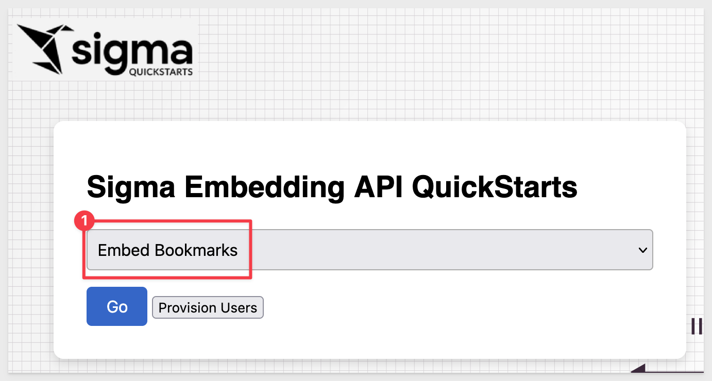
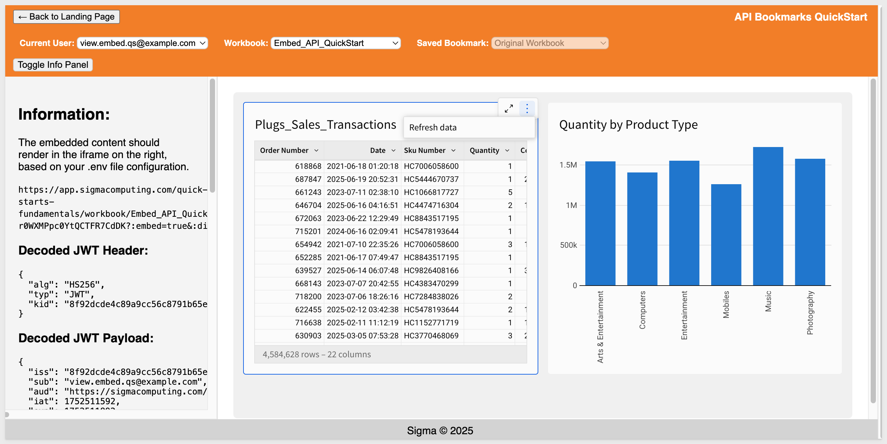
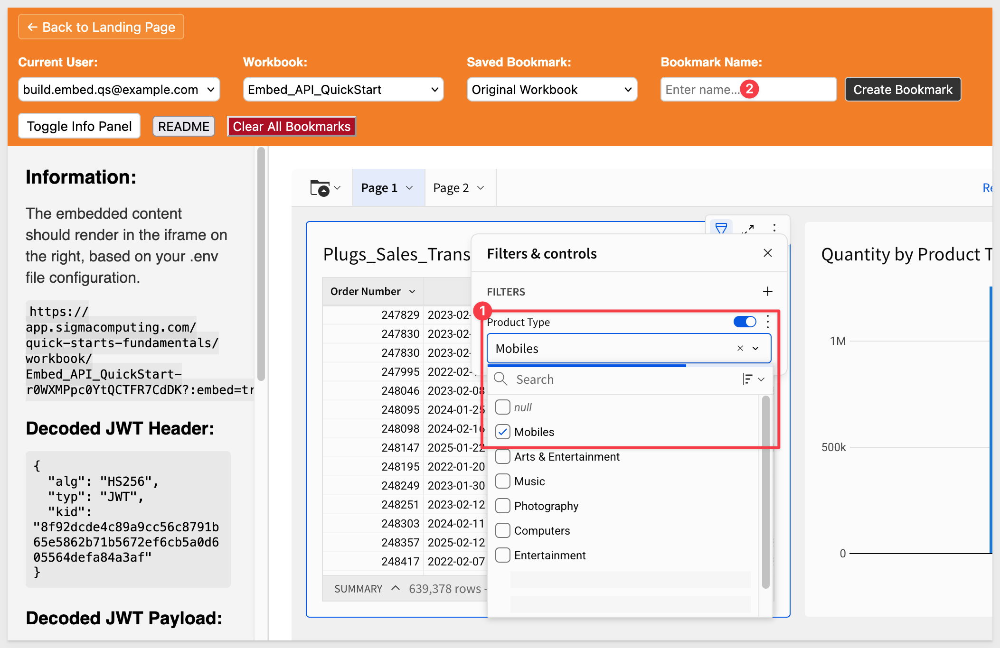
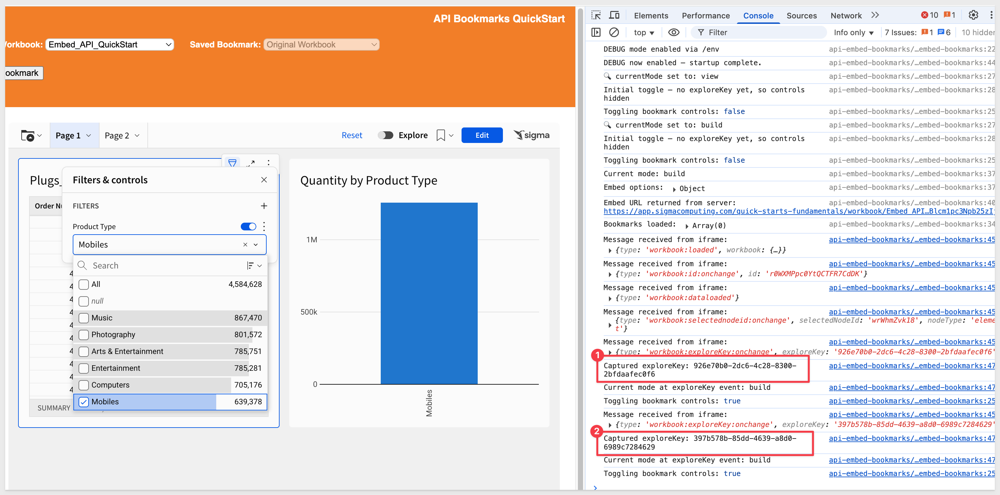
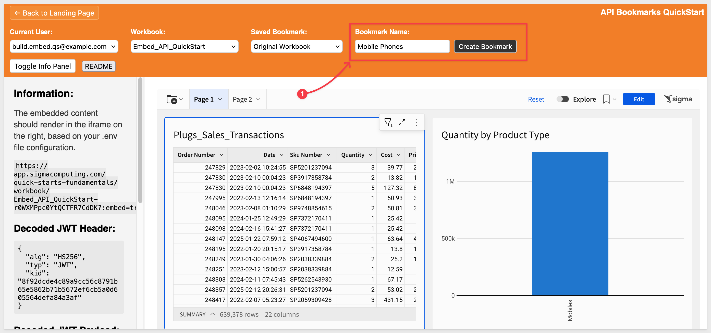
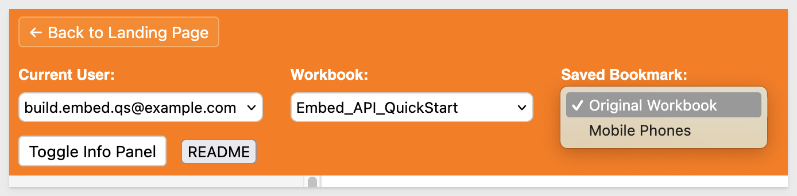
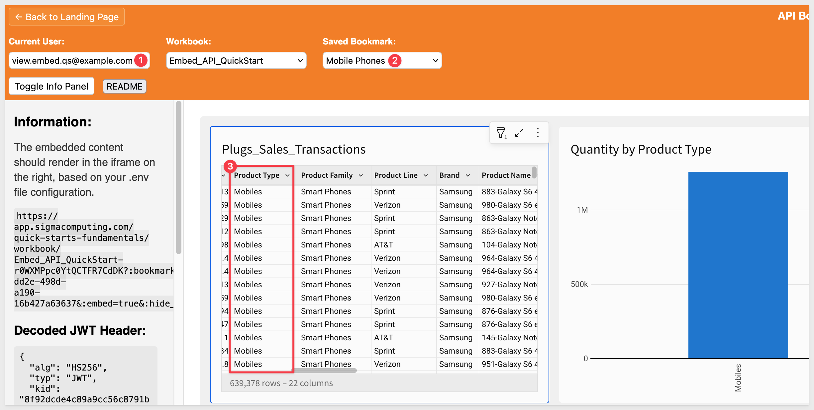
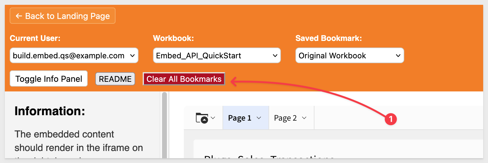

author: pballai
id: embedding_rest_api_usage_02_bookmarks
summary: embedding_rest_api_usage_02_bookmarks
categories: embedding
environments: web
status: published
feedback link: https://github.com/sigmacomputing/sigmaquickstarts/issues
tags: default
lastUpdated: 2025-07-21

# REST API Usage 02: Bookmarks

## Overview 
Duration: 5 

This QuickStart demonstrates how to extend an embedded Sigma workbook with bookmark functionality using the Sigma REST API.

Bookmarks let us capture the current state of a user’s exploration—including filters, drill-downs, and interactions—and save it for later use. In this example, `Build` users can create bookmarks, and `View` users can select and apply saved bookmarks via a dropdown in the host application.

This approach enables more personalized, collaborative analytics experiences. It’s especially useful for SaaS providers or internal teams who want to give users the ability to revisit saved views or share context across roles — without requiring access to the full Sigma interface.

<aside class="positive">
<strong>IMPORTANT:</strong><br> This QuickStart builds on the setup from "REST API Usage 01: Getting Started". If you haven’t yet cloned the repo, installed dependencies, and configured your Sigma workspace, please follow that QuickStart first.
</aside>

[REST API Usage 01: Getting Started](https://quickstarts.sigmacomputing.com/guide/embedding_rest_api_usage_01_getting%20started_started/index.html?index=..%2F..index#0)

<aside class="positive">
<strong>IMPORTANT:</strong><br> Some screens in Sigma may appear slightly different from those shown here. This is because Sigma continuously adds and enhances functionality. Rest assured—Sigma’s intuitive interface ensures that any differences won’t prevent you from completing the QuickStart successfully.
</aside>

For more information on Sigma's product release strategy, see [Sigma product releases](https://help.sigmacomputing.com/docs/sigma-product-releases)

If something doesn’t work as expected, here's how to [contact Sigma support](https://help.sigmacomputing.com/docs/sigma-support)

### Target Audience
Developers who want to use Sigma's REST API to programmatically control Sigma in an embedded context.

### Prerequisites

<ul>
  <li>Any modern browser will work.</li>
  <li>Access to your Sigma environment.</li>
  <li>Some familiarity with Sigma is assumed. Not all steps are shown, as the basics are assumed understood.</li>
  <li>Microsoft VSCode or other suitable development tool.</li>
 </ul>

<aside class="positive">
<strong>IMPORTANT:</strong><br> Sigma recommends using non-production resources when completing QuickStarts.
</aside>

<button>[Sigma Free Trial](https://www.sigmacomputing.com/free-trial/)</button><br>

<button>[Download Visual Studio Code](https://code.visualstudio.com/download)</button>

<aside class="negative">
<strong>IMPORTANT:</strong><br> Some features may carry a "Beta" tag. Beta features are subject to quick, iterative changes. As a result, the latest product version may differ from the contents of this document.
</aside>
 


## API Embed Bookmarks
Duration: 5

If you haven't already, open the project in VSCode and start the Express server in terminal from the `embedding_qs_series_2_api_use_cases` folder:
```code
DEBUG=true npm start
```

The server is ready when it displays: `Server listening at http://localhost:3000`.

Browse to the landing page:
```code
http://localhost:3000
```

Select the `API Embed Bookmarks` page and click `Go`:



Select the `View` user and the `Embed_API_QuickStart` workbook. 


The embed loads but there are no bookmarks in the `Saved Bookmark` list yet. The `View` user has no way to create bookmarks or explore the data further as expected:



### Create a bookmark
Let's say the `View` user has requested that the workbook only show data for mobile phones. With this embed configuration, the `Build` user can provide that by creating a bookmark.

Switching to the `Build` user, we can set a filter on the table to display only rows with `Product Types` > `Mobiles`:



<aside class="negative">
<strong>NOTE:</strong><br> The "Bookmark Name" control appears when an explore is first created.
</aside>

A few things happen when we start to interact with the table. In this case, we're selecting a column to filter on (Product Type) and then selecting a value (Mobiles).

In the console log, we can see that each time a different `exploreKey` event was emitted from Sigma. This is an important observation, as we only want to create a bookmark on the most recent `exploreKey`, and this needs to be handled in the code:



In `api-embed-bookmarks/index.html`, we added an event listener to store the most recent `exploreKey`:
```code
if (
  data.type === "exploreCreated" ||
  data.type === "workbook:exploreKey:onchange"
) {
  if (data.exploreKey) {
    latestExploreKey = data.exploreKey;
    if (DEBUG) {
      console.log("Captured exploreKey:", latestExploreKey);
      console.log("Current mode at exploreKey event:", currentMode);
    }
    toggleBookmarkControls(currentMode === "build");
  }
}
```

This ensures that the latest exploreKey is always stored in the global `latestExploreKey` variable.

Later, when the `Build` user clicks the `Save Bookmark` button, the value of `latestExploreKey` is passed into the API call.

Once we have the table filtered, we can give the bookmark a name (Mobile Phones) and click `Create Bookmark`:



A popup will confirm the bookmark, `Bookmark created successfully!`.

Click `Ok`.

The `Saved Bookmark` list now contains the new entry:



<aside class="negative">
<strong>NOTE:</strong><br> We decided to leave the "Original Workbook" selected after creating a bookmark. Another option is to set the embed to use the newly bookmarked version. Understanding the finer points of the workflow before coding will save time and improve user adoption.
</aside>

We can also select the `Mobile Phones` bookmark when using the `View` user:



### View user
We have designed the project so that the `View` user can access saved workbooks but cannot alter them or create new explorations or bookmarks.

We do this by first disabling the workbook menus in the `.env` file when the `View` user is selected:
```code
HIDE_FOLDER_NAVIGATION=false
HIDE_MENU=false
MENU_POSITION=none
```

In the `index.html` page we have a `toggleBookmarkControls` function that enforces:

- For Build Users: currentMode === "build" returns true → bookmark controls shown
- For View Users: currentMode === "build" returns false → bookmark controls hidden
- UI Effects:
  - Hides entire bookmark controls div (display: none)
  - Disables create button (disabled = true)
  - Clears bookmark name input

This ensures `View Users` cannot see or interact with bookmark creation controls, even if they somehow interact with the embedded content.

<aside class="positive">
<strong>IMPORTANT:</strong><br> We will rely on the information in the README for the implementation details and not discuss them in this QuickStart. A button is provided on the webpage for easy access.
</aside>


<!-- END OF SECTION-->

## Bookmark Cleanup
Duration: 5

After creating several bookmarks for testing you may want to delete them when done. This can be done in Sigma's [API Reference](https://help.sigmacomputing.com/reference/get-started-sigma-api), but that is one at a time.

To automate this, we created a script under a page button.

<aside class="positive">
<strong>IMPORTANT:</strong><br> Be very careful as this will permanently delete all bookmarks for the specified workbook. Use at your own risk if using against a production instance of Sigma.
</aside>

Select the `Build` user and a workbook to target.

`Clear All Bookmarks` calls the script for you. The fetch called is `api\route\bookmarks\clear-all`.



The console log will list the bookmarks that were deleted:
```code
Fetching bookmarks from Sigma API: https://aws-api.sigmacomputing.com/v2/workbooks/0e51172a-a4c0-4954-8c8c-9d854dcf4434/bookmarks
Found 1 bookmarks in Sigma to delete
✅ Deleted Sigma bookmark: Mobile Phones (879c3131-eee6-4263-8df1-4e1a4be7178a)
✅ Clear all bookmarks completed - deleted 1 bookmarks
```


<!-- END OF SECTION-->

## What we've covered
Duration: 5

In this QuickStart, we demonstrated how to extend your Sigma embedding experience with bookmark creation and application. Specifically, we covered:

- Detecting user-generated exploration states (`exploreKey`) from the embedded Sigma workbook.
- Creating new bookmarks via the Sigma API using the current `exploreKey`.
- Listing all existing bookmarks for a selected workbook.
- Applying a saved bookmark using outbound `postMessage` events to update the embed in real time.
- Restricting bookmark functionality to Build users only, while still allowing View users to apply saved bookmarks.
- Bulk deletion of bookmarks for a selected workbook.

This QuickStart builds on the foundational setup from the previous one and introduces a practical use case for interactive, personalized embedding with the Sigma API.

**Additional Resource Links**

[Blog](https://www.sigmacomputing.com/blog/)<br>
[Community](https://community.sigmacomputing.com/)<br>
[Help Center](https://help.sigmacomputing.com/hc/en-us)<br>
[QuickStarts](https://quickstarts.sigmacomputing.com/)<br>

Be sure to check out all the latest developments at [Sigma's First Friday Feature page!](https://quickstarts.sigmacomputing.com/firstfridayfeatures/)
<br>

[](https://twitter.com/sigmacomputing)&emsp;
[](https://www.linkedin.com/company/sigmacomputing)&emsp;
[](https://www.facebook.com/sigmacomputing)


<!-- END OF WHAT WE COVERED -->
<!-- END OF QUICKSTART -->
