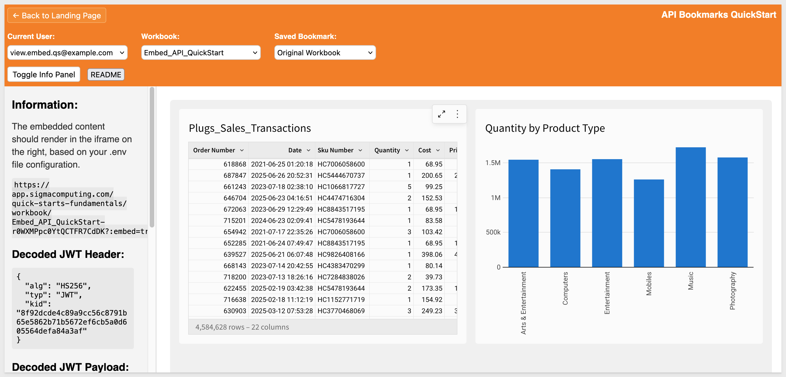
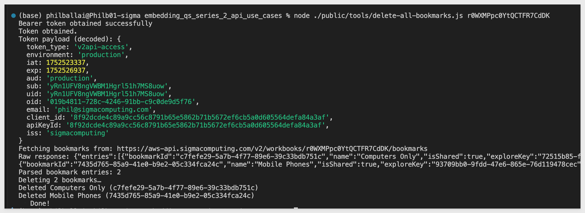

author: pballai
id: embedding_rest_api_usage_02_bookmarks
summary: embedding_rest_api_usage_02_bookmarks
categories: embedding
environments: web
status: published
feedback link: https://github.com/sigmacomputing/sigmaquickstarts/issues
tags: default
lastUpdated: 2025-07-14

# Rest API Usage 02: Bookmarks

## Overview 
Duration: 5 

This QuickStart demonstrates how to extend an embedded Sigma workbook with bookmark functionality using the Sigma REST API.

Bookmarks let us capture the current state of a user’s exploration—including filters, drill-downs, and interactions—and save it for later use. In this example, `Build` users can create bookmarks, and `View` users can select and apply saved bookmarks via a dropdown in the host application.

This approach enables more personalized, collaborative analytics experiences. It’s especially useful for SaaS providers or internal teams who want to give users the ability to revisit saved views or share context across roles — without requiring access to the full Sigma interface.

<aside class="positive">
<strong>IMPORTANT:</strong><br> This QuickStart builds on the setup from "REST API Usage 01: Getting Started". If you haven’t yet cloned the repo, installed dependencies, and configured your Sigma workspace, please follow that QuickStart first.
</aside>

[REST API Usage 01: Getting Started](https://quickstarts.sigmacomputing.com/guide/embedding_rest_api_usage_01_getting%20started_started/index.html?index=..%2F..index#0)

<aside class="positive">
<strong>IMPORTANT:</strong><br> Some screens in Sigma may appear slightly different from those shown here. This is because Sigma continuously adds and enhances functionality. Rest assured—Sigma’s intuitive interface ensures that any differences won’t prevent you from completing the QuickStart successfully.
</aside>

For more information on Sigma's product release strategy, see [Sigma product releases](https://help.sigmacomputing.com/docs/sigma-product-releases)

If something doesn’t work as expected, here's how to [contact Sigma support](https://help.sigmacomputing.com/docs/sigma-support)

### Target Audience
Developers who want to use Sigma's REST API to programmatically control Sigma in an embedded context.

### Prerequisites

<ul>
  <li>Any modern browser will work.</li>
  <li>Access to your Sigma environment.</li>
  <li>Some familiarity with Sigma is assumed. Not all steps are shown, as the basics are assumed understood.</li>
  <li>Microsoft VSCode or other suitable development tool.</li>
 </ul>

<aside class="positive">
<strong>IMPORTANT:</strong><br> Sigma recommends using non-production resources when completing QuickStarts.
</aside>

<button>[Sigma Free Trial](https://www.sigmacomputing.com/free-trial/)</button><br>

<button>[Download Visual Studio Code](https://code.visualstudio.com/download)</button>

<aside class="negative">
<strong>IMPORTANT:</strong><br> Some features may carry a "Beta" tag. Beta features are subject to quick, iterative changes. As a result, the latest product version may differ from the contents of this document.
</aside>
 


## API Embed Bookmarks
Duration: 5

If you haven't already, open the project in VSCode and start the Express server in terminal from the `embedding_qs_series_2_api_use_cases` folder:
```code
npm start
```

The server is ready when it displays: `Server listening at http://localhost:3000`.

Browse to the landing page:
```code
http://localhost:3000
```

Select the `API Embed Bookmarks` page and click `Go`:


Select the `View` user and the `Embed_API_QuickStart` workbook. 


The embed loads but there are no bookmarks in the `Saved Bookmark` list yet. The `View` user has no way to create bookmarks or explore the data further as expected:



### Create a bookmark
Let's say the `View` user has requested for the workbook only to show data for mobile phones. With this embed configuration, the `Build` user can provide that by creating a bookmark.

Switching to the `Build` user, we can set a filter on the table to display  only rows with `Project Types`:


...that are `Mobiles`:


A few things happen when we start to interact with the table, in this case selecting a column to filter on (Product Type) and then selecting a value (Mobiles).

In the console log we can see that each time, a different `exploreKey` event was emitted from Sigma. This is an important observation as we only really want to create a bookmark on the most recent `exploreKey` and this needs to be handled in the code:


In `api-embed-bookmarks/index.html`, we added an event listener to store the most recent `exploreKey`:
```code
window.addEventListener("message", (event) => {
  if (event.data?.type === "workbook:exploreKey:available") {
    latestExploreKey = event.data.exploreKey;
    if (DEBUG) console.log("Received exploreKey:", latestExploreKey);
  }
});
```

This ensures that the latest exploreKey is always stored in the global `latestExploreKey` variable.

Later, when the `Build` user clicks a `Save Bookmark` button, the value of `latestExploreKey` is passed into the API call:
```code
const response = await fetch("/api/bookmarks/create", {
  method: "POST",
  headers: { "Content-Type": "application/json" },
  body: JSON.stringify({
    workbookId,
    name: bookmarkName,
    exploreKey: latestExploreKey, // only the most recent value is sent
  }),
});
```

Once we have the table filtered, the `Bookmark Name` option appears in the application header and we can give it a name (Mobile Phones) and click `Create Bookmark`:


A popup will confirm the bookmark was created:


Click `Ok`.

The `Saved Bookmark` list now contains the new entry:


<aside class="negative">
<strong>NOTE:</strong><br> We decided to leave the "Original Workbook" selected after creating a bookmark.Another option is to set the embed to use the newly bookmarked version. Understanding the finer points of the workflow before coding will save time and improve user adoption.
</aside>

We can also select the `Mobile Phones` bookmark when using the `View` user:


<!-- END OF SECTION-->

## Project Code
Duration: 5

This QuickStart builds on the shared project structure used in "REST API Usage 01: Getting Started" and introduces new files for handling bookmark functionality.

The following files implement the logic for listing and creating bookmarks using the Sigma REST API:

### Routes Folder
**bookmarks/list.js:** Fetches all bookmarks associated with a workbook.

- Endpoint: /api/bookmarks/list?workbookUrlId=...
- Also uses `get-access-token.js` and the Sigma API endpoint `GET /v2/workbooks/{workbookId}/bookmarks`

### Helpers Folder
**create-bookmark.js:** Creates a new bookmark from a user-defined `exploreKey`. Requires `userEmail`, `workbookUrlId`, `exploreKey`, and `name`.
- Endpoint: /api/bookmarks/create-bookmark

- Also uses the Sigma API endpoint `POST /v2/workbooks/{workbookId}/bookmarks`

### api-embed-bookmarks Folder
**index.html:** Adds a dropdown menu to display saved bookmarks for the selected workbook.
- Enables Build users to name and save a bookmark for their current exploration state.
- Captures and stores the exploreKey using the `workbook:exploreKey:onchange` event.
- Applies bookmarks by updating the embed URL or by posting a `workbook:exploreKey:apply` message.


<!-- END OF SECTION-->

## Endpoint Operations Used
Duration: 5

The following is information about a few of the primary API endpoints used to enable the functionality demonstrated. 

The JWT token process has previously been detailed in the QuickStart: [Embedding 01: Getting Started](https://quickstarts.sigmacomputing.com/guide/embedding_01_getting_started_v3/index.html?index=..%2F..index#0), so we won’t cover it again here.

### GET /v2/workbooks/{workbookId}/bookmarks
Retrieves all bookmarks saved for a given workbook.

Used in:<br>
`/api/bookmarks/list` route.<br>
`loadBookmarks()` function in `index.html`.

### POST /v2/workbooks/{workbookId}/bookmarks
Creates a new bookmark from a user-defined exploration state.

- Used in `/api/bookmarks/create-bookmark` route.
- Triggered by the "Create Bookmark" button in `index.html`

Requires:
- name: Label for the bookmark
- exploreKey: The current explore state from the embedded workbook
- userEmail: Used for scoping permissions

Returns: Metadata about the created bookmark

### isShared Parameter – What It Means
When creating a bookmark via the Sigma API `POST /v2/workbooks/{workbookId}/bookmarks`, you can include the optional `isShared` flag:

- **true:**	The bookmark is shared and visible to all users who have access to the workbook.
- **false:**	The bookmark is private and only visible to the user who created it.

In this QuickStart, we default to private bookmarks although `View` users were able to access the bookmark list in this design. We’ll explore another shared bookmarks design and additional collaboration patterns in the next QuickStart.


<!-- END OF SECTION-->

## Bookmark Cleanup
Duration: 5

After creating several bookmarks for testing you may want to delete them when done. This can be done in Sigma's [API Reference](https://help.sigmacomputing.com/reference/get-started-sigma-api), but that is one at a time.

To automate this, we created a script that will:

  - Accept the short workbookUrlId as a CLI argument
  - Resolve it to the full UUID
  - Fetch all bookmarks
  - Delete them one-by-one
  - Handle errors and shows progress

<aside class="positive">
<strong>IMPORTANT:</strong><br> Be very careful as this will permanently delete all bookmarks for the specified workbook. Use at your own risk against a production instance of Sigma.
</aside>

Open terminal and run the following command, replacing {TARGET workbookID} with your actual workbook ID:
```code
node ./public/tools/delete-all-bookmarks.js {TARGET workbookID}
```

The output will list the bookmarks that were deleted:




<!-- END OF SECTION-->

## What we've covered
Duration: 5

In this QuickStart, we demonstrated how to extend your Sigma embedding experience with bookmark creation and application. Specifically, we covered:

- Detecting user-generated exploration states (`exploreKey`) from the embedded Sigma workbook.
- Creating new bookmarks via the Sigma API using the current `exploreKey`.
- Listing all existing bookmarks for a selected workbook.
- Applying a saved bookmark using outbound `postMessage` events to update the embed in real time.
- Restricting bookmark functionality to Build users only, while still allowing View users to apply saved bookmarks.

This QuickStart builds on the foundational setup from the previous one and introduces a practical use case for interactive, personalized embedding with the Sigma API.

**Additional Resource Links**

[Blog](https://www.sigmacomputing.com/blog/)<br>
[Community](https://community.sigmacomputing.com/)<br>
[Help Center](https://help.sigmacomputing.com/hc/en-us)<br>
[QuickStarts](https://quickstarts.sigmacomputing.com/)<br>

Be sure to check out all the latest developments at [Sigma's First Friday Feature page!](https://quickstarts.sigmacomputing.com/firstfridayfeatures/)
<br>

[](https://twitter.com/sigmacomputing)&emsp;
[](https://www.linkedin.com/company/sigmacomputing)&emsp;
[](https://www.facebook.com/sigmacomputing)


<!-- END OF WHAT WE COVERED -->
<!-- END OF QUICKSTART -->
